# Linear Algebra

## Vectors

Vectors have __magnitude__ and __direction__.
e.g. 5 miles/hour going east.

Which might be plotted like:

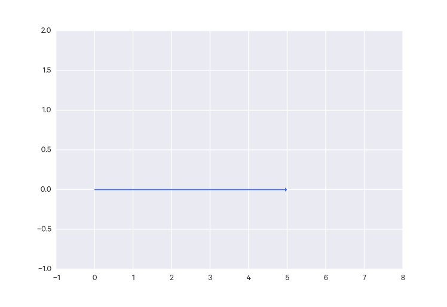

Formally, this example would be represented:

$$ \vec{v} = \begin{bmatrix} 5 \\ 0 \end{bmatrix} $$

since we are going 5 on x-axis and 0 on the y-axis.

Note that often the arrow is dropped, i.e. the vector is notated as just $v$.

### Real coordinate spaces

The notation for the 2-dimensional real coordinate space is $\Bbb R^2$, which is
all possible real-valued 2-tuples (i.e. all 2D vectors whose components are real numbers).

This can be extended, e.g. $\Bbb R^3$ denotes the 3-dimensional real coordinate
space, and so on to any n-dimensional real coordinate space ($\Bbb R^n$), e.g. a vector $[x_1, \dots, x_n]$.

To put it another way, $n$ indicates the number of components in the vector.

To denote a vector of $n$ dimensions, we write $x \in Bbb R^n$.

### Column and row vectors

A vector $x \in \Bbb R^n$ typically denotes a _column vector_, i.e. with $n$ rows and 1 column.

A _row vector_ (with 1 row and $n$ columns) can be written $x^T$ (the transpose of $x$).

### Adding vectors

Vectors are added by adding the individual corresponding components:

$$ \begin{bmatrix} 6 \\ 2 \end{bmatrix} + \begin{bmatrix} -4 \\ 4 \end{bmatrix} = \begin{bmatrix} 6 + -4 \\ 2 + 2 \end{bmatrix} = \begin{bmatrix} 2 \\ 2 \end{bmatrix} $$

### Multiplying a vector by a scalar

To multiply a vector with a scalar, you just multiply the individual components of the vector by the
scalar:

$$ 3\begin{bmatrix} 2 \\ 1 \end{bmatrix} = \begin{bmatrix} 3 \times 2 \\ 3 \times 1
\end{bmatrix} = \begin{bmatrix} 6 \\ 3 \end{bmatrix} $$

This changes the _magnitude_ of the vector, but _not the direction_.

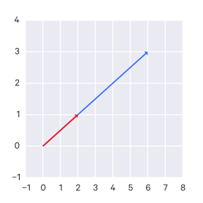

### Norms (lengths)

The __norm__ of a vector $x \in \Bbb R^n$, denoted $||x||$, is the "length" of the vector.

There are many different norms, the most common of which is the Euclidean norm (also known as the $\ell_2$ norm), denoted $||x||_2$, computed:

$$ ||x||_2 = \sqrt{ \sum^n_{i=1} x^2_i } = \sqrt{x^Tx}$$

Generally, a norm is just any function $f : \Bbb R^n \to \Bbb R$ which satisfies the following properties:

1. _non-negativity_: For all $x \in \Bbb R^n$, $f(x) \geq 0$
2. _definiteness_: $f(x) = 0$ if and only if $x=0$
3. _homogeneity_: For all $x \in \Bbb R^n, t \in \Bbb R, f(tx) = |t|f(x)$
4. _triangle inequality_: For all $x,y \in \Bbb R^n, f(x+y) \leq f(x) + f(y)$

Another norm is the $\ell_1$ norm:

$$
||x||_1 = \sum^n_{i=1} |x_i|
$$

and the $\ell_{\infty}$ norm:

$$
||x||_{\infty} = \max_i|x_i|
$$

These three norms are part of the family of $\ell_p$ norms, which are parameterized by a real number $p \geq 1$, and defined as:

$$
||x||_p = (\sum^n_{i=1} |x_i|^p)^{\frac{1}{p}}
$$

There are also norms for matrices.

### Triangle inequality

The length of the sum of two vectors is less than or equal to the sum of each of their
individual lengths:

$$ ||\vec{x} + \vec{y}|| \le ||\vec{x}|| + ||\vec{y}|| $$

### Unit vectors

Each dimension in a space has a __unit vector__, generally denoted with a hat, e.g. $\hat u$, which is a
vector constrained to that dimension (that is, it has 0 magnitude in all other dimensions), with length 1, e.g. $||\hat u|| = 1$.

Unit vectors exists for all $\Bbb R^n$.

The unit vector is also called a __normalized vector__ (which is not to be confused with a
_normal_ vector, which is something else entirely.)

To find the unit vector in the same direction as some vector
$\vec{v}$, you just do:

$$ \hat u = \frac{\vec{v}}{||\vec{v}||} $$

For instance, in $\Bbb R^2$ space, we would have two unit vectors:

$$ \hat{i} = \begin{bmatrix} 1 \\ 0 \end{bmatrix} ,\;
\hat{j} = \begin{bmatrix} 0 \\ 1 \end{bmatrix} $$

In $\Bbb R^3$ space, we would have three unit vectors:

$$ \hat{i} = \begin{bmatrix} 1 \\ 0 \\ 0 \end{bmatrix} ,\;
\hat{j} = \begin{bmatrix} 0 \\ 1 \\ 0 \end{bmatrix} ,\;
\hat{k} = \begin{bmatrix} 0 \\ 0 \\ 1 \end{bmatrix} $$

But you can have unit vectors in any direction. Say you have a vector:

$$ \vec{a} = \begin{bmatrix} 5 \\ -6 \end{bmatrix} $$

You can find a unit vector $\hat{u}$ in the direction of this vector like so:

$$ \hat{u} = \frac{\vec{a}}{||\vec{a}||} $$

so, with our example:

$$ \hat{u} = \frac{1}{||\vec{a}||}\vec{a} = \frac{1}{\sqrt{61}}\begin{bmatrix}5 \\
        -6\end{bmatrix} = \begin{bmatrix} \frac{5}{\sqrt{61}} \\ \frac{-6}{\sqrt{61}}
        \end{bmatrix}$$

### Transposing a vector

Transposing a vector means turning its rows into columns:

$$
\vec{a} = \begin{bmatrix} x_1 \\ x_2 \\ x_3 \\ x_4 \end{bmatrix}, \\
\vec{a}^T = \begin{bmatrix} x_1 & x_2 & x_3 & x_4 \end{bmatrix}
$$

### Angles between vectors

Say you have two non-zero vectors:

$$ \vec{a}, \vec{b} \in \Bbb R^n $$

We define the angle between the two vectors as $\theta$, like so:

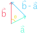

#### Law of cosines

The law of cosine tells us, that for a triangle:

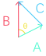

$$ C^2 = A^2 + B^2 - 2ABcos\theta $$

#### Angle between vectors

Using this law, we can get the angle between our two vectors:

$$ ||\vec{a} - \vec{b}||^2 = ||\vec{b}||^2 + ||\vec{a}||^2 - 2||\vec{a}||||\vec{b}||cos\theta $$

which simplifies to:

$$ \vec{a} \cdot \vec{b} = ||\vec{a}||||\vec{b}||cos\theta $$

There are two special cases if the vectors are collinear, that is $\vec{a} = c\vec{b}$

- If $c > 0$, then $\theta = 0$.
- If $c < 0$, then $\theta = 180^{\circ}$

### Perpendicular vectors

With the above angle calculation, you can see that if $\vec{a}$ and $\vec{b}$ are
non-zero, and their dot product is 0, that is:

$$ \vec{a} \cdot \vec{b} = \vec{0} $$

then they are perpendicular to each other.

Whenever a pair of vectors satisfies this condition $\vec{a} \cdot \vec{b} = \vec{0}$,
it is said that the two vectors are __orthogonal__.

Note that because any vector times the zero vector equals the zero vector, that is:

$$ \vec{0} \cdot \vec{x} = \vec{0} $$

Thus the zero vector is orthogonal to _everything_.

Technical detail: So if the vectors are both non-zero and orthogonal, then the vectors are _both_
perpendicular and orthogonal. But of course, since the zero vector is not non-zero, it
cannot be perpendicular to anything, but it is orthogonal to everything.

### Normal vectors

A _normal_ vector is one which is perpendicular to all the points/vectors on a plane.

That is for any vector $\vec{a}$ on the plane, and a normal vector, $\vec{n}$, to that plane, we have:

$$ \vec{n} \cdot \vec{a} = \vec{0} $$

Given an equation of a plane:

$$ Ax + By + Cz = D $$

the normal vector is simply:

$$ \vec{n} = A\hat{i} + B\hat{j} + C\hat{k} $$

### Orthonormal vectors

Given $V = \{ \vec{v_1}, \vec{v_2}, \dots, \vec{v_k} \}$ where:

- $||\vec{v_i}|| = 1$ for $i=1,2,\dots,k$. That is, the length of each vector in
$V$ is 1 (that is, they have all been normalized).
- $\vec{v_i} \cdot \vec{v_j} = 0$ for $i \neq j$. That is, these vectors are all
orthogonal to each other.

This can be summed up as:

$$ \vec{v_i} \cdot \vec{v_j} = \begin{cases} 0 & i \neq j \\ 1 & i = j \end{cases} $$

This is an __orthonormal__ set. The term comes from the fact that these vectors are all
orthogonal to each other, and they have all been normalized.

### Vector dot products

The __dot product__ (also called __inner product__) of two vectors $\vec{a}, \vec{b} \in \Bbb R^n$ (that is, they must be of the same dimension) is notated:

$$ \vec{a} \cdot \vec{b} $$

It is calculated:

$$ \begin{bmatrix} a_1 \\ a_2 \\ \vdots \\ a_n \end{bmatrix} \cdot \begin{bmatrix} b_1 \\ b_2 \\
    \vdots \\ b_n \end{bmatrix} = a_1b_1 + a_2b_2 + \dots + a_nb_n $$

That is:

$$
\vec{a}\vec{b} = \sum^n_{i=1} x_i y_i
$$

So you get a scalar value.

Note that sometimes the dot operator is dropped.

You may notice that the dot product of a vector with itself is the square of that
vector's length:

$$ \vec{a} \cdot \vec{a} = a_1^2 + a_2^2 + \dots + a_n^2 = ||\vec{a}||^2 $$

So the length of a vector can be written:

$$ ||\vec{a}|| = \sqrt{\vec{a} \cdot \vec{a}} $$

#### Intuition of dot products

The dot product between two vectors tells you how much in the same direction they're
going. So it is minimized when they are orthogonal, and maximized when they are
collinear.

#### Properties of vector dot products

- The order of the dot product doesn't matter (the _commutative property_):

    $$ \vec{a} \cdot \vec{b} = \vec{b} \cdot \vec{a} $$

- You can distribute terms in dot products (the _distributive property_):

    $$ (\vec{v} + \vec{w}) \cdot \vec{x} = (\vec{v} \cdot \vec{x} + \vec{w} \cdot \vec{x}) $$

- The _associative property_ also holds:

    $$ (c\vec{v}) \cdot \vec{w} = c(\vec{v} \cdot \vec{w}) $$

#### The Cauchy-Schwarz Inequality

Say you have two non-zero vectors:

$$ \vec{x}, \vec{y} \in \Bbb R^n $$

These are true:

- The absolute value of their dot product is less than or equal to the product of their
lengths:

    $$ |\vec{x} \cdot \vec{y}| \le ||\vec{x}|| \times ||\vec{y}|| $$

- The absolute value of their dot product will be equal to the product of their lengths
only if they are collinear (i.e. if $\vec{x} = c\vec{y}$):

    $$ |\vec{x} \cdot \vec{y}| = ||\vec{x}|| \times ||\vec{y}|| $$

### Vector outer products

For __outer products__, the two vectors do not need to be of the same dimension (i.e. $x \in \Bbb R^n, y \in \Bbb R^m$), and the result is a matrix instead of a scalar:

$$
xy \in \Bbb R^{n \times m} = \begin{bmatrix} x_1y_1 & \cdots & x_1y_m \\ \vdots & \ddots & \vdots \\ x_ny_1 & \cdots & x_ny_m \end{bmatrix}
$$

### Vector cross products

Cross products are much more limited than dot products. Dot products can be calculated
for any $\Bbb R^n$. Cross products are only defined in $\Bbb R^3$.

Unlike the dot product, which results in a scalar, the cross product results in a vector
which is orthogonal to the original vectors (i.e. it is orthogonal to the plane defined
by the two original vectors).

$$ \vec{a} = \begin{bmatrix} a_1 \\ a_2 \\ a_3 \end{bmatrix}, \vec{b} = \begin{bmatrix}
b_1 \\ b_2 \\ b_3 \end{bmatrix} $$

$$ \vec{a} \times \vec{b} = \begin{bmatrix} a_2b_3 - a_3b_2 \\ a_3b_1 - a_1b_3 \\ a_1b_2
- a_2b_1 \end{bmatrix} $$

##### Example

$$ \begin{bmatrix} 1 \\ -7 \\ 1 \end{bmatrix} \times \begin{bmatrix} 5 \\ 2 \\ 4
\end{bmatrix} = \begin{bmatrix} -7\times4 - 1\times2 \\ 1\times5 - 1\times4 \\ 1\times2 - -7\times5 \end{bmatrix} =
\begin{bmatrix} -30 \\ 1 \\ 37 \end{bmatrix} $$

#### Intuition of cross products

Cross products are kind of the opposite of dot products - the cross product is minimized
when the vectors are collinear and maximized when they are orthogonal.

#### The $sin$ of the vectors' angle

A property of the cross product is:

$$ || \vec{a} \times \vec{b} || = || \vec{a} || || \vec{b} || sin\theta $$

where $\theta$ is the angle between $\vec{a}, \vec{b}$.

## Linear Combinations

### Parametric representations of lines

Any line in an n-dimensional space can be represented using vectors.

Say you have a vector $\vec{v}$ and a set $S$ consisting of all scalar
multiplications of that vectors (where the scalar $c$ is any real number):

$$ S = \{  c\vec{v} \,|\, c \in \Bbb R \} $$

This set $S$ represents a line, since multiplying a vector with scalars does not
changes its direction, only its magnitudes, so that set of vectors covers the entirety of the line.

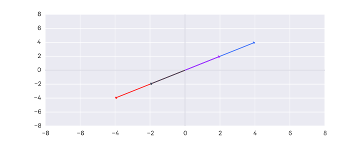

But that line is around the origin. If you wanted to shift it, you need only to add a
vector, we'll call it $\vec{x}$. So we could define a line as:

$$ L = \{  \vec{x} + c\vec{v} \,|\, c \in \Bbb R \} $$

Say you are given two vectors:

$$ \vec{a} = \begin{bmatrix} 2 \\ 1 \end{bmatrix} ,\; \vec{b} = \begin{bmatrix} 0 \\ 3
\end{bmatrix} $$

and you want to find the line that goes through them. First you need to find the vector
along that intersecting line, which is just $\vec{b} - \vec{a}$.

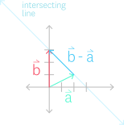

Although in standard form, that vector originates at the origin:

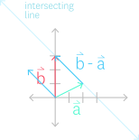

so you still need to shift it by finding the appropriate vector $\vec{x}$ to add to it. But as you can probably see, we can use our $\vec{a}$ to shift it, giving us:

$$ L = \{  \vec{a} + c(\vec{b} - \vec{a}) \,|\, c \in \Bbb R \} $$

And this works for any arbitrary $n$ dimensions! (Although in other spaces, this
wouldn't really be a "line". In $\Bbb R^3$ space, for instance, this would define a plane.)

You can convert this form to a __parametric__ equation, where the equation for a dimension of the
vector $a_i$ looks like:

$$ a_i + (b_i  - a_i)c $$

Say you are in $\Bbb R^2$ so, you might have:

$$ L = \left\lbrace  \begin{bmatrix} 0 \\ 3 \end{bmatrix} + c \begin{bmatrix} -2 \\ 2 \end{bmatrix} \,|\, c \in \Bbb R \right\rbrace $$

you can write it as the following parametric equation:

$$
\begin{aligned}
x &= 0 + -2c = -2c \\
y &= 3 + 2c = 2c + 3
\end{aligned}
$$

### Linear combinations

Say you have the following vectors in $\Bbb R^m$ :

$$ \vec{v_1}, \vec{v_2}, \dotsc, \vec{v_n} $$

A __linear combination__ is just some sum of the combination of these vectors,
  scaled by arbitrary constants ($c_1 \to c_n \in \Bbb R$):

$$ c_1\vec{v_1} + c_2\vec{v_2}, + \dotsc + c_n\vec{v_n} $$

For example:

$$ \vec{a} = \begin{bmatrix} 2 \\ 1 \end{bmatrix} ,\; \vec{b} = \begin{bmatrix} 0 \\ 3 \end{bmatrix} $$

A linear combination would be:

$$ 0\vec{a} + 0\vec{b} = \begin{bmatrix} 0 \\ 0 \end{bmatrix} $$

_Any_ vector in the space $\Bbb R^2$ can represented by some linear combination of
these two vectors.

### Spans

The set of all linear combinations for some vectors is called the __span__.

The span of some vectors can define an entire space. For instance, using our previously-defined vectors:

$$ Span(\vec{a}, \vec{b}) = \Bbb R^2 $$

But this is not always true for the span of any arbitrary set of vectors. For instance, this
does _not_ represent all the vectors in $\Bbb R^2$ :

$$ Span(\begin{bmatrix} -2 \\ -2 \end{bmatrix}, \begin{bmatrix} 2 \\ 2 \end{bmatrix}) $$

These two vectors are __collinear__ (that is, they lie along the same line), so combinations
of them will only yield other vectors along that line.

As another example, the span of the zero vector cannot represent all vectors in a space:

$$ Span(\vec{0}) $$

Formally, the span is defined as:

$$ Span(\vec{v_1}, \vec{v_2}, \dotsc, \vec{v_n}) = \{ c_1\vec{v_1} + c_2\vec{v_2}, + \dotsc + c_n\vec{v_n} \,|\, c_i \in \Bbb R \, \forall \, 1 \le i \le n \} $$

### Linear independence

The set of vectors in the previous collinear example:

$$ \left\lbrace \begin{bmatrix} -2 \\ -2 \end{bmatrix}, \begin{bmatrix} 2 \\ 2 \end{bmatrix} \right\rbrace $$

are called a __linearly dependent set__, which means that some vector in the set can
be represented as the linear combination of some of the other vectors in the set.

In this example, we could represent $\begin{bmatrix} -2 , -2 \end{bmatrix}$ using the
linear combination of the other vector, i.e. $-1\begin{bmatrix} 2 , 2 \end{bmatrix}$.

You could think of a linearly dependent set as one that contains a redundant vector -
one that doesn't add any more information to the set.

As another example:

$$ \left\lbrace \begin{bmatrix} 2 \\ 3 \end{bmatrix}, \begin{bmatrix} 7 \\ 2 \end{bmatrix}, \begin{bmatrix} 9 \\ 5 \end{bmatrix} \right\rbrace $$

is linearly dependent because $\vec{v_1} + \vec{v_2} = \vec{v_3}$.

Naturally, a set that is _not_ linearly dependent is called a __linearly independent
set__.

A more formal definition of linear dependence. A set of vectors:

$$ S = \{ \vec{v_1}, \vec{v_2}, \dotsc, \vec{v_n} \} $$

is linearly __dependent__ iff (if and only if)

$$ c_1\vec{v_1} + c_2\vec{v_2} + \dotsc + c_n\vec{v_n} = \vec{0} = \begin{bmatrix} 0 \\
        \vdots \\ 0 \end{bmatrix} $$

for some $c_i$'s where _at least one is non-zero_.

To put the previous examples in context, if you can show that at least one of the
vectors can be described by the linear combination of the other vectors in the set, that
is:

$$ \vec{v_1} = a_2\vec{v_2} + a_3\vec{v_3} + \dots + a_n\vec{v_n} $$

you have a linearly dependent set because that can be reduced to show:

$$ \vec{0} = -1\vec{v_1} + a_2\vec{v_2} + a_3\vec{v_3} + \dots + a_n\vec{v_n} $$

so you can calculate the zero vector as a linear combination of the vectors where at
least one constant is non-zero, which satifies the definition for linear dependence.

So then a set is linearly _independent_ if, to calculate the zero vector as a linear
combination of the vectors, the coefficients must all be zero.

Going back to spans, the span of set of size $n$ which is _linearly independent_ can
describe that set's entire space (e.g. $\Bbb R^n$).

#### An example problem:

Say you have the set:

$$ S = \left\lbrace \begin{bmatrix} 1 \\ -1 \\ 2 \end{bmatrix}, \begin{bmatrix} 2 \\ 1
\\ 3 \end{bmatrix}, \begin{bmatrix} -1 \\ 0 \\ 2 \end{bmatrix} \right\rbrace $$

and you want to know:

- does $Span(S) = \Bbb R^3$?
- is $S$ linearly independent?

For the first question, you want to see if any linear combination of the set yields any
arbitrary vector in $\Bbb R^3$ :

$$  c_1\begin{bmatrix} 1 \\ -1 \\ 2 \end{bmatrix}, c_2\begin{bmatrix} 2 \\ 1
\\ 3 \end{bmatrix}, c_3\begin{bmatrix} -1 \\ 0 \\ 2 \end{bmatrix} = \begin{bmatrix} a \\
        b \\ c \end{bmatrix} $$

You can distribute the coefficients:

$$  \begin{bmatrix} 1c_1 \\ -1c_1 \\ 2c_1 \end{bmatrix}, \begin{bmatrix} 2c_2 \\ 1c_2
\\ 3c_2 \end{bmatrix}, \begin{bmatrix} -1c_3 \\ 0c_3 \\ 2c_3 \end{bmatrix} = \begin{bmatrix} a \\
        b \\ c \end{bmatrix} $$

So you can break that out into a system of equations:

$$
\begin{aligned}
c_1 + 2c_2 - c_3 &= a \\
-c_1 + c_2 + 0 &= b \\
2c_1 + 3c_2 + 2c_3 &= c
\end{aligned}
$$

And solve it, which gives you:

$$
\begin{aligned}
c_3 &= \frac{1}{11}(3c - 5a + b) \\
c_2 &= \frac{1}{3}(b + a + c_3) \\
c_1 &= a - 2c_2 + c_3
\end{aligned}
$$

So it looks like you can get these coefficients from any $a, b, c$, so we can say $Span(S) = \Bbb R^3$.

For the second question, we want to see if all of the coefficients have to be non-zero
for this to be true:

$$  c_1\begin{bmatrix} 1 \\ -1 \\ 2 \end{bmatrix}, c_2\begin{bmatrix} 2 \\ 1
\\ 3 \end{bmatrix}, c_3\begin{bmatrix} -1 \\ 0 \\ 2 \end{bmatrix} = \begin{bmatrix} 0 \\
        0 \\ 0 \end{bmatrix} $$

We can just reuse the previous equations we derived for the coefficients, substituting
$a=0, b=0, c=0$, which gives us:

$$
\begin{aligned}
c_3 &= 0 \\
c_2 &= 0 \\
c_3 &= 0
\end{aligned}
$$

So we know this set is linearly independent.

## Matrices

The notation $m \times n$ in terms of matrices mean there are $m$ rows and $n$ columns.

So that matrix would look like:

$$
\mathbf A =
\begin{bmatrix}
a_{11} & a_{12} & \dots & a_{1n} \\
a_{21} & a_{22} & \dots & a_{2n} \\
\vdots & \vdots & \vdots & \vdots \\
a_{m1} & a_{m2} & \dots & a_{mn}
\end{bmatrix}
$$

A matrix of these dimensions may also be notated $\Bbb R^{m \times n}$ to indicate its membership in that set.

We refer to the entry in the $i$th row and $j$th column with the notation $\mathbf A_{ij}$.

### Matrix addition
Matrices must have the same dimensions in order to be added (or subtracted).

$$
\mathbf A =
\begin{bmatrix}
a_{11} & a_{12} & \dots & a_{1n} \\
a_{21} & a_{22} & \dots & a_{2n} \\
\vdots & \vdots & \vdots & \vdots \\
a_{m1} & a_{m2} & \dots & a_{mn}
\end{bmatrix}$$

$$
\mathbf B =
\begin{bmatrix}
b_{11} & b_{12} & \dots & b_{1n} \\
b_{21} & b_{22} & \dots & b_{2n} \\
\vdots & \vdots & \vdots & \vdots \\
b_{m1} & b_{m2} & \dots & b_{mn}
\end{bmatrix}
$$

$$
A + B =
\begin{bmatrix}
a_{11} + b_{11} & a_{12} + b_{12} & \dots & a_{1n} + b_{1n} \\
a_{21} + b_{21} & a_{22} + b_{22} & \dots & a_{2n} + b_{2n} \\
\vdots & \vdots & \vdots & \vdots \\
a_{m1} + b_{m1} & a_{m2} + b_{m2} & \dots & a_{mn} + b_{mn}
\end{bmatrix}
$$

$$ A + B = B + A $$

### Matrix-scalar multiplication
It's pretty straightforward, you just distribute the scalar:

$$
\mathbf A =
\begin{bmatrix}
a_{11} & a_{12} & \dots & a_{1n} \\
a_{21} & a_{22} & \dots & a_{2n} \\
\vdots & \vdots & \vdots & \vdots \\
a_{m1} & a_{m2} & \dots & a_{mn}
\end{bmatrix}
$$

$$
c\mathbf A =
\begin{bmatrix}
ca_{11} & ca_{12} & \dots & ca_{1n} \\
ca_{21} & ca_{22} & \dots & ca_{2n} \\
\vdots & \vdots & \vdots & \vdots \\
ca_{m1} & ca_{m2} & \dots & ca_{mn}
\end{bmatrix}
$$

### Matrix-vector products

To multiply a $m \times n$ matrix with a vector, the vector must have $n$ components
(that is, the same number of components as there are columns in the matrix, i.e. $\vec{x} \in \Bbb R^n$):

$$
\vec{x} =
\begin{bmatrix}
x_1 \\
x_2 \\
\vdots \\
x_n
\end{bmatrix}
$$

The product would be:

$$
\mathbf A \vec{x} =
\begin{bmatrix}
a_{11}x_1 + a_{12}x_2 + \dots + a_{1n}x_n \\
a_{21}x_1 + a_{22}x_2 + \dots + a_{2n}x_n \\
\vdots \\
a_{m1}x_1 + a_{m2}x_2 + \dots + a_{mn}x_n
\end{bmatrix}
$$

This results in a $m \times 1$ matrix.

#### Matrix-vector products as linear combinations

If you interpret each column in a matrix $\mathbf A$ as its own vector $\vec{v_i}$,
such that:

$$ \mathbf A = \begin{bmatrix} \vec{v_1} & \vec{v_2} & \dots & \vec{v_n} \end{bmatrix} $$

Then the product of a matrix and vector can be rewritten simply as a linear combination of those vectors:

$$
\mathbf A \vec{x} = x_1\vec{v_1} + x_2\vec{v_2} + \dots + x_n\vec{v_n}
$$

#### Matrix-vector products as linear transformations

A matrix-vector product can also be seen as a linear transformation. You can describe it as a
transformation:

$$
\begin{aligned}
\mathbf A &= \begin{bmatrix} \vec{v_1} & \vec{v_2} & \dots & \vec{v_n} \end{bmatrix} \\
T: \Bbb R^n &\to \Bbb R^m \\
T(\vec{x}) &= \mathbf A \vec{x}
\end{aligned}
$$

It satisfies the conditions for a linear transformation (not shown here),
so a matrix-vector product is always a linear transformation.

Just to be clear: the transformation of a vector can always be expressed as that
vector's product with some matrix; that matrix is referred to as the __transformation matrix__.

So in the equations above, $\mathbf A$ is the transformation matrix.

So:

- any matrix-vector product is a linear transformation
- any linear transformation can be expressed in terms of a matrix-vector product

### Matrix-matrix products

To multiply two matrices, one must have the same number of columns as the other has rows. That is, you can only multiply an $m \times n$ matrix with an $n \times p$ matrix. The resulting matrix will be of $m \times p$ dimensions.

That is, if $A \in \Bbb R^{m \times n}, B \in \Bbb R^{n \times p}$, then $C = AB \in \Bbb R^{m \times p}$.

The resulting matrix is defined as such:

$$
C_{ij} = \sum^{n}_{k=1} A_{ik} B_{kj}
$$

You can break the terms out into individual matrix-vector products. Then you combine the resulting vectors to get the final matrix.

More formally, the $i$th column of the resulting product matrix is obtained by multiplying $\mathbf A$ with the $i$th column of $\mathbf B$ for $i=1,2,\dots,k$.

$$
\begin{bmatrix}
1 & 3 & 2 \\
4 & 0 & 1
\end{bmatrix}
\times
\begin{bmatrix}
1 & 3 \\
0 & 1 \\
5 & 2
\end{bmatrix}
$$

The product would be:

$$
\begin{aligned}
\begin{bmatrix}
1 & 3 & 2 \\
4 & 0 & 1
\end{bmatrix}
\times
\begin{bmatrix}
1 \\
0 \\
5
\end{bmatrix}
&=
\begin{bmatrix}
11 \\
9
\end{bmatrix}
\\
\begin{bmatrix}
1 & 3 & 2 \\
4 & 0 & 1
\end{bmatrix}
\times
\begin{bmatrix}
3 \\
1 \\
2
\end{bmatrix}
&=
\begin{bmatrix}
10 \\
14
\end{bmatrix}
\\
\begin{bmatrix}
1 & 3 & 2 \\
4 & 0 & 1
\end{bmatrix}
\times
\begin{bmatrix}
1 & 3 \\
0 & 1 \\
5 & 2
\end{bmatrix}
&=
\begin{bmatrix}
11 & 10 \\
9 & 14
\end{bmatrix}
\end{aligned}
$$

#### Properties of matrix multiplication

Matrix multiplication is not _commutative_. That is, for matrices $\mathbf A$ and $\mathbf B$, in general  $\mathbf A \times \mathbf B \neq \mathbf B \times \mathbf A$. They may not even be of the same dimension.

Matrix multiplication is _associative_. For example, for matrices $\mathbf A, \mathbf B, \mathbf C$, we can say that:

$$ \mathbf A \times \mathbf B \times \mathbf C = \mathbf A \times (\mathbf B \times \mathbf C) = (\mathbf A \times \mathbf B) \times \mathbf C $$

There is also an _identity_ matrix $\mathbf I$. For any matrix $\mathbf A$, we can say that:

$$ \mathbf A \times \mathbf I = \mathbf I \times \mathbf A = \mathbf A $$

### The identity matrix

The __identity matrix__ is an $n \times n$ matrix where every component is 0, except for
those along the diagonal:

$$ \mathbf I_n = \begin{bmatrix}
1 & 0 & 0 & \dots & 0 \\
0 & 1 & 0 & \dots & 0 \\
0 & 0 & 1 & \dots & 0 \\
\vdots & \vdots & \vdots & \vdots & \vdots \\
0 & 0 & 0 & \dots & 1
\end{bmatrix}
$$

When you multiply the identity matrix by any vector:

$$ \mathbf I_n \vec{x} \, | \, \vec{x} \in \Bbb R^n = \begin{bmatrix} x_1 \\ x_2 \\ \vdots \\
        x_n \end{bmatrix} = \vec{x} $$

That is, a vector multiplied by the identity matrix equals itself.

### Diagonal matrices

A __diagonal matrix__ is a matrix where all non-diagonal elements are 0, typically denoted $\text{diag}(x_1, x_2, \dots, x_n)$, where

$$
D_{ij} =
\begin{cases}
d_i & i=j \\
0 & i \neq j
\end{cases}
$$

So the identity matrix is $I = \text{diag}(1, 1, \dots, 1)$.

### Some properties of matrices

#### Associative property

$$ (AB)C = A(BC) $$

i.e. it doesn't matter where the parentheses are.

This applies to compositions as well:

$$ (h \circ f) \circ g = h \circ (f \circ g) $$

#### Distributive property

$$
\begin{aligned}
A(B+C) &= AB + AC \\
(B+C)A &= BA + CA
\end{aligned}
$$

### Matrix inverses

If $\mathbf A$ is an $m \times m$ matrix, and if it has an inverse, then:

$$ \mathbf A \mathbf A^{-1} = \mathbf A^{-1} \mathbf A = \mathbf I $$

Only square matrices can have inverses. An inverse does not exist for all square matrices, but those that have one are called __invertible__ or __non-singular__, otherwise they are __non-invertible__ or __singular__.

The inverse exists if and only if $A$ is full rank.

The invertible matrices $A,B \in \Bbb R^{n \times n}$ have the following properties:

- $(A^{-1})^{-1} = A$
- If $Ax = B$, we can multiply by $A^{-1}$ on both sides to obtain $x = A^{-1}b$
- $(AB)^{-1} = B^{-1}A^{-1}$
- $(A^{-1})^T = (A^T)^{-1}$; this matrix is often denoted $A^{-T}$

### Matrix determinants

The determinant of a square matrix $A \in \Bbb R^{n \times n}$ is a function $\text{det} : \Bbb R^{n \times n} \to \Bbb R$, denoted $|A|$, $\text{det}(A)$, or sometimes with the parentheses dropped, $\text{det}A$.

#### Inverse and determinant for a $2 \times 2$ matrix

Say you have the matrix:

$$ \mathbf A = \begin{bmatrix} a & b \\ c & d \end{bmatrix} $$

You can calculate the inverse of this matrix as:

$$ \mathbf A^{-1} = \frac{1}{ad-bc} \begin{bmatrix} d & -b \\ -c & a \end{bmatrix} $$

Note that $\mathbf A^{-1}$ is undefined if $ad-bc=0$, which means that $\mathbf A$
is not invertible.

The denominator $ad-bc$ is called the __determinant__. It is notated as:

$$ Det(\mathbf A) = |\mathbf A| = ad-db $$

#### Inverse and determinant for an $n \times n$ matrix

Say we have an $n \times n$ matrix $\mathbf A$.

A submatrix of $\mathbf A_{ij}$ is an $(n-1)\times(n-1)$ matrix constructed from
$\mathbf A$ by ignoring the $i^{th}$ row and the $j^{th}$ column of $\mathbf A$, which we denote by $\mathbf A_{\lnot i, \lnot j}$.

You can calculate the determinant of an $n \times n$ matrix $\mathbf A$ by using
some $i^{th}$ row  of $\mathbf A$, where $1 \le i \le n$ :

$$
det(\mathbf A) = \sum_{j=1}^n (-1)^{i+j}a_{ij}det(\mathbf A_{\lnot i,\lnot j})
$$

All the $det(\mathbf A_{ij})$ eventually reduce to the determinant of a $2 \times 2$ matrix.

#### Scalar multiplication of determinants

$$ det(k\mathbf A) = k^ndet(\mathbf A) $$

for an $n \times n$ matrix $\mathbf A$.

#### Properties of determinants

For $A \in \Bbb R^{n \times n}, t \in \Bbb R$, multiplying a single row by the scalar $t$ yields a new matrix $B$, for which  $|B| = t|A|$.
For $A \in \Bbb R^{n \times n}$, $|A| = |A^T|$
For $A,B \in \Bbb R^{n \times n}$, $|AB| = |A||B|$
For $A,B \in \Bbb R^{n \times n}$, $|A| = 0$ if $A$ is singular (i.e. non-invertible).
For $A,B \in \Bbb R^{n \times n}$, $|A|^{-1} = \frac{1}{|A|}$ if $A$ is non-singular (i.e. invertible).

### Transpose of a matrix

The __transpose__ of a matrix $\mathbf A$ is that matrix with its columns and rows
swapped, denoted $\mathbf A^T$.

More formally, let $\mathbf A$ be an $m \times n$ matrix, and let $\mathbf B = \mathbf A^T$. Then $\mathbf B$ is an $n \times m$ matrix, and $B_{ij} = A_{ji}$.

#### Transpose of determinants

The determinant of a transpose is the same as the determinant of the original matrix:

$$ det(\mathbf A^T) = det(\mathbf A) $$

#### Transposes of sums

With matrices $A, B, C$ where $C = A + B$ :

$$ C^T = (A+B)^T = A^T + B^T $$

#### Transposes of inverses

The transpose of the inverse is equal to the inverse of the transpose:

$$ (A^{-1})^T = (A^T)^{-1} $$

#### Transposes of multiplication

$$ (AB)^T = B^TA^T $$

#### Transpose of a vector

$$ \vec{v} = \begin{bmatrix} v_1 \\ v_2 \\ \vdots \\ v_n \end{bmatrix} $$
$$ \vec{v}^T = \begin{bmatrix} v_1 & v_2 & \dots & v_n \end{bmatrix} $$

If you have another vector $\vec{w}$ with $n$ components:

$$ \vec{w} = \begin{bmatrix} w_1 \\ w_2 \\ \vdots \\ w_n \end{bmatrix} $$

You have:

$$ \vec{v} \cdot \vec{w} = \vec{w} \cdot \vec{v} = \vec{v}^T\vec{w} $$

From this we get (proof not shown):

$$ (\mathbf A \vec{x}) \cdot \vec{y} = \vec{x} \cdot (\mathbf A^T \vec{y}) $$

### Symmetric matrices

A square matrix $A \in \Bbb R^{n \times n}$ is __symmetric__ if $A = A^T$.

It is __anti-symmetric__ if $A = -A^T$.

For any square matrix $A \in Bbb R^{n \times n}$, the matrix $A + A^T$ is symmetric and the matrix $A - A^T$ is anti-symmetric. Thus any such $A$ can be represented as a sum of a symmetric and an anti-symmetric matrix:

$$
A = \frac{1}{2}(A + A^T) + \frac{1}{2}(A - A^T)
$$

Symmetric matrices have many nice properties.

The set of all symmetric matrices of dimension $n$ is often denoted as $\Bbb S^n$, so you can denote a symmetric $n \times n$ matrix $A$ as $A \in \Bbb S^n$.

#### The quadratic form

Given a square matrix $A \in \Bbb R^{n \times n}$ and a vector $x \in \Bbb R$, the scalar value $x^TAx$ is called a __quadratic form__:

$$
x^TAx = \sum^n_{i=1} \sum^n_{j=1} A_{ij}x_ix_j
$$

Here $A$ is typically assumed to be symmetric.

#### Types of symmetric matrices

Given a symmetric matrix $A \in \Bbb S^n$...

- $A$ is __positive definite__ (PD) if for all non-zero vectors $x \in \Bbb R^n, x^TAx > 0$.
    - This is often denoted $A \succ 0$ or $A > 0$.
    - The set of all positive definite matrices is denoted $\Bbb S^n_{++}$.
- $A$ is __positive semidefinite__ (PSD) if for all vectors $x \in \Bbb R^n, x^TAx \geq 0$.
    - This is often denoted $A \succeq 0$ or $A \geq 0$.
    - The set of all positive semidefinite matrices is denoted $\Bbb S^n_{+}$.
- $A$ is __negative definite__ (ND) if for all non-zero vectors $x \in \Bbb R^n, x^TAx < 0$.
    - This is often denoted $A \prec 0$ or $A < 0$.
- $A$ is __negative semidefinite__ (NSD) if for all vectors $x \in \Bbb R^n, x^TAx \leq 0$.
    - This is often denoted $A \preceq 0$ or $A \leq 0$.
- $A$ is __indefinite__ if it is neither positive semidefinite nor negative semidefinite, that is, if there exists $x_1, x_2 \in \Bbb R^n$ such that $x_1^TAx_1 > 0$ and $x_2^TAx_2 < 0$.

Some other properties of note:

- If $A$ is positive definite, then $-A$ is negative definite and vice versa.
- If $A$ is positive semidefinite, then $-A$ is negative semidefinite and vice versa.
- If $A$ is indefinite, then $-A$ is also indefinite and vice versa.
- Positive definite and negative definite matrices are always invertible.
- For any matrix $A \in R^{m \times n}$, which does not need to be symmetric or square, the matrix $G = A^TA$, called a __Gram matrix__, is always positive semidefinite.
    - If $m \geq n$ and $A$ is full rank, then $G$ is positive definite.

### The Trace

The __trace__ of a square matrix $A \in \Bbb R^{n \times n}$ is denoted $\text{tr}(A)$ and is the sum of the diagonal elements in the matrix:

$$
\text{tr}(A) = \sum^n_{i=1} A_{ii}
$$

The trace has the following properties:

- $\text{tr}(A) = \text{tr}(A^T)$
- For $B \in \Bbb R^{n \times n}$, $\text{tr}(A+B) = \text{tr}(A) + \text{tr}(B)$
- For $t \in \Bbb R$, $\text{tr}(tA) = t \text{tr}(A)$
- If $AB$ is square, then $\text{tr}(AB) = \text{tr}(BA)$
- If $ABC$ is square, then $\text{tr}(ABC) = \text{tr}(BCA) = \text{tr}(CAB)$ and so on for the product of more matrices

### Orthogonal matrix

Say we have a $n \times k$ matrix $\mathbf C$, whose column rows form an orthonormal set.

If $k=n$ then $\mathbf C$ is a square matrix ($n \times n$) and since $\mathbf C$'s columns are linearly independent, $\mathbf C$ is invertible.

For an orthonormal matrix:

$$
\begin{aligned}
\mathbf C^T \mathbf C &= \mathbf I_n \\
\mathbf C^{-1} \mathbf C &= \mathbf I_n
\end{aligned}
$$

Thus:

$$ \mathbf C^T = \mathbf C^{-1} $$

When $\mathbf C$ is an $n \times n$ matrix (i.e. square) whose columns form an orthonormal set, we
say that $\mathbf C$ is an _orthogonal matrix_.

Orthogonal matrices have the property of $C^TC = I = CC^T$.

Orthogonal matrices also have the property that operating on a vector with an orthogonal matrix will not change its Euclidean norm, i.e. $||Cx||_2 = ||x||_2$ for any $x \in \Bbb R^n$.

#### Orthogonal matrices preserve angles and lengths

For an orthogonal matrix  $\mathbf C$, when you multiply $\mathbf C$ by some vector,
the length and angle of the vector is preserved:

$$
\begin{aligned}
||\vec{x}|| &= ||\mathbf C \vec{x}|| \\
cos\theta &= cos\theta_{\mathbf C}
\end{aligned}
$$

### Adjoints

The __classical adjoint__, often just called the __adjoint__ of a matrix $A \in \Bbb R^{n \times n}$ is denoted $\text{adj}(A)$ and defined as:

$$
\text{adj}(A)_{ij} = (-1)^{i+j}|A_{\lnot j, \lnot i}|
$$

Note that the indices are switched in $A_{\lnot j, \lnot i}$.

### Reduced row echelon form

You can solve systems of equations by representing them as matrices:

$$
\begin{aligned}
x_1 + 2x_2 + x_3 + x_4 &= 7 \\
x_1 + 2x_2 + 2x_3 - x_4 &= 12 \\
2x_2 + 4x_2 + 6x_4 &= 4 \\
\end{aligned}
$$

$$
\mathbf A =
\begin{array}{c|c}
\begin{bmatrix}
    1 & 2 & 1 & 1 \\
    1 & 2 & 2 & -1 \\
    2 & 4 & 0 & 6
\end{bmatrix}
&
\begin{bmatrix} 7 \\ 12 \\ 4 \end{bmatrix}
\end{array}
$$

Now we want to convert this matrix representation $\mathbf A$ to __reduced row echelon form__,
    notated:

$$ rref(\mathbf A) $$

In reduced row echelon form, you try to reduce the matrix (like you would any system of
equations) so that:

- the leading number in each row (that is, the first non-zero value in a row from
left-to-right) is 1
- the leading number in each row is the only non-zero number in its column (called a
_pivot entry_)
- the last row is zeroed out (if possible)

The example above would be:

$$
\mathbf A =
\begin{array}{c|c}
\begin{bmatrix}
    1 & 2 & 0 & 3 \\
    0 & 0 & 1 & -2 \\
    0 & 0 & 0 & 0
\end{bmatrix}
&
\begin{bmatrix} 2 \\ 5 \\ 0 \end{bmatrix}
\end{array}
$$

## Subspaces

Say we have set of vectors $V$ which is a subset of $\Bbb R^n$,
that is, every vector in the set has $n$ components.

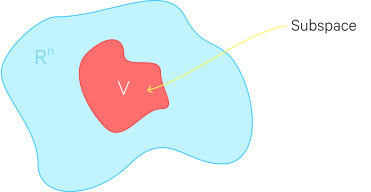

$V$ is a  _linear subspace_ of $\Bbb R^n$ if

- $V$ contains the zero vector $\vec{0}$
- for a vector $\vec{x}$ in $V$, $c\vec{x}$ (where $c \in \Bbb R$) must also be in
$V$, i.e. _closure under scalar multiplcation_.
- for a vector $\vec{a}$ in $V$ and a vector $\vec{b}$ in $V$, $\vec{a} +
\vec{b}$ must also be in $V$, i.e. _closure under addition_.

#### Example:

Say we have the set of vectors:

$$ S = \left\lbrace \begin{bmatrix} x_1 \\ x_2 \end{bmatrix} \in \Bbb R^2 \,:\, x_1 \ge
0 \right\rbrace $$

which is the shaded area below.

Is $S$ a subspace of $\Bbb R^2$?

- It does contain the zero vector
- It is closed under addition:

    $$ \begin{bmatrix} a \\ b \end{bmatrix} + \begin{bmatrix} c \\ d \end{bmatrix} =
    \begin{bmatrix} a + c \\ b + d \end{bmatrix} $$

    Since a & b are both > 0 (that was a criteria for the set), the a+b will also be
    greater than 0, so it will also be in the set (there were no constraints on the
    second component so it doesn't matter what that is)

- It is NOT closed under multiplcation:

    $$ -1\begin{bmatrix} a \\ b \end{bmatrix} = \begin{bmatrix} -a \\ -b \end{bmatrix} $$

    Since a is >= 0, -a will be <= 0, which falls outside the constraints of the set
    and thus is not contained within the set.

So no, this set is not a subspace of $\Bbb R^2$.

### Spans and subspaces

Let's say we have the set:

$$ U = Span(\vec{v_1}, \vec{v_2}, \vec{v_3}) $$

where each vector has $n$ components.
Is this a valid subspace of $\Bbb R^n$?

Since the span represents all the linear combinations of those vectors, we can define an
arbitrary vector in the set as:

$$ \vec{x} = c_1\vec{v_1} + c_2\vec{v_2} + c_3\vec{v_3} $$

- the set does contain the zero vector:

    $$ 0\vec{v_1} + 0\vec{v_2} + 0\vec{v_3} = \vec{0} $$

- it is closed under multiplication, since the following is just another linear
combination:

    $$ a\vec{x} = ac_1\vec{v_1} + ac_2\vec{v_2} + ac_3\vec{v_3} $$

- it is closed under addition, since if we take another arbitrary vector in the set:

    $$ \vec{y} = d_1\vec{v_1} + d_2\vec{v_2} + d_3\vec{v_3} $$

    and add them:

    $$ \vec{x} + \vec{y} = (c_1+d_1)\vec{v_1} + (c_2+d_2)\vec{v_2} + (c_3+d_3)\vec{v_3} $$

    that's also just another linear combination in the set.

### Basis of a subspace

If we have a subspace $V = Span(S)$ where the set
of vectors $S = \vec{v_1}, \vec{v_2}, \dots, \vec{v_n}$ is linearly independent, then we
can say that $S$ is a _basis_ for $V$.

A set $S$ is the basis for a subspace $V$ if $S$ is linearly independent and its
span defines $V$. In other words, the basis is the _minimum_ set of vectors that spans
the subspace that it is a basis of.

All bases for a subspace will have the same number of elements.

### Dimension of a subspace

The _dimension_ of a subspace is the number of elements in a basis for that
subspace.

### Nullspace of a matrix

Say we have:

$$
\mathbf A \vec{x} = \vec{0}
$$

If you have a set $N$ of all $x \in \Bbb R^n$ that satisfies this equation, do you have a valid subspace?

Of course if $\vec{x} = \vec{0}$ this equation is satisfied. So we know the zero
vector is part of this set (which is a requirement for a valid subspace).

The other two properties (closure under multiplication and addition) necessary for a
subspace also hold:

$$
\begin{aligned}
A(\vec{v_1} + \vec{v_2}) &= A\vec{v_1} + A\vec{v_2} = \vec{0} \\
A(c\vec{v_1}) &= \vec{0}
\end{aligned}
$$

and of course $\vec{0}$ is in the set $N$.

So yes, the set $N$ is a valid subspace, and it is a special subspace: the __nullspace__ of $\mathbf A$, notated:

$$ N(\mathbf A) $$

That is, the nullspace for a matrix $\mathbf A$ is the subspace described by the set of vectors
which yields the zero vector which multiplied by $\mathbf A$, that is, the set of vectors
which are the solutions for $\vec{x}$ in:

$$
\mathbf A \vec{x} = \vec{0}
$$

Or, more formally, if $\mathbf A$ is an $m \times n$ matrix:

$$ N(\mathbf A) = \{ \vec{x} \in \Bbb R^n \, | \, \mathbf A \vec{x} = \vec{0} \} $$

The nullspace for a matrix $A$ may be notated $\mathcal N(A)$.

#### Nullspace and linear independence

If you take each column in a matrix $\mathbf A$ as a vector $\vec{v_i}$, that set of
vectors is linearly independent if the nullspace of $\mathbf A$ consists of _only_ the zero
vector. That is, if:

$$ N(\mathbf A) = \{\vec{0}\} $$

The intuition behind this is because, if the linear combination of a set of vectors can
only equal the zero vector if all of its coefficients are zero (that is, its coefficients
are components of the zero vector), then it is linearly independent:

$$ x_1\vec{v_1} + x_2\vec{v_2} + \dots + x_n\vec{v_n} = \vec{0} \; iff \; \vec{x} =
\begin{bmatrix} 0 \\ 0 \\ \vdots \\ 0 \end{bmatrix} $$

#### Nullity

The __nullity__ of a nullspace is its dimension, that is, it is the number of elements in
a basis for that nullspace.

$$ dim(N(\mathbf A)) = nullity(N(\mathbf A)) $$

#### Left nullspace

The __left nullspace__ of a matrix $\mathbf A$ is the nullspace of its transpose, that
is $N(\mathbf A^T)$ :

$$ N(\mathbf A^T)  = \{ \vec{x} \, | \, \vec{x}^T \mathbf A = \vec{0}^T \} $$

### Columnspace

Again, a matrix can be represented as a set of column vectors.
The __columnspace__ of a matrix (also called the __range__ of the matrix) is all the linear combinations (i.e. the span) of these column vectors:

$$
\begin{aligned}
\mathbf A &= \begin{bmatrix} \vec{v_1} & \vec{v_2} & \dots & \vec{v_n} \end{bmatrix} \\
C(\mathbf A) &= span(\vec{v_1}, \vec{v_2}, \dots, \vec{v_n})
\end{aligned}
$$

Because any span is a valid subspace, the columnspace of a matrix is a valid subspace.

So if you expand out the matrix-vector product, you'll see that every matrix-vector
product is within that matrix's columnspace:

$$
\begin{aligned}
\{ \mathbf A \vec{x} \, &| \, \vec{x} \in \Bbb R^n \} \\
\mathbf A \vec{x} &= x_1\vec{v_1} + x_2\vec{v_2} + \dots + x_n\vec{v_n} \\
\mathbf A \vec{x} &= C(\mathbf A)
\end{aligned}
$$

That is, for any vector in the space $\Bbb R^n$, multiplying the matrix by it just
yields another linear combination of that matrix's column vectors. Therefore it is also
in the columnspace.

The columnspace (range) for a matrix $A$ may be notated $\mathcal R(A)$.

#### Rank of a columnspace

The __column rank__ of a columnspace is its dimension, that is, it is the number of elements in
a basis for that columnspace (i.e. the largest number of columns of the matrix which constitute a linearly independent set):

$$ dim(C(\mathbf A)) = rank(C(\mathbf A)) $$

#### Rowspace

The __rowspace__ of a matrix $\mathbf A$ is the columnspace of $\mathbf A^T$,
i.e. $C(\mathbf A^T)$.

The __row rank__ of a matrix is similarly the number of elements in a basis for that rowspace.

### Rank

Note that for any matrix $A$, the column rank and the row rank are equal, so they are typically just referred to as $\text{rank}(A)$.

The rank has some properties:

- For $A \in \Bbb R^{m \times n}$, $\text{rank}(A) \leq \min(m, n)$. If $\text{rank}(A) = \min(m,n)$, then $A$ is said to be __full rank__.
- For $A \in \Bbb R^{m \times n}, \text{rank}(A) = \text{rank}(A^T)$
- For $A \in \Bbb R^{m \times n}, B \in \Bbb R^{n \times p}, \text{rank}(AB) \leq \min(\text{rank}(A), \text{rank}(B))$
- For $A,B \in \Bbb R^{m \times n}, \text{rank}(A+B) \leq \text{rank}(A) + \text{rank}(B)$

### The standard basis

The set of column vectors in an identity matrix $\mathbf I_n$ is known as the
__standard basis for $\Bbb R^n$__.

Each of those column vectors is notated $\vec{e_i}$. E.g., in an identity matrix, the
column vector:

$$ \begin{bmatrix} 1 \\ 0 \\ 0 \\ \vdots \\ 0 \end{bmatrix} = \vec{e_1} $$

For a transformation $T(\vec{x})$, its transformation matrix $\mathbf A$ can be
expressed as:

$$ \mathbf A = \begin{bmatrix} T(\vec{e_1}) & T(\vec{e_2}) & \dots & T(\vec{e_n})
    \end{bmatrix} $$

### Orthogonal compliments

Given that $V$ is some subspace of $\Bbb R^n$, the __orthogonal compliment of $V$__,
notated $V^{\perp}$ :

$$ V^{\perp} = \{ \vec{x} \in \Bbb R^n \, | \, \vec{x} \cdot \vec{v} = 0 \, \forall \, \vec{v} \in V \} $$

That is, the orthogonal compliment of a subspace $V$ is the set of all vectors where
the dot product of each vector with each vector from $V$ is 0, that is where all
vectors in the set are orthogonal to all vectors in $V$.

$V^{\perp}$ is a subspace (proof not shown).

#### Columnspaces, nullspaces, and transposes

$C(\mathbf A)$ is the orthogonal compliment to $N(\mathbf A^T)$, and vice versa:

$$
\begin{aligned}
N(\mathbf A^T) &= C(\mathbf A)^{\perp} \\
N(\mathbf A^T)^{\perp} &= C(\mathbf A)
\end{aligned}
$$

$C(\mathbf A^T)$ is the orthogonal compliment to $N(\mathbf A)$, and vice versa.

$$
\begin{aligned}
N(\mathbf A) &= C(\mathbf A^T)^{\perp} \\
N(\mathbf A)^{\perp} &= C(\mathbf A^T)
\end{aligned}
$$

As a reminder, columnspaces and nullspaces are spans, i.e. sets of linear
combinations, i.e. lines, so these lines are orthogonal to each other.

#### Dimensionality and orthogonal compliments

For $V$, a subspace of $\Bbb R^n$ :

$$ dim(V) + dim(V^{\perp}) = n$$

(proof not shown here)

#### The intersection of orthogonal compliments

Since the vectors between a subspace and its orthogonal compliment are all orthogonal:

$$ V \cap V^{\perp} = \{ \vec{0} \} $$

That is, the only vector which exists both in a subspace and its orthogonal compliment
is the zero vector.

### Coordinates with respect to a basis

With a subspace $V$ of $\Bbb R^n$, we have $V$'s basis, $B$, as

$$ B = \{ \vec{v_1}, \vec{v_2}, \dots, \vec{v_k} \} $$

We can describe any vector $\vec{a} \in V$ as a linear combination of the vectors in its basis
$B$ :

$$ \vec{a} = c_1\vec{v_1} + c_2\vec{v_2} + \dots + c_k\vec{v_k} $$

We can take these coefficients $c_1, c_2, \dots, c_k$ as __the coordinates of $\vec{a}$ with respect to $B$__, notated as:

$$ [\vec{a}]_B = \begin{bmatrix} c_1 \\ c_2 \\ \vdots \\ c_k \end{bmatrix} $$

Basically what has happened here is a new coordinate system based off of the basis $B$
is being used.

##### Example

Say we have $\vec{v_1} = \begin{bmatrix} 2 \\ 1 \end{bmatrix}, \vec{v_2} = \begin{bmatrix} 1 \\ 2 \end{bmatrix}$, where $B = \{\vec{v_1}, \vec{v_2}\}$ is the
basis for $\Bbb R^2$.

The point $(8,7)$ in $\Bbb R^2$ is equal to $3\vec{v_1} + 2\vec{v_2}$. If we set:

$$ \vec{a} = 3\vec{v_1} + 2\vec{v_2} $$

Then we can describe $\vec{a}$ with respect to $B$ :

$$ [\vec{a}]_B = \begin{bmatrix} 3 \\ 2 \end{bmatrix} $$

which looks like:

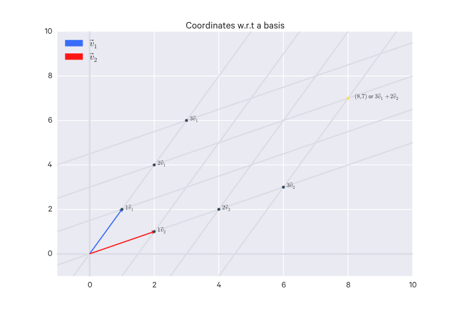

#### Change of basis matrix

Given the basis:

$$ B = \{ \vec{v_1}, \vec{v_2}, \dots, \vec{v_k} \} $$

and:

$$ [\vec{a}]_B = \begin{bmatrix} c_1 \\ c_2 \\ \vdots \\ c_k \end{bmatrix} $$

say there is some $n \times k$ matrix where the column vectors are the basis vectors:

$$ \mathbf C  = [\vec{v_1}, \vec{v_2}, \dots, \vec{v_k}] $$

We can do:

$$ \mathbf C [\vec{a}]_B = \vec{a} $$

The matrix $\mathbf C$ is known as the _change of basis matrix_ and allows us to
get $\vec{a}$ in standard coordinates.

#### Invertible change of basis matrix

Given the basis of some subspace:

$$ B = \{ \vec{v_1}, \vec{v_2}, \dots, \vec{v_k} \} $$

where $\vec{v_1}, \vec{v_2}, \dots, \vec{v_k} \in \Bbb R^n$, and we have a change of basis matrix:

$$ \mathbf C  = [\vec{v_1}, \vec{v_2}, \dots, \vec{v_k}] $$

Assume:

- $\mathbf C$ is invertible
- $\mathbf C$ is square (that is, $k=n$, which implies that we have $n$ basis
vectors, that is, $B$ is a basis for $\Bbb R^n$)
- $\mathbf C$'s columns are linearly independent (which they are because it is formed
out of basis vectors, which by definition are linearly independent)

Under these assumptions:

- If $\mathbf C$ is invertible, the span of $B$ is equal to $\Bbb R^n$.
- If the span of $B$ is equal to $\Bbb R^n$, $\mathbf C$ is invertible.

So:

$$ [\vec{a}]_B = C^{-1}\vec{a} $$

#### Transformation matrix with respect to a basis

Say we have a linear transformation $T: \Bbb R^n \to \Bbb R^n$, which we can express
as $T(\vec{x}) = \mathbf A \vec{x}$. This is with respect to the standard basis; we
can say $\mathbf A$ is the transformation for $T$ with respect to the standard
basis.

Say we have another basis $B = \{ vec{v_1}, \vec{v_2}, \dots, \vec{v_n} \}$ for $\Bbb R^n$,
that is, it is a basis for for $\Bbb R^n$.

We could write:

$$ [T(\vec{x})]_B = \mathbf D [\vec{x}]_B $$

and we call $\mathbf D$ the transformation matrix for $T$ with respect to the basis $B$.

Then we have (proof not shown):

$$ \mathbf D = \mathbf C^{-1} \mathbf A \mathbf C $$

where:

- $\mathbf D$ is the transformation matrix for $T$ with respect to the basis $B$
- $\mathbf A$ is the transformation matrix for $T$ with respect to the standard basis
- $\mathbf C$ is the change of basis matrix for $B$

### Orthonormal bases

If $B$ is an orthonormal set, it is linearly independent, and thus it could
be a basis. If $B$ _is_ a basis, then it is an __orthonormal basis__.

#### Coordinates with respect to orthonormal bases

Orthonormal bases make good coordinate systems - it is much easier to find $[\vec{x}]_B$
if $B$ is an orthonormal basis. It is just:

$$ [\vec{x}]_B = \begin{bmatrix} c_1 \\ c_2 \\ \vdots \\ c_k \end{bmatrix} =
\begin{bmatrix} \vec{v_1} \cdot \vec{x} \\ \vec{v_2} \cdot \vec{x} \\ \vdots \\ \vec{v_k}
\cdot \vec{x} \end{bmatrix} $$

Note that the standard basis for $\Bbb R^n$ is an orthonormal basis.

## Functions and transformations

Fundamentally, a function is a relationship (mapping) between the values of some set
$X$ and some set $Y$ :

$$ f:X \to Y $$

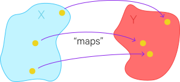

A function can map a set to itself. For example, $f(x) = x^2$, also notated $f:x
\mapsto x^2$, is the mapping of all
real numbers to all real numbers, or $f:\Bbb R \to \Bbb R$.

The set you are mapping _from_ is called the __domain__.
The set that is being mapped _to_ is called the __codomain__.
The __range__ is the subset of the codomain which the function actually maps to (a
function doesn't necessarily map to _every_ value in the codomain. But where it does,
the range = the codomain).

Functions which map to $\Bbb R$ are known as __scalar-valued__ or __real-valued__ functions.
Functions which map to $\Bbb R^n$ where $n > 1$ are known as __vector-valued__
functions.

### Identity functions

An identity function maps something to itself:

$$ I_X: X \to X $$
$$ I_X(a) = a $$
$$ for \; a \in X $$

### Vector transformations

A __transformation__ is just a function which operates on vectors, which, instead of using
$f$, is usually denoted $T$.

### Linear transformations

A __linear transformation__ is a transformation

$$ T: \Bbb R^n \to \Bbb R^m $$

where we can take two vectors $\vec{a}, \vec{b} \in \Bbb R^n$ and the following
conditions are satisfied:

$$ T(\vec{a} + \vec{b}) = T(\vec{a}) + T(\vec{b}) $$

and

$$ T(c\vec{a}) = cT(\vec{a}) $$

#### Linear transformation examples

These examples are all in $\Bbb R^2$ since it's easier to visualize. But you can scale
them up to any $\Bbb R^n$.

##### Reflection

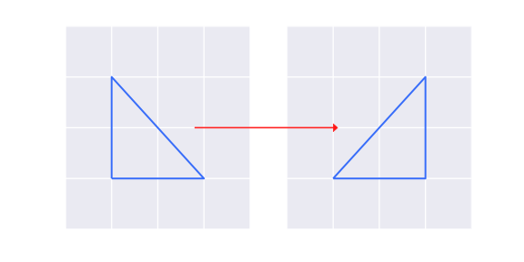

To get from the triangle on the left and reflect it over the $y$-axis to get the triangle
on the right, all you're doing is changing the sign of all the $x$ values.

So a transformation would look like:

$$ T(\begin{bmatrix} x \\ y \end{bmatrix}) = \begin{bmatrix} -x \\ y \end{bmatrix} $$

##### Scaling

Say you want to double the size of the triangle instead of flipping it. You'd just scale
up all of its values:

$$ T(\begin{bmatrix} x \\ y \end{bmatrix}) = \begin{bmatrix} 2x \\ 2y \end{bmatrix} $$

#### Compositions of linear transformation

The composition of linear transformations $S(\vec{x}) = A\vec{x}$ and $T(\vec{x}) = B\vec{x}$ is denoted:

$$ T \circ S(\vec{x}) = T(S(\vec{x})) $$

This is read: "the composition of $T$ with $S$".

If $T: Y \to Z$ and $S: X \to Y$, then $T \circ S: X \to Z$.

A composition of linear transformations is also a linear transformation (proof not shown
here). Because of this, this composition can also be expressed:

$$ T \circ S(\vec{X}) = C\vec{x} $$

Where $C = BA$ (proof not shown), so:

$$ T \circ S(\vec{X}) = BA\vec{x} $$

### Kernels

The __kernel__ of T, denoted $ker(T)$, is all of the vectors in the domain such that the
transformation of those vectors is equal to the zero vector:

$$ ker(T) = \{ \vec{x} \in \Bbb R^n \, | \, T(\vec{x}) = \{ \vec{0} \} \} $$

You may notice that, because $T(\vec{x}) = \mathbf A \vec{x}$,

$$ ker(T) = N(\mathbf A) $$

That is, the kernel of the transformation is the same as the nullspace of the
transformation matrix.

## Images

### Image of a subset of a domain

When you pass a set of vectors (i.e. a subset of a domain $\Bbb R^n$) through a transformation,
the result is called the __image of the set under the transformation__. E.g. $T(S)$ is
the image of $S$ under $T$.

For example, say we have some vectors which define the triangle on the left. When a
transformation is applied to that set, the image is the result on the right.

Another example: if we have a transformation $T: X \to Y$ and $A$ which is a subset
of $T$, then $T(A)$ is the image of $A$ under $T$, which is equivalent to the
set of transformations for each vector in $A$ :

$$ T(A) = \{ T(\vec{x}) \in Y \, | \, \vec{x} \in A \} $$

### Image of a subspace

The image of a subspace under a transformation is also a subspace. That is, if $V$ is
a subspace, $T(V)$ is also a subspace.

### Image of a transformation

If, instead of a subset or subspace, you take the transformation of an entire space,
i.e. $T(\Bbb R^n)$, the terminology is different: that is called the _image of $T$_,
notated $im(T)$.

Because we know matrix-vector products are linear transformations:

$$ T(\vec{x}) = \mathbf A \vec{x} $$

The image of a linear transformation matrix $\mathbf A$ is equivalent to its column
space, that is:

$$ im(T) = C(\mathbf A) $$

### Preimage of a set

The __preimage__ is the inverse image. For instance, consider a transformation mapping
from the domain $X$ to the codomain $Y$ :

$$ T: X \to Y $$

And say you have a set $S$ which is a subset of $Y$. You want to find the set of
values in $X$ which map to $S$, that is, the subset of $X$ for which $S$ is the
image.

For a set $S$, this is notated:

$$ T^{-1}(S) $$

Note that not every point in $S$ needs to map back to $X$. That is, $S$ may
contain some points for which there are no corresponding points in $X$. Because of this,
the image of the preimage of $S$ is not necessarily equivalent to $S$, but we can be
sure that it is at least a subset:

$$ T(T^{-1}(S)) \subseteq S $$

## Projections

A __projection__ can kind of be thought of as a "shadow" of a vector:

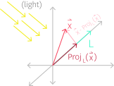

The projection of $\vec{x}$ onto line $L$ is notated:

$$ Proj_L(\vec{x}) $$

More formally, a projection of a vector $\vec{x}$ onto a line $L$ is some vector
in $L$ where $\vec{x} - Proj_L(\vec{x})$ is orthogonal to $L$.

A line can be expressed as the set of all scalar multiples of a vector, i.e:

$$ L = \{ c\vec{v} \, | \, c \in \Bbb R \} $$

So we know that "some vector in $L$" can be represented as $c\vec{v}$ :

$$ Proj_L(\vec{x}) = c\vec{v} $$

By our definition of a projection, we also know that $\vec{x} - Proj_L(\vec{x})$ is
orthogonal to $L$, which can now be rewritten as:

$$ (\vec{x} - c\vec{v}) \cdot \vec{v} = \vec{0} $$

(This is the definition of orthogonal vectors.)

Written in terms of $c$, this simplifies down to:

$$ c = \frac{\vec{x} \cdot \vec{v}}{\vec{v} \cdot \vec{v}} $$

So then we can rewrite:

$$ Proj_L(\vec{x}) = \frac{\vec{x} \cdot \vec{v}}{\vec{v} \cdot \vec{v}}\vec{v} $$

or, better:

$$ Proj_L(\vec{x}) = \frac{\vec{x} \cdot \vec{v}}{||\vec{v}||^2}\vec{v} $$

And you can pick whatever vector for $\vec{v}$ so long as it is part of line $L$.

However, if $\vec{v}$ is a unit vector, then the projection is simplified even
further:

$$ Proj_L(\vec{x}) = (\vec{x} \cdot \hat{u}) \hat{u} $$

Projections are linear transformations (they satisfy the requirements, proof not shown
here), so you can represent them as matrix-vector products:

$$ Proj_L(\vec{x}) = \mathbf A \vec{x} $$

where the transformation matrix $\mathbf A$ is:

$$ \mathbf A = \begin{bmatrix} u_1^2 & u_2u_1 \\ u_1u_2 & u_2^2 \end{bmatrix} $$

where $u_i$ are components of the unit vector.

### Projections onto subspaces

Given that $V$ is a subspace of $\Bbb R^n$, we know that $V^{\perp}$ is also a subspace of $\Bbb R^n$, and we have a vector $\vec{x}$ such that $\vec{x} \in \Bbb R^n$, we know that $\vec{x} = \vec{v} + \vec{w}$ where $\vec{v} \in V$ and $\vec{w} \in V^{\perp}$, then:

$$
\begin{aligned}
Proj_V\vec{x} &= \vec{v} \\
Proj_{V^{\perp}}\vec{x} &= \vec{w}
\end{aligned}
$$

Reminder: a projection onto a subspace is the same as a projection onto a line (a line
is a subspace):

$$ Proj_V\vec{x} = \frac{\vec{x} \cdot \vec{v}}{\vec{v}\cdot\vec{v}}\vec{v} $$

where:

$$
\begin{aligned}
V &= span(\vec{v}) \\
V &= \{ c\vec{v} \, | \, c \in \Bbb R \}
\end{aligned}
$$

So $Proj_V \vec{x}$ is the unique vector $\vec{v} \in V$ such that $\vec{x} = \vec{v} + \vec{w}$ where $\vec{w}$ is a unique member of $V^{\perp}$.

#### Projection onto a subspace as a linear transform

$$ Proj_V(\vec{x}) = \mathbf A (\mathbf A^T \mathbf A)^{-1}\mathbf A^T \vec{x} $$

where $V$ is a subspace of $\Bbb R^n$.

Note that $\mathbf A (\mathbf A^T \mathbf A)^{-1}\mathbf A^T$ is just some matrix, which we can call $\mathbf B$, so this is in the form of a linear transform, $\mathbf B \vec{x}$.

Also $\vec{v} = Proj_V\vec{x}$, so:

$$ \vec{x} = Proj_V\vec{x} + \vec{w} $$

where $\vec{w}$ is a unique member of $V^{\perp}$.

#### Projections onto subspaces with orthonormal bases

Given that $V$ is a subspace of $\Bbb R^n$ and $B = \{ \vec{v_1}, \vec{v_2}, \dots, \vec{v_k} \}$  is an
orthonormal basis for $V$. We have a vector $\vec{x} \in \Bbb R^n$, so $\vec{x} = \vec{v} + \vec{w}$ where $\vec{v} \in V$ and $\vec{w} \in V^{\perp}$.

We know (see previously) that by definition:

$$ Proj_V(\vec{x}) = \mathbf A (\mathbf A^T \mathbf A)^{-1}\mathbf A^T \vec{x} $$

which is quite complicated. It is much simpler for orthonormal bases:

$$ Proj_V(\vec{x}) = \mathbf A \mathbf A^T \vec{x} $$

## The inverse of a function

Say we have a function $f: X \to Y$, where $f(a) = b$ for any $a \in X$.

We say $f$ is __invertible__ if and only if there exists a function $f^{-1}: Y \to X$
such that $f^{-1} \circ f = I_X$ and $f \circ f^{-1} = I_Y$.

The inverse of a function is _unique_, that is, it is _surjective_ and _injective_,
that is, there is a unique $x$ for each $y$.

### Surjective functions

A __surjective__ function, also called "onto", is a function $f: X \to Y$ where, for
every $y \in Y$ there exists _at least_ one $x \in X$ such that $f(x) = y$. That
is, every $y$ has at least one corresponding $x$ value.

This can also be expressed as:

$$ im(f) = Y $$

since the image of the transformation encompasses the entire codomain $Y$. Because
of that, this can also be represented as:

$$ range(f) = Y $$

### Injective functions

An __injective__ function, also called "one-to-one", is a function $f: X \to Y$ where,
for every $y \in Y$, there exists _at most_ one $x \in X$ such that $f(x) = y$.
That is, not all $y$ necessarily has a corresponding $x$, but those that do only
have _one_ corresponding $x$.

### Surjective & injective functions

A function can be both surjective and injective, which just means that for every $y \
in Y$ there exists exactly one $x \in X$ such that $f(x) = y$, that is, every $y$
has exactly one corresponding $x$.

The inverse of a function is surjective and injective!

### Determining if a transformation is surjective

A transformation $T(\vec{x}) = \mathbf A \vec{x}$ is surjective ("onto") if the column
space of $\mathbf A$ equals the codomain:

$$ span(a_1, a_2, \dots, a_n) = C(\mathbf A) = \Bbb R^m $$

which can also be stated as:

$$ Rank(\mathbf A) = m $$

### Determining if a transformation is injective

A transformation $T(\vec{x}) = \mathbf A \vec{x}$ is injective ("one-to-one") if the
the nullspace of $\mathbf A$ contains only the zero vector:

$$ N(\mathbf A) = \{ \vec{0} \} $$

which is true if the set of $\mathbf A$'s column vectors is linearly independent.
This can also be stated as:

$$ Rank(\mathbf A) = n $$

### Determining if a transformation is invertible

A transformation is invertible if it is both injective and surjective.

For a transformation to be surjective:

$$ Rank(\mathbf A) = m $$

And for a transformation to be surjective:

$$ Rank(\mathbf A) = n $$

Therefore for a transformation to be invertible:

$$ Rank(\mathbf A) = m = n $$

So the transformation matrix $\mathbf A$ must be a square matrix.

### Inverse transformations of linear transformations

Inverse transformations are linear transformations if the original transformation is
both linear and invertible. That is, if $T$ is invertible and linear, $T^{-1}$ is
linear:

$$
\begin{aligned}
T^{-1}(\vec{x}) &= \mathbf A^{-1} \vec{x} \\
(T^{-1} \circ T)(\vec{x}) &= \mathbf A^{-1} \mathbf A \vec{x} = I_n \vec{x} = \mathbf A \mathbf A^{-1} \vec{x} = (T \circ T^{-1})(\vec{x})
\end{aligned}
$$

## Eigen-stuff

### Eigenvalues and eigenvectors

Say we have a linear transformation $T: \Bbb R^n \to \Bbb R^n$ :

$$ T(\vec{v}) = \mathbf A \vec{v} = \lambda\vec{v} $$

That is, $\vec{v}$ is scaled by a transformation matrix $\lambda$.

We say that:

- $\vec{v}$ is the _eigenvector_ for $T$
- $\lambda$ is the _eigenvalue_ associated with that eigenvector

__Eigenvectors__ are vectors for which matrix multiplication is equivalent to only a scalar
multiplication, nothing more. $\lambda$, the __eigenvalue__, is the scalar that the transformation matrix $\mathbf A$ is equivalent to.

Another way to put this:

Given a square matrix $A \in \Bbb R^{n \times n}$, we say $\lambda \in \Bbb C$ is an __eigenvalue__ of $A$ and $x \in \Bbb C^n$ is the corresponding __eigenvector__ if:

$$
Ax = \lambda x, x \neq 0
$$

Note that $\Bbb C$ refers to the set of complex numbers.

So this means that multiplying $A$ by $x$ just results in a new vector which points in the same direction has $x$ but scaled by a factor $\lambda$.

For any eigenvector $x \in \Bbb C^n$ and a scalar $t \in \Bbb C$, $A(cx) = cAx = c \lambda x = \lambda(cx)$, that is, $cx$ is also an eigenvector - but when talking about "the" eigenvector associated with $\lambda$, it is assumed that the eigenvector is normalized to length 1 (though you still have the ambiguity that both $x$ and $-x$ are eigenvectors in this sense).

Eigenvalues and eigenvectors come up when maximizing some function of a matrix.

So what are our eigenvectors? What $\vec{v}$ satisfies:

$$ \mathbf A \vec{v} = \lambda\vec{v}, \vec{v} \neq 0$$

We can do:

$$
\begin{aligned}
\mathbf A \vec{v} &= \lambda \vec{v} \\
\vec{0} &= \lambda \vec{v} - \mathbf A \vec{v}
\end{aligned}
$$

We know that $\vec{v} = \mathbf I_n \vec{v}$, so we can do:

$$
\begin{aligned}
\vec{0} &= \lambda \mathbf I_n \vec{v} - \mathbf A \vec{v} \\
\vec{0} &= (\lambda \mathbf I_n - \mathbf A)\vec{v}
\end{aligned}
$$

The first term, $\lambda \mathbf I_n - \mathbf A$, is just some matrix which we can
call $\mathbf B$, so we have:

$$ \vec{0} = \mathbf B \vec{v} $$

which, by our definition of nullspace, indicates that $\vec{v}$ is in the nullspace
of $\mathbf B$. That is:

$$ \vec{v} \in N(\lambda \mathbf I_n - \mathbf A) $$

### Properties of eigenvalues and eigenvectors

- The trace of $A$ is equal to the sum of its eigenvalues: $\text{tr}(A) = \sum^n_{i=1} \lambda_i$.
- The determinant of $A$ is equal to the product of its eigenvalues: $|A| = \prod^n_{i=1} \lambda_i$.
- The rank of $A$ is equal to the number of non-zero eigenvalues of $A$.
- If $A$ is non-singular, then $\frac{1}{\lambda_i}$ is an eigenvalue of $A^{-1}$ with associated eigenvector $x_i$, i.e. $A^{-1}x_i = (\frac{1}{\lambda_i})x_i$.
- The eigenvalues of a diagonal matrix $D = \text{diag}(d_1, \dots, d_n)$ are just the diagonal entries $d_1, \dots, d_n$.$.$.$.

### Diagonalizable matrices

All eigenvector equations can be written simultaneously as:

$$
AX = X\Lambda
$$

where the columns of $X \in \Bbb R^{n \times n}$ are the eigenvectors of $A$ and $\Lambda$ is a diagonal matrix whose entries are the eigenvalues of $A$, i.e. $\Lambda = \text{diag}(\lambda_1, \dots, \lambda_n)$.

If the eigenvectors of $A$ are linearly independent, then the matrix $X$ will be invertible, so that $A = X \Lambda X^{-1}$. A matrix that can be written in this form is called __diagonalizable__.

 ### Eigenvalues & eigenvectors of symmetric matrices

For a symmetric matrix $A \in \Bbb S^n$, the eigenvalues of $A$ are all real and the eigenvectors of $A$ are all orthonormal.

If for all of $A$'s eigenvalues $\lambda_i$...

- $\lambda_i > 0$, then $A$ is positive definite.
- $\lambda_i \geq 0$, then $A$ is positive semidefinite.
- $\lambda_i < 0$, then $A$ is negative definite.
- $\lambda_i \leq 0$, then $A$ is negative semidefinite.
- have both positive and negative values, then $A$ is indefinite.

#### Example

Say we have a linear transformation $T(\vec{x}) = \mathbf A \vec{x}$. Here are some
example values of $\vec{x}$ being input and the output vectors they yield (it's not
important here what $\mathbf A$ actually looks like, its just to help distinguish what
is and isn't an eigenvector.)

- $\mathbf A \begin{bmatrix} 1 \\ 0 \end{bmatrix} = \begin{bmatrix} 1 \\ 1 \end{bmatrix}$
    - $\vec{x}$ is not an eigenvector, it was not merely scaled by $\mathbf A$.
- $\mathbf A \begin{bmatrix} 4 \\ 7 \end{bmatrix} = \begin{bmatrix} 8 \\ 14 \end{bmatrix}$
    - $\vec{x}$ is an eigenvector, it was only scaled by $\mathbf A$. This is a
    simple example where the vector was scaled up by 2, so the eigenvalue here is 2.

### Eigenspace

The eigenvectors that correspond to an eigenvalue $\lambda$ form the __eigenspace__ for
that $\lambda$, notated $E_{\lambda}$ :

$$ E_{\lambda} = N(\lambda \mathbf I_n - \mathbf A) $$

### Eigenbasis

Say we have an $n \times n$ matrix $\mathbf A$. An __eigenbasis__ is a basis for
$\Bbb R^n$ consisting entirely of eigenvectors for $\mathbf A$.

## Least squares approximation

When there is no solution, how do you find the closest answer to a solution?

Given:

$$
\begin{aligned}
\mathbf A \vec{x} &= \vec{b} \\
\vec{x} &\in \Bbb R^k \\
\vec{b} &\in \Bbb R^n
\end{aligned}
$$

and there is no solution to $\mathbf A \vec{x} = \vec{b}$, that is, $\vec{b}$ is not
in $C(\mathbf A)$.

Say there is a __least squares approximation__, $\vec{x}^*$ where $\mathbf A \vec{x}^*$
is as close to $\vec{b}$ as possible. That is, is it minimizes the distance:

$$ || \vec{b} - \mathbf A \vec{x}^* || $$

To find the shortest distance between $\mathbf A \vec{x}^*$ and $\vec{b}$, you can
use a projection, since that is the shortest distance between those two:

$$ \mathbf A \vec{x}^* = Proj_{C(A)}\vec{b} $$

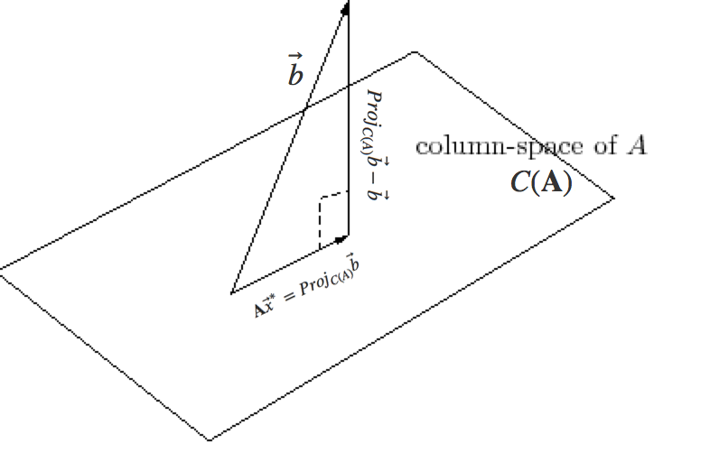

This can be rewritten as:

$$ \mathbf A^T \mathbf A \vec{x}^* = \mathbf A^T \vec{b} $$

## References

- <https://www.khanacademy.org/math/linear-algebra/vectors_and_spaces>
- Linear Algebra Review and Reference, Zico Kolter. October 16, 2007.