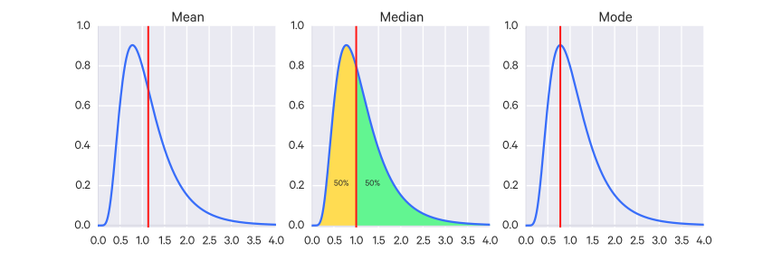
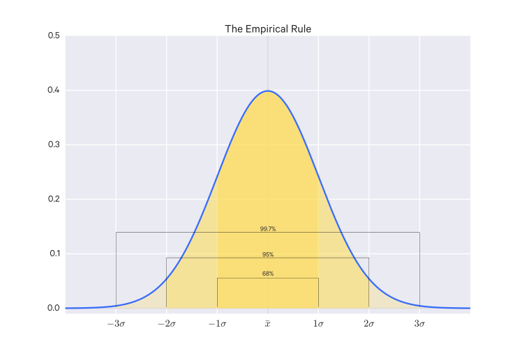

$$
\providecommand{\argmax}{\operatorname*{argmax}}
\providecommand{\argmin}{\operatorname*{argmin}}
$$

# Statistics

Broadly, statistics is concerned with collecting and analyzing data. It seeks to describe rigorous methods for collecting data (samples), for describing the data, and for inferring conclusions from the data. There are processes out there in the world that generate observable data, but these processes are often black boxes and we want to gain some insight into how they work.

## Descriptive Statistics

Descriptive statistics involves computing values which summarize a set of data. This typically includes statistics like the mean, standard deviation, median, min, max, etc, which are called __summary statistics__.

## Statistical Inference

Statistical inference is the practice of using statistics to _infer_ some conclusion about a population based on only a sample of that population. This can be the population's distribution - we want to infer from the sample data what the "true" distribution (the population distribution) is and the parameters that define it.

We can think of the population as representing the underlying data generating process and consider these parameters as functions of the population. To __estimate__ these parameters from the sample data, we use __estimators__, which are functions of the sample data that return an estimate for some unknown value. Essentially, any statistic is an estimator. For instance, we may estimate the population mean by using the sample mean as our estimator. Or we may estimate the population variance as the sample variance. And so on.

Estimators may be __biased__ for small sample sizes; that is, it tends to have more error for small sample sizes. There are __unbiased__ estimators as well, which have an expected mean error (against the population parameter) of 0. For example, an unbiased estimator for population variance $\sigma^2$ is:

$$
\frac{1}{n-1} \sum(x_i - \bar x)^2
$$

For an estimate, we can measure its __standard error__ (SE), which describes how much we expect the estimate to be off by, on average. Much of statistical inference is concerned with measuring the quality of these estimates.

(statistical inference cont'd) Or we may have some hypothesis and want to infer a conclusion about whether it is supported or invalidated.

A word of caution: many statistical tools work only under certain conditions, e.g. assumptions of independence, or for a particular distribution, or a large enough sample size, or lack of skew, and so on - so before applying statistical methods and drawing conclusions, make sure the tools are appropriate for the data. And of course you must always be cautious of potential biases involved in the data collection process.

Broadly, the two paradigms of inference are __frequentist__, which relies on long-run repetitions of an event, that is, it is _empirical_ (and could be termed the "conventional" or "traditional" framework, though there's a lot of focus on Bayesian inference now) and __Bayesian__, which is about generating a hypothesis distribution (the prior) and updating it as more evidence is acquired. Bayesian inference is valuable because there are many events which we cannot repeat, but we still want to learn something about.

Often with statistical inference you are trying to quantify some difference between groups (which can be framed as measuring an _effect size_), and then trying to determine whether or not this difference can be attributed to chance.

## more...

Generally, in statistics it assumed that data is generated by some _process_; we also assume that this data-generating process is _noisy_; that is, there is a relatively small degree of imprecision or fluctuation in values due to randomness. In inferential statistics, we try to uncover the particular function that describes this process as closely as possible. We do so by choosing a model (e.g. if we believe it can be modeled linearly, we might choose linear regression, otherwise we might choose a different kind of model such as a probability distribution). Once we have chosen the model, then we need to determine the parameters (linear coefficients, for example, or mean and variance for a probability distribution) for that model.

Here is where frequentist and Bayesian approaches begin to diverge. The frequentist believes these parameters have precise "true" values which can be (approximately) uncovered. In frequentist statistics, we can estimate these exact values. When we estimate a single value for an unknown, that estimation is called a _point estimate_. This is in contrast to describing a value estimate as a probability distribution, which is the Bayesian method. The Bayesian believes that we cannot express these parameters as single values and we should rather describe them as a distributions of possible values to be explicit about their uncertainty.

In frequentist statistics, the factor of noise means that we may see relationships (and thus come up with non-zero parameters) where they don't exist, just because of the random noise. This is what p-values are meant to compensate for - if the relationship truly did not exist, what's the probability, given the data, that we'd see the non-zero parameter estimate that we computed? Generally if this probability is less than 0.05 (i.e. $p < 0.05$) then we accept the result.

## Error

Dealing with error is a big part of statistics and some error is unavoidable (noise is natural).

There are three kinds of error:

- Systemic error (systemic flaws in the data collection, e.g. sampling bias)
- Measurement error (due to imprecise instruments, for instance)
- Random error (natural noise, due to chance, uncontrollable, but in theory its effect is minimized if many measurements are taken)

We never know the true value of something, only what we observe by imprecise means, so we always must grapple with error.

## Operationalization

_Operationalization_ is the practice of coming up with some way of measuring something which cannot be directly measured, such as intelligence. This may be accomplished via _proxy measurements_.

## Notation

- Regular letters, e.g. $X, Y$, typically denote __observed__ (known) variables
- Greek letters, e.g. $\mu, \sigma$, typically denote __unknown__ variables which we are trying to estimate
- Hats over letters, e.g. $\hat \theta$, denote estimators (an estimator is a rule for calculating an estimate given some observed data), e.g. an estimated value for a parameter.

## Scales of Measurement

In statistics, numbers and variables are categorized in certain ways. These are _scales of measurement_.

- __Nominal__ or __Categorical__: These are qualitative variables; numbers here are arbitrarily assigned to represent categories of qualities. Nominal variables can only be counted; they have no order or intervals.
    - Example: Gender, marital status
- __Ordinal__: Ordinal variables have a concept of order, so they can be arranged into some sequence accordingly and meaningfully ranked. But they are without any measure of magnitude between items in that sequence. So some object $A$ may come after some object $B$ but there is no measurement of interval between the two (we can't, for instance, say that $A$ is 10 more than $B$).
    - Example: Education level (some high school, high school, college, etc)
- __Interval__: Interval variables are like ordinal variables but do have a measure of interval between items. But they do not have an absolute zero point, so we can't compare values as ratios (we can't, for instance, say $A$ is twice of $B$).
    - Example: Dates (we can say how many days there are between two dates, but, for example, we can't say one date is twice of another)
- __Ratio__: Ratio variables are like interval variables but have a fixed and meaningful zero point, so they can be compared as ratios.
    - Example: Age, length

## Averages

The average of a set of data can be described as its __central tendency__; which gives some sense of a typical or common value for a variable. There are three types:

### Arithmetic mean
Often just called the "mean" and notated $\mu$ (mu).

For a dataset $\{x_1, \dots, x_n\}$, the arithmetic mean is:

$$ \frac{\sum_{i=1}^n x_i}{n} $$

The mean can be sensitive to extreme values (outliers), which is one reason the median is sometimes used instead. Which is to say, the median is a more __robust__ statistic (meaning that it is less sensitive to outliers).

Note that there are other types of means, but the arithmetic mean is by far the most common.

### Median
The central value in the dataset, e.g.

$$ 1 \; 1 \; \mathbf 2 \; 3 \; 4 $$
$$ median = 2 $$

If there are even number of values, you just take the value between the two central values:

$$ 1 \; 1 \; 2 \; 3 \; 4 \; 4 $$
$$ median = \frac{2+3}{2} = 2.5 $$

### Mode
The most frequently occurring value in the dataset, e.g.

$$ 1 \; 2 \; 3 \; 3 \; 2 \; 3\; 4 \; 3 $$
$$ mode = 3 $$

## Population vs Sample

With statistics we take a _sample_ of a broader _population_ in order to learn things about that population.

The mean of the population is denoted $\mu$ and consists of $N$ items, whereas the mean of the sample (i.e. the _sample mean_, sometimes called the _empirical mean_) is notated $\bar x$ or $\hat \mu$ and consists of $n$ items.

The sample mean is:

$$
\hat \mu = \frac{1}{n}\sum_i x^{(i)}
$$

The sample variance is:

$$
\hat \sigma^2 = \frac{1}{n-1} \sum_i (x^{(i)} - \hat mu)^2
$$

The sample covariance matrix is:

$$
\hat \Sigma = \frac{1}{n-1} \sum_i (x^{(i)} - \hat mu)(x^{(t)} - \hat mu)^T
$$

These estimators are unbiased, i.e.:

$$
\begin{aligned}
E[\hat \mu] &= \mu \\
E[\hat \sigma^2] &= \sigma^2 \\
E[\hat \Sigma] &= \Sigma
\end{aligned}
$$

## The Law of Large Numbers (LLN)

We say that $X_1, \dots, X_n$ are iid (_independent and identically distributed_) if they are independent and drawn from the same distribution, that is $p(X_1) = \dots = p(X_n)$. This can also be stated:

$$
p(X_1, \dots, X_n) = \prod_i p(X_i)
$$

In this case, they all share the same mean (expected value) and variance.

Let $X_1, \dots X_n$ be iid with mean $\mu$.

The __law of large numbers__ essentially states that as a sample size approaches infinity, its mean will approach the population ("true") mean:

$$
\lim_{n \to \infty} \frac{1}{n} \sum^n_{i=1} X_i = \mu
$$

## Central Limit Theorem (CLT)

Say you have a set of data. Even if the distribution of that data is not normal, you can divide the data into groups (samples) and then average the values of those groups. Those averages will approach the form of a normal curve as you increase the size of those groups (i.e. increase the sample size).

Let $X_1, \dots X_n$ be iid with mean $\mu$ and variance $\sigma^2$.

Then the central limit theorem can be formalized as:

$$
\sqrt \frac{n}{\sigma^2} ((\frac{1}{n} \sum^n_{i=1} X_i) - \mu) \xrightarrow{D} N(0,1)
$$

That is, the left side _converges in distribution_ to a normal distribution with mean 0 and variance 1 as $n$ increases.

## Dispersion (Variance and Standard Deviation)

Dispersion is the "spread" of a distribution - how spread it out its values are.

The main measures of dispersion are the variance and the standard deviation.

### Standard Deviation

Standard deviation is represented by $\sigma$ (sigma) and describes the variation from the mean ($\mu$, i.e. the expected value), calculated:

$$ \sigma = \sqrt{E[(X-\mu)^2]} = \sqrt{E[X^2] - (E[X])^2} $$

### Variance

The square of the standard deviation, that is, $E[(X-\mu)^2]$, is the __variance__ of $X$, usually notated $\sigma^2$. It can also be written:

$$ Var(X) = \sigma^2 = E(X^2) - E(X)^2 = \frac{\sum_{i=1}^N(x_i - \mu^2)}{N} $$

For a population of size $N$ of datapoints $x$.

That is, variance is the difference between the square of the inputs and the square of the expected value.

#### Coefficient of variation (CV)

Variance depends on the units of measurement, but this can be controlled for by computing the _coefficient of variation_:

$$
CV = \frac{\sigma}{\bar x} \times 100%
$$

This allows us to compare variability across variables measured in different units.

#### Variance of a linear combination of random variables

The variance of a linear combination of (independent) random variables, e.g. $aX + bY$, can be computed:

$$
Var(\beta_1 X_1 + \dots + \beta_n X_n) = \beta_1^2Var(X_1) + \dots + \beta_n^2Var(X_n)
$$

### Range

The _range_ can also be used to get a sense of dispersion. The range is the difference between the highest and lowest values, but very sensitive to outliers.

#### Interquartile range

As an alternative to the range, you can look at the _interquartile range_, which is the range of the middle 50% of the values (that is, the difference of the 75th and 25th percentile values). This is less sensitive to outliers.

## Moments

The $k$th _moment_, $m_k(X)$, where $k \in {1,2,3,\dots}$ (i.e. it is a positive integer), is $E[X^k]$. So the first moment is just the mean, $E[X]$.

The $k$th _central moment_ is $E[(X-E[X])^k]$. So the second central moment is just the variance, $E[(X-E[X])^2]$.

The third moment is the skewness, and the fourth moment is the kurtosis; they all share the same form (with different normalization terms):

$$
\begin{aligned}
\text{skewness} &= E[(X - \mu)^3 \frac{1}{\sigma^3}] \\
\text{kurtosis} &= E[(X - \mu)^4] \frac{1}{\sigma^4}
\end{aligned}
$$

Moments have different units, e.g. the first moment might be in meters ($m$), the second moment would be $m^2$, and so on, so it is typical to standardize moments by taking their $k$-th root, e.g. $\sqrt{m^2}$

### Z score

A __Z score__ is just the number of standard deviations a value is from the mean. It is defined:

$$
Z = \frac{x-\mu}{\sigma}
$$

### The Empirical Rule

The __empirical rule__ describes that, for a normal distribution, there is:

- a 68% chance that a value falls within one standard deviation
- a 95% chance that something falls within two standard deviations
- a 99.7% chance that something falls within three standard deviations

### Covariance

The __covariance__ describes the variance between two random variables.

For random variables $x$ and $y$, the covariance is^[Remember, $E(x)$ denotes the expected value of random variable $x$]:

$$ Cov(x, y) = E[(x-E(x))(y-E(y))] = \frac{1}{n} \sum (x_i - \bar x)(y_i - \bar y)$$

There must the same number of values $n$ for each.

This is simplified to:

$$ Cov(x,y) = E[xy] - E[y]E[x] \approx \bar{xy} - \bar{y}\bar{x} $$

A positive covariance means that as $x$ goes up, $y$ goes up.
A negative covariance means that as $x$ goes up, $y$ goes down.

Note that variance is just the covariance of a random variable with itself:

$$ Var(X) = E(XX) - E(X)E(X) = Cov(X, X) $$

## Correlation

Correlation gives us a measure of relatedness between two variables. Alone it does not imply causation, but it can help guide more formal inquiries (e.g. experiments) into causal relationships.

### Correlation coefficients

We can measure correlation with _correlation coefficients_. These measure the strength and sign of a relationship (but not the slope, linear regression does that).

Some of the more common correlation coefficients include:

- Pearson product-moment (used where both variables are on an interval or ratio scale)
- Spearman rank-order (where both variables are on ordinal scales)
- Phi (where both variables are on nominal/categorical/dichotomous/binary scales)
- Point biserial (where one variable is on a nominal/categorical/dichotomous/binary scale and the other is on an interval or ratio scale)

The Pearson and Spearman coefficients are the most commonly used ones, but sometimes the later two are used in special cases (e.g. with categorical data).

#### Pearson product-moment correlation coefficient (Pearson's correlation)

$$
r = \frac{\sum^n_{i=1}(\frac{x_i - \bar x}{s_x})(\frac{y_i - \bar y}{s_y})}{n-1}
$$

Note: this is sometimes denoted as a capital $R$

You may recognize this as:

$$
\frac{Cov(X,Y)}{S_X S_Y}
$$

Here we convert our values to __standard scores__, i.e. $\frac{x_i - \bar x}{s_x}$. This standardizes the values such that their mean is 0 and their variance is 1 (and so they are unitless)

For a population, $r$ is notated $\rho$ (rho).

This value can range from $[-1, 1]$, where 1 and -1 mean complete correlation and 0 means no correlation.

To test the statistical significance of the Pearson correlation coefficient, you can use the $t$ statistic.

For instance, if you believe there is a relationship between two variables, you set your null hypothesis as $\rho = 0$ and then with your estimate of $r$, calculate the $t$ statistic:

$$
t = \frac{r}{\sqrt{\frac{1-r^2}{n-2}}}
$$

Then look up the value in a $t$ table.

The Pearson correlation coefficient tells you the strength and direction of a relationship, but it doesn't tell you how much variance of one variable is explained by the other.

For that, you can use the _coefficient of determination_ which is just $r^2$. So for instance, if you have $r=0.9$, then $r^2 = 0.81$ which means 81% of the variation of one variable is explained by the other.

Note that Pearson's correlation only accurately measures linear relationships; so even if you have a Pearson correlation near 0, it is still possible that there may be a strong nonlinear relationship. It's worthwhile to look at a scatter plot to verify.

It is also not robust in the presence of outliers.

#### Spearman rank-order correlation coefficient (Spearman's rank correlation)

Here you compute ranks (i.e. the indices in the sorted sample) rather than standard scores.

For example, for the dataset $[1,10,100]$, the rank of the value $10$ is $2$ because it is second in the sorted list.

Then you can compute the Spearman correlation:

$$
r_s = 1 - \frac{(6 \sum d^2)}{n(n^2 - 1)}
$$

Where $d$ is the difference in ranks for each datapoint.

Generally, you can interpret $r_s$ in the following ways:

- $0.9 \leq r_s \leq 1$ - very strong correlation
- $0.7 \leq r_s \leq 0.9$ - strong correlation
- $0.5 \leq r_s \leq 0.7$ - moderate correlation

You can test its statistical significance using a $z$ test, where the null hypothesis is that $r_s=0$.

$$
z = r_s \sqrt{n-1}
$$

Spearman's correlation is more robust to outliers and skewed distributions.

#### Point-Biserial correlation coefficient

This correlation coefficient is useful when comparing a categorical (binary) variable with an interval or ratio scale variable:

$$
r_{pbi} = \frac{M_p - M_q}{S_t} \sqrt{pq}
$$

Where $M_p$ is the mean for the datapoints categorized as 1 and $M_q$ is the mean for the datapoints categorized as 0.
$S_t$ is the standard deviation for the interval/ratio variable, $p$ is the proportion of datapoints categorized as 1, and $q$ is the proportion of datapoints categorized as 0.

#### Phi correlation coefficient

This allows you to measure the correlation between two categorical (binary) variables.

It is calculated like so:

$$
\begin{aligned}
A &= f(0,1) \\
B &= f(1,1) \\
C &= f(0,0) \\
D &= f(1,0) \\
r_{\phi} &= \frac{AD-BC}{\sqrt{(A+B)(C+D)(A+C)(B+D)}}
\end{aligned}
$$

Where $f(a,b)$ is the frequency of label $a$ and label $b$ occurring together in the data.

### Uncovering correlation
A good way to visually intuit correlation is through scatterplots.

## Confidence Intervals / Margin of Error

The __confidence interval__ is the range of values where a value is likely to fall with some percent probability.

For example, the 95% confidence interval is the range of values in which, over repeated experimentation, in 95% of the experiemnts, that confidence interval will contain the true value. This not quite the same as saying that the confidence interval is 95% likely to contain the true value.

From the empirical rule, we know that there is a 95% probability that, for normal distributions, a given value will be within two standard deviations of the mean:

$$ \bar x \pm 2\sigma_{\bar x} $$

Here, the __margin of error__ is $2\sigma_{\bar x}$.

## Sum of Squares

### The sum of squares within (SSW)

$$ SSW = \sum_{i=1}^m (\sum{j=1}^n (x_{ij} - \bar{x_i})^2) $$

- This shows how much of SST is due to variation _within_ each group, i.e. variation
from within that group's mean.
- The degrees of freedom here is calculated $m(n-1)$.

### The sum of squares between (SSB)

$$ SSB = \sum_{i=1}^m [n_m [(\bar{x_m} - \bar{\bar{x}})^2]] $$

- This shows how much of SST is due to variation between the group means
- The degrees of freedom here is calculated $m-1$.

### The total sum of squares (SST)

$$ SST = \sum_{i=1}^m (\sum{j=1}^n (x_{ij} - \bar{\bar{x}})^2) $$
$$ SST = SSW + SSB $$

- Note: $\bar{\bar{x}}$ is the mean of means, or the "grand mean".
- This is the total variation for the groups
- The degrees of freedom here is calculated $mn - 1$.

## Hypothesis Testing - Running Experiments

With hypothesis testing, you have some sample data and an apparent effect, and you want to know if there is any reason to believe that the effect is genuine and not just by chance.

The "classical" approach to hypothesis testing, __null hypothesis significance testing__ (NHST), follows this general structure:

1. Quantify the size of the apparent effect by choosing some __test statistic__, which is just a summary statistic which is useful for hypothesis testing or identifying p-values. For example, if you have two populations you're looking at, this could be the difference in means (of whatever you are measuring) between the two groups.
2. Define a __null hypothesis__, which is usually that the apparent effect is not real.
3. Compute a __p-value__, which is the probability of seeing the effect if the null hypothesis is true.
4. Determine the __statistical significance__ of the result. The lower the p-value, the more significant the result is, since the less likely it is to have just occurred by chance.

Broadly speaking, there are two types of scientific studies: __observational__ and __experimental__.

In observational studies, the research cannot interfere while recording data; as the name implies, the involvement is merely as an observer.

Experimental studies, however, are deliberately structured and executed. They must be designed to minimize error, both at a low level (e.g. imprecise instruments or measurements) and at a high-level (e.g. researcher biases).

### Statistical Power

> The power of a study is the likelihood that it will distinguish an effect of a certain size from pure luck. - [Statistical power and underpowered statistics](http://www.statisticsdonewrong.com/power.html), Alex Reinhart

Statistical __power__, sometimes called __sensitivity__, can be defined as the probability of rejecting the null hypothesis when it is false.

If $\beta$ is the probability of a type II error (i.e. failing to reject the null hypothesis when it's false), then $\text{power} = 1 - \beta$.

Power...

- Increases as $n$ (sample size) increases
- Increases as $\sigma$ decreases (less variability)
- Is higher for a one-sided test than for its associated two-sided test

### Sample Selection

Bias can enter studies primarily in two ways:

- in the process of selecting the objects to study (sampling and retention)
- in the process of collection information _about_ the objects

To prevent selection bias (selecting samples in such a way that it encourages a particular outcome, whether done consciously or not), sample selection may be random.

In the case of medical trials and similar studies, random allocation is ideally __double blind__, so that neither the patient nor the researchers know which treatment a patient is receiving.

Another sample selection technique is __stratified sampling__, in which the population is divided into categories (e.g. male and female) and samples are selected from those subgroups. If the variable used for stratification is strongly related to the variable being studied, there may be better accuracy from the sample size.

You need large sample sizes because with small sample sizes, you're more sensitive to the effects of chance. e.g. if I flip a coin 10 times, it's feasible that I get heads 6/10 times (60% of the time). With that result I couldn't conclusively say whether or not that coin is rigged. If I flip that coin 1000 times, it's extremely unlikely that I will get heads 60% of the time (600/1000 times) if it were a fair coin.

Sometimes to increase sample size, a researcher may use a technique called "replication", which is simply repeating the measurements with new samples. but some researchers really only "pseudoreplicate". samples should be as independent from each other as possible - otherwise you have too many confounding factors. in medical research, researchers may sample a single patient multiple times, every week for instance, and treat each week's sample as a distinct sample. this is pseudoreplication - you begin to inflate other factors particular to that patient in your results. another example is - say you wanted to measure pH levels in soil samples across the US. well, you cant sample soil 15ft from each other because they are too dependent on each other:

#### References

- [Statistics Done Wrong](http://www.statisticsdonewrong.com/), Alex Reinhart

### The Null Hypothesis

In an experiment, the __null hypothesis__, notated $H_0$, is the "status quo". For example, in testing whether or not a drug has an impact on a disease, the null hypothesis would be that the drug has no effect.

When running an experiment, you do it under the assumption that the null hypothesis is true. Then you ask: what's the probability of getting the results you got, assuming the null hypothesis is true? If that probability is very small, the null hypothesis is likely false. This probability - of getting your results if the null hypothesis were true - is called the __P value__.

### Type 1 Errors

A __type 1 error__ is one where the null hypothesis is rejected, even though it is true.

Type 1 errors are usually presented as a probability of them occurring, e.g. a "0.5% chance of a type 1 error" or a "type 1 error with probability of 0.01".

### P Values

P values are central to null hypothesis significance testing (NHST), but they are commonly misunderstood.

P values _do not_:

- tell you the probability of the null hypothesis being true
- tell you the probability of _any_ hypothesis being true
- can never prove or disprove hypotheses

> There's no mathematical tool to tell you if your hypothesis is true; you can only see whether it is consistent with the data, and if the data is sparse or unclear, your conclusions are uncertain. - [Statistics Done Wrong](http://www.statisticsdonewrong.com/data-analysis.html#the-power-of-p-values), Alex Reinhart

So what is it then? The P value is the probability of seeing your results or data if the null hypothesis were true.

That is, given data $D$ and a hypothesis $H$, where $H_0$ is the null hypothesis, the P value is merely:

$$ p(D|H_0) $$

If instead we want to find the probability of our hypothesis given the data, that is, $p(H|D)$, we have to use Bayesian inference instead:

$$ p(H \, | \, D) = \frac{p(D \, | \, H)p(H)}{p(D \, | \, H)p(H) + p(D\, | \, \lnot H)p(\not H)} $$

Note that P values are problematic when testing multiple hypotheses (__multiple testing__ or __multiple comparisons__) because any "significant" results (as determined by P value comparisons, e.g. $p < 0.5$) may be deceptively so, since that result may still have just been chance, as the following comic illustrates. That is, the more significance tests you conduct, the more likely you will make a Type 1 Error.

](assets/xkcd_pvalue.png)

In this comic, 20 hypotheses are tested, so with a significance level at 5%, it's expected that at least one of those tests will come out significant by chance. In the real world this may be problematic in that multiple research groups may be testing the same hypothesis and chances may be such that one of them gets significant results.

### The Base Rate Fallacy

A very important shortcoming to be aware of is the base rate fallacy. A P value cannot be considered in isolation. The base rate of whatever occurrence you are looking at must also be taken into account. Say you are testing 100 treatments for a disease, and it's a very difficult disease to treat, so there's a low chance (say 1%) that a treatment will actually be successful. This is your base rate. A low base rate means a higher probability of false positives - treatments which, during the course of your testing, may appear to be successful but are in reality not (i.e. their success was a fluke). A good example is the mammogram test example (see [The p value and the base rate fallacy](http://www.statisticsdonewrong.com/p-value.html)).

> A p value is calculated under the assumption that the medication _does not work_ and tells us the probability of obtaining the data we did, or data more extreme than it. It does _not_ tell us the chance the medication is effective. - [The p value and the base rate fallacy](http://www.statisticsdonewrong.com/p-value.html), Alex Reinhart

#### References

- _Toward Evidence-Based Medical Statistics. 1: The P Value Fallacy_, Steven N. Goodman, MD, PhD
- _Misinterpretations of Significance: A Problem Students Share with Their Teachers?_, Heiko Haller & Stefan Krauss

### False Discovery Rate

The __false discovery rate__ is the expected proportion of false positives (Type 1 errors) amongst hypothesis tests.

For example, if we have a maximum FDR of 0.10 and we have 1000 observations which seem to indicate a significant hypothesis, then we can expect 100 of those observations to be false positives.

The __q value__ for an individual hypothesis is the minimum FDR at which the test may be called significant.

Say you run multiple comparisons and have the following values:

- $m$ = the total number of hypotheses tested (number of comparisons)
- $m_0$ = the number of true null hypotheses ($H_0$)
- $m - m_0$ = the number of true alternative hypotheses ($H_i$)
- $V$ = the number of false positives (Type 1 errors)
- $S$ = the number of true positives
- $T$ = the number of false negatives (Type 2 errors)
- $U$ = the number of true negatives
- $R = V + S$ = the number of hypotheses declared significant

We can calculate the FDR as:

$$ FDR = E[\frac{V}{V+S}] = E[\frac{V}{R}] $$

Note that $\frac{V}{R} = 0$ if $R = 0$.

### Alpha Level

The value that you select to compare the p-value to, e.g. 0.5 in the comic, is the __alpha level__ $\bar \alpha$, also called the __significance level__, of an experiment. Your alpha level should be selected according to the number of tests you'll be conducting in an experiment.

There are some approaches to help adjust the alpha level.

#### The Bonferroni Correction

The highly conservative __Bonferroni Correction__ can be used as a safeguard.

You divide whatever your significance level $\bar \alpha$ is by the number of statistical tests $t$ you're doing:

$$ \alpha_p = \frac{\bar \alpha}{t} $$

$\alpha_p$ is the per-comparison significance level which you apply for each individual test, and $\bar \alpha$ is the maximum experiment-wide significance level, called the __maximum familywise error rate__ (FWER).

#### The Sidak Correction

A more sensitive correction, the __Sidak Correction__, can also be used:

$$ \alpha_p = 1 - (1 - \bar \alpha)^{\frac{1}{n}} $$

For $n$ _independent_ comparisons, $\alpha$, the experiment-wide significance level (the FWER) is:

$$ \alpha = 1 - (1 - \alpha_p)^n $$

For $n$ _dependent_ comparisons, use:

$$ \alpha \leq n \alpha_p $$

### The Benjamini-Hochberg Procedure

Approaches like the Bonferroni correction lowers the alpha level which end up decreasing your statistical power - that is, you fail to detect false effects _as well as_ true effects.

And with such an approach, you are still susceptible to the base rate fallacy, and may still have false positives. So how can you calculate the false discovery rate? That is, what fraction of the statistically Significant results are false positives?

You can use the Benjamini-Hochberg procedure, which tells you which P values to consider statistically significant:

1. Perform your statistical tests and get the P value for each. Make a list and sort it in ascending order.
2. Choose a false-discovery rate $q$. The number of statistical tests is $m$.
3. Find the largest p value such that $p \leq \frac{iq}{m}$, where $i$ is the P value's place in the sorted list.
4. Call that P value and all smaller than it statistically significant.

> The procedure guarantees that out of all statistically significant results, no more than q percent will be false positives.
>
> The Benjamini-Hochberg procedure is fast and effective, and it has been widely adopted by statisticians and scientists in certain fields. It usually provides better statistical power than the Bonferroni correction and friends while giving more intuitive results. It can be applied in many different situations, and variations on the procedure provide better statistical power when testing certain kinds of data.
>
> Of course, it's not perfect. In certain strange situations, the Benjamini-Hochberg procedure gives silly results, and it has been mathematically shown that it is always possible to beat it in controlling the false discovery rate. But it's a start, and it's much better than nothing.

Reference: [Controlling the false discovery rate](http://www.statisticsdonewrong.com/p-value.html#controlling-the-false-discovery-rate), Alex Reinhart

### Statistical Tests

#### Two-sided tests

Asks "What is the chance of seeing an effect as big as the observed effect, without regard to its sign?" That is, you are looking for any effect, increase or decrease.

#### One-sided tests

Asks "What is the chance of seeing an effect as big as the observed effect, with the same sign?" That is, you are looking for either only an increase or decrease.

#### Unpaired t-test
The most basic statistical test, used when comparing the means from two groups. Used for small sample sizes. The t-test returns a p-value.

#### Paired t-test
The paired t-test is a t-test used when each datapoint in one group corresponds to one datapoint in the other group.

#### Chi-squared test

When comparing proportions of two populations, it is common to use the chi-squared statistic:

$$
\chi^2 = \sum_i \frac{(O_i - E_i)^2}{E_i}
$$

Where $O_i$ is the observed frequencies and $E_i$ is the expected frequencies.

Say for example you want to test if a coin is fair. You expect that, if it is fair, you should see about 50/50 heads and tails - this describes your expected frequencies. You flip the coin and observe the actual resulting frequencies - these are your observed frequencies.

The Chi squared test allows you to determine if these frequencies differ significantly.

#### ANOVA (Analysis of Variance)

ANOVA, ANCOVA, MANOVA, and MANCOVA are various ways of comparing different groups.

- ANOVA - group A is given a placebo and group B is given the actual medication and the outcome variable to compare is how many pounds were lost
- ANCOVA - same as ANOVA but now there is an additional covariate we consider, e.g. hours of exercise per day
- MANOVA and MANCOVA are multivariate counterparts to the above, for instance we may consider cholesterol levels in addition to weight loss

ANOVA is used to compare three or more groups. It uses a single test to compare the means across multiple groups simultaneously, which avoids using multiple tests to make multiple comparisons (which can lead to differences across groups resulting from chance).

There are a few requirements:

- the observations are independent within and across groups
- the data within each group are nearly normal
- the variance in the groups are about equal across groups

ANOVA tests the null hypothesis that the means across groups are the same (that is, that $\mu_1 = \dots = \mu_k$, if there are $k$ groups), with the alternate hypothesis being that at least one mean is different. We look at the variability in the sample means and see if it is so large that it is unlikely to have been due to chance. THe variability we use is the __mean square between groups__ (MSG) which has degrees of freedom $df_G = k - 1$.

The MSG is calculated:

$$
MSG = \frac{1}{df_G}SSG = \frac{1}{k-1} \sum_{i=1}^k n_i(\bar x_i - \bar x)^2
$$

Where the SSG is the __sum of squares between groups__ and $n_i$ is the sample size of group $i$ out of $k$ total groups. $\bar x$ is the mean of outcomes across all groups.

We need a value to compare the MSG to, which is the __mean square error__ (MSE), which measures the variability within groups and has degrees of freedom $df_E = n - k$.

The MSE is calculated:

$$
MSE = \frac{1}{df_E}SSE
$$

Where the SSE is the __sum of squared errors__ and is computed as:

$$
SSE = SST - SSG
$$

Where the SSG is same as before and the SST is the __sum of squares total__:

$$
\begin{aligned}
SST &= \sum_{i=1}^n(x_i - \bar x)^2 \\
SSG = \sum_{i=1}^k n_i (\bar x_i - \bar x)^2
\end{aligned}
$$

ANOVA uses a test statistic called $F$, which is computed:

$$
F = \frac{MSG}{MSE}
$$

When the null hypothesis is true, difference in variability across sample means should be due only to chance, so we expect MSG and MSE to be about equal (and thus $F$ to be close to 1).

We take this $F$ statistic and use it with a test called the __F test__, where we compute a p-value from the $F$ statistic, using the F distribution, which has the parameters $df_1 and df_2$. We expect ANOVA's $F$ statistic to follow an F distribution with parameters $df_1 = df_G, df_2 = df_E$ if the null hypothesis is true.

##### One-Way ANOVA
Similar to a t-test but used to compare three or more groups. With ANOVA, you calculate the __F statistic__, assuming the null hypothesis^[Remember that $SSB$ is the "sum of squares between" and $SSW$ is the "sum of squares within".]:

$$
F = \frac{\frac{SSB}{m-1}}{\frac{SSW}{m(n-1)}}
$$

##### Two-Way ANOVA
Allows you to compare the means of two or more groups when there are multiple variables or factors to be considered.

#### One-tailed & two-tailed tests

In a __two-tailed test__, both tails of a distribution are considered. For example, with a drug where you're looking for _any_ effect, positive or negative.

In a __one-tailed__, only one tail is considered. For example, you may be looking only for a positive or only for a negative effect.

### Squared error of the regression line

For a line $y = mx+b$, the error of a point $(x_n, x_y)$ against that line is:

$$ y_n - (mx_n + b) $$

Intuitively, this is the vertical difference between the point on the line at $x_n$
and the actual point at $x_n$.

The __squared error of the line__ is the sum of the squares of all of these errors:

$$ SE_{line} = \sum_{i=0}^n (y_i - (mx_i + b))^2 $$

To get a best fit line, you want to minimize this squared error. That is, you want to
find $m$ and $b$ which minimizes $SE_{line}$. This works out as ^[Reminder: a bar over a variable ($\bar x$) means the mean of those values. So $\bar{x^2} = \frac{x_1^2 + x_2^2 + \dots + x_n^2}{n}$]:

$$ m = \frac{\bar{x}\bar{y} - \bar{xy}}{\bar{x}^2 - \bar{x^2}} $$
$$ b = \bar{y} - m\bar{x} $$

Note that you can alternatively calculate the regression line slope $m$ as with the covariance and variance:

$$ m = \frac{cov(x,y)}{var(x)} $$

The line that these values yields is the __regression line__.

We can calculate the total variation in $y$, $SE_{\bar{y}}$, as:

$$ SE_{\bar{y}} = \sum_{i=0}^n (y_i - \bar{y})^2 $$

And then we can calculate the percentage of total variation in $y$ described by the
regression line:

$$ 1 - \frac{SE_{line}}{SE_{\bar{y}}} $$

This is known as the __coefficient of determination__ or __R-squared__.

The closer R-squared is to 1, the better a fit the line is.

## Regression to the mean

- $P(Y < x|X = x)$ gets bigger as $x$ approaches very large values. That is, given a very large $X$ (an extreme), the chance that $Y$'s value is as large as or larger than $X$ is unlikely.
- $P(Y > x|X = x)$ gets bigger as $x$ approaches very small values. That is, given a very small $X$ (an extreme), the chance that $Y$'s value is as small as or smaller than $X$ is unlikely.

## Effect Size

A big part of statistical inference is measuring _effect size_, which more generally is trying to quantify differences between groups, but typically just referred to as "effect size".

There are a few ways of measuring effect size:

### Difference in means

The difference in means, e.g. $\mu_1 - \mu_2$

But this has a few problems:

- Must be expressed in the units of measure of the mean (e.g. ft, kg, etc), so it can be difficult to compare to other studies
- Needs more context about the distributions (e.g. standard deviation) to understand if the difference is large or not

### Distribution overlap

The overlap between the two distributions:

Choose some threshold between the two means, e.g.

- The midpoint between the means: $\frac{\mu_1 + \mu_2}{2}$
- Where the PDFs cross: $\frac{\sigma_1\mu_1 + \sigma_2\mu_2}{\sigma_1 + \sigma_2}$

Count how many in the first group are below the threshold, call it $m_1$
Count how many in the second group are above the threshold, call it $m_2$.

The overlap then is:

$$
\frac{m_1}{n_1} + \frac{m_2}{n_2}
$$

Where $n_1, n_2$ are the sample sizes of the first and second groups, respectively.

This overlap can also be framed as a _misclassification rate_, which is just $\frac{\text{overlap}}{2}$.

These measures are unitless, which makes them easy to compare across studies.

### Probability of superiority

The "probability of superiority" is the probability that a randomly chosen datapoint from group 1 is greater than a randomly chosen datapoint from group 2.

This measure is also unitless.

### Cohen's $d$

Cohen's $d$ is the difference in means, divided by the standard deviation, which is computed from the pooled variance, $\sigma_p^2$, of the groups:

$$
\begin{aligned}
\sigma_p^2 &= \frac{n_1\sigma_1^2 + n_2\sigma_2^2}{n_1+n_2} \\
d &= \frac{\mu_1 - \mu_2}{\sqrt{\sigma_p^2}}
\end{aligned}
$$

This measure is also unitless.

Different fields have different intuitions about how big a $d$ value is; it's something you have to learn.

## Reliability

_Reliability_ refers to how consistent or repeatable a measurement is (for continuous data).

There are three main approaches:

### Multiple-occasions reliability

Aka _test-retest reliability_. This is how a test holds up over repeated testing, e.g. "temporal stability". This assumes the underlying metric does not change.

### Multiple-forms reliability

Aka _parallel-forms reliability_. This asks: how consistent are different tests at measuring the same thing?

### Internal consistency reliability

This asks: do the items on a test all measure the same thing?

## Agreement

_Agreement_ is similar to reliability, but used more for discrete data.

### Percent agreement

$$
\frac{\text{number of cases where tests agreed}}{\text{all cases}}
$$

Note that a high percent agreement may be obtained by chance.

### Cohen's kappa

Often just called kappa, this corrects for the possibility of chance agreement:

$$
\kappa = \frac{p_o - p_e}{1 - p_e}
$$

Where $p_o$ is the _observed agreement_, that is, $\frac{\text{num. agreement}}{\text{total cases}}$, and $p_e$ is the _expected agreement_. Kappa ranges from -1 to 1, where 1 is perfect agreement.

## Residuals

A __residual__ $e_i$ is the difference between the observed and predicted outcome, i.e.:

$$
e_i = y_i - \hat y_i
$$

This can also be thought of as the vertical distance between an observed data point and the regression line.

Fitting a line by __least squares__ minimizes $\sum_{i=1}^n e_i^2$; that is, it minimizes the __mean squared error__ (MSE) between the line and the data. But there always remain some error from the fit line; this remaining error is the residual.

$e_i$ can be interpreted as estimates of the regression error $\epsilon_i$, since we can only compute the true error if we know the true model parameters.

We can measure the quality of a linear model, which is called __goodness of fit__. One approach is to look at the variation of the residuals. You can also use the coefficient of determination ($R^2$), explained previously, which measures the variance explained by the least squares line.

### Residual (error) variation

Residual variation measures how well a regression line fits the data points.

The average squared residual (the estimated residual variance) is the same as the mean squared error, i.e. $\sigma^2 = \frac{1}{n} \sum_{i=1}^n e_i^2$.

However, to make this estimator unbiased, you're more likely to see:

$$
\hat \sigma^2 = \frac{1}{n-2} \sum_{i=1}^n e_i^2
$$

That is, with the degrees of freedom taken into account (here for intercept and slope, which both have to be estimated).

The square root of this estimated variance, $\sigma$, is the root mean squared error (RMSE).

### Total variation

The total variation is equal to the residual variation (variation after removing the predictor) plus the systematic/regression variation (the variation explained by the regression model):

$$
\sum_{i=1}^n (Y_i - \bar Y)^2 = \sum_{i=1}^n (Y_i - \hat Y_i)^2 + \sum_{i=1}^n (\hat Y_i - \bar Y)^2
$$

$R^2$ ($0 \leq R^2 \leq 1$) is the percent of total variability that is explained by the regression model, that is:

$$
R^2 = \frac{\text{regression variation}}{\text{total variation}} = \frac{\sum_{i=1}^n (\hat Y_i - \bar Y)^2}{\sum_{i=1}^n (Y_i - \bar Y)^2} = 1 - \frac{\text{residual variation}}{\text{total variation}} = 1 - \frac{\sum_{i=1}^n (Y_i - \hat Y_i)^2}{\sum_{i=1}^n (Y_i - \bar Y)^2}
$$

$R^2$ can be a misleading summary of model fit since deleting data or adding terms will inflate it.

## Point Estimation

Given an unknown population parameter, we may want to estimate a single value for it - this estimate is called a __point estimate__. Ideally, the estimate is as close to the true value as possible.

The estimation formula (the function which yields an estimate) is called an __estimator__ and is a random variable (so there is some underlying distribution). A particular value of the estimator is the __estimate__.

A simple example: we have a series of trials with some number of successes. We want an estimate for the probability of success of the event we looked at. Here an obvious estimate is be the number of successes over the total number of trials, so our estimator would be $\frac{x}{N}$ and - say we had 40 successes out of 100 trials - our estimate would be $0.4$.

We consider a "good" estimator one whose distribution is concentrated as closely as possible around the parameter's true value (that is, it has a small variance). Generally this becomes the case as more data is collected.

We can take multiple samples (of a fixed size) from a population and compute a point estimate (e.g. for the mean) from each. Then we can consider the distribution of these point estimates - this distribution is called a __sampling distribution__. The standard deviation of the sampling distribution describes the typical error of a point estimate, so this standard deviation is known as the __standard error__ (SE) of the estimate.

Alternatively, if you have only one sample, the standard error of the sample mean $\bar x$ can be computed (where $n$ is the size of the sample):

$$
SE_{\bar x} = \sigma_{\bar x} = \frac{\sigma_x}{\sqrt n}
$$

This however requires the population standard deviation, $\sigma_x$, which probably isn't known - but we can also use a point estimate for that as well; that is, you can just use $s$, the sample standard deviation, instead (provided that the sample size is at least 30, as a rule of thumb, and the population distribution is not strongly skewed).

Also remember that the distribution of sample means approximates a normal distribution, with better approximation as sample size increases, as described by the central limit theorem. Some other point estimates' sampling distribution also approximate a normal distribution. Such point estimates are called __normal point estimates__.

There are other such computations for the standard error of other estimates as well.

We say a point estimate is __unbiased__ if the sampling distribution of the estimate is centered at the parameter it estimates.

## Confidence Intervals

Rather than provide a single value estimate of a population parameter, that is, a point estimate, it can be better to provide a range of values for the estimate instead. This range of values is a __confidence interval__.

Confidence intervals are expressed in percentages, e.g. the "95% confidence interval", which describes the plausibility that the parameter is in that interval. It does not imply a probability (that is, it does not mean that the true parameter has a 95% chance of being in that interval), However. You would say "We are 95% confident the population parameter is in this interval".

The mathematical definition of the 95% confidence interval is:

$$
P(a(Y) < \theta < b(Y)|\theta) = 0.95
$$

Where $a, b$ are the endpoints of the interval, calculated according to the sampling distribution of $Y$. We condition on $\theta$ because in frequentist statistics, the parameters are fixed and the data $Y$ is random.

Confidence intervals are a tool for frequentist statistics, and in frequentist statistics, unknown parameters are considered fixed (we don't express them in terms of probability as we do in Bayesian statistics). So we do not associate a probability with the parameter. Rather, the interval itself is the random variable, not $\theta$. To put it another way, we are saying that 95% of the intervals we would generate from repeated experimentation would contain the real $\theta$ - but we aren't saying anything about $\theta$'s value changing, just that the intervals will vary across experiments.

We can compute the 95% confidence interval by taking the point estimate (which is the best estimate for the value) and $\pm 2SE$, that is build an interval within two standard errors of the point estimate. The interval we add or subtract to the point estimate (here it is $2SE$) is called the __margin of error__. The value we multiply the SE with is essentially a Z score, so we can more generally describe the margin of error as $zSE$.

For the confidence interval of the mean, we can be more precise and look within $\pm 1.96SE$ (that is, $z=1.96$) of the point estimate $\bar x$ for the 95% confidence interval (that is, our 95% confidence interval would be $\bar x \pm 1.96SE$). This is because we know to the sampling distribution for the sample means approximates a normal distribution (for sufficiently large sample sizes, $n \geq 30$ is a rule of thumb) according to the central limit theorem.

## t Distribution

For small sample sizes ($n<30$), the distribution of the sample mean deviates slightly from the normal distribution since the sample mean doesn't exactly match the population's mean. This distribution is the t-distribution.

This distribution is the t-distribution, which, for large enough sample sizes ($>=30$), converges to the normal distribution, so it may also be used for large sample sizes too.

The t-distribution has thicker tails than the normal distribution, so observations are more likely to be within two standard deviations of its mean. This allows for more accurate estimations of the standard error for small sample sizes.

The t-distribution is always centered around zero and is described by one parameter: the __degrees of freedom__. The higher the degrees of freedom, the closer the t-distribution is to the standard normal distribution.

The confidence interval is computed slightly differently for a t distribution. Instead of the Z score we use a cutoff, $t_{df}$, determined by the degrees of freedom for the distribution.

For a single sample with $n$ observations, the degrees of freedom is $df = n-1$. For two samples, you can use a computer to calculate the degrees of freedom, or you can choose the smallest sample size minus 1.

The t-distribution's corresponding test is the t-test, sometimes called the "Student t-test".

From the t-distribution we can calculate a t value:

$$ t = \frac{\bar{x}-\mu}{s/ \sqrt{n}} $$

Then we can use this t value with the t distribution with the degrees of freedom for the sample and use that to compute a p-value.

### Pooled standard deviation estimates

If you have reason to expect that the standard deviations of two populations are practically identical, you can use the __pooled standard deviation__ of the two groups to obtain a more accurate estimate of the standard deviation and standard error:

$$
s^2_{\text{pooled}} = \frac{s_1^2(n_1 - 1) + s_2^2 (n_2 -1)}{n_1 + n_2 -2}
$$

Where $n_1, n_2, s_1, s_2$ are the sample sizes and standard deviations of the sample groups. We must update the degrees of freedom as well, $df = n_1 + n_2 - 2$, which we can use for a new t-distribution.

## Regression

__Regression__ involves fitting a model to data. The goal is to understand the relationship between one set of variables - the __dependent__ or __response__ or __target__ or __outcome__ or __explained__ variables (e.g. $y$) - and another set - the __independent__ or __explanatory__ or __predictor__ or __regressor__ variables (e.g. $X$ or $x$). In cases of just one dependent and one explanatory variable, we have __simple regression__. In scenarios with more than one explanatory variable, we have __multiple regression__. In scenarios with more than one dependent variable, we have __multivariate regression__.

With __linear regression__ we expect that the dependent and explanatory variables have a linear relationship; that is, can be expressed as a __linear combination__ of random variables, i.e.:

$$
y = \beta_0 + \beta_1 x_1 + \dots + \beta_n x_n + \varepsilon
$$

For some dependent variable $y$ and explanatory variables $x_1, \dots, x_n$, where $\varepsilon$ is the residual due to random variation or other noisy factors.

Of course, we do not know the true values for these $\beta$ parameters (also called __regression coefficients__) so they end up being point estimates as well. We can estimate them as follows.

When given data, one technique we can use is __ordinary least squares__, sometimes just called __least squares regression__, which looks for parameters $\beta_0, \dots, \beta_n$ such that the sum of the squared residuals (i.e. the SSE, i.e. $e_1^2 + \dots + e_n^2 = \sum_{i=1}^n (y_i - \hat y_i)^2$) is minimized (this minimization requirement is called the __least squares criterion__). The resulting line is called the __least squares line__.

Note that _linear model_ does not mean the model is necessarily a _straight_ line. It can be polynomial as well - but you can think of the polynomial terms as additional explanatory variables; looking at it this way, the line (or curve, but for consistency, they are all called "lines") still follows the form above. And of course, in higher-dimensions (that is, for multiple regression) we are not dealing with lines but planes, hyperplanes, and so on. But again, for the sake of simplicity, they are all just referred to as "lines".

For example, the line:

$$
y = \beta_0 + \beta_1 x_1 + \beta_2 x_1^2 + \varepsilon
$$

Can be re-written:

$$
\begin{aligned}
x_2 &= x_1^2 \\
y &= \beta_0 + \beta_1 x_1 + \beta_2 x_2 + \varepsilon
\end{aligned}
$$

When we use a regression model to predict a dependent variable, e.g. $y$, we denote it as a estimate by putting a hat over it, e.g. $\hat y$.

### Evaluating model quality

We can measure our model's quality by measuring the variance explained, that is, with $R^2$. Here we can use this formulation of it:

$$
R^2 = 1 - \frac{\text{variability in residuals}}{\text{variability in the outcome}} = 1 - \frac{Var(e_i)}{Var(y_i)}
$$

For multiple regression, we use a slightly different formulation, called __adjusted__ $R^2$, because in multiple regression the regular $R^2$ is a biased estimate:

$$
R_{\text{adj}}^2 = 1 - \frac{Var(e_i)}{Var(y_i)} \frac{n-1}{n-k-1}
$$

Where $n$ is the sample size used to fit the model and $k$ is the number of predictor variables in the model.

A higher $R^2$ or adjusted $R^2$ indicates a better model fit.

Alternatively, you can measure model quality using p-values. Your null hypothesis is that the true linear model has slope zero, and your alternate hypothesis is that it has a non-zero slope (you can limit to less than 0 or greater than 0 depending on what your fit model is showing you; e.g. if your fit model has a positive slope, then your alternate hypothesis is that the true linear model has a positive slope).

So to test the hypothesis, you'd identify a standard error for the estimated parameters, compute the appropriate test statistic (usually a t value), and then identify the p-value.

For example, say your linear model has the slope -1. You could compute your t value $T$, once you have your standard error, like so:

$$
T = \frac{\text{estimate} - \text{null value}}{SE} = \frac{-1 - 0}{SE}
$$

### Outliers

Outliers can pose a problem for fitting a regression line. Outliers that fall horizontally away from the rest of the data points can influence the line more, so they are called points with __high leverage__. Any such point that actually does influence the line's slope is called an __influential point__. You can examine this effect by removing the point and then fitting the line again and seeing how it changes.

Outliers should only be removed with good reason - they can still be useful and informative and a good model will be able to capture them in some way.

### Extrapolation

With linear models, you should avoid __extrapolation__, that is, estimating values which are outside the original data's range. For example, if you have data in some range $[x_1, x_n]$, you have no guarantee that your model behaves correctly at $x < x_1$ and $x > x_n$.

### Collinearity

Sometimes in multiple regression you may have predictor variables which are correlated with one another; we say that these predictors are __collinear__.

### Model Selection

When you have a set of different explanatory variables (i.e. multiple regression), you have to decide which ones to include and which ones to toss out. This process is an example of __model selection__.

The model where you include all available explanatory variables is called the __full model__. But sometimes including all explanatory variables can hurt prediction accuracy.

There are a few model selection strategies that are used.

One class of selection strategies is called __stepwise__ model selection because they iteratively remove or add one explanatory variable at a time, measuring the goodness of fit for each. The two approaches here are the __backward-elimination__ strategy which begins with the full model and removes one explanatory variable at a time, and the __forward-selection__ strategy which is the reverse of backward-elimination, starting with one explanatory variable and adding the rest one at a time. These two strategies don't necessarily lead to the same model; if you use both, pick the one with the better adjusted $R^2$ score.

### Logistic regression

Linear regression is good for explaining continuous dependent variables. But for discrete variables, linear regression gives ambiguous results - what does a fractional result mean? It can't be interpreted as a probability because linear regression models are not bound to $[0, 1]$ as probability functions must be.

When dealing with boolean/binary dependent variables you can use __logistic regression__. When dealing with non-binary discrete dependent variables, you can use __Poisson regression__ (which is a GLM that uses the log link function).

So we expect the logistic regression function to output a probability. In linear regression, the model can output any value, not bound to $[0, 1]$. So for logistic regression we apply a transformation, most commonly the __logit transformation__, so that our resulting values can be interpreted as probability:

$$
\begin{aligned}
\text{transformation}(p) &= \beta_0 + \beta_1 x_1 + \dots + \beta_n x_n \\
logit(p) &= log_e (\frac{p}{1 - p})
\end{aligned}
$$

So if we solve the original regression equation for $p$, we end up with:

$$
p = \frac{e^{\beta_0 + \beta_1 x_1 + \dots + \beta_n x_n}}{1 + e^{\beta_0 + \beta_1 x_1 + \dots + \beta_n x_n}}
$$

Logistic regression does not have a closed form solution - that is, it can't be solved in a finite number of operations, so we must estimate its parameters using other methods, more specifically, we use iterative methods. Generally the goal is to find the __maximum likelihood estimate__ (MLE), which is the set of parameters that maximizes the likelihood of the data. So we might start with random guesses for the parameters, the compute the likelihood of our data (that is, we can compute the probability of each data point; the likelihood of the data is the product of these individual probabilities) based on these parameters. We iterate until we find the parameters which maximize this likelihood.

### Generalized linear models (GLM)

We can use linear models for non-regression situations - that is, when the output variable is not an unbounded continuous value directly computed from the inputs (that is, the output variable is not a linear function of the inputs), such as with binary or other kinds of classification. In such cases, the linear models we used are called _generalized linear models_. Like any linear function, we get some value from our inputs, but we then also apply a _link function_ which transforms the resulting value into something we can use. Another way of putting it is that these link functions allow us to _generalize_ linear models to other situations.

Linear regression also assumes _homoscedasticity_; that is, that the variance of the error is uniform along the line. GLMs do not need to make this assumption; the link function transforms the data to satisfy this assumption.

For example, say you want to predict whether or not someone will buy something - this is a binary classification and we want either a 0 or a 1. We might come up with some linear function based on income and number of items purchased in the last month, but this won't give us a 0/no or a 1/yes, it will give us some continuous value. So then we apply some link function of our choosing which turns the resulting value to give us the probability of a 1/yes.

Linear regression is also a GLM, where the link function is the identity function.

Logistic regression uses the logit link function.

Logistic regression is a type of models called __generalized linear models__ (GLM), which involves two steps:

1. Model the response variable with a probability distribution.
2. Model the distribution's parameters using the predictor variables and a special form of multiple regression.

This probability distribution is taken from the exponential family of probability distributions, which includes the normal, Bernoulli, beta, gamma, Dirichlet, and Poisson distributions (among others). A distribution is in the exponential family if it can be written in the form:

$$
p(y|n) = b(y) \exp(\eta^T T(y) - a(\eta))
$$

$\eta$ is known as the __natural parameter__ or the __canonical parameter__ of the distribution, $T(y)$ is the __sufficient statistics__, which is often just $T(y) = y$. $a(\eta)$ is the __log partition function__.

We can set $T, a, b$ to define a family of distributions; this family is parameterized by $\eta$, with different values giving different distributions within the family.

For instance, the Bernoulli distribution is in the exponential family, where

$$
\begin{aligned}
\eta &= \log(\frac{p}(1-p)) \\
T(y) &= y \\
a(\eta) &= -log(1-p) \\
b(y) &= 1
\end{aligned}
$$

Same goes for the Gaussian distribution, where

$$
\begin{aligned}
\eta &= \mu \\
T(y) &= y \\
a(\eta) &= \frac{\mu^2}{2} \\
b(y) &= \frac{1}{\sqrt(2\pi)}\exp(\frac{-y^2}{2})
\end{aligned}
$$

## Linear Mixed Models (LMM), or just "Mixed Models" or "Hierarchical Linear Models"

In a linear model there may be _mixed effects_, which includes _fixed_ and _random_ effects. Fixed effects are variables in your model where their coefficients are fixed (non-random). Random effects are variables in your model where their coefficients are random.

For example, say you want to create a model for crop yields given a farm and amount of rainfall. We have data from several years and the same farms are represented multiple times throughout. We could consider that some farms may be better at producing greater crop yields given the same amount of rainfall as another farm. So we expect that samples from different farms will have different variances - e.g. if we look at just farm A's crop yields, that sample would have different variance than if we just looked at farm B's crop yields. In this regard, we might expect that models for farm A and farm B will be somewhat different.

The naive approach would be to just ignore differences between farms and consider only rainfall as a fixed effect (i.e. with a fixed/constant coefficient). This is sometimes called "pooling" because we've lumped everything (in our case, all the farms) together.

We could create individual models for each farm ("no pooling") but perhaps for some farms we only have one or two samples. For those farms, we'd be building very dubious models since their sample sizes are so small. The information from the other farms are still useful for giving us more data to work with in these cases, so no pooling isn't necessarily a good approach either.

We can use a mixed model ("partial pooling") to capture this and make it so that the rainfall coefficient random, varying by farm.

#### more...from another source

We may run into situations like the following:

Where our data seems to encompass multiple models (the red, green, blue, and black ones going up from left to right), but if we try to model them all simultaneously, we get a complete incorrectly model (the dark grey line going down from left to right).

Each of the true lines (red, green, blue, black) may come from distinct _units_, i.e. each could represent a different part of the day or a different US state, etc. When there are different effects for each unit, we say that there is _unit heterogeneity_ in the data.

In the example above, each line has a different intercept. But the slopes could be different, or both the intercepts and slopes could be different:

In this case, we use a random-effects model because some of the coefficients are random.

For instance, in the first example above, the intercepts varied, in which case the intercept coefficient would be replaced with a random variable $\alpha^i$ drawn from the normal distribution:

$$
y = \alpha^i + \beta^i x + \epsilon
$$

Or in the case of the slopes varying, we'd say that $\beta^i$ is a random variable drawn from the normal distribution. In each case, $\alpha$ is the mean intercept and $\beta$ is the mean slope.

When both slope and intercept vary, we draw them together from a multivariate normal distribution since they may have some relation, i.e.

$$
\begin{bmatrix}
\alpha_i \\
\beta_i
\end{bmatrix}
\sim \Phi(\begin{bmatrix} \alpha \\ \beta \end{bmatrix}, \Sigma)
$$

Now consider when there are multiple levels of these effects that we want to model. For instance, perhaps there are differences across US states but also differences across US regions.

In this case, we will have a hierarchy of effects. Let's say only the intercept is affected - if we wanted to model the effects of US regions and US states on separate levels, then the $\alpha_i$ will be drawn from a distribution according to the US region, $\alpha_i \sim \Phi(\mu_{\text{region}}, \sigma^2_\alpha)$, and then the regional mean which parameterizes $\alpha_i$'s distribution is drawn from a distribution of regional means, $\mu_{\text{region}} \sim \Phi(\mu, \sigma_r^2)$.

##### References

- POLS 509: Hierarchical Linear Models. Justin Esarey. <https://www.youtube.com/watch?v=g_4z6o7XZbQ>

## Time Series Analysis

Often data has a temporal component; e.g. you are looking for patterns over time.

Generally, time series data may have the following parts: a __trend__, which is some function reflecting persistent changes, __seasonality__; that is, periodic variation, and of course there is going to be some noise - random variation - as well.

### Moving averages

To extract a trend from a series, you can use regression, but sometimes you will be better off with some kind of __moving average__. This divides the series into overlapping regions, __windows__, of some size, and takes the averages of each window. The __rolling mean__ just takes the mean of each window. There is also the __exponentially-weighted moving average__ (EWMA) which gives a weighted average, such that more recent values have the highest weight, and values before that have weights which drop off exponentially. The EWMA takes an additional __span__ parameter which determines how fast the weights drop off.

### Serial correlation (autocorrelation)

In time series data you may expect to see patterns. For example, if a value is low, it may stay low for a bit, if it's high, it may stay high for a bit. These types of patterns are __serial correlations__, also called __autocorrelation__ (so-called because it is correlated a dataset with itself, in some sense), because the values correlate in their sequence.

You can compute serial correlation by shifting the time series by some interval, called a __lag__, and then compute the correlation of the shifted series with the original, unshifted series.

## Survival Analysis

Survival analysis describes how long something lasts. It can refer to the survival of, for instance, a person - in the context of disease, a 5-year survival rate is the probability of surviving 5 years after diagnosis, for example - or a mechanical component, and so on. More broadly it can be seen as looking at how long something lasts until something happens - for instance, how long until someone gets married.

A __survival curve__ is a function $S(t)$ which computes the probability of surviving longer than duration $t$. Such a duration is called a _lifetime_.

The survival curve ends up just being the complement of the CDF:

$$
S(t) = 1 - CDF(t)
$$

Looking at it this way, the CDF is the probability of a lifetime _less than or equal_ to $t$.

### Hazard function

A __hazard function__, which tells you the fraction of cases that continue until $t$ and then end at $t$. It can be computed from the survival curve:

$$
\lambda(t) = \frac{S(t) - S(t+1)}{S(t)}
$$

Hazard functions are also used for estimating survival curves.

### Estimating survival curves: Kaplan-Meier estimation

Often we do not have the CDF of lifetimes so we can't easily compute the survival curve. We often have non-survival cases alongside have survival cases, where we don't yet know what their final lifetime will be. Often, as is the case in the medical context, we don't want to wait to learn what these unknown lifetimes will be. So we need to estimate the survival curve with the data we do have.

The Kaplan-Meier estimation allows us to do this. We can use the data we have to estimate the hazard function, and then convert that into a survival curve.

We can convert a hazard function into an estimate of the survival curve, where each point at time $t$ is computed by taking the product of complementary hazard functions through that time $t$, like so:

$$
\prod_t (1 - \lambda(t))
$$

## Transforming data

Occasionally you may find data easier to work with if you apply a __transformation__ to it; that is, rescale it in some way. For instance, you might take the natural log of your values, or the square root, or the inverse. This can reduce skew and the effect of outliers or make linear modeling easier.

The function which applies this transformation is called a __link function__.

## Resampling

Resampling involves repeatedly drawing subsamples from an existing sample.

Resampling is useful for assessing and selecting models and for estimating the precision of parameter estimates.

Two main resampling methods are __cross-validation__ and __bootstrapping__.

### Cross-validation

Cross-validation is just the process of splitting your data such that one portion is used to fit the model and the other portion - the _held-out_ subset - is used to test it.

This testing just involves measuring the error of the model on the test data. You can use a variety of error measures; a common one is the _root mean square error_:

$$
RMSE(\hat \theta) \sqrt{\frac{1}{n}\sum_i (\theta - \hat \theta)^2}
$$

The error can also be written more generally as $E[\hat \theta - \theta]^2$, and is composed of _variance_ and _bias_, which is to say:

$$
E[\hat \theta - \theta]^2 = Var(\hat \theta) + Bias(\hat \theta)^2
$$

If the model is underfit, the bias is low and the variance is high. If the model is overfit, the reverse is true. This is a better measure than just looking at the training error, because that error always improves as more variables (polynomial terms) are added, which can lead to overfitting and overly complex models.

Regular cross-validation still has some issues. Your random subset may not be representative, and the fitted model will have higher variance than a model fit to all the samples.

A enhancement of cross-validation is __k-fold cross-validation__. Here you split the dataset into $k$ smaller sets ("folds").

Then you iterate over each fold, holding it out, training the model on the other folds, then evaluating on the held-out fold. Then you average the error across these iterations.

### Bootstrapping

Bootstrapping is a resampling method to approximate the true sampling distribution of a dataset, which can then be used to estimate the mean and the variance of the distribution. The advantage with bootstrapping is that there is no need to compute derivatives or make assumptions about the distribution's form.

You take $R$ samples $S_i^*$, with replacement, each of size $n$ (i.e. each resample is the same size as the original sample), from your dataset. These samples, $S^*=\\{S_1^*, \dots, S_R^*\\}$ are called _replicate_ bootstrap samples. Then you can compute an estimate of the $t$ statistic for each of the bootstrap samples, $T_i^* = t(S_i^*)$.

Then you can estimate the mean and variance:

$$
\begin{aligned}
\bar T^* = \hat E[T^*] &= \frac{\sum_i T_i^*}{R} \\
\hat Var(T^*) &= \frac{\sum_i (T_i^* - \bar T^*)^2}{R-1}
\end{aligned}
$$

With bootstrap estimates, there are two possible sources of error. You may have the __sampling error__ from your original sample $S$ in addition to the __bootstrap error__, from failing to be comprehensive in your sampling of bootstrap samples. To avoid the latter, you should try to choose a large $R$, such as $R=1000$.

## Dealing with missing data

Data can be missing for a few reasons:

- _Missing completely at random_ (MCAR) - missing cases are identical to non-missing cases, on average.
- _Missing at random_ (MAR) - Missing data depends on measured values, so they can be modeled by other observed variables.
- _Missing not at random_ (MNAR) - Missing data depends on unmeasured/unknown variables, so there is no way to account for them.

There are a few strategies for dealing with missing data.

The worst you can do is to ignore the missing data and try to run your analysis, missing data and all (it likely won't and probably shouldn't work).

Alternatively, you can delete all datapoints which have missing data, leaving only complete data points - this is called __complete case analysis__. Complete case analysis makes the most sense with MCAR missing data - you will have a reduction in sample size, and thus a reduction in statistical power, as a result, but your inference will not be biased. The possibly systemic nature of missing data in MAR and MNAR means that complete case analysis may overlook important details for your model.

You also have the option of filling in missing values - this is called __imputation__ (you "impute" the missing values). You can, for instance, filling in missing values with the mean of that variable. You don't gain any of the information that was missing, and you end up ignoring the uncertainty associated with the fill-in value (and the resulting variances will be _artificially reduced_), but you at least get to maintain your sample size. Again, bias may be introduced in MAR and MNAR situations since the missing data may be due to some systemic cause.

One of the better approaches is __multiple imutation__, which produces unbiased parameter estimates and accounts for the uncertainty of imputed values. A regression model is used to generated the imputed values, and does well especially under MAR conditions - the regression model may be able to exploit info in the dataset about the missing data. If some known values correlate with the missing values, they can be of use in this way.

Then, instead of using the regression model to produce one value for each missing value, multiple values are produced, so that the end result is multiple copies of your dataset, each with different imputed values for the missing values. Your perform your analysis across all datasets and average the produced estimates.

## Degrees of Freedom

_Degrees of freedom_ describes the number of variables that are "free" in what value they can take. Often a given variable must be a particular value because of the values the other variables take on and some constraint(s).

For example: say we have four unknown quantities $x_1, x_2, x_3, x_4$. We know that their mean is 5. In this case we have three degrees of freedom - this is because three of the variables are free to take arbitrary values, but once those three are set, the fourth value _must_ be equal to $x_4 = 20 - x_1 - x_2 - x_3$ in order for the mean to be 5 (that is, in order to satisfy the constraint). So for instance, if $x_1=2, x_2=4, x_3=6$, then $x_4$ _must_ equal 8. It is not "free" to take on any other value.

## Independent and Identically Distributed

Often in statistics we assume that a sample is independent and identically distributed; these assumptions make computing statistics for the sample much easier.

For instance, if a sample was not identically distributed, each datapoint might come from a different distribution, in which case there are different means and variances for each datapoint which must be computed from each of those datapoints alone. They can't really be treated as a group since the datapoints aren't quite equivalent to each other (in a statistical sense).

Or, if the sample was not independent, then we lose all the conveniences that come with independence.

The IID assumption doesn't always hold (i.e. it may be violated), of course, so there are other ways of approaching such situations while minimizing complexity, such as Hidden Markov Models.

## Which statistical analysis to use

<table>
  <tbody><tr>
    <th>Number of Dependent Variables</th>
    <th>Nature of Independent Variables</th>
    <th>Nature of Dependent Variable(s)</th>
    <th>Test(s)</th>
  </tr>
  <tr>
    <th rowspan="28">1</th>
    <th rowspan="4">0 IVs (1 population) </th>
    <td>interval & normal </td>
    <td>one-sample t-test</td>
  </tr>
  <tr>
    <td>ordinal or interval</td>
    <td>one-sample median </td>
  </tr>
  <tr>
    <td>categorical (2 categories)</td>
    <td>binomial test </td>
  </tr>
  <tr>
    <td>categorical</td>
    <td>Chi-square goodness-of-fit </td>
  </tr>
  <tr>
    <th rowspan="4">1 IV with 2 levels (independent groups)</th>
    <td>interval & normal </td>
    <td>2 independent sample t-test</td>
  </tr>
  <tr>
    <td>ordinal or interval </td>
    <td>Wilcoxon-Mann Whitney test </td>
  </tr>
  <tr>
    <th rowspan="2">categorical</th>
    <td>Chi-square test </td>
  </tr>
  <tr>
    <td>Fisher's exact test </td>
  </tr>
  <tr>
    <th rowspan="3">1  IV with 2 or more levels (independent groups)</th>
    <td>interval & normal </td>
    <td>one-way ANOVA</td>
  </tr>
  <tr>
    <td>ordinal or interval </td>
    <td>Kruskal Wallis </td>
  </tr>
  <tr>
    <td>categorical</td>
    <td>Chi-square test </td>
  </tr>

  <tr>
    <th rowspan="3">1 IV with 2 levels (dependent/matched groups)</th>
    <td>interval & normal </td>
    <td>paired t-test</td>
  </tr>
  <tr>
    <td>ordinal or interval </td>
    <td>Wilcoxon signed ranks test</td>
  </tr>
  <tr>
    <td>categorical </td>
    <td>McNemar</td>
  </tr>
  <tr>
    <th rowspan="3">1 IV with 2 or more levels (dependent/matched groups)</th>
    <td>interval & normal</td>
    <td>one-way repeated measures ANOVA </td>
  </tr>
  <tr>
    <td>ordinal or interval </td>
    <td>Friedman test </td>
  </tr>
  <tr>
    <td>categorical</td>
    <td>repeated measures logistic regression</td>
  </tr>

  <tr>
    <th rowspan="3">2 or more IVs (independent groups)</th>
    <td>interval & normal</td>
    <td>factorial ANOVA </td>
  </tr>
  <tr>
    <td>ordinal or interval </td>
    <td>ordered logistic regression</td>
  </tr>
  <tr>
    <td>categorical </td>
    <td>factorial logistic regression </td>
  </tr>
  <tr>
    <th rowspan="4">1 interval IV </th>
    <td>interval & normal </td>
    <td>correlation </td>
  </tr>
  <tr>
    <td>interval & normal </td>
    <td>simple linear regression </td>
  </tr>
  <tr>
    <td>ordinal or interval </td>
    <td>non-parametric correlation </td>
  </tr>
  <tr>
    <td>categorical </td>
    <td>simple logistic regression</td>
  </tr>
  <tr>
    <th rowspan="4">1 or more interval IVs and/or 1 or more categorical IVs </th>
    <th rowspan="2">interval & normal</th>
    <td>multiple regression</td>
  </tr>
  <tr>
    <td>analysis of covariance</td>
  </tr>
  <tr>
    <th rowspan="2">categorical </th>
    <td>multiple logistic regression</td>
  </tr>
  <tr>
    <td>discriminant analysis </td>
  </tr>
  <tr>
    <th rowspan="3">2+ </th>
    <th>1 IV with 2 or more levels (independent groups)</th>
    <td>interval & normal </td>
    <td>one-way MANOVA </td>
  </tr>
  <tr>
    <th>2+ </th>
    <td>interval & normal </td>
    <td>multivariate multiple linear regression </td>
  </tr>
  <tr>
    <th>0 </th>
    <td>interval & normal </td>
    <td>factor analysis </td>
  </tr>
  <tr>
    <th>2 sets of 2+</th>
    <th>0 </th>
    <td>interval & normal </td>
    <td>canonical correlation </td>
  </tr>
</tbody></table>

from: What statistical analysis should I use? UCLA: Statistical Consulting Group. from http://www.ats.ucla.edu/stat/mult_pkg/whatstat/default.htm (accessed August 10, 2015).

## Nuisance Parameters

Nuisance parameters are values we are not directly interested in, but still need to be dealt with in order to get at what we _are_ interested in.

## Model fitting vs model selection

_Model fitting_ is just about fitting a particular model to data, e.g. minimizing error against it. The resulting fit model might not actually be appropriate for the data - it may overfit it, for instance, or be overly complex. For example, we may fit a high-degree polynomial and a straight line. We might find that the straight line is a better model for the data. The process of choosing a model in this way is _model selection_.

So we need some way of quantifying the quality of models in order to compare them.

A naive approach is to use the likelihood (the product of the probabilities of each datapoint), or more commonly, the log-likelihood (the sum of the log probabilities of each datapoint) and then select the model with the greatest likelihood (this is the maximum likelihood approach). This method is problematic, however, because more complicated (higher-degree) polynomial models will always have a higher likelihood, though they are not necessarily better in the sense that we mean (they overfit the data).

](assets/degree_likelihood.png)

### Model fitting

Say you have datapoints $x_1, \dots, x_n$ and errors for those datapoints $e_1, \dots, e_n$. Say there is some true value for $x$, we'll call it $x_\text{true}$, that we want to learn.

A frequentist approach assumes this true value is fixed and that the data is random. So in this case, we consider the distribution $P(x_i, e_i|x_\text{true})$ and want to identify a point estimate - that is, a single value - for $x_\text{true}$. This distribution tells us the probability of a point $x_i$ with its error $e_i$.

For instance, if we assume that $x$ is normally distributed:

$$
P(x_i, e_i|x_\text{true}) = \frac{1}{\sqrt{2\pi e_i^2}}\exp(\frac{-(x_i - x_\text{true})^2}{2 e_i^2})
$$

Then we can consider the likelihood of the data overall by taking the product of the probabilities of each individual datapoint:

$$
\mathcal{L}(X, E) = \prod^n_{i=1}P(x_i, e_i|x_\text{true})
$$

Though typically we work with the log likelihood to avoid underflow errors:

$$
\log \mathcal{L}(X, E) = \frac{1}{2} \sum^n_{i=1} (\log(2 \pi e_i^2) + \frac{(x_i - x_\text{true})^2}{e_i^2})
$$

A common frequentist approach to fitting a model is to use maximum likelihood. That is, find an estimate for $x_\text{true}$ which maximizes this log likelihood:

$$
\argmax_{x_\text{true}} \log \mathcal{L}
$$

Equivalently, we could minimize the loss (e.g. the squared error).

For simple cases, we can compute the maximum likelihood estimate analytically, by solving $\frac{d \log \mathcal{L}}{d x_\text{true}} = 0$

When all the errors $e_i$ are equal, this ends up reducing to:

$$
x_\text{true} = \frac{1}{n} \sum^n_{i=1} x_i
$$

That is, the mean of the datapoints.

For more complex situations, we instead use numerical optimization (i.e. we approximate the estimate).

The Bayesian approach instead involves looking at $P(x_\text{true}|x_i, e_i)$, that is, we look at a probability distribution for the unknown value based on fixed data. We aren't looking for a point estimate (a single value) any more, but rather describe $x_\text{true}$ as a probability distribution. If we do want a point estimate (often you have to have a concrete value to work with), we can take the expected value from the distribution.

$P(x_\text{true}|x_i, e_i)$ is computed:

$$
P(x_\text{true}|x_i, e_i) = \frac{P(x_i, e_i|x_\text{true})P(x_\text{true})}{P(x_i, e_i)}
$$

Which is to say, it is the posterior distribution. For simple cases, the posterior can be computed analytically, but more often you will need Markov Chain Monte Carlo to approximate it.

### Model Selection

Just as model fitting differs between frequentist and Bayesian approaches, so does model selection.

Frequentists compare _model likelihood_, e.g., for two models $M_1, M_2$, they would compare $P(D|M_1), P(D|M_2)$.

Bayesians compare the _model posterior_, e.g. $P(M_1|D), P(M_2|D)$.

The parameters are left out in both cases here since we aren't concerned with how good the fit of the model is, but rather, how appropriate the model itself is as a "type" of model.

We can use Bayes theorem to turn the posterior into something we can compute:

$$
P(M~|~D) = P(D~|~M)\frac{P(M)}{P(D)}
$$

Using conditional probability, we know that $P(D~|~M)$ can be computed as the integral over the parameter space of the likelihood:

$$
P(D~|~M) = \int_\Omega P(D~|~\theta, M) P(\theta~|~M) d\theta
$$

Computing $P(D)$ - the probability of seeing your data _at all_ - is really hard, impossible even. But we can avoid dealing with it by comparing $P(M_1~|~D)$ and $P(M_2~|~D)$ as an odds ratio:

$$
O_{21} \equiv \frac{P(M_2~|~D)}{P(M_1~|~D)} = \frac{P(D~|~M_2)}{P(D~|~M_1)}\frac{P(M_2)}{P(M_1)}
$$

We still have to deal with $\frac{P(M_2)}{P(M_1)}$, which is known as the _prior odds ratio_ (because $P(M_1), P(M_2)$ are priors). This ratio is assumed to equal 1 if there's no reason to believe or no prior evidence that one model will do better than the other.

The remaining ratio $\frac{P(D~|~M_2)}{P(D~|~M_1)}$ is known as the _Bayes factor_ and is the most important part here. The integrals needed to compute the Bayes factor can be approximated using MCMC.

### References

- <https://jakevdp.github.io/blog/2015/08/07/frequentism-and-bayesianism-5-model-selection/>

## References

- IFT 725 Review of Fundamentals
- [Statistical Inference Course Notes](https://sux13.github.io/DataScienceSpCourseNotes/6_STATINFERENCE/Statistical_Inference_Course_Notes.pdf), Xing Su
- [Regression Models Course Notes](https://sux13.github.io/DataScienceSpCourseNotes/7_REGMODS/Regression_Models_Course_Notes.pdf), Xing Su
- Statistics in a Nutshell
- <https://stats.stackexchange.com/questions/71962/what-is-the-difference-between-descriptive-and-inferential-statistics>
- GYLO Statistics 1, version 1.5, lession 1.6
- <http://www.countbayesie.com/blog/2015/2/21/variance-co-variance-and-correlation>
- Think Stats: Exploratory Data Analysis in Python, Version 2.0.27. Allen B Downey.
- _Principles of Statistics_, M.G. Bulmer. 1979.
- OpenIntro Statistics, Second Edition. David M Diez, Christopher D Barr, Mine Çetinkaya-Rundel.
- Computational Statistics I. Allen Downey. SciPy 2015: <https://sites.google.com/site/pyinference/home/scipy-2015>
- Computational Statistics II. Chris Fonnesbeck. SciPy 2015: <https://www.youtube.com/watch?v=heFaYLKVZY4> and <https://github.com/fonnesbeck/scipy2015_tutorial>
- Bayesian Statistical Analysis. Chris Fonnesbeck. SciPy 2014: <https://github.com/fonnesbeck/scipy2014_tutorial>
- Lecture Notes from CS229 (Stanford): <http://cs229.stanford.edu/materials.html>
- _Data Analysis Using Regression and Multilevel/Hierarchical Models_, 1st edition. Andrew Gelman and Jennifer Hill.
- <http://jakevdp.github.io/blog/2014/03/11/frequentism-and-bayesianism-a-practical-intro/>
