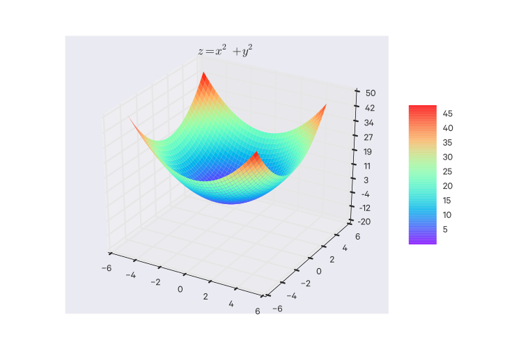
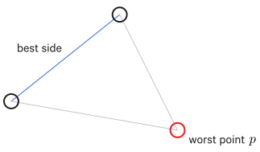
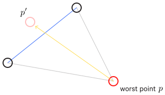
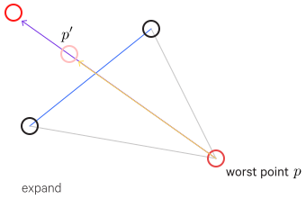
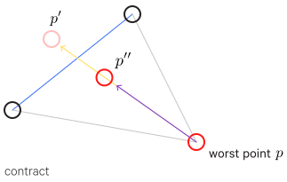

$$
\providecommand{\argmax}{\operatorname*{argmax}}
\providecommand{\argmin}{\operatorname*{argmin}}
$$

# Optimization

Optimization problems can be thought of a topology where you are looking for the global peak (if you are maximizing) or the globally lowest point (if you are minimizing). For simplicity, minimizing will be the assumed goal here, as you are often trying to minimize some error function.

A given point/position in this topology is a solution, like a vector of coefficients/weights for the function you are trying to optimize.

A simple greedy random optimization algorithm will start at some position in this topology and randomly try moving to a new position and check if it is better. If it is, it sets that as the current solution. And so on until it has some reason to stop, usually because it has found a minimum. This is a local minimum but not necessarily the global minimum.

This algorithm is _greedy_ in that it will always prefer a better scoring position, even if it is only marginally better. Thus it can be easy to get stuck in local optima - since any step away from it seems worse, even if the global optimum is right around the corner, so to speak.

## Decision Theory

A framework for which the general goal is to _minimize expected loss_.

That is, given labeled data points $(x_1, y_1), \dots, (x_n, y_n)$ and some _loss function_ $L(y, \hat y)$, in which $y$ is the true label and $\hat y$ is the predicted label, we want to choose some function $f(x) = \hat y$ (which yields a predicted label for a given $x$) that minimizes $L(y, f(x))$.

But because we don't know $x$ or $y$ we want to minimize the average loss, that is, the _expected loss_:

$$
E[L(Y, \hat y) | X = x] = \sum_{y \in Y} L(y, \hat y) p(y|x)
$$

So we want:

$$
\hat y = \argmin_y E[L(Y, \hat y) | X = x] = \argmax_y p(y|x)
$$

That is, choose $\hat y$ to minimize the expected loss, which is the same as the $y$ which is maximally probably given $x$.

An example loss function is the _square loss_, which is used in regression:

$$
L(y, \hat y) = (y - \hat y)^2
$$

This minimizing of loss is an optimization problem.

## Gradient Descent

Gradient descent (GD) is a very common minimizing optimization (for maximizing, its equivalent is _gradient ascent_).

Say we have a function $C(v)$ which we want to minimize. For simplicity, we will set $v = [v_1 \space v_2]$. $C(v)$ is visualized as such:

In this example, the global minimum is intuitively and visually obvious, but most of the time it is not (especially when dealing with far more dimensions). But we can apply the model of a ball rolling down a hill and expand it to any arbitrary $n$ dimensions. The ball will "roll" down to a minimum, though not necessarily the global minimum.

The position the ball is at is a potential solution; here it is some values for $v_1$ and $v_2$. We want to move the ball such that $\Delta C$, the change in $C(v)$ from the ball's previous position to the new position, is negative (i.e. the cost function's output is smaller, since we're minimizing).

More formally, $\Delta C$ is defined as:

$$
\begin{aligned}
  \Delta C \approx \frac{\partial C}{\partial v_1} \Delta v_1 +
  \frac{\partial C}{\partial v_2} \Delta v_2
\end{aligned}
$$

We define the _gradient_ of $C$, denoted $\nabla C$, to be the vector of partial derivatives (transposed to be a column vector):

$$
\begin{aligned}
  \nabla C \equiv \left( \frac{\partial C}{\partial v_1},
  \frac{\partial C}{\partial v_2} \right)^T
\end{aligned}
$$

So we can rewrite $\Delta C$ as:

$$
\begin{aligned}
  \Delta C \approx \nabla C \cdot \Delta v.
\end{aligned}
$$

and we can choose $\Delta v$ to make $\Delta C$ negative:

$$
\begin{aligned}
  \Delta v = -\eta \nabla C,
\end{aligned}
$$

where

- $\eta$ = a small, positive parameter (the _learning rate_)

and finally we have:

$$
\Delta C \approx
-\eta \nabla C \cdot \nabla C = -\eta \|\nabla C\|^2
$$

We can use this to compute a value for $\Delta v$, which is really the change in position for our "ball" to a new position $v'$:

$$
\begin{aligned}
  v \rightarrow v' = v -\eta \nabla C.
\end{aligned}
$$

And repeat until we hit a global (or local) minimum.

### Stochastic gradient descent (SGD)

With gradient descent, the cost function is evaluated on all the training inputs. This can be quite slow.

Stochastic gradient descent (SGD) is a variant where the cost function is instead evaluated on a randomly selected subset of training inputs of size $m$ (a "mini-batch") for each step.

When the stochastic variant is used, a $\frac{1}{m}$ term is sometimes included:

$$
\begin{aligned}
  v \rightarrow v' = v -\frac{\eta}{m} \nabla C.
\end{aligned}
$$

## Simulated Annealing

Simulated annealing is similar to the greedy random approach but it has some randomness which can "shake" it out of local optima.

Annealing is a process in metal working where the metal starts at a very high temperature and gradually cools down. Simulated annealing uses a similar process to manage its randomness.

A simulated annealing algorithm starts with a high "_temperature_" (or "energy") which "cools" down (becomes less extreme) as progress is made.
Like the greedy random approach, the algorithm tries a random move. If the move is better, it is accepted as the new position. If the move is worse, then there is a chance it still may be accepted; the probability of this is based on the current temperature, the current error, and the previous error:

$$
P(e, e', T) = exp(\frac{-(e'-e)}{T})
$$

Each random move, whether accepted or not, is considered an iteration. After each iteration, the temperature is decreased according to a _cooling schedule_. An example cooling schedule is:

$$
T(k) = T_{init} \frac{T_{final}}{T_{init}}^{\frac{k}{k_{max}}}
$$

where

- $T_{init}$ = the starting temperature
- $T_{final}$ = the minimum/ending temperature
- $k$ = the current iteration
- $k_{max}$ = the maximum number of iterations

For this particular schedule, you probably don't want to set $T_{final}$ to 0 since otherwise it would rapidly decrease to 0. Set it something close to 0 instead.

The algorithm terminates when the temperature is at its minimum.

## Nelder-Mead (aka Simplex or Amoeba optimization)

For a problem of $n$ dimensions, create a shape of $n+1$ vertices. This shape is a _simplex_.

You initialize only one vertex of the simplex with your best educated guess of the solution vector. That guess could be the output of some other optimization approach, even a previous Nelder-Mead run. Alternatively, you could just use a random vector if you have nothing else.

The other $n$ vertices are created by moving in one of the $n$ dimensions by some set amount.

Then at each step of the algorithm, you want to (illustrations are for $n=2$, thus $3$ vertices):

- find the worst, second worst, and best scoring vertices

- reflect the worst vertex to some point $p'$ through the best side

- if $p'$ is better, _expand_ by setting the worst vertex to a new point $p''$, a bit further than $p'$ but in the same direction:

- if $p'$ is worse, then _contract_ by setting the worst vertex to a new point $p''$, in the same direction as $p'$ but before crossing the best side.

The algorithm terminates when:

- the maximum number of iterations is reached
- the score is "good enough"
- the vertices have become close enough together

Then the best vertex is considered the solution.

This optimization method is very sensitive to how it is initialized; whether or not a good solution is found depends a great deal on its starting points.

## Particle Swarm Optimization

Similar to Nelder-Mead, but instead of three points, you have many more points. These points are called "particles".

Each particle has a position (a potential solution) and a velocity which indicates where the particle moves to in the next iteration. Particles also keep track of their current error to the training examples and its best position so far.

Globally, we also track the best position overall and the lowest error overall.

The velocity for each particle is computed according to:

- it's inertia (i.e. the current direction it is moving in)
- it's historic best position (i.e. the best position it's found so far)
- the global best position

The influence of these components are:

- inertia weight
- cognitive weight (for historic best position)
- social weight (for global best position)

These weights are parameters that must be tuned, but this method is quite robust to them (that is, they are not sensitive to these changes so you don't have to worry too much about getting them just right).

More particles are better, of course, but more intensive.

You can specify the number of epochs (iterations) to run.

You can also incorporate a death-birth cycle in which low-performing particles (those that seem to be stuck, for instance) get destroyed and a new randomly-placed particle is initialized in its place.

### References

Swarm Intelligence Optimization using Python (PyData 2015). James McCaffrey. <https://www.youtube.com/watch?v=bVDX_UwthZI>
