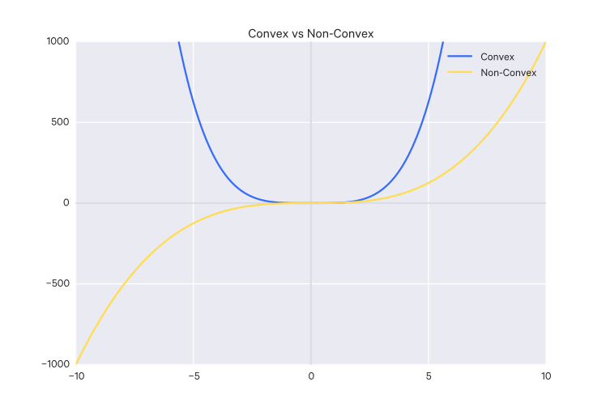

$$
\DeclareMathOperator{\Img}{im}
$$

# Functions

Fundamentally, a function is a relationship (mapping) between the values of some set
$X$ and some set $Y$ :

$$ f:X \to Y $$

A function can map a set to itself. For example, $f(x) = x^2$, also notated $f:x
\mapsto x^2$, is the mapping of all
real numbers to all real numbers, or $f:\mathbb R \to \mathbb R$.

The set you are mapping _from_ is called the __domain__.
The set that is being mapped _to_ is called the __codomain__.
The __range__ is the subset of the codomain which the function actually maps to (a
function doesn't necessarily map to _every_ value in the codomain. But where it does,
the range = the codomain).

Functions which map to $\mathbb R$ are known as __scalar-valued__ or __real-valued__ functions.
Functions which map to $\mathbb R^n$ where $n > 1$ are known as __vector-valued__ functions.

### Identity functions

An identity function maps something to itself:

$$
\begin{aligned}
I_X &: X \to X \\
I_X(a) &= a, \forall \, a \in X
\end{aligned}
$$

### The inverse of a function

Say we have a function $f: X \to Y$, where $f(a) = b$ for any $a \in X$.

We say $f$ is __invertible__ if and only if there exists a function $f^{-1}: Y \to X$
such that $f^{-1} \circ f = I_X$ and $f \circ f^{-1} = I_Y$.

The inverse of a function is _unique_, that is, it is _surjective_ and _injective_,
that is, there is a unique $x$ for each $y$.

### Surjective functions

A __surjective__ function, also called "onto", is a function $f: X \to Y$ where, for
every $y \in Y$ there exists _at least_ one $x \in X$ such that $f(x) = y$. That
is, every $y$ has at least one corresponding $x$ value.

This can also be expressed as:

$$ \Img(f) = Y $$

since the image of the transformation encompasses the entire codomain $Y$. Because
of that, this can also be represented as:

$$ \text{range}(f) = Y $$

### Injective functions

An __injective__ function, also called "one-to-one", is a function $f: X \to Y$ where,
for every $y \in Y$, there exists _at most_ one $x \in X$ such that $f(x) = y$.
That is, not all $y$ necessarily has a corresponding $x$, but those that do only
have _one_ corresponding $x$.

### Surjective & injective functions

A function can be both surjective and injective, which just means that for every $y \in Y$ there exists exactly one $x \in X$ such that $f(x) = y$, that is, every $y$
has exactly one corresponding $x$.

The inverse of a function is surjective and injective!

### Convex and non-convex functions

> A convex function is a continuous function whose value at the midpoint of every interval in its domain does not exceed the arithmetic mean of its values at the ends of the interval. [source](http://mathworld.wolfram.com/ConvexFunction.html).

A convex region is one in which any two points in the region can be joined by a straight line that does not leave the region.

Which is to say that a convex function has a minimum.

## References

- <http://mathworld.wolfram.com/ConvexFunction.html>
