# Calculus

## Differentiation

The __slope__  of a two-dimensional function (in higher dimensions, the term __gradient__ is used instead of "slope"; in particular, the gradient is the vector of partial derivatives) can be thought of as the _rate of change_ for that function.

For a linear function $f(x) = ax+b$, $a$ is the slope; it is constant for all $x$ throughout the function.

But for non-linear functions, e.g. $f(x) = 3x^2$, the slope varies along with $x$.

__Differentation__ is a way to find another function, called the __derivative__ of the original function, that gives us the rate of change (slope) of one variable with respect to another variable.

It tells us how to change the input in order to get a change in the output:

$$
f(x + \epsilon) \approx f(x) + \epsilon f'(x)
$$

This will become useful later on - many machine learning training methods use derivatives (in particular, multidimensional partial derivatives, i.e. gradients) to determine how to update weights (inputs) in order to reduce error (the output).

### Computing derivatives

Say that we want to compute the rate of change (slope) at a _single point_. How? It takes two points to define a line, which we can easily compute the slope for.

Instead of a single point, we can consider two points that are very, very close together:

$$
(x, f(x)) \text{and} (x+h, f(x+h))
$$

Note that sometimes $\delta$ or $\delta x$ is used instead of $h$.

Their slope is then given by:

$$
\frac{f(x+h)-f(x)}{x+h-x} = \frac{f(x+h)-f(x)}{h}
$$

We want the two points as close as possible, so we can look at the limit of $h \to 0$:

$$
\lim_{h \to 0} \frac{f(x+h) - f(x)}{h}
$$

That is the derivative of $f$:

$$
f'(x) = \lim_{h \to 0} \frac{f(x+h) - f(x)}{h}
$$

If this limit exists, we say that $f$ is __differentiable__ at $x$ and that its derivative at $x$ is $f'(x)$.

#### Example

We have a car and have a variable $x$ which describes its position at a given point in time $t$. That is, $f(t) = x$.

With differentiation we can get $\frac{dx}{dt}$ which is the rate of change of the car's position wrt to time, i.e. the speed (velocity) of the car.

Note that this is _not_ the same as $\frac{\Delta x}{\Delta y}$, which gives us the change in $x$ over a time interval $\Delta t$. This is the average velocity over that time interval.

If instead we want instantaneous velocity - the velocity at a given point in time - we need to have the time interval $\Delta t$ approach $0$ (we can't set $\Delta t$ to $0$ because then we have division by 0). This is equivalent to the derivative described previously:

$$
\lim_{\Delta t \to 0} \frac{\Delta x}{\Delta t} = \frac{dx}{dt}
$$

This can be read as

- "the rate of change in $x$ with respect to $t$", or
- "an infinitesimal value of $y$ divided by an infinitesimal value of $x$"

For a given function $f(x)$, this can also be written as:

$$
\frac{d}{dx} f(x) = \lim_{\Delta \to 0} \frac{f(x + \Delta) - f(x)}{\Delta}
$$

### Notation

A derivative of a function $y = f(x)$ may be notated:

- $f'(x)$
- $D_x [f(x)]$
- $Df(x)$
- $\frac{dy}{dx}$
- $\frac{d}{dx}[y]$

As a special case, if we are looking at a variable with respect to time $t$, we can use Newton's dot notation:

- $\dot f = \frac{df}{dt}$

### Differentiation rules

- __Derivative of a constant function__: For any fixed real number $c$, $\frac{d}{dx}[c] = 0$.
    - This is because a constant function is just a horizontal line (it has a slope of 0).
- __Derivative of a linear function__: For any fixed real numbers $m$ and $c$, $\frac{d}{dx}[mx+c] = m$
- __Constant multiple rule__: For any fixed real number $c$, $\frac{d}{dx}[cf(x)] = c\frac{d}{dx}[f(x)]$
- __Addition rule__: $\frac{d}{dx}[f(x) \pm g(x)] = \frac{d}{dx}[f(x)] \pm \frac{d}{dx}[g(x)]$
- __The power rule__: $\frac{d}{dx}[x^n] = nx^{n-1}$
- __Product rule__: $\frac{d}{dx}[f(x) \cdot g(x)] = f(x) \cdot g'(x) + f'(x) \cdot g(x)$
- __Quotient rule__: $\frac{d}{dx} [\frac{f(x)}{g(x)}] = \frac{g(x)f'(x) - f(x)g'(x)}{g(x)^2}$

##### Example

$$
\frac{d}{dx}[6x^5 + 3x^2 + 3x + 1]
$$

- Apply the addition rule: $\frac{d}{dx}[6x^5] + \frac{d}{dx}[3x^2] + \frac{d}{dx}[3x] + \frac{d}{dx}[1]$
- Apply the linear and constant rules: $\frac{d}{dx}[6x^5] + \frac{d}{dx}[3x^2] + 3 + 0$
- Apply the constant multiplier rule: $6\frac{d}{dx}[x^5] + 3\frac{d}{dx}[x^2] + 3$
- Then the power rule: $6(5x^4) + 3(2x) + 3$
- And finally: $30x^4 + 6x + 3$

#### Chain rule

If a function $f$ is composed of two differentiable functions $y(x)$ and $u(x)$, so that $f(x) = y(u(x))$, then $f(x)$ is differentiable and:

$$
\frac{df}{dx} = \frac{dy}{du} \cdot \frac{du}{dx}
$$

This rule can be applied sequentially to nestings (compositions) of many functions:

$$
f(g(h(x)))
\\
\frac{df}{dx} = \frac{df}{dg} \cdot \frac{dg}{dh} \cdot \frac{dh}{dx}
$$

The chain rule is very useful when you recompose functions in terms of nested functions.

##### Example

Given $f(x) = (x^2 + 1)^3$, we can define another function $u(x) = x^2 + 1$, thus we can rewrite $f(x)$ in terms of $u(x)$, that is: $f(x) = u(x)^3$.

- We can apply the chain rule: $\frac{df}{dx} = \frac{df}{du} \cdot \frac{du}{dx}$.
- Then substitute: $\frac{df}{dx} = \frac{d}{du}[u^3] \cdot \frac{d}{dx}(x^2 + 1)$.
- Then we can just apply the rest of our rules: $\frac{df}{dx} = 3u^2 \cdot 2x$.
- Then substitute again: $\frac{df}{dx} = 3(x^2+1)^2 \cdot 2x$ and simplify.

### Higher order derivatives

The derivative of a function as described above is the __first derivative__.

The __second derivative__, or __second order derivative__, is the derivative of the first derivative, denoted $f''(x)$.

There's also the third derivative, $f'''(x)$, and a fourth, and so on.

Any derivative beyond the first is a __higher order derivative__.

#### Notation

The above notation gets unwieldy, so there are alternate notations.

For the $n^{th}$ derivative:

- $f^{(n)}(x)$ (this is to distinguish from $f^n(x)$ which is the quantity $f(x)$ raised to the $n^{th}$ power)
- $\frac{d^n f}{dx^n}$ (Leibniz notation)
- $\frac{d^n}{dx^n}[f(x)]$ (another form of Leibniz notation)
- $D^n f$ (Euler's notation)

### Explicit differentiation

When dealing with multiple variables, there is sometimes the option of __explicit differentiation__. This simply involves expressing one variable in terms of the other.

For example: $x^2 + y^2 = 1$. This can be rewritten in terms of $x$ like so: $y = \pm(1-x^2)^{1/2}$.

Here it is easy to apply the chain rule:

$$
\begin{aligned}
u(x) &= 1-x^2 \\
y &= u(x)^{1/2} \\
\frac{dy}{dx} &= \frac{d}{du}[u^{1/2}] \cdot \frac{d}{dx}[1-x^2] \\
&= \frac{d}{du}[u^{1/2}] \cdot (\frac{d}{dx}[1] - \frac{d}{dx}[x^2]) \\
&= \frac{d}{du}[u^{1/2}] \cdot (-\frac{d}{dx}[x^2]) \\
&= \frac{d}{du}[u^{1/2}] \cdot (-2x) \\
&= \frac{1}{2}u^{-1/2} \cdot (-2x) \\
&= \frac{1}{2}(1-x^2)^{-1/2} \cdot (-2x) \\
&= -x(1-x^2)^{-1/2} \\
&= -\frac{x}{(1-x^2)^{1/2}} \\
&= -\frac{x}{y}
\end{aligned}
$$

### Implicit differentiation

Implicit differentiation is useful for differentiating equations which cannot be explicitly differentiated because it is impossible to isolate variables. With implicit differentiation, you do not need to define one of the variables in terms of the other.

For example, using the same equation from before: $x^2 + y^2 = 1$.

First, differentiate with respect to $x$ on both sides of the equation:

$$
\begin{aligned}
\frac{d}{dx}[x^2 + y^2] &= \frac{d}{dx}[1] \\
\frac{d}{dx}[x^2 + y^2] &= 0 \\
\frac{d}{dx}[x^2] + \frac{d}{dx}[y^2] &= 0
\end{aligned}
$$

To differentiate $\frac{d}{dx}[y^2]$, we can define a new function $f(y(x)) = y^2$ and then apply the chain rule:

$$
\frac{df}{dx} = \frac{df}{dy} \cdot \frac{dy}{dx} = \frac{d}{dy}[y^2] \cdot \frac{dy}{dx} = 2y \cdot y'
$$

So returning to our other in-progress derivative:

$$
\frac{d}{dx}[x^2] + \frac{d}{dx}[y^2] = 0
$$

We can substitute and bring it to completion:

$$
\begin{aligned}
\frac{d}{dx}[x^2] + \frac{d}{dx}[y^2] &= 0 \\
\frac{d}{dx}[x^2] + 2yy' &= 0 \\
2x + 2yy' &= 0 \\
2yy' &= -2x \\
y' &= -\frac{2x}{2y} \\
y' &= -\frac{x}{y}
\end{aligned}
$$

### Derivatives of trigonometric functions

$$
\begin{aligned}
\frac{d}{dx}\sin(x) &= \cos(x)
\\
\frac{d}{dx}\cos(x) &= -\sin(x)
\\
\frac{d}{dx}\tan(x) &= \sec^2(x)
\\
\frac{d}{dx}\sec(x) &= \sec(x)\tan(x)
\\
\frac{d}{dx}\csc(x) &= -\csc(x)\cot(x)
\\
\frac{d}{dx}\cot(x) &= -\csc^2(x)
\\
\frac{d}{dx}\arcsin(x) &= \frac{1}{\sqrt{1-x^2}}
\\
\frac{d}{dx}\arccos(x) &= \frac{-1}{\sqrt{1-x^2}}
\\
\frac{d}{dx}\arctan(x) &= \frac{1}{1+x^2}
\end{aligned}
$$

### Derivatives of exponential and logarithmic functions

$$
\begin{aligned}
\frac{d}{dx}e^x &= e^x
\\
\frac{d}{dx}a^x &= \ln(a)a^x
\\
\frac{d}{dx}\ln(x) &= \frac{1}{x}
\\
\frac{d}{dx}\log_b(x) &= \frac{1}{x\ln(b)}
\end{aligned}
$$

### Extreme Value Theorem

A __global maximum__ (or _absolute maximum_) of a function $f$ on a closed interval $I$ is a value $f(c)$ such that $f(c) \ge f(x)$ for all $x$ in $I$.

A __global minimum__ (or _absolulte minimum_) of a function $f$ on a closed interval $I$ is a value $f(c)$ such that $f(c) \le f(x)$ for all $x$ in $I$.

The __extreme value theorem__ states that if $f$ is a function that is continuous on the closed interval $[a, b]$, then $f$ has both a global minimum and a global maximum on $[a, b]$. It is assumed that $a$ and $b$ are both finite.

#### Extrema and inflection/inflexion points

Note that at _any_ __extremum__ (i.e. a minimum or a maximum), global or local, the slope is 0 because the graph stops rising/falling and "turns around". For this reason, extrema are also called __stationary points__ or _turning points_.

Thus, the first derivative of a function is equal to 0 at extrema. But the converse does not hold true: the first derivative of a function is not always an extrema when it equals 0. This is because a slope of 0 may also be found at a point of __inflection__:

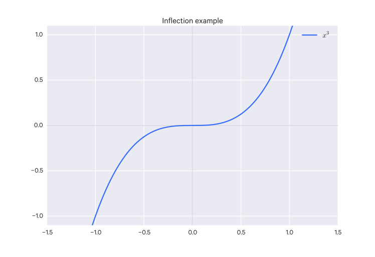

To discern extrema from inflection points, you can use the _extremum test_, aka the _second derivative test_.

If the second derivative at the stationary point is positive (increasing) or negative (decreasing), then we know we have a minimum or a maximum, respectively.

The intuition here is that the rate of change is _also_ changing at extrema (e.g. it is going from a positive slope to a negative slope, which indicates a maximum, or the reverse, which indicates a minimum).

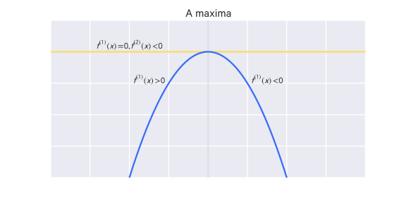

However, if the second derivative is also 0, then we still have not distinguished the point. It may be a saddle point or on a flat region. What you can do is continue differentiating until you get a non-zero result.

If we take $n$ to be the order of the derivative yielding the non-zero result, then if $n-1$ is odd, we have a true extremum. Again, if it the non-zero result is positive, then it is a minimum, if it is negative, it is maximum.

However, if $n-1$ is even, then we have a point of inflection.

#### Critical points

A __critical point__ are points where the function's derivative are $0$ or not defined. So stationary points are critical points.

### Rolle's Theorem

If a function $f(x)$ is continuous on the closed interval $[a, b]$, is differentiable on the open interval $(a, b)$, and $f(a) = f(b)$, then there exists at least one number $c$ in the interval $(a, b)$ such that $f'(c) = 0$.

This is basically saying that if you have an interval which ends with the same value it starts with, at some point in that curve the slope will be 0:

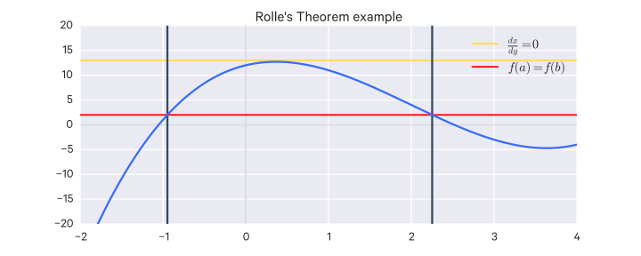

### Mean Value Theorem

If $f(x)$ is continuous on the closed interval $[a, b]$ and differentiable on the open interval $(a, b)$, there exists a number $c$ in the open interval $(a, b)$ such that

$$
f'(c) = \frac{f(b)- f(a)}{b-a}
$$

This is basically saying that there is some point on the interval where its instantaneous slope is equal to the average slope of the interval.

Rolle's Theorem is a special case of the Mean Value Theorem where $f(a) = f(b)$.

### L'Hopital's Rule

An __indeterminate limit__ is one which results in $\frac{0}{0}$ or $\frac{\pm\infty}{\pm\infty}$.

If $\lim_{x \to c} \frac{f(x)}{g(x)}$ is indeterminate of type $\frac{0}{0}$ or $\frac{\pm\infty}{\pm\infty}$, then $\lim_{x \to c} \frac{f(x)}{g(x)} = \lim_{x \to c} \frac{f'(x)}{g'(x)}$.

If the resulting limit here is also indeterminate, you can re-apply L'Hopital's rule until it is not.

Note that $c$ can be a finite value, $\infty$, or $-\infty$.

### Taylor Series

Certain functions can be expressed as an expansion of itself around a point $a$. This expansion is known as a __Taylor series__ and is an infinite sum of that function and its derivatives around $a$:

$$
f(x) = \sum_{n=0}^{\infty} f^{(n)}(a) \frac{(x-a)^n}{n!}
$$

When $a=0$, the series is known as a __Maclaurin series__.

## Integration

### Definite integral

How can we find the area under a graph?

We can try to approximate the area using a finite number ($n$) of rectangles. The area of rectangles are easy to calculate so we can just add up their area.

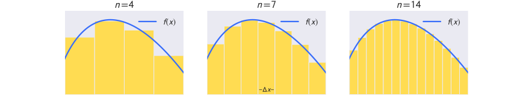

The more rectangles (i.e. increasing $n$) we fit, the better the approximation.

So we can have $n \to \infty$ to get the best approximation of the area under the curve.

Say we have a function $f(x)$ that is positive over some interval $[a,b]$. The width of each rectangle over that interval, divided into $n$ rectangles (subintervals), is $\Delta x = \frac{b-a}{n}$.
The endpoint of an subinterval can be denoted $x_i$, for $i=0,1,\dots,n$.
For each $i^{th}$ subinterval, we pick some sample point $x_i^*$ in the interval $[x_{i-1}, x_i]$. This sample point is the height of the $i^{th}$ rectangle.

Thus, for the $i^{th}$ rectangle, we have as its area:

$$
a_i = x_i^* \frac{b-a}{n}
$$

or

$$
a_i = x_i^* \Delta x
$$

So the total area for the interval is:

$$
A_n = \sum_{i=1}^n f(x_i^*)\Delta x
$$

This kind of area approximation is called a __Riemann sum__.

The best approximation then is:

$$
\lim_{n \to \infty} \sum_{i=1}^n f(x_i^*)\Delta x
$$

So we define the __definite integral__:

Suppose $f$ is a continuous function on $[a, b]$ and $\Delta x = \frac{b-a}{n}$. Then the definite integral of $f$ between $a$ and $b$ is:

$$
\int_a^b f(x)dx = \lim_{n \to \infty}A_n = \lim_{n \to \infty} \sum_{i=1}^n f(x_i^*)\Delta x
$$

where $x_i^*$ are any sample points in the interval $[x_{i-1}, x_i]$ and $x_k = a + k \cdot \Delta x$ for $k=0,\dots,n$.

In the expression $\int_a^b f(x)dx$, $f$ is the __integrand__, $a$ is the __lower limit__ and $b$ is the __upper limit__ of integration.

#### Left-handed vs right-handed Riemann sums

A right-handed Riemann sum is just one where $x_i^* = x_i$, and a left-handed Riemann sum is just one where $x_i^* = x_{i-1}$.

### Basic properties of the integral

- __The constant rule__: $\int_a^b cf(x)dx = c\int_a^b f(x)dx$
    - A special case rule for integrating constants is: $\int_a^b cdx = c(b-a)$
- __Addition and subtraction rule__: $\int_a^b (f(x) \pm g(x))dx = \int_a^b f(x)dx \pm \int_a^b g(x)dx$
- __The comparison rule__
    - Suppose $f(x) \ge 0$ for all $x$ in $[a, b]$. Then $\int_a^b f(x)dx \ge 0$.
    - Suppose $f(x) \ge g(x)$ for all $x$ in $[a, b]$. Then $\int_a^b f(x)dx \ge \int_a^b g(x)dx$.
    - Suppose $M \ge f(x) \ge m$ for all $x$ in $[a, b]$. Then $M(b-a) \ge \int_a^b f(x)dx \ge m(b-a)$.
- __Additivity with respect to endpoints__: Suppose $a < c < b$. Then $\int_a^b f(x)dx = \int_a^c f(x)dx + \int_c^b f(x)dx$.
    - This is basically saying the area under the graph from $a$ to $b$ is equal to the area under the graph from $a$ to $c$ plus the area under the graph from $c$ to $b$, so long as $c$ is some point between $a$ and $b$.
- __Power rule of integration__: As long as $n \neq 1$ and $0 \notin [a,b]$, or $n>0$, $\int_a^b x^ndx = \frac{x^{n+1}}{n+1}|_a^b = \frac{b^{n+1} - a^{n+1}}{n+1}$

### Mean Value Theorem for Integration

Suppose $f(x)$ is continuous on $[a, b]$. Then $\frac{\int_a^b f(x)dx}{b-a} = f(c)$ for some $c$ in $[a, b]$.

### Antiderivatives

If we have a function $f$ which is the derivative of another function $F$, i.e. $f = F'$, then $F$ is an __antiderivative__ of $f$.

Generally, a function $f$ has many antiderivatives because of how constants work in derivatives.

So we usually include a $+C$ term, i.e. $F(x) + C$, to indicate that any constant can be added and still derive to $f$. Thus $F$ often refers to a _set_ of functions rather than a unique function.

We say that the integral of $f$ is equal to this set of functions:

$$
\int f(x)dx = F(x) + C
$$

This is the __indefinite integral__ since we are not specifying a range the integral is computed over. Thus, we are not given an explicit value but rather the function(s) that results (this typically includes the ambiguous $C$ term).

Here $f$ is known as the __integrand__.

In a definite integral, we specify the upper and lower limits:

$$
\int_a^b f(x)dx = F(x) + C
$$

### The fundamental theorem of calculus

The fundamental theorem of calculus connects the concept of a derivative to that of an integral.

Suppose that $f$ is continuous on $[a, b]$.
We can define a function $F$ like so:

$$
F(x) = \int_a^x f(t)dt \text{ for } x \in [a,b]
$$

Suppose $f$ is continuous on $[a,b]$ and $F$ is defined by $F(x) = \int_a^x f(t)dt$.

Then $F$ is differentiable on $(a,b)$ for all $x \in (a,b)$, i.e.:

$$
F'(x) = f(x)
$$

Thus $F$ is the set of antiderivatives for $f$.

Suppose $f$ is continuous on $[a,b]$ and $F$ is any antiderivative of $f$. Then:

$$
\int_a^b f(x)dx = F(b) - F(a)
$$

Note that $F(b) - F(a)$ may be notated as $F(x)|_a^b$.

To understand why this is so, consider:

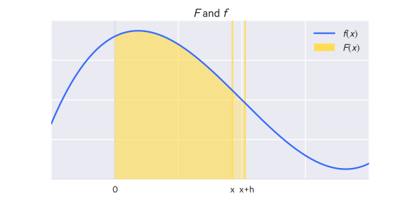

Say that $F(X)$ gives the area under $f(x)$ from $0$ to $x$.

If we want to compute the area under $f(x)$ between $x$ and $x+h$, we can do so like:

$$
\frac{F(x+h) - F(x)}{h}
$$

Note that this is also how the derivative is calculated.

So as we take the limit of $h \to 0$:

$$
\lim_{h \to 0} \frac{F(x+h) - F(x)}{h} = f(x)
$$

Thus we have shown that $F'(x) = f(x)$, that is, that $F$ is the antiderivative of $f$.

Given some arbitrary:

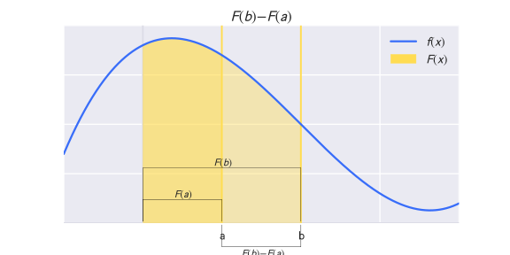

We know that this is also equal to:

$$
\int_a^b f(x)dx
$$

Therefore:

$$
\int_a^b f(x)dx = F(b) - F(a)
$$

#### Basic properties of indefinite integrals

The integral rules defined above still apply.

- __Power rule for indefinite integrals__: For all $n \neq -1$, $\int x^ndx = \frac{1}{n+1}x^{n+1} + C$
- __Integral of the inverse function__: For $f(x) = \frac{1}{x}$, remember that $\frac{d}{dx}\ln x = \frac{1}{x}$, so $\int \frac{dx}{x} = \ln|x| + C$
- __Integral of the exponential function__: Because $\frac{d}{dx}e^x = e^x$, $\int e^x dx = e^x + C$
- __The substitution rule for indefinite integrals__:  Assume $u$ is differentiable with a continuous derivative and that $f$ is continuous on the range of $u$. Then $\int f(u(x))\frac{du}{dx}dx = \int f(u)du$.
    - Remember that $\frac{du}{dx}$ is _not_ a fraction, so you're not just "canceling" things out here.

#### Integration by parts

Suppose $f$ and $g$ are differentiable and their derivatives are continuous. Then:

$$
\int f(x)g(x)dx = \left(f(x)\int g(x)dx\right) - \int\left(f'(x)\int g(x)dx\right)dx
$$

You set $f(x)$ in the following order, called _ILATE_:

- I for inverse trigonometric functions
- L for log functions
- A for algebraic functions
- T for trigonometric functions
- E for expontential functions

### Improper integrals

There are two types of __improper integrals__:

1. Those on an unbounded function, e.g.:

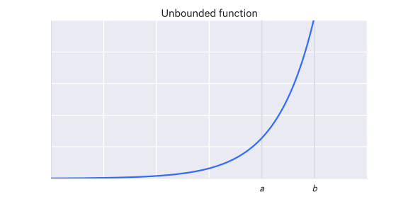

$$
\int_a^b f(x)dx
$$

2. Those on an unbounded interval, e.g.:

$$
\int_a^{+\infty} f(x)dx
$$

The integral on an unbounded function depicted above is known as an "improper integral with infinite integrand at $b$". To compute such an integral, we just consider a point infinitesimally previous to $b$:

$$
\lim_{\epsilon \to 0^+} \int_a^{b - \epsilon} f(x)dx
$$

The integral on an unbounded interval is known as an "improper integral on an infinite interval". Here we just consider the limit:

$$
\lim_{N \to +\infty} \int_a^N f(x)dx
$$

If the interval is unbounded in both directions, we consider instead two separate intervals:

$$
\int_{-\infty}^{+\infty} = \int_{-\infty}^0 f(x)dx + \int_0^{+\infty} f(x)dx
$$

---

Say we have the integral

$$
\int_1^{\infty} \frac{dx}{x^2}
$$

If we set the upper bound to be a finite value $b$ and have it approach infinity, we get:

$$
\begin{aligned}
\lim_{b \to \infty} \int_1^b \frac{dx}{x^2} &= \lim_{b \to \infty} \left(\frac{1}{1} - \frac{1}{b}\right) \\
&= \lim_{b \to \infty} \left(1 - \frac{1}{b}\right) \\
&= 1
\end{aligned}
$$

The formal definition:

1\. Suppose $\int_a^b f(x)dx$ exists for all $b \ge a$. Then we define

$$\int_a^{\infty} f(x)dx = \lim_{b \to \infty} \int_a^b f(x)dx$$

as long as this limit exists and is finite. If it does exist we say the integral is _convergent_ and otherwise we say it is _divergent_.

2\. Similarly if $\int_a^b f(x)dx$ exists for all $a \le b$ we define

$$\int^b_{-\infty} f(x)dx = \lim_{a \to -\infty} \int_a^b f(x)dx$$

3\. Finally, suppose $c$ is a fixed real number and that $\int^c_{-\infty} f(x)dx$ and $\int_c^{\infty} f(x)dx$ are both convergent. Then we define

$$\int_{-\infty}^{\infty} f(x)dx = \int_{-\infty}^c f(x)dx + \int_c^{\infty} f(x)dx$$.

#### Improper integrals with a finite number of discontinuities

Suppose $f$ is continuous on $[a, b]$ except at points $c_1 < c_2 < \dots < c_n$ in $[a, b]$.

We define

$$
\int_a^b f(x)dx = \int_a^{c_1} f(x)dx + \int_{c_1}^{c_2} f(x)dx + \dots + \int_{c_n}^b f(x)dx
$$

as long as each integral on the right converges.

#### Improper integral with one discontinuity

As a simpler example, say we have an improper integral with a single discontinuity.

If $f$ is continuous on the interval $[a, b)$ and is discontinuous at $b$, we define

$$
\int_a^b f(x)dx = \lim_{c \to b^-} \int_a^c f(x)dx
$$

If this limit exists, the integral we say it converges and otherwise we say it diverges.

Similarly, if $f$ is continuous on the interval $(a, b]$ and is discontinuous at $a$, we define

$$
\int_a^b f(x)dx = \lim_{c \to a^+} \int_a^c f(x)dx
$$

Finally, if $f$ has a discontnuity at a point $c$ in $(a, b)$ and is continuous at all other points in $[a, b]$, if both $\int_a^c f(x)dx$ and $\int_c^b f(x)dx$ converge, we define

$$
\int_a^b f(x)dx = \int_a^c f(x)dx + \int_{c}^{b} f(x)dx
$$

## Multivariable Calculus

We are frequently dealing with data in many dimensions, so we must expand the previous concepts of derivatives and integrals to higher-dimensional spaces.

### Integration

#### Double integrals

A definite integral for $y = f(x)$ is the area under the curve of $f(x)$, which is the sum of the areas of infinitely small rectangles assembled in the shape of the curve.

But say we are working with three dimensions, i.e. we have $z = f(x,y)$. Then the _volume under the surface_ of $f(x,y)$ is the sum of the volumes of infinitely small chunks in the shape of the surface.

The area of one face of that chunk is the area under the curve, with respect to $x$, from $x=0$ to $x=b$ (in the illustration below), i.e. the integral:

$$
\int_0^b f(x,y)dx
$$

Because this is with respect to $x$, this integral will be some function of $y$, e.g. $g(y)$.

To get the volume of this chunk, we multiply that area by some depth $dy$, so the volume of a chunk is:

$$
\left(\int_0^b f(x,y)dx \right)dy
$$

So if we want to get the volume in the bounds of $y=0$, $y=a$, then we integrate again:

$$
\int_0^a \left(\int_0^b f(x,y)dx \right)dy
$$

A double integral!

It is also written without the parentheses:

$$
\int_0^a \int_0^b f(x,y)dxdy
$$

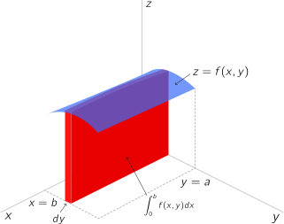

Note that here we first integrated wrt to $x$ and then $y$, but you can do it the other way around as well (integrate wrt $y$ first, then $x$).

Note: the lower bounds here were 0 but that's just an example.

##### Another way of conceptualizing double integrals

You could instead conceptualize the double integral as the sum of the volumes of infinitely small columns:

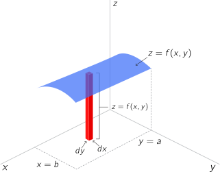

The area of each column's base, $dx \cdot dy$, is sometimes notated as $dA$.

#### Variable boundaries

In the previous example we had fixed boundaries (see accompanying illustration, on the left).

What if instead we have a variable boundary (see accompanying illustration, on the right. The lower $x$ boundary varies now).

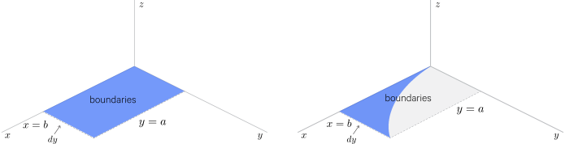

Well you express variable boundaries as a functions. As is the case in the example above, the lower $x$ boundary is some function of $y$, $g(y)$. So the volume would be:

$$
\int_0^a \int_{g(y)}^b f(x,y)dxdy
$$

That's if you first integrate wrt to $x$. If you first integrate wrt to $y$, instead the upper $y$ boundary is varying and that would be some function of $x$, $h(x)$, i.e.:

$$
\int_0^b \int_0^{h(x)} f(x,y)dydx
$$

#### Triple integrals

Triple integrals also involve infinitely small volumes and in many cases are no different than double integrals.

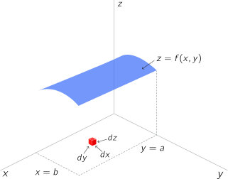

So why use triple integrals? Well they are good for calculating the _mass_ of something - if the density under the surface is not uniform. The density at a given point is expressed as $f(x,y,z)$, so the mass of a variably dense volume can be expressed as:

$$
\int_{x_0}^{x_{final}} \int_{y_0}^{y_{final}} \int_{z_0}^{z_{final}} f(x,y,z)dzdydx
$$

### Partial derivatives

Say you have a function $z = f(x,y)$.

With two variables, we are now working in three dimensions. How does differential calculus work in 3 (or more) dimensions? In three dimensions, what is the slope at a given point? Any given point has an infinite number of tangent lines (only one tangent plane though). So when you take a derivative in three dimensions, you have to specify what direction that derivative is in.

Say we have $z = x^2 + xy + y^2$. If we want to take a derivative of this function, we have to hold one variable constant and derive with respect to the other variable. This derivative is called a __partial derivative__. If we were doing it wrt to $x$, then it would be notated as:

$$
\frac{\partial z}{\partial x} \quad \text{or} \quad f_x(x,y)
$$

So we could work this out as:

$$
\begin{aligned}
y &= C \\
z &= x^2 + xC + C^2 \\
\frac{\partial z}{\partial x} &= 2x + C \\
\frac{\partial z}{\partial x} &= 2x + y
\end{aligned}
$$

Then you could get the partial derivative wrt to $y$, i.e.:

$$
\begin{aligned}
x &= C \\
z &= C^2 + Cy + y^2 \\
\frac{\partial z}{\partial y} &= C + 2y \\
\frac{\partial z}{\partial y} &= x + 2y
\end{aligned}
$$

The plane that these two functions define together for a given point $(x,y)$ is the tangent plane at that point.

More generally, for a function $f(x,y)$, the partial derivatives would be:

$$
\begin{aligned}
\frac{\partial}{\partial x} f(x,y) &= \lim_{\Delta \to 0} \frac{f(x + \Delta, y) - f(x,y)}{\Delta} \\
\frac{\partial}{\partial y} f(x,y) &= \lim_{\Delta \to 0} \frac{f(x, y + \Delta) - f(x,y)}{\Delta}
\end{aligned}
$$

The partial derivative tells us how much the output of a function $f$ changes with the given variable. As alluded to earlier, this is important for machine learning because it tells us how a change in each weight in a multidimensional problem will affect $f$.

### Directional derivatives

Partial derivatives can be generalized into _directional derivatives_, which are derivatives with respect to to any arbitrary line (it does not have to be, for example, with respect to the $x$ or $y$ axis). That is, with respect to any arbitrary direction. We represent a direction as a unit vector.

### Gradients

A gradient is a vector of all the partial derivatives at a given point, which is to say it is a generalization of the derivative from two-dimensions to higher dimensions.

The gradient of a function $f$, with a vector input $w = [w_1, \dots, w_d]$  is notated:

$$
\nabla_w f = \begin{bmatrix}
\frac{\partial f}{\partial w_1} \\
\vdots \\
\frac{\partial f}{\partial w_d}
\end{bmatrix}
$$

Sometimes it is just notated as $\nabla$.

The gradient of some function $f(x,y)$, i.e. $z = f(x,y)$ is:

$$
\nabla f = f_x \hat i + f_y \hat j
$$

That is, the partial derivative of $f$ wrt to $x$ times the unit vector in the $x$ direction, $\hat i$, plus the partial of $f$ wrt to $y$  times the unit vector in the $y$ direction, $\hat j$.

It can also be written (this is just different notation):

$$
\nabla f = \frac{\partial}{\partial x} f(x,y) \hat i + \frac{\partial}{\partial y} f(x,y) \hat j
$$

It's worth noting that this can be thought of in terms of matrices, i.e. given some function $f : \mathbb R^{m \times n} \to \mathbb R$ (that is, it takes a matrix $A \in \mathbb R^{m \times n}$ and returns a real value), then the gradient of $f$, with respect to the matrix $A$, is the matrix of partial derivatives:

$$
\nabla_A f(A) \in \mathbb R^{m \times n} =
\begin{bmatrix}
\frac{\partial f(A)}{\partial A_{11}} & \frac{\partial f(A)}{\partial A_{12}} & \cdots & \frac{\partial f(A)}{\partial A_{1n}} \\
\frac{\partial f(A)}{\partial A_{21}} & \frac{\partial f(A)}{\partial A_{22}} & \cdots & \frac{\partial f(A)}{\partial A_{2n}} \\
\vdots & \vdots & \ddots & \vdots \\
\frac{\partial f(A)}{\partial A_{m1}} & \frac{\partial f(A)}{\partial A_{m2}} & \cdots & \frac{\partial f(A)}{\partial A_{mn}}
\end{bmatrix}
$$

Which is to say that $(\nabla_A f(A))_{ij} = \frac{\partial f(A)}{\partial A_{ij}}$.

#### Properties

Some properties, taken from equivalent properties of partial derivatives, are:

- $\nabla_x (f(x) + g(x)) = \nabla_x f(x) + \nabla_x g(x)$
- For $t \in \mathbb R, \nabla_x (tf(x)) = t \nabla_x f(x)$

##### Example

Say we have the function $f(x,y) = x^2 +xy+y^2$.

Using the partials we calculated previously, the gradient is:

$$
\nabla f = (2x+y)\hat i + (2y+x)\hat j
$$

So what we're really calculating here is a _vector field_, which gives an $x$ and a $y$ vector, with the magnitude of the partial derivative of $f$ wrt to $x$ and the partial derivative of $f$ wrt to $y$, respectively, then getting the vector which is the sum of those two vectors.

What the gradient tells us is, for a given point, what direction to travel to get the maximum slope for $z$.

### The Jacobian

For the vector $F(x) = [f(x)_1, \dots, f(x)_k]^T$, the __Jacobian__, notated $\nabla_x F(X)$ or as just $J$, is:

$$
\nabla_x F(x) =
\begin{bmatrix}
\frac{\partial}{\partial x_1} f(x)_1 & \cdots & \frac{\partial}{\partial x_d} f(x)_1 \\
\vdots & \ddots & \vdots \\
\frac{\partial}{\partial x_1} f(x)_k & \cdots & \frac{\partial}{\partial x_d} f(x)_k
\end{bmatrix}
$$

That is, it is an $m \times n$ matrix of the first-order partial derivatives for a function $f : \mathbb R^n \to \mathbb R^m$, (i.e. for a function that defines a vector field).

To clarify, the difference between the gradient and the Jacobian is that the gradient is for a single function, thus yielding a vector, whereas the Jacobian is for _multiple_ functions, thus yielding a matrix.

### The Hessian

Say we have a function $f : \mathbb R^n \to \mathbb R$, which takes as input a some vector $x \in \mathbb R^n$ and returns a real number (that is, it defines a scalar field).

The __Hessian__ matrix with respect to $x$, written $\nabla^2_x f(x)$ or as just $H$, is the $n \times n$ matrix of second-order partial derivatives:

$$
\nabla^2_x f(x) \in R^{n \times n} =
\begin{bmatrix}
\frac{\partial^2 f(x)}{\partial x_1^2} & \frac{\partial^2 f(x)}{\partial x_1 \partial x_2} & \cdots & \frac{\partial^2 f(x)}{\partial x_1 \partial x_n} \\
\frac{\partial^2 f(x)}{\partial x_2 \partial x_1} & \frac{\partial^2 f(x)}{\partial x_2^2} & \cdots & \frac{\partial^2 f(x)}{\partial x_2 \partial x_n} \\
\vdots & \vdots & \ddots & \vdots \\
\frac{\partial^2 f(x)}{\partial x_n \partial x_1} & \frac{\partial^2 f(x)}{\partial x_n \partial x_2} & \cdots & \frac{\partial^2 f(x)}{\partial x_n^2}
\end{bmatrix}
$$

Which is to say $(\nabla_x^2 f(x))_{ij} = \frac{\partial^2 f(x)}{\partial x_i \partial x_j}$.

Wherever the second partial derivatives are continuous, the Hessian is symmetric, i.e. $\frac{\partial^2 f(x)}{\partial x_i \partial x_j} = \frac{\partial^2 f(x)}{\partial x_j \partial x_i}$. In machine learning, the Hessian is typically completely symmetric.

Just as the second derivative test is used to check if a critical point is a maximum, a minimum, or still ambiguous, as the Hessian is composed of second-order partial derivatives, it does the same for multiple dimensions.

This is accomplished as follows. If the Hessian matrix is real and symmetric, it can be decomposed into a set of real eigenvalues and an orthogonal basis of eigenvectors. At critical points of the function we can look at the Hessian's eigenvalues:

- If the Hessian is positive definite, we have a local minimum (because movement in any direction is positive)
- If the Hessian is negative definite, we have a local maximum (because movement in any direction is negative)
- When at least one eigenvalue is positive and at least one is negative, we have a saddle point
- When all non-zero eigenvalues are of the same sign, but at least one is zero, we still have an ambiguous critical point

The Jacobian and the Hessian are related by:

$$
H(f)(x) = J(\nabla f)(x)
$$

Intuitively, the $i,j$th element of the Hessian tells how the $i, j$th dimension accelerate together. For example, if the element is negative, then as one dimension accelerates, the other decelerates.

### Scalar and vector fields

A __scalar field__ just means a space where, for any point, you can get a scalar value.

For example, with $f(x,y) = x^2 + xy + y^2$, for any $(x,y)$ you get a scalar value.

A __vector field__ is similar but instead of just a scalar value, you get a value and a direction.

For example, $\vec V = 2x \hat i + 5y \hat j$ or $\vec V = x^2y \hat i + y \hat j$.

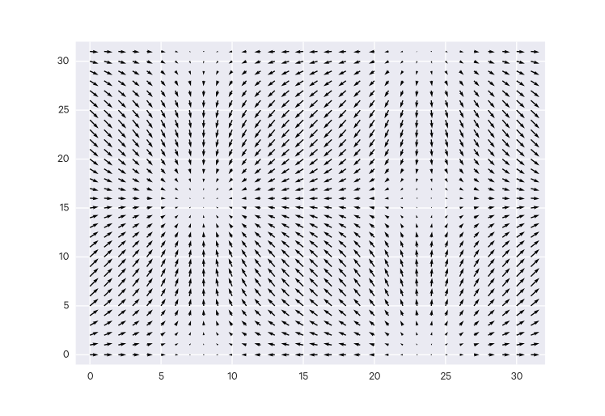

### Divergence

Say we have a vector field $\vec V = x^2y\hat i + 3y \hat j$.

The __divergence__ of that vector field is:

$$
div(\vec V) = \nabla \cdot \vec V
$$

That is, it is the dot product (which tells us how much two vectors move together) of the gradient and the vector field.

So for our example:

$$
\begin{aligned}
\nabla &= \frac{\partial}{\partial x}\hat i + \frac{\partial}{\partial y}\hat j \\
\nabla \cdot \vec v &= \frac{\partial}{\partial x}(x^2y) + \frac{\partial}{\partial y}(3y) \\
&= 2xy + 3
\end{aligned}
$$

The divergence, which is scalar number for any point in a vector field, represents the change in volume density from an infinitesimal volume around a given point in that field. A positive divergence means the volume density is decreasing (more going out than coming in); a negative divergence means the volume density is increasing (more is coming in than going on, this is also called __convergence__). A divergence of 0 means the volume density is not changing.

Using our previously calculated divergence, say we want to look at the point $(4,3)$. We get the divergence $2 \cdot 4 \cdot 3 + 3 = 27$ This means that, in an infinitesimal volume around the point $(4,3)$, the volume is decreasing.

### Curl

The __curl__ measures the rotational effect of a vector field at a given point. Unlike divergence, where we are seeing how much the gradient and the vector field move together, we are interested in seeing how they move against each other. So we use their cross product:

$$
\text{curl}(\vec V) = \nabla \times \vec V
$$

### Optimization with eigenvalues

Consider, for a symmetric matrix $A \in \mathbb S^n$ the following equality-constrained optimization problem:

$$
\max_{x \in \mathbb R^n} x^TAx, \text{ subject to } ||x||_2^2 = 1
$$

Optimization problems with equality constraints are typically solved by forming the __Lagrangian__, an objective function which includes the equality constraints. For this particular problem (i.e. with the quadratic form), the Lagrangian is:

$$
\mathcal L (x, \lambda) = X^TAx - \lambda x^T x
$$

Where $\lambda$ is the __Lagrange multiplier__ associated with the equality constraint. For $x^*$ to be the optimal point to the problem, the gradient of the Lagrangian has to be zero at $x^*$ (among other conditions), i.e.:

$$
\nabla_x \mathcal L (x, \lambda) = \nabla_x (x^TAx - \lambda x^Tx) = 2A^Tx - 2\lambda x = 0
$$

This is just the linear equation $Ax = \lambda x$, so the only points which can maximize (or minimize) $x^TAx$, assuming $x^Tx = 1$, are the eigenvectors of $A$.

## Differential Equations

Differential equations are simply just equations that contain derivatives.

__Ordinary differential equations__ (ODEs) involve equations containing:

- variables
- functions
- their derivatives
- their solutions

This is contrasted to __partial differential equations__ (PDEs), which contain partial derivatives instead of ordinary derivatives.

### Solving simple differential equations

Say we have:

$$
f''(x) = 2
$$

First we can integrate both sides:

$$
\begin{aligned}
\int f''(x)dx &= \int 2dx \\
f'(x) &= 2x + C_1
\end{aligned}
$$

Then we can integrate once more:

$$
\begin{aligned}
\int f'(x)dx &= \int 2x + C_1 dx
f(x) &= x^2 + C_1 x + C_2
\end{aligned}
$$

So our solution is $f(x) = x^2 + C_1 x + C_2$. For all values of $C_1$ and $C_2$, we will get $f'' = 2$.

The values $C_1$ and $C_2$ represent _initial conditions_, e.g. the starting conditions of a model.

### Basic first order differential equations

There are four main types (though there are many others) of differential equations:

- separable
- homogenous
- linear
- exact

#### Separable differential equations

A _separable equation_ is in the form:

$$ \frac{dy}{dx} = \frac{f(x)}{g(x)} $$

You can group the terms together like so:

$$ g(y)dy = f(x)dx $$

And then integrate both sides to obtain the solution:

$$\int g(y)dy = \int f(x)dx + C$$

##### Example

Say we want to solve

$$\frac{dy}{dx} = 3x^2y$$

Separate the terms:

$$\frac{dy}{y} = (3x^2)dx$$

Then integrate:

$$
\begin{aligned}
\int \frac{dy}{y} &= \int 3x^2dx \\
\ln y &= x^3 + C \\
y &= e^{x^3+C}
\end{aligned}
$$

If we let $k=e^C$ so $k$ is a constant, we can write the solution as:

$$y=ke^{x^3}$$

#### Homogenous differential equations

A _homogenous equation_ is in the form:

$$ \frac{dy}{dx} = f(y/x) $$

To make things easier, we can use the substitution

$$ v = \frac{y}{x} $$

so

$$ \frac{dy}{dx} = f(v) $$

Then we can set $y= xv$ and use the product rule, so that we get:

$$
\begin{aligned}
\frac{dy}{dx} &= v + x\frac{dv}{dx} \\
v + x \frac{dv}{dx} &= f(v) \\
x\frac{dv}{dx} &= f(v) - v \\
\frac{dv}{dx} &= \frac{f(v) - v}{x}
\end{aligned}
$$

so now the equation is in separable form and be solved as a separable equation.

#### Linear differential equations

A _linear_ first order differential equation is a differential equation in the form:

$$
\frac{dy}{dx} + f(x)y = g(x)
$$

To solve, you multiply both sides by $I = e^{\int f(x)dx}$ and integrate. $I$ is known as the _integrating factor_.

##### Example

$$
y' - 2xy = x
$$

So in this case, $f(x) = -2x$, and $g(x) = x$, so the equation could be written:

$$
y' + f(x)y = g(x)
$$

So, we calculate the integrating factor:

$$
I = e^{\int -2xdx} = e^{-x^2}
$$

and multiply both sides by $I$, i.e.:

$$
\begin{aligned}
e^{-x^2}(y'-2xy) &= xe^{-x^2} \\
(e^{-x^2} \cdot y') - 2xe^{-x^2}y &= xe^{-x^2} \\
\int ((e^{-x^2} \cdot y') - 2xe^{-x^2}y)dx &= \int xe^{-x^2}dx
\end{aligned}
$$

and work out the integration.

#### Exact differential equations

An _exact equation_ is in the form:

$$
f(x, y) + g(x,y)\frac{dy}{dx} = 0
$$

such that $\frac{df}{dx} = \frac{dg}{dx}$.

There exists some function $h(x,y)$ where

$$
\begin{aligned}
\frac{dh}{dx} &= f(x,y) \\
\frac{dh}{dy} &= g(x,y)
\end{aligned}
$$

so long as $f$, $g$, $\frac{df}{dy}$ and $\frac{dg}{dx}$ are continuous on a connected region.

## References

- [Calculus](https://en.wikibooks.org/wiki/Calculus). Revised 14 October 2013. Wikibooks.
- [Multivariable Calculus](https://www.khanacademy.org/math/multivariable-calculus/). Khan Academy.
- [Linear Algebra Review and Reference](http://cs229.stanford.edu/section/cs229-linalg.pdf). Zico Kolter. October 16, 2007.
- [Deep Learning](http://www-labs.iro.umontreal.ca/~bengioy/dlbook/). Yoshua Bengio, Ian Goodfellow, Aaron Courville.
- [Math for Machine Learning](https://www.umiacs.umd.edu/~hal/courses/2013S_ML/math4ml.pdf). Hal Daumé III. August 28, 2009.
