$$
\DeclareMathOperator{\Val}{Val}
\DeclareMathOperator{\CDF}{CDF}
\DeclareMathOperator{\Var}{Var}
\DeclareMathOperator{\Cov}{Cov}
\DeclareMathOperator{\Poi}{Poisson}
\DeclareMathOperator{\Exp}{Exp}
\DeclareMathOperator{\Gam}{Gam}
\DeclareMathOperator{\Bin}{Bin}
\DeclareMathOperator{\Ber}{Ber}
\DeclareMathOperator{\Bet}{Beta}
\DeclareMathOperator{\Diag}{diag}
\DeclareMathOperator{\Det}{det}
$$

# Probability

Probability theory is the study of uncertainty.

## Probability space

We typically talk about the probability of an __event__. The __probability space__ defines the possible outcomes for the event, and is defined by the triple $(\Omega, \mathcal F, P)$, where

- $\Omega$ is the space of possible outcomes, i.e. the __outcome space__ (sometimes called the __sample space__).
- $\mathcal F \subseteq 2^{\Omega}$, where $2^{\Omega}$ is the power set of $\Omega$ (i.e. the set of all subsets of $\Omega$, including the empty set $\emptyset$ and $\Omega$ itself, the latter of which is called the __trivial event__), is the _space of measurable events_ or the __event space__.
- $P$ is the _probability measure_, i.e. the __probability distribution__, that maps an event $E \in \mathcal F$ to a real value between 0 and 1 (that is, $P$ is a function that outputs a probability for the input event).

For example, we have a six-sided dice, so the space of possible outcomes $\Omega = \{1,2,3,4,5,6\}$. We are interested in whether or not the dice roll is odd or even, so the event space is $\mathcal F = \{\emptyset, \{1,3,5\}, \{2,4,6\}, \Omega\}$.

The outcome space $\Omega$ may be finite, in which the event space $\mathcal F$ is typically taken to be $2^{\Omega}$, or it may be infinite, in which the probability measure $P$ must satisfy the following axioms:

- _non-negativity_: for all $\alpha \in \mathcal F, P(\alpha) \geq 0$.
- _trivial event_: $P(\Omega) = 1$.
- _additivity_: For all $\alpha, \beta \in \mathcal F$ and $\alpha \cap \beta = \emptyset$, $P(\alpha \cup \beta) = P(\alpha) + P(\beta)$.

Other axioms include:

- $0 \leq P(a) \leq 1$
- $P(\text{True}) = 1$ and $P(\text{False}) = 0$

We refer to an event whose outcome is unknown as a _trial_, or an _experiment_, or an _observation_. An event is a trial which has resolved (we know the outcome), and we say "the event has occurred" or that the trial has "satisfied the event".

The __compliment__ of an event is everything in the outcome space that is _not_ the event, and may be notated in a few ways: $\lnot E, E^C, \bar E$.

If two events cannot occur together, they are __mutually exclusive__.

More concisely (from [Probability, Paradox, and the Reasonable Person Principle](http://nbviewer.ipython.org/url/norvig.com/ipython/Probability.ipynb)):

> - Experiment: An occurrence with an uncertain outcome that we can observe.
>     - For example, rolling a die.
> - Outcome: The result of an experiment; one particular state of the world. Synonym for "case."
>     - For example: 6.
> - Sample Space: The set of all possible outcomes for the experiment. (For now, assume each outcome is equally likely.)
>     - For example, {1, 2, 3, 4, 5, 6}.
> - Event: A subset of possible outcomes that together have some property we are interested in.
>     - For example, the event "even die roll" is the set of outcomes {2, 4, 6}.
> - Probability: The number of possible outcomes in the event divided by the number in the sample space.
>     - For example, the probability of an even outcome from a six-sided die is |{2, 4, 6}| / |{1, 2, 3, 4, 5, 6}| = 3/6 = 1/2.

## Random Variables

A __random variable__ (sometimes called a __stochastic variable__) is a function which maps outcomes to real values (that is, they are technically not variables but rather functions), dependent on some other probabilistic factor. Random variables represent uncertain events we are interested in with a numerical value.

Random variables are typically denoted by a capital letter, e.g. $X$. Values they may take are typically represented with a lowercase letter, e.g. $x$.

When we use $P(X)$ we are referring to the __distribution__ of the random variable $X$, which describes the probabilities that $X$ takes on each of its possible values.

Contrast this to $P(x)$ which describes the _probability_ of some arbitrary single value $x$; this is shorthand for describing the probability that some random variable (e.g. $X$) takes on that value $x$, which is more explicitly denoted $P(X=x)$ or $P_X(x)$. This represents some real value.

For example, we may be flipping a coin and have a random variable $X$ which takes on the value 0 if the flip results in heads and 1 if it results in tails. If it's a fair coin, then we could say that $P(X=\text{heads}) = P(X=\text{tails}) = 0.5$.

Random variables may be:

- __Discrete__: the variable can only have specific values, e.g. on a 5 star rating system, the random variable could only be one of the values $[0,1,2,3,4,5]$. Another way of describing this is that the space of the variable's possible values (i.e. the outcome space) is _countable_ and finite. For discrete random variables which are not numeric, e.g. gender (male, female, etc), we use an __indicator function__ $I$ to map non-numeric values to numbers, e.g. $\text{male} = 0, \text{female} = 1, \dots$; we call variables from such functions __indicator variables__.
- __Continuous__: the variable can have arbitrarily exact values, e.g. time, speed, distance. That is, the outcome space is infinite.
- __Mixed__: these variables assign probabilities to both discrete and continuous random variables.

## Joint and disjoint probabilities

- __Joint probability__: $P(a \cap b) = P(a \land b) = P(a, b) = P(a) P(b|a)$, the probability of both $a$ and $b$ occurring.
- __Disjoint probability__: $P(a \cup b) = P(a \lor b) = P(a) + P(b) - P(a, b)$, the probability of $a$ or $b$ occurring.

Probabilities can be visualized as a Venn diagram:

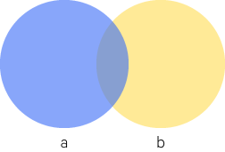

The overlap is where both $a$ and $b$ occur ($P(a, b)$).

The previous axiom, describing $P(a \cup b)$, adds the spaces where $a$ and $b$ each occur, but this counts their overlap twice, so we subtract it once.

## Conditional Probability

The conditional probability is the probability of $A$ given $B$, notated $P(A|B)$.

Formally, this is:

$$
P(A|B) = \frac{P(A \cap B)}{P(B)}
$$

Where $P(B) > 0$.

For example, say you have two die. Say $A = \{ \text{snake eyes} \}$ and $B = \{ \text{double} \}$.

$P(A) = \frac{1}{36}$ since out of the 36 possible dice pairings, only one is snake eyes.
$P(B) = \frac{1}{6}$ since 6 of the 36 possible dice pairings are doubles.

Now what is $P(A|B)$? Well, intuitively, if $B$ has happened, we have reduced our possible event space to just the 6 doubles, one of which is snake eyes, so $P(A|B) = \frac{1}{6}$.

Intuitively, this can be thought of as the probability of $a$ given a universe where $b$ occurs.

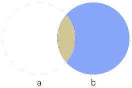

So we ignore the part of the world in which $b$ does not occur.

This can be re-written as:

$$
P(a,b) = P(a|b)P(b)
$$

## Independence

Events $X$ and $Y$ are independent if:

$$P(X \cap Y) = P(X)P(Y)$$

That is, their outcomes are unrelated.

Another way of saying this is that:

$$P(X|Y) = P(X)$$

Knowing something about $Y$ tells us nothing more about $X$.

The independence of $X$ and $Y$ can also be notated as $X \perp Y$.

From this we can infer that:

$$
P(X,Y) = P(X)P(Y)
$$

More generally we can say that events $A_1, \dots, A_n$ are __mutually independent__ if $P(\bigcap_{i \in S} A_i) = \prod_{i \in S} P(A_i)$ for any $S \subset \{1, \dots, n\}$. That is, the joint probability of any subset of these events is just equal to the product of their individual probabilities.

Mutual independence implies pairwise independence, but note that the converse is not true (that is, pairwise independence does not imply mutual independence).

### Conditional Independence

__Conditional independence__ is defined as:

$$
P(X|Y,Z) = P(X|Z)
$$

If $X$ is independent of $Y$ conditioned on $Z$.
Which is to say $X$ is independent of $Y$ if $Z$ is true or known.

From this we can infer that:

$$
P(X,Y|Z) = P(X|Z)P(Y|Z)
$$

Note that mutual independence does not imply conditional independence.

Similarly, we can say that events $A_1, \dots, A_n$ are conditionally independent given $C$ if $P(\bigcap_{i \in S} A_i | C) = \prod_{i \in S} P(A_i | C)$ for any $S \subset \{1, \dots, n\}$.

## The Chain Rule of Probability

Say we have the joint probability $P(a,b,c)$. How do we turn this into conditional probabilities?

We can set $y=b,c$ (that is, the intersection of $b$ and $c$), then we have $P(a,b,c) = P(a,y)$, and we can just apply the previous equation:

$$
\begin{aligned}
P(a,y) &= P(a|y)P(y) \\
P(a,b,c) &= P(a|b,c)P(b,c)
\end{aligned}
$$

And we can again apply the previous equation to $P(b,c)$, which gets us:

$$
P(a,b,c) = P(a|b,c)P(b|c)P(c)
$$

This is generalized as the __chain rule of probability__:

$$
P(x_1, \dots, x_n) = \prod^1_{i=n} P(x_i|x_{i-1}, \dots, x_1)
$$

## Combinations and Permutations

### Permutations

With permutations, _order matters_. For instance, $AB$ and $BA$ are different _permutations_ (though they are the same _combination_, see below).

Permutations are notated:

$$ {}_xP_y = P_y^x = P(x,y) $$

Where:

- $x$ = total number of "items"
- $y$ = "spots" or "spaces" or "positions" available for the items.

A permutation can be expanded like so:

$$ {}_nP_k = n, n-1, n-2, \dots, n-(k-1) $$

And generalized to the following formula:

$$ {}_nP_k = \frac{n!}{(n-k)!} $$

For example, consider ${}_7P_3$. $7! = 7\times6\times5\times4\times3\times2\times1$, and we only have 3 positions, i.e. 7-6-5, so we divide by $4!$ to get our final answer.

### Combinations
With combinations, the order _doesn't_ matter.

The notation is basically the same as permutation, except with a $C$ instead of a $P$.:

$$ {}_nC_k = \frac{{}_nP_k}{k!} $$

or, expanded:

$$ {}_nC_k = \frac{n!}{k!(n-k)!} = {n \choose k} $$

The $n$ and $k$ pairing together is known as the __binomial coefficient__, and read as "n choose k".

### Combinations, permutations, and probability

#### Example

> Say you have a a coin. What is $P(\frac{3}{8}H)$? That is, what is the probability of flipping _exactly_ 3 heads?

$P(\frac{3}{8}H)$ is equal to the combination of $8 \choose 3$. That is, we are basically trying to find all the combinations of 3 head flips out of the total 8 flips.

$$ {}_8C_3 = 56 $$

So there are 56 possible outcomes that result in exactly 3 heads. Because a coin has two possible outcomes, and we're flipping 8 times, we know there are $2^8$ total possible outcomes.

So to figure out the probability, we can just take the ratio of these outcomes.

$$ P(\frac{3}{8}H) = \frac{56}{2^8} = \frac{7}{32} $$

#### Example

> Given outcome $P(A) = 0.8$ and $P(B) = 0.2$, what is $P(\frac{3}{5}A)$? That is, the possibility of exactly 3 out of 5 trials being A.

Basically, like before, we're looking for possible combinations of $\frac{3}{5}A$, that is 5 choose 3, i.e. ${}_5C_3 = 10$.

So we know there are 10 possible outcomes resulting in $\frac{3}{5}A$. But what is the probability of a single combination that results in $\frac{3}{5}A$? We were given the probabilities so it's just multiplying:

$$ P(A)P(A)P(A)P(B)P(B) = 0.8^3 \times 0.2^2 $$

So then we just multiply the number of these combinations, 10, by this resulting probability to get the final answer.

## Probability Distributions

For some random variable $X$, there is a __probability distribution function__ $P(X)$ (usually just called the __probability distribution__); the particular kind depends on what kind of random variable $X$ is (i.e. discrete or continuous). A probability distribution describes the probability of a random variable taking on its possible values.

If the random variable $X$ is distributed according to, say, a Poisson distribution, we say that "$X$ is Poisson-distributed".

Distributions themselves are described by __parameters__ - variables which determine the specifics of a distribution. Different kinds of distributions are described by different sets of parameters. For instance, the particular shape of a normal distribution is determined by $\mu$ (the mean) and $\sigma$ (the standard deviation); we say the normal distribution is __parameterized__ by $\mu$ and $\sigma$. Often we are given a set of data and assume it comes from a particular kind of distribution, such as a normal distribution, but we don't know the specific _parameterization_ of the distribution; that is, with the normal distribution example, we don't know what $\mu$ and $\sigma$ are, so we use the data we have and try and infer these unknown parameters.

### Probability Mass Functions (PMF)

For discrete random variables, the distribution is a __probability mass function__.

It is called a "mass function" because it divides a unit mass (the total probability) across the different values the random variable can take.

In the example figure, the random variable can take on one of three discrete values, $\{1,3,7\}$, with the corresponding probabilities illustrated in the PMF.

### Probability Density Functions (PDF)

For continuous random variables we have a __probability density function__. A probability density function $f$ is a non-negative, integrable function such that:

$$
\int_{\Val(X)} f(x)dx = 1
$$

Where $\Val(X)$ denotes the range of the random variable $X$, so this is the integral over the range of possible values for $X$.

The total area under the curve sums to 1 (which is to say that the aggregate probability of all possible values for $X$ sums to 1).

The probability of a random variable $X$ distributed according to a PDF $f$ is computed:

$$
P(a \leq X \leq b) = \int_a^b f(x)dx
$$

It's worth noting that this implies that, for a continuous random variable $X$, the probability of taking on any given _single_ value is zero (when dealing with continuous random variables there are infinitely precise values). Rather, we compute probabilities for a range of values of $X$; the probability is given by the area under the curve over this range.

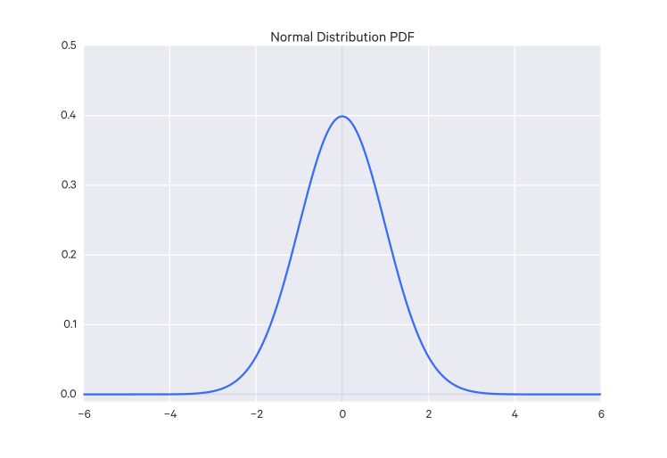

### Distribution Patterns

There are a few ways we can describe distributions.

- __Unimodal__: The distribution has one main peak.
- __Bimodal__: The distribution has two (approximately) equivalent main peaks.
- __Multimodal__:  The distribution has more than two (approximately) equivalent main peaks.
- __Symmetrical__: The distribution falls in equal numbers on both sides of the middle.

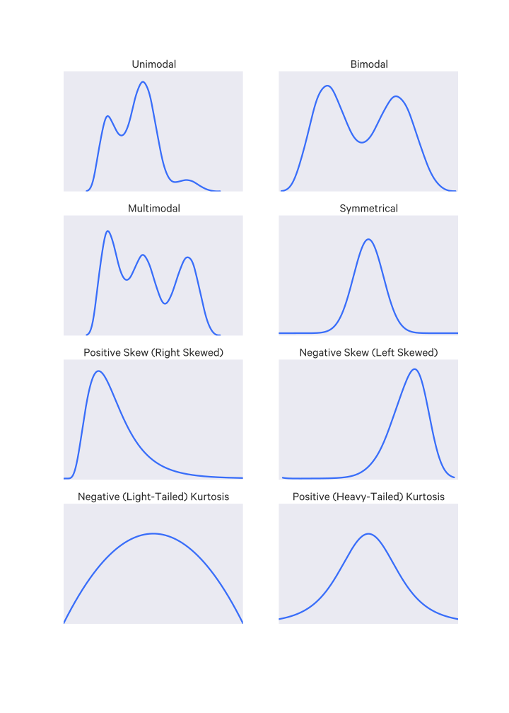

#### Skewness
__Skewness__ describes distributions that have greater density on one side of the distribution. The side with less is the direction of the skew.

Skewness is defined:

$$
\text{skewness} = E[(\frac{X -\mu}{\sigma})^3]
$$

Where $\sigma$ is just the standard deviation.

The normal distribution has a skewness of 0.

#### Kurtosis
__Kurtosis__ describes how the shape differs from a normal curve (if the tails are lighter or heavier).

Kurtosis is defined:

$$
\text{kurtosis} = \frac{E[(X-\mu)^4]}{(E[(X-\mu)^2])^2}
$$

The standard normal distribution has a kurtosis of 3, so sometimes kurtosis is standardized by subtracting 3; this standardized kurtosis measure is called the _excess kurtosis_.

## Cumulative Distribution Functions (CDF)

A cumulative distribution function $\CDF(x)$, often also denoted $F(x)$, describes the cumulative probability up to where the random variable takes the value $x$, which is to say it tells you $P(X \leq x)$.

The _complimentary distribution_ (CCDF) of a distribution is $1 - \text{CDF}(x)$.

### Discrete random variables

The cumulative distribution function of a discrete random variable is just the sum of the probabilities for the values up to $x$.

Say our discrete random variable $X$ can take values from $\{x_1, \dots, x_n \}$. We can define the CDF for $X$ as:

$$\CDF(x) = \sum_{\{x_i | x_i \leq x\}}P(X=x_i)$$

The complete discrete CDF is a step function, as you might expect because the CDF is constant between discrete values.

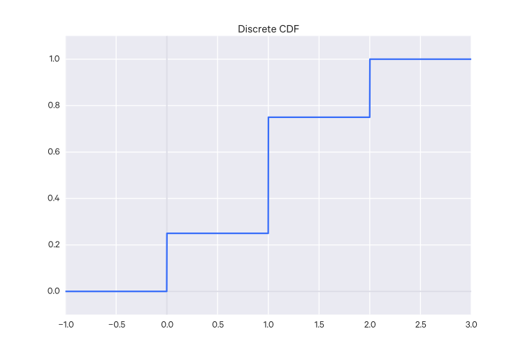

### Continuous random variables

The cumulative distribution function of a continuous random variable is:

$$ \CDF(x) = \int_{-\infty}^x{P(X)dx} $$

That is, it is the integral of the PDF up to the value in question.

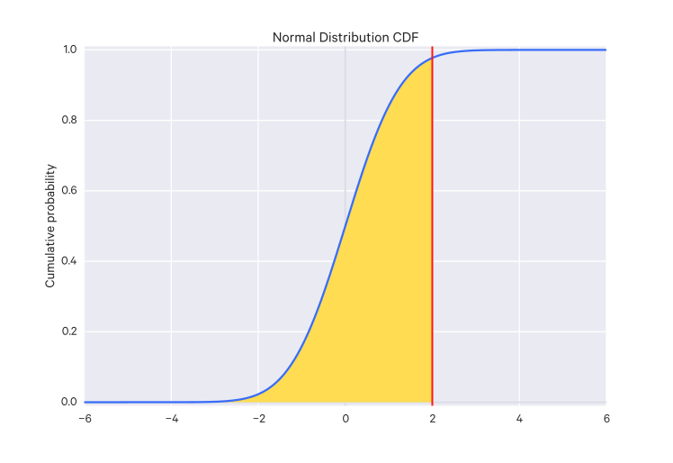

Probability values for a specific range $x_1 \to x_2$ can be calculated with:

$$ \CDF(x_2) - \CDF(x_1) $$

or more simply:

$$ \CDF(x) = \int_{x_1}^{x_2}{P(x)dx} $$

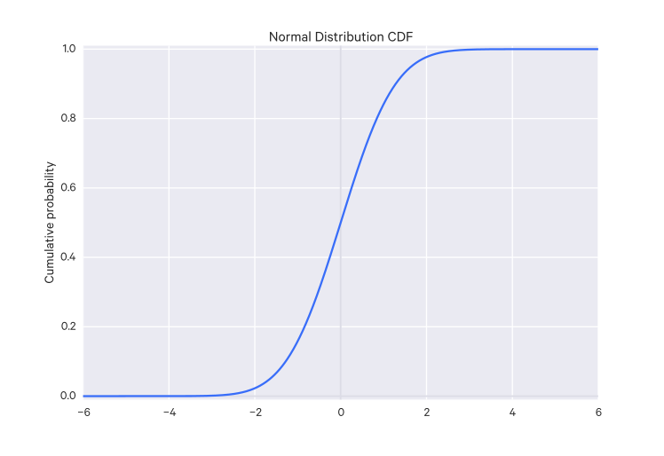

### Using CDFs

Visually, there are a few tricks you can do with CDFs.

You can estimate the median by looking at where $\CDF(x) = 0.5$, i.e.:

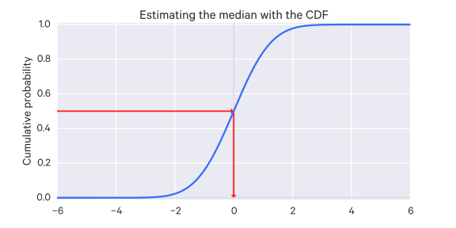

You can estimate the probability that your $x$ falls between two values:

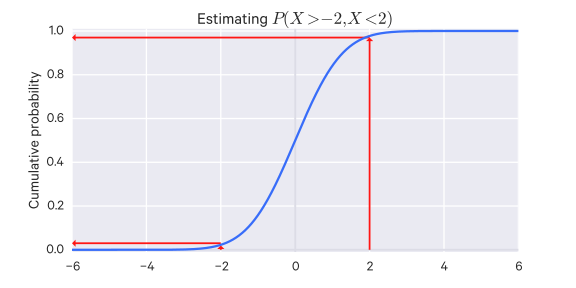

You can estimate a confidence interval as well. For example, the 90% confidence interval by looking at the $x$ values in the range which produces $\CDF(x) = 0.05$ and $\CDF(x) = 0.95$.

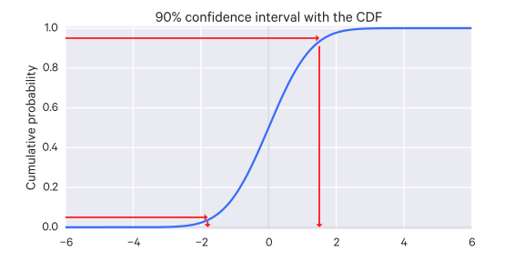

### Survival function

The __survival function__ of a random variable $X$ is the complement of the CDF, that is, it is the probability that the random variable is greater than some value $x$, i.e. $P(X > x)$. So the survival function is:

$$
S(x) = P(X > x) = 1 - \CDF(x)
$$

## Expected Values

The expected value of a random variable $X$ is:

$$ E[X] = \mu $$

That is, it is the average (mean) value.

It can be thought of as a way of "summarizing" a random variable to a single value.

It can be thought of as a sample from a potentially infinite population. A sample from that population is expected to be the mean of that population. The value of that mean depends on the distribution of that population.

### Discrete random variables

For a discrete random variable $X$ with a sample space $X(\Omega)$ (i.e. all possible values $X$ can take) and with a PMF $p$, the expected value is:

$$
E[X] = \sum_{x \in X(\Omega)} xP(X=x)
$$

The expected value exists only if this sum is well-defined, which basically means it has to aggregate in some clear way, as either a finite value or positive or negative infinity. But it can't, for instance, contain a positive infinity and a negative infinity term simultaneously, because it's undefined how those combine.

For example, consider the infinite sum $1 - 1 + 1 - 1 + \dots$. The $-1$ terms go to negative infinity and the $+1$ terms go to positive infinity - this is an undefined sum.

### Continuous random variables

For a continuous random variable $X$ and a PDF $f$, the expected value is:

$$
E[X] = \int_{-\infty}^{\infty} x f(x) dx
$$

The expected value exists only when this integral is well-defined.

### The expectation rule

A function $g(X)$ of a random variable $X$ is itself a random variable. The expected value of that function can be expressed based on the random variable $X$, like so:

$$
\begin{aligned}
E[g(x)] &= \sum_{x \in X(\Omega)} g(x) p(x) \\
E[g(x)] &= \int_{-\infty}^{\infty} g(x) f(x) dx
\end{aligned}
$$

Using whichever is appropriate, depending on if $X$ is discrete or continuous.

### Jensen's Inequality

Jensen's Inequality states that given a convex function $g$, then $E[g(X)] \geq g(E[X])$.

### Properties of expectations

For random variables $X$ and $Y$ where $E[|X|] < \infty$ and $E[|Y|] < \infty$ (that is, $E[X], E[Y]$ are finite), we have the following properties:

1. $E(a) = a$ for all $a \in \mathbb R$. That is, the expected value of a constant is just the constant. This is called the _normalization_ property.
2. $E(aX) = aE(X)$ for all $a \in \mathbb R$
3. $E(X+Y) = E(X) + E(Y)$
4. If $X \geq 0$, that is, all possible values of $X$ are greater than 0, then $E[X] \geq 0$
5. If $X \leq Y$, that is, each possible value of $X$ is less than each possible value of $Y$, then $E[X] \leq E[Y]$. This is called the _order_ property.
6. If $X$ and $Y$ are independent, then $E[XY] = E[X]E[Y]$. Note that the converse is not true; that is, if $E[XY] = E[X]E[Y]$, this does not necessarily mean that $X$ and $Y$ are independent.
7. $E[I_A(X)] = P(X \in A)$, that is, the expected value of an indicator function:

$$
I_A(x) =
\begin{cases}
1 & \text{if $x \in A$} \\
0 & \text{otherwise}
\end{cases}
$$

is the probability that the random variable $X$ is in $A$.

Properties 2 and 3 are called _linearity_.

To put linearity another way: Let $X_1, X_2, \dots, X_n$ be random variables, which may be dependent or independent:

$$
E(X_1 + X_2 + \cdots + X_n) = E(X_1) + E(X_2) + \cdots + E(X_n)
$$

## Variance

The __variance__ of a distribution is the "spread" of a distribution.

The variance of a random variable $X$ tells us how spread out the data is along that variable's axis/dimension.

It can be defined in a couple ways:

$$
\begin{aligned}
\Var(X) &= E[(X-E[X])^2]
&= E[X^2] - E[X]^2
\end{aligned}
$$

Variance is not a linear function of $X$, for instance:

$$
\Var(aX+b) = a^2\Var(X)
$$

If random variables $X$ and $Y$ are independent, then:

$$
\Var(X+Y) = \Var(X) + \Var(Y)
$$

### Covariance

The __covariance__ of two random variables is a measure of how "closely related" they are:

$$
\Cov(X,Y) = E[(X-E[X])(Y-E[Y])]
$$

With more than two variables, a __covariance matrix__ is used.

Covariance matrices show two things:

- the variance of a variable $i$, located at the $i,i$ element
- the covariance of variables $i,j$, located at the $i,j$ and $j,i$ elements

If the covariance between two variables is negative, then we have a downward slope, if it is positive, then we have an upward slope.

So the covariance matrix tells us a lot about the shape of the data.

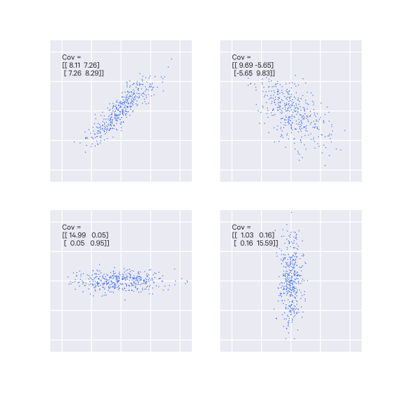

## Common Probability Distributions

Here a few distributions you are likely to encounter are described in more detail.

### Probability mass functions

#### Bernoulli Distribution

A random variable distributed according to the Bernoulli distribution can take on two possible values $\\{0, 1\\}$, typically described as "failure" and "success" respectively. It has one parameter $p$, the probability of success, which is taken to be $P(X=1)$. Such a random variable is sometimes called a __Bernoulli random variable__.

The distribution is described as:

$$
P(X) = p^x(1-p)^{1-x}
$$

And for a Bernoulli random variable $X$, it is notated $X \sim \Ber(p))$. $X$ is 1 with probability $p$ and $X$ is 0 with probability $1-p$.

The mean of a Bernoulli distribution is $\mu = p$, and the standard deviation is $\sigma = \sqrt{p(1-p)}$.

A Bernoulli distribution describes a single trial, though often you may consider multiple trials, each with its own random variable.

#### Geometric Distribution

Say we have a set of iid Bernoulli random variables, each representing a trial. What is the probably of finding the first success at the $n$th trial?

This can be described with a geometric distribution, which is a distribution where the probabilities decrease exponentially fast.

It is formalized as:

$$
P(n) = (1-p)^{n-1}p
$$

With the mean $\mu = \frac{1}{p}$ and the standard deviation $\sigma = \sqrt{\frac{1-p}{p^2}}$.

#### Binomial Distribution

Suppose you have a binomial experiment (i.e. one with two mutually exclusive outcomes, such as "success" or "failure") of $n$ trials (that is, $n$ Bernoulli trials), where $p$ is the probability of success on an individual trial, and is the same across all trials (that is, the trials are $n$ iid Bernoulli random variables). You want to determine the probability of $k$ successes in those $n$ trials.

Note that _binomial_ is in contrast to _multinomial_ in which a random variable can take on more than just two discrete values. This shouldn't be confused with _multivariate_ which refers to a situation where there are multiple variables.

The resulting distribution is a __binomial distribution__, such as:

The binomial distribution has the following properties:

$$ \mu = np $$
$$ \sigma = \sqrt{np(1-p)} $$

The binomial distribution is expressed as:

$$ P(X=k) = {n \choose k}p(1-p)^{n-k} $$

A binomial random variable $X$ is denoted:

$$
X \sim \Bin(n, p)
$$

Here $X$ ends up being the number of events that occurred over our trials.

Its expected value is:

$$
E[Z|N,p] = Np
$$

The binomial distribution has two parameters:

- $n$ - a positive integer representing the number of trials
- $p$ - the probability of an event occurring in a single trial

The special case $N=1$ corresponds to the _Bernoulli distribution_.

If we have $Z_1, Z_2, \dots, Z_N$ Bernoulli random variables with the same $p$, then $X = Z_1 + Z_2 + \dots + Z_N \sim \Bin(N,p)$.

Thus the expected value of a Bernoulli random variable is $p$ (because $N=1$).

Some example questions that can be answered with a binomial distribution:

- Out of ten tosses, how many times will this coin be heads?
- From the children born in a given hospital on a given day, how many of them will be girls?
- How many students in a given class room will have green eyes?
- How many mosquitoes, out of a swarm, will die when sprayed with insecticide?

([Source](http://work.thaslwanter.at/Stats/html/statsDistributions.html))

When the number of trials $n$ gets large, the shape of the binomial distribution starts to approximate a normal distribution with the parameters $\mu = np$ and $\sigma = \sqrt{np(1-p)}$.

#### Negative Binomial Distribution

The negative binomial distribution is a more general form of the geometric distribution; instead of giving the probability of the _first_ success in the $n$th trial, it gives the probability of an arbitrary $k$th success in the $n$th trial. Like the geometric and binomial distribution, it is expected that the trials are iid Bernoulli random variables. The other requirement is that the last trial is a success.

This distribution is described as:

$$
P(k|n) = {n-1 \choose k-1}p^k(1-p)^{n-k}
$$

#### Poisson Distribution

The __Poisson distribution__ is useful for describing the number of rare (independent) events in a large population (of independent individuals) during some time span. It looks at how many times a discrete event occurs, over a period of continuous space or time; without a fixed number of trials.

$$
P(X=k) = \frac{\lambda^k e^{-\lambda}}{k!}, k = 0,1,2, \dots
$$

If $X$ is Poisson-distributed, we notate it:

$$
X \sim \Poi(\lambda)
$$

For the Poisson distribution $\lambda$ is any positive integer. Its size is proportional to the probability of larger values in the distribution. That is, increasing $\lambda$ assigns more probability to large values; decreasing it assigns more probability to small values. It is sometimes called the _intensity_ of the distribution.

For the Poisson distribution, $\lambda$ is known as the "(average) arrival rate" or sometimes just the "rate".

$k$ must be a non-negative integer (e.g. $0,1,2,\dots$).

A shorthand for saying that $X$ has a Poisson mass distribution is $X \sim \Poi(\lambda)$.

For Poisson distributions, the expected value of our random variable is equal to the parameter $\lambda$, that is:

$$ E[X | \lambda] = \mu = \lambda $$

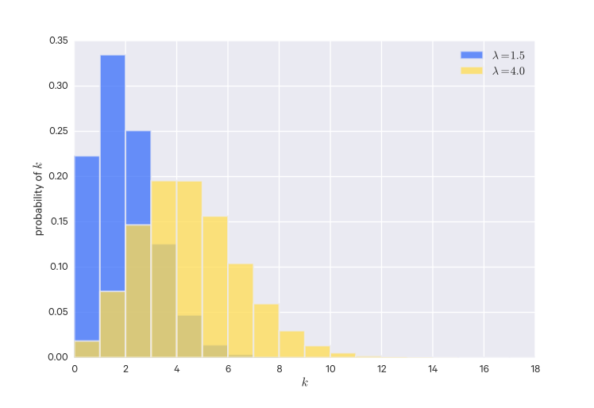

In the Poisson distribution figure, although it looks like the values fall off at some point, it actually has an infinite tail, so that _every_ positive integer has some positive probability.

##### Example

> On average, 9 cars pass this intersection every hour. What is the probability that two cars pass the intersection this hour? Assume a Poisson distribution.

This problem can be framed as: what is $P(x = 2)$?

We know the expected value is 9 and that we have a Poisson distribution, so $\lambda = 9$ and:

$$ P(x = 2) = \frac{9^2}{2!}e^{-9} $$

Some example questions that can be answered with a Poisson distribution:

- How many pennies will I encounter on my walk home?
- How many children will be delivered at the hospital today?
- How many products will I sell after airing a new television commercial?
- How many mosquito bites did you get today after having sprayed with insecticide?
- How many defects will there be per 100 metres of rope sold?

([Source](http://work.thaslwanter.at/Stats/html/statsDistributions.html))

### Probability density functions

#### Uniform distribution

With the uniform distribution, every value is equally likely.

It may be constrained to a range of values as well.

#### Exponential Distribution

A random variable which is continuous may have an _exponential density_, often describe as an _exponential random variable_:

$$
f_X(x|\lambda) = \lambda e^{-\lambda x}, x \geq 0
$$

Here we say $X$ is _exponential_:

$$
X \sim \Exp(\lambda)
$$

Like the Poisson random variable, the exponential random variable can only have positive values. But because it is continuous, it can also take on non-integral values such as 4.25.

For exponential distributions, the expected value of our random variable is equal to the inverse of the parameter $\lambda$, that is:

$$ E[X | \lambda] = \frac{1}{\lambda} $$

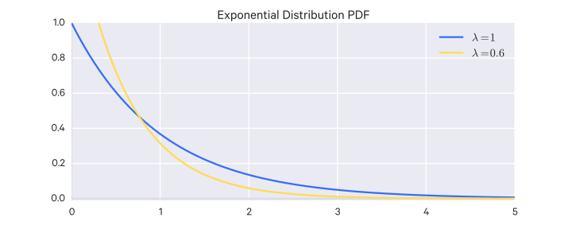

###### Example

> Say we have the random variable $y$ which is the exact amount of rain we will get tomorrow, in inches. What is the probability that $y = 2 \pm 0.1$? Assume you have the probability density function $f$ for $y$.

We'd notate the probability we're looking for like so:

$$ P(|Y-2| < 0.1) $$

Which is the probability that $y \approx 2$ within a tolerance (acceptable deviance) of 0.1 (i.e. 1.9 to 2.1).

Then we would just find the integral (area under the curve) of the PDF from 1.9 to 2.1, i.e.

$$ \int_{1.9}^{2.1}{f(x)d} $$

#### Gamma Distribution

$$
X \sim \Gam(\alpha, \beta)
$$

This is over positive real numbers.

It is just a generalization of the exponential random variable:

$$
\Exp(\beta) \sim \Gam(1, \beta)
$$

The PDF is:

$$
f(x|\alpha, \beta) = \frac{\beta^{\alpha}x^{\alpha -1}e^{\beta x}}{\Gamma(\alpha)}
$$

Where $\Gamma(\alpha)$ is the _Gamma function_.

#### Normal (Gaussian) Distribution

The normal distribution is perhaps the most common probability distribution, occurring very often in nature.

For a random variable $x$, the normal probability density function is^[$\exp(x) = e^x$]:

$$ P(x) = \frac{1}{\sigma\sqrt{2\pi}} \exp(-\frac{(x-\mu)^2}{2\sigma^2}) $$

The (univariate) Gaussian distribution is parameterized by $\mu$ and $\sigma$ (for multivariate Gaussian distributions, see below).

The peak of the distribution is where $x = \mu$.

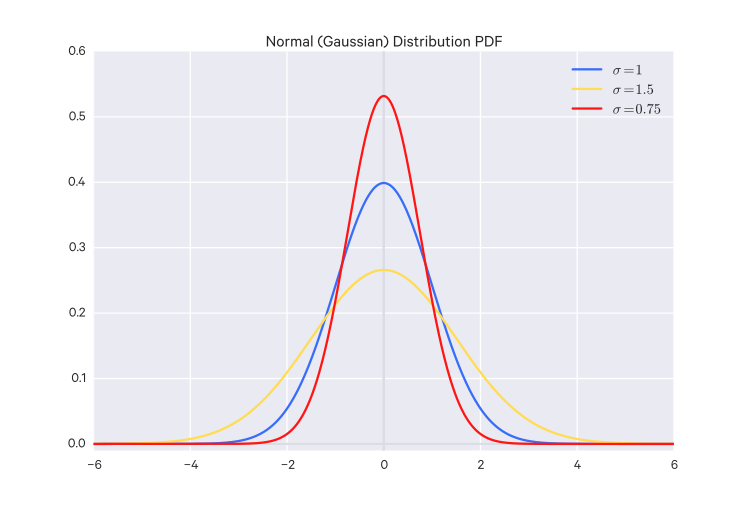

The height and width of the distribution varies according to $\sigma$. The lower $\sigma$ is, the higher and thinner the distribution is; the higher $\sigma$ is, the lower and wider the distribution is.

The _standard_ normal distribution is just $N(0, 1)$.

The Gaussian distribution can be used to approximate other distributions, such as the binomial distribution when the number of experiments is large, or the Poisson distribution when the average arrival rate is high.

A normal random variable $X$ is denoted:

$$
X \sim N(\mu, \sigma)
$$

Where the parameters are:

- $\mu$ = the mean
- $\sigma$ = the standard deviation

The expected value is:

$$
E[X|\mu, \sigma] = \mu
$$

#### t Distribution

For small sample sizes ($n<30$), the distribution of the sample mean deviates slightly from the normal distribution since the sample mean doesn't exactly match the population's mean. This distribution is the t-distribution.

This distribution is the t-distribution, which, for large enough sample sizes ($>=30$), converges to the normal distribution, so it may also be used for large sample sizes too.

The t-distribution has thicker tails than the normal distribution, so observations are more likely to be within two standard deviations of its mean. This allows for more accurate estimations of the standard error for small sample sizes.

The t-distribution is always centered around zero and is described by one parameter: the __degrees of freedom__. The higher the degrees of freedom, the closer the t-distribution is to the standard normal distribution.

The confidence interval is computed slightly differently for a t distribution. Instead of the Z score we use a cutoff, $t_{\df}$, determined by the degrees of freedom for the distribution.

For a single sample with $n$ observations, the degrees of freedom is $\df = n-1$. For two samples, you can use a computer to calculate the degrees of freedom, or you can choose the smallest sample size minus 1.

The t-distribution's corresponding test is the t-test, sometimes called the "Student t-test", which is used to compare the means of two groups.

From the t-distribution we can calculate a t value:

$$ t = \frac{\bar{x}-\mu}{s/ \sqrt{n}} $$

Then we can use this t value with the t distribution with the degrees of freedom for the sample and use that to compute a p-value.

#### Beta Distribution

For an event with two outcomes, the beta distribution is the probability distribution of the probability of the outcome being positive. The beta distribution's domain is $[0, 1]$ which makes it appropriate for this use.

That is, in a beta distribution both the $y$ and the $x$ axes represent probabilities. The $x$-axis is the possible probabilities for the events in question,
and the $y$-axis is the probability that that possible probability is the true probability.

It is notated:

$$ \Bet(\alpha, \beta) $$

Where $\alpha$ is the number of positive examples and $\beta$ is the number of negative examples.

Its PDF is:

$$
f(x|\alpha, \beta) = \frac{x^{\alpha-1}(1-x)^{\beta-1}}{B(\alpha, \beta)}
$$

Where $B(\alpha, \beta)$ is the _Beta function_.

The Beta distribution is a generalization of the uniform distribution:

$$
\Uni() \sim \Bet(1,1)
$$

The mean of a beta distribution is just $\frac{\alpha}{\alpha + \beta}$ which is pretty straightforward if you think about it.

If you need to estimate the probability of something happening, the beta distribution can be a good prior since it is quite easy to calculate its posterior distribution:

$$
\Bet(\alpha_{\text{posterior}}, \beta_{\text{posterior}}) = \Bet(\alpha_{\text{likelihood}} + \alpha_{\text{prior}}, \beta_{\text{likelihood}} + \beta_{\text{prior}})
$$

That is, you just use some plausible prior values for $\alpha$ and $\beta$ such that you have a plausible mean, then just add your new positive and negative examples to update the beta distribution.

#### Weibull Distribution

The Weibull distribution is used for modeling reliability or "survival" data, e.g. for dealing with failure-rates.

It is defined as:

$$
  f_x (x) =
\begin{cases}
  k \frac{x^{k-1}}{\lambda^k} e^{-(x/\lambda)^{k}} & x\geq0 \\
  0 & x<0
\end{cases}
$$

The $k$ parameter is the _shape parameter_ and the $\lambda$ parameter is the _scale parameter_ of the distribution.

If $x$ is the "time-to-failure", the Weibull distribution describes the failure rate over time. In this case, the parameter $k$ influences how the failure rate changes over time: if $k < 1$, the failure rate decreases over time (for instance, defective products fail early and are weeded out), if $k=1$, the failure rate is constant, and if $k>1$, then the failure rate increases with time (e.g. parts degrade over time).

#### Chi-square ($\chi^2$) distribution

The $\chi^2$ distribution is closely related to the normal distribution and often used as a sampling distribution.
The $\chi^2$ distribution with $f$ degrees of freedom, sometimes notated $\chi_{[f]}^2$, is the sum of the squares of $f$ independent standard normal (e.g. $\mu=0, \sigma=1$) variates, i.e.:

$$
Y = X_1^2 + X_2^2 + \dots + X_f^2
$$

This distribution has a mean $f$ and a variance of $2f$ (this comes from the additive property of the mean and the variance). The skewness of the distribution follows the same additive property and is $\sqrt{\frac{8}{f}}$. So when $f$ is small, the distribution skews to the right, and the skewness decreases as $f$ increases. When $f$ is very large the distribution approaches the standard normal distribution (by the central limit theorem).

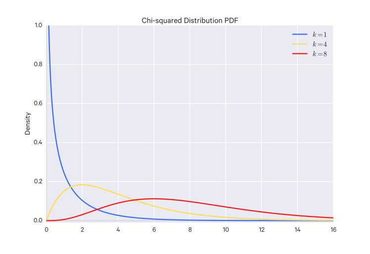

## Pareto distributions

A Pareto distribution has a CDF with the form:

$$
\text{CDF}(x) = 1 - (\frac{x}{x_m})^{-\alpha}
$$

They are characterized as having a long tail (i.e. many small values, few large ones), but the large values are large enough that they still make up a disproportionate share of the total (e.g. the large values take up 80% of the distribution, the rest are 20%).

Such a distribution is described as _scale-free_ since they are not centered around any particular value. Compare this to Gaussian distributions which are centered around some value.

Such a distribution is said to obey the _power law_. A distribution $P(k)$ obeys the power law if, as $k$ gets large, $P(k)$ is asymptotic to $k^{-\gamma}$, where $\gamma$ is a parameter that describes the rate of decay.

Such distributions are (confusingly) sometimes called _scaling distributions_ because they are invariant to changes of scale, which is to say that you can change the units the quantities are expressed in and $\gamma$ doesn't change.

## Multiple random variables

In the real world you often work with multiple random variables simultaneously - that is, you are working in higher dimensions. You could describe a group of random variables as a _random vector_, i.e. a random vector $X \in \mathbb R^d$, where $d$ is the number of dimensions (the number of random variables) you are working in, i.e. $X = [X_1, \dots, X_d]$.

A distribution over multiple random variables is called a _joint distribution_.

For a joint distribution $P(a, b)$, the distribution of a subset of variables is called a _marginal distribution_ (or just _marginal_) of the joint distribution, and is computed:

$$
P(a) = \sum_{b} P(a,b)
$$

That is, fix $b$ to each of its possible outcomes and sum those probabilities.

Generally, you can compute the marginal like so:

$$
P(x_1, \dots, x_{i-1}, x_{i+1}, \dots, x_n) = \sum_{x_i} P(x_1, \dots, x_n)
$$

So you take the variable you want to remove and sum over the probabilities with it fixed for each of its possible outcomes.

The distribution over multiple random variables is called a __joint distribution__. When we have multiple random variables, the distribution of some subset of those random variables is the __marginal distribution__ for that subset.

The probability density function for a joint distribution just takes more arguments, i.e.:

$$
P(a_1 \leq X_1 \leq b_1, a_2 \leq X_2 \leq b_2, \dots, a_n \leq X_n \leq b_n) = \int_{a_1}^{b_1} \int_{a_2}^{b_2} \cdots \int_{a_n}^{b_n} f(x_1, x_2, \dots, x_n)dx_1 dx_2 \dots dx_n
$$

### Conditional distributions

Conditional distributions are distributions in which the value of one or more other random variables are known.

For random variables $X, Y$, the conditional probability of $X=a$ given $Y=b$ is:

$$
P(X=a|Y=b) \frac{P(X=a,Y=b)}{P(Y=b)}
$$

which is undefined if $P(Y=b) = 0$.

This can be expanded to multiple given random variables:

$$
P(X=a|Y=b,Z=c) \frac{P(X=a,Y=b,Z=c)}{P(Y=b,Z=c)}
$$

The conditional distribution of $X$, conditioned on $Y=b$, is notated $P(X|Y=b)$.

More generally, we can describe the conditional distribution of $X$ conditioned on $Y$ on all its values as $P(X|Y)$.

For continuous random variables, the probability of the random variable being a given specific value is 0 (see the section on probability density functions), so here we have the denominator as 0, which won't do. However, it can be shown that the probability density function $f(y|x)$ underlying the distribution $P(Y|X)$ is given by:

$$
f(y|x) = \frac{f(x,y)}{f(x)}
$$

And thus:

$$
P(a \leq Y \leq b|X=c) = \int_a^b f(y|c)dy = \int_a^b \frac{f(c,y)}{f(c)}dy
$$

### Multivariate Gaussian

A random vector $X$ is (multivariate) Gaussian (or "normal") if any linear combination is (univariate) Gaussian.

Note that "Gaussian" often implies "multivariate Gaussian".

That is, the dot product of some vector $a$ transpose with $X$, which is:

$$
a^T X = \sum^n_{i=1} a_i X_i
$$

is Gaussian for every $a \in \mathbb R^n$.

We say $X$ is (multivariate) Gaussian distributed with mean $\mu$ (where $\mu \in \mathbb R^n$, that is, $\mu$ is a vector as well) and covariance matrix $C$, notated:

$$
X \sim N(\mu, C)
$$

which means $X$ is Gaussian with $E[X_i] = \mu_i$ and $C_{ij} = \Cov(X_i, X_j)$ and $C_{ii} = \Var(X_i)$.

$\mu$ and $C$ are the parameters of the distribution.

If $X$ is a random vector, $X \in \mathbb R^n$, i.e. $[X_1, \dots, X_n]$, and a Gaussian, i.e. $X \sim N(\mu, C)$ where $\mu$ is a vector $\mu = [\mu_1, \dots, \mu_n]$, and if the covariance matrix $C$ has the variances on its diagonal and 0 everywhere else, like below, then the components of $X$ are independent and individually normally distributed, i.e. $X_i \sim N(\mu_i, \sigma_i^2)$.

Caveat: a random vector's individual components being Gaussian but _not_ independent does not necessarily imply that the vector itself is Gaussian.

$$
C =
\begin{pmatrix}
\sigma_1^2 & 0 & \cdots & 0 \\
0 & \ddots & \vdots & \vdots \\
\vdots & \vdots & \ddots & 0 \\
0 & \cdots & 0 & \sigma_n^2
\end{pmatrix}
= \Diag(\sigma_1^2, \dots, \sigma_n^2)
$$

Intuitively this makes sense because if $X_i$ and $X_j$ are independent, then their covariance $\Cov(X_i, X_j) = 0$. So all the $i,j$ entries in $C$  where $i \neq j$ are 0. This does not necessarily hold for non-Gaussians; this is a property particular to Gaussians.

#### Degenerate univariate Gaussian

A _degenerate_ univariate Gaussian distribution is one where $X \equiv \mu$, that is: $X \sim N(\mu, 0)$.

#### Degenerate multivariate Gaussian

A multivariate Gaussian can also be degenerate, which is when the determinant of its covariance matrix $C$ is 0.

#### Examples of Gaussians (and non-examples)

These are some examples of what Gaussians can look like. Drawn over the first two are their _level sets_ which demarcate where the density is constant (you can think of it like a topographical map).

The last example is a degenerate Gaussian.

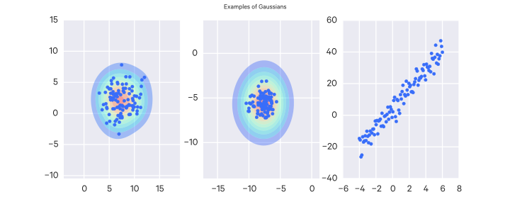

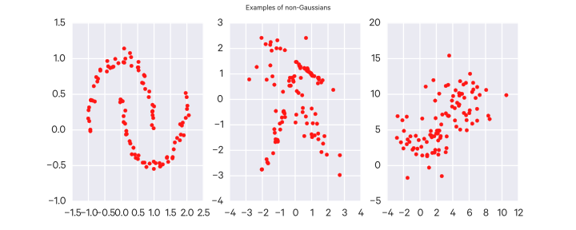

#### Probability density function

A multivariate Gaussian random variable $X \sim N(\mu, C)$ only has a density function if it is nondegenerate (i.e. $\Det(C) \neq 0$).

The PDF is:

$$
\frac{1}{\sqrt{|2\pi C|}} \exp(-\frac{1}{2}(x - \mu)^T C^{-1}(x-\mu))
$$

Note that $|A| = \Det(A)$, and the term $|2 \pi C|$ can be also written as $(2\pi)^n \Det(C)$.

#### Affine property

An __affine transformation__ is just some function in the form $f(x) = Ax + b$.

Any affine transformation of a Gaussian random variable is itself a Gaussian. If $X \sim N(\mu, C)$, then $AX + b \sim N(A\mu + b, ACA^T)$.

#### Marginal distributions of a Gaussian

The marginal distributions of a Gaussian are also Gaussian.

More formally, if you have a Gaussian random vector $X \in \mathbb R^n, X \sim N(\mu, C)$ which you decompose into $X_a = [X_1, \dots, X_k], X_b = [X_{k+1}, \dots, X_n]$, where $1 \leq k \leq n$, then $X_a \sim N(\mu_a, C_{aa}), X_b \sim N(\mu_b, C_{bb})$.

#### Conditional distributions of a Gaussian

The conditional distributions of a Gaussian are also Gaussian.

More formally, if you have a Gaussian random vector $X \in \mathbb R^n, X \sim N(\mu, C)$ which you decompose into $X_a = [X_1, \dots, X_k], X_b = [X_{k+1}, \dots, X_n]$, where $1 \leq k \leq n$, then $(X_a | X_b = x_b) \sim N(m, D)$, where $m = \mu_a + C_{ab}C_{bb}^{-1}(x_b - \mu_b)$ and $D = C_{aa} - C_{ab}C_{bb}^{-1}C_{ba}$.

#### Sum of independent Gaussians

The sum of independent Gaussians is also Gaussian.

More formally, if you have Gaussian random vectors $X \in \mathbb R^n, X \sim N(\mu_x, C_x)$ and $Y \in \mathbb R^n, Y \sim N(\mu_y, C_y)$ which are independent, then $X + Y \sim N(\mu_x + \mu_y, C_x + C_y)$

## Bayes' Theorem

### Intuition

The probability of both $a$ and $b$ occurring is $P(a \cap b)$ (the probability of $a$ _or_ $b$ occurring).

This is the same as the probability of $a$ occurring given $b$ and vice versa:

$$
P(a \cap b) = P(a|b)P(b) = P(b|a)P(a)
$$

This can be rearranged to form __Bayes' Theorem__:

$$
P(b|a) = \frac{P(a|b)P(b)}{P(a)}
$$

Bayes' Theorem is useful for answering questions such as, "How likely is A given B?". For example, "How likely is my hypothesis true given the data I have?"

### A Visual Explanation

This explanation is adapted from [Count Bayesie](http://www.countbayesie.com/blog/2015/2/18/bayes-theorem-with-lego).

The accompanying figure depicts a 6x10 area (60 pegs total) of lego bricks representing a probability space with the following probabilities:

$$
\begin{aligned}
P(\text{blue}) &= 40/60 = 2/3 \\
P(\text{red}) &= 20/60 = 1/3
\end{aligned}
$$

Red and blue alone describe the entire set of possible events. Yellow pegs are _conditional_ upon the red and blue bricks; that is, their probabilities are conditional upon what color brick is underneath it.

So the following probability properties of yellow should be straightforward:

$$
\begin{aligned}
P(\text{yellow}) &= 6/60 = 1/10 \\
P(\text{yellow}|\text{red}) &= 4/20 = 1/5 \\
P(\text{yellow}|\text{blue}) &= 2/40 = 1/20
\end{aligned}
$$

But say you want to figure out $P(\text{red}|\text{yellow})$ This is intuitive visually in this example. You'd reason that there are 6 yellow pegs total, 4 of which are on the red space, so there's 4/6 probability that we are in the red space for a given yellow peg.

This intuition is Bayes' Theorem, and can be written more formally as:

$$ P(\text{red}|\text{yellow}) = \frac{P(\text{yellow}|\text{red}) P(\text{red}) }{P(\text{yellow})} $$

Step by step, what we did was:

$$
\begin{aligned}
n_{\text{yellow}} &= P(\text{yellow}) * n_{\text{total}} = 1/10 * 60 = 6 \\
n_{\text{red}} &= P(\text{red}) * n_{\text{total}} = 1/3 * 60 = 20 \\
n_{\text{yellow}|\text{red}} &= P(\text{yellow}|\text{red}) * n_{\text{red}} = 1/5 * 20 = 4 \\
P(\text{red}|\text{yellow}) &= \frac{n_{\text{yellow}|\text{red}}}{n_{\text{yellow}}} = 4/6 = 2/3
\end{aligned}
$$

If you expand out the last equation, you'll find Bayes' Theorem:

$$
\begin{aligned}
P(\text{red}|\text{yellow}) &= \frac{n_{\text{yellow}|\text{red}}}{n_{\text{yellow}}} \\
&= \frac{P(\text{yellow}|\text{red}) * n_{\text{red}}}{P(\text{yellow}) * n_{\text{total}}} \\
&= \frac{P(\text{yellow}|\text{red}) * P(\text{red}) * n_{\text{total}}}{P(\text{yellow}) * n_{\text{total}}} \\
&= \frac{P(\text{yellow}|\text{red}) P(\text{red}) }{P(\text{yellow})}
\end{aligned}
$$

### An Example Bayes' Problem

Consider the following problem:

> 1% of women at age forty who participate in routine screening have breast cancer. 80% of women with breast cancer will get positive mammographies.  9.6% of women without breast cancer will also get positive mammographies.  A woman in this age group had a positive mammography in a routine screening. __What is the probability that she actually has breast cancer?__

Intuitively it's difficult to get the correct answer. Generally, only ~15% doctors can get it right (Casscells, Schoenberger, and Grayboys 1978; Eddy 1982; Gigerenzer and Hoffrage 1995; and many other studies.)

You can work through the problem like so:

- _1% of women at age forty have breast cancer._ To simplify the problem, assume there are 1000 women total, so 10/1000 have breast cancer.
- _80% of women w/ breast cancer will get positive mammographies._ So of the 10 women that have breast cancer, 8/1000 of them will get positive mammographies.
- _9.6% of women without breast cancer will also get positive mammographies._ We have 10/1000 women with breast cancer, which means there are 990 without breast cancer. Of those 990, 9.6% will also get positive mammographies, so ~95/1000 women are false positives.

We can rephrase the problem like so: _What is the probability that a woman in this age group has breast cancer, if she gets a positive mammography?_

In total, the number of positives we have are 95 + 8 = 103. Then we can just use simple probability: there's an 8/103 chance (7.8%) that she has breast cancer, and a 95/103 chance (92.2%) that she's a false positive.

One way to interpret these results is that, in general, women of age forty have a 1% chance of having breast cancer. Getting a positive mammography does not indicate that you have breast cancer, it just "slides up" your probability of having it to 7.8%.

We could break up the group of 1000 women into:

- True positives: 8
- False positives: 95
- True negatives: 990 - 95 = 895
- False negatives: 10 - 8 = 2

Which totals to 1000, so everyone is accounted for.

### Solving the problem with Bayes' Theorem

The original proportion of patients w/ breast cancer is the __prior probability__.

The probability of a __true positive__ and the probability of a __false positive__ are the __conditional probabilities__.

Collectively, this information is known as the __priors__. The priors are required to solve a Bayesian problem.

The final answer - the estimated probability that a patient has breast cancer given a positive mammography - is the revised probability, better known as the __posterior probability__.

If the two conditional probabilities are equal, the posterior probability equals the prior probability (i.e. if there's an equal chance of getting a false and a negative positive, then the test really tells you nothing).

### Another Example

> Your friend reads you a study which found that only 10% of happy people are rich. Your friend concludes that money can't buy happiness. How could you show them otherwise?

Rather than asking "What percent of happy people are rich?", it is probably better to ask "What percent of rich people are happy?" to determine if money buys happiness.

With the statistic from the study, statistics about the overall rate of happy people (say 40% of people are happy) and rich people (say 5% of people are rich), and Bayes' Theorem, you can calculate this value:

$$ 10\% \times \frac{40\%}{5\%} = 80\% $$

So it seems like a lot of rich people are happy.

### Naive Bayes

Bayes' rule:

$$
P(a|b) = \frac{P(b|a)P(a)}{P(b)}
$$

Say $a$ is a class and $b$ is some evidence.

We'll notate the class as $c$ and the evidence as $e$. We are interested in: what's the probability of a class $c$ given some evidence $e$? We can write this question out as Bayes' rule:

$$
P(c|e) = \frac{P(e|c)P(c)}{P(e)}
$$

Our evidence may actually be multiple pieces of evidence: $e_1, \dots, e_n$. So instead we can re-write the equation as:

$$
\frac{P(e_1, \dots, e_n|c)P(c)}{P(e_1, \dots, e_n)}
$$

If we can assume that each piece of evidence is independent given the class $c$, then we can further write this as:

$$
\frac{[\prod_i^n P(e_i|c)] P(c)}{P(e_1, \dots, e_n)}
$$

#### Example

In practice: say I have two coins. One is a fair coin ($P(\text{heads}) = 0.5$) and one is a trick coin ($P(\text{heads}) = 0.8$). I pick one of the coins at random and flip it twice, getting heads and then tails. Which coin did I pick?

The head and tail outcomes are our evidence. So we can take the product of the probabilities of these outcomes given a particular class.

The probability of picking either coin was uniform, i.e. there was a 50% chance of picking either. So we can ignore that probability.

For a fair coin, the probability of getting heads and then tails is $P(H|\text{fair}) \times P(T|\text{fair}) = 0.5 \times 0.5 = 0.25$.
For the trick coin, the probability is $P(H|\text{trick}) \times P(T|\text{trick}) = 0.8 \times 0.2 = 0.16$.
So it's more likely that I picked the fair coin.

If we flip again and get a heads, things change a bit:

For a fair coin: $P(H|\text{fair}) \times P(T|\text{fair}) \times P(H|\text{fair}) = 0.5 \times 0.5 \times 0.5 = 0.125$.
For the trick coin: $P(H|\text{trick}) \times P(T|\text{trick}) \times P(H|\text{trick}) = 0.8 \times 0.2 \times 0.8 = 0.128$.
So now it's slightly more likely that I picked the trick coin.

## The $\log$ trick

When working with many independent probabilities, which is often the case in machine learning, you have to multiply many probabilities which can result in underflow. So it's often easier to work with the logarithm of probability functions, which is fine because when optimizing, the max (or min) will be at the same location in the logarithm form (though their actual values will be different). Using logarithms will allow us to sum terms instead of multiplying them.

## Information Theory

Information, measured in bits, answers questions - the more initial uncertainty there is about the answer, the more information the answer contains.

The amount of bits needed to encode an answer depends on the distribution over the possible answers (i.e., the uncertainty about the answer).

Examples:

- the answer to a boolean question with a prior $(0.5, 0.5)$ requires 1 bit to encode (i.e. just 0 or 1)
- the answer to a 4-way question with a prior $(0.25, 0.25, 0.25, 0.25)$ requires 2 bits to encode
- the answer to a 4-way question with a prior $(0, 0, 0, 1)$ requires 0 bits to encode, since the answer is already known (no uncertainty)
- the answer to a 3-way question with prior $(0.5, 0.25, 0.25)$ requires, on average, 1.5 bits to encode

More formally, we can compute the average number of bits required to encode uncertain information as follows:

$$
\sum_i p_i \log_2 \frac{1}{p_i}
$$

This quantity is called the __entropy__ of the distribution ($H$), and is sometimes written as the equivalent:

$$
H(p_1, \dots, p_n) = \sum_i -p_i \log_2 p_i
$$

If you do something such that the answer distribution changes (e.g. observe new evidence), the difference between the entropy of the new distribution and the entropy of the old distribution is called the __information gain__.

> The basic intuition behind information theory is that learning that an unlikely event has occurred is more informative than learning that a likely event has occurred. A message saying "the sun rose this morning" is so uninformative as to be unnecessary to send, but a message saying "there was a solar eclipse this morning" is very informative.

The __self-information__ of an event is:

$$
I(X) = -\ln P(X)
$$

and, when using natural log, is measured in _nats_ (when using $\log_2$, it is measured in _bits_ or _shannons_). One nat is the information gained by observing an event of probability $\frac{1}{e}$.

Self-information only measures a single event; to measure the amount of uncertainty in a complete probability distribution we can instead use the __Shannon entropy__, which tells us the expected information of an event drawn from that distribution:

$$
H(X) = E_{X \sim P}[I(X)] = -E_{X \sim P}[\ln P(X)]
$$

When $X$ is continuous, Shannon entropy is called the __differential entropy__.

### Entropy

Broadly, entropy is the measure of disorder in a system.

In the case of probability, it is the measure of uncertainty that is associated with the distribution of a random variable.

If there are a few outcomes which are fairly certain, the system has low entropy.
A point-mass distribution has the lowest entropy. We know exactly what value we'll get from it.

If there are many outcomes which are equiprobable, the system has high entropy.
A uniform distribution has the highest entropy. We don't really have any idea of what value we'll draw from it.

To put it another way: with high entropy, it is very hard to guess the value of the random variable (because all values are equally or similarly likely); with low entropy it easy to guess its value (because there are some values which are much more likely than the others).

The entropy of a random variable $X$ is notated $H(X)$, must be $H(X) \geq 0$ and is calculated:

$$
\begin{aligned}
H(X) &= -E[\lg(P(X))] \\
     &= -\sum_x P(x)\lg(P(x)) \, \, (\text{discrete}) \\
     &= -\int_{-\infty}^{\infty} P(x) \lg(P(x))dx \, \, (\text{continuous})
\end{aligned}
$$

Where $\lg(x) = \log_2(x)$.

This does not say anything about the value of the random variable, only the spread of its distribution.

For example: what is the entropy of a roll of a six-sided die?

$$
1(\frac{1}{6}\lg(\frac{1}{6}) +
\frac{1}{6}\lg(\frac{1}{6}) +
\frac{1}{6}\lg(\frac{1}{6}) +
\frac{1}{6}\lg(\frac{1}{6}) +
\frac{1}{6}\lg(\frac{1}{6}) +
\frac{1}{6}\lg(\frac{1}{6})) = 2.58
$$

The __Maxmimum Entropy Principle__ says that, all else being equal, we should prefer distributions that maximize the entropy. That is, you should be conservative in your confidence about how much you know - if you don't have any good reason for something to be more likely than something else, err on the side of them being equiprobable.

### Specific Conditional Entropy

The specific conditional entropy $H(Y|X=v)$ is the entropy of some random variable conditioned on another random variable taking some value.

### Conditional Entropy

The conditional entropy $H(Y|X)$ is the entropy of some random variable conditioned on another random variable, i.e. it is the average specific conditional entropy of $Y$, that is:

$$
\sum_j P(X=v) H(Y|X=v)
$$

### Information Gain

Say you must transmit the random variable $Y$. How many bits on average would be saved if both the sender and the recipient knew $X$?

To put it more concretely:

$$
IG(Y|X) = H(Y) - H(Y|X)
$$

The bigger the difference, the more $X$ tells us about $Y$ (because it decreases the entropy, i.e. it makes it easier to guess $Y$).

### Kullback-Leibler (KL) divergence

We can measure the difference between two probability distributions $P(X), Q(X)$ over the same random variable $X$ with the KL divergence:

$$
D_{\text{KL}}(P||Q) = E_{X \sim P} [\ln \frac{P(X)}{Q(X)}] = E_{X \sim P} [\ln P(X) - \ln Q(X)]
$$

The KL divergence has the following properties:

- It is non-negative
- It is 0 if and only if:
    - $P$ and $Q$ are the same distribution (for discrete variables)
    - $P$ and $Q$ are equal "almost everywhere" (for continuous variables)
- It is _not_ symmetric, i.e. $D_{\text{KL}}(P||Q) \neq D_{\text{KL}}(Q||P)$, so it is not a true distance metric

The KL divergence is related to __cross entropy__ $H(P,Q)$:

$$
\begin{aligned}
H(P,Q) &= H(P) + D_{\text{KL}}(P||Q) \\
&= E_{X \sim P} \log Q(X)
\end{aligned}
$$

Given some discrete random variable $X$ with possible outcomes $\{x_1, x_2, \dots, x_m\}$, and the probability distribution of these outcomes, $p(X)$, we can compute the entropy $H(X)$:

$$
H(X) = -\sum_i^m P(x_i) \log_b P(x_i)
$$

Usually $b=2$ (i.e. we use bits).

The mutual information between two discrete random variables $X$ and $Y$ can be computed:

$$
I(X;Y) = \sum_{y \in Y} \sum_{x \in X} p(x,y) \log(\frac{p(x,y)}{p(x)p(y)})
$$

For continuous random variables, it is instead computed:

$$
I(X;Y) = \int_Y \int_X p(x,y) \log(\frac{p(x,y)}{p(x)p(y)}) dxdy
$$

The variation of information between two random variables is computed:

$$
VI(X;Y) = H(X) + H(Y) - 2I(X,Y)
$$

The __Kullback-Leibler divergence__ tells us the difference between two probability distributions $P$ and $Q$. It is non-symmetric.

For discrete probability distributions, it is calculated:

$$
D_{\text{KL}}(P||Q) = \sum_i P(i) \log \frac{P(i)}{Q(i)}
$$

For continuous probability distributions, it is computed:

$$
D_{\text{KL}}(P||Q) = \int_{-\infty}^{\infty} p(i) \log \frac{p(i)}{q(i)} dx
$$

## References

- [Probabilistic Programming and Bayesian Methods for Hackers](https://github.com/CamDavidsonPilon/Probabilistic-Programming-and-Bayesian-Methods-for-Hackers). Cam Davidson Pilon.
- [Parameter Estimation - The PDF, CDF and Quantile Function](http://www.countbayesie.com/blog/2015/4/4/parameter-estimation-the-pdf-cdf-and-quantile-function). [Count Bayesie](https://www.countbayesie.com/). Will Kurt.
- [What is the intuition behind beta distribution?](http://stats.stackexchange.com/questions/47771/what-is-the-intuition-behind-beta-distribution/47782#47782). David Robinson, KerrBer.
- [Distributions of One Variable](http://work.thaslwanter.at/Stats/html/statsDistributions.html). An Introduction to Statistics with Python. Thomas Haslwanter.
- [Probability Theory Review for Machine Learning](https://see.stanford.edu/materials/aimlcs229/cs229-prob.pdf). Samuel Ieong. November 6, 2006.
- [MIT 6.034 (Fall 2010): Artificial Intelligence](http://ocw.mit.edu/courses/electrical-engineering-and-computer-science/6-034-artificial-intelligence-fall-2010/). Patrick H. Winston. MIT.
- _Principles of Statistics_. M.G. Bulmer. 1979.
- [OpenIntro Statistics, Second Edition](https://www.openintro.org/stat/textbook.php?stat_book=os). David M Diez, Christopher D Barr, Mine Çetinkaya-Rundel.
- [A Beginner’s Guide to Eigenvectors, PCA, Covariance and Entropy](http://deeplearning4j.org/eigenvector). [Deeplearning4j](http://deeplearning4j.org/). [Skymind](http://www.skymind.io/).
- [An Intuitive Explanation of Bayes' Theorem](http://www.yudkowsky.net/rational/bayes). Eliezer S. Yudkowsky.
- [Why so Square? Jensen's Inequality and Moments of a Random Variable](https://www.countbayesie.com/blog/2015/4/23/why-so-square-jensens-inequality-and-moments-of-a-random-variable). [Count Bayesie](https://www.countbayesie.com/). Will Kurt.
- [What is an intuitive explanation of Bayes' Rule?](http://www.quora.com/Probability/How-do-you-explain-Bayes-Theorem-in-simple-words). Mike Kayser.
- [Bayes' Theorem with Lego](http://www.countbayesie.com/blog/2015/2/18/bayes-theorem-with-lego). [Count Bayesie](https://www.countbayesie.com/). Will Kurt.
- [Probability, Paradox, and the Reasonable Person Principle](http://nbviewer.ipython.org/url/norvig.com/ipython/Probability.ipynb). Peter Norvig. October 3, 2015.
- [Deep Learning](http://www-labs.iro.umontreal.ca/~bengioy/dlbook/). Yoshua Bengio, Ian Goodfellow, Aaron Courville.
- [CS188: Artificial Intelligence](https://www.edx.org/course/artificial-intelligence-uc-berkeleyx-cs188-1x). Dan Klein, Pieter Abbeel. University of California, Berkeley (edX).
- [Think Complexity](http://www.greenteapress.com/compmod/). Version 1.2.3. Allen B. Downey. 2012.
- [Mining Massive Datasets](https://www.coursera.org/course/mmds) (Coursera & Stanford, 2014). Jure Leskovec, Anand Rajaraman, Jeff Ullman.
