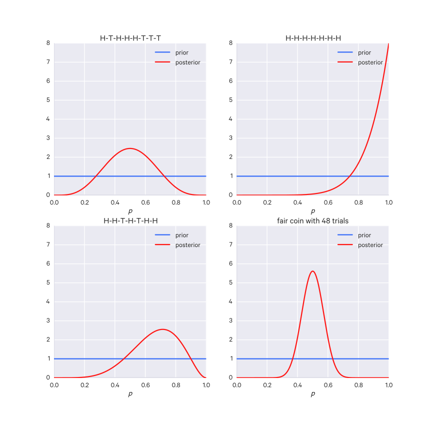
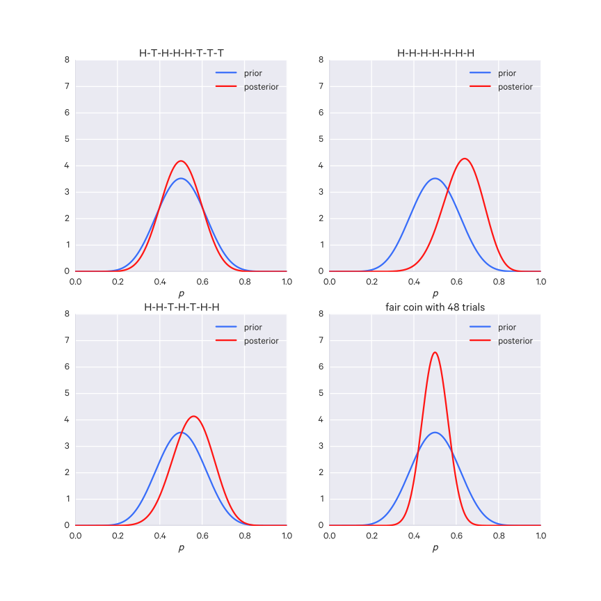

$$
\DeclareMathOperator{\Exp}{Exp}
\DeclareMathOperator{\Gam}{Gam}
\DeclareMathOperator{\Bin}{Bin}
\DeclareMathOperator{\Bet}{Beta}
\DeclareMathOperator{\Uni}{Uniform}
\def\argmax{\operatorname*{argmax}}
\def\argmin{\operatorname*{argmin}}
$$

# Bayesian Statistics

__Bayesian statistics__ is an approach to statistics contrasted with frequentist approaches.

As is with frequentist statistical inference, Bayesian inference is concerned with estimating parameters from some observed data. However, whereas frequentist inference returns point estimates - that is, single values - for these parameters, Bayesian inference instead expresses these parameters themselves as probability distributions. This is intuitively appealing as we are _uncertain_ about the parameters we've inferred; with Bayesian inference we can represent this uncertainty.

This is to say that in Bayesian inference, we don't assign an explicit value to an unknown parameter. Rather, we define it over a probability distribution as well: what values is the parameter _likely_ to take on? That is, we treat the parameter itself as a random variable.

We may say for instance that an unknown parameter $\theta$ is drawn from an exponential distribution:

$$
\theta \sim \Exp(\alpha)
$$

Here $\alpha$ is a __hyperparameter__, that is, it is a parameter for our parameter $\theta$.

Fundamentally, this is Bayesian inference:

$$
P(\theta|X)
$$

Where the parameters $\theta$ are the unknown, so we express them as a probability distribution, given the observations $X$. This probability distribution is the __posterior distribution__.

So we must decide (specify) probability distributions for both the data sample and for the unknown parameters. These decisions involve making a lot of assumptions. Then you must compute a posterior distribution, which often cannot be calculated analytically - so other methods are used (such as simulations, described later).

From the posterior distribution, you can calculate point estimates, credible intervals, quantiles, and make predictions.

Finally, because of the assumptions which go into specifying the initial distributions, you must test your model and see if it fits the data and seems reasonable.

Thus Bayesian inference amounts to:

1. Specifying a sampling model for the observed data $X$, conditioned on the unknown parameter $\theta$ (which we treat as a random variable), such that $X \sim f(X|\theta)$, where $f(X|\theta)$ is either the PDF or the PMF (as appropriate).
2. Specifying a marginal or distribution $\pi(\theta)$ for $\theta$, which is the prior distribution ("prior" for short): $\theta \sim \pi(\theta)$
3. From this we wish to compute the posterior, that is, uncover the distribution for $\theta$ given the observed data $X$, like so: $\pi(\theta|X) = \frac{\pi(\theta)L(\theta|X)}{\int \pi(\theta) L(\theta|X) d\theta}$, where $L(\theta|X) \propto f(\theta|X)$ in $\theta$, called the likelihood of $\theta$ given $X$. More often than not, the posterior must be approximated through Markov Chain Monte Carlo (detailed later).

### Frequentist vs Bayesian approaches

For frequentists, probability is thought of in terms of frequencies, i.e. the probability of the event is the amount of times it happened over the total amount of times it could have happened.

In frequentist statistics, the observed data is considered random; if you gathered more observations they would be different according to the underlying distribution. The parameters of the model, however, are considered fixed.

For Bayesians, probability is belief or certainty about an event. Observed data is considered fixed, but the model parameters are random (uncertain) instead and considered to be drawn from some probability distribution.

Another way of phrasing this is that frequentists are concerned with uncertainty in the data, whereas Bayesians are concerned with uncertainty in the parameters.

## Bayes' Theorem

In frequentist statistics, many different estimators may be used, but in Bayesian statistics the only estimator is Bayes' Formula (aka Bayes' Rule or Bayes' Theorem).

Bayes' Theorem, aka Bayes' Rule:

- $H$ is the hypothesis (more commonly represented as the parameters $\theta$)
- $D$ is the data

$$
P(H|D) = \frac{P(H)P(D|H)}{P(D)}
$$

- $P(H)$ = the probability of the hypothesis before seeing the data. The __prior__.
- $P(H|D)$ = probability of the hypothesis, given the data. The __posterior__.
- $P(D|H)$ = the probability of the data under the hypothesis. The __likelihood__.
- $P(D)$ = the probability of data under _any_ hypothesis. The __normalizing constant__.

For an example of likelihood:

If I want to predict the sides of a dice I rolled, and then I rolled an 8, then $P(D|\text{a six sided die}) = 0$. That is, it is impossible to have my observed data under the hypothesis of having a six sided die.

A key insight to draw from Bayes' Rule is that $P(H|D) \propto P(H)P(D|H)$, that is, the posterior is proportional to the product of the prior and the likelihood.

Note that the normalizing constant $P(D)$ usually cannot be directly computed and is equivalent to $\int P(D|H)P(H) dH$ (which is usually intractable since their are usually multiple parameters of interest, resulting in a multidimensional integration problem. If $\theta$, the parameters, is one dimensional, then you could integrate it rather easily).

One workaround is to do approximate inference with non-normalized posteriors, since we know that the posterior is proportional to the numerator term:

$$
P(H|D) \propto P(H)P(D|H)
$$

Another workaround to approximate the posterior using simulation methods such as Monte Carlo.

Given a set of hypotheses $H_0, H_1, \dots, H_n$, the distribution for the priors of these hypotheses is the _prior distribution_, i.e. $P(H_0), P(H_1), \dots, P(H_n)$.

The distribution of the posterior probabilities is the _posterior distribution_, i.e. $P(H_0|D), P(H_1|D), \dots, P(H_n|D)$.


### Likelihood

Likelihood is not the same as probability (thus it does not have to sum to 1), but it is _proportional_ to probability. More specifically, the likelihood of a hypothesis $H$ given some data $D$ is proportional to the probability of $D$ given that $H$ is true:

$$
L(H|D) = k P(D|H)
$$

Where $k$ is a constant such that $k > 0$.

With the probability $P(D|H)$, we fix $H$ and allow $D$ to vary. In the case of likelihood, this is reversed: we fix $D$ and allow the hypotheses to vary.

The __Law of Likelihood__ states that the hypothesis for which the probability of the data is greater is the more likely hypothesis. For example, $H_1$ is a better hypothesis than $H_2$ if $P(D|H_1) > P(D|H_2)$.

We can also quantify _how much_ better $H_1$ is than $H_2$ with the ratio of their likelihoods, i.e. $\frac{L(H_1|D)}{L(H_2|D)}$, which is proportional to $\frac{P(D|H_1)}{P(D|H_2)}$.

Likelihoods are meaningless in isolation (because of the constant $k$), they must be compared to other likelihoods, such that the constants cancel out, i.e. as ratios like the example above, to be meaningful.

A __Bayes factor__ is an extension of likelihood ratios: it is a weighted average likelihood ratio based on the prior distribution of hypotheses. So we have some prior bias as to what hypotheses we expect, i.e. how probable we expect some hypotheses to be, and we weigh the likelihood ratios by these expected probabilities.


## Choosing a prior distribution

With Bayesian inference, we must _choose_ a prior distribution, then apply data to get our posterior distribution. The prior is chosen based on domain knowledge or intuition or perhaps from the results of previous analysis; that is, it is chosen subjectively - there is no prescribed formula for picking a prior. If you have no idea what to pick, you can just pick a uniform distribution as your prior.

Your choice of prior will affect the posterior that you get, and the subjectivity of this choice is what makes Bayesian statistics controversial - but it's worth noting that all of statistics, whether or frequentist or Bayesian, involves many subjective decisions (e.g. frequentists must decide on an estimator to use, what data to collect and how, and so on) - what matters most is that you are explicit about your decisions and why you made them.

Say we perform an Bayesian analysis and get a posterior. Then we get some new data for the same problem. We can re-use the posterior from before as our prior, and when we run Bayesian analysis on the new data, we will get a new posterior which reflects the additional data. We don't have to re-do any analysis on the data from before, all we need is the posterior generated from it.

For any unknown quantity we want to model, we say it is drawn from some prior of our choosing. This is usually some parameter describing a probability distribution, but it could be other values as well. This is central to Bayesian statistics - all unknowns are represented as distributions of possible values. In Bayesian statistics: if there's a value and you don't know what it is, come up with a prior for it and add it to your model!

If you think of distributions as landscapes or surfaces, then the data deforms the prior surface to mold it into the posterior distribution.

The surface's "resistance" to this shaping process depends on the selected prior distribution.

When it comes to selecting Bayesian priors, there are two broad categories:

- __objective priors__ - these let the data influence the posterior the most
- __subjective priors__ - these allow the practitioner to asset their own views in to the prior. This prior can be the posterior from another problem or just come from domain knowledge.

An example objective prior is a __uniform__ (flat) prior where every value has equal weighting. Using a uniform prior is called _The Principle of Indifference_. Note that a uniform prior restricted within a range is _not_ objective - it has to be over _all_ possibilities.

Note that the more data you have (as $N$ increases), the choice of prior becomes less important.

### Conjugate priors

__Conjugate priors__ are priors which, when combined with the likelihood, result in a posterior which is in the same family. These are very convenient because the posterior can be calculated analytically, so there is no need to use approximation such as Markov Chain Monte Carlo (see below).

For example, a binomial likelihood is a conjugate with a beta prior - their combination results in a beta-binomial posterior.

For example, the Gaussian family of distributions are conjugate to itself (_self conjugate_) - a Gaussian likelihood with a Gaussian prior results in a Gaussian posterior.

For example, when working with count data you will probably use the Poisson distribution for your likelihood, which is conjugate with gamma distribution priors, resulting in a gamma posterior.

Unfortunately, conjugate priors only really show up in simple one-dimensional models.

More generally, we can define a conjugate prior like so:

Say random variable $X$ comes from a well-known distribution, $f_{\alpha}$ where $\alpha$ are the possibly unknown parameters of $f$. It could be a normal, binomial, etc distribution.

For the given distribution $f_{\alpha}$, there may exist a prior distribution $p_{\beta}$ such that

$$
\overbrace{p_{\beta}}^{\text{prior}} \cdot \overbrace{f_{\alpha}(X)}^{\text{data}} = \overbrace{p_{\beta'}}^{\text{posterior} }
$$

#### Beta-Binomial Model

The Beta-Binomial model is a useful Bayesian model because it provides values between 0 and 1, which is useful for estimating probabilities or percentages.

It involves, as you might expect, a beta and a binomial distribution.

So say we have $N$ trials and observe $n$ successes. We describe these observations by a binomial distribution, $n \sim \Bin(N, p)$ for which $p$ is unknown. So we want to come up with some distribution for $p$ (remember, with Bayesian inference, you do not produce point estimates, that is, a single value, but a distribution for your unknown value to describe the uncertainty of its true value).

For frequentist inference we'd estimate $\hat p = \frac{n}{N}$ which isn't quite good for low numbers of $N$.

This being Bayesian inference, we first must select a prior. $p$ is a probability and therefore is bound to $[0, 1]$. So we could choose a uniform prior over that interval; that is $p \sim \Uni(0,1)$.

However, $\Uni(0, 1)$ is equivalent to a beta distribution where $\alpha=1, \beta=1$, i.e. $\Bet(1,1)$. The beta distribution is bound between 0 and 1 so it's a good choice for estimating probabilities.

We prefer a beta prior over a uniform prior because, given binomial observations, the posterior will also be a beta distribution.

It works out nicely mathematically:

$$
\begin{aligned}
p &\sim \Bet(\alpha, \beta) \\
n &\sim \Bin(N, p) \\
p \, | \, n, N &\sim \Bet(\alpha + n, \beta + N - n)
\end{aligned}
$$

So with these two distributions, we can directly compute the posterior with no need for simulation (e.g. MCMC).

How do you choose the parameters for a Beta prior? Well, it depends on the particular problem, but a conservative one, for when you don't have a whole lot of info to go on, is $\Bet(\frac{1}{2}, \frac{1}{2})$, known as __Jeffrey's prior__.

##### Example

We run 100 trials and observe 10 successes. What is the probability $p$ of a successful trial?

Our knowns are $N=100, n=10$. A binomial distribution describes these observations, but we have the unknown parameter $p$.

For our prior for $p$ we choose $\Bet(1,1)$ since it is equivalent to a uniform prior over $[0,1]$ (i.e. it is an objective prior).

We can directly compute the posterior now:

$$
\begin{aligned}
p \, | \, n, N &\sim \Bet(\alpha + n, \beta + N - n) \\
p &\sim \Bet(11, 91)
\end{aligned}
$$

Then we can draw samples from the distribution and compute its mean or other descriptive statistics such as the credible interval.


### Sensitivity Analysis

The strength of the prior affects the posterior - the stronger your prior beliefs, the more difficult it is to change those beliefs (it requires more data/evidence). You can conduct __sensitivity analysis__ to try your approach with various different priors to get an idea of how different priors affect your resulting posterior.

### Empirical Bayes

Empirical Bayes is a method which combines frequentist and Bayesian approaches by using frequentist methods to select the hyperparameters.

For instance, say you want to estimate the $\mu$ parameter for a normal distribution.

You could use the empirical sample mean from the observed data:

$$
\mu_p = \frac{1}{N}\sum^N_{i=0} X_i
$$
Where $\mu_p$ denotes the prior $\mu$.

Though if working with not much data, this kind of ends like double-counting your data.


## Markov Chain Monte Carlo (MCMC)

With Bayesian inference, in order to describe your posterior, you often must evaluate complex multidimensional integrals (i.e. from very complex, multidimensional probability distributions), which can be computationally intractable.

Instead you can generate sample points from the posterior distribution and use those samples to compute whatever descriptions you need. This technique is called __Monte Carlo integration__, and the process of drawing repeated random samples in this way is called __Monte Carlo simulation__. In particular, we can use a family of techniques known as __Markov Chain Monte Carlo__, which combine Monte Carlo integration and simulation with Markov chains, to generate samples for us.

### Monte Carlo Integration

Monte Carlo integration is a way to approximate complex integrals using random number generation.

Say we have a complex integral:

$$
\int h(x)dx
$$

If we can decompose $h(x)$ into the product of a function $f(x)$ and a probability density function $P(x)$ describing the probabilities of the inputs $x$, then:

$$
\int h(x)dx = \int f(x)P(x)dx = E_{P(x)}[f(x)]
$$

That is, the result of this integral is the expected value of $f(x)$ over the density $P(x)$.

We can approximate this expected value by taking the mean of many, many samples ($n$ samples):

$$
\int h(x)dx = E_{P(x)}[f(x)] \approx \frac{1}{n} \sum^n_{i=1} f(x_i)
$$

This process of approximating the integral is _Monte Carlo integration_.

For very simple cases of known distributions, we can sample directly, e.g.

```python
import numpy as np

# Say we think the distribution is a Poisson distribution
# and the parameter of our distribution, lambda,
# is unknown and what we want to discover.
lam = 5

# Collect 100000 samples
sim_vals = np.random.poisson(lam, size=100000)

# Get whatever descriptions we want, e.g.
mean = sim_vals.mean()

# For poisson, the mean is lambda, so we expect
# them to be approximately equal (given a large enough sample size)
abs(lam - mean()) < 0.001
```

### Markov Chains

Markov chains are a stochastic process in which the next state depends only on the current state.

Consider a random variable $X$ and a time index $t$. The state of $X$ at time $t$ is notated $X_t$.

For a Markov chain, the state $X_{t+1}$ depends only on the current state $X_t$, that is:

$$
P(X_{t+1} = x_{t+1}|X_t = x_t, X_{t-1} = x_{t-1}, \dots, X_0 = x_0) = P(X_{t+1} = x_{t+1}| X_t = x_t)
$$

Where $P(X_{t+1} = x_{t+1})$ is the __transition probability__ of $X_{t+1} = x_{t+1}$. The collection of transition probabilities is called a __transition matrix__ (for discrete states); more generally is is called a __transition kernel__.


If we consider $t$ going to infinity, the Markov chain settles on a __stationary distribution__, where $P(X_t) = P(X_{t-1})$. The stationary distribution does not depend on the initial state of the network. Markov chains are _erdogic_, i.e. they "mix", which means that the influence of the initial state weakens with time (the rate at which it mixes is its _mixing speed_).

If we call the $k \times k$ transition matrix $P$ and the marginal probability of a state at time $t$ is a $k \times 1$ vector $\pi$, then the distribution of the state at time $t+1$ is $\pi'P$. If $\pi'P = \pi'$, then $pi$ is the stationary distribution of the Markov chain.

### Markov Chain Monte Carlo

MCMC is useful because often we may encounter distributions which aren't easily expressed mathematically (e.g. their functions may have very strange shapes), but we still want to compute some descriptive statistics (or make other computations) from them. MCMC allows us to work with such distributions without needing precise mathematical formulations of them.

More generally, MCMC is really useful if you don't want to (or can't) find the underlying function describing something. As long as you can simulate that process in some way, you don't need to know the exact function - you can just generate enough sample data to work with in its stead. So MCMC is a brute force but effective method.

Rather than directly compute the integral for posterior distributions in Bayesian analysis, we can instead use MCMC to draw several (thousands, millions, etc) samples from the probability distribution, then use these samples to compute whatever descriptions we'd like about the distribution (often this is some expected value of a function, $E[f(x)]$, where its inputs are drawn from distribution, i.e. $x \sim p$, where $p$ is some probability distribution).

You start with some random initial sample and, based on that sample, you pick a new sample. This is the Markov Chain aspect of MCMC - the next sample you choose depends only on the current sample. This works out so that you spend most your time with high probability samples (b/c they have higher transition probabilities) but occasionally jump out to lower probability samples. Eventually the MCMC chain will converge on a random sample.

So we can take all these $N$ samples and, for example, compute the expected value:

$$
E[f(x)] \approx \frac{1}{N} \sum^N_{i=1}f(x_i)
$$

Because of the random initialization, there is a "__burn-in__" phase in which the sampling model needs to be "warmed up" until it reaches an equilibrium sampling state, the _stationary distribution_. So you discard the first hundred or thousand or so samples as part of this burn-in phase. You can (eventually) arrive at this stationary distribution _independent of where you started_ which is why the random initialization is ok - this is an important feature of Markov Chains.

MCMC is a general technique of which there are several algorithms.

#### Rejection Sampling

Monte Carlo integration allows us to draw samples from a posterior distribution with a known parametric form. It does not, however, enable us to draw samples from a posterior distribution without a known parametric form. We may instead use __rejection sampling__ in such cases.

We can take our function $f(x)$ and if it has bounded/finite _support_ ("support" is the $x$ values where $f(x)$ is non-zero, and can be thought of the range of meaningful $x$ values for $f(x)$), we can calculate its maximum and then define a bounding rectangle with it, encompassing all of the support values. This envelope function should contain all possible values of $f(x)$  Then we can randomly generate points from within this box and check if they are under the curve (that is, less than $f(x)$ for the point's $x$ value). If a point is not under the curve, we reject it. Thus we approximate the integral like so:

$$
\frac{\text{points under curve}}{\text{points generated}} \times \text{box area} = \lim_{n \to \infty} \int_A^B f(x)dx
$$

In the case of unbounded support (i.e. infinite tails), we instead choose some _majorizing_ or _enveloping_ function $g(x)$ ($g(x)$ is typically a probability density itself and is called a _proposal density_) such that $cg(x) \geq f(x) \, , \forall x \in (-\infty, \infty)$, where $c$ is some constant. This functions like the bounding box from before. It completely encloses $f$. Ideally we choose $g(x)$ so that it is close to the target distribution, that way most of our sampled points can be accepted.

Then, for each $x_i$ we draw (i.e. sample), we also draw a uniform random value $u_i$. Then if $u_i < \frac{f(x_i)}{cg(x_i)}$, we accept $x_i$, otherwise, we reject it.

The intuition here is that the probability of a given point being accepted is proportional to the function $f$ at that point, so when there is greater density in $f$ for that point, that point is more likely to be accepted.

In multidimensional cases, you draw candidates from every dimension simultaneously.

#### Metropolis-Hastings

The __Metropolis-Hastings__ algorithm uses Markov chains with rejection sampling.

The proposal density $g(\theta_t)$ is chosen as in rejection sampling, but it depends on $\theta_{t-1}$, i.e. $g(\theta_t|\theta_{t-1})$.

First select some initial $\theta$, $\theta_1$.

Then for $n$ iterations:

* Draw a candidate $\theta_t^c \sim g(\theta_t|\theta_{t-1})$
* Compute the Metropolis-Hastings ratio: $R = \frac{f(\theta_t^c)g(\theta_{t-1}|\theta_t^c)}{f(\theta_{t-1})g(\theta_t^c|\theta_{t-1})}$
* Draw $u \sim \Uni$
* If $u < R$, accept $\theta_t = \theta_t^c$, otherwise, $\theta_t = \theta_{t-1}$

There are a few required properties of the Markov chain for this to work properly:

- The stationary distribution of the chain must be the target density:
    - The chain must be _recurrent_ - that is, for all $\theta \in \Theta$ in the _target density_ (the density we wish to approximate), the probability of returning to any state $\theta_i \in Theta = 1$. That is, it must be possible _eventually_ for any state in the state space to be reached.
    - The chain must be _non-null_ for all $\theta \in \Theta$ in the target density; that is, the expected time to recurrence is finite.
    - The chain must have a stationary distribution equal to the target density.
- The chain must be _ergodic_, that is:
    - The chain must be _irreducible_ - that is, any state $\theta_i$ can be reached from any other state $\theta_j$ in a finite number of transitions (i.e. the chain should not get stuck in any infinite loops)
    - The chain must be _aperiodic_ - that is, there should not be a fixed number of transitions to get from any state $\theta_i$ to any state $\theta_j$. For instance, it should not always take three steps to get from one place to another - that would be a period. Another way of putting this - there are no fixed cycles in the chain.

It can been proven that the stationary distribution of the Metropolis-Hastings algorithm is the target density (proof omitted).

Th ergodic property (whether or not the chain "mixes" well) can be validated with some _convergence diagnostics_  A common method is to plot the chain's values as their drawn and see if the values tend to concentrate around a constant; if not, you should try a different proposal density.

Alternatively, you can look at an autocorrelation plot, which measures the internal correlation (from -1 to 1) over time, called "lag". We expect that the greater the lag, the less the points should be autocorrelated - that is, we expect autocorrelation to smoothly decrease to 0 with increasing lag. If autocorrelation remains high, then the chain is not fully exploring the space. Autocorrelation can be improved by _thinning_, which is a technique where only every $k$th draw is kept and others are discarded.

Finally, you also have the options of running multiple chains, each with different starting values, and combining those samples.

You should also use burn-in.

#### Gibbs Sampling

It is easy to sample from simple distributions. For example, for a binomial distribution, you can basically just flip a coin. For a multinomial distribution, you can basically just roll a dice.

If you have a multinomial, multivariate distribution, e.g. $P(x_1, x_2, \dots, x_n)$, things get more complicated. If the variables are independent, you can factorize the multivariate distribution as a product of univariate distributions, treating each as a univariate multinomial distribution, i.e. $P(x_1, x_2, \dots, x_n) = P(x_1) \times P(x_2) \times \dots \times P(x_n)$. Then you can just sample from each distribution individually, i.e. as a dice roll.

However - what if these aren't independent, and we want to sample from the _joint distribution_ $P(x_1, x_2, \dots, x_n)$? We can't factorize it into simpler distributions like before.

With Gibbs sampling we can approximate this joint distribution under the condition that we can easily sample from the conditional distribution for each variable, i.e. $P(x_i | x_1, \dots, x_{i-1}, x_{i+1}, \dots, x_n)$. (This condition is satisfied on Bayesian networks.)

We take advantage of this and iteratively sample from these conditional distributions and using the most recent value for each of the other variables (starting with random values at first). For example, sampling $x_1|x_2, \dots, x_n$, then fixing this value for $x_1$ while sampling $x_2|x_1, x_3, \dots, x_n$, then fixing both $x_1$ and $x_2$ while sampling $x_3|x_1, x_2, x_4, \dots, x_n$, and so on.

If you iterate through this a large number of times you get an approximation of samples taken from the actual joint distribution.

Another way to look at Gibbs sampling:

Say you have random variables $c, r, t$ (cloudy, raining, thundering) and you have the following probability tables:

| c | P(c) |
|---|------|
| 0 | 0.5  |
| 1 | 0.5  |

| c | r | P(r&#124;c) |
|---|---|-------------|
| 0 | 0 | 0.9         |
| 0 | 1 | 0.1         |
| 1 | 0 | 0.1         |
| 1 | 1 | 0.9         |

| c | r | t | P(t&#124;c,r) |
|---|---|---|---------------|
| 0 | 0 | 0 | 0.9           |
| 0 | 0 | 1 | 0.1           |
| 0 | 1 | 0 | 0.5           |
| 0 | 1 | 1 | 0.5           |
| 1 | 0 | 0 | 0.6           |
| 1 | 0 | 1 | 0.4           |
| 1 | 1 | 0 | 0.1           |
| 1 | 1 | 1 | 0.9           |

We can first pick some starting sample, e.g. $c=1,r=0,t=1$.

Then we fix $r=0, t=1$ and randomly pick another $c$ value according to the probabilities in the table (here it is equally likely that we get $c=0$ or $c=1$). Say we get $c=0$. Now we have a new sample $c=0,r=0,t=1$.

Now we fix $c=0,t=1$ and randomly pick another $r$ value. Here $r$ is dependent only on $c$. $c=0$ so we have a $0.9$ probability of picking $r=0$. Say that we do. We have another sample $c=0,r=0,t=1$, which happens to be the same as the previous sample.

Now we fix $c=0,r=0$ and pick a new $t$ value. $t$ is dependent on both $c$ and $r$. $c=0,r=0$, so we have a $0.9$ chance of picking $t=0$. Say that we do. Now we have another sample $c=0,r=0,t=0$. Then we repeat this process until convergence (or for some specified number of iterations).

Your samples will reflect the actual joint distribution of these values, since more likely samples are, well, more likely to be generated.

## Variational Inference

MCMC can take a long time to get good answers - in theory if you run it infinitely it will generate enough samples to get a perfectly accurate distribution, but that's not a fair criterion (many algorithms do well if they have infinite time).

With _variational inference_ we don't need to take samples - instead we fit an approximate joint distribution $Q(x; \theta)$ to approximate the true joint posterior $P(x)$, turning it into an optimization problem (we try to get them as close as possible according to the KL divergence $\text{KL}[Q(x;\theta)||P(x)]$. So we are interested in the parameters $\theta$.

The _mean-field_ form of variational inference assumes that $Q$ factorizes into independent single-variable factors, i.e. $Q(x) = \prod_i Q_i(x_i|\theta_i)$.

## Bayesian point estimates

Bayesian inference returns a distribution (the posterior) but we often need a single value (or a vector in multivariate cases). So we choose a value from the posterior. This value is a __Bayesian point estimate__.

Selecting the MAP (_maximum a posterior_) value is insufficient because it neglects the shape of the distribution.

Suppose $P(\theta|X)$ is the posterior distribution of $\theta$ after observing data $X$.

The _expected loss_ of choosing estimate $\hat \theta$ to estimate $\theta$ (the true parameter), also known as the _risk_ of estimate $\hat \theta$ is:

$$
l(\hat \theta) = E_{\theta} [L(\theta, \hat \theta)]
$$

Where $L(\theta, \hat \theta)$ is some loss function.

You can approximate the expected loss using the Law of Large Numbers, which just states that as sample size grows, the expected value approaches the actual value. That is, as $N$ grows, the expected loss approaches 0.

For approximating expected loss, it looks like:

$$
\frac{1}{N} \sum^N_{i=1} L(\theta_i, \hat \theta) \approx E_{\theta}[L(\theta, \hat \theta)] = l(\hat \theta)
$$

You want to select the estimate $\hat \theta$ which minimizes this expected loss:

$$
\argmin_{\hat \theta} E_{\theta}[L(\theta, \hat \theta)]
$$


## Credible Intervals (Credible Regions)

In Bayesian statistics, The closest analog to confidence intervals in frequentist statistics is the __credible interval__. It is _much_ easier to interpret than the confidence interval because it is exactly what most people confuse the confidence interval to be. For instance, the 95% credible interval is the interval in which we expect to find $\theta$ 95% of the time.

Mathematically this is expressed as:

$$
P(a(y) < \theta < b(y)|Y=y) = 0.95
$$

We condition on $Y$ because in Bayesian statistics, the data is fixed and the parameters are random.

## Bayesian Regression

The Bayesian methodology can be applied to regression as well. In conventional regression the parameters are treated as fixed values that we uncover. In Bayesian regression, the parameters are treated as random variables, as they are elsewhere in Bayesian statistics. We define prior distributions for each parameter - in particular, normal priors, so that for each parameter we define a prior mean as well as a covariance matrix for all the parameters.

So we specify:

- $b_0$ - a vector of prior means for the parameters
- $B_0$ - a covariance matrix such that $\sigma^2 B_0$ is the prior covariance matrix of $\beta$
- $v_0 > 0$ - the degrees of freedom for the prior
- $\sigma_0^2 > 0$ - the variance for the prior (which essentially functions as your strength of belief in the prior - the lower the variance, the more concentrated your prior is around the mean, thus the stronger your belief)

So the prior for your parameters then is a normal distribution parameterized by $(b_0, B_0)$.

Then $v_0$ and $\sigma_0^2$ give a prior for $\sigma^2$, which is an inverse gamma distribution parameterized by $(v_0, \sigma_0^2 v_0)$.

Then there are a few formulas:

$$
\begin{aligned}
b_1 &= (B_0^{-1}  + X'X)^{-1}(B_0^{-1}b_0 + X'X\hat \beta) \\
B_1 &= (B_0^{-1} + X'X)^{-1} \\
v_1 &= v_0 + n \\
v_1 \sigma_1^2 &= v_0 \sigma_0^2 + S + r \\
S &= \text{sum of squared errors of the regression} \\
r &= (b_0-\hat \beta)'(B_0 + (X'X)^{-1})^{-1}(b_0 - \hat \beta) \\
f(\beta~|~\sigma^2,y,x) &= \Phi(b_1, \sigma^2 B_1) \\
f(\sigma^2~|~y,x) &= \text{inv.gamma}(\frac{v_1}{2}, \frac{v_1\sigma_1^2}{2}) \\
f(\beta~|~y,x) &= \int f(\beta~|~\sigma^2,y,x) f(\sigma^2~|~y,x)d\sigma^2 = t(b_1, \sigma_1^2B_1,\text{degrees of freedom}=v_1)
\end{aligned}
$$

So the resulting distribution of parameters is a multivariate $t$ distribution.

## A Bayesian example

Let's say we have a coin. We are uncertain whether or not it's a fair coin. What can we learn about the coin's fairness from a Bayesian approach?

Let's restate the problem. We can represent the outcome of a coin flip with a random variable, $X$. If the coin is not fair, we expect to see heads 100% of the time. That is, if the coin is unfair, $P(X=\text{heads}) = 1$. Otherwise, we expect it to be around $P(X=\text{heads}) = 0.5$.

It's reasonable to assume that $X$ is drawn from a binomial distribution, so we'll use that. The binomial distribution is parameterized by $n$, the number of trials, and $p$, the probability of a "success" (in this case, a heads), on a given flip. We can restate our previous statements about the coin's fairness in terms of this parameter $p$. That is, if the coin is unfair, we expect $p=1$, otherwise, we expect it to be around $p=0.5$.

Thus $p$ is the unknown parameter we are interested in, and with the Bayesian approach, we consider it a random variable as well; i.e. drawn from some distribution. First we must state what we believe this distribution to be _prior_ to any evidence (i.e. decide on a prior to use). Because $p$ is a probability, the beta distribution seems like a good choice since it is bound to $[0,1]$ like a probability. The beta distribution has the additional advantage of being a _conjugate prior_, so the posterior is analytically derived and requires no simulation.

The beta distribution is parameterized by $\alpha$ and $\beta$ (i.e. they are our hyperparameters, $\Bet(\alpha, \beta)$). Here we can choose values for $\alpha$ and $\beta$ depending on how we choose to proceed. Let's be conservative and use an uninformative prior, that is, a uniform/flat prior, acting as if we don't feel strongly about the coin's bias either way prior to flipping the coin. The beta distribution $\Bet(1,1)$ is flat.

The posterior for a beta prior will not be derived here, but it is $\Bet(\alpha + k, \beta + (n-k))$, where $k$ is the number of successes (heads) in our evidence, and $n$ is the total number of trials in our evidence.

Now we can flip the coin a few times to gather our evidence.

Below are some illustrations of possible evidence with the prior and the resulting posterior.



A few things to note here:

- When the evidence has even amounts of tails and heads, the posterior centers around $p=0.5$.
- When the evidence has even one tail, the possibility of $p=1$ drops to nothing.
- When the evidence has no tails, the posterior places more weight on an unfair coin, but there is still some possibility of $p=0.5$. As the number of evidence increases, however, and still no tails show up, the posterior will have even more weight pushed towards $p=1$.
- When the is a lot of evidence containing even amounts of tails and heads, there is greater confidence that $p=0.5$ (that is, there's smaller variance around it).

What if instead of a flat prior, we had assumed that the coin was fair to begin with? In this scenario, the $\alpha$ and $\beta$ values function like counts for heads and tails. So to assume a fair coin we could say, $\alpha=10, \beta=10$. If we have a really strong belief that it is a fair coin, we could say $\alpha=100, \beta=100$. The higher these values are, the stronger our belief.



Since our prior belief is stronger than it was with a flat prior, the same amount of evidence doesn't change the prior belief as much. For instance, now if we see a streak of heads, we are less convinced it is unfair.

In either case, we could take the expected value of $p$'s posterior distribution as our estimate for $p$, and then use that as evidence for a fair or unfair coin.

### References

- [POLS 506: Simple Bayesian Models](https://www.youtube.com/watch?v=ps5MYi81IsE). Justin Esarey.
- [POLS 506: Basic Monte Carlo Procedures and Sampling](https://www.youtube.com/watch?v=cxWzsCoYT8Q). Justin Esarey.
- [POLS 506: Metropolis-Hastings, the Gibbs Sampler, and MCMC](https://www.youtube.com/watch?v=j4nEAqUUnVw). Justin Esarey.
- [Markov chain Monte Carlo (MCMC) introduction](https://www.youtube.com/watch?v=12eZWG0Z5gY). [mathematicalmonk](https://www.youtube.com/channel/UCcAtD_VYwcYwVbTdvArsm7w).
- [Markov Chain Monte Carlo Without all the Bullshit](http://jeremykun.com/2015/04/06/markov-chain-monte-carlo-without-all-the-bullshit/). Jeremy Kun.
- <http://homepages.dcc.ufmg.br/~assuncao/pgm/aulas2014/mcmc-gibbs-intro.pdf>
- [Markov Chain Monte Carlo and Gibbs Sampling](http://nitro.biosci.arizona.edu/courses/EEB596/handouts/Gibbs.pdf). B. Walsh.
- [Computational Methods in Bayesian Analysis](https://plot.ly/ipython-notebooks/computational-bayesian-analysis/). Chris Fonnesbeck.
- [Think Bayes](http://greenteapress.com/thinkbayes/). Version 1.0.6. Allen Downey.
- [Computational Statistics II](https://www.youtube.com/watch?v=heFaYLKVZY4) ([code](https://github.com/fonnesbeck/scipy2015_tutorial)). Chris Fonnesbeck. SciPy 2015.
- [Bayesian Statistical Analysis](https://github.com/fonnesbeck/scipy2014_tutorial). Chris Fonnesbeck. SciPy 2014.
- [Probabilistic Programming and Bayesian Methods for Hackers](https://github.com/CamDavidsonPilon/Probabilistic-Programming-and-Bayesian-Methods-for-Hackers). Cam Davidson Pilon.
- [Frequentism and Bayesianism V: Model Selection](https://jakevdp.github.io/blog/2015/08/07/frequentism-and-bayesianism-5-model-selection/). Jake Vanderplas.
- [Understanding Bayes: A Look at the Likelihood](http://alexanderetz.com/2015/04/15/understanding-bayes-a-look-at-the-likelihood/). Alex Etz.
- [High-Level Explanation of Variational Inference](https://www.cs.jhu.edu/~jason/tutorials/variational.html). Jason Eisner.
- [Bayesian Deep Learning](http://twiecki.github.io/blog/2016/06/01/bayesian-deep-learning/). Thomas Wiecki.
- [A Tutorial on Variational Bayesian Inference](http://www.orchid.ac.uk/eprints/40/1/fox_vbtut.pdf). Charles Fox, Stephen Roberts.
- [Variational Inference](https://www.cs.princeton.edu/courses/archive/fall11/cos597C/lectures/variational-inference-i.pdf). David M. Blei.
- [Probabilistic Programming Data Science with PyMC3](https://youtu.be/LlzVlqVzeD8). Thomas Wiecki.
