# Probabilistic Graphical Models

The key tool for probabilistic inference is the __joint probability table__. Each row in a joint probability table describes a combination of values for a set of random variables. That is, say you have $n$ events which have a binary outcome (T/F). A row would describe a unique configuration of these events, e.g. if $n=4$ then one row might be $0,0,0,0$ and another might be $1,0,0,0$ and so on. Consider the simpler case of $n=2$, with binary random variables $X,Y$:

| X | Y | P(X,Y) |
|---|---|--------|
| 0 | 0 | 0.25   |
| 1 | 0 | 0.45   |
| 0 | 1 | 0.15   |
| 1 | 1 | 0.15   |

Using a joint probability table you can learn a lot about how those events are related probabilistically.

The problem is, however, that joint probability tables can get very big, which is another way of saying that models (since joint probability tables are a representation of probabilistic models) can get complex very quickly.

Typically, we have a set of random variables $x_1, \dots, x_n$ and we want to compute their probability for certain states together; that is, the joint distribution $P(x_1, \dots, x_n)$.

Even in the simple case where each random variable is binary, you would still have a distribution over $2^n$ states.

We can use __probabilistic graphical models__ (PGMs) to reduce this space. Probabilistic graphical models allow us to represent complex networks of interrelated and independent events efficiently and with sparse parameters. All graphical models have some limitations in their ability to graphically express conditional (in)dependence statements but are nevertheless very useful.

There are two main types of graphical models:

- __Bayesian models__: aka __Bayesian networks__, sometimes called __Bayes nets__ or __belief networks__. These use directed graphs and are used when there are causal relationships between the random variables.
- __Markov models__: These use undirected graphs and are used when there are noncausal relationships between the random variables.

## Factors

The concept of _factors_ is important to PGMs.

A __factor__ is a function $\phi(X_1, \dots, X_k)$ which takes all possible combinations of outcomes (assignments) for these random variables $X_1, \dots, X_k$ and gives a real value for each combination.

The set of random variables $\{X_1, \dots, X_k\}$ is called the _scope_ of the factor.

A joint distribution is a factor which returns a number which is the probability of a given combination of assignments.

An unnormalized measure is also a factor, e.g. $P(I,D, g^1)$.

A conditional probability distribution (CPD) is also a factor, e.g. $P(G|I,D)$.

A common operation on factors is a _factor product_. Say we have the factors $\phi_1(A,B)$ and $\phi_2(B,C)$. Their factor product would yield a new factor $\phi_3(A,B,C)$. The result for a given combo $a_i, b_j, c_k$ is just $\phi_1 (a_i, b_j) \cdot \phi_2(b_j, c_k)$.

Another operation is _factor marginalization_. This is the same as marginalization for probability distributions but generalized for all factors. For example, $\phi(A,B,C) \to \phi(A,B)$.

Another operation is _factor reduction_ which is similarly is a generalization of probability distribution reduction.

## Belief (Bayesian) Networks

Say we are looking at five events:

- a dog barking ($D$)
- a raccoon being present ($R$)
- a burglar being present ($B$)
- a trash can is heard knocked over ($T$)
- the police are called ($P$)

We can encode some assumptions about how these events are related in a _belief net_ (also called a _Bayesian net_):

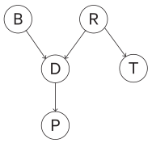

Every node is dependent on its parent and nothing else that is not a descendant. To put it another way: given its parent, a node is independent of all its non-descendants.

For instance, the event $P$ is dependent on its parent $D$ but not $B$ or $R$ or $T$ because their causality flows through $D$.

$D$ depends on $B$ and $R$ because they are its parents, but not $T$ because it is not a descendant or a parent. But $D$ may depend on $P$ because it is a descendant.

We can then annotate the graph with probabilities:

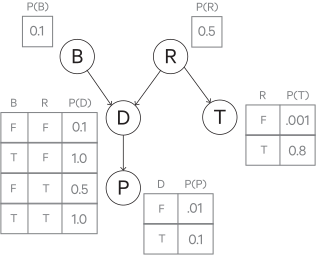

The $B$ and $R$ nodes have no parents so they have singular probabilities.

The others depend on the outcome of their parents.

With the belief net, we only needed to specify 10 probabilities.

If we had just constructed joint probability table, we would have had to specify $2^5=32$ probabilities (rows).

If we expand out the conditional probability of this system using the chain rule, it would look like:

$$
P(p,d,b,t,r) = P(p|d,b,t,r)P(d|b,t,r)P(b|t,r)P(t|r)P(r)
$$

But we can bring in our belief net's conditional independence assumptions to simplify this:

$$
P(p,d,b,t,r) = P(p|d)P(d|b,r)P(b)P(t|r)P(r)
$$

Belief networks are _acyclical_, that is, they cannot have any loops (a node cannot have a path back to itself). In particular, they are a directed acyclic graph (DAG).

Two nodes (variables) in a Bayes net are on an __active trail__ if a change in one node affects the other. This includes cases where the two nodes have a causal relationship, an evidential relationship, or have some common cause.

Formally, a belief network is a distribution of the form:

$$
P(x_1, \dots, x_D) = \prod_{i=1}^D P(x_i| \text{pa}(x_i))
$$

where $\text{pa}(x_i)$ are the _parental_ variables of variable $x$ (that is, $x$'s parents in the graph).

When you factorize a joint probability, you have a number of options for doing so.

For instance:

$$
P(x_1, x_2, x_3) = P(x_{i_1} | x_{i_2}, x_{i_3}) P(x_{i_2}| x_{i_3}) P(x_{i_3})
$$

where $(i_1, i_2, i_3)$ is any permutation of $(1,2,3)$.

Without any conditional independence assumptions, all factorizations produce an equivalent DAG.

However, once you begin dropping edges (i.e. making conditional independence assumptions), the graphs are not necessarily equivalent anymore.

Some of the graphs are equivalent; they can be converted amongst each other via Bayes' rule. Others cannot be bridged in this way, and thus are not equivalent.

Note that belief networks encode conditional independences but do not necessarily encode dependences.

For instance, the graph $a \to b$ appears to mean that $a$ and $b$ are dependent. But there may be an instance of the belief network distribution such that $p(b|a) = p(b)$; that is, $a$ and $b$ are independent. So although the DAG may seem to imply dependence, there may be cases where it in fact does not.

In these cases, we call this implied dependence __graphical dependence__.

The following belief network triple represents the conditional independence of $X$ and $Y$ given $Z$, that is $P(X,Y|Z) = P(X|Z)P(Y|Z)$.

The following belief network triple also represents the conditional independence of $X$ and $Y$ given $Z$, in particular, $P(X,Y|Z) \varpropto P(Z|X)P(X)P(Y|Z)$.

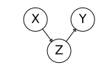

The following belief network triple represents the graphical conditional dependence of $X$ and $Y$, that is $P(X,Y|Z) \varpropto P(Z|X,Y) P(X) P(Y)$.

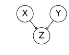

Here $Z$ is a __collider__, since its neighbors are pointing to it.

Generally, if there is a path between $X$ and $Y$ which contains a collider, and this collider is not in the conditioning set, nor are any of its descendants, we cannot induce dependence between $X$ and $Y$ from this path. We say such a path is __blocked__.

Similarly, if there is a non-collider along the path which is in the conditioning set, we cannot induce dependence between $X$ and $Y$ from this path - such a path is also said to be blocked.

If all paths between $X$ and $Y$ are blocked, we say they are __d-separated__.

However, if there are no colliders, or the colliders that are there are in the conditioning set or their descendants, and no non-collider conditioning variables in the path, we say this path __d-connects__ $X$ and $Y$ and we say they are graphically dependent.

Note that colliders are relative to a path.

For example, in the accompanying figure, $C$ is a collider for the path $A-B-C-D$ but not for the path $A-B-C-E$.

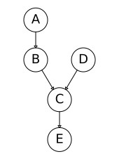

Consider the belief network $A \to B \leftarrow C$. Here $A$ and $C$ are conditionally independent. However, if we condition them on $B$, i.e. $P(A,C|B)$, then they become graphically dependent. That is, we belief the root "causes" of $A$ and $C$ to be independent, but given $B$ we learn something about both the causes of $A$ and $C$, which couples them, making them (graphically) dependent.

Note that the term "causes" is used loosely here; belief networks really only make independence statements, not necessarily causal ones.

(TODO the below is another set of notes for bayes' nets, incorporate these two)

Independence allows us to more compactly represent joint probability distributions, in that independent random variables can be represented as smaller, separate probability distributions.

For example, if we have binary random variables $A,B,C,D$, we would have a joint probability table of $2^4$ entries. However, if we know that $A,B$ is independent of $C,D$, then we only need two joint probability tables of $2^2$ entries each.

Typically, independent is too strong an assumption to make for real-world applications, but we can often make the weaker, yet still useful assumption of conditional independence.

Conditional independence is when one variable makes another variable irrelevant (because the other variable adds no additional information), i.e. $P(A|B,C) = P(A|B)$; knowing $C$ adds no more information when we know $B$.

For example, if $C$ causes $B$ and $B$ causes $A$, then knowledge of $B$ already implies $C$, so knowing about $C$ is kind of useless for learning about $A$ if we already know $B$.

As a more concrete example, given random variables traffic $T$, umbrella $U$, and raining $R$, we could reasonably assume that $U$ is conditionally independent of $T$ given $R$, because rain is the common cause of the two and there is no direct relationship between $U$ and $T$; the relationship is through $R$.

Similarly, given fire, smoke and an alarm, we could say that fire and alarm are conditionally independent given smoke.

As mentioned earlier, we can apply conditional independence to simplify joint distributions.

Take the traffic/umbrella/rain example from before. Their joint distribution is $P(T,R,U$, which we can decompose using the chain rule:

$$
P(T,R,U) = P(R)P(T|R)P(U|R,T)
$$

If we make the conditional independence assumption from before ($U$ and $T$ are conditionally independent given $R$), then we can simplify this:

$$
P(T,R,U) = P(R)P(T|R)P(U|R)
$$

That is, we simplified $P(U|R,T)$ to $P(U|R)$.

We can describe complex joint distributions more simply with these conditional independence assumptions, and we can do so with Bayes' nets (i.e. graphical models), which provide additional insight into the structure of these distributions (in particular, how variables interact locally, and how these local interactions propagate to more distant indirect interactions).

A Bayes' net is a directed acyclic graph.

The nodes in the graph are the variables (with domains). They may be assigned (observed) or unassigned (unobserved).

The arcs in the graphs are interactions between variables (similar to constraints in CSPs). They indicate "direct influence" between variables (not that this is _not_ necessarily the same as causation, it's about the information that observation of one variable gives about the other, which can mean causation, but not necessarily, e.g. it could simply be a hidden common underlying cause), which is to say that they encode conditional independences.

For each node, we have a conditional distribution over the variable that node represents, conditioned on its parents' values.

Bayes' nets implicitly encode joint distributions as a product of local conditional distributions:

$$
P(x_1, x_2, \dots, x_n) = \prod_{i=1}^n P(x_i | \text{parents}(X_i))
$$

This simply comes from the chain rule:

$$
P(x_1, x_2, \dots, x_n) = \prod_{i=1}^n P(x_i | x_1, \dots, x_{i-1})
$$

And then applying conditional independence assumptions.

The graph must be acyclic so that we can come up with a consistent ordering when we apply the chain rule (that is, decide the order for expanding the distributions). If the graph has cycles, we can't come up with a consistent ordering because we will have loops.

Note that arcs can be "reversed" (i.e. parent and children can be swapped) and encode the same joint distribution - so joint distributions can be represented by multiple Bayes' nets. But some Bayes' nets are better representations than others - some will be easier to work with; in particular, if the arcs _do_ represent causality, the network will be easier to work with.

Bayes' nets are much smaller than representing such joint distributions without conditional independence assumptions.

A joint distribution over $N$ boolean variables takes $2^n$ space (as demonstrated earlier).

A Bayes' net, on the other hand, where the $N$ nodes each have at most $k$ parents, only requires size $O(N * 2^{k+1})$.

The Bayes' net also encodes additional conditional independence assumptions in its structure.

For example, the Bayes' net $X \to Y \to Z \to W$ encodes the joint distribution:

$$
P(X,Y,Z,W) = P(X) P(Y|X) P(Z|Y) P(W|Z)
$$

This structure implies other conditional independence assumptions, e.g. that $Z$ is conditionally independent of $X$ given $Y$, i.e. $P(Z|Y) = P(Z|X,Y)$.

More generally we might ask: given two nodes, are they independent given certain evidence and the structure of the graph (i.e. assignments of intermediary nodes)?

We can use the _d-separation_ algorithm to answer this question.

First, we consider three configurations of _triples_ as base cases, which we can use to deal with more complex networks. That is, any Bayes' net can be decomposed into these three triple configurations.

A simple configuration of nodes in the form of $X \to Y \to Z$ is called a _causal chain_ and encodes the joint distribution $P(x,y,z) = P(x) P(y|x) P(z|y)$.

$X$ is not guaranteed to be (unconditionally) independent of $Z$.

However, is $X$ guaranteed to be conditionally independent of $Z$ given $Y$?

From the definition of conditional probability, we know that:

$$
P(z|x,y) = \frac{P(x,y,z)}{P(x,y)}
$$

With the Bayes' net, we can simplify this (the numerator comes from the joint distribution the graph encodes, as demonstrated previously, and the denominator comes from applying the product rule):

$$
P(z|x,y) = \frac{P(x)P(y|x)P(z|y)}{P(x)P(y|x)}
$$

Then, canceling a few things out:

$$
P(z|x,y) = P(z|y)
$$

So yes, $X$ is guaranteed to be conditionally independent of $Z$ given $Y$ (i.e. once $Y$ is observed). We say that evidence along the chain "blocks" the influence.

Another configuration of nodes is a __common cause__ configuration:

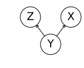

The encoded joint distribution is $P(x,y,z) = P(y)P(x|y)P(z|y)$.

Again, $X$ is not guaranteed to be (unconditionally) independent of $Z$.

Is $X$ guaranteed to be conditionally independent of $Z$ given $Y$?

Again, we start with the definition of conditional probability:

$$
P(z|x,y) = \frac{P(x,y,z)}{P(x,y)}
$$

Apply the product rule to the denominator and replace the numerator with the Bayes' net's joint distribution:

$$
P(z|x,y) = \frac{P(y)P(x|y)P(z|y)}{P(y)P(x|y)}
$$

Yielding:

$$
P(z|x,y) = P(z|y)
$$

So again, yes, $X$ is guaranteed to be conditionally independent of $Z$ given $Y$.

Another triple configuration is the __common effect__ configuration (also called __v-structures__):

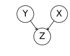

$X$ and $Y$ _are_ (unconditionally) independent here.

However, is $X$ guaranteed to be conditionally independent of $Y$ given $Z$?

No - observing $Z$ puts $X$ and $Y$ in competition as the explanation for $Z$ (this is called __causal competition__). That is, having observed $Z$, we think that $X$ or $Y$ was the cause, but not both, so now they are dependent on each other (if one happened, the other didn't, and vice versa).

Consider the following Bayes' net:

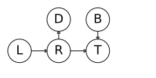

Where our random variables are rain $R$, dripping roof $D$, low pressure $L$, traffic $T$, baseball game $B$.

The relationships assumed here are: low pressure fronts cause rain, rain or a baseball game causes traffic, and rain causes your friend's roof to drip.

Given that you observe traffic, the probability that your friend's roof is dripping goes up - since perhaps the traffic is caused by rain, which would cause the roof to drip. This relationship is encoded in the graph the path between $T$ and $D$.

However - if we observe that it is raining, then observation of traffic has no more effect on $D$ - intuitively, this makes sense - we already know it's raining, so seeing traffic doesn't tell us more about the roof dripping. In this sense, observing $R$ "blocks" the path between $T$ and $D$.

One exception here is the v-structure with $R,B,T$. Observing that a baseball game is happening affects our belief about it raining _only_ if we have observed $T$. Otherwise, they are independent. So v-structures are "reversed" in some sense.

That is, we must observe $T$ to __activate__ the path between $R$ and $B$.

Thus we make the distinction between __active__ triples, in which information "flows" as it did with the path between $T$ and $D$ and between $R$ and $B$ when $T$ is observed, and __inactive__ triples, in which this information is "blocked".

Active triples are chain and common cause configurations in which the central node is _not_ observed and common effect configurations in which the central node _is_ observed, _or_ common effect configurations in which some child node of the central node is observed.

An example for the last case:

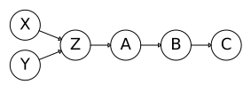

If $Z$, $A$, $B$ or $C$ are observed, then the triple is active.

Inactive triples are chain and common cause configurations in which the central node _is_ observed and common effect configurations in which the central node is _not_ observed.

So now, if we want to know if two nodes $X$ and $Y$ are conditionally independent given some evidence variables $\{Z\}$, we check all undirected paths from $X$ to $Y$ and see if there are any active paths (by checking all its constituent triples). If there are none, then they are conditionally independent, and we say that they are __d-separated__. Otherwise, conditional independence is not guaranteed. This is the __d-separation__ algorithm.

You can apply d-separation to a Bayes net and get a complete list of conditional independences that are necessarily true given certain evidence. This tells you the set of probability distributions that can be represented.

### Conditional independence assumptions

- Sally comes home and hears the alarm ($A=1$)
- Has she been burgled? ($B=1$)
- Or was the alarm triggered by an earthquake? ($E=1$)
- She hears on the radio that there was an earthquake ($R=1$)

We start with $P(A,B,E,R)$ and apply the chain rule of probability:

$$
P(A,B,E,R) = P(A|B,E,R) P(R|B,E) P(E|B) P(B)
$$

Then we can make some conditional independence assumptions:

* The radio report has no effect on the alarm: $P(A|B,E,R) \to P(A|B,E)$
* A burglary has no effect on the radio report: $P(R|B,E) \to P(R|E)$
* A burglary would have no effect on the earthquake: $P(E|B) \to P(E)$

Thus we have simplified the computation of the joint probability distribution:

$$
P(A,B,E,R) = P(A|B,E) P(R|E) P(E) P(B)
$$

We can also construct a belief network out of these conditional independence assumptions:

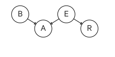

Say we are given the following probabilities:

$$
\begin{aligned}
P(B=1) &= 0.01 \\
P(E=1) &= 0.0000001 \\
P(A=1|B=1, E=1) &= 0.9999 \\
P(A=1|B=0, E=1) &= 0.99 \\
P(A=1|B=1, E=0) &= 0.99 \\
P(A=1|B=0, E=0) &= 0.0001 \\
P(R=1|E=1) &= 1 \\
P(R=1|E=0) &= 0
\end{aligned}
$$

First consider if Sally has not yet heard the radio; that is, she has only heard the alarm (so the only evidence she has is $A=1$). Sally wants to know if she's been burgled, so her question is $P(B=1|A=1)$:

$$
\begin{aligned}
P(B=1|A=1) &= \frac{P(B=1, A=1)}{P(A=1)} &\text{(Bayes' rule)} \\
&= \frac{\sum_{E,R} P(B=1,A=1,E,R)}{\sum_{B,E,R} P(B,E,A=1,R)} &\text{(marginal prob to joint prob)} \\
&= \frac{\sum_{E,R} P(A=1|B=1, E) P(B=1) P(E) P(R|E)}{\sum_{B,E,R} P(A=1|B,E) P(B) P(E) P(R|E)} &\text{(chain rule w/ our indep. assumps)} \\
&\approx 0.99
\end{aligned}
$$

Now consider that Sally has also heard the report, i.e. $R=1$. Now her question is $P(B=1|A=1, R=1)$:

$$
\begin{aligned}
P(B=1|A=1) &= \frac{P(B=1,A=1,R=1)}{P(A=1,R=1)} &\text{(Bayes' rule)} \\
&= \frac{\sum_E P(B=1,A=1,R=1,E)}{\sum_{B,E} P(A=1,R=1,B,E)} &\text{(marginal prob to joint prob)} \\
&= \frac{\sum_E P(A=1|B=1,E) P(B=1) P(E) P(R=1|E)}{\sum_{B,E}P(A=1|B,E)P(B)P(E)P(R=1|E)} &\text{(chain rule w/ our indep. assumps)} \\
&\approx 0.01
\end{aligned}
$$

So hearing the report and learning that there was an earthquake makes the burglary much less likely.

We may, however, only have __soft__ or __uncertain evidence__.

For instance, say Sally is only 70% sure that she heard the alarm.

We denote our soft evidence of the alarm's ringing as $\tilde A = (0.7, 0.3)$, which is to say $P(A=1) = 0.7$ and $P(A=0) = 0.3$.

We're ignoring the case with the report ($R=1$) for simplicity, but with this uncertain evidence we would calculate:

$$
\begin{aligned}
P(B=1| \tilde A) &= \sum_A P(B=1|A) P(A|\tilde A) \\
&= 0.7 P(B=1|A=1) + 0.3 P(B=1|A=0)
\end{aligned}
$$

__Unreliable evidence__ is distinct from _uncertain_ evidence.

Say we represent Sally's _uncertainty_ of hearing the alarm, as described before, as $P(S|A) = 0.7$.

Now say for some reason we feel that Sally is _unreliable_ for other reasons (maybe she lies a lot). We would then replace the term $P(S|A)$ with our own interpretation $P(H|A)$. For example, if Sally tells us her alarm went off, maybe we think that means there's a 60% chance that the alarm actually went off.

This new term $P(H|A)$ is our __virtual evidence__, also called __likelihood evidence__.

### Properties of belief networks

A note on the following graphics: the top part shows the belief network, where a faded node means it has been marginalized out, and a filled node means it has been observed/conditioned on. The bottom part shows the relationship between $A$ and $B$ after the marginalization/conditioning.

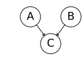

$P(A,B,C) = P(C|A,B) P(A) P(B)$

$A$ and $B$ are independent and determine $C$.

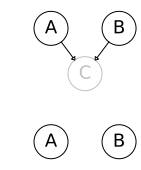

If we marginalize over $C$ (thus "removing" it), $A$ and $B$ are made conditionally independent. That is, $P(A,B) = P(A)P(B)$.

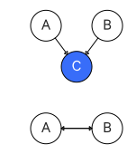

If we instead condition on $C$, $A$ and $B$ become graphically dependent. Although $A$ and $B$ are a priori independent, knowing something about $C$ tells us a bit about $A$ and $B$.

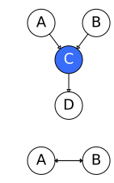

If we introduce $D$ as a child to $C$, i.e. $D$ is a descendant of a collider $C$, then conditioning on $D$ also makes $A$ and $B$ graphically dependent.

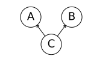

In this arrangement, $C$ is the "cause" and $A$ and $B$ are independent effects: $P(A,B,C) = P(A|C) P(B|C) P(C)$.

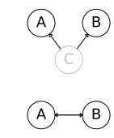

Here, marginalizing over $C$ makes $A$ and $B$ graphically dependent. In general, $P(A,B) \neq P(A)P(B)$ because they share the same cause.

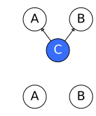

Conditioning on $C$ makes $A$ and $B$ independent: $P(A,B|C) = P(A|C)P(B|C)$. This is because if you know the "cause" $C$ then you know how the effects $A$ and $B$ occur independent of each other.

The same applies for this arrangement - here $A$ "causes" $C$ and $C$ "causes" $B$. Conditioning on $C$ blocks $A$'s ability to influence $B$.

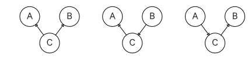

These graphs all encode the same conditional independence assumptions.

For both directed and undirected graphs, two graphs are __Markov equivalent__ if they both represent the same set of conditional independence statements.

### Example

Consider a joint distribution over the following random variables:

- $G$, grade: $g^1$ for A, $g^2$ for B, $g^3$ for C
- $I$, intelligence, binary: $-i$ for low, $+i$ for high
- $D$, difficulty of the course, binary: $-d$ for easy, $+d$ for hard
- $S$, SAT score, binary: $-s$ for low, $+s$ for high
- $L$, reference letter, binary: $-l$ for not received, $+l$ for received

We can encode some conditional independence assumptions about these random variables into a belief net:

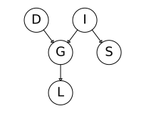

- the grade depends on the student's intelligence and difficulty of the course
- the student's SAT score seems dependent on only their intelligence
- whether or not a student receives a recommendation letter depends on their grade

Note that we could add the assumption that intelligence students are likely to take more difficult courses, if we felt strongly about it:

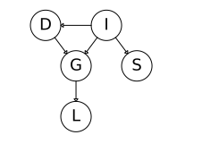

To turn this graph into a probability distribution, we can represent each node as a CPD:

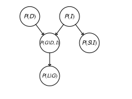

Then we can apply the _chain rule_ of Bayesian networks which just multiplies all the CPDs:

$$
P(D,I,G,S,L) = P(D) P(I) P(G|I,D) P(S|I) P(L|G)
$$

A Bayesian network (BN) is a directed acyclic graph where its nodes represent the random variables $X_1, \dots, X_n$. For each node $X_i$ we have a CPD $P(X_i | \text{Par}_G (X_i)$, where $\text{Par}_G(X_i)$ refers to the parents of $X_i$ in the graph $G$.

In whole, the BN represents a joint distribution via the chain rule for BNs:

$$
P(X_1, \dots, X_n) = \prod_i P(X_i|\text{Par}_G(X_i))
$$

We say a probability distribution $P$ _factorizes_ over a BN graph $G$ if the B chain rule holds for $P$.

There are three types of reasoning that occur with a BN:

- __Causal reasoning__ includes conditioning on an ancestor to determine a descendant's probability, e.g. $P(L=1|I=0)$.
- __Evidential reasoning__ goes the other way: given a state for a descendant, get the probability for an ancestor, e.g. $P(I=0|G=3)$.
- __Intercausal reasoning__ - consider $P(I=1|G=3,D=1)$. The $D$ node is not directly connected to the $I$ node, yet conditioning on it does affect the probability.

As the simplest example of intercausal reasoning, consider an `OR` gate:

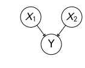

Knowing $Y$ and $X_1$ (or $X_2$) tells you the value of $X_2$ (or $X_1$) even though $X_1$ and $X_2$ are not directly linked. Knowing $Y$ alone does not tell you anything about $X_1$ or $X_2$'s values.

There are a few different structures in which a variable $X$ can __influence__ a variable $Y$, i.e. change beliefs in $Y$ when conditioned on $X$:

- $X \to Y$
- $X \leftarrow Y$
- $X \to W \to Y$
- $X \leftarrow W \leftarrow Y$
- $X \leftarrow W \to Y$

Which the different reasonings described above capture.

The one structure which "blocks" influence is $X \to W \leftarrow Y$. That is, where two causes have a joint effect. This is called a __v-structure__.

A __trail__ is a sequence of nodes that are connected to each other by single edges in the graph. A trail $X_1 - \dots - X_k$ is __active__ (if there is no evidence) if it has no v-structures $X_{i-1} \to X_i \leftarrow X_{i+1}$, where $X_i$ is the block.

When can variable $X$ can influence a variable $Y$ given evidence $Z$?

- $X \to Y$
- $X \leftarrow Y$

$X$ may influence $Y$ given evidence $Z$ under certain conditions, depending on whether or not node $W$ is part of the evidence $Z$:

- $X \to W \to Y$, if $W \notin Z$
- $X \leftarrow W \leftarrow Y$, if $W \notin Z$
- $X \leftarrow W \to Y$, if $W \notin in Z$
- $X \to W \leftarrow Y$, if either $W \in Z$ or one of $W$'s descendants $\in Z$ (intercausal reasoning)

A trail $X_1 - \dots - X_k$ is _active_ given evidence $Z$ if, for any v-structure $X_{i-1} \to X_i \leftarrow X_{i+1}$ we have that $X_i$ or one of its descendants is in $Z$ and no other $X_i$ (not in v-structures) is in $Z$.

### Independence

For events $\alpha, \beta$, we say $P$ satisfies the independence of $\alpha$ and $\beta$, notated $P \vDash \alpha \perp \beta$ if:

- $P(\alpha,\beta) = P(\alpha)P(\beta)$
- $P(\alpha|\beta) = P(\alpha)$
- $P(\beta|\alpha) = P(\beta)$

This can be generalized to random variables:

$X, Y, P \vDash X \perp Y$ if:

- $P(X,Y) = P(X)P(Y)$
- $P(X|Y) = P(X)$
- $P(Y|X) = P(Y)$

### Conditional independence

For (sets of) random variables $X,Y,Z, P \vDash (X \perp Y | Z)$ if:

* $P(X,Y|Z) = P(X|Z) P(Y|Z)$
* $P(X|Y,Z) = P(X|Z)$
* $P(Y|X,Z) = P(Y|Z)$
* $P(X,Y,Z) \varpropto \phi_1(X,Z) \phi_2(Y,Z)$; that is, the probability of the joint distribution $P(X,Y,Z)$ is proportional to a product of the two factors $\phi_1(X,Z)$ and $\phi_2(Y,Z)$

For example:

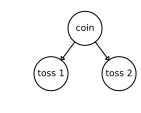

There are two coins, one is fair and one is biased to show heads 90% of the time.

You pick a coin, toss it, and it comes up heads.

The probability of heads is _higher_ in the second toss. You don't know what coin you have but heads on the first toss makes it more likely that you have the bias coin, thus a higher chance of heads on the second toss. So $X_1$ and $X_2$ are not independent. But if you know what coin you have, the tosses are then independent; the first toss doesn't tell you anything about the second anymore. That is, $X_1 \perp X_2 | C$.

But note that conditioning can also lose you independence. For example, using the previous student example, $I \perp D$, but if we condition on grade $G$, they are no longer independent (this is the same as the `OR` gate example).

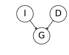

We say that $X$ and $Y$ are __d-separated__ in $G$ given $Z$ if there is no active trail in $G$ between $X$ and $Y$ given $Z$. This is notated $\text{d-sep}_G(X,Y|Z)$.

If $P$ factorizes over $G$ and $\text{d-sep}_G(X,Y|Z)$, then $P$ satisfies $X \perp Y |Z)$.

Any node is d-separated from its non-descendants given its parents.

So if a distribution $P$ factorizes over $G$, then in $P$, any variable is independent of its non-descendants given its parents.

We can notate the set of independencies implicit in a graph $G$, that is, all of the independence statements that correspond to d-separation statements in the graph $G$, as $I(G)$:

$$
I(G) = \{(X \perp Y | Z) | \text{d-sep}_G (X,Y|Z) \}
$$

If $P$ satisfies $I(G)$, then we say that $G$ is an I-map (__independency map__) of $P$.

This does not mean $G$ must imply _all_ independencies in $P$, just that those that it does imply are in fact present in $P$.

SO if $P$ factorizes over $G$, then $G$ is an I-map for $P$. The converse also holds: if $G$ is an I-map for $P$, then $P$ factorizes over $G$.

### Template models

Within a model you may have structures which repeat throughout or you may want to reuse common structures between/across models.

In these cases we may use __template variables__.

A template variable $X(U_1, \dots, U_k)$ is instantiated multiple times. $U_1, \dots, U_k$ are the _arguments_.

A __template model__ is a language which specifies how "ground" variables inherit dependency models from templates.

### Temporal models

A common example of template models are __temporal models__, used for systems which evolve over time.

When representing a distribution over continuous time, you typically want to _discretize_ time so that it is not continuous. To do this, you pick a _time granularity_ $\Delta$.

We also have a set of template variables. $X^{(t)}$ describes an instance of a template variable $X$ at time $t\Delta$.

$$
X^{(t:t')} = \{X^{(t)}, \dots, X^{(t')}\} \text{where} t \leq t'
$$

That is, $X^{(t:t')}$ denotes the set of random template variables that spans these time points.

We want to represent $P(X^{(t:t')})$ for any $t, t'$.

To simplify this, we can use the __Markov assumption__, a type of conditional independence assumption.

Without this assumption, we have:

$$
P(X^{(0:T)} = P(X^{(0)}) \prod_{t=0}^{T-1} P(X^{(t+1)}|X^{(0:t)})
$$

(this is just using the chain rule for probability)

Then the Markov assumption is $(X^{(t+1)} \perp X^{(0:t-1)} | X^{(t)})$. That is, any time point is independent of the past, given the present.

So then we can simplify our distribution:

$$
P(X^{(0:T)} = P(X^{(0)}) \prod_{t=0}^{T-1} P(X^{(t+1)}|X^{(t)})
$$

The Markov assumption isn't always appropriate, or it may be too strong.

You can make it a better approximation by adding other variables about the state, in addition to $X^{(t)}$.

The second assumption we make is of __time invariance__.

We use a template probability model $P(X'|X)$ where $X'$ denotes the next time point and $X$ denotes the current time point. We assume that this model is replicated for every single time point.

That is, for all $t$:

$$
P(X^{(t+1)}|X^{(t)}) = P(X'|X)
$$

That is, the probability distribution is not influenced by the time $t$.

Again, this is an approximation and is not always appropriate. Traffic, for example, has a different dynamic depending on what time of day it is.

Again, you can include extra variables to capture other aspects of the state of the world to improve the approximation.

#### Temporal model example (transition model)

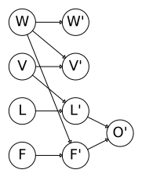

- $W$ = weather
- $V$ = velocity
- $L$ = location
- $F$ = failure
- $O$ = observation

The left column of the graph is at time slice $t$, and the right side is at time slice $t+1$.

The edges connecting the nodes at $t$ to the nodes at $t+1$, e.g. $F \to F'$, is an __inter-time-slice__, and the edges connecting nodes at $t+1$ to the observation, e.g. $F' \to O'$, are __intra-time-slices__.

We can describe a conditional probability distribution (CPD) for our prime variables as such:

$$
P(W', V', L', F', O' | W, V, L, F)
$$

We don't need a CPD for the non-prime variables because they have already "happened".

We can rewrite this distribution with the independence assumptions in the graph:

$$
P(W', V', L', F', O' | W, V, L, F) = P(W'|W) P(V'|W,V) P(L'|L,V) P(F'|F,W) P(O'|L',F')
$$

Here the observation $O'$ is conditioned on variables in the same time slice ($L', F'$) because we assume the observation is "immediate". This is a relation known as an _intra-time-slice_.

All the other variables are conditioned on the previous time slice, i.e. they are _inter-time-slice_ relations.

Now we start with some initial state (time slice 0, $t_0$):

Then we add on the next time slice, $t_1$:

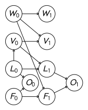

And we can repeatedly do this to represent all subsequent time slices $t_2, \dots$, where each is conditioned on the previous time slice.

So we have a __2-time-slice Bayesian network__ (2TBN). A transition model (2TBN) over $X_1, \dots, X_n$ is specified as a BN __fragment__ such that:

- the nodes include $X_1', \dots, X_n'$ (next time slice $t+1$) and a subset of $X_1, \dots, X_n$ (time slice $t$).
- only the nodes $X_1', \dots, X_n'$ have parents and a CPD

The 2TBN defines a conditional distribution using the chain rule:

$$
P(X'|X) = \prod_{i=1}^n P(X_i'|\text{Pa}(X_i'))
$$

### Markov Models

We can consider a Markov model as a chain-structured Bayes' Net, so our reasoning there applies here as well.

Each node is a state in the sequence and each node is identically distributed (stationary) and depends on the previous state, i.e. $P(X_t|X_{t-1})$ (except for the initial state $P(X_1)$). This is essentially just a conditional independence assumption (i.e. that $P(X_t)$ is conditionally independent of $X_{t-2}, X_{t-3}, \dots, X_1$ given $X_{t-1}$).

The parameters of a Markov model are the __transition probabilities__ (or __dynamics__) and the initial state probabilities (i.e. the initial distribution $P(X_1)$.

Say we want to know $P(X)$ at time $t$. A Markov model algorithm for solving this is the __forward algorithm__, which is just an instance of variable elimination (in the order $X_1, X_2, \dots$). A simplified version:

$$
P(x_t) = \sum_{x_{t-1}} P(x_t|x_{t-1}) P(x_{t-1})
$$

Assuming $P(x_1)$ is known.

$P(X_t)$ converges as $t \to \infty$, and it converges to the same values regardless of the initial state. This converged distribution, independent of the initial state, is called the __stationary distribution__. The influence of the initial state fades away as $t \to \infty$.

The key insight for a stationary distribution is that $P(X_t) = P(X_{t-1})$, and that this is independent of the initial distribution.

Formally, the stationary distribution satisfies:

$$
P_{\infty}(X) = P_{\infty+1}(X) = \sum_x P_{t+1|t}(X|x) P_{\infty}(x)
$$

### Dynamic Bayes Networks (DBNs)

A dynamic Bayes' net (DBN) is a Bayes' net replicated through time, i.e. variables at time $t$ can be conditioned on those from time $t-1$ (the structure is reminiscent of a recurrent neural network).

A dynamic Bayesian network over $X_1, \dots, X_n$ is defined by a:

- 2TBN $\text{BN}_{\to}$ over $X_1, \dots, X_n$
- a Bayesian network $\text{BN}^{(0)}$ over $X_1^{(0)}, \dots, X_n^{(0)}$ (time 0, i.e. the initial state)

#### Ground network

For a trajectory over $0, \dots, T$, we define a __ground (unrolled network)__ such that:

- the dependency model for $X_1^{(0)}, \dots, X_n^{(0)}$ is copied from $\text{BN}^{(0)}$
- the dependency model for $X_1^{(t)}, \dots, X_n^{(t)}$ for all $t > 0$ is copied from $\text{BN}_{\to}$

That is, it is just an aggregate ("unrolled") of the previously shown network up to time slice $t_T$.

#### Hidden Markov Models (HMMs)

Often we have a sequence of observations and we want to use these observations to learn something about the underlying process that generated them. As such we need to introduce time or space to our models.

An __Hidden Markov Model__ (HMM) is a simple dynamic Bayes' net. In particular, it is a Markov model in which we don't directly observe the state. That is, there is a Markov chain where we don't see $S_t$ but rather we see some evidence/observations/emissions/outputs/effects/etc $O_t$.

The actual observations are stochastic (e.g. an underlying state may produce one of many observations with some probability). We try to infer the state based on these observations.

For example, imagine we are in a windowless room and we want to know if it's raining. We can't directly observe whether it's raining, but we can see if people have brought umbrellas with them.

It is also a 2TBN.

HMMs are used to analyze or to predict time series involving noise or uncertainty.

There is a sequence of states $s_1 \to s_2 \to s_3 \to \dots \to S_N$. This sequence is a Markov chain (each state depends only on the previous state).

Each state __emits__ a measurement/observation, e.g. $s_1$ emits $z_1$ ($s_1 \to z_1$), $s_2$ emits $z_2$ ($s_2 \to z_2$), and so on. We don't deserve the states directly; we only observe these measurements (hence, the underlying Markov model is "hidden").

Together, these define a Bayes network that is at the core of HMMs.

An HMM is defined by:

- a state variable $S$ and an _observation_ (sometimes called __emission__) variable $O$
- the initial distribution $P(S_0)$
- the transition model $P(S'|S)$
- the observation model $P(O|X)$ (the probability of seeing evidence given the hidden state, also called an _emissions model_)

We introduce an additional conditional independence assumption - that the current observation is independent of everything else given the current state.

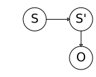

You can unroll this:

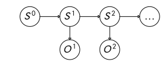

HMMs, however, may also have internal structures, more commonly in the transition model, but sometimes in the observation model as well.

TODO in the following $X$ is switched with $S$, make it consistent

#### Example

Say we have the following HMM:

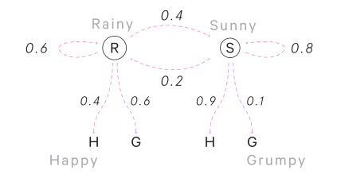

We don't know the starting state, but we know the probabilities:

$$
\begin{aligned}
P(R_0) &= \frac{1}{2} \\
P(S_0) &= \frac{1}{2}
\end{aligned}
$$

Say on the first day we see that this person is happy and we want to know whether or not it is raining. That is:

$$
P(R_1|H_1)
$$

We can use Bayes' rule to compute this posterior:

$$
P(R_1|H_1) = \frac{P(H_1|R_1)P(R_1)}{P(H_1)}
$$

We can compute these values by hand:

$$
\begin{aligned}
P(R_1) &= P(R_1|R_0)P(R_0) + P(R_1|S_0)P(S_0) \\
P(H_1) & = P(H_1|R_1)P(R_1) + P(H_1|S_1)P(S_1)
\end{aligned}
$$

$P(H_1|R_1)$ can be pulled directly from the graph.

Then you can just run the numbers.

##### Inference base cases in an HMM

The first base case: consider the start of an HMM:

$$
P(X_1) \to P(E_1|X_1)
$$

Inferring $P(X_1|e_1)$, that is, $P(X_1)$ given we observe a piece of evidence $e_1$, is straightforward:

$$
\begin{aligned}
P(x_1|e_1) &= \frac{P(x_1, e_1)}{P(e_1)} \\
&= \frac{P(e_1|x_1)P(x_1)}{P(e_1)} \\
&\varpropto_{X_1} P(e_1|x_1)P(x_1)
\end{aligned}
$$

That is, we applied the definition of conditional probability and then expanded the numerator with the product rule.

For an HMM, $P(E_1|X_1)$ and $P(X_1)$ are specified, so we have the information needed to compute this. We just compute $P(e_1|X_1)P(X_1)$ and normalize the resulting vector.

The second base case:

Say we want to infer $P(X_2)$, and we just have the HMM:

$$
X_1 \to X_2
$$

That is, rather than observing evidence, time moves forward one step.

For an HMM, $P(X_1)$ and $P(X_2|X_1)$ are specified.

So we can compute $P(X_2)$ like so:

$$
\begin{aligned}
P(x_2) &= \sum_{x_1} P(x_2, x_1) \\
&= \sum_{x_1} P(x_2|x_1)P(x_1)
\end{aligned}
$$

From these two base cases we can do all that we need with HMMs.

###### Passage of time

Assume that we have the current belief $P(X|\text{evidence to date})$:

$$
B(X_t) = P(X_t|e_{1:t})
$$

After one time step passes, we have:

$$
P(X_{t+1}|e_{1:t}) = \sum_{x_t} P(X_{t+1}|x_t) P(x_t|e_{1:t})
$$

Which can be written compactly as:

$$
B'(X_{t+1}) = \sum_{x_t} P(X'|x)B(x_t)
$$

Intuitively, what is happening here is: we look at each place we could have been, $x_t$, consider how likely it was that we were there to begin with, $B(x_t)$, and multiply it by the probability of getting to $X'$ had you been there.

###### Observing evidence

Assume that we have the current belief $P(X|\text{previous evidence})$:

$$
B'(X_{t+1}) = P(X_{t+1}|e_{1:t})
$$

Then:

$$
P(X_{t+1}|e_{1:t+1}) \varpropto P(e_{t+1}|X_{t+1}) P(X_{t+1}|e_{1:t})
$$

See the above base case for observing evidence - this is just that, and remember, renormalize afterwards.

Another way of putting this:

$$
B(X_{t+1}) \varpropto P(e|X) B'(X_{t+1})
$$

##### The Forward Algorithm

Now we can consider the forward algorithm (the one presented previously was a simplification).

We are given evidence at each time and want to know:

$$
B_t(X) = P(X_t|e_{1:t})
$$

We can derive the following updates:

$$
\begin{aligned}
P(x_t|e_{1:t}) &\varpropto_X P(x_t, e{1:t}) \\
&= \sum_{x_{t-1}} P(x_{t-1}, x_t, e_{1:t}) \\
&= \sum_{x_{t-1}} P(x_{t-1}, e_{1:t-1}) P(x_t|x_{t-1})P(e_t|x_t) \\
&= P(e_t|x_t) \sum_{x_{t-1}} P(x_{t-1}, e_{1:t-1})
\end{aligned}
$$

Which we can normalize at each step (if we want $P(x|e)$ at each time step) or all together at the end.

This is just variable elimination with the order $X_1, X_2, \dots$.

This computation is proportional to the square number of states.

##### Most Likely Explanation

With __Most Likely Explanation__, the concern is not the state at time $t$, but the most likely sequence of states that led to time $t$, given observations.

For MLE, we use an HMM and instead we want to know:

$$
\argmax_{x_{1:t}} P(x_{1:t}|e_{1:t})
$$

We can use the __Viterbi algorithm__ to solve this, which is essentially just the forward algorithm where the $\sum$ is changed to a $\max$:

$$
\begin{aligned}
m_t[x_t] &= \max_{x_{1:t-1}} P(x_{1:t-1}, x_t, e_{1:t}) \\
&= P(e_t|x_t) \max_{x_{t-1}} P(x_t|x_{t-1}) m_{t-1}[x_{t-1}]
\end{aligned}
$$

In contrast, the forward algorithm:

$$
\begin{aligned}
f_t[x_t] &= P(x_t, e_{1:t}) \\
&= P(e_t|x_t) \sum_{x_{t-1}} P(x_t|x_{t-1}) f_{t-1}[x_{t-1}]
\end{aligned}
$$

### Plate models

A common template model is a __plate model__.

Say we are repeatedly flipping a coin.

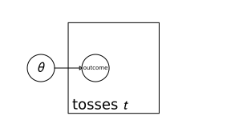

The surrounding box is the __plate__. The idea is that these are "stacked", one for each toss $t$. That is, they are indexed by $t$.

The $\theta$ node denotes the CPD parameters. This is outside the plate, i.e. it is not indexed by $t$.

Another way of visualizing this:

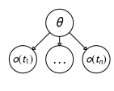

Where $o(t_i)$ is the outcome at time $t_i$. This representation makes it more obvious that each of these plates is a copy of a template.

Another example:

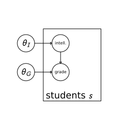

Plates may be _nested_:

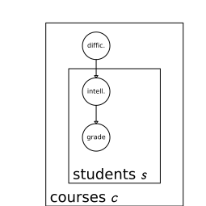

If we were to draw this out for two courses and two students:

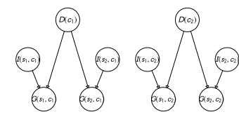

One oddity here is that now intelligence depends on both the student $s$ and the course $c$, whereas before it depends only on the student $s$. Maybe this is desired, but let's say we want what we had before. That is, we want intelligence to be independent of the course $c$.

Instead, we can use _overlapping_ plates:

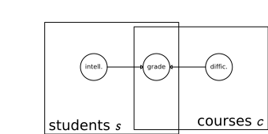

Plate models allow for __collective inference__, i.e. they allow us to look at the aggregate of these individual instances in order to find broader patterns.

More formally, a __plate dependency model__:

For a template variable $A(U_1, \dots, U_k)$ we have template parents $B_1(U_1), \dots, B_m(U_m)$; that is, an index cannot appear in the parent which does not appear in the child. This is a particular limitation of plate models.

We get the following template CPD: $P(A|B_1, \dots, B_m)$.

### Structured CPDs

We can represent CPDs in tables, e.g.

|            | $g_1$ | $g_2$ | $g_3$ |
|------------|-------|-------|-------|
| $i_0, d_0$ |       |       |       |
| $i_0, d_1$ |       |       |       |
| $i_1, d_0$ |       |       |       |
| $i_1, d_1$ |       |       |       |

But as we start to have more variables, this table can explode in size.

More generally, we can just represent a CPD $P(X|Y_1, \dots, Y_k)$, which specifies a distribution over $X$ for each assignment $Y_1, \dots, Y_k$ using any function which specifies a factor $\phi(X, Y_1, \dots, Y_k)$ such that:

$$
\sum_x \phi(x, y_1, \dots, y_k) = 1
$$

for all $y_1, \dots, y_k$.

There are many models for representing CPDs, including:

- deterministic CPDs
- tree-structured CPDs
- logistic CPDs and generalizations
- noisy OR/AND
- linear Gaussians and generalizations

__Context-specific independence__ shows up in some CPD representations. It is a type of independence where we have a particular assignment $c$, from some set of variables $C$, $P \vDash (X \perp_c Y | Z, c)$

Which is to say this independence holds only for particular values of $c$, rather than all values of $c$.

For example, consider:

Where $X$ is a deterministic `OR` of $Y_1, Y_2$.

Consider:

* $X \perp Y_1 | y_2^0$. When $Y_2$ is false, $X$ just takes on the value of $Y_1$, so there's no context-specific independence here.
* $X \perp Y_1 | y_2^1$. When $Y_2$ is true, then it doesn't matter what value $Y_1$ takes, since $X$ will be true too. Thus we have context-specific independence.
* $Y_1 \perp Y_2 | x^0$. If we know $X$ is false, we already know $Y_1, Y_2$ are false, independent of each other. So we have context-specific independence here.
* $Y_1 \perp Y_2 | x^1$. We don't have context-specific independence here.

#### Tree-structured CPDs

Say we have the following model:

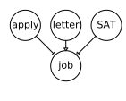

That is, whether or not a student gets a job $J$ depends on:

- $A$ - if they applied ($+a, -a$)
- $L$ - if they have a letter of recommendation ($+l, -l$)
- $S$ - if they scored well on the SAT ($+s, -s$)

We can represent the CPD as a tree structure.

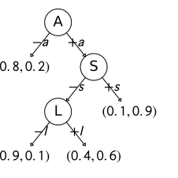

Note that the notation at the leaf nodes is the probability of not getting the job and of getting it, i.e. $(P(-j), P(+j)$.

A bit more detail: we're assuming its possible that the student gets the job without applying, e.g. via a recruiter, in which case the SAT score and letter aren't important.

We also assume that if the student scored well on the SAT, the letter is unimportant.

We have three binary random variables. If we represented this CPD as a table, it have $2^3=8$ conditional probability distributions. However, in certain contexts we only need 4 distributions since we have some context-specific independences:

* $J \perp_c L| +a, +s$
* $J \perp_c L,S| -a$
* $J \perp_c L| +s, A$

This last one is just a compact representation of:

* $J \perp_c L| +s, +a$
* $J \perp_c L| +s, -a$

Consider another model:

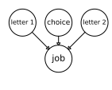

Where the student chooses only one letter to submit.

The tree might look like:

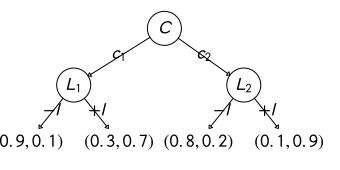

Here the choice variable $C$ determines the dependence of one set of circumstances on another set of circumstances.

This scenario has context-specific independence but also non-context-specific independence:

$$
L_1 \perp L_2 | J, C
$$

Because, if you break it down into its individual cases:

* $L_1 \perp_c L_2 | J, c_1$
* $L_1 \perp_c L_2 | J, c_2$

both are true.

This scenario relates to a class of CPDs called _multiplexer_ CPDs:

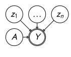

$Y$ has two lines around it to indicate deterministic dependence.

Here we have some variables $Z_1, \dots, Z_k$ and $A$ is a copy of _one_ of these variables.

$A$ is the __multiplexer__, i.e. the "selector variable", taking a value from $\{1, \dots, k\}$.

For a multiplexer CPD, we have:

$$
P(Y|A,Z_1, \dots, Z_k) = \begin{cases}
1 & Y=Z_a \\
0 & \text{otherwise}
\end{cases}
$$

That is, the value of $A$ just determines which $Z$ value $Y$ takes on.

#### Noisy OR CPDs

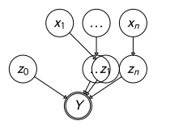

In a noise OR CPD we introduce intermediary variables between $x_i$ and $Y$. These intermediary variables $z$ take on 1 if its parent value satisfies its criteria. $Y$ becomes an OR variable which is true if any of the $z$ variables are true.

That is:

$$
P(z_i=1|x_i) = \begin{cases}
0 &\text{if $x_i=0$} \\
\lambda_i &\text{if $x_i=1$}
\end{cases}
$$

Where $\lambda_i \in [0,1]$.

So if $x_i=0$, $z_i$ never gets turned on. If $x_i=1$, $z_i$ gets turned on with probability $lambda_i$.

$z_0$ is a "leak" probability which is the probability that $Y$ gets turned on by itself. $P(z_0=1) = \lambda_0$.

We can write this as a probability and consider the CPD of $Y=0$ given our $x$ variables. That is, what is the probability that all the $x$ variables fail to turn on their corresponding $z$ variables?

$$
P(Y=0|X_1, \dots, X_k) = (1-\lambda_0) \prod_{i:x_i=1} (1- \lambda_i)
$$

where $(1-\lambda_0)$ is the probability that $Y$ doesn't get turned on by the leak.

Thus:

$$
P(Y=1|X_1, \dots, X_k) = 1 - P(Y=0|X_1, \dots, X_k)
$$

A noisy OR CPD demonstrates __independence of causal influence__. We are assuming that we have a bunch of causes $x_1, \dots, x_k$ for a variable $Y$, which each act independently to affect the truth of the $Y$. That is, there is no interaction between the causes.

Other CPDs for independence of causal influence include noisy AND, noisy MAX, etc.

#### Continuous variables

Consider:

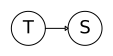

We have the temperature in a room and a sensor which measures the temperature.

The sensor is not perfect, so it usually around the right temperature, but not exactly.

We can represent this by saying the sensor reading $S$ is a normal distribution around the true temperature $T$ with some standard deviation, i.e.:

$$
S \sim N(T; \sigma_S^2)
$$

This model is a _linear Gaussian_.

We can make it more complex, assuming that the outside temperature will also affect the room temperature:

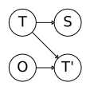

Where $T'$ is the temperature in a few moments and $O$ is the outside temperature. We may say that $T'$ is also a linear Gaussian:

$$
T' \sim N(\alpha T + (1-\alpha) O; \sigma_T^2)
$$

The $\alpha T + (1-\alpha) O$ term is just a mixture of the current temperature and the outside temperature.

We can take it another step. Say there is a door $D$ in the room which is either opened or closed (i.e. it is a binary random variable).

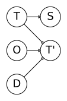

Now $T'$ is described as:

$$
\begin{aligned}
T' &\sim N(\alpha_0 T + (1-\alpha_0) O; \sigma_{0T}^2) \text{if $D=0$} \\
T' &\sim N(\alpha_1 T + (1-\alpha_1) O; \sigma_{1T}^2) \text{if $D=1$}
\end{aligned}
$$

This is a _conditional_ linear Gaussian model since its parameters are conditioned on the discrete variable $D$.

Generally, a linear Gaussian model looks like:

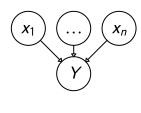

$$
Y \sim N(w_0 + \sum w_i X_i ; \sigma^2)
$$

Where $w_0 + \sum w_i X_i$ is the mean (a linear function of the parents) and $\sigma^2$ is not related to the parents/doesn't depend on the parents.

Then, conditional linear Gaussians introduce one or more discrete parents (only one, $A$, is depicted below), and this is just a linear gaussian whose parameters depend on the value of $A$:

$$
Y \sim N(w_{a0} + \sum w_{ai} X_i; \sigma_a^2)
$$

### Querying Bayes's nets

#### Conditional probability queries

PGMs can be used to answer many queries, but the most common is probably __conditional probability queries__:

Given evidence $e$ about some variables $E$, we have a query which is a subset of variables $Y$, and our task is to compute $P(Y|E=e)$.

Unfortunately, the problem of inference on graphical models is NP-Hard. In particular, the following are NP-Hard:

- __exact inference__
  - given a PGM $P_{\Phi}$, a variable $X$ and a value $x \in \text{Val}(X)$, compute $P_{\Phi}(X=x)$
  - even just deciding if $P_{\Phi}(X=x) > 0$ is NP-hard
- __approximate inference__
  - let $\epsilon < 0.5$. Given a PGM $P_{\Phi}$, a variable $X$, a value $x \in \text{Val}(X)$, and an observation $e \in \text{Val}(E)$, find a number $p$ that has $|P_{\Phi}(X=x|E=e) - p| < \epsilon$.

However, NP-Hard is the worst case result and their are algorithms that perform for most common cases.

Some conditional probability inference algorithms:

- variable elimination
- message passing over a graph
  - belief propagation
  - variational approximations
- random sampling instantiations
  - Markov Chain Monte Carlo (MCMC)
  - importance sampling

#### MAP (maximum a posteriori) queries

PGMs can also answer MAP queries:

We have a set of evidence $E=e$, the query is all other variables $Y$, i.e. $Y = \{X_1, \dots, X_n\} - E$. Our task is to compute $\text{MAP}(Y|E=e) = \argmax_y P(Y=y|E=e)$. There may be more than one possible solution.

This is also a NP-hard problem, but there are also many algorithms to solve these efficiently for most cases.

Some MAP inference algorithms:

- variable elimination
- message passing over a graph
  - max-product belief propagation
- using methods for integer programming
- for some networks, graph-cut methods
- combinatorial search

### Inference in Bayes' nets

Given a query, i.e. a joint probability distribution we are interested in getting a value for, we can infer an answer for that query from a Bayes' net.

The simplest approach is __inference by enumeration__ in which we extract the conditional probabilities from the Bayes' net and appropriately combine them together.

But this is very inefficient, especially because variables that aren't in the query require us to enumerate over all possible values for them. We lose most of the benefit of having this compact representation of joint distributions.

An alternative approach is __variable elimination__, which is still NP-hard, but faster than enumeration.

Variable elimination requires the notion of _factors_. Here are some factors:

- a joint distribution: $P(X,Y)$, which is just all entries $P(x,y)$ for all $x,y$ and sums to 1.

Example:

$$
P(T,W)
$$

| T    | W    | P   |
|------|------|-----|
| hot  | sun  | 0.4 |
| hot  | rain | 0.1 |
| cold | sun  | 0.2 |
| cold | rain | 0.3 |

- a selected joint: $P(x,Y)$, i.e. we fix $X=x$, then look at all entries $P(x,y)$ for all $y$, and sums to $P(x)$. This is a "slice" of the joint distribution.

Example:

$$
P(\text{cold}, W)
$$

| T    | W    | P   |
|------|------|-----|
| cold | sun  | 0.2 |
| cold | rain | 0.3 |

- a single conditional: $P(Y|x)$, i.e. we fix $X=x$, then look at all entries $P(y|x)$ for all $y$, and sums to 1.

Example:

$$
P(W|\text{cold})
$$

| T    | W    | P   |
|------|------|-----|
| cold | sun  | 0.4 |
| cold | rain | 0.6 |

- a family of conditionals: $P(X,Y)$, i.e. we have multiple conditions, all entries $P(x|y)$ for all $x, y$, and sums to $|Y|$.

Example:

$$
P(W|T)
$$

| T    | W    | P   |
|------|------|-----|
| hot  | sun  | 0.8 |
| hot  | rain | 0.2 |
| cold | sun  | 0.4 |
| cold | rain | 0.6 |

- a specified family: $P(y|X)$, i.e. we fix $y$ and look at all entries $P(y|x)$ for all $x$. Can sum to anything;

Example:

$$
P(\text{rain}|T)
$$

| T    | W    | P   |
|------|------|-----|
| hot  | rain | 0.2 |
| cold | rain | 0.6 |

In general, when we write $P(Y_1, \dots, Y_N | X_1, \dots, X_M)$, we have a factor, i.e. a multi-dimensional array for which the values are all instantiations $P(y_1, \dots, y_N|x_1, \dots, x_M)$.

Any assigned/instantiated $X$ or $Y$ is a dimension missing (selected) from the array, which leads to smaller factors - when we fix values, we don't have to consider every possible instantiation of that variable anymore, so we have less possible combinations of variable values to consider.

For example, if $X$ and $Y$ are both binary random variables, if we don't fix either of them we have four to consider ($(X=0,Y=0), (X=1,Y=0), (X=0,Y=1), (X=1,Y=1)$) . If we fix, say $X=1$, then we only have two to consider ($(X=1,Y=0), (X=1,Y=1)$).

Consider a simple Bayes' net:

$$
R \to T \to L
$$

Where $R$ is whether or not it is raining, $T$ is whether or not there is traffic, and $L$ is whether or not we are late for class.

We are given the following factors for this Bayes' net:

$P(R)$

| R  | P   |
|----|-----|
| +r | 0.1 |
| -r | 0.9 |

$P(T|R)$

| R  | T  | P   |
|----|----|-----|
| +r | +t | 0.8 |
| +r | -t | 0.2 |
| -r | +t | 0.1 |
| -r | -t | 0.9 |

$P(L|T)$

| T  | L  | P   |
|----|----|-----|
| +t | +l | 0.3 |
| +t | -l | 0.7 |
| -t | +l | 0.1 |
| -t | -l | 0.9 |

For example, if we observe $L=+l$, so we can fix that value and shrink the last factor $P(L|T)$:

$P(+l|T)$

| T  | L  | P   |
|----|----|-----|
| +t | +l | 0.3 |
| -t | +l | 0.1 |

We can _join_ factors, which gives us a new factor over the union of the variables involved.

For example, we can join on $R$, which involves picking all factors involving $R$, i.e. $P(R)$ and $P(T|R)$, giving us $P(R,T)$. The join is accomplished by computing the entry-wise products, e.g. for each $r,t$, compute $P(r,t) = P(r) P(t|r)$:

$P(R,T)$

| R  | T  | P    |
|----|----|------|
| +r | +t | 0.08 |
| +r | -t | 0.02 |
| -r | +t | 0.09 |
| -r | -t | 0.81 |

After completing this join, the resulting factor $P(R,T)$ replaces $P(R)$ and $P(T|R)$, so our Bayes' net is now:

$$
(R,T) \to L
$$

We can then join on $T$, which involves $P(L|T)$ and $P(R,T)$, giving us $P(R,T,L)$:

$P(R,T,L)$

| R  | T  | L  | P     |
|----|----|----|-------|
| +r | +t | +l | 0.024 |
| +r | +t | -l | 0.056 |
| +r | -t | +l | 0.002 |
| +r | -t | -l | 0.018 |
| -r | +t | +l | 0.027 |
| -r | +t | -l | 0.063 |
| -r | -t | +l | 0.081 |
| -r | -t | -l | 0.729 |

Now we have this joint distribution, and we can use the __marginalization__ operation (also called __elimination__) on this factor - that is, we can sum out a variable to shrink the factor. We can only do this if the variable appears in only one factor.

For example, say we still had our factor $P(R,T)$ and we wanted to get $P(T)$. We can do so by summing out $R$:

$P(T)$

| T  | P     |
|----|-------|
| +t | 0.17  |
| -t | 0.83  |

So we can take our full joint distribution $P(R,T,L)$ and get $P(T,L)$ by elimination (in particular, by summing out $R$):

$P(T,L)$

| T  | L  | P     |
|----|----|-------|
| +t | +l | 0.051 |
| +t | -l | 0.119 |
| -t | +l | 0.083 |
| -t | -l | 0.747 |

Then we can further sum out $T$ to get $P(L)$:

$P(L)$

| L  | P     |
|----|-------|
| +l | 0.134 |
| -l | 0.866 |

This approach is equivalent to inference by enumeration (building up the full joint distribution, then taking it apart to get to the desired quantity).

However, we can use these operations (join and elimination) to find "shortcuts" to the desired quantity (i.e. marginalize early without needing to build the entire joint distribution first). This method is __variable elimination__.

For example, we can compute $P(L)$ in a shorter route:

- join on $R$, as before, to get $P(R,T)$
- then eliminate (sum out) $R$ from $P(R,T)$ to get $P(T)$
- then join on $T$, i.e. with $P(T)$ and $P(L|T)$, giving us $P(T,L)$
- the eliminate $T$, giving us $P(L)$

In contrast, the enumeration method required:

- join on $R$ to get $P(R,T)$
- join on $T$ to get $P(R,T,L)$
- eliminate $R$ to get $P(T)$
- eliminate $T$ to get $P(L)$

The advantage of variable elimination is that we never build a factor of more than two variables (i.e. the full joint distribution $P(R,T,L)$), thus saving time and space. The largest factor typically has the greatest influence over the computation complexity.

In this case, we had no evidence (i.e. no fixed values) to work with. If we had evidence, we would first shrink the factors involving the observed variable, and the evidence would be retained in the final factor (since we can't sum it out once it's observed).

For example, say we observed $R=+r$.

We would take our initial factors and shrink those involving $R$:

$P(+r)$

| R  | P   |
|----|-----|
| +r | 0.1 |

$P(T|+r)$

| R  | T  | P   |
|----|----|-----|
| +r | +t | 0.8 |
| +r | -t | 0.2 |

And we would eventually end up with:

$P(+r, L)$

| R  | L  | P     |
|----|----|-------|
| +r | +l | 0.026 |
| +r | -l | 0.074 |

And then we could get $P(L|+r)$ by normalizing $P(+r, L)$:

$P(L|+r)$

| L  | P    |
|----|------|
| +l | 0.26 |
| -l | 0.74 |

More concretely, the general variable elimination algorithm is such:

- start with a query $P(Q|E_1 = e_1, \dots, E_k = e_k)$, where $Q$ are your query variables
- start with initial factors (i.e. local conditional probability tables instantiated by the evidence $E_1, \dots, E_k$, i.e. shrink factors involving the evidence)
- while there are still hidden variables (i.e. those in the net that are not $Q$ or any of the evidence $E_1, \dots, E_k$)
  - pick a hidden variable $H$
  - join all factors mentioning $H$
  - eliminate (sum out) $H$
- then join all remaining factors and normalize. The resulting distribution will be $P(Q | e_1, \dots, e_k)$.

The order in which you eliminate variables affects computational complexity in that some orderings generate larger factors than others. Again, the factor size is what influences complexity, so you want to use orderings that produce small factors.

For example, if a variable is mentioned in many factors, you generally want to avoid computing that until later on (usually last). This is because a variable mentioned in many factors means joining over many factors, which will probably produce a very large factor.

We can encode this in the algorithm by telling it to choose the next hidden variable that would produce the smallest factor (since factor sizes are relatively easy to compute without needing to actually produce the factor, just look at the number and sizes of tables that would have to be joined).

Unfortunately there isn't always an ordering with small factors, so variable elimination is great in many situations, but not all.

#### Sampling

Another method for Bayes' net inference is __sampling__. This is an _approximate_ inference method, but it can be much faster. Here, "sampling" essentially means "repeated simulation".

The basic idea:

- draw $N$ samples from a sampling distribution $S$
- compute an approximate posterior probability
- with enough samples, this converges to the true probability $P$

Sampling from a given distribution:

1. Get sample $u$ from a uniform distribution over $[0,1]$
2. Convert this sample $u$ into an outcome for the given distribution by having each outcome associated with a sub-interval of $[0,1)$ with sub-interval size equal to the probability of the outcome

For example, if we have the following distribution:

| C     | P(C) |
|-------|------|
| red   | 0.6  |
| green | 0.1  |
| blue  | 0.3  |

Then we can map $u$ to $C$ in this way:

$$
c =
\begin{cases}
\text{red} & \text{if} 0 \leq u < 0.6 \\
\text{green} & \text{if} 0.6 \leq u < 0.7 \\
\text{blue} & \text{if} 0.7 \leq u < 1
\end{cases}
$$

There are many different sampling strategies for Bayes' nets:

- prior sampling
- rejection sampling
- likelihood weighting
- Gibbs sampling

In practice, you typically want to use either likelihood weighting or Gibbs sampling.

##### Prior sampling

We have a Bayes' net, and we want to sample the full joint distribution it encodes, but we don't want to have to build the full joint distribution.

Imagine we have the following Bayes' net:

$$
\begin{aligned}
P(C) \to P(R|C) \\
P(C) \to P(S|C) \\
P(R|C) \to P(W|S,R) \\
P(S|C) \to P(W|S,R)
\end{aligned}
$$

Where $C,R,S,W$ are binary variables (i.e. $C$ can be $+c$ or $-c$).

We start from $P(C)$ and sample a value $c$ from that distribution. Then we sample $r$ from $P(R|C)$ and $s$ from $P(S|C)$ conditioned on the value $c$ we sampled from $P(C)$. Then we sample from $P(W|S,R)$ conditioned on the sampled $r,s$ values.

Basically, we walk through the graph, sampling from the distribution at each node, and we choose a path through the graph such that we can condition on previously-sampled variables. This generates _one_ final sample across the different variables. If we want more samples, we have to repeat this process.

Prior sampling ($S_{PS}$) generates samples with probability:

$$
S_{PS}(x_1, \dots, x_n) = \prod_{i=1}^n P(x_i|\text{Parents}(X_i)) = P(x_1, dots, x_n)
$$

That is, it generates samples from the actual joint distribution the Bayes' net encodes, which is to say that this sampling procedure is __consistent__. This is worth mentioning because this isn't always the case; some sampling strategies sample from a different distribution and compensate in other ways.

Then we can use these samples to estimate $P(W)$ or other quantities we may be interested in, but we need many samples to get good estimates.

##### Rejection sampling

Prior sampling can be overkill, since we typically keep samples which are irrelevant to the problem at hand. We can instead use the same approach but discard irrelevant samples.

For instance, if we want to compute $P(W)$, we only care about values that $W$ takes on, so we don't need to keep the corresponding values for $C,S,R$. Similarly, maybe we are interested in $P(C|+s)$ - so we should only be keeping samples where $S=+s$.

This method is called __rejection sampling__ because we are rejecting samples that are irrelevant to our problem. This method is also consistent.

##### Likelihood Weighting

A problem with rejection sampling is that if the evidence is unlikely, we have to reject a lot of samples.

For example, if we wanted to estimate $P(C|+s)$ and $S=+s$ is generally very rare, then many of our samples will be rejected.

We could instead fix the evidence variables, i.e. when it comes to sample $S$, just say $S=+s$. But then our sample distribution is not consistent.

We can fix this by weighting each sample by the probability of the evidence (e.g. $S=+s$) given its parents (e.g. $P(+s|\text{Parents})$).

##### Gibbs sampling

With likelihood weighting, we consider the evidence only for variables sampled after we fixed the evidence (that is, that come after the evidence node in our walk through the Bayes' net). Anything we sampled before did not take the evidence into account. It's possible that what we sample before we get to our evidence is very inconsistent with the evidence, i.e. makes it very unlikely and gives us a very low weight for our sample.

With Gibbs sampling, we fix our evidence and then instantiate of all our other variables, $x_1, \dots, x_n$. This instantiation is arbitrary but it must be consistent with the evidence.

Then, we sample a new value for one variable at a time, conditioned on the rest, though we keep the evidence fixed. We repeat this many times.

If we repeat this infinitely many times, the resulting sample comes from the correct distribution, and it is conditioned on both the upstream (pre-evidence) and downstream (post-evidence) variables.

Gibbs sampling is essentially a Markov model (hence it is a _Markov Chain_ Monte Carlo method) in which the stationary distribution is the conditional distribution we are interested in.

## Markov Networks

__Markov networks__ are also called __Markov random fields__.

The simplest subclass is __pairwise Markov networks__.

Say we have the following scenario:

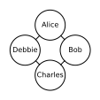

An idea is floating around and when, for example, Alice & Bob are hanging out, they may share the idea - they influence each other. We don't use a directed graph because the influence flows in both directions.

But how do you parametrize an undirected graph? We no longer have a notion of a conditional - that is, one variable conditioning another.

Well, we can just use factors:

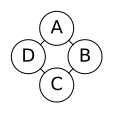

|          | $\phi_1 [A,B]$ |
|----------|----------------|
| $-a, -b$ | 30             |
| $-a, +b$ | 5              |
| $+a, -b$ | 1              |
| $+a, +b$ | 10             |

These factors are sometimes called __affinity functions__ or __compatibility functions__ or __soft constraints__.

What do these numbers mean?

They indicate the "_local happiness_" of the variables $A$ and $B$ to take a particular joint assignment. Here $A$ and $B$ are "happiest" when $-a, -b$.

We can define factors for the other edges as well:

|          | $\phi_2 [B,C]$ |
|----------|----------------|
| $-b, -c$ | 100            |
| $-b, +c$ | 1              |
| $+b, -c$ | 1              |
| $+b, +c$ | 100            |

|          | $\phi_3 [C,D]$ |
|----------|----------------|
| $-c, -d$ | 1              |
| $-c, +d$ | 100            |
| $+c, -d$ | 100            |
| $+c, +d$ | 1              |

|          | $\phi_4 [D,A]$ |
|----------|----------------|
| $-d, -a$ | 100            |
| $-d, +a$ | 1              |
| $+d, -a$ | 1              |
| $+d, +a$ | 100            |

Then we have:

$$
\tilde P(A,B,C,D) = \phi_1(A,B) \phi_2(B,C) \phi_3(C,D) \phi_4(A,D)
$$

This isn't a probability distribution because its numbers aren't in $[0,1]$ (hence the tilde over $P$, which indicates an unnormalized measure).

We can normalize it to get a probability distribution:

$$
P(A,B,C,D) = \frac{1}{Z} \tilde P(A,B,C,D)
$$

$Z$ is known as a __partition function__.

There unfortunately is no natural mapping from the pairwise factors and the marginal probabilities from the distribution they generate.

For instance, say we are given the marginal probabilities of $P_{\Phi} (A,B)$ (the $\Phi$ indicates the probability was computed using a set of factors $\Phi = \{\phi_1, \dots, \phi_n \}$):

| $A$  | $B$  | $P_{\Phi}(A,B)$ |
|------|------|-----------------|
| $-a$ | $-b$ | 0.13            |
| $-a$ | $+b$ | 0.69            |
| $+a$ | $-b$ | 0.14            |
| $+a$ | $+b$ | 0.04            |

|          | $\phi_1 [A,B]$ |
|----------|----------------|
| $-a, -b$ | 30             |
| $-a, +b$ | 5              |
| $+a, -b$ | 1              |
| $+a, +b$ | 10             |

The most likely joint assignment is $-a, +b$, which doesn't seem to correspond to the factor. This is a result of the other factors in the network.

This is unlike Bayesian networks where the nodes were just conditional probabilities.

Formally, a _pairwise Markov network_ is an undirected graph whose nodes are $X_1, \dots, X_n$ and each edge $X_i - X_j$ is associated with a factor (aka _potential_) $\phi_{ij}(X_i-X_j)$.

Pairwise Markov networks cannot represent all of the probability distributions we may be interested in. A pairwise Markov network with $n$ random variables, each with $d$ values, has $O(n^2 d^2)$ parameters. On the other hand, if we consider a probability distribution over $n$ random variables, each with $d$ values, it has $O(d^n)$ parameters, which is far greater than $O(n^2 d^2)$.

Thus we generalize beyond pairwise Markov networks.

### Gibbs distribution

A __Gibbs distribution__ is parameterized by a set of general factors $\Phi = \{\phi_1 (D_1), \dots, \phi_k(D_k) \}$ which can have a scope of $\geq 2$ variables (whereas pairwise Markov networks were limited to two variable scopes). As a result, this can express any probability distribution because we can just define a factor over all the random variables.

We also have:

$$
\begin{aligned}
\tilde P_{\Phi} (X_1, \dots, X_n) &= \prod_{i=1}^k \phi_i (D_i) \\
Z_{\Phi} &= \sum_{X_1, \dots, X_n} \tilde P_{\Phi} (X_1, \dots, X_n)
\end{aligned}
$$

Where $Z_{\Phi}$ is the partition function, i.e. the normalizing constant.

Thus we have:

$$
P_{\Phi} (X_1, \dots, X_n) = \frac{1}{Z_{\Phi}} \tilde P_{\Phi} (X_1, \dots, X_n)
$$

We can generate an __induced Markov network__ $H_{\Phi}$ from a set of factors $\Phi$. For each factor in the set, we connect any variables which are in the same scope.

For example, $\phi_1(A,B,C), \phi_2(B,C,D)$ leads to:

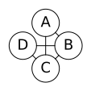

So multiple set of factors can induce the same graph. We can go from a set of factors to a graph, but we can't go the other way.

We say a probability distribution $P$ factorizes over a Markov network $H$ if there exists a set of factors $\Phi$ such that $P = P_{\Phi}$ and $h$ is the induced graph for $\Phi$.

We have __active trails__ in Markov networks as well: a trail $X_1 - \dots - X_n$ is active given the set of observed variables $Z$ if no $X_i$ is in $Z$.

### Conditional Random Fields

A commonly-used variant of Markov networks is __conditional random fields__ (CRFs).

This kind of model is used to deal with _task-specific prediction_, where we have a set of input/observed variables $X$ and a set of target variables $Y$ that we are trying to predict.

Using the graphical models we have seen so far is not the best because we don't want to model $P(X,Y)$ - we are already given $X$. Instead, we just want to model $P(Y|X)$. That way we don't have to worry about how features of $X$ are correlated or independent, and we don't have to model their distributions.

In this scenario, we can use a _conditional random field_ representation:

$$
\begin{aligned}
\Phi &= \{\phi_1(D_1), \dots, \phi_k (D_k)\} \\
\tilde P_{\Phi}(X,Y) &= \prod_{i=1}^k \phi_i (D_i)
\end{aligned}
$$

This looks just like a Gibbs distribution. The difference is in the partition function:

$$
Z_{\Phi}(X) = \sum_Y \tilde P_{\Phi}(X,Y)
$$

So a CRF is parameterized the same as a Gibbs distribution, but it is normalized differently.

The end result is:

$$
P_{\Phi}(Y|X) = \frac{1}{Z_{\Phi}(X)} \tilde P_{\Phi}(X,Y)
$$

Which is a family of conditional distributions, one for each possible value of $X$.

In a Markov network, we have the concept of __separation__, which is like d-separation in Bayesian networks but we drop the "d" because they are not directed.

$X$ and $Y$ are separated in $H$ given observed evidence $Z$ if there is no active trail in $H$ (that is, no node along the trail is in $Z$).

For example:

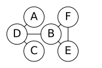

We can separate $A$ and $E$ in a few ways:

- $A$ and $E$ are separated given $B$ and $D$
- $A$ and $E$ are separated given $D$
- $A$ and $E$ are separated given $B$ and $C$

Like with Bayesian networks, we have a theorem: if $P$ factorizes over $H$ and $\text{sep}_H (X,Y|Z)$, then $P$ satisfies $(X \perp Y|Z)$.

We can say the independences induced by the graph $H$, $I(H)$, is:

$$
I(H) = \{(X \perp Y|Z) | \text{sep}_H (X,Y|Z) \}
$$

If $P$ satisfies $I(H)$, we say that $H$ is an I-map (independency map) of $P$ (this is similar to I-maps in the context of Bayesian networks).

We can also say that if $P$ factorizes over $H$, then $H$ is an I-map of $P$.

The converse is also true: for a positive distribution $P$, if $H$ is an I-map for $P$, then $P$ factorizes over $H$.

If a graph $G$ is an I-map of $P$, it does not necessarily need to encode all independences of $P$, just those that it does encode are in fact in $P$.

How well can we capture a distribution $P$'s independences in a graphical model?

We can denote all independences that hold in $P$ as:

$$
I(P) = \{(X \perp Y|Z) | P \vDash (X \perp Y|Z)\}
$$

We know that if $P$ factorizes over $G$, then $G$ is an I-map for $P$:

$$
I(G) \subseteq I(P)
$$

The converse doesn't hold; $P$ may have some independences not in $G$.

We want graphs which encode more independences because they are sparser (less parameters) and more informative.

So for sparsity, we want a __minimal I-map__; that is, an I-map without redundant edges. But it is still not sufficient for capturing $I(P)$.

Ideally, we want a __perfect map__, which is an I-map such that $I(G) = I(P)$. Unfortunately, not ever distribution has a perfect map, although sometimes a distribution may have a perfect map as a Markov network and not as a Bayesian network, and vice versa.

It is possible that a perfect map for a distribution is not unique; that is, there may be other graphs which model the same set of independence assumptions and thus are also perfect maps.

When graphs model the same independence assumptions, we say they are __I-equivalent__. Most graphs have many I-equivalent variants.

### Log-linear models

Log-linear models allow us to incorporate local structure into undirected models.

In the original representation of unnormalized density, we had:

$$
\tilde P = \prod_i \phi_i(D_i)
$$

We turn this into a linear form:

$$
\tilde P = \exp(- \sum_j w_j f_j(D_j))
$$

Hence the name "log-linear", because the log is a linear function.

Each feature $f_j$ has a scope $D_j$. Different features can have the same scope.

We can further write it in the form:

$$
\tilde P = \prod_j \exp(-w_j f_j(D_j))
$$

which effectively turns the $\exp(-w_j f_j(D_j))$ term into a factor with one parameter $w_j$.

For example, say we have binary variables $X_1$ and $X_2$:

$$
\phi(X_1,X_2) = \begin{bmatrix}
a_{00} & a_{01} \\
a_{10} & a_{11}
\end{bmatrix}
$$

We must define the following features using indicator functions (1 if true, else 0):

$$
\begin{aligned}
f_{12}^{00} &= \mathbb{1} \{X_1=0, X_2=0\} \\
f_{12}^{01} &= \mathbb{1} \{X_1=0, X_2=1\} \\
f_{12}^{10} &= \mathbb{1} \{X_1=1, X_2=0\} \\
f_{12}^{11} &= \mathbb{1} \{X_1=1, X_2=1\}
\end{aligned}
$$

So we have the log-linear model:

$$
\phi(X_1, X_2) = \exp(- \sum_{kl} w_{kl} f_{ij}^{kl} (X_1, X_2))
$$

So we can represent any factor as a log-linear model by including the appropriate features.

For example, say you want to develop a language model for labeling entities in text.

You have target labels $Y = \{\text{PERSON}, \text{LOCATION}, \dots\}$ and input words $X$.

You could, for instance, have the following features:

$$
\begin{aligned}
f(Y_i, X_i) &= \mathbb{1} \{Y_i=\text{PERSON}, X_i \text{ is capitalized}\} \\
f(Y_i, X_i) &= \mathbb{1} \{Y_i=\text{LOCATION}, X_i \text{ appears in an atlas}\}
\end{aligned}
$$

and so on.

## References

- _Bayesian Reasoning and Machine Learning_. David Barber.
- [Probabilistic Graphical Models](https://www.coursera.org/course/pgm). Daphne Koller. Stanford University/Coursera.
- [MIT 6.034 (Fall 2010): Artificial Intelligence](http://ocw.mit.edu/courses/electrical-engineering-and-computer-science/6-034-artificial-intelligence-fall-2010/). Patrick H. Winston. MIT.
- [CS188: Artificial Intelligence](https://www.edx.org/course/artificial-intelligence-uc-berkeleyx-cs188-1x). Dan Klein, Pieter Abbeel. University of California, Berkeley (edX).
- [Artificial Intelligence Planning](https://www.coursera.org/course/aiplan). Dr. Gerhard Wickler, Prof. Austin Tate. The University of Edinburgh (Coursera). 2015.
- [Intro to Artificial Intelligence](https://www.udacity.com/course/intro-to-artificial-intelligence--cs271). CS271. Peter Norvig, Sebastian Thrun. Udacity.
