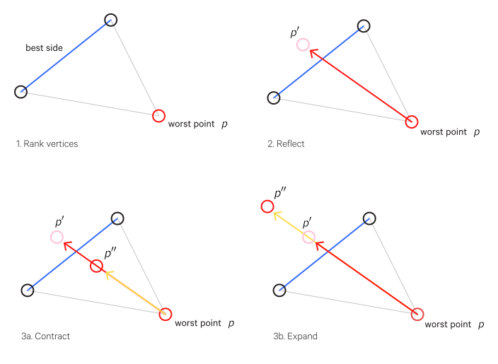

$$
\def\argmax{\operatorname*{argmax}}
\def\argmin{\operatorname*{argmin}}
$$

# Optimization

Optimization is the task of finding the arguments to a function which yield its minimum or maximum value. An optimal argument is denoted with an asterisk, e.g. $x^{\*}$.

In the context of machine learning, we are typically dealing with minimization. If necessary, a maximization problem can be reframed as minimization: to maximize a function $f(x)$, you can instead minimize $-f(x)$.

The function we want to optimize is called the __objective function__. When the particular optimization is minimization, the function may also be referred to as a __cost__, __loss__, or __error__ function.

Optimization problems can be thought of a topology where you are looking for the global peak (if you are maximizing) or the globally lowest point (if you are minimizing). For simplicity, minimizing will be the assumed goal here, as you are often trying to minimize some error function.

Consider a very naive approach: a greedy random algorithm which starts at some position in this topology, then randomly tries moving to a new position and checks if it is better. If it is, it sets that as the current solution. It continues until it has some reason to stop, usually because it has found a minimum. This is a __local minimum__; that is, it is a minimum relative to its immediately surrounding points, but it is not necessarily the __global minimum__, which is the minimum of the entire function.

This algorithm is _greedy_ in that it will always prefer a better scoring position, even if it is only marginally better. Thus it can be easy to get stuck in local optima - since any step away from it seems worse, even if the global optimum is right around the corner, so to speak.

Optimization may be accomplished __numerically__ or __analytically__. The analytic approach involves computing derivatives and then identifying critical points (e.g. the second derivative test). These provide the exact optima.

However, this analytic approach is infeasible for many functions. In such cases we resort to numerical optimization, which involves, in a sense, guessing your way to the optima. The methods covered here are all numerical optimization methods.

Within optimization there are certain special cases:

### Convex optimization

As far as optimization goes, convex optimization is easier to deal with - convex functions have only global minima (any local minimum is a global minimum) without any saddle points.

### Constrained optimization

In optimization we are typically looking to find the optimum across _all_ points. However, we may only be interested in finding the optimum across a subset $S$ of these points - in this case, we have a __constrained optimization__ problem. The points that are in $S$ are called __feasible__ points.

One method for constrained optimization is the __Karush-Kuhn-Tucker__ (KKT) method.

It uses the __generalized Lagrangian__ (sometimes called the generalized Lagrange function).

We must describe $S$ as equations and inequalities; in particular, with $m$ functions $g_i$, called _equality constraints_, and $n$ functions $h_j$, called _inequality constraints_, such that $S = \{\mathbf x | \forall i, g_i(\mathbf x) = 0 \text{and} \forall_j, h_j (\mathbf x) \leq 0 \}$.

For each constraint we also have the variables $\lambda_i, \alpha_i$, called _KKT multipliers_.

Then we can define the generalized Lagrangian as:

$$
L(\mathbf x, \mathbf \lambda, \mathbf \alpha) = f(\mathbf x) + \sigma_i \lambda_i g_i(\mathbf x) + \sigma_j \alpha_j h_j(\mathbf x)
$$

This reframes the constrained minimization problem as an unconstrained optimization of the generalized Lagrangian.

That is, so long as at least one feasible point exists and $f(\mathbf x)$ cannot be $\infty$, then

$$
\min_{\mathbf x} \max_{\mathbf \lambda} \max_{\mathbf \alpha, \mathbf \alpha \geq 0} L(\mathbf x, \mathbf \lambda, \mathbf \alpha)
$$

has the same objective function value and set of optimal points as $\min_{\mathbf x \in S} f(\mathbf x)$.

So long as the constraints are satisfied,

$$
\max_{\mathbf \lambda} \max_{\mathbf \alpha, \mathbf \alpha \geq 0} L(\mathbf x, \mathbf \lambda, \mathbf \alpha) = f(\mathbf x)
$$

and if a constraint is violated, then

$$
\max_{\mathbf \lambda} \max_{\mathbf \alpha, \mathbf \alpha \geq 0} L(\mathbf x, \mathbf \lambda, \mathbf \alpha) = \infty
$$

## Gradient vs non-gradient methods

Broadly we can categorize optimization methods into those that use gradients and those that do not:

Non-gradient methods include:

- hill climbing
- simplex/amoeba/Nelder Mead
- genetic algorithms

Gradient methods include:

- gradient descent
- conjugate gradient
- quasi-newton

Gradient methods tend to be more efficient, but are not always possible to use (you don't always have the gradient).

## Gradient Descent

__Gradient descent__ (GD) is perhaps the common minimizing optimization (for maximizing, its equivalent is _gradient ascent_) in machine learning.

Say we have a function $C(v)$ which we want to minimize. For simplicity, we will use $v \in \mathbb R^2$. An example $C(v)$ is visualized in the accompanying figure.

In this example, the global minimum is visually obvious, but most of the time it is not (especially when dealing with far more dimensions). But we can apply the model of a ball rolling down a hill and expand it to any arbitrary $n$ dimensions. The ball will "roll" down to a minimum, though not necessarily the global minimum.

The position the ball is at is a potential solution; here it is some values for $v_1$ and $v_2$. We want to move the ball such that $\Delta C$, the change in $C(v)$ from the ball's previous position to the new position, is negative (i.e. the cost function's output is smaller, since we're minimizing).

More formally, $\Delta C$ is defined as:

$$
\begin{aligned}
  \Delta C \approx \frac{\partial C}{\partial v_1} \Delta v_1 +
  \frac{\partial C}{\partial v_2} \Delta v_2
\end{aligned}
$$

We define the _gradient_ of $C$, denoted $\nabla C$, to be the vector of partial derivatives (transposed to be a column vector):

$$
\begin{aligned}
  \nabla C \equiv \left( \frac{\partial C}{\partial v_1},
  \frac{\partial C}{\partial v_2} \right)^T
\end{aligned}
$$

So we can rewrite $\Delta C$ as:

$$
\begin{aligned}
  \Delta C \approx \nabla C \cdot \Delta v.
\end{aligned}
$$

We can choose $\Delta v$ to make $\Delta C$ negative:

$$
\begin{aligned}
  \Delta v = -\eta \nabla C,
\end{aligned}
$$

Where $\eta$ is a small, positive parameter (the __learning rate__), which controls the step size.

Finally we have:

$$
\Delta C \approx
-\eta \nabla C \cdot \nabla C = -\eta \|\nabla C\|^2
$$

We can use this to compute a value for $\Delta v$, which is really the change in position for our "ball" to a new position $v'$:

$$
\begin{aligned}
  v \rightarrow v' = v -\eta \nabla C.
\end{aligned}
$$

And repeat until we hit a global (or local) minimum.

This process is known in particular as __batch gradient descent__ because each step is computed over the entire _batch_ of data.

### Stochastic gradient descent (SGD)

With batch gradient descent, the cost function is evaluated on all the training inputs for each step. This can be quite slow.

With __stochastic gradient descent__ (SGD), you randomly shuffle your examples and look at only one example for each iteration of gradient descent (sometimes this is called _online_ gradient descent to contrast with minibatch gradient descent, described below). Ultimately it is less direct than batch gradient descent but gets you close to the global minimum - the main advantage is that you're not iterating over your entire training set for each step, so though its path is more wandering, it ends up taking less time on large datasets.

The reason we randomly shuffle examples is to avoid "forgetting". For instance, say you have time series data where there are somewhat different patterns later in the data than earlier on. If that training data is presented in sequence, the algorithm will "forget" the patterns earlier on in favor of those it encounters later on (since the parameter updates learned from the later-on data will effectively erase the updates from the earlier-on data).

In fact, stochastic gradient descent can help with finding the global minimum because instead of computing over a single error surface, you are working with many different error surfaces varying with the example you are current looking at. So it is possible that in one of these surfaces a local minima does not exist or is less pronounced than in others, which make it easier to surpass.

There's another form of stochastic gradient descent called __minibatch gradient descent__. Here $b$ random examples are used for each iteration, where $b$ is your minibatch size. It is usually in the range of 2-100; a typical choice might be 10 (minibatch gradient descent where $b=1$ is just regular SGD). Note that a minibatch size can be _too_ large, resulting in greater time for convergence. But generally it is faster than SGD and has the benefit of aiding in local minima avoidance.

Minibatches also need to be properly representative of the overall dataset (e.g. be balanced for classes).

When the stochastic variant is used, a $\frac{1}{b}$ term is sometimes included:

$$
\begin{aligned}
  v \rightarrow v' = v -\frac{\eta}{b} \nabla C.
\end{aligned}
$$

### Epochs vs iterations

An important point of clarification: an "epoch" and a training "iteration" are not necessarily the same thing.

One training iteration is one step of your optimization algorithm (i.e. one update pass). In the case of something like minibatch gradient descent, one training iteration will only look at one batch of examples.

An epoch, on the other hand, consists of enough training iterations to look at all your training examples.

So if you have a total of 1000 training examples and a batch size of 100, one epoch will consist of 10 training iterations.

### Learning rates

The learning rate $\eta$ is typically held constant. It can be slowly decreased it over time if you want $\theta$ to converge on the global minimum in stochastic gradient descent (otherwise, it just gets close). So for instance, you can divide it by the iteration number plus some constant, but this can be overkill.

### Conditioning

__Conditioning__ describes how much the output of a function varies with small changes in input.

In particular, if we have a function $f(x) = A^{-1}x, A \in R^{n \times n}$, where $A$ has an eigenvalue decomposition, we can compute its __condition number__ as follows:

$$
\max_{i,j} |\frac{\lambda_i}{\lambda_j}|
$$

Which is the ratio of the magnitude of the largest and smallest eigenvalue; when this is large, we say we have a _poorly conditioned_ matrix since it is overly sensitive to small changes in input. This has the practical implications of slow convergence.

In the context of gradient descent, if the Hessian is poorly conditioned, then gradient descent does not perform as well. This can be alleviated with __Newton's method__, where a Taylor series expansion is used to approximate $f(x)$ near some point $x_0$, going up to only the second-order derivatives:

$$
f(x) \approx f(x_0) + (x-x_0)^T \nabla x f(x_0) + \frac{1}{2}(x - x_0)^T H(f)(x_0)(x - x_0)
$$

Solving for the critical point gives:

$$
x^{\*} = x_0 - H(f)(x_0)^{-1}\nabla_x f(x_0)
$$

(As a reminder, $H(f)$ is the Hessian of $f$)

Such methods which also use second-order derivatives (i.e. the Hessian) are known as _second-order optimization algorithms_; those that use only the gradient are called _first-order_ optimization algorithms.

## Simulated Annealing

__Simulated annealing__ is similar to the greedy random approach but it has some randomness which can "shake" it out of local optima.

Annealing is a process in metal working where the metal starts at a very high temperature and gradually cools down. Simulated annealing uses a similar process to manage its randomness.

A simulated annealing algorithm starts with a high "_temperature_" (or "energy") which "cools" down (becomes less extreme) as progress is made.
Like the greedy random approach, the algorithm tries a random move. If the move is better, it is accepted as the new position. If the move is worse, then there is a chance it still may be accepted; the probability of this is based on the current temperature, the current error, and the previous error:

$$
P(e, e', T) = \exp(\frac{-(e'-e)}{T})
$$

Each random move, whether accepted or not, is considered an iteration. After each iteration, the temperature is decreased according to a _cooling schedule_. An example cooling schedule is:

$$
T(k) = T_{\text{init}} \frac{T_{\text{final}}}{T_{\text{init}}}^{\frac{k}{k_{\max}}}
$$

where

- $T_{\text{init}}$ = the starting temperature
- $T_{\text{final}}$ = the minimum/ending temperature
- $k$ = the current iteration
- $k_{\max}$ = the maximum number of iterations

For this particular schedule, you probably don't want to set $T_{\text{final}}$ to 0 since otherwise it would rapidly decrease to 0. Set it something close to 0 instead.

The algorithm terminates when the temperature is at its minimum.

## Nelder-Mead (aka Simplex or Amoeba optimization)

For a problem of $n$ dimensions, create a shape of $n+1$ vertices. This shape is a __simplex__.

One vertex of the simplex is initialized with your best educated guess of the solution vector. That guess could be the output of some other optimization approach, even a previous Nelder-Mead run. If you have nothing to start with, a random vector can be used.

The other $n$ vertices are created by moving in one of the $n$ dimensions by some set amount.

Then at each step of the algorithm, you want to (illustrations are for $n=2$, thus $3$ vertices):

- Find the worst, second worst, and best scoring vertices
- Reflect the worst vertex to some point $p'$ through the best side
- If $p'$ is better, _expand_ by setting the worst vertex to a new point $p''$, a bit further than $p'$ but in the same direction
- If $p'$ is worse, then _contract_ by setting the worst vertex to a new point $p''$, in the same direction as $p'$ but before crossing the best side

The algorithm terminates when one of the following occurs:

- The maximum number of iterations is reached
- The score is "good enough"
- The vertices have become close enough together

Then the best vertex is considered the solution.

This optimization method is very sensitive to how it is initialized; whether or not a good solution is found depends a great deal on its starting points.

## Particle Swarm Optimization

__Particle swarm optimization__ is similar to Nelder-Mead, but instead of three points, many more points are used. These points are called "particles".

Each particle has a position (a potential solution) and a velocity which indicates where the particle moves to in the next iteration. Particles also keep track of their current error to the training examples and its best position so far.

Globally, we also track the best position overall and the lowest error overall.

The velocity for each particle is computed according to:

- it's inertia (i.e. the current direction it is moving in)
- it's historic best position (i.e. the best position it's found so far)
- the global best position

The influence of these components are:

- inertia weight
- cognitive weight (for historic best position)
- social weight (for global best position)

These weights are parameters that must be tuned, but this method is quite robust to them (that is, they are not sensitive to these changes so you don't have to worry too much about getting them just right).

More particles are better, of course, but more intensive.

You can specify the number of epochs to run.

You can also incorporate a death-birth cycle in which low-performing particles (those that seem to be stuck, for instance) get destroyed and a new randomly-placed particle is initialized in its place.

## Evolutionary Algorithms

Evolutionary algorithms are a type of algorithm which uses concepts from evolution - e.g. individuals, populations, fitness, reproduction, mutation - to search a solution space.

### Genetic Algorithms

Genetic algorithms are the most common class of evolutionary algorithms.

- You have a _population_ of "__chromosomes__" (e.g. possible solutions or parameters, which are also called "_object variables_"). These chromosomes are interchangeably referred to as "_individuals_"
- There may be some __mutation__ in the chromosomes (e.g. with binary chromosomes, sometimes 0s become 1s and vice versa or with continuous values, changes happen according to some step size)
- Parents have children, in which their chromosomes __crossover__ - the front part of one chromosome combines with the back part of another. This is also called _recombination_.
- The __genotype__ (the chromosome composition) is expressed as some __phenotype__ (i.e. some genetically-determined properties) in some individuals
- Then each of these individuals has some __fitness__ value resulting from their phenotypes
- These fitnesses are turned into some probability of __survival__ (this _selection pressure_ is what pushes the system towards an optimal individual)
- Then the individuals are _selected_ randomly based on their survival probabilities
- These individuals form the new chromosome population for the next __generation__

Each of these steps requires some decisions by the implementer.

For instance, how do you translate a fitness score into a survival probability?

Well, the simplest way is:

$$
P_i = \frac{f_i}{\sum_i f_i}
$$

Where $f_i$ is the fitness of some individual $i$.

However, depending on how you calculate fitness, this may not be appropriate.

You could alternatively use a ranking method, in which you just look at the relative fitness rankings and not their actual values. So the most fit individual is most likely to survive, the second fit is a bit less likely, and so on.

You pick a probability constant $P_C$, and the survival of the top-ranked individual is $P_C$, that of the second is $(1-P_C)P_C$, that of the third is, $(1-P_C)^2 P_C$, and so on. So $P_{n-1} = (1-P_C)^{n-2}P_C$ and $P_n = (1-P_C)^{n-1}$.

If you get stuck on local maxima you can try increasing the step size. When your populations start to get close to the desired value, you can decrease the step size so the changes are less sporadic (i.e. use simulated annealing).

When selecting a new population, you can incorporate a diversity rank in addition to a fitness rank. This diversity ranking tries to maximize the diversity of the new population. You select one individual for the new population, and then as you select your next individual, you try and find one which is distinct from the already selected individuals.

The general algorithm is as follows:

1. randomly initialize a population of $\mu$ individuals
2. compute fitness scores for each individual
3. randomly choose $\frac{\mu}{2}$ pairs of parents, weighted by fitness (see above for an example), to reproduce
4. with probability $P_c$ (a hyperparameter, e.g. 0.8), perform crossover on the parents to form two children, which replaces the old population (you may also choose the keep some of the old population, rather than having two children per pair of parents, as per above - there is no universal genetic algorithm; you typically need to adjust it for a particular task)
5. randomly apply mutation to some of the population with probability $P_m$ (a hyperparameter, e.g. 0.01)
6. repeat

The specifics of how crossover and mutation work depend on your particular problem.

### Evolution Strategies

With _evolution strategies_, each individual includes not only object variables but also "strategy" parameters which, which are variances and covariances (optional) of the object variables. These strategy parameters control mutation.

From each population of size $\mu$, $\lambda$ offspring are generated (e.g. $\lambda = 7\mu$).

All of the object variables, as with genetic algorithms, are derived from the same parents, though each strategy parameter may be derived from a different pair of parents, selected at random (without any selection pressure). However, the best approach is to copy an object variable from one of the parents and set each strategy parameter to be the mean of its parents' corresponding strategy parameter.

Then mutation mutates both the strategy parameters and the object variables, starting with the strategy parameters. The mutation of the strategy parameters is called _self-adaptation_. The object variables are mutated according to the probability distribution specified by the (mutated) strategy parameters.

There are two approaches to selection for evolutionary strategy:

- _$(\mu, \lambda)$ selection_ just involves taking the best $\mu$ individuals from the $\lambda$ offspring.
- _$(\mu + \lambda)$ selection_ involves selecting the best $\mu$ individuals from the union of the $\lambda$ offspring and the $\mu$ parents.

$(\mu, \lambda)$ selection is recommended because $(\mu + \lambda)$ selection can interfere with self-adaptation.

### Evolutionary Programming

_Evolutionary programming_ does not include recombination; changes to individuals rely solely on mutation. Mutations are based on a Gaussian distribution, where the standard deviation is the square root of a linear transform (parametrized according to the user) of the parent's fitness score. Each of the $\mu$ parents yields one offspring.

Note that in _meta-evolutionary programming_, the variances are also part of the individual, i.e. subject to mutation (this is self-adaptation).

The next generation is selected from the union of the parents and the offspring via a process called _$q$-tournament selection_. Each candidate is paired with $q$ (a hyperparameter) randomly selected opponents and receives a score which is the number of these $q$ opponents that have a worse fitness score than the candidate. The top-scoring $\mu$ candidates are kept as the new generation.

Increasing $q$ causes the selection pressure to be both higher and more deterministic.

## Derivative-Free Optimization

Note that Nelder-Mead, Particle Swarm, and genetic algorithm optimization methods are sometimes known as "derivative-free" because they do not involve computing derivatives in order to optimize.

## Hessian optimization

Also known as the "Hessian technique".

Given a function $f(X)$, where $X = [x_1, x_2, \dots, x_n]$, we can approximate $f$ near a point $X$ using Taylor's theorem:

$$
\begin{aligned}
f(X + \Delta X) &= f(X) + \sum_j \frac{\partial f}{\partial X_j} \Delta X_j + \frac{1}{2} \sum_{jk} \Delta X_j \frac{\partial^2 f}{\partial X_j \partial X_k} \Delta X_k + \dots \\
&= f(X) + \nabla f \cdot \Delta X + \frac{1}{2} \Delta X^T H \Delta X + \dots
\end{aligned}
$$

Where $H$ is the Hessian matrix (the $jk$th entry is $\frac{\partial^2 f}{\partial X_j \partial X_k}$).

We can approximate $f$ by dropping the higher-order terms (the ellipsis, $\dots$, terms):

$$
f(X + \Delta X) \approx f(X) + \nabla f \cdot \Delta X + \frac{1}{2} \Delta X^T H \Delta X
$$

Assuming the Hessian matrix is positive definite, we can show using calculus that the right-hand expression can be minimized to:

$$
\Delta X = -H^{-1} \nabla f
$$

If $f$ is a cost function $C$ and $X$ are the parameters $\theta$ to the cost function, we can minimize the cost by updating $\theta$ according to the following algorithm (where $\eta$ is the _learning rate_):

- Initialize $\theta$.
- Update $\theta$ to $\theta' = \theta -\eta H^{-1} \nabla C$, computing $H$ and $\nabla C$ at $\theta$.
- Update $\theta'$ to $\theta'' = \theta - \eta H'^{-1} \nabla' C$, computing $H'$ and $\nabla' C$ at $\theta'$.
- And so on.

The second derivatives in the Hessian tells us how the gradient is changing, which provides some advantages (such as convergence speed) over traditional gradient descent.

The Hessian matrix has $n^2$ elements, where $n$ is the number of parameters, so it can be extremely large. In practice, computing the Hessian can be quite difficult.

## Advanced optimization algorithms

There are other advanced optimization algorithms, such as:

- Conjugate gradient
- BFGS
- L-BFGS

These shouldn't be implemented on your own since they require an advanced understanding of numerical computing, even just to understand what they're doing.

They are more complex, but (in the context of machine learning) there's no need to manually pick a learning rate $\alpha$ and they are often faster than gradient descent. So you can take advantage of them via some library which has them implemented (though some implementations are better than others).

## References

- [Swarm Intelligence Optimization using Python](https://www.youtube.com/watch?v=bVDX_UwthZI). James McCaffrey. PyData 2015.
- [Machine Learning](https://www.coursera.org/learn/machine-learning). 2014. Andrew Ng. Stanford University/Coursera.
- [Neural Networks and Deep Learning](http://neuralnetworksanddeeplearning.com), Michael A Nielsen. Determination Press, 2015.
- [Deep Learning](http://www-labs.iro.umontreal.ca/~bengioy/dlbook/). Yoshua Bengio, Ian Goodfellow, Aaron Courville.
- [Genetic and Evolutionary Algorithms](http://www.wiley.com/legacy/wileychi/ecc/samples/sample10.pdf). Gareth Jones.
- [Advanced Topics: Reinforcement Learning, Lecture 7](https://www.youtube.com/watch?v=KHZVXao4qXs&index=7&list=PL5X3mDkKaJrL42i_jhE4N-p6E2Ol62Ofa). David Silver.
- [An Interactive Tutorial on Numerical Optimization](http://www.benfrederickson.com/numerical-optimization/). Ben Frederickson.

