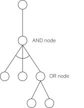
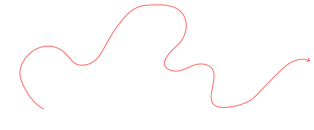
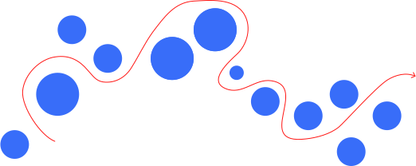
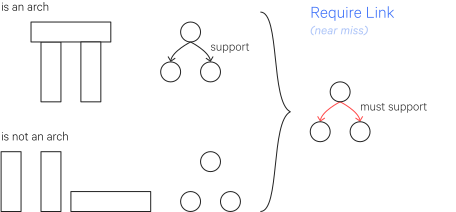
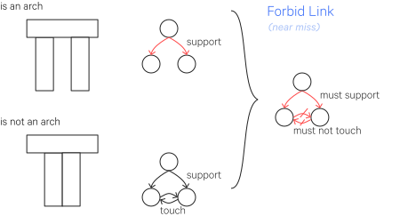
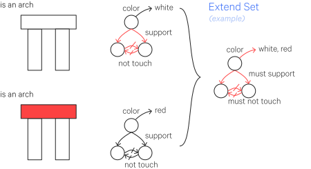
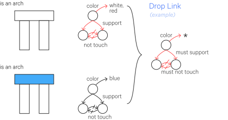
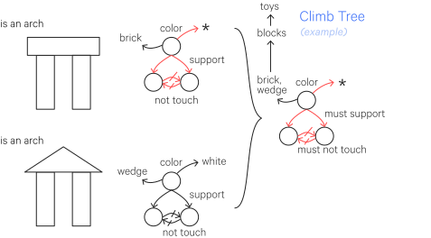
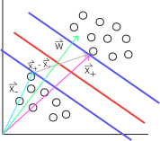

# Artificial Intelligence

My notes from MIT 6.034 (Fall 2010): Artificial Intelligence, taught by Patrick H. Winston.

---

## Introduction

### AI is about:

> algorithms enabled by
> constraints exposed by
> representations that support
> models targeted at
> thinking and perception and action
> tied together in loops.

Questions to ask:
How to best represent a problem? How to to model systems to solve problems, explain the past, and predict the future?

AI is not purely about reasoning. Perception, language, etc are also important for problem solving.

Example: How many African countries does the equator cross?

Without prior knowledge, you can't purely reason your way to the correct answer. But upon seeing a map, the answer is immediately clear.

Imagination is crucial to problem solving as well. With imagination you are able to simulate events which may not have ever happened or may never have experienced and may not even be possible. All by integrating existing knowledge in different ways.

### The Rumpelstiltskin Principle

The "_Generate & Test_" method is a problem solving method where you:

1. Generate some potential solutions
2. Test the solutions and see which one is correct

It's very simple - what's important is that this method, which was previously intuitive and thus likely not given much thought - now has a _name_, which allows us to talk about it.

Giving something a name gives you some power over it in that now you can examine and discuss it. This is the _Rumpelstiltskin Principle_.

### "Simple" =/= "Trivial"

"Trivial" implies that something is simple _and_ of little worth or interest.

Just because something is simple does not mean it is not powerful. Often the opposite, in fact.

---

## Reasoning - Goal Trees and Problem Solving

Problem reduction has other names: "and/or tree" or "goal tree".
It refers to decomposing a problem into simpler problems, which can be represented as a goal tree, which details the possible paths to solving the original problem. In addition regular nodes, nodes in the tree can be "and", where all branches must solved, or "or" nodes, where only one of the branches needs to be solved.

You need some method for picking a branch at or nodes, but regardless of the method, it is possible that the selected branch leads to a dead end and that one of the alternative paths should be attempted.

Problems can be reduced via "safe" transformations, which reliably lead to the true solution, or by "heuristic" transformations, which are approximations which do not necessarily lead to the true solution. But sometimes they are necessary for reducing the problem further. A system using this approach requires *knowledge* about what transformations are available.

---

## Goal Trees and Rule-Based "Expert" Systems

### A block-moving program

A block-moving program was demoed, which was able to arrange blocks on a table according to a desired state specified by the user. It generates apparently complex behavior using a few simple rules and procedures along with recursion. It is even capable of stating the reasons behind its actions - answering questions like "why did you move block B1 on top of B2?" or "how did you clear the top of block B3?" - this apparent reasoning is also a result of these simple rules.

For example, say we have the current state:

     ______   ______
    |      | |      |
    |  BX  | |  BY  |
    |______| |______|
    |      | |      |
    |  B1  | |  B2  |
    |______|_|______|___________________________

We want the program to place block B1 onto B2.

This problem can be reduced to a simpler set, which then forms the solution procedure.

For example:

- Move B1 on top of B2.
    - Pick up B1.
        - Clear the top of B1.
            - Find space to place BX.
            - Pick up BX.
            - Place BX on the empty space.
    - Place B1 on top of B2.
        - Clear the top of B2.
            - Find space to place BY.
            - Pick up BY.
            - Place BY on the empty space.

This is a goal tree (in particular, an "and tree", since all branches must be completed).

The program can answer "why" questions by moving up the tree: "Why did you clear the top of B1?", with the answer "So I could pick up B1."
It can answer "how" questions by moving down the tree: "How did you pick up B1?", with the answer "By clearing the top of B1."

### Herb Simon's Ant

Imagine you look at the path of an ant.

It looks complex. You may attribute that complexity to the ant.

But when you look closer, you see the ant is just avoiding pebbles on the beach.

The apparent complexity of the behaviour is a consequence of the complexity of the environment.

That is,

$$
complexity(behavior) = max(complexity(program), complexity(environment))
$$

or

$$
complexity(behavior) = max(complexity(program), complexity(problem))
$$

### Rule-based "expert" systems

Around the mid 1980's, rule-based "expert" systems emerged, spurred by interest in commercial applications of AI.

The general approach is about encapsulating knowledge into simple rules (i.e. if-this-then-that).

"Expert" is in quotes because it is more of a marketing term - it can't really be said that these systems are experts in the same way we'd call a human an expert.

There are two main systems, both of which are _deductive_. That is, they work with facts to produce new facts by proving them.

#### Forward-Chaining rule-based expert systems

This uses rules (facts) to get to some conclusion, which can be represented as a goal tree.

For example, if we have an expert system for identifying animals, given some features we may ask "what animal is this?".

Note: $Rn$ denotes rule $n$. Also notice there are some "and" nodes.

#### Backward-chaining rule-based expert systems

This is similar to forward-chaining, but moves backwards from a hypothesis and proves it via facts.

For example, if again we have an expert system for identifying animals, given an animal we may ask, "is this a cheetah?"

#### Knowledge engineering

The selection and extraction of knowledge from human experts, and their subsequent representation as rules in the system, is known as _knowledge engineering_.

There are a few heuristics regarding knowledge engineering:

- Look at specific cases and try to generalize to rules.
- Ask about things which appear the same but are handled differently. You may learn new distinctions and expand your domain vocabulary.
- Build the system and see where it fails - you're missing a rule for that case!

Knowledge engineering is relevant to _human_ learning as well! That is, those heuristics can help you become a better learner in general.

---

## Search: Depth-First, Hill Climbing, Beam

Consider the following search space, where $S$ is our starting point and $G$ is our goal:

You can illustrate paths in your search problem using a tree.

### "British Museum" search

Exhaustively search all paths (without revisiting any previously visited points).

### Depth-First Search

Go down the left branch of the tree (by convention) until you can't go any further.

If that is not your target, then _backtrack_ - go up to the closest branching node and take the other leftmost path.

Repeat until you reach your target.

It stops just on the first complete path, which may not be the optimal path.

Another way to think about depth-first search is with a _queue_ which holds your candidate paths as you construct them.

Your starting "path" includes just the starting point:

$$
[(S)]
$$

Then on each iteration, you take the left-most path (which is always the first in the queue) and check if it reaches your goal.

If it does not, you extend it to build new paths, and replace it with those new paths.

$$
[(SA),(SB)]
$$

On this next iteration, you again take the left-most path. It still does not reach your goal, so you extend it. And so on:

$$
\begin{aligned}
[(SAB),(SAD),(SB)] \\
[(SABC),(SAD),(SB)] \\
[(SABCE),(SAD),(SB)]
\end{aligned}
$$

You can no longer extend the left-most path, so just remove it from the queue.

$$
[(SAD),(SB)]
$$

Then keep going.

### Breadth-First Search

Build out the tree level-by-level until you reach your target.

In the queue representation, the only thing that is different from depth-first is that instead of placing new paths at the front of the queue, you place them at the back.

#### Breadth-first with extended list filtering

We can modify the queue algorithm to only extend the first path on the queue if its final node has not yet been extended. That is, if we are extending a node, and its final node has already been extended in some other path, we ignore the rest of that path - it would be redundant to re-build a path from that node. This is called using an _extended list_.

You can apply this same filtering technique to depth-first search as well.

### Hill-Climbing Search

Hill-climbing is similar to depth-first search, but rather than just sticking to the left-most path, at any branching point you select the node which is closest to your goal.

In this case of the example this isn't the optimal path (that is, hill-climbing can get stuck in local maxima), but it is possible for hill-climbing to find the optimal path. There isn't any backtracking in hill-climbing.

The queue representation is the same as depth-first search, but you sort your queue by distance to the goal.

Note that _distance_ here is the _heuristic distance_, also called _airline distance_, which is the straight and direct distance between two points ("as the crow flies").

### Beam Search

Beam search is similar to breadth-first search. You set a _beam width_ $w$ which is the limit to the number of paths you will consider at any level. This is typically a low number like 2.

Then you proceed like a beam search and look at which $w$ nodes in the new level get you closest (in terms of heuristic distance) to your goal.

The queue representation is the same as breadth-first search, but you only keep the $w$ best paths.

---

## Search: Optimal, Branch, and Bound

### Branch & Bound Search and the A\* algorithm

On each iteration, extend the shortest cumulative path. Once you reach your goal, extend every other extendible path to check that its length ends up being longer than your current path to the goal.

In the queue representation, you would test the first path to see if it reaches the goal, if not, then extend the first path and sort by its path length, shortest at the front.

This approach can be quite exhaustive, but it can be improved.

We can augment branch & bound by using an extended list, in which we extend the first path and sort by path length only if its last node has not already been extended elsewhere. This prevents redundant traversing of already-traversed paths.

We can use airline distances in combination with the cumulative distance thus far in order to calculate the lower bound for the complete path (if one exists). That is because the airline distance is the straight line from the current node to the goal; that is, it is the shortest possible distance to the goal. However, it is not certain if there exists a path from the current node to the goal. This technique is called the _admissible heuristic_.

When we combine the extended list and the admissible heuristic with branch and bound, we get the _A* algorithm_.

The algorithm is slightly different:

- Initialize the queue
- Test the shortest path (rather than the first path, as we did previously)
- Extend the shortest path

Thus far we have been working with maps. But search is not restricted to maps. The admissible heuristic falls apart in certain problems. Consider the following non-euclidean graph:

The airline distances from a node to the goal are marked in red.

Here if we use the admissible heuristic, we end up taking the path $SBCG$. When we do our checking phase to try the path starting with $SA$, we end up at $C$ and stop there because we have already checked $C$. Thus we miss out on the optimal path.

Formally, we can define the admissible heuristic as:

$$
H(x, G) \leq D(x, G)
$$

That is, a node is admissible if the estimated distance $H(x, G)$ between and node $x$ and the goal $G$ is less than or equal to the actual distance $D(x, G)$ between the node and the goal.

We can set a stronger condition for the previous non-euclidean example. This condition is called _consistency_:

$$
|H(x, G) - H(y, G)| \leq D(x,y)
$$

That is, the absolute value of the difference between the estimated distance between a node $x$ and the goal and the estimated distance between a node $y$ and the goal is less than or equal to the distance between the nodes $x$ and $y$.

---

## Search: Games, Minimax, and Alpha-Beta

Games (like chess) are useful for modeling some aspects of intelligence.

There are a few ways you could design a chess-playing program.

You could use if-then rules but these are limited for games as complex as chess.

You could take the _look ahead_ approach look at the next possible board states. You'd take various features of the chessboard, $f_1, f_2, \dots, f_n$ and pass them into a _static function_, $s = g(f_1, f_2, \dots, f_n)$, typically a linear polynomial (e.g. $c_1f_1, c_2f_2, \dots, c_nf_n$), so called "static" because it only considers a static state of the board. It is also called a _linear scoring polynomial_ because it is used to assign some value to some board state. Then at a given step you can pick the move which leads to the highest-scoring board state.

You could evaluate a tree of all possible outcomes from the current state. The number of possibilities considered at each level is called the _branching factor_ $b$, the number of levels considered is the _depth_ $d$. The total number of terminal nodes (possible outcomes) is just $b^d$. For chess there typically is a branching factor of 10 and a depth of 120 to consider, which is a very large number ($10^120$), far too large to compute.

You could instead just do look ahead but go a few steps further, computing the scores for the leaf nodes using a static function, then selecting a branch path using the _minimax_ approach.

In the minimax approach you start at the bottom of the tree (where you have your scored leaf nodes). You compute the scores of the (branch) nodes the next level up by selecting the _minimum_ of each of their children. Then you compute the scores for the nodes the next level up by selecting the _maximum_ of each of their children. You continue alternating in this way up the tree.

Ideally there would be a way to apply minimax without having to exhaustively consider all branches or compute all static values at the leaf nodes. And there is - it is the _alpha-beta_ algorithm, which is an augmentation of minimax.

Here we can look at branching and figure out a bound for describing its score.

First we look at the left-most branch and see the value 2 in its left-most leaf node. Since we are looking for the min here, we know that the score for this branch node will be at most 2. If we then look at the other leaf node, we see that it is 7 and we know the branch node's score is 2.

At this point we can apply a similar logic to the next node up (where we are looking for the max). We know that it will be at least 2.

So then we look at the next branch node and see that it will be at most 1. We don't have to look at the very last leaf node because now we know that the max node can only be 2. So we have saved ourselves a little trouble.

In larger trees this approach becomes very valuable, since you are effectively discounting entire branches and saving a lot of unnecessary computation. This allows you to compute deeper trees.

You may want an "insurance policy" for time-sensitive minimax searches. Say you want to compute down to depth $d$ but don't have enough time - well you could just fall back to the result calculated from the depth $d-1$ (or whatever depth that has been reached by the time an answer is needed).  This is called _progressive deepening_ (or _iterative deepening_). This type of algorithm is called an _anytime algorithm_ because it has an answer ready at anytime.

In these examples, the trees have been developed _evenly_, that is, each branch goes down to the same depth. But it doesn't have to be that way - there may be situations in games where you want to expand a certain branch to a further depth - this is called _uneven tree development_ and was an additional feature of Deep Blue.

As effective this strategy is at playing chess, this is not how human chess players play chess - they develop pattern recognition repertoires in which they can recognize game board states and decide how to move based on that.

---

## Constraints: Search, Domain Reduction

_Constraint propagation_ is a method in which constraints eliminate possible choices, thus reducing a search space. For example, the possible values for $x$ are $\\{1,2,3,4\\}$ but I know the constraint $x > 2$. Thus I have reduced my search space to $\\{3,4\\}$.

Some vocabulary:

- a variable $v$ is something that can have assignment
- a value $x$ is something that can be assigned (e.g. is a label)
- a domain $D$ is a bad of values
- a constraint $C$ is a limit on variable values

The general algorithm is as follows:

- For each depth-first search assignment
    - For each variable $v_i$ considered\*
        - For each $x_i$ in $D_i$
            - For each constraint $C(x_i, x_j)$ where $x_j \in D_j$
            - If $\nexists x_j \mid C(x_i, x_j)$ is satisfied, remove $x_i$ from $D_i$
            - If $D_i$ empty, backup

\* There are a number of ways to define which variables are considered:

1. consider nothing (which defeats the point of the constraints, since you aren't checking that they are satisfied)
2. consider only the assigned variable
3. consider neighbors
4. propagate checking through variables whose domains have shrunk to a single value (that is, check neighbors if the variable's domain has been reduced to a single value, and repeat as necessary, that is, if those neighbors' domains have all been reduced to a single value, keep going, etc) (works well)
5. propagate checking through variables whose domains have been reduced by any amount
6. consider all variables (too much work)

You can also change the order in which you consider variables - if you consider the most constrained variables first, ordinary depth-first search will work, but you might as well combine these approaches.

---

## Learning

Two kinds of learning, broadly:

- _Regularity_ - learning based on observations of regularity (patterns), involves processing a lot of information
    - Nearest neighbors
    - Neural nets
    - Boosting
- _Constraint_
    - One-shot learning
    - Explanation-based learning

---

## Learning: Neural Nets

The smallest unit of functionality in a neural net is, naturally, a single neuron, which may take multiple inputs $x_1, \dots x_n$, each with an associated weight, $w_1, \dots, w_n$. These inputs are summed and then brought into a threshold function, where if the weighted sum of the inputs is greater than the threshold $T$, the neuron "fires".

You can pull out the threshold as another input $x_0$ valued at -1, and then associate with it another weight, $w_0 = T$. So your threshold can be treated as just another weight.

Your neural net, in aggregate, may have outputs $z_1, \dots z_m$, which can be notated as a vector, $\vec z$.

So the network as a whole is a function $\vec z = f(\vec x, \vec w)$. We may have some training data such that we have some desired output for particular inputs, which we can notate as $\vec d = g(\vec x)$. So we want to find the set of weights $\vec w$ to minimize the difference between these outputs.

We can specify a performance function for $f$ and $g$ which we want to maximize:

$$
P(\vec d, \vec z) = -\frac{1}{2} ||\vec d - \vec z||^2
$$

If our threshold function were smooth, we could maximize this performance function using gradient ascent, but as it stands, the threshold function is a step function. But we can smooth it out and instead use the sigmoid function $\frac{1}{1-e^{-\alpha}}$.

So how do we adjust and calculate these weights? We can use the _backpropagation_ algorithm, which starts at the weights closest to the output and moves backwards, since each weight is affected by other weights in its vicinity.

When it comes down to it, a neural net is just a very sophisticated way of fitting a curve, so you shouldn't be dazzled just by the mention of it - it's not a magic solution. A lot of a neural net's effectiveness depends on, for instance, how you represent your input parameters.

---

## Learning: Genetic Algorithms

- You have a _population_ of "_chromosomes_"
- There may be some _mutation_ in the chromosomes (e.g. with binary chromosomes, sometimes 0s become 1s and vice versa or with continuous values, changes happen according to some step size)
- Some chromosomes _crossover_ where the front part of one chromosome combines with the back part of another
- The _genotype_ (the chromosome composition) is expressed as some _phenotype_ (i.e. some genetically-determined properties) in some individuals
- Then each of these individuals has some _fitness_ value resulting from their phenotypes
- These fitnesses are turned into some probability of _survival_
- Then the individuals are _selected_ randomly based on their survival probabilities
- These individuals form the new chromosome population for the next _generation_

Each of these steps requires some decisions by the implementer.

For instance, how do you translate a fitness score into a survival probability?

Well, the simplest way is:

$$
P_i = \frac{f_i}{\sum_i f_i}
$$

Where $f_i$ is the fitness of some individual $i$.

However, depending on how you calculate fitness, this may not be appropriate.

You could alternatively use a ranking method, in which you just look at the relative fitness rankings and not their actual values. So the most fit individual is most likely to survive, the second fit is a bit less likely, and so on.

You pick a probability constant $P_C$, and the survival of the top-ranked individual is $P_C$, that of the second is $(1-P_C)P_C$, that of the third is, $(1-P_C)^2 P_C$, and so on. So $P_{n-1} = (1-P_C)^{n-2}P_C$ and $P_n = (1-P_C)^{n-1}$.

If you get stuck on local maxima you can try increasing the step size. When your populations start to get close to the desired value, you can decrease the step size so the changes are less sporadic. This practice of starting with a large step size and decreasing it over time is called _simulated annealing_.

When selecting a new population, you can incorporate a diversity rank in addition to a fitness rank. This diversity ranking tries to maximize the diversity of the new population. You select one individual for the new population, and then as you select your next individual, you try and find one which is distinct from the already selected individuals.

### Where does the credit lie?

When you see a successful application of a learning algorithm, you have to ask - Where does the credit lie? Is it the ingenuity of the programmer, the problem space, or the algorithm itself?

---

## Learning: Tips
(my main takeaways from the Sparse Spaces, Phonology lecture)

An ideal approach to AI problems is:

1. Specify the problem
2. Devise a representation suited to the problem
3. Determine an approach or method
4. Pick a mechanism or devise an algorithm
5. Experiment

This isn't a linear process; throughout working on the problem you are likely to jump around, perhaps redefine the problem, etc. But generally, this is sequence you'd want to go in.

However, in practice many AI practitioners fall in love with a particular mechanism or algorithm and try to apply it to everything, which is too inflexible approach - you should match the mechanism to the problem, not vice versa.

Coming up with the right representation is crucial to success in these kinds of problems. So how do you do it? There are a few heuristics about what makes a good representation:

- It makes the right things (distinctive features, relationships, etc) explicit
- It exposes constraints to work off of
- There is a localness - more compact rather than spread out

---

## Learning: Near Misses, Felicity Conditions

Say we are learning what an arch is. We are presented with a few configurations and told what is and isn't an arch.

The first example is our initial model. We can graphically represent the relationship between the bricks as shown in the graph.

The second example is a _near miss_ - it is not an arch but it only differs in one aspect (the other two bricks do not support the other block). From this difference we learn that an arch _requires_ that support relationship; thus this heuristic is called a _require link_.

We are presented with another near miss - this time the lower two blocks have a touch relationship, and learn that these two blocks must not touch - thus we have a _forbid link_ heuristic.

Now we are presented with an example (as opposed to a near miss) - this is still an arch. The brick on top is colored differently, so we encode the color property and _extend_ the valid values it can take on (hence this is called the _extend set_ heuristic).

We are presented with another example in which we still have an arch when the top brick is blue. We're going to assume our universe has only three colors - red, white, blue - so the top brick can effectively have any color. The asterisk (wildcard) indicates it can take on any value. This heuristic is called a _drop link_ because technically we drop the color link altogether, though we keep it here to remember that we've learned it.

We are presented with a final example in which the top brick is now a wedge, and we still have an arch. Again, we encode the type of block in our representation, which we hadn't been before. We're going to go a bit further and assume that bricks and wedges belong to the category of blocks, which further belong to the category of toys, and that any of these are valid tops to form an arch. This heuristic is called "_climb tree_".

Examples allow you to _generalize_, whereas near misses allow you to _specialize_.

Because this kind of learning is accomplished off of a very small number of examples, it is called _one-shot_ learning.

### Misc. tips

An important part in learning is knowing how to describe things, how to represent things. When you a learning something, talking yourself through can be helpful because it forces you to try and describe things explicitly.

How to sell your ideas:

- have some visual symbol for people to associate with the idea, as a visual handle
- have some slogan as a verbal handle
- have something surprising
- have something salient
- have a story

---

## Learning: Support Vector Machines

_Support vector machines_ is another way of coming up with decision boundaries to divide a space.

Here the decision boundary is positioned so that its _margins_ are as wide as possible.

We can consider some vector $\vec w$ which is perpendicular to the decision boundary and has an unknown length.

Then we can consider an unknown vector $\vec u$ that we want to classify.

We can compute their dot product, $\vec w \cdot \vec u$, and see if it is greater than or equal to some constant $c$.

To make things easier to work with mathematically, we set $b = -c$ and rewrite this as:

$$
\vec w \cdot \vec u + b \geq 0
$$

This is our decision rule: if this inequality is true, we have a positive example.

Now we will define a few things about this system:

$$
\begin{aligned}
\vec w \cdot \vec x_+ + b &\geq 1 \\
\vec w \cdot \vec x_- + b &\leq -1
\end{aligned}
$$

Where $\vec x_+$ is a positive training example and $\vec x_-$ is a negative training example. So we will insist that these inequalities hold.

For mathematical convenience, we will define another variable $y_i$ like so:

$$
y_i =
\begin{cases}
y_i = +1 & \text{if positive example} \\
y_i = -1 & \text{if negative example}
\end{cases}
$$

So we can rewrite our constraints as:

$$
\begin{aligned}
y_i(\vec w \cdot \vec x_+ + b) &\geq 1 \\
y_i(\vec w \cdot \vec x_- + b) &\geq 1
\end{aligned}
$$

Which ends up just collapsing into:

$$
y_i(\vec w \cdot \vec x + b) \geq 1
$$

Or:

$$
y_i(\vec w \cdot \vec x + b) - 1 \geq 0
$$

We then add an additional constraint for an $x_i$ in the gutter (that is, within the margin of the decision boundary):

$$
y_i(\vec w \cdot \vec x + b) - 1 = 0
$$

So how do you compute the total width of the margins?

You can take a negative example $\vec x_-$ and a positive example $\vec x_+$ and compute their difference $\vec x_+ - \vec x_-$. This resulting vector is not orthogonal to the decision boundary, so we can project it onto the unit vector $\hat w$ (the unit vector of the $\vec w$, which is orthogonal to the decision boundary):

$$
\text{width} = (\vec x_+ - \vec x_-) \cdot \frac{\vec w}{||\vec w||}
$$

Using our previous constraints we get $\vec x_+ = 1 - b$ and $- \vec x_- = 1 + b$, so the end result is:

$$
\text{width} = \frac{2}{||\vec w||}
$$

We want to maximize the margins, that is, we want to maximize the width, and we can divide by $\frac{1}{2}$ because we still have a meaningful maximum, and that in turn can be interpreted as the minimum of the length of $\vec w$, which we can rewrite in a more mathematically convenient form (and still have the same meaningful minimum):

$$
max(\frac{2}{||\vec w||}) \to max(\frac{1}{||\vec w||}) \to min(||\vec w||) \to min(\frac{1}{2}||\vec w||^2)
$$

Let's turn this into something we can maximize, incorporating our constraints. We have to use Lagrange multipliers which provide us with this new function we can maximize without needing to think about our constraints anymore:

$$
L = \frac{1}{2} ||\vec w||^2 - \sum_i \alpha_i [y_i (\vec w \cdot \vec x_i + b) - 1]
$$

(Note that the Lagrangian is an objective function which includes equality constraints).

Where $L$ is the function we want to maximize, and the sum is the sum of the constraints, each with a multiplier $\alpha_i$.

So then to get the maximum, we just compute the partial derivatives and look for zeros:

$$
\begin{aligned}
\frac{\partial L}{\partial \vec w} &= \vec w - \sum_i \alpha_i y_i \vec x_i = 0 \to \vec w = \sum_i \alpha_i y_i \vec x_i \\
\frac{\partial L}{\partial b} &= -\sum_i \alpha_i y_i = 0 \to \sum_i \alpha_i y_i = 0
\end{aligned}
$$

Let's take these partial derivatives and re-use them in the original Lagrangian:

$$
L = \frac{1}{2}(\sum_i \alpha_i y_i \vec x_i) \cdot (\sum_j \alpha_j y_j \vec x_j) - \sum_i \alpha_i y_i \vec x_i \cdot (\sum_j \alpha_j y_j \vec x_j) - \sum \alpha_i y_i b + \sum \alpha_i
$$

Which simplifies to:

$$
L = \sum \alpha_i - \frac{1}{2} \sum_i \sum_j \alpha_i \alpha_j y_i y_j \vec x_i \cdot \vec x_j
$$

We see that this depends on $\vec x_i \cdot \vec x_j$.

Similarly, we can rewrite our decision rule, substituting for $\vec w$.

$$
\begin{aligned}
\vec w &= \sum_i \alpha_i y_i \vec x_i \\
\vec w \cdot \vec u + b &\geq 0 \\
\sum_i \alpha_i y_i \vec x_i \cdot \vec u + b &\geq 0
\end{aligned}
$$

And similarly we see that this depends on $\vec x_i \cdot \vec u$.

The nice thing here is that this works in a convex space (proof not shown) which means that it cannot get stuck on a local maximum.

Sometimes you may have some training data $\vec x$ which is not linearly separable. What you need is a transformation, $\phi(\vec x)$ to take the data from its current space to a space where it _is_ linearly separable.

Since the maximization and the decision rule depend only on the dot products of vectors, we can just substitute the transformation, so that:

- we want to maximize $\phi(\vec x_i) \cdot \phi(\vec x_j)$
- for the decision rule, we have $\phi(\vec x_i) \cdot \phi(\vec u)$

Since these are just dot products between the transformed vectors, we really only need a function which gives us that dot product:

$$
K(\vec x_i, \vec x_j) = \phi(\vec x_i) \cdot \phi(\vec x_j)
$$

This function $K$ is called the _kernel_ function.

So if you have the kernel function, you don't even need to know the specific transformation - you just need the kernel function.

Some popular kernels:

- linear kernel: $K(\vec u, \vec v) = (\vec u \cdot \vec v + 1)^n$
- radial basis kernel: $e^{-\frac{||\vec x_i - \vec x_j||}{\sigma}}$

---

## Learning: Boosting

Here we focus on binary classification.

Say we have a classifier $h$ which produces $+1$ or $-1$.

We have some error rate, which ranges from 0 to 1. A weak classifier is one where the error is just less than 0.5 (that is, it works slightly better than chance). A stronger classifier has an error rate closer to 0.

Let's say we have several weak classifiers, $h_1, \dots, h_n$.

We can combine them into a bigger classifier, $H(x)$, where $x$ is some input, which is the sum of the individual weak classifiers, and take the sign of the result. In this sense, the weak classifiers _vote_ on the classification:

$$
H(x) = \text{sign}(\sum_i h_i(x))
$$

How do we generate these weak classifiers?

- We can create one by taking the data, training classifiers on it, and selecting with the smallest error rate (this will be classifier $h_1$.)
- We can create another by taking the data and giving it some exaggeration of $h_1$'s errors (e.g. pay more attention to the samples that $h_1$ has trouble one). Training a new classifier on this gives us $h_2$.
- We can create another by taking the data and giving it some exaggeration to the samples where the results of $h_1 \neq h_2$. Training a new classifier on this gives us $h_3$.

This process can be recursive. That is, $h_1$ could be made up of three individual classifiers as well, and so could $h_2$ and $h_3$.

For our classifiers we could use _decision tree stumps_, which is just a single test to divide the data into groups (i.e. just a part of a fuller decision tree). Note that boosting doesn't have to use decision tree (stumps), it can be used with any classifier.

We can assign a weight to each training example, $w_i$, where to start, all weights are uniform. These weights can be adjusted to exaggerate certain examples. For convenience, we keep it so that all weights sum to 1, $\sum w_i = 1$, thus enforcing a distribution.

We can compute the error $\epsilon$ of a given classifier as the sum of the weights of the examples it got wrong.

For our aggregate classifier, we may want to weight the classifiers with the weights $\alpha_1, \dots, \alpha_n$.

$$
H(x) = \text{sign}(\sum_i \alpha_i h_i(x))
$$

The general algorithm is:

- We can set the starting weights $w^t_i$ for our training examples to be $\frac{1}{N}$ where $N$ is the number of examples and $t=1$, representing the time (or the iteration).
- Then we pick a classifier $h^t$ which minimizes the error rate.
- Then we can pick $\alpha^t$.
- And we can calculate $w^{t+1}$.
- Then repeat.

Now suppose $w^{t+1}_i = \frac{w^t_i}{Z}e^{-\alpha^t h^t(x) y(x)}$, where $y(x)$ gives you the right classification (the right sign) for a given Training example. So if $h^t(x)$ correctly classifies a sample, then it and $y(x)$ will be the same sign, so it will be a positive exponent. Otherwise, if $h^t(x)$ gives the incorrect sign, it will be a negative exponent. $Z$ is some normalizing value so that we get a distribution.

We want to minimize the error bound for $H(x)$ if $\alpha^t = \frac{1}{2}ln\frac{1 - \epsilon^t}{\epsilon^t}$.

---

## Representations: Classes, Trajectories, Transitions

One of the unique features of humans is that we can think in stories. We can be presented with a snippet of something and expand it out into a broader narrative without really trying, bringing in assumptions and other knowledge and drawing out implications and interpretations.

With what language do we think? What is our "inner language"? Having answers for these questions may shed some light on how we can emulate our intelligence with machines.

### Semantic Nets

You can create a _semantic network_ of relationships, for instance, amongst characters in a story and how they relate or interact with one another.

The edges between nodes are called _combinators_, and these edges can be connected to each other as well - this process of connecting edges together is called _reification_. For instance, With the network `Macbeth->kills->Duncan` and `Macbeth->murders->Duncan`, you may have an edge from `kills` to `murder` because one implies the another.

With a complex semantic network you may want to identify parts of the network, which you can do so with _frames_, which is a _localization_ layer on top of the semantic net. A frame specifies what kind of features describe it. So you can put a frame over the murder relation, like `Agent:Macbeth, Victim:Duncan`. You could also include a "weapon" feature or something.

There is, however, a problem of _parasitic semantics_, that is we project meaning onto the machine which it is not able to understand, i.e. further implications from the existing net. For the relation `Macbeth->murders->Duncan`, we as humans may recognize that there is some implication of motive, that someone murders someone not without reason - but a machine doesn't know that.

These concepts: combinators, reification, and localization are some components which seem to underlie how we think about things.

### Classes

We classify things on a scale of general -> basic -> specific. For instance, general might be "a tool", basic might be "a hammer", and specific might be a "ball peen hammer". A lot of our knowledge is in the "basic" range. General might be too broad to know many interesting things, and specific may just be variations or nuance on knowledge in the basic category.

### Transition

Consider a car which crashes into a wall:

|                  | Before hit   | During hit | After hit       |
|------------------|--------------|------------|-----------------|
| Speed of car     | not changing | disappears | does not appear |
| Distance to wall | decreasing   | disappears | does not change |
| Condition of car | not changing | changes    | does not change |

As the car approaches the wall, its speed does not change, its distance to the wall decreases, and its condition does not change.
When it hits the wall, it's speed disappears (it stops), its distance to the wall disappears (it has reached the wall), and its condition changes (now it's damaged).
After the hit, there is no speed (it has already stopped), its distance to the wall has not changed, and its condition is still damaged.

We have a language of change - in particular of change _causing_ change, which we call _transition_ - which seems to consist of ten key concepts:

- decreasing
- increasing
- changing
- appears
- disappears

And the not variation of each.

### Trajectory

An object may be moving along a trajectory, having started at a source ("from") and going towards a destination ("to")  Its motion may be caused by an agent ("by"), perhaps with a co-agent ("with"), perhaps using an instrument ("with"), perhaps involving some conveyance ("by"), perhaps for some beneficiary ("for").

This set of language describes a _trajectory frame_ ("frame" as in the semantic net mentioned before); if the object is not moving then it may still involve these things but is referred to as a _role frame_ instead.

### Bringing these together

Consider the sentence:

> Pat comforted Chris.

We can construct a role frame for this sentence:

- Agent: Pat
- Action: ? (we don't have a firm image of what the actual action is, i.e. what Pat did to comfort Chris)
- Object: Chris
- Result: Transition frame (see below)

In terms of the action - we may _hallucinate_ more than we are actually being told, e.g. "comfort" may invoke images of Pat hugging Chris or something, but none of that is really known or unambiguously implied by the term.

The result is a transition frame, which we can construct as:

- Object: Chris
- Mood: increases

You could represent this sentence in a different way. You could frame is as a trajectory:

- Agent: Pat
- Object: comfort
- Destination: Chris

The important thing to recognize here is that things can be represented and conceptualized in many different ways; this is how we can creatively solve problems.

There is some implication here of a _sequence_ of events, which also seems crucial to how we think - that is we often think about things with a concept of sequence. For instance, it's very hard to start telling a story in the middle, it's much easier if you start from the beginning or at least the beginning of a scene.

### Story Libraries

As part of our knowledge we have a library of "stories" which are frames we can use to make sense of and describe things. These frames are hierarchical: we may have an "event" frame, in which we might describe a time and a place, and a child frame might be a "disaster", in which we might describe the number of fatalities and costs of the damage, and a child frame of the "disaster" frame might be the "earthquake" frame, in which we might add on new descriptors for "magnitude" and the "fault line", and it might have a sibling "hurricane" frame, in which instead we might add on descriptors for "category" and "name", and so on.

---

## Architectures: GPS, SOAR, Subsumption, Society of Mind

### General Problem Solver (GPS)

- Start in some current state $C$
- Want to get to some goal state $S$
- Measure the symbolic difference $d$ between these points
- Select some operator $o$, based on $d$ which will move you from your current state to some intermediary state $I$, between $C$ and $S$.
- Then you have a distance $d_2$ from $I$ to $S$ which used to come up with another operator $o_2$ which takes you to another intermediary position $I_2$.
- And so on

For example,

- You're at school ($C$) and you want to visit home ($S$).
- If the distance $d$ is sufficiently large, the first operator might be taking an airplane.
- But you can't just get on an airplane from where you are so there might be another intermediary step in which you take a car to the airport. And before that you need to walk to the car. And so on. So there's some recursion here.

The idea is that this abstract representation of problem solving can be useful for modeling intelligence.

### SOAR (State Operator and Result)

Consists of:

- A long-term memory
- A short-term memory
- Connections to the outside world (e.g. a vision and an action system)

Most of the work happens in the short-term memory, meant to emulate those systems in humans.

This system uses a lot of assertions and rules with an elaborate preferences subsystem for resolving situations with two competing rules.

SOAR also defines problem spaces which are then searched through to find a solution. This can be recursive in that if it can't think of what to do next, that becomes its own problem space.

The key concept here is around getting things into a symbolic form.

### Subsumption

Instead of having individual systems for dealing with, for instance, vision, reasoning, and action, you can organize behaviors into layers of abstraction: e.g. `avoid->wander->explore->seek` each with its own vision, reasoning, and action systems which can borrow from the layer beneath without affecting it (the benefit of abstracted layers).

The proposed system has no representation, so instead of constructing models about the world, you just react to the world immediately. For example, you don't need to have a map of a room in memory, you just react to objects as you encounter them. The mechanisms in this system are just finite state machines.

The Roomba robot operates off of these principles.

### Emotion Machine (Marvin Minsky)

Includes several layers of thinking:

- Self-conscious thinking
- Self-reflecting thinking
- Reflective thinking
- Deliberative thinking (corresponds to SOAR and GPS)
- Learned reaction (corresponds to subsumption)
- Instinctive reaction (corresponds to subsumption)

### Genesis system

Centered around language, which has two roles:

- guide, marshal, and interact with the perception systems
- enable the description of events
    - which enables you to tell and understand stories
        - which enables you to understand macro and micro culture

---

## Final lecture

### What does AI offer that is different from other fields trying to understand intelligence

- A language for procedures (e.g. programming metaphors which are unavailable to other fields interested in psychology)
- New ways to make models (i.e. programs)
- Enforced details (i.e. when you have to implement something, you can't neglect details)
- Opportunities to experiment (e.g. you can't remove some knowledge from a person to see how they do without it, but you can with a program)
- Upper bounds (e.g. what's the minimum necessary for a program to understand a story?)

### How do you do artificial intelligence (and engineering/science in general)

- Define or describe a competence
- Select or invent a representation, picking one which allows you to...
- Understand constraints and regularities
- Select methods
- Implement and experiment

And avoid "mechanism envy", e.g. sticking to a favorite method without thinking about if it's appropriate.

### Recommended follow-up courses

- 6.868: Minsky, Society of Mind
- 6.863: Berwik, Language
- 6.048: Berwik, Evolution
- 6.945: Sussman, Large Scale Symbolic Systems
- 6.803: Winston: Human Intelligence Enterprise

See <http://ocw.mit.edu/courses/find-by-number/>

### Patrick Winston's powerful ideas

- The idea of powerful idea
- The right representations make you smarter
- Sleep makes you smarter
- You cannot learn unless you almost know
- We think with mouths, eyes, and hands
- The Strong Story Hypothesis: "The mechanisms that enable us humans to tell and understand stories are the evolutionary augmentations that separate our intelligence from that of other primates."
- All great ideas are simple (Be careful about confusing simplicity with triviality)
