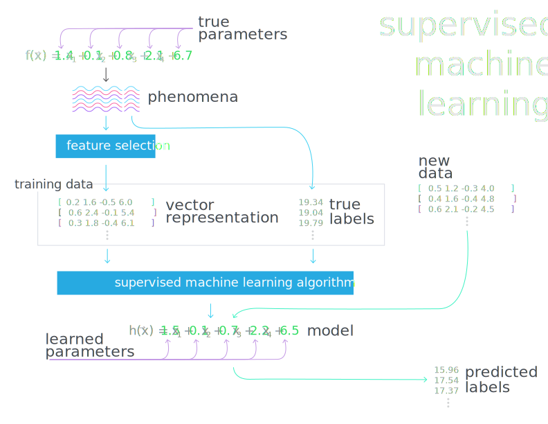
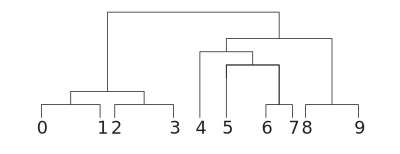
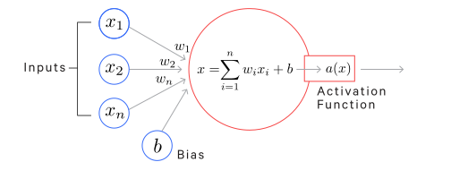
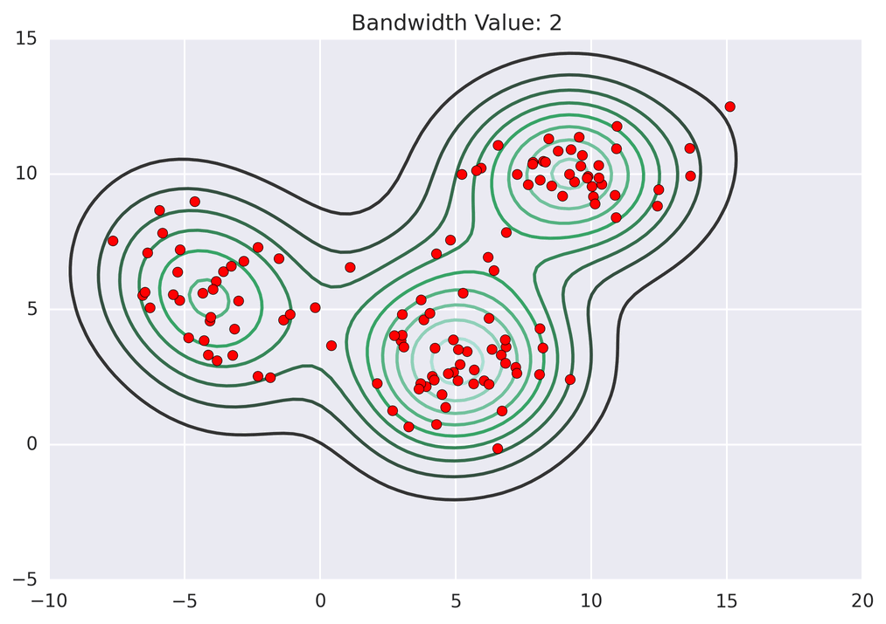
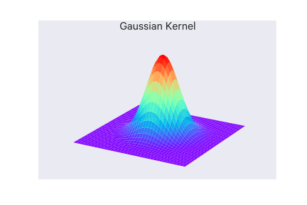
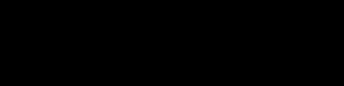

$$
\providecommand{\argmax}{\operatorname*{argmax}}
\providecommand{\argmin}{\operatorname*{argmin}}
$$

# Machine Learning

## Representation vs Learning:

- Representation: whether or not a function can be simulated by the network; i.e. is the network capable of _representing_ a given function?
- Learning: whether or not their exists an algorithm with which the weights can be adjusted to represent a particular function

## References

- _Neural Computing: Theory and Practice_ (1989). Philip D. Wasserman

## Supervised Learning
The learning algorithm is provided some pre-labeled examples (a _training set_) to learn from.

In _regression_ problems, you try to predict some continuous valued output (i.e. a real number).

In _classification_ problems, you try to predict some discrete valued output (e.g. categories).

Typical notation:

- $m$ = number training of examples
- $x$'s = input variables or features
- $y$'s = output variables or the "target" variable
- $(x^{(i)}, y^{(i)})$ = the $i$th training example
- $h$ = the hypothesis, that is, the function that the learning algorithm learns, taking $x$'s as input and outputting $y$'s

The typical process is:

- Feed training set data into the learning algorithm
- The learning algorithm learns the hypothesis $h$
- Input new data into $h$
- Get output from $h$

The hypothesis can thought of as the model that you try to learn for a particular task. You then use this model on new inputs, e.g. to make predictions - __generalization__ is how the model performs on new examples; this is most important in machine learning.

## Unsupervised Learning
The learning algorithm is not provided with any pre-labeled examples. Generally you are trying to uncover some structure of or patterns in the data.

An example is a _clustering_ algorithm. We don't tell the algorithm in advance anything about the structure of the data; it discovers it on its own by figuring how to group them.

Some other examples are _dimensionality reduction_, in which you try to reduce the dimensionality of the data representation, _density estimation_, in which you estimate the density of the distribution of the data, and _feature extraction_, in which you try to learn meaningful features automatically.

## Other types of learning

### Semi-supervised Learning

Some labeled data, some unlabeled data.

### Active Learning

Like semi-supervised learning, you have some labeled data, and some unlabeled data, and you can ask for the labels of some of the unlabeled data.

### Reinforcement Learning

Actions are taken and rewarded or penalized in some way and the goal is maximizing lifetime/long-term reward (or minimizing lifetime/long-term penalty).

## Representation

A very important choice in machine learning is how you represent the data. What are its salient features, and in what form is it best presented? Each field in the data (e.g. column in the table) is a __feature__ and a great deal of time is spent getting this representation right. The best machine learning algorithms can't do much if the data isn't represented in a way suited to the task at hand.

Sometimes it's not clear how to represent data. For instance, in identifying an image of a car, you may want to use a wheel as a feature. But how do you define a wheel in terms of pixel values?

__Representation learning__ is a kind of machine learning in which representations themselves can be learned.

An example representation learning algorithm is the __autoencoder__. It's a combination of an _encoder_ function that converts input data into a different representation and a _decoder_ function which converts the new representation back into its original format.

Successful representations separate the _factors of variations_ (that is, the contributors to variability) in the observed data. These may not be explicit in the data, "they may exist either as unobserved objects or forces in the physical world that affect the observable quantities, or they are constructs in the human mind that provide useful simplifying explanations or inferred causes of the observed data." ([_Deep Learning_](http://www.iro.umontreal.ca/~bengioy/dlbook)).

### Deep Learning

Deep learning builds upon representation learning. It involves having the program learn some hierarchy of concepts, such that simpler concepts are used to construct more complicated ones. This hierarchy of concepts forms a deep (many-layered) graph, hence "deep learning".

With deep learning we can have simpler representations aggregate into more complex abstractions.

A basic example of a deep learning model is the multilayer perceptron (MLP), which is essentially a function composed of simpler functions (layers); each function (i.e. layer) can be thought of as taking the input and outputting a new representation of it.

For example, if we trained a MLP for image recognition, the first layer may end up learning representations of edges, the next may see corners and contours, the next may identify higher level features like faces, etc.

### References

- [_Deep Learning_](http://www.iro.umontreal.ca/~bengioy/dlbook). Yoshua Bengio, Ian J. Goodfellow, Aaron Courville. Book in preparation for MIT Press. 2015.

## Terminology

- __Capacity__: the flexibility of a model
- __Hyperparameter__: a parameter of a model that is not learned (that is, you specify it yourself)
- __Underfitting__: when the model could achieve better generalization with more training or capacity
- __Overfitting__: when the model could achieve better generalization with more training or capacity; in particular, the model is too tuned to the idiosyncrasies of the training data
- __Model selection__: the process of choosing the best hyperparameters on a validation set

## Optimization

Much of machine learning can be framed as optimization problems - there is some kind of objective or loss function which we want to optimize (e.g. minimize classification error on the training set). Typically you are trying to find some parameters for your model, $\theta$, which minimizes this objective or loss function.

Generally this framework for machine learning is called __empirical risk minimization__ and can be formulated:

$$
\argmin_{\theta} \frac{1}{n} \sum_{i} l(f(x^{(i)}; \theta), y^{(i)}) + \lambda \Omega(\theta)
$$

Where:

- $f(x^{(i)}; \theta)$ is your model, which outputs some predicted value for the input $x^{(i)}$ and $\theta$ are the parameters for the model
- $y^{(i)}$ is the training label (i.e. the ground-truth) for the input $x^{(i)}$
- $l$ is the loss function
- $\Omega(\theta)$ is a _regularlizer_ to penalize certain values of $\theta$ and $\lambda$ is the regularization parameter (see below on _regularlization_)

Some optimization terminology:

- __Critical points__: $\\{x \in \mathbb R^n | \nabla_x f(x) = 0 \\}$
- __Curvature in direction $v$__: $v^T \nabla_x^2 f(x)v$
- Types of critical points:
    - local minima: $v^T \nabla_x^2 f(x)v > 0, \, \forall v$, that is $\nabla_x^2f(x)$ is positive definite
    - local maxima: $v^T \nabla_x^2 f(x)v < 0, \, \forall v$, that is $\nabla_x^2f(x)$ is negative definite
    - saddle point: curvature is positive in some directions and negative in others

## Linear Regression with One Variable

Also known as _univariate linear regression_ or _simple linear regression_ (SLR).

In univariate linear regression, we have one input variable $x$.

The hypothesis takes the form:

$$ h_{\theta}(x) = \theta_0 + \theta_1 x $$

Where the $\theta_i$s are the _parameters_ that the learning algorithm learns.

This should look familiar: it's just a line.

### How are the parameters determined?

The general idea is that you want to choose your parameters so that $h_{\theta}(x)$ is close to $y$ for your training examples $(x,y)$. This can be written:

$$ \sum^m_{i=1} (h_{\theta}(x^{(i)}) - y^{(i)})^2 $$

To the math easier, you multiply everything by $\frac{1}{2m}$ (this won't affect the resulting parameters):

$$ \frac{1}{2m} \sum^m_{i=1} (h_{\theta}(x^{(i)}) - y^{(i)})^2 $$

This is the _cost function_ (or _objective function_). In this case, we call it $J$, which looks like:

$$ J(\theta_0, \theta_1) = \frac{1}{2m} \sum^m_{i=1} (h_{\theta}(x^{(i)}) - y^{(i)})^2 $$

Here it is the _squared error function_ - it is probably the most commonly used cost function for regression problems.

We want to find $(\theta_0, \theta_1)$ to _minimize_ $J(\theta_0, \theta_1)$.

## Gradient Descent

_Gradient descent_ is an algorithm for finding parameter values which minimize a cost function.

Gradient descent is used in a lot of optimization problems across machine learning.

So we have some cost function $J(\theta_0, \theta_1, \dots, \theta_n)$ and we want to minimize it.

The general approach is:

- Start with some $\theta_0, \theta_1, \dots, \theta_n$.
- Changing $\theta_0, \theta_1, \dots, \theta_n$ in some increment/step to reduce $J(\theta_0, \theta_1, \dots, \theta_n)$ as much as possible.
- Repeat the previous step until convergence on a minimum (hopefully)

#### Gradient descent algorithm

Repeat the following until convergence:
(Note that := is the assignment operator.)

$$ \theta_j := \theta_j - \alpha\frac{\partial}{\partial\theta_j}J(\theta_0, \theta_1, \dots, \theta_n) $$

For each $j$ in $n$.

Every $\theta_j$ is updated _simultaneously_. So technically, you'd calculate this value for each $j$ in $n$ and only after they are all updated would you actually update each $\theta_j$.

For example, if the right-hand side of that equation was a function `func(j, t0, t1)`, you would implement it like so (example is $n=2$):

    temp_0 = func(0, theta_0, theta_1)
    temp_1 = func(1, theta_0, theta_1)
    theta_0 = temp_0
    theta_1 = temp_1

$\alpha$ is the _learning rate_ and tells how large a step/increment to change the parameters by.

Learning rates which are too small cause the gradient descent to go slowly. Learning rates which are too large can cause the gradient descent to overshoot the minimum, and in those cases it can fail to converge or even diverge.

The partial derivative on the right is just the rate of change from the current value.

### Gradient Descent for Univariate Linear Regression

For univariate linear regression, the derivatives are:

$$
\begin{aligned}
\frac{\partial}{\partial\theta_0}J(\theta_0, \theta_1) &= \frac{1}{m}\sum^m_{i=1}(h_{\theta}(x^{(i)}) - y^{(i)}) \\
\frac{\partial}{\partial\theta_1}J(\theta_0, \theta_1) &= \frac{1}{m}\sum^m_{i=1}(h_{\theta}(x^{(i)}) - y^{(i)}) \cdot x^{(i)}
\end{aligned}
$$

so overall, the algorithm involves repeatedly updating:

$$
\begin{aligned}
\theta_0 &:= \theta_0 - \alpha \frac{1}{m}\sum^m_{i=1}(h_{\theta}(x^{(i)}) - y^{(i)}) \\
\theta_1 &:= \theta_1 - \alpha \frac{1}{m}\sum^m_{i=1}(h_{\theta}(x^{(i)}) - y^{(i)}) \cdot x^{(i)}
\end{aligned}
$$

Remember that the $\theta$ parameters are updated _simultaneously_.

Note that because we are summing over _all_ training examples for each step, this particular type of gradient descent is known as _batch gradient descent_. There are other approaches which only sum over a subset of the training examples for each step.

Univariate linear regression's cost function is always convex ("bowl-shaped"), which has only one optimum, so gradient descent int his case will always find the global optimum.

## Linear Regression with Multiple Variables

Also known as _multivariate_ linear regression. This technique is for using multiple features with linear regression.

Say we have:

- $n$ = number of features
- $x^{(i)}$ = the input features of the $i$th training example
- $x_j^{(i)}$ = the value of feature $j$ in the $i$th training example

Instead of the simple linear regression model we can use a __generalized linear model__ (GLM). That is, the hypothesis $h$ will take the form of:

$$ h_{\theta}(x) = \theta_0 + \theta_1 x_1 + \theta_2 x_2 + \dots + \theta_n x_n $$

For convenience of notation, you can define $x_0 = 1$ and notate your features and parameters as zero-indexed $n + 1$-dimensional vectors:

$$
x =
\begin{bmatrix}
x_0 \\ x_1 \\ x_2 \\ \vdots \\ x_n
\end{bmatrix}
,
\theta =
\begin{bmatrix}
\theta_0 \\ \theta_1 \\ \theta_2 \\ \vdots \\ \theta_n
\end{bmatrix}
$$

And the hypothesis can be re-written as:

$$ h_{\theta}x = \theta^Tx $$

## Gradient descent with Multivariate Linear Regression

The previous gradient descent algorithm for univariate linear regression is just generalized (this is still repeated and simultaneously updated):

$$
\begin{aligned}
\theta_j &:= \theta_j - \alpha \frac{1}{m}\sum^m_{i=1}(h_{\theta}(x^{(i)}) - y^{(i)}) \cdot x_j^{(i)}
\end{aligned}
$$

### Feature Scaling

If you design your features such that they are on a similar scale, gradient descent can converge more quickly.

For example, say you are developing a model for predicting the price of a house. Your first feature may be the area, ranging from 0-2000 sqft, and your second feature may be the number of bedrooms, ranging from 1-5.

These two ranges are very disparate, causing the contours of the cost function to be such that the gradient descent algorithm jumps around a lot trying to find an optimum.

If you _scale_ these features such that they share the same (or at least a similar) range, you avoid this problem.

More formally, with feature scaling you want to get every feature into approximately a $-1 \leq x_i \leq 1$ range (it doesn't necessarily have to be between -1 and 1, just so long as there is a consistent range across your features).

With feature scaling, you could also apply _mean normalization_, where you replace $x_i$ with $x_i - \mu_i$ (that is, replace the value of the $i$th feature with its value minus the mean value for that feature) such that the mean of that feature is shifted to be about zero (note that you wouldn't apply this to $x_0 = 1$).

### Choosing the Learning Rate $\alpha$

You can plot out a graph with the number of gradient descent iterations on the x-axis and the values of $\min_{\theta} J(\theta)$ on the y-axis and visualize how the latter changes with the number of iterations. At some point, that curve will flatten out; that's about the number of iterations it took for gradient descent to converge on your particular problem.

You could use an _automatic convergence test_ which just declares convergence if $J(\theta)$ decreases by less than some threshold value in an iteration, but in practice that threshold value may be difficult to determine.

You would expect this curve to be similar to the one above. $min_{\theta} J(\theta)$ should decrease with the number of iterations, if gradient descent is working correctly. If not, then you should probably be using a smaller learning rate ($\alpha$). But again, don't make it too small or convergence will be slow.

## Example implementation of linear regression with gradient descent

    """
    - X = feature vectors
    - y = labels/target variable
    - theta = parameters
    - hyp = hypothesis (actually, the vector computed from the hypothesis function)
    """
    import numpy as np

    def cost_function(X, y, theta):
        """
        This isn't used, but shown for clarity
        """
        m = y.size
        hyp = np.dot(X, theta)
        sq_err = sum(pow(hyp - y, 2))
        return (0.5/m) * sq_err

    def gradient_descent(X, y, theta, alpha=0.01, iterations=10000):
        m = y.size
        for i in range(iterations):
            hyp = np.dot(X, theta)
            for i, p in enumerate(theta):
                temp = X[:,i]
                err = (hyp - y) * temp
                cost_function_derivative = (1.0/m) * err.sum()
                theta[i] = theta[i] - alpha * cost_function_derivative
        return theta

    if __name__ == '__main__':
        def true_function(X):
            # Create random parameters for X's dimensions, plus one for x0.
            true_theta = np.random.rand(X.shape[1] + 1)
            return true_theta[0] + np.dot(true_theta[1:], X.T), true_theta

        # Create some random data
        n_samples = 20
        n_dimensions = 5
        X = np.random.rand(n_samples, n_dimensions)
        y, true_theta = true_function(X)

        # Add a column of 1s for x0
        ones = np.ones((n_samples, 1))
        X = np.hstack([ones, X])

        # Initialize parameters
        theta = np.zeros((n_dimensions+1))

        # Split data
        X_train, y_train = X[:-1], y[:-1]
        X_test, y_test = X[-1:], y[-1:]

        # Estimate parameters
        theta = gradient_descent(X_train, y_train, theta, alpha=0.01, iterations=10000)

        # Predict
        print('true', y_test)
        print('pred', np.dot(X_test, theta))

        print('true theta', true_theta)
        print('pred theta', theta)

## Polynomial Regression

Your data may not fit a straight line and might be better described by a polynomial function, e.g. $\theta_0 + \theta_1 x + \theta_2 x^2$ or $\theta_0 + \theta_1 x + \theta_2 x^2 + \theta_3 x^3$.

A trick to this is that you can write this in the form of plain old multivariate linear regression. You would, for example, just treat $x$ as a feature $x_1$, $x^2$ as another feature $x_2$, $x^3$ as another feature $x_3$, and so on:

$$ \theta_0 + \theta_1 x_1 + \theta_2 x_2 + \theta_3 x_3 + \dots + \theta_n x_n $$

Note that in situations like this, feature scaling is very important because these features' ranges differ by a lot due to the exponents.

## Feature Engineering

Your data may have features explicitly present, e.g. a column in a database. But you can also design or _engineer_ new features by combining these explicit features or through observing patterns on your own in the data that haven't yet been explicitly encoded. We're doing a form of this in polynomial regression above by encoding the polynomials as new features.

## Normal Equation

The normal equation is an approach which allows for the direct determination of an optimal $\theta$ without the need for an iterative approach like gradient descent.

With calculus, you find the optimum of a function by calculating where its derivatives equal 0 (the intuition is that derivatives are rates of change, when the rate of change is zero, the function is "turning around" and is at a peak or valley).

So we can take the same cost function we've been using for linear regression and take the partial derivatives of the cost function $J$ with respect to every parameter of $\theta$ and then set each of these partial derivatives to 0:

$$ J(\theta_0, \theta_1, \dots, \theta_m) = \frac{1}{2m} \sum^m_{i=1} (h_{\theta}(x^{(i)}) - y^{(i)})^2 $$

And for each $j$

$$ \frac{\partial}{\partial \theta_j} J(\theta) = \dots = 0 $$

Then solve for $\theta_0, \theta_1, \dots, \theta_m$.

The fast way to do this is to construct a matrix out of your features, including a column for $x_0 = 1$ (so it ends up being an $m \times (n+1)$ dimensional matrix) and then construct a vector out of your target variables $y$ (which is an $m$-dimensional vector):

If you have $m$ examples, $(x^{(1)}, y^{(1)}), \dots, (x^{(m)}, y^{(m)})$, and $n$ features and then include $x_0 = 1$, you have the following feature vectors:

$$
x^{(i)} =
\begin{bmatrix}
x^{(i)}_0 \\
x^{(i)}_1 \\
x^{(i)}_2 \\
\vdots \\
x^{(i)}_n
\end{bmatrix}
\in \mathbb R^{n+1}
$$

From which we can construct $\mathbf X$, known as the _design matrix_:

$$
\mathbf X =
\begin{bmatrix}
(x^{(1)})^T \\
(x^{(2)})^T \\
\vdots \\
(x^{(m)})^T
\end{bmatrix}
$$

That is, the design matrix is composed of the transposes of the feature vectors for all the training examples.

And then the vector $y$ is the just all of the labels from your training data:

$$
y =
\begin{bmatrix}
y^{(1)} \\
y^{(2)} \\
\vdots \\
y^{(m)}
\end{bmatrix}
$$

Then you can calculate the $\theta$ vector which minimizes your cost function like so:

$$ \theta = (X^T X)^{-1} X^T y $$

With this method, feature scaling isn't necessary.

Note that it's possible that $X^TX$ is not invertible (that is, it is _singular_, also called _degenerate_), but this is usually due to redundant features (e.g. having a feature in feet and in meters; they communicate the same information) or having too many features (e.g. $m \leq n$), in which case you should delete some features or use _regularization_.

Programs which calculate the inverse of a matrix often have a method which allows it to calculate the optimal $\theta$ vector even if $X^T X$ is not invertible.

### Deciding between Gradient Descent and the Normal Equation

- Gradient Descent
    - requires that you choose $\alpha$
    - needs many iterations
    - works well when $n$ is large
- Normal Equation
    - don't need to choose $\alpha$
    - don't need to iterate
    - slow if $n$ is very large (computing $(X^TX)^{-1}$ has a complexity of $O(n^3)$), but is usually ok up until around $n = 10000$

Also note that for some learning algorithms, the normal equation is not applicable, whereas gradient descent still works.

## Classification

Classification problems are where your target variables are discrete, so they represent categories or classes.

In cases of _binary classification_, where there are only two classes (that is, $y \in \{0, 1\}$), we call the 0 class the _negative_ class, and the 1 class the _positive_ class.

### Logistic Regression

Logistic regression is a common approach to classification (the name "regression" makes it a bit confusing, it is a classification algorithm).

Logistic regression outputs a value between zero and one (that is, $0 \leq h_{\theta}(x) \leq 1$).

Say we have our hypothesis function

$$ h_{\theta}(x) = \theta^T x $$

With logistic regression, we apply an additional function $g$ :

$$ h_{\theta}(x) = g(\theta^T x) $$

where

$$ g(z) = \frac{1}{1+e^{-z}} $$

This function is known as the _sigmoid_ function, also known as the _logistic_ function, with the form:

So in logistic regression, the hypothesis ends up being:

$$ h_{\theta}(x) = \frac{1}{1+e^{\theta^Tx}} $$

The output of the hypothesis is interpreted as the probability of the given input belonging to the positive class. that is:

$$ h_{\theta}(x) = P(y=1 | x; \theta) $$

Which is read: "the probability that $y=1$ given $x$ as paramterized by $\theta$".

Since we are classifying input, we want to output a label, not a continuous value. So we might say $y = 1$ if $h_{\theta}(x) \geq 0.5$ and $y = 0$ if $h_{\theta}(x) < 0.5$. The line that forms this divide is an example of a _decision boundary_. Note that decision boundaries can be non-linear as well (e.g. they could be a circle or something).

#### Cost function

So we have our training set $\{ (x^{(1)}, y^{(1)}), (x^{(2)}, y^{(2)}), \dots, (x^{(m)}, y^{(m)}) \}$ where $y \in \{0, 1\}$ and with the hypothesis function from before.

Here is the cost function for _linear_ regression:

$$ J(\theta) = \frac{1}{m} \sum^m_{i=1} \frac{1}{2} (h_{\theta}(x^{(i)}) - y^{(i)})^2 $$

Note that the $\frac{1}{2}$ is introduced for convenience, so that the square exponent cancels out when we differentiate. Introducing an extra constant doesn't affect the result.

Note that now the $\frac{1}{2m}$ has been split into $\frac{1}{m}$ and $\frac{1}{2}$.

We can extract $\frac{1}{2} (h_{\theta}(x^{(i)}) - y^{(i)})^2$ and call it $\text{Cost}(h_{\theta}(x), y)$.

The cost function for logistic regression is different than that used for linear regression because the hypothesis function of logistic regression causes $J(\theta)$ to be _non-convex_, that is, look something like the following with many local optima, making it hard to converge on the global minimum.

So we want to find a way to define $\text{Cost}(h_{\theta}(x), y)$ such that it gives us a convex $J(\theta)$. We will use:

$$
\text{Cost}(h_{\theta}(x), y) =
\begin{cases}
-log(h_{\theta}(x)) & \text{if $y$ = 1} \\
-log(1 - h_{\theta}(x)) & \text{if $y$ = 0}
\end{cases}
$$

Some properties of this function is that if $y = h_{\theta}(x)$ then $\text{Cost} = 0$, and as $h_{\theta}(x) \to 0$, $\text{Cost} \to \infty$.

We can rewrite $\text{cost}$ in a form more conducive to gradient descent:

$$
\text{Cost}(h_{\theta}(x), y) = -y log(h_{\theta}(x)) - (1-y)log(1-h_{\theta}(x))
$$

So our entire cost function is:

$$
J(\theta) = -\frac{1}{m} [\sum^m_{i=1}y^{(i)}log(h_{\theta}(x^{(i)})) + (1-y^{(i)})log(1-h_{\theta}(x^{(i)}))]
$$

You could use other cost functions for logistic regression, but this one is derived from the principle of maximum likelihood estimation and has the nice property of being convex, so this is the one that basically everyone uses for logistic regression.

Then we can calculate $min_{\theta}J(\theta)$ with gradient descent by repeating and simultaneously updating:

$$
\begin{aligned}
\theta_j &:= \theta_j - \alpha \sum^m_{i=1}(h_{\theta}(x^{(i)}) - y^{(i)}) \cdot x_j^{(i)}
\end{aligned}
$$

This looks exactly the same as the linear regression gradeint descent algorithm, but it is different because $h_{\theta}(x)$ is now the nonlinear $h_{\theta}(x) = \frac{1}{1+e^{\theta^Tx}}$. Still, the previous methods for gradient descent (feature scaling and learning rate adjustment) apply here.

##### Advanced optimization algorithms

A few more advanced optimization algorithms are available beyond just gradient descent:

- Conjugate gradient
- BFGS
- L-BFGS

These shouldn't be implemented on your own since they require a _very_ advanced understanding of numerical computing, even just to understand what they're doing.

They are more complex, but there's no need to manually pick $\alpha$ and they are often faster than gradient descent. So you can take advantage of them via some library which has them implemented (though some implementations are better than others).

#### Logistic regression and multiclass classification (One-vs-All)

Unlike binary classification, in multiclass classification you have more than two classes in your dataset.

The technique of _one-vs-all_ (or _one-vs-rest_) involves dividing your training set into multiple binary classification problems, rather than as a single multiclass classification problem.

For example, say you have three classes 1,2,3. Your first binary classifier will distinguish between class 1 and classes 2 and 3,, your second binary classifier will distinguish between class 2 and classes 1 and 3, and your final binary classifier will distinguish between class 3 and classes 1 and 2.

Then to make the prediction, you pick the class $i$ which maximizes $max_i h_{\theta}^{(i)}(x)$.

### Confusion Matrices

For classification, evaluation often comes in the form of a __confusion matrix__.

The core values are:

- __True positives__ (TP): samples classified as positive which were labeled positive
- __True negatives__ (TN): samples classified as negative which were labeled negative
- __False positives__ (FP): samples classified as positive which were labeled negative
- __False negatives__ (FN): samples classified as negative which were labeled positive

A few other metrics are computed from these values:

- __Accuracy__: How often is the classifier correct? ($\frac{\text{TP} + \text{TN}}{\text{total}}$)
- __Misclassification rate__ (or "__error rate__"): How often is the classifier wrong? ($\frac{\text{FP} + \text{FN}}{\text{total}} = 1 - \text{accuracy}$)
- __Recall__ (or "__sensitivity__" or "__true positive rate__"): How often are positive-labeled samples predicted as positive? ($\frac{\text{TP}}{\text{num positive-labeled examples}}$)
- __False positive rate__: How often are negative-labeled samples predicted as positive? ($\frac{\text{FP}}{\text{num negative-labeled examples}}$)
- __Specificity__ (or "__true negative rate__"): How often are negative-labeled samples predicted as negative? ($\frac{\text{TN}}{\text{num negative-labeled examples}}$)
- __Precision__: How many of the predicted positive samples are correctly predicted? ($\frac{\text{TP}}{\text{TP} + \text{FP}}$)
- __Prevalence__: How many labeled-positive samples are there in the data? ($\frac{\text{num positive-labeled examples}}{\text{num examples}}$)

Some other values:

- __Positive predictive value__ (PPV): precision but takes prevalence into account. With a perfectly balanced dataset (i.e. equal positive and negative examples, that is prevalence is 0.5), the PPV equals the precision.
- __Null error rate__: how often you would be wrong if you just predicted positive for every example. This is a good starting baseline metric to compare your classifier against.
- __F-score__: The weighted average of recall and precision
- __Cohen's Kappa__: a measure of how well the classifier performs compared against if it had just guessed randomly, that is a high Kappa score happens when there is a big difference between the accuracy and the null error rate.
- __ROC Curve__: (see the section on this)

#### References

- <http://www.dataschool.io/simple-guide-to-confusion-matrix-terminology/>

## Overfitting

_Overfitting_ is a problem where your hypothesis describes the training data _too_ well, to the point where it cannot generalize to new examples. It is a _high variance_ problem. In contrast, _underfitting_ is a _high bias_ problem.

To clarify, if your model has no bias, it means that it makes no errors on your training data (i.e. it does not underfit). If your model has no variance, it means your model generalizes well on your test data (i.e. it does not overfit). It is possible to have bias and variance problems simultaneously.

Another way to think of this is that:

- variance = how much does the model vary if the training data changes? I.e. what space of possible models does this cover?
- bias = is the average model close to the "true" solution/model?

There is a _bias-variance trade-off_, in which improvement of one is typically at the detriment of the other.

You can think of generalization error as the sum of bias and variance. You want to keep both low, if possible.

Overfitting can happen if your hypothesis is too complex, which can happen if you have too many features. So you will want to through a _feature selection_ phase and pick out features which seem to provide the most value.

Alternatively, you can use the technique of _regularization_, in which you keep all your features, but reduce the magnitudes/values of parameters $\theta_j$. This is a good option all of your features are informative and you don't want to get rid of any.

## Regularization

The intuition behind regularization is that, if you have small values for your parameters $\theta_0, \theta_1, \dots, \theta_n$, then you have a "simpler" hypothesis which is less prone to overfitting.

In practice, there may be many combination of parameters which fit your data well. However, some may overfit/not generalize well. We want to introduce some means of valuing these simpler hypotheses over more complex ones (i.e. with larger parameters). We can do so with regularization.

So generally regularization is about shrinking your parameters to make them smaller. For linear regression, you accomplish this by modifying the cost function to include the term $\lambda \sum^n_{i=1} \theta_j^2$ at the end:

$$
J(\theta) = \frac{1}{2m} \sum^m_{i=1} (h_{\theta}(x^{(i)}) - y^{(i)})^2 + \lambda \sum^n_{i=1} \theta_j^2
$$

Note that we are not shrinking $\theta_0$. In practice, it does not make much of a difference if you include it or not; standard practice is to leave it out.

$\lambda$ here is called the _regularization parameter_. It tunes the balance between fitting the data and keeping the parameters small (i.e. each half of the cost function). If you make $\lambda$ _too_ large for your problem, you may make your parameters too close to 0 for them to be meaningful.

The additional $\lambda \sum^n_{i=1} \theta_j^2$ term is called the _regularization loss_, and the rest of the loss function is called the _data loss_.

#### References

- Andrew Ng's Machine Learning Coursera course
- <https://cs231n.github.io/linear-classify/>

### Regularized Linear Regression

We can update gradient descent to work with our regularization term:

$$
\begin{aligned}
\theta_0 &:= \theta_0 - \alpha \frac{1}{m}\sum^m_{i=1}(h_{\theta}(x^{(i)}) - y^{(i)}) \cdot x_0^{(i)} \\
\theta_j &:= \theta_j - \alpha \frac{1}{m}\sum^m_{i=1}(h_{\theta}(x^{(i)}) - y^{(i)}) \cdot x_j^{(i)} + \frac{\lambda}{m}\theta_j \\
j &= (1,2,3, \dots, n)
\end{aligned}
$$

The $\theta_j$ part can be re-written as:

$$
\theta_j := \theta_j(1 - \alpha \frac{\lambda}{m}) - \alpha \frac{1}{m} \sum^m_{i=1} (h_{\theta}(x^{(i)}) - y^{(i)}) \cdot x_j^{(i)}
$$

If we are using the normal equation, we can update it to a regularized form as well:

$$
\theta = (X^T X + \lambda M)^{-1} X^T y
$$

Where $M$ is an $n+1 \times n+1$ matrix, where the diagonal is all ones, except for the element at $(0,0)$ which is 0, and every other element is also 0.

### Regularized Logistic Regression

We can also update the logistic regression cost function with the regularization term:

$$
J(\theta) = -\frac{1}{m} [\sum^m_{i=1}y^{(i)}log(h_{\theta}(x^{(i)})) + (1-y^{(i)})log(1-h_{\theta}(x^{(i)}))] + \frac{\lambda}{2m} \sum^n_{i=1} \theta_j^2
$$

Then we can update gradient descent with the new derivative of this cost function for the parameters $\theta_j$ where $j \neq 0$

$$
\begin{aligned}
\theta_0 &:= \theta_0 - \alpha \frac{1}{m}\sum^m_{i=1}(h_{\theta}(x^{(i)}) - y^{(i)}) \cdot x_0^{(i)} \\
\theta_j &:= \theta_j - \alpha \frac{1}{m}\sum^m_{i=1}(h_{\theta}(x^{(i)}) - y^{(i)}) \cdot x_j^{(i)} + \frac{\lambda}{m}\theta_j \\
j &= (1,2,3, \dots, n)
\end{aligned}
$$

It looks the same as the one for linear regression, but again, the actual hypothesis function $h_{\theta}$ is different.

## Discriminative vs Generative learning algorithms

_Discriminative_ learning algorithms include algorithms like logistic regression, decision trees, kNN, and SVM. Discriminative approaches try to find some way of separating data (_discriminating_ them), such as in logistic regression which tries to find a dividing line and then sees where new data lies in relation to that line.

Say our input features are $x$ and $y$ is the class.

Discriminative learning algorithms learn $P(y|x)$ directly, that is it tries to learn the probability of $y$ directly as a function of $x$. To put it another way, what is the probability this new data is of class $y$ given the features $x$?

_Generative_ learning algorithms instead tries to develop a model for each class and sees which model new data conforms to.

Generative learning algorithms learn $P(x|y)$ and $P(y)$ instead (that is, it models the joint distribution $P(x,y)$). So instead they ask, if this were class $y$, what is the probability of seeing these new features $x$? You're basically trying to figure out what class is most likely to have _generated_ the given features $x$.

$P(y)$ is the class prior/the prior probability of seeing the class $y$, that is the probability of class $y$ if you don't have any other information.

It is easier to estimate the conditional distribution $P(y|x)$ than it is the joint distribution $P(x,y)$, though generative models can be much stronger. With $P(x,y)$, it is easy to calculate the same conditional ($P(y|x) = \frac{P(x,y)}{P(x)}$).

For both discriminative and generative approaches, you will have parameters and latent variables $\theta$ which govern these distributions. We treat $\theta$ as a random variable.

## Neural Networks

### Neural networks and overfitting

You could fit a small neural network:

- fewer parameters, more prone to underfitting
- computationally cheaper

Or a large neural network:

- more parameters, more prone to overfitting
- computationally more expensive
- use regularization ($\lambda$) to address overfitting

Generally, large neural networks with regularization performs better than a smaller neural network.

### Determining the number of hidden layers to use

When you can do is just split your data into training/test/cross validation and see how performance changes with the number of hidden layers. Pick one that looks promising when run on your cross validation data, then see how it generalizes to the test data.

## Metrics

### Area Under Curve (AUC)

AUC is a metric for binary classification and is especially useful when dealing with _high-bias_ data, that is, where one class is much more common than the other. Using accuracy as a metric falls apart in high-bias datasets: for example, say you have 100 training examples, one of which is is positive, the rest of which are negative. You could develop a model which just labels every thing negative, and it would have 99% accuracy. So accuracy doesn't really tell you enough here.

Many binary classifies output some continuous value (0-1), rather than class labels; there is some threshold (usually 0.5) above which one label is assigned, and below which the other label is assigned. Some models may work best with a different threshold. Changing this threshold leads to a trade off between true positives and false positives - for example, decreasing the threshold will yield more true positives, but also more false positives.

AUC runs over all thresholds and plots the the true vs false positive rates. This curve is called a _receiver operating characteristic_ curve, or _ROC_ curve. A random classifier would give you equal false and true positives, which leads to a AUC of 0.5; the curve in this case would be a straight line. The better the classifier is, the more area under the curve there is (so the AUC approaches 1).

## Strategies for Applying Machine Learning

### What if your algorithm doesn't perform well? What should you try next?

- Get more training examples (can help with high variance problems)
- Try smaller sets of features (can help with high variance problems)
- Try additional features (can help with high bias problems)
- Try adding polynomial features ($x_1^2, x_2^2, x_1 x_2$, etc) (can help with high bias problems)
- Try decreasing the regularization parameter $\lambda$ (can help with high bias problems)
- Try increasing the regularization parameter $\lambda$ (can help with high variance problems)

But how do you decide which thing to try?

### Machine learning diagnostics

In machine learning, a diagnostic is:

> A test that you can run to gain insight [about] what is/isn't working with a learning algorithm, and gain guidance as to how best to improve its performance.

They take time to implement but can save you a lot of time by preventing you from going down fruitless paths.

### Evaluating a hypothesis

You can't evaluate a hypothesis with the cost function because minimizing the error can lead to overfitting.

A good approach is to take your data and split it randomly into a training set and a test set (e.g. a 70%/30% split). Then you train your model on the training set and see how it performs on the test set.

For linear regression, you might do things this way:

- Learn parameter $\theta$ from training data by minimizing training error $J(\theta)$.
- Compute test set error (using the squared error) ($m_{\text{test}}$ is the test set size):

    $$
    J_{\text{test}}(\theta) = \frac{1}{2m_{\text{test}}} \sum^{m_{\text{test}}}_{i=1} (h_{\theta}(x^{(i)}_{\text{test}}) - y^{(i)}_{\text{test}})
    $$

For logistic regression, you might do things this way:

- Learn parameter $\theta$ from training data by minimizing training error $J(\theta)$.
- Compute test set error ($m_{\text{test}}$ is the test set size):

    $$
    J_{\text{test}}(\theta) = -\frac{1}{m_{\text{test}}} \sum^{m_{\text{test}}}_{i=1} y^{(i)}_{\text{test}} \log h_{\theta} (x^{(i)}_{\text{test}}) + (1 - y^{(i)}_{\text{test}}) \log h_{\theta} (x^{(i)}_{\text{test}})
    $$

- Alternatively, you can use the misclassification error ("0/1 misclassification error", read "zero-one"), which is just the fraction of examples that your hypothesis has mislabeled:

    $$
    \begin{aligned}
    err(h_{\theta}(x), y) &=
    \begin{cases}
    1,  & \text{if $h_{\theta}(x) \geq 0.5, y=0$ or if $h_{\theta}(x) < 0.5, y=1$} \\[2ex]
    0,  & \text{otherwise}
    \end{cases} \\
    \text{test error} &= \frac{1}{m_{\text{test}}} \sum^{m_{\text{test}}}_{i=1} err(h_{\theta}(x^{(i)}_{\text{test}}), y^{(i)}_{\text{test}})
    \end{aligned}
    $$

A better way of splitting the data is to not split it only into training and testing sets, but to also include a _cross validation_ set. A typical ratio is 60% training, 20% cross validation, 20% testing.

So instead of just measuring the test error, you would also measure the cross validation error.

This is useful if you are trying to determine what features to include for your model. You can try different hypotheses and then see how they perform on your cross validation set. If they seem promising, you can then test your model's generalizability on your test set. In this way, you can better avoid overfitting.

You can use these errors to identify what kind of problem you have if your model isn't performing well:

- If your training error is large and your cross validation/test set error is large, then you have a high bias (underfitting) problem.
- If your training error is small and your cross validation/test set error is large, then you have a high variance (overfitting) problem.

### Choosing a good $\lambda$ for regularization

We can choose some range of values for $\lambda$ and evaluate the performance for each on the cross validation set. Pick the best one and then see how it generalizes on the test set.

Just remember that large values of lambda can lead to underfitting problems (since the parameters get close to 0), and small values of lambda can lead to overfitting.

### Learning curves

To generate a learning curve, you deliberately shrink the size of your training set and see how the training and cross validation errors change as you increase the training set size. This way you can see how your model improves (or doesn't, if something unexpected is happening) with more training data.

With smaller training sets, we expect the training error will be low because it will be easier to fit to less data. So as training set size grows, the average training set error is expected to grow.
Conversely, we expect the average cross validation error to decrease as the training set size increases.

If it seems like the training and cross validation error curves are flattening out at a high error as training set size increases, then you have a high bias problem. The curves flattening out indicates that getting more training data will not (by itself) help much.

On the other hand, high variance problems are indicated by a large gap between the training and cross validation error curves as training set size increases. You would also see a low training error. In this case, the curves are converging and more training data would help.

## Machine Learning System Design

Before you start building your machine learning system, you should:

- Be explicit about the problem.
- Brainstorm some possible strategies.
    - What features might be useful?
    - Do you need to collect more data?

Then to start:

- Start with a simple algorithm which can be implemented quickly.
- Test the simple algorithm on your cross-validation data.
- Plot learning curves to decide where things need work:
    - Do you need more data?
    - Do you need more features?
    - And so on.
- Error analysis: manually examine the examples in the cross validation set that your algorithm made errors on. Try to identify patterns in these errors. Are there categories of examples that the model is failing on in particular? Are there any other features that might help?

If you have an idea for a feature which may help, it's best to just test it out. This process is much easier if you have a single metric for your model's performance. You can use cross-validation error or others, mentioned below.

When it comes to _skewed classes_ (or _high bias data_), metric selection is more nuanced.

For instance, say you have a dataset where only 0.5% of the data is in category 1 and the rest is in category 0. You run your model and find that it categorized 99.5% of the data correctly! But because of the skew in that data, your model could just be: classify each example in category 0, and it would achieve that accuracy.

Note that the convention is to set the rare class to 1 and the other class to 0. That is, we try to predict the rare class.

Instead, you may want to use _precision/recall_ as your evaluation metric.

|    |      1T        |       0T       |
|----|----------------|----------------|
| 1P | True positive  | False positive |
| 0P | False negative | True negative  |

Where 1T/0T indicates the actual class and 1P/0P indicates the predicted class.

_Precision_ is the number of true positives over the total number predicted as positive. That is, what fraction of the examples labeled as positive actually are positive?

$$
\frac{\text{true positives}}{\text{true positives} + \text{false positives}}
$$

_Recall_ is the number of true positives over the number of actual positives. That is, what fraction of the positive examples in the data were identified?

$$
\frac{\text{true positives}}{\text{true positives} + \text{false negatives}}
$$

So in the previous example, our simple classifier would have a recall of 0.

There is a trade-off between precision and recall.

Say you are using a logistic regression model for this classification task. Normally, the category threshold in logistic regression is 0.5, that is, predict class 1 if $h_{\theta}(x) \geq 0.5$ and predict class 0 if $h_{\theta}(x) < 0.5$.

But you may want to only classify an example as 1 if you're very confidence. So you may change the threshold to 0.9 to be stricter about your classifications. In this case, you would increase precision, but lower recall since the model may not be confident enough about some of the more ambiguous positive examples.

Conversely, you may want to lower the threshold to avoid false negatives, in which case recall increases, but precision decreases.

So how do you compare precision/recall values across algorithms to determine which is best? You can condense precision and recall into a single metric: the $F_1$ score (also just called the _F score_):

$$
F_1 \text{score} = 2 \frac{PR}{P+R}
$$

Although more data doesn't always help, it very often does. Many algorithms perform significantly better as they get more and more data. Even relatively simple algorithms can outperform more sophisticated ones, solely on the basis of having more training data.

## Unsupervised Learning

In unsupervised learning, our data does not have any labels. Unsupervised learning algorithms try to find some structure in the data.

### K-Means Clustering Algorithm

First, randomly initialize $K$ points, called the _cluster centroids_.

Then iterate:

- Cluster assignment step: go through each data point and assign it to the closest of the $K$ centroids.
- Move centroid step: move the centroids to the average of their points.

Closeness is computed by some distance metric, e.g. euclidean.

More formally, there are two inputs:

- $K$ - the number of clusters
- The training set $\\{x^{(1)}, x^{(2)}, \dots, x^{(m)}\\}$

Where $x^{(i)} \in \mathbb R^n$ (we drop the $x_0 = 1$ convention).

Randomly initialize $K$ cluster centroids $\mu_1, \mu_2, \dots, \mu_K \in \mathbb R^n$.

Repeat:

- For $i=1$ to $m$
    - $c^{(i)} :=$ index (from 1 to $K$) of cluster centroid closest to $x^{(i)}$. That is, $c^{(i)} := \text{min}_k ||x^{(i)} - \mu_k||$.
- For $k=1$ to $K$
    - $\mu_k :=$ average (mean) of points assigned to cluster $k$

If you have an empty cluster, it is common to just eliminate it entirely.

We can notate the cluster centroid of the cluster to which example $x^{(i)}$ has been assigned as $\mu_{c^{(i)}}$.

In K-means, the optimization objective is:

$$
\begin{aligned}
J(c^{(i)}, \dots, c^{(m)}, \mu_1, \dots, \mu_K) = \frac{1}{m} \sum^m_{i=1} ||x^{(i)} - \mu_{c^{(i)}}||^2 \\
min_{c^{(i)}, \dots, c^{(m)}, \mu_1, \dots, \mu_K} J(c^{(i)}, \dots, c^{(m)}, \mu_1, \dots, \mu_K)
\end{aligned}
$$

This cost function is sometimes called the _distortion_ cost function or the distortion of the K-means algorithm.

The algorithm outlined above is minimizing the cost: the first step tries to minimize $c^{(i)}, \dots, c^{(m)}$ and the second step tries to minimize $\mu_1, \dots, \mu_K$.

One question is - what's the best way to initialize the initial centroids to avoid local minima of the cost function?

First of all, you should halve $K < m$ (i.e. less than your training examples.)

Then randomly pick $K$ training examples. Use these as your initialization points (i.e. set $\mu_1, \dots, \mu_k$ to these $K$ examples).

Then, to better avoid local optima, just rerun K-means several times (e.g. 50-1000 times) with new initializations of points. Keep track of the resulting cost function and then pick the clustering that gave the lowest cost.

So, how do you choose a good value for $K$?

Unfortunately, there is no good way of doing this automatically. The most common way is to just choose it manually by looking at the output. If you plot out the data and look at it - even among people it is difficult to come to a consensus on how many clusters there are.

One method that some use is the _Elbow method_. In this approach, you vary $K$, run K-means, and compute the cost function for each value. If you plot out $K$ vs the cost functions, there may be a clear "elbow" in the graph and you pick the $K$ at the elbow. However, most of the time there isn't a clear elbow.

### Hierarchical Agglomerative Clustering

Hierarchical agglomerative clustering (HAC) is a bottom-up clustering process which is fairly simple:

1. Find two closest data points or clusters, merge into a cluster (and remove the original points or clusters which formed the new cluster)
2. Repeat

This results in a hierarchy (e.g. a tree structure) describing how the data can be grouped into clusters and clusters of clusters. This structure can be visualized as a dendrogram:

Two things which must be specified for HAC are:

- the distance metric: euclidean, cosine, etc
- the merging approach - that is, how is the distance between two clusters measured?
    - _complete linkage_ - use the distance between the two further points
    - _average linkage_ - take the average distances of all pairs between the clusters
    - _single linkage_ -  take the distance between the two nearest points
    - (there are others as well)

Unlike K-means, HAC is deterministic (since there are no randomly-initialized centroids) but it can be unstable: changing a few points or the presence of some outliers can vastly change the result. Scaling of variables/features can also affect clustering.

## Support Vector Machines

SVMs can be powerful for learning non-linear functions and are widely-used.

With SVMs, the optimization objective is:

$$
min_{\theta} \sum^m_{i=1} [y^{(i)}\text{cost}_1(\theta^T x^{(i)}) + (1-y^{(i)}) \text{cost}_0(\theta^T x^{(i)})] + \frac{\lambda}{2} \sum^n_{j=1} \theta_j^2
$$

Where the term at the end is the regularization term. Note that this is quite similar to the objective function for logistic regression; we have just removed the $\frac{1}{m}$ term (removing it does not make a difference to our result because it is a constant) and substituted the log hypothesis terms for two new cost functions.

If we break up the logistic regression objective function into terms (that is, the first sum and the regularization term), we might write it as $A + \lambda B$.

The SVM objective is often instead notated by convention as $CA + B$. You can think of $C$ as $\frac{1}{\lambda}$. That is, where increasing $\lambda$ brings your parameters closer to zero, the regularization parameter $C$ has the opposite effect - as it grows, so do your parameters, and vice versa.

With that representation in mind, we can rewrite the objective by replacing the $\lambda$ with $C$ on the first term:

$$
min_{\theta} C \sum^m_{i=1} [y^{(i)}\text{cost}_1(\theta^T x^{(i)}) + (1-y^{(i)}) \text{cost}_0(\theta^T x^{(i)})] + \frac{1}{2} \sum^n_{j=1} \theta_j^2
$$

The SVM hypothesis is:

$$
h_{\theta}(x) =
\begin{cases}
1 & \text{if $\theta^T x \geq 0$} \\
0 & \text{otherwise}
\end{cases}
$$

SVMs are sometimes called _large margin_ classifiers.

Take the following data:

On the left, a few different lines separating the data are drawn. The optimal one found by SVM is the one in orange. It is the optimal one because it has the largest margins, illustrated by the red lines on the right (technically, the margin is orthogonal from the decision boundary _to_ those red lines). When $C$ is very large, SVM tries to maximize these margins.

However, outliers can throw SVM off if your regularization parameter $C$ is too large, so in those cases, you may want to try a smaller value for $C$.

### Kernels

_Kernels_ are the main technique for adapting SVMs to do complex non-linear classification.

A note on notation. Say your hypothesis looks something like:

$$
\theta_0 + \theta_1 x_1 + \theta_2 x_2 + \theta_3 x_1 x_2 + \theta_4 x_1^2 + \dots
$$

We can instead notate each non-parameter term as a feature $f$, like so:

$$
\theta_0 + \theta_1 f_1 + \theta_2 f_2 + \theta_3 f_3 + \theta_4 f_4 + \dots
$$

For SVMs, how do we choose these features?

What we can do is compute features based on $x$'s proximity to landmarks $l^{(1)}, l^{(2)}, l^{(3)}, \dots$. For each landmark, we get a feature:

$$
f_i = \text{similarity}(x, l^{(i)}) = exp(-\frac{||x-l^{(i)}||^2}{2 \sigma^2})
$$

Here, the $\text{similarity}(x, l^{(i)})$ function is the _kernel_, sometimes just notated $k(x, l^{(i)})$.

We have a choice in what kernel function we use; here we are using _Gaussian kernels_. In the Gaussian kernel we have a parameter $\sigma$.

If $x$ is close to $l^{(i)}$, then we expect $f_i \approx 1$. Conversely, if $x$ is far from $l^{(i)}$, then we expect $f_i \approx 0$.

With this approach, classification becomes based on distances to the landmarks - points that are far away from certain landmarks will be classified 0, points that are close to certain landmarks will be classified 1. And thus we can get some complex decision boundaries like so:

So how do you choose the landmarks?

You can take each training example and place a landmark there. So if you have $m$ training examples, you will have $m$ landmarks.

So given $(x^{(1)}, y^{(1)}), (x^{(2)}, y^{(2)}), \dots, (x^{(m)}, y^{(m)})$, choose $l^{(1)} = x^{(1)}, l^{(2)} = x^{(2)}, \dots, l^{(m)} = x^{(m)}$.

Then given a training example $(x^{(i)}, y^{(i)})$, we can compute a feature vector $f$, where $f_0 = 1$, like so:

$$
f =
\begin{bmatrix}
f_0 = 1 \\
f_1^{(i)} = sim(x^{(i)}, l^{(1)}) \\
f_2^{(i)} = sim(x^{(i)}, l^{(2)}) \\
\vdots \\
f_i^{(i)} = sim(x^{(i)}, l^{(i)}) \\
\vdots \\
f_m^{(i)} = sim(x^{(i)}, l^{(m)})
\end{bmatrix}
$$

Then instead of $x$ we use our feature vector $f$. So our objective function becomes:

$$
min_{\theta} C \sum^m_{i=1} [y^{(i)}\text{cost}_1(\theta^T f^{(i)}) + (1-y^{(i)}) \text{cost}_0(\theta^T f^{(i)})] + \frac{1}{2} \sum^n_{j=1} \theta_j^2
$$

Note that here $n = m$ because we have a feature for each of our $m$ training examples.

Of course, using a landmark for each of your training examples makes SVM difficult on large datasets. There are some implementation tricks to make it more efficient, though.

When choosing the regularization parameter $C$, note that:

- A large $C$ means lower bias, high variance
- A small $C$ means higher bias, low variance

For the Gaussian kernel, we also have to choose the parameter $\sigma^2$.

- A large $\sigma^2$ means that features $f_i$ vary more smoothly. Higher bias, lower variance.
- A small $\sigma^2$ means that features $f_i$ vary less smoothly. Lower bias, higher variance.

When using SVM, you also need to choose a kernel, which could be the Gaussian kernel, or it could be no kernel (i.e. a linear kernel), or it could be one of many others. The Gaussian and linear kernels are by far the most commonly used.

You may want to use a linear kernel if $n$ is very large, but you don't have many training examples ($m$ is small). Something more complicated may overfit if you only have a little data.

The Gaussian kernel is appropriate if $n$ is small and/or $m$ is large. Note that you should perform feature scaling before using the Gaussian kernel.

Not all similarity functions make valid kernels - they must satisfy a condition called Mercer's Theorem which allows the optimizations that most SVM implementations provide and also so they don't diverge.

Other off-the-shelf kernels include:

- Polynomial kernel: $k(x,l) = (x^T l)^2$, or $k(x,l) = (X^T l)^3$, or $k(x,l + 1)^3$, etc (there are many variations), the general form is $(x^Tl + \text{constant})^{\text{degree}}$. It usually performs worse than the Gaussian kernel.
- More esoteric ones: String kernel, chi-square kernel, histogram intersection kernel, ...

But these are seldom, if ever, used.

Some SVM packages have a built-in multi-class classification functionality. Otherwise, you can use the one-vs-all method. That is, train $K$ SVMs, one to distinguish $y=i$ from the rest, for $i=1,2,\dots,K$, then get $\theta^{(1)}, \theta^{(2)}, \dots, \theta^{(K)}$, and pick classs $i$ with the largest $(\theta^{(i)})^Tx$.

If $n$ is large relative to $m$, e.g. $n=10000, m \in [10, 1000]$, then it may be better to use logistic regression, or SVM without a kernel (linear kernel).

If $n$ is small (1-1000) and $m$ is intermediate (10-50000), then you can try SVM with the Gaussian kernel.

If $n$ is small (1-1000) but $m$ is large (50000+), then you can create more features and then use logistic regression or SVM without a kernel, since otherwise SVMs struggle at large training sizes.

SVM without a kernel works out to be similar to logistic regression for the most part.

Neural networks are likely to work well for most of these situations, but may be slower to train.

The SVM's optimization problem turns out to be convex, so good SVM packages will find global minimum or something close to it (so no need to worry about local optima).

Other rules of thumb:

- Use linear kernel when number of features is larger than number of observations.
- Use gaussian kernel when number of observations is larger than number of features.
- If number of observations is larger than 50,000 speed could be an issue when using gaussian kernel; hence, one might want to use linear kernel.
[Source](http://stats.stackexchange.com/a/73116/55910)

Also:

> Usually, the decision is whether to use linear or an RBF (aka Gaussian) kernel. There are two main factors to consider:
>
> > Solving the optimisation problem for a linear kernel is much faster, see e.g. LIBLINEAR.
> > Typically, the best possible predictive performance is better for a nonlinear kernel (or at least as good as the linear one).
>
> It's been shown that the linear kernel is a degenerate version of RBF, hence the linear kernel is never more accurate than a properly tuned RBF kernel. Quoting the abstract from the paper I linked:
>
> > The analysis also indicates that if complete model selection using the Gaussian kernel has been conducted, there is no need to consider linear SVM.
>
> A basic rule of thumb is briefly covered in NTU's practical guide to support vector classification (Appendix C).
>
> > If the number of features is large, one may not need to map data to a higher dimensional space. That is, the nonlinear mapping does not improve the performance. Using the linear kernel is good enough, and one only searches for the parameter C.
>
> Your conclusion is more or less right but you have the argument backwards. In practice, the linear kernel tends to perform very well when the number of features is large (e.g. there is no need to map to an even higher dimensional feature space). A typical example of this is document classification, with thousands of dimensions in input space.
>
> In those cases, nonlinear kernels are not necessarily significantly more accurate than the linear one. This basically means nonlinear kernels lose their appeal: they require way more resources to train with little to no gain in predictive performance, so why bother.
>
> **TL;DR**
>
> Always try linear first since it is way faster to train (AND test). If the accuracy suffices, pat yourself on the back for a job well done and move on to the next problem. If not, try a nonlinear kernel.
[Source](http://stats.stackexchange.com/a/73156/55910)

#### more on support vector machines

_Support vector machines_ is another way of coming up with decision boundaries to divide a space.

Here the decision boundary is positioned so that its _margins_ are as wide as possible.

We can consider some vector $\vec w$ which is perpendicular to the decision boundary and has an unknown length.

Then we can consider an unknown vector $\vec u$ that we want to classify.

We can compute their dot product, $\vec w \cdot \vec u$, and see if it is greater than or equal to some constant $c$.

To make things easier to work with mathematically, we set $b = -c$ and rewrite this as:

$$
\vec w \cdot \vec u + b \geq 0
$$

This is our decision rule: if this inequality is true, we have a positive example.

Now we will define a few things about this system:

$$
\begin{aligned}
\vec w \cdot \vec x_+ + b &\geq 1 \\
\vec w \cdot \vec x_- + b &\leq -1
\end{aligned}
$$

Where $\vec x_+$ is a positive training example and $\vec x_-$ is a negative training example. So we will insist that these inequalities hold.

For mathematical convenience, we will define another variable $y_i$ like so:

$$
y_i =
\begin{cases}
y_i = +1 & \text{if positive example} \\
y_i = -1 & \text{if negative example}
\end{cases}
$$

So we can rewrite our constraints as:

$$
\begin{aligned}
y_i(\vec w \cdot \vec x_+ + b) &\geq 1 \\
y_i(\vec w \cdot \vec x_- + b) &\geq 1
\end{aligned}
$$

Which ends up just collapsing into:

$$
y_i(\vec w \cdot \vec x + b) \geq 1
$$

Or:

$$
y_i(\vec w \cdot \vec x + b) - 1 \geq 0
$$

We then add an additional constraint for an $x_i$ in the gutter (that is, within the margin of the decision boundary):

$$
y_i(\vec w \cdot \vec x + b) - 1 = 0
$$

So how do you compute the total width of the margins?

You can take a negative example $\vec x_-$ and a positive example $\vec x_+$ and compute their difference $\vec x_+ - \vec x_-$. This resulting vector is not orthogonal to the decision boundary, so we can project it onto the unit vector $\hat w$ (the unit vector of the $\vec w$, which is orthogonal to the decision boundary):

$$
\text{width} = (\vec x_+ - \vec x_-) \cdot \frac{\vec w}{||\vec w||}
$$

Using our previous constraints we get $\vec x_+ = 1 - b$ and $- \vec x_- = 1 + b$, so the end result is:

$$
\text{width} = \frac{2}{||\vec w||}
$$

We want to maximize the margins, that is, we want to maximize the width, and we can divide by $\frac{1}{2}$ because we still have a meaningful maximum, and that in turn can be interpreted as the minimum of the length of $\vec w$, which we can rewrite in a more mathematically convenient form (and still have the same meaningful minimum):

$$
max(\frac{2}{||\vec w||}) \to max(\frac{1}{||\vec w||}) \to min(||\vec w||) \to min(\frac{1}{2}||\vec w||^2)
$$

Let's turn this into something we can maximize, incorporating our constraints. We have to use Lagrange multipliers which provide us with this new function we can maximize without needing to think about our constraints anymore:

$$
L = \frac{1}{2} ||\vec w||^2 - \sum_i \alpha_i [y_i (\vec w \cdot \vec x_i + b) - 1]
$$

(Note that the Lagrangian is an objective function which includes equality constraints).

Where $L$ is the function we want to maximize, and the sum is the sum of the constraints, each with a multiplier $\alpha_i$.

So then to get the maximum, we just compute the partial derivatives and look for zeros:

$$
\begin{aligned}
\frac{\partial L}{\partial \vec w} &= \vec w - \sum_i \alpha_i y_i \vec x_i = 0 \to \vec w = \sum_i \alpha_i y_i \vec x_i \\
\frac{\partial L}{\partial b} &= -\sum_i \alpha_i y_i = 0 \to \sum_i \alpha_i y_i = 0
\end{aligned}
$$

Let's take these partial derivatives and re-use them in the original Lagrangian:

$$
L = \frac{1}{2}(\sum_i \alpha_i y_i \vec x_i) \cdot (\sum_j \alpha_j y_j \vec x_j) - \sum_i \alpha_i y_i \vec x_i \cdot (\sum_j \alpha_j y_j \vec x_j) - \sum \alpha_i y_i b + \sum \alpha_i
$$

Which simplifies to:

$$
L = \sum \alpha_i - \frac{1}{2} \sum_i \sum_j \alpha_i \alpha_j y_i y_j \vec x_i \cdot \vec x_j
$$

We see that this depends on $\vec x_i \cdot \vec x_j$.

Similarly, we can rewrite our decision rule, substituting for $\vec w$.

$$
\begin{aligned}
\vec w &= \sum_i \alpha_i y_i \vec x_i \\
\vec w \cdot \vec u + b &\geq 0 \\
\sum_i \alpha_i y_i \vec x_i \cdot \vec u + b &\geq 0
\end{aligned}
$$

And similarly we see that this depends on $\vec x_i \cdot \vec u$.

The nice thing here is that this works in a convex space (proof not shown) which means that it cannot get stuck on a local maximum.

Sometimes you may have some training data $\vec x$ which is not linearly separable. What you need is a transformation, $\phi(\vec x)$ to take the data from its current space to a space where it _is_ linearly separable.

Since the maximization and the decision rule depend only on the dot products of vectors, we can just substitute the transformation, so that:

- we want to maximize $\phi(\vec x_i) \cdot \phi(\vec x_j)$
- for the decision rule, we have $\phi(\vec x_i) \cdot \phi(\vec u)$

Since these are just dot products between the transformed vectors, we really only need a function which gives us that dot product:

$$
K(\vec x_i, \vec x_j) = \phi(\vec x_i) \cdot \phi(\vec x_j)
$$

This function $K$ is called the _kernel_ function.

So if you have the kernel function, you don't even need to know the specific transformation - you just need the kernel function.

Some popular kernels:

- linear kernel: $K(\vec u, \vec v) = (\vec u \cdot \vec v + 1)^n$
- radial basis kernel: $e^{-\frac{||\vec x_i - \vec x_j||}{\sigma}}$

## Dimensionality Reduction

### Motivation: Data Compression

Sometimes some of your features may be redundant. You can combine these features in such a way that you project your higher dimension representation into a lower dimension representation while minimizing information loss. With the reduction in dimensionality, your algorithms will run faster.

### Principal Component Analysis (PCA)

Say you have some data. This data has two dimensions, but you could more or less capture it in one dimension:

Most of the variability of the data happens along that axis.

This is basically what PCA does.

PCA is the most commonly used algorithm for dimensionality reduction. PCA tries to identify a lower-dimensional surface to project the data onto such that the square _projection error_ is minimized.

PCA might project the data points onto the green line on the left. The projection error are the blue lines. Compare to the line on the right - PCA would not project the data onto that line since the projection error is much larger for that line.

This example is going from 2D to 1D, but you can use PCA to project from any $n$-dimension to a lower $k$-dimension. Using PCA, we find some $k$ vectors and project our data onto the linear subspace spanned by this set of $k$ vectors.

Note that this is different than linear regression, though the example might look otherwise. In PCA, the projection error is orthogonal to the line in question. In linear regression, it is vertical to the line. Linear regression also favors the target variable $y$ whereas PCA makes no such distinction.

Prior to PCA you should perform mean normalization (i.e. ensure every feature has zero mean) on your features and scale them.

First you compute the _covariance matrix_, which is denoted $\Sigma$ (same as summation, unfortunately):

$$
\Sigma = \frac{1}{m} \sum^n_{i=1}(x^{(i)})(x^{(i)})^T
$$

Then, you compute the _eigenvectors_ of the matrix $\Sigma$ using _singular value decomposition_:

$$
[U, S, V] = \text{svd}(\Sigma)
$$

The resulting $U$ matrix will be an $n \times n$ orthogonal matrix which provides the projected vectors you're looking for, so take the first $k$ column vectors of $U$. This $n \times k$ matrix can be called $U_{\text{reduce}}$, which you then transpose to get these vectors as rows, resulting in a $k \times n$ matrix which you then multiply by your feature matrix.

So how do you choose $k$, the number of principal components?

One way to choose $k$ is so that most of the variance is retained.

If the average squared projection error (which is what PCA tries to minimize) is:

$$
\frac{1}{m}\sum^m_{i=1} ||x^{(i)} - x^{(i)}_\text{approx}||^2
$$

And the total variation in the data is given by:

$$
\frac{1}{m} \sum^m_{i=1} ||x^{(i)}||^2
$$

Then you would choose the smallest value of $k$ such that:

$$
\frac{\frac{1}{m}\sum^m_{i=1} ||x^{(i)} - x^{(i)}_\text{approx}||^2}{\frac{1}{m} \sum^m_{i=1} ||x^{(i)}||^2} \leq 0.01
$$

That is, so that 99% of variance is retained.

This procedure for selecting $k$ is made much simpler if you use the $S$ matrix from the $\text{svd}(\Sigma)$ function.

The $S$ matrix's only non-zero values are along its diagonal, $S_{11}, S_{22}, \dots, S_{nn}$. Using this you can instead just calculate:

$$
1 - \frac{\sum^k_{i=1} S_{ii}}{\sum^n_{i=1} S_{ii}} \leq 0.01
$$

Or, to put it another way:

$$
\frac{\sum^k_{i=1} S_{ii}}{\sum^n_{i=1} S_{ii}} \geq 0.99
$$

In practice, you can reduce the dimensionality quite drastically, such as by 5 or 10 times, such as from 10,000 features to 1,000, and retain variance.

But you should not use PCA prematurely - first try an approach without it, then later you can see if it helps.

## Neural Networks

Neural networks are good at learning complex non-linear hypotheses in very large feature spaces.

In a neural network, a neuron is modeled as a _logistic unit_.

Our hypothesis function is $h_{\theta}(x) = \frac{1}{1 + e^{-\theta^Tx}}$. This is the neuron's _sigmoid (logistic) activation function_.

Sometimes an additional input unit $x_0$ is included, which is called the _bias unit_, but this is always equal to 1 and thus sometimes omitted in diagrams.

Many neurons are arranged into layers, one after the other. The first layer is called the _input layer_, the last layer is called the _output layer_, and the layers in between are the _hidden layers_. The way these layers are arranged and structured is called the _architecture_ of the neural network. This layer structure allows simpler networks to be aggregated to perform much more complex operations.

We denote the activation of neuron (unit) $i$ in layer $j$ by $a_i^{(j)}$. We also denote $\Theta^{(i)}$ as the weight matrix (parameters) controlling the function mapping from layer $j$ to layer $j+1$.

If a network as $s_j$ units in layer $j$, $s_{j+1}$ units in layer $j+1$, then $\Theta^{(j)}$ will be of dimensions $s_{j+1} \times s_j + 1$.

With _forward propagation_, you compute the activations of the input units then forward propagate that to the activations of the hidden layers and so on until you reach the output layer.

Neural networks function kind of like logistic regression except they learn their own features based on the input features via the hidden layers.

As a simple example, let's say we want a neural network which can compute `AND`, and it learns the weights in the figure (remember, the $+1$ input is the bias unit).

Here our hypothesis function would be:

$$
h_{\Theta}(x) = g(-30 + 20x_1 + 20_x2)
$$

Where $g$ is the sigmoid function.

This yields the following table:

| $x_1$ | $x_2$ |   $h_{\Theta}(x)$  |
|-------|-------|--------------------|
|   0   |   0   | $g(-30) \approx 0$ |
|   0   |   1   | $g(-10) \approx 0$ |
|   1   |   0   | $g(-10) \approx 0$ |
|   1   |   1   | $g(10) \approx 1$  |

Which is what we would want out of `AND`.

You can accomplish multiclass classification with neural networks by using a one-vs-all approach. Your output layer would have multiple units, one for each class, and the classification is the unit with the strongest response.

We will use the following notation:

- $L$ = the total number of layers in the network
- $s_l$ = the total number of units (excluding the bias unit) in layer $l$
- $K$ = the number of units in the output layer

The cost function for the neural network is a generalization of the one used for logistic regression. But instead of one logistic regression output unit, we instead have $K$ of them.

$$
\begin{aligned}
(h_{\Theta}(x))_i &= i^{th} \text{output} \\
J(\Theta) &= -\frac{1}{m}[\sum^m_{i=1}\sum^K_{k=1}y^{(i)}_k \log(h_{\Theta}(x^{(i)}))_k + (1-y^{(i)}_k)\log(1-(h_{\Theta}(x^{(i)}))_k)] + \frac{\lambda}{2m} \sum^{L-1}_{l=1} \sum^{s_l}_{i=1} \sum^{s_{l+1}}_{j=1}(\Theta^{(l)}_{ji})^2
\end{aligned}
$$

So basically we are summing logistic regression cost functions over our $k$ output units with a regularization term.

So we want to find $\Theta$ to minimize this function. That is, we want $\min_{\Theta} J(\Theta)$. We can use gradient descent (or one of the other optimization algorithms, but here we are using gradient descent), so we need to compute the partial derivative terms of $J(\Theta)$, that is:

$$
\frac{\partial}{\partial \Theta^{(l)}_{ij}} J(\Theta)
$$

We accomplish this optimization with the _backpropagation algorithm_.

The intuition in backpropagation is that $\delta^{(l)}_j$ is the "error" of node $j$ in layer $l$. After you have completed forward propagation, you have these error terms for your output layer. Then you calculate the error terms for the earlier layers in the network. Proof not shown, but this comes down to:

$$
\frac{\partial}{\partial \Theta^{(l)}_{ij}} J(\Theta) = a^{(l)}_j \delta^{(l+1)}_i
$$

In this case we are assuming $\lambda = 0$ but we will come back to that.

The formalization of the backpropagation algorithm:

For a training set $\{(x^{(1)}, y^{(1)}), \dots, (x^{(m)}, y^{(m)})\}$, set $\Delta^{(l)}_{ij} = 0$ for all $l, i, j$.

Then, for $i=1$ to $m$ (that is, for each training example), do:

- Set $a^{(1)} = x^{(i)}$
- Perform forward propagation to compute $a^{(l)}$ for $l=2,3,\dots,L$
- Using $y^{(i)}$, compute $\delta^{(L)} = a^{(L)} - y^{(i)}$
- Compute $\delta^{(L-1)}, \delta^{(L-2)}, \dots, \delta^{(2)}$
- Then:

$$
\Delta^{(l)}_{ij} := \Delta^{(l)}_{ij} + a^{(l)}_j \delta^{(l+1)}_i
$$

After completing those iterations, you then compute:

$$
\begin{aligned}
D^{(l)}_ij &:= \frac{1}{m} \Delta^{(l)}_{ij} + \lambda \Theta^{(l)}_{ij} \, \text{if} \, j \neq 0 \\
D^{(l)}_ij &:= \frac{1}{m} \Delta^{(l)}_{ij} \, \text{if} \, j  = 0
\end{aligned}
$$

With gradient descent or other optimization algorithms you need to pick some initial values for the parameters $\Theta$. So what do you initialize it to? For logistic regression, initializing the parameters to 0 works, but this is not the case with neural networks; if you initialize to 0, your weights will not change and just end up the same, which isn't what you want.

So you can initialize each of parameters to some random value in $[-\epsilon, \epsilon]$, where $\epsilon$ is a very small value.

So how do you decide on your neural network architecture?
The number of your input units is just the dimensions of your features $x^{(i)}$.
The number of your output units is Just the number of classes.
For the number of hidden layers, a reasonable default is to just use one hidden layer. If you end up using more than one hidden layer, you can have the same number of hidden units in every layer. Usually the more units in each layer, the better.

So overall, the steps to training a neural network are:

1. Randomly initialize weights to small values near zero
2. Implement forward propagation to get $h_{\Theta}(x^{(i)})$ for any $x^{(i)}$
3. Implement code to compute the cost function $J(\Theta)$
4. Implement backprop to compute partial derivatives $\frac{\partial}{\partial \Theta^{(l)}_{jk}}J(\Theta)$
    - Perform forward propagation and backpropagation using each training example and compute your $\Delta$ terms
    - Then compute $\frac{\partial}{\partial \Theta^{(l)}_{jk}}J(\Theta)$
5. Use gradient descent or some other optimization method with backpropagation to try to minimize $J(\Theta)$ as a function of parameters $\Theta$

## Large Scale Machine Learning

### Map Reduce

You can distribute the workload across computers to reduce training time.

For example, say you're running batch gradient descent with $b=400$.

$$
\theta_j := \theta_j - \alpha \frac{1}{400} \sum^400_{i=1} (h_{\theta}(x^{(i)}) - y^{(i)})x^{(i)}_j
$$

You can divide up (map) your batch so that different machines calculate the error of a subset (e.g. with 4 machines, each machine takes 100 examples) and then those results are combined (reduced/summed) back on a single machine. So the summation term becomes distributed.

Map Reduce can be applied wherever your learning algorithm can be expressed as a summation over your training set.

Map Reduce also works across multiple cores on a single computer.

## Mean Shift Clustering

_Mean shift clustering_ extends KDE one step further: the data points iteratively hill-climb to the peak of nearest KDE surface.

As a parameter to the kernel density estimates, you need to specify a _bandwidth_ - this will affect the KDEs and their peaks, and thus it will affect the clustering results. You do not, however, need to specify the number of clusters.

Below are some examples of different bandwidth results ([source](http://spin.atomicobject.com/2015/05/26/mean-shift-clustering/)).

<!--
-->

You also need to make the choice of what kernel to use. Two commonly used kernels are:

- Flat kernel:

$$
K(x) =
\begin{cases}
1 & \text{if $||x|| \leq 1$} \\
0 & \text{otherwise}
\end{cases}
$$

- Gaussian kernel

Mean shift is slow ($O(N^2)$).

### References

- [Mean Shift Clustering (Matt Nedrich)](http://spin.atomicobject.com/2015/05/26/mean-shift-clustering/)

## Predicting things

These are my notes are from Johns Hopkins' Practical Machine Learning course.

General approach:

- Start with a very specific and well-defined question: what do you want to predict, and what do you have to predict it with?
- Try and find good input data
- Use features of or features built from the data that may help with prediction
- Apply a machine learning algorithm
- Estimate the parameters for the algorithm
- Apply the algorithm to a data set
- Evaluate the results

### Input data

John Tukey:

> The combination of some data and an aching desire for an answer does not ensure that a reasonable answer can be extracted from a given body of data.

The kind and quality of input data matters a lot - generally, if there is a direct relationship between your input data and what you're trying to predict (e.g. trying to predict new movie ratings based on old movie ratings), the task is easier.

Also, you have to ask - what is a "good prediction" in the context of your problem?

Generally, more data leads to better models.

### Feature selection

Good features:

- lead to data compression
- retain relevant information
- are based on expert domain knowledge

Common mistakes:

- trying to automate feature selection
- not paying attention to data-specific quirks
- throwing away information unnecessarily

### Algorithm selection

Algorithm selection is less important than you'd think - there may be a "best" algorithm for a particular problem, but often its performance is not much better than other well-performing approaches for that problem.

There may be certain qualities you look for in an ML algorithm:

- Interpretable - can we see or understand why the algorithm is making the decisions it makes?
- Simple - easy to explain and understand
- Accurate
- Fast (to train and test)
- Scalable (it can be applied to a large dataset)

Though there are generally trade-offs amongst these qualities.

### In sample vs out of sample error

**In sample error** (aka _reubstitution error_): the error rate you get on the same data set you used to build your predictor.

**Out of sample error** (aka _generalization error_): The error rate you get on a new data set.

Out of sample error is more important; in sample error is always less than out of sample error so it is a much more optimistic result.

You don't want to overfit your predictor to the training data.

### Prediction study design

- Randomly split data into:
    - training sample
    - testing sample
    - if enough data, a validation sample too
- Pick features on the training set
    - Use cross-validation
- Pick a prediction function on the training set
    - Use cross-validation
- If no validation data, apply the best prediction function to the test set _once_
- If you do have validation data
    - Apply the prediction function to the test set and refine
    - Apply the best prediction function to the validation set _once_

The key point is that you leave out a test set and treat it like new, unseen data so you can get a more honest evaluation of how your approach is performing.

### Key quantities

#### For binary classification

- Sensitivity: $\frac{TP}{TP+FN}$
- Specificity: $\frac{TN}{TN+FP}$
- Positive predictive value: $\frac{TP}{TP+FP}$
- Negative predictive value: $\frac{TN}{TN+FN}$
- Accuracy: $\frac{TP+TN}{TP+FP+TN+FN}$

#### For continuous data

You can instead look at _mean squared error_ (MSE):

$$
\frac{1}{n} \sum^n_{i=1}(\text{Prediction}_i - \text{Truth}_i)^2
$$

Or the root mean squared error (RMSE):

$$
\sqrt{\frac{1}{n} \sum^n_{i=1}(\text{Prediction}_i - \text{Truth}_i)^2}
$$

### Receiver Operating Characteristic (ROC) curves

In binary classification you may choose some cutoff above which you assign a sample to one class, and below which you assign a sample to the other class.

Depending on your cutoff, you will get different results - there is a trade off between the true and false positive rates.

You can plot a ROC curve, which has for its y-axis $P(TP)$ and for its x-axis $P(FP)$. Every point on the curve corresponds to a cutoff value. That is, the ROC curve visualizes a sweep through all the cutoff thresholds so you can see the performance of your classifier across _all_ cutoff thresholds, whereas other metrics (such as the F-score and so on) only tell you the performance for one particular cutoff. By looking at all thresholds at once, you get a more complete and honest picture of how your classifier is performing, in particular, how well it is separating the classes. It is insensitive to the bias of the data's classes - that is, if there are way more or way less of the positive class than there are of the negative class (other metrics may be deceptively favorable or punishing in such unbalanced circumstances).

The _area under the curve_ (AUC) is used to quantify how good the classification algorithm is. In general, an AUC of above 0.8 is considered "good". An AUC of 0.5 (a straight line) is equivalent to random guessing.

So ROC curves (and the associated AUC metric) are very useful for evaluating binary classification.

Note that ROC curves can be extended to classification of three or more classes by using the one-vs-all approach (see section on classification).

### Cross validation

Cross-validation is a technique in which you take your training set (i.e. not your entire data - you still have your other test set which you are leaving aside) and split into a new training set and test set (perhaps better to call them "subsets"). You build a model on the training subset and evaluate on the test subset. You repeat this several times, re-splitting the training set into new training and testing subsets each time, then average the errors.

There are a few ways to build these subsets:

- _Random subsampling_: just assign randomly to the testing or training subset
    - Not so good for time series data since you need continuous chunks
    - Must be done without replacement, that is when you take a sample you must remove it so that you don't pick it twice in the same testing subset
    - If you do it with replacement, it is called the _bootstrap_, which underestimates the error
- _K-fold_: split into $k$ equal-sized subsets, e.g. take the first 1/3 of the training set as testing data, then take the second 1/3, then take the last 1/3.
    - Larger $k$ => less bias, more variance
    - Smaller $k$ => more bias, less variance
- _Leave one out_: just leave out one sample as the test subset, then take only the next sample as the test subset, then only the next, and so on, i.e. you iterate through all your samples as test subsets of size one.

### Decision Trees

Basic algorithm:

1. Start with data all in one group
2. Find some criteria which best splits the outcomes
3. Divide the data into two groups (which become the leaves) on that split (which becomes a node)
4. Within each split, repeat
5. Repeat until the groups are too small or are sufficiently "pure" (homogeneous)

Classification trees are non-linear models:

- They use interactions b/w variables
- Data transformations may be less important (monotone transformations probably won't affect how data is split)
- Trees can be used for regression problems (continuous outcome)

#### Measures of impurity:

$$
\hat p_{mk} = \frac{1}{N_m} \sum_{x_i \in \text{Leaf}_m} \mathbb 1(y_i = k)
$$

That is, within the $m$ leaf you have $N_m$ objects to consider and you count the number of a particular class $k$ in that set of objects and divide it by $N_m$ to get the probability $\hat p_{mk}$.

##### Misclassification Error

$$
1 - \hat p_{mk(m)} ; k(m) = \text{most; common; k}
$$

- 0 = perfect purity
- 0.5 = no purity

##### Gini index

$$
\sum_{k \neq k'} \hat p_{mk} \times \hat p_{mk'} = \sum_{k=1}^K \hat p_{mk} (1 - \hat p_{mk}) = 1 - \sum_{k=1}^K p^2_{mk}
$$

- 0 = perfect purity
- 0.5 = no purity

##### Deviance/information gain:

$$
- \sum^K_{k=1} \hat p_{mk} \log_2 \hat p_{mk}
$$

- 0 = perfect purity
- 1 = no purity

### Bagging ("Bootstrap aggregating")

Sometimes if you average models together you get a better result.

Basic idea:

1. Resample cases and recalculate predictions
2. Average or majority vote

### Random forests

Basic idea:

1. Bootstrap samples (i.e. resample)
2. At each split in the tree, bootstrap the variables (i.e. only a subset of the variables is considered at each split)
3. Grow multiple trees
4. Each tree votes on a classification

This can be very accurate but slow, prone to overfitting (cross-validation helps though), and not easy to interpret. However, they generally perform very well.

### Boosting

Basic idea:

1. Take lots of (possibly) weak predictors $h_1, \dots, h_k$, e.g. a bunch of different trees or regression models or different cutoffs.
2. Weight them and combine them by creating a classifier which combine the predictors: $f(x) = \text{sign}(\sum^T_{t=1} \alpha_t h_t(x))$
    - Goal is to minimize error on training set
    - Iteratively select a classifier $h$ at each step
    - Calculate weights based on errors
    - Increase the weight of missed classifications and select the next classifier
    - The sign of the result tells you the class

_Adaboost_ is a popular boosting algorithm.

One class of boosting is _gradient boosting_.

Boosting typically does very well.

#### more on boosting

Here we focus on binary classification.

Say we have a classifier $h$ which produces $+1$ or $-1$.

We have some error rate, which ranges from 0 to 1. A weak classifier is one where the error is just less than 0.5 (that is, it works slightly better than chance). A stronger classifier has an error rate closer to 0.

Let's say we have several weak classifiers, $h_1, \dots, h_n$.

We can combine them into a bigger classifier, $H(x)$, where $x$ is some input, which is the sum of the individual weak classifiers, and take the sign of the result. In this sense, the weak classifiers _vote_ on the classification:

$$
H(x) = \text{sign}(\sum_i h_i(x))
$$

How do we generate these weak classifiers?

- We can create one by taking the data, training classifiers on it, and selecting with the smallest error rate (this will be classifier $h_1$.)
- We can create another by taking the data and giving it some exaggeration of $h_1$'s errors (e.g. pay more attention to the samples that $h_1$ has trouble one). Training a new classifier on this gives us $h_2$.
- We can create another by taking the data and giving it some exaggeration to the samples where the results of $h_1 \neq h_2$. Training a new classifier on this gives us $h_3$.

This process can be recursive. That is, $h_1$ could be made up of three individual classifiers as well, and so could $h_2$ and $h_3$.

For our classifiers we could use _decision tree stumps_, which is just a single test to divide the data into groups (i.e. just a part of a fuller decision tree). Note that boosting doesn't have to use decision tree (stumps), it can be used with any classifier.

We can assign a weight to each training example, $w_i$, where to start, all weights are uniform. These weights can be adjusted to exaggerate certain examples. For convenience, we keep it so that all weights sum to 1, $\sum w_i = 1$, thus enforcing a distribution.

We can compute the error $\epsilon$ of a given classifier as the sum of the weights of the examples it got wrong.

For our aggregate classifier, we may want to weight the classifiers with the weights $\alpha_1, \dots, \alpha_n$.

$$
H(x) = \text{sign}(\sum_i \alpha_i h_i(x))
$$

The general algorithm is:

- We can set the starting weights $w^t_i$ for our training examples to be $\frac{1}{N}$ where $N$ is the number of examples and $t=1$, representing the time (or the iteration).
- Then we pick a classifier $h^t$ which minimizes the error rate.
- Then we can pick $\alpha^t$.
- And we can calculate $w^{t+1}$.
- Then repeat.

Now suppose $w^{t+1}_i = \frac{w^t_i}{Z}e^{-\alpha^t h^t(x) y(x)}$, where $y(x)$ gives you the right classification (the right sign) for a given Training example. So if $h^t(x)$ correctly classifies a sample, then it and $y(x)$ will be the same sign, so it will be a positive exponent. Otherwise, if $h^t(x)$ gives the incorrect sign, it will be a negative exponent. $Z$ is some normalizing value so that we get a distribution.

We want to minimize the error bound for $H(x)$ if $\alpha^t = \frac{1}{2}ln\frac{1 - \epsilon^t}{\epsilon^t}$.

## Dirichlet Distribution

The Dirichlet distribution is a probability distribution over all possible multinomial distributions.

For example, say we have some data which we want to classify into three classes $A, B, C$. Maybe the data has 0.25 probability of being in class $A$, 0.5 probability of being in $B$, and 0.25 of being in $C$. Or maybe it has 0.1 probability of being in class $A$, then 0.6 and 0.3 for $B$ and $C$ respectively. Or it could be another distribution - we don't know. The Dirichlet distribution is the probability distribution representing these possible multinomial distributions across our classes.

The Dirichlet distribution is formalized as:

$$
P(p|a) = \frac{\Gamma(\sum^{K-1}_{k=0}\alpha_k)}{\prod^{K-1}_{k=0}\Gamma(\alpha_k)}\prod^{K-1}_{k=0}p_k^{a_k-1}
$$

where:

- $p$ = a multinomial distribution
- $\alpha$ = the parameters of the dirichlet (a $K$-dimensional vector)
- $K$ = the number of categories

Note that this term:

$$
\frac{\Gamma(\sum^{K-1}_{k=0}\alpha_k)}{\prod^{K-1}_{k=0}\Gamma(\alpha_k)}
$$

Is just a normalizing constant so that we get a distribution. So if you're just comparing ratios of these distributions you can ignore it.

You begin with some prior which can be derived from other data or from domain knowledge or intuition.

As more data comes in, we update the dirichlet (i.e. with Bayesian updates):

$$
P(p|\text{data}) = \frac{P(\text{data}|p)P(p|\alpha)}{P(p)}
$$

This can be done simply as updating the column in $\alpha$ which corresponds to a new data point, e.g. if we have three classes and $\alpha = [2,4,1]$ and we encounter a new data point which belongs to the class $\alpha_1$, we just add one to that column in $\alpha$, so it becomes $[2,5,1]$.

### Entropy

Also known as _information content_, _energy_, _log likelihood_, or $-\ln(p)$

It can be thought of as the amount of "surprise" for an event.

If an event is totally certain, it has zero entropy.

A coin flip as some entropy since there are only two equally-probable possibilities.

If you have a pair of dice, there is some entropy for rolling a 6 (because there are multiple combinations which can lead to 6) but much higher entropy for rolling a 12 (because there is only one combination which leads to a 12).

We can look at the entropy of the Dirichlet function:

$$
\begin{aligned}
E(p|\alpha) &= -\ln(\prod^{K-1}_{k_0} p_k^{\alpha_k - 1}) \\
&= \sum^{K-1}_{k_0}(\alpha_k - 1)(-\ln(p_k))
\end{aligned}
$$

We'll break out the entropy of a given multinomial distribution $p$ into its own term:

$$
e_k = -\ln(p_k)
$$

### Interpreting $\alpha$

We can take the $\alpha$ vector and normalize it. The normalized $\alpha$ vector is the expected value of the dirichlet, that is, it is its mean.

The sum of the unnormalized $\alpha$ vector is the weight of the distribution, which can be thought of as its precision. In a normal distribution, the precision is $\frac{1}{\text{variance}}$; a higher precision means a narrower normal distribution which means that values are likely to be near the mean. A lower precision means a wider distribution in which points are less likely to be near the mean.

So a dirichlet with a higher weight means that the multinomial distribution is more likely to be close to the expected value.

Dirichlet distributions can be thought of as a _simplex_, which is a generalization of a triangle in some arbitrary dimensions (e.g. in 2D it is 2-simplex, a triangle, in 3D it is 3-simplex, a pyramid, etc.). Some examples are blow with their corresponding $\alpha$ vectors:

## Forecasting and timeseries prediction

Recommended reading: Rob Hyndman's _Forecasting: principles and practice_.

## Maximum Likelihood Estimation (MLE)

Say we have some observed values $x_1, x_2, \dots, x_n$, generated by some latent model parameterized by $\theta$, i.e. $f(x_1, x_2, \dots, x_n ; \theta)$, where $\theta$ represents a single unknown parameter or a vector of unknown parameters.
If we flip this we get the __likelihood__ of $\theta$, $L(\theta; x_1, x_2, \dots, x_n)$, which is the probability of $\theta$, given the observed data.

The __maximum likelihood estimation__ is the value of $\theta$ which maximizes this likelihood. That is, the value of $\theta$ which generates the observed values with the highest probability.

If the random variables associated with the values, i.e. $X_1, X_2, \dots, X_n$, are iid, then the likelihood is just:

$$
L(\theta; x_1, x_2, \dots, x_n) = \prod_{i=1}^n f(x_i|\theta)
$$

Sometimes this is just notated $L(\theta)$.

So we are looking to estimate the $\theta$ which maximizes this likelihood (this estimate is often notated $\hat \theta$, the hat typically indicates an estimator):

$$
\hat \theta = \argmax_{\theta} L(\theta;x_1, x_2, \dots, x_n)
$$

Logarithms are used, however, for convenience (i.e. dealing with sums rather than products), so instead we are often maximizing the __log likelihood__ (which has its maximum at the same value (i.e. the same argmax) as the regular likelihood, though the actual maximum value may be different):

$$
\ell(\theta) = \sum_{i=1}^n \log(f(x_i|\theta))
$$

#### Example

Say we have a coin which may be unfair. We flip it ten times and get `HHHHTTTTTT` (we'll call this observed data $X$). We are interested in the probability of heads, $\pi$, for this coin, so we can determine if it's unfair or not.

Here we just have a binomial distribution so the parameters here are $n$ and $p$ (or $\pi$ as we are referring to it here). We know $n$ as it is the sample size, so that parameter is easy to "estimate" (i.e. we already know it). All that's left is the parameter $p$ to estimate. So we can just use MLE to make this estimation; for binomial distributions it is rather trivial Because $p$ is the probability of a successful trial, and it's intuitive that the most likely $p$ just reflects the number of observed successes over the total number of observed trials:

$$
\begin{aligned}
\tilde \pi_{MLE} &= \argmax_{\pi} P(X|\pi) \\
P(y|X) &\approx P(y|\tilde \pi_{MLE})
\end{aligned}
$$

Where $y$ is the outcome of the next coin flip.

For this case our MLE would be $\tilde \pi_{MLE} = 0.4$ because that is most likely to have generated our observed data (we saw $\frac{4}{10}$ heads).

Also formulated as:

$$
\hat \theta = \argmax_{\theta} p(x^{(1)}, \dots, x^{(n)})
$$

For a Gaussian distribution, the sample mean is the MLE.

### References

- Gibbs Sampling for the Unitiated. Philip Resnik, Eric Hardisty. June 2010. <https://www.umiacs.umd.edu/~resnik/pubs/LAMP-TR-153.pdf>
- <https://onlinecourses.science.psu.edu/stat414/node/191>

## Expectation Maximization

The __expectation maximization__ (EM) algorithm is a two-staged iterative algorithm.

Say you have a dataset which is missing some values. How can you complete your data?

The EM algorithm allows you to do so.

The two stages work as such:

1. Begin with initial parameters $\hat \theta^{(t)}, t=0$.
2. The "E-step"
    1. Using the current parameters $\hat \theta^{(t)}$, compute probabilities for each possible completion of the missing data.
    2. Use these probabilities to create a weighted training set of these possible completions.
3. The "M-step"
    1. Use a modified version of MLE (one which can deal with weighted samples) to derive new parameter estimates, $\hat \theta^{(t+1)}$.
5. Repeat the E and M steps until convergence.

Intuitively, what EM does is tries to find the parameters $\hat \theta$ which maximizes the log probability $\log P(x|\theta)$ of the observed data $x$, much like MLE, except does so under the conditions of incomplete data. EM will converge on a local optimum (maximum) for this log probability.

### Example

Say we have two coins $A,B$, which may not be fair coins.

We conduct 5 experiments in which we randomly choose one of the coins (with equal probability) and flip it 10 times.

We have the following results:

    1. HTTTHHTHTH
    2. HHHHTHHHHH
    3. HTHHHHHTHH
    4. HTHTTTHHTT
    5. THHHTHHHTH

We are still interested in learning a parameter for each coin, $\hat \theta_A, \hat \theta_B$, describing the probability of heads for each.

If we knew which coin we flipped during each experiment, this would be a simple MLE problem. Say we did know which coin was picked for each experiment:

    1. B: HTTTHHTHTH
    2. A: HHHHTHHHHH
    3. A: HTHHHHHTHH
    4. B: HTHTTTHHTT
    5. A: THHHTHHHTH

Then we just use MLE and get:

$$
\begin{aligned}
\hat \theta_A &= \frac{24}{24+6} = 0.8 \\
\hat \theta_B &= \frac{9}{9+11} = 0.45
\end{aligned}
$$

That is, for each coin we just compute $\frac{\text{num heads}}{\text{total trials}}$.

But, alas, we are missing the data of which coin we picked for each experiment. We can instead apply the EM algorithm.

Say we initially guess that $\hat \theta_A^{(0)} = 0.60, \hat \theta_B^{(0)} = 0.50$. For each experiment, we'll compute the probability that coin $A$ produced those results and the same probability for coin $B$. Here we'll just show the computation for the first experiment.

We're dealing with a binomial distribution here, so we are using:

$$
P(x) = {n \choose x}p(1-p)^{n-x}, \, p = \hat \theta
$$

The binomial coefficient is the same for both coins (the ${n \choose x}$ term) and cancels out in normalization, so we only care about the remaining factors. So we will instead just use:

$$
P(x) = p(1-p)^{n-x}, \, p = \hat \theta
$$

For the first experiment we have 5 heads (and $n=10$). Using our current estimates for $\hat \theta_A, \hat \theta_B$, we compute:

$$
\begin{aligned}
\theta_A^5 (1-\theta_A)^{10-5} &\approx 0.0008 \\
\theta_B^5 (1-\theta_B)^{10-5} &\approx 0.0010 \\
\frac{0.0008}{0.0008+0.0010} &\approx 0.44 \\
\frac{0.0010}{0.0008+0.0010} &\approx 0.56
\end{aligned}
$$

So for this first iteration and for the first experiment, we estimate that the chance of the picked coin being coin $A$ is about $0.44$, and about $0.56$ for coin $B$.

Then we generate the weighted set of these possible completions by computing how much each of these coins, as weighted by the probabilities we just computed, contributed to the results for this experiment ($(5H, 5T)$):

$$
\begin{aligned}
0.44(5H, 5T) &= (2.2H, 2.2T), \, \text{(coin A)} \\
0.56(5H, 5T) &= (2.8H, 2.8T), \, \text{(coin B)}
\end{aligned}
$$

Then we repeat this for the rest of the experiments, getting the following weighted values for each coin for each experiment:

$$
\begin{array}{l|l}
\text{coin A} & \text{coin B} \\
\hline
2.2H, 2.2T & 2.8H, 2.8T \\
7.2H, 0.8T & 1.8H, 0.2T \\
5.9H, 1.5T & 2.1H, 0.5T \\
1.4H, 2.1T & 2.6H, 3.9T \\
4.5H, 1.9T & 2.5H, 1.1T
\end{array}
$$

and sum up the weighted values for each coin:

$$
\begin{array}{l|l}
\text{coin A} & \text{coin B} \\
\hline
21.3H, 8.6T & 11.7H, 8.4T
\end{array}
$$

Then we use these weighted values and MLE to update $\hat \theta_A, \hat \theta_B$, i.e.:

$$
\begin{aligned}
\hat \theta_A^{(1)} &\approx \frac{21.3}{21.3+8.6} \approx 0.71 \\
\hat \theta_B^{(1)} &\approx \frac{11.7}{117.+8.4} \approx 0.58
\end{aligned}
$$

And repeat until convergence.

### Expectation Maximization as a Generalization of K-Means

In K-Means we make hard assignments of datapoints to clusters (that is, they belong to only one cluster at a time, and that assignment is binary).

EM is similar to K-Means, but we use soft assignments instead - datapoints can belong to multiple clusters in varying strengths. When the centroids are updated, they are updated against _all_ points, weighted by assignment strength (whereas in K-Means, centroids are updated only against their members).

EM converges to approximately the same clusters as K-Means, except datapoints still have some membership to other clusters (though they may be very weak memberships).

In EM, we consider that each datapoint is generated from a mixture of classes.

For each $K$ classes, we have the prior probability of that class $P(C=i)$ and the probability of the datapoint given that class $P(x|C=i)$.

$$
P(x) = \sum^K_{i=1} P(C=i) P(x|C=i)
$$

These terms may be notated:

$$
\begin{aligned}
\pi &= P(C=i) \\
\mu_i \sum_i &= P(x|C=i)
\end{aligned}
$$

What this is modeling here is that each centroid is the center of a Gaussian distribution, and we try to fit these centroids and their distributions to the data.

### References

- <http://www.nature.com/nbt/journal/v26/n8/full/nbt1406.html>
- <https://math.stackexchange.com/questions/25111/how-does-expectation-maximization-work>
- <https://math.stackexchange.com/questions/81004/how-does-expectation-maximization-work-in-coin-flipping-problem>
- Bayesian Inference with Tears. Kevin Knight, September 2009.
- Introduction to Artificial Intelligence (Udacity CS271): <https://www.udacity.com/wiki/cs271>, Peter Norvig and Sebastian Thrun.

## Maximum a posteriori (MAP) estimation

Alternative to MLE, we can estimate probabilities using _maximum a priori estimation_, where we instead choose a probability that is most likely given the observed data:

$$
\begin{aligned}
\tilde \pi_{MAP} &= \argmax_{\pi}P(\pi|X) \\
&= \argmax_{\pi} \frac{P(X|\pi)P(\pi)}{P(X)} \\
&= \argmax_{\pi} P(X|\pi)P(\pi) \\
P(y|X) &\approx P(y|\tilde \pi_{MAP})
\end{aligned}
$$

So unlike MLE, MAP estimation uses Bayes' Rule so the estimate can use prior knowledge ($P(\pi)$) about what we expect $\pi$ to be.

### References

- Gibbs Sampling for the Unitiated. Philip Resnik, Eric Hardisty. June 2010. <https://www.umiacs.umd.edu/~resnik/pubs/LAMP-TR-153.pdf>

## Markov Chain Monte Carlo (MCMC)

### Motivation

With MLE and MAP estimation we get only a single value for $\pi$, and this collapsing into a single value loses information - what if we instead considered the entire distribution of values for $\pi$, i.e. $P(\pi|X)$?

As it stands, with MLE and MAP we only get an approximation of $P(y|X)$. But with the distribution $P(\pi|X)$ we could directly compute its expected value:

$$
E[P(y|X)] = \int P(y|\pi)P(\pi|X)d\pi
$$

And with Bayes' Rule we have:

$$
P(\pi|X) = \frac{P(X|\pi)P(\pi)}{P(X)} = \frac{P(X|\pi)P(\pi)}{\int_{\pi}P(X|\pi)P(\pi)d\pi}
$$

So we have two integrals here, and unfortunately integrals can be hard (sometimes impossible) to compute.

With MCMC we can get the values we need without needing to calculating the integrals.

### Monte Carlo methods

Monte Carlo methods are algorithms which perform probabilistic simulations to give you some value.

For example:

> Say you have a square and a circle inscribed within it, so that they are co-centric and the circle's diameter is equal to the length of a side of the square. You take some rice and uniformly scatter it in the shapes at random. You can count the total number of grains of rice in the circle ($C$) and do the same for rice in the square ($S$). The ratio $\frac{C}{S}$ approximates the ratio of the area of the circle to the area of the square. The area of the circle and for the square can be thought of as integrals (adding an infinite number of infinitesimally small points), so what you have effectively done is approximate the value of integrals.

### MCMC

In the example the samples were uniformly distributed, but in practice they can be drawn from other distributions. If we collect enough samples from the distribution we can compute pretty much anything we would want to know about the distribution - mean, standard deviation, etc.

For example, we can compute the expected value:

$$
E[f(z)] = \lim_{N \to \infty} \frac{1}{N} \sum^N_{t=1}f(z^{(t)})
$$

Since we don't sample infinite points, we sample as many as we can for an approximation:

$$
E[f(z)] \approx \frac{1}{T} \sum^T_{t=1}f(z^{(t)})
$$

How exactly then is the sampling of $z^{(0)}, \dots, z^{(T)}$ according to a given distribution accomplished?

We treat the sampling process as a walk around a sample space and the walk proceeds as a Markov chain; that is, the choice of the next sample depends on only the current state, based on a transition probability $P_{\text{trans}}(z^{(t+1)}|z^{(t)})$.

So the general walking algorithm is:

- Randomly initialize $z^{(0)}$
- for $t=1$ to $T$ do:
    - $z^{(t+1)} := g(z^{(t)})$

Where $g$ is just a function which returns the next sample based on $P_{\text{trans}}$ and the current sample.

### Gibbs Sampling

_Gibbs sampling_ is an MCMC algorithm, where $z$ is a point/vector $[z_1, \dots, z_k]$ and $k > 1$. So here the samples are vectors of at least two terms. You don't select an entire sample at once, what you do is make a separate probabilistic choice for each dimension, where the choice is dependent on the other $k-1$ dimensions, using the _newest_ values for each.

For example, say $k=3$ so you have vectors in the form $[z_1, z_2, z_3]$.

- First you pick a new value $z_1^{(t+1)}$ based on $z_2^{(t)}$ and $z_3^{(t)}$.
- Then you pick a new value $z_2^{(t+1)}$ based on $z_1^{(t+1)}$ and $z_3^{(t)}$.
- Then you pick a new value $z_3^{(t+1)}$ based on $z_1^{(t+1)}$ and $z_2^{(t+1)}$.

### References

- Gibbs Sampling for the Unitiated. Philip Resnik, Eric Hardisty. June 2010. <https://www.umiacs.umd.edu/~resnik/pubs/LAMP-TR-153.pdf>

## Softmax regression

Softmax regression generalizes logistic regression to beyond binary classification (i.e. multinomial classification; that is, there are more than just two possible classes). Logistic regression is the reduced form of softmax regression where $k=2$ (thus logistic regression is sometimes caled a "binary Softmax classifier"). As a generalization of logistic regression, softmax regression can also be expressed as a generalized linear model. It generally uses a cross-entropy loss function.

### Hierarchical Softmax

In the case of many, many classes, the _hierarchical_ variant of Softmax may be preferred. In hierarchical Softmax, the labels are structured as a hierarchy (a tree). A Softmax classifier is trained for each node of the tree, to distinguish the left and right branches.

## Factor Analysis

_Factor analysis_ uses principal component analysis (PCA) to reduce dimensionality of data.

It is based on an orthogonal decomposition of an input matrix to yield an output matrix of orthogonal components (factors) that maximize the amount of variation in the variables from the input matrix.

In factor analysis, the retained principal components are called _common factors_ and their correlations with the input variables are called _factor loadings_.

PCA becomes more reliable the more data you have. The number of examples must be larger than the number of variables in the input matrix. The assumptions of linear correlation must hold as well (i.e. that the variables must be linearly related).

## Discriminant Function Analysis (DFA)

The goal here is to maximize the distance between two or more groups, which in turn maximizes _discriminability_ through a set of one or more functions of a specific rank, i.e. the number of functions required to maximize the separation between groups. These functions are typically linear combinations of the input variables and are called _linear discriminant functions_ (LDFs).

## Non-Negative Matrix Factorization (NMF)

### Matrix factorization

Let $V$ be an $m \times n$ matrix of rank $r$. Then there is an $m \times r$ matrix $W$ and an $r \times n$ matrix $H$ such that $V=WH$. So we can factorize (or _decompose_) $V$ into $W$ and $H$.

This matrix factorization can be seen as a form of compression (for low rank matrices, at least) - if we were to store $V$ on its own, we have to store $m \times n$ elements, but if we store $W$ and $H$ separately, we only need to store $m \times r + r \times n$ elements, which will be smaller than $m \times n$ for low rank matrices.

Note that this kind of factorization can't be solved analytically, so it is usually approximated numerically (there are a variety of algorithms for doing so).

### Non-Negative Matrix Factorization (NMF)

NMF is a particular matrix factorization in which each element of $V$ is $\geq 0$ (a non-negative constraint), and results in factor matrices $W$ and $H$ such that each of their elements are also $\geq 0$.

Each column $v_i$ in $V$ can be calculated from $W$ and $H$ like so (where $h_i$ is a column in $H$):

$$
v_i = W h_i
$$

NMF is useful for reducing (i.e. compressing) the dimensionality of a dataset, in particular, it reduces it into a linear combination of bases.

NMF can also be used for clustering; it has a consequence of naturally clustering the columns of $V$.

If you add an orthogonality constraint, i.e. $HH^T = I$, if the value at $H_{kj} > 0$, then the $j$th column of $V$, that is, $v_j$, belongs to the cluster $k$.

### References

- <https://www.youtube.com/watch?v=o8PiWO8C3zs>
- <https://en.wikipedia.org/wiki/Non-negative_matrix_factorization#Clustering_property>

## Spectral Clustering (Affinity-Based Clustering)

With spectral clustering, datapoints are clustered by _affinity_ - that is, by nearby points - rather than by centroids (as is with K-Means). Using affinity instead of centroids, spectral clustering can identify clusters where K-Means fails to.

In spectral clustering, an _affinity matrix_ is produced which, for a set of $n$ datapoints, is an $n \times n$ matrix. Pairwise affinities are computed for the dataset. Affinity is some distance metric.

Then, from this affinity matrix, PCA is used to extract the eigenvectors with the largest eigenvalues and the data is then projected to the new space defined by PCA. The data will be more clearly separated in this new representation such that conventional clustering methods (e.g. K-Means) can be applied.

## Information Gain & Entropy

One way of thinking about entropy is: With high entropy, it is very hard to guess the value of the random variable (because all values are equally or similarly likely); with low entropy it easy to guess its value (because there are some values which are much more likely than the others).

The entropy of a random variable $X$ is computed:

$$
H(X) = - \sum_{j=1}^m p_j \log p_j
$$

Where $X$ can take on $m$ possible values and $p_j$ is the probability of $X$ taking on the $j$th value.

### Specific Conditional Entropy

The specific conditional entropy $H(Y|X=v)$ is the entropy of some random variable conditioned on another random variable taking some value.

### Conditional Entropy

The conditional entropy $H(Y|X)$ is the entropy of some random variable conditioned on another random variable, i.e. it is the average specific conditional entropy of $Y$, that is:

$$
\sum_j P(X=v) H(Y|X=v)
$$

### Information Gain

Say you must transmit the random variable $Y$. How many bits on average would be saved if both the sender and the recipient knew $X$?

To put it more concretely:

$$
IG(Y|X) = H(Y) - H(Y|X)
$$

The bigger the difference, the more $X$ tells us about $Y$ (because it decreases the entropy, i.e. it makes it easier to guess $Y$).

## CURE (Clustering Using Representatives)

If you are dealing with more data than can fit into memory, you may have issues clustering it.

A flexible clustering algorithm (there are no restrictions about the shape of the clusters it can find) which can handle massive datasets is CURE.

CURE uses Euclidean distance and generates a set of $k$ representative points for each clusters. It uses these points to represent clusters, therefore avoiding the need to store every datapoint in memory.

CURE works in two passes.

For the first pass, a random sample of points from the dataset are chosen. The more samples the better, so ideally you choose as many samples as can fit into memory. Then you apply a conventional clustering algorithm, such as hierarchical clustering, to this sample. This creates an initial set of clusters to work with.

For each of these generated clusters, we pick $k$ representative points, such that these points are as dispersed as possible within the cluster.

For example, say $k=4$. For each cluster, pick a point at random, then pick the furthest point from that point (within the same cluster), then pick the furthest point (within the same cluster) from those two points, and repeat one more time to get the fourth representative point.

Then copy each representative point and move that copy some fixed fraction (e.g. 0.2) closer to the cluster's centroid. These copied points are called "synthetic points" (we use them so we don't actually move the datapoints themselves). These synthetic points are the representatives we end up using for each cluster.

For the second pass, we then iterate over each point $p$ in the entire dataset. We assign $p$ to its closest cluster, which is the cluster that has the closest representative point to $p$.

### References

- _Mining Massive Datasets_ (Coursera & Stanford, 2014). Jure Leskovec, Anand Rajaraman, Jeff Ullman.

## Model Validation

Is the process of measuring how your model performs on new/unseen data. This is where you try to determine if your model over fits or if it generalizes well to other data.

## Other Loss Functions

The squared error loss function is not the only loss function available. There are a variety you can use, and you can even come up with your own if needed. Perhaps, for instance, you want to weigh positive errors more than negative errors.

### Hinge Loss (aka Max-Margin Loss)

The hinge loss function takes the form $\ell(y) = \max(0, 1-t \cdot y)$ and is typically used for SVMs (sometimes squared hinge loss is used, which is just the previous equation squared). (TODO add more info)

### Cross-entropy loss

$$
L(y, \hat y) = -\frac{1}{N} \sum_{n \in N} \sum_{i \in C} y_{n,i} \log \hat y_{n,i}
$$

where

- $N$ = number of samples
- $C$ = number of classes

Typically used for Softmax classifiers.

$$
L_i = -\log\left(\frac{e^{f_{y_i}}}{ \sum_j e^{f_j} }\right)
$$

## Data preprocessing

### Mean subtraction

Mean subtraction centers the data around the origin (i.e. it "zero-centers" it), simply by subtracting each feature's mean from itself.

### Normalization

(written elsewhere)

### References

- CS231n Convolutional Neural Networks for Visual Recognition, Module 1: Neural Networks Part 2: Setting up the Data and the Loss. Andrej Karpathy. <https://cs231n.github.io/neural-networks-1/>

## Debugging Neural Networks/Choosing hyperparameters

TODO See: <https://cs231n.github.io/neural-networks-3/#anneal>

## Generalized Linear Models

Linear regression is a useful linear model but requires that some assumptions hold, such as that the error is normally distributed. There may be times where regression can't fit a good line - in such cases, a different generalized linear model (GLM, of which one is the normal linear regression) may be more appropriate.

### Logistic Regression

Logistic regression is also a GLM - you're fitting a line which models the probability of being in the positive class. We can use the Bernoulli distribution since it models events with two possible outcomes and is parameterized by only the probability of the positive outcome, $p$. Thus our line would look something like:

$$
p_i = \beta_0 + \beta_1 x_1 + \dots + \beta_n x_n + \epsilon
$$

But to represent a probability, $y$ values must be bound to $[0, 1]$. Currently, our model can be linear or polynomial and thus can output any continuous value. So we have to apply a transformation to constrain $y$; we do so by applying a __logit transformation__:

$$
logit(p) = \log(\frac{p}{1-p}) = x
$$

The $\frac{p}{1-p}$ term constraints the output to be positive.
The $\log$ operation constrains the values to $[0, 1]$.

The inverse of the logit transformation is:

$$
p = \frac{1}{1+\exp(-x)}
$$

So the model is now:

$$
logit(p) = \beta_0 + \beta_1 x_1 + \dots + \beta_n x_n \epsilon
$$

So the likelihood here is:

$$
L(y|p) = \prod^n_{i=1} p_i^{y_i}(1-p_i)^{1-y_i}
$$

And the log likelihood then is:

$$
l(y|p) = \sum^n_{i=1} y_i \log(p_i) + (1-y_i) \log(1-p_i)
$$

## References

- IFT 725 Review of fundamentals
- [Exploratory Data Analysis Course Notes](https://sux13.github.io/DataScienceSpCourseNotes/4_EXDATA/Exploratory_Data_Analysis_Course_Notes.pdf), Xing Su
- Johns Hopkins' Data Science Specialization (Coursera 2015)
- _Mining Massive Datasets_ (Coursera & Stanford, 2014). Jure Leskovec, Anand Rajaraman, Jeff Ullman.
- Andrew Ng's Coursera _Machine Learning_ course (2014)
- MIT 6.034 (Fall 2010): Artificial Intelligence. Patrick H. Winston.
- Computational Statistics II. Chris Fonnesbeck. SciPy 2015: <https://www.youtube.com/watch?v=heFaYLKVZY4> and <https://github.com/fonnesbeck/scipy2015_tutorial>
- Introduction to Artificial Intelligence (Udacity CS271): <https://www.udacity.com/wiki/cs271>, Peter Norvig and Sebastian Thrun.

---

## Regression

__Regression__ involves fitting a model to data. The goal is to understand the relationship between one set of variables - the __dependent__ or __response__ or __target__ or __outcome__ or __explained__ variables (e.g. $y$) - and another set - the __independent__ or __explanatory__ or __predictor__ or __regressor__ variables (e.g. $X$ or $x$). In cases of just one dependent and one explanatory variable, we have __simple regression__. In scenarios with more than one explanatory variable, we have __multiple regression__. In scenarios with more than one dependent variable, we have __multivariate regression__.

With __linear regression__ we expect that the dependent and explanatory variables have a linear relationship; that is, can be expressed as a __linear combination__ of random variables, i.e.:

$$
y = \beta_0 + \beta_1 x_1 + \dots + \beta_n x_n + \varepsilon
$$

For some dependent variable $y$ and explanatory variables $x_1, \dots, x_n$, where $\varepsilon$ is the residual due to random variation or other noisy factors.

Of course, we do not know the true values for these $\beta$ parameters (also called __regression coefficients__) so they end up being point estimates as well. We can estimate them as follows.

When given data, one technique we can use is __ordinary least squares__, sometimes just called __least squares regression__, which looks for parameters $\beta_0, \dots, \beta_n$ such that the sum of the squared residuals (i.e. the SSE, i.e. $e_1^2 + \dots + e_n^2 = \sum_{i=1}^n (y_i - \hat y_i)^2$) is minimized (this minimization requirement is called the __least squares criterion__). The resulting line is called the __least squares line__.

Note that _linear model_ does not mean the model is necessarily a _straight_ line. It can be polynomial as well - but you can think of the polynomial terms as additional explanatory variables; looking at it this way, the line (or curve, but for consistency, they are all called "lines") still follows the form above. And of course, in higher-dimensions (that is, for multiple regression) we are not dealing with lines but planes, hyperplanes, and so on. But again, for the sake of simplicity, they are all just referred to as "lines".

For example, the line:

$$
y = \beta_0 + \beta_1 x_1 + \beta_2 x_1^2 + \varepsilon
$$

Can be re-written:

$$
\begin{aligned}
x_2 &= x_1^2 \\
y &= \beta_0 + \beta_1 x_1 + \beta_2 x_2 + \varepsilon
\end{aligned}
$$

When we use a regression model to predict a dependent variable, e.g. $y$, we denote it as a estimate by putting a hat over it, e.g. $\hat y$.

### Evaluating model quality

We can measure our model's quality by measuring the variance explained, that is, with $R^2$. Here we can use this formulation of it:

$$
R^2 = 1 - \frac{\text{variability in residuals}}{\text{variability in the outcome}} = 1 - \frac{\Var(e_i)}{\Var(y_i)}
$$

For multiple regression, we use a slightly different formulation, called __adjusted__ $R^2$, because in multiple regression the regular $R^2$ is a biased estimate:

$$
R_{\text{adj}}^2 = 1 - \frac{\Var(e_i)}{\Var(y_i)} \frac{n-1}{n-k-1}
$$

Where $n$ is the sample size used to fit the model and $k$ is the number of predictor variables in the model.

A higher $R^2$ or adjusted $R^2$ indicates a better model fit.

Alternatively, you can measure model quality using p-values. Your null hypothesis is that the true linear model has slope zero, and your alternate hypothesis is that it has a non-zero slope (you can limit to less than 0 or greater than 0 depending on what your fit model is showing you; e.g. if your fit model has a positive slope, then your alternate hypothesis is that the true linear model has a positive slope).

So to test the hypothesis, you'd identify a standard error for the estimated parameters, compute the appropriate test statistic (usually a t value), and then identify the p-value.

For example, say your linear model has the slope -1. You could compute your t value $T$, once you have your standard error, like so:

$$
T = \frac{\text{estimate} - \text{null value}}{\SE} = \frac{-1 - 0}{\SE}
$$

### Outliers

Outliers can pose a problem for fitting a regression line. Outliers that fall horizontally away from the rest of the data points can influence the line more, so they are called points with __high leverage__. Any such point that actually does influence the line's slope is called an __influential point__. You can examine this effect by removing the point and then fitting the line again and seeing how it changes.

Outliers should only be removed with good reason - they can still be useful and informative and a good model will be able to capture them in some way.

### Extrapolation

With linear models, you should avoid __extrapolation__, that is, estimating values which are outside the original data's range. For example, if you have data in some range $[x_1, x_n]$, you have no guarantee that your model behaves correctly at $x < x_1$ and $x > x_n$.

### Collinearity

Sometimes in multiple regression you may have predictor variables which are correlated with one another; we say that these predictors are __collinear__.

### Model Selection

When you have a set of different explanatory variables (i.e. multiple regression), you have to decide which ones to include and which ones to toss out. This process is an example of __model selection__.

The model where you include all available explanatory variables is called the __full model__. But sometimes including all explanatory variables can hurt prediction accuracy.

There are a few model selection strategies that are used.

One class of selection strategies is called __stepwise__ model selection because they iteratively remove or add one explanatory variable at a time, measuring the goodness of fit for each. The two approaches here are the __backward-elimination__ strategy which begins with the full model and removes one explanatory variable at a time, and the __forward-selection__ strategy which is the reverse of backward-elimination, starting with one explanatory variable and adding the rest one at a time. These two strategies don't necessarily lead to the same model; if you use both, pick the one with the better adjusted $R^2$ score.

### Logistic regression

Linear regression is good for explaining continuous dependent variables. But for discrete variables, linear regression gives ambiguous results - what does a fractional result mean? It can't be interpreted as a probability because linear regression models are not bound to $[0, 1]$ as probability functions must be.

When dealing with boolean/binary dependent variables you can use __logistic regression__. When dealing with non-binary discrete dependent variables, you can use __Poisson regression__ (which is a GLM that uses the log link function).

So we expect the logistic regression function to output a probability. In linear regression, the model can output any value, not bound to $[0, 1]$. So for logistic regression we apply a transformation, most commonly the __logit transformation__, so that our resulting values can be interpreted as probability:

$$
\begin{aligned}
\text{transformation}(p) &= \beta_0 + \beta_1 x_1 + \dots + \beta_n x_n \\
\text{logit}(p) &= \log_e (\frac{p}{1 - p})
\end{aligned}
$$

So if we solve the original regression equation for $p$, we end up with:

$$
p = \frac{e^{\beta_0 + \beta_1 x_1 + \dots + \beta_n x_n}}{1 + e^{\beta_0 + \beta_1 x_1 + \dots + \beta_n x_n}}
$$

Logistic regression does not have a closed form solution - that is, it can't be solved in a finite number of operations, so we must estimate its parameters using other methods, more specifically, we use iterative methods. Generally the goal is to find the __maximum likelihood estimate__ (MLE), which is the set of parameters that maximizes the likelihood of the data. So we might start with random guesses for the parameters, the compute the likelihood of our data (that is, we can compute the probability of each data point; the likelihood of the data is the product of these individual probabilities) based on these parameters. We iterate until we find the parameters which maximize this likelihood.

### Generalized linear models (GLM)

We can use linear models for non-regression situations - that is, when the output variable is not an unbounded continuous value directly computed from the inputs (that is, the output variable is not a linear function of the inputs), such as with binary or other kinds of classification. In such cases, the linear models we used are called _generalized linear models_. Like any linear function, we get some value from our inputs, but we then also apply a _link function_ which transforms the resulting value into something we can use. Another way of putting it is that these link functions allow us to _generalize_ linear models to other situations.

Linear regression also assumes _homoscedasticity_; that is, that the variance of the error is uniform along the line. GLMs do not need to make this assumption; the link function transforms the data to satisfy this assumption.

For example, say you want to predict whether or not someone will buy something - this is a binary classification and we want either a 0 or a 1. We might come up with some linear function based on income and number of items purchased in the last month, but this won't give us a 0/no or a 1/yes, it will give us some continuous value. So then we apply some link function of our choosing which turns the resulting value to give us the probability of a 1/yes.

Linear regression is also a GLM, where the link function is the identity function.

Logistic regression uses the logit link function.

Logistic regression is a type of models called __generalized linear models__ (GLM), which involves two steps:

1. Model the response variable with a probability distribution.
2. Model the distribution's parameters using the predictor variables and a special form of multiple regression.

This probability distribution is taken from the exponential family of probability distributions, which includes the normal, Bernoulli, beta, gamma, Dirichlet, and Poisson distributions (among others). A distribution is in the exponential family if it can be written in the form:

$$
P(y|n) = b(y) \exp(\eta^T T(y) - a(\eta))
$$

$\eta$ is known as the __natural parameter__ or the __canonical parameter__ of the distribution, $T(y)$ is the __sufficient statistics__, which is often just $T(y) = y$. $a(\eta)$ is the __log partition function__.

We can set $T, a, b$ to define a family of distributions; this family is parameterized by $\eta$, with different values giving different distributions within the family.

For instance, the Bernoulli distribution is in the exponential family, where

$$
\begin{aligned}
\eta &= \log(\frac{p}(1-p)) \\
T(y) &= y \\
a(\eta) &= -\log(1-p) \\
b(y) &= 1
\end{aligned}
$$

Same goes for the Gaussian distribution, where

$$
\begin{aligned}
\eta &= \mu \\
T(y) &= y \\
a(\eta) &= \frac{\mu^2}{2} \\
b(y) &= \frac{1}{\sqrt(2\pi)}\exp(\frac{-y^2}{2})
\end{aligned}
$$

## Linear Mixed Models (LMM), or just "Mixed Models" or "Hierarchical Linear Models"

In a linear model there may be _mixed effects_, which includes _fixed_ and _random_ effects. Fixed effects are variables in your model where their coefficients are fixed (non-random). Random effects are variables in your model where their coefficients are random.

For example, say you want to create a model for crop yields given a farm and amount of rainfall. We have data from several years and the same farms are represented multiple times throughout. We could consider that some farms may be better at producing greater crop yields given the same amount of rainfall as another farm. So we expect that samples from different farms will have different variances - e.g. if we look at just farm A's crop yields, that sample would have different variance than if we just looked at farm B's crop yields. In this regard, we might expect that models for farm A and farm B will be somewhat different.

The naive approach would be to just ignore differences between farms and consider only rainfall as a fixed effect (i.e. with a fixed/constant coefficient). This is sometimes called "pooling" because we've lumped everything (in our case, all the farms) together.

We could create individual models for each farm ("no pooling") but perhaps for some farms we only have one or two samples. For those farms, we'd be building very dubious models since their sample sizes are so small. The information from the other farms are still useful for giving us more data to work with in these cases, so no pooling isn't necessarily a good approach either.

We can use a mixed model ("partial pooling") to capture this and make it so that the rainfall coefficient random, varying by farm.

#### more...from another source

We may run into situations like the following:

Where our data seems to encompass multiple models (the red, green, blue, and black ones going up from left to right), but if we try to model them all simultaneously, we get a complete incorrectly model (the dark grey line going down from left to right).

Each of the true lines (red, green, blue, black) may come from distinct _units_, i.e. each could represent a different part of the day or a different US state, etc. When there are different effects for each unit, we say that there is _unit heterogeneity_ in the data.

In the example above, each line has a different intercept. But the slopes could be different, or both the intercepts and slopes could be different:

In this case, we use a random-effects model because some of the coefficients are random.

For instance, in the first example above, the intercepts varied, in which case the intercept coefficient would be replaced with a random variable $\alpha^i$ drawn from the normal distribution:

$$
y = \alpha^i + \beta^i x + \epsilon
$$

Or in the case of the slopes varying, we'd say that $\beta^i$ is a random variable drawn from the normal distribution. In each case, $\alpha$ is the mean intercept and $\beta$ is the mean slope.

When both slope and intercept vary, we draw them together from a multivariate normal distribution since they may have some relation, i.e.

$$
\begin{bmatrix}
\alpha_i \\
\beta_i
\end{bmatrix}
\sim \Phi(\begin{bmatrix} \alpha \\ \beta \end{bmatrix}, \Sigma)
$$

Now consider when there are multiple levels of these effects that we want to model. For instance, perhaps there are differences across US states but also differences across US regions.

In this case, we will have a hierarchy of effects. Let's say only the intercept is affected - if we wanted to model the effects of US regions and US states on separate levels, then the $\alpha_i$ will be drawn from a distribution according to the US region, $\alpha_i \sim \Phi(\mu_{\text{region}}, \sigma^2_\alpha)$, and then the regional mean which parameterizes $\alpha_i$'s distribution is drawn from a distribution of regional means, $\mu_{\text{region}} \sim \Phi(\mu, \sigma_r^2)$.

##### References

- POLS 509: Hierarchical Linear Models. Justin Esarey. <https://www.youtube.com/watch?v=g_4z6o7XZbQ>

## Model fitting vs model selection

_Model fitting_ is just about fitting a particular model to data, e.g. minimizing error against it. The resulting fit model might not actually be appropriate for the data - it may overfit it, for instance, or be overly complex. For example, we may fit a high-degree polynomial and a straight line. We might find that the straight line is a better model for the data. The process of choosing a model in this way is _model selection_.

So we need some way of quantifying the quality of models in order to compare them.

A naive approach is to use the likelihood (the product of the probabilities of each datapoint), or more commonly, the log-likelihood (the sum of the log probabilities of each datapoint) and then select the model with the greatest likelihood (this is the maximum likelihood approach). This method is problematic, however, because more complicated (higher-degree) polynomial models will always have a higher likelihood, though they are not necessarily better in the sense that we mean (they overfit the data).

](assets/degree_likelihood.png)

### Model fitting

Say you have datapoints $x_1, \dots, x_n$ and errors for those datapoints $e_1, \dots, e_n$. Say there is some true value for $x$, we'll call it $x_\text{true}$, that we want to learn.

A frequentist approach assumes this true value is fixed and that the data is random. So in this case, we consider the distribution $P(x_i, e_i|x_\text{true})$ and want to identify a point estimate - that is, a single value - for $x_\text{true}$. This distribution tells us the probability of a point $x_i$ with its error $e_i$.

For instance, if we assume that $x$ is normally distributed:

$$
P(x_i, e_i|x_\text{true}) = \frac{1}{\sqrt{2\pi e_i^2}}\exp(\frac{-(x_i - x_\text{true})^2}{2 e_i^2})
$$

Then we can consider the likelihood of the data overall by taking the product of the probabilities of each individual datapoint:

$$
\mathcal{L}(X, E) = \prod^n_{i=1}P(x_i, e_i|x_\text{true})
$$

Though typically we work with the log likelihood to avoid underflow errors:

$$
\log \mathcal{L}(X, E) = \frac{1}{2} \sum^n_{i=1} (\log(2 \pi e_i^2) + \frac{(x_i - x_\text{true})^2}{e_i^2})
$$

A common frequentist approach to fitting a model is to use maximum likelihood. That is, find an estimate for $x_\text{true}$ which maximizes this log likelihood:

$$
\argmax_{x_\text{true}} \log \mathcal{L}
$$

Equivalently, we could minimize the loss (e.g. the squared error).

For simple cases, we can compute the maximum likelihood estimate analytically, by solving $\frac{d \log \mathcal{L}}{d x_\text{true}} = 0$

When all the errors $e_i$ are equal, this ends up reducing to:

$$
x_\text{true} = \frac{1}{n} \sum^n_{i=1} x_i
$$

That is, the mean of the datapoints.

For more complex situations, we instead use numerical optimization (i.e. we approximate the estimate).

The Bayesian approach instead involves looking at $P(x_\text{true}|x_i, e_i)$, that is, we look at a probability distribution for the unknown value based on fixed data. We aren't looking for a point estimate (a single value) any more, but rather describe $x_\text{true}$ as a probability distribution. If we do want a point estimate (often you have to have a concrete value to work with), we can take the expected value from the distribution.

$P(x_\text{true}|x_i, e_i)$ is computed:

$$
P(x_\text{true}|x_i, e_i) = \frac{P(x_i, e_i|x_\text{true})P(x_\text{true})}{P(x_i, e_i)}
$$

Which is to say, it is the posterior distribution. For simple cases, the posterior can be computed analytically, but more often you will need Markov Chain Monte Carlo to approximate it.

### Model Selection

Just as model fitting differs between frequentist and Bayesian approaches, so does model selection.

Frequentists compare _model likelihood_, e.g., for two models $M_1, M_2$, they would compare $P(D|M_1), P(D|M_2)$.

Bayesians compare the _model posterior_, e.g. $P(M_1|D), P(M_2|D)$.

The parameters are left out in both cases here since we aren't concerned with how good the fit of the model is, but rather, how appropriate the model itself is as a "type" of model.

We can use Bayes theorem to turn the posterior into something we can compute:

$$
P(M~|~D) = P(D~|~M)\frac{P(M)}{P(D)}
$$

Using conditional probability, we know that $P(D~|~M)$ can be computed as the integral over the parameter space of the likelihood:

$$
P(D~|~M) = \int_\Omega P(D~|~\theta, M) P(\theta~|~M) d\theta
$$

Computing $P(D)$ - the probability of seeing your data _at all_ - is really hard, impossible even. But we can avoid dealing with it by comparing $P(M_1~|~D)$ and $P(M_2~|~D)$ as an odds ratio:

$$
O_{21} \equiv \frac{P(M_2~|~D)}{P(M_1~|~D)} = \frac{P(D~|~M_2)}{P(D~|~M_1)}\frac{P(M_2)}{P(M_1)}
$$

We still have to deal with $\frac{P(M_2)}{P(M_1)}$, which is known as the _prior odds ratio_ (because $P(M_1), P(M_2)$ are priors). This ratio is assumed to equal 1 if there's no reason to believe or no prior evidence that one model will do better than the other.

The remaining ratio $\frac{P(D~|~M_2)}{P(D~|~M_1)}$ is known as the _Bayes factor_ and is the most important part here. The integrals needed to compute the Bayes factor can be approximated using MCMC.

### References

- <https://jakevdp.github.io/blog/2015/08/07/frequentism-and-bayesianism-5-model-selection/>

### Squared error of the regression line

For a line $y = mx+b$, the error of a point $(x_n, x_y)$ against that line is:

$$ y_n - (mx_n + b) $$

Intuitively, this is the vertical difference between the point on the line at $x_n$
and the actual point at $x_n$.

The __squared error of the line__ is the sum of the squares of all of these errors:

$$ \SE_{\text{line}} = \sum_{i=0}^n (y_i - (mx_i + b))^2 $$

To get a best fit line, you want to minimize this squared error. That is, you want to
find $m$ and $b$ which minimizes $SE_{\text{line}}$. This works out as ^[Reminder: a bar over a variable ($\bar x$) means the mean of those values. So $\bar{x^2} = \frac{x_1^2 + x_2^2 + \dots + x_n^2}{n}$]:

$$ m = \frac{\bar{x}\bar{y} - \bar{xy}}{\bar{x}^2 - \bar{x^2}} $$
$$ b = \bar{y} - m\bar{x} $$

Note that you can alternatively calculate the regression line slope $m$ as with the covariance and variance:

$$ m = \frac{\Cov(x,y)}{\Var(x)} $$

The line that these values yields is the __regression line__.

We can calculate the total variation in $y$, $\SE_{\bar{y}}$, as:

$$ \SE_{\bar{y}} = \sum_{i=0}^n (y_i - \bar{y})^2 $$

And then we can calculate the percentage of total variation in $y$ described by the
regression line:

$$ 1 - \frac{\SE_{\text{line}}}{\SE_{\bar{y}}} $$

This is known as the __coefficient of determination__ or __R-squared__.

The closer R-squared is to 1, the better a fit the line is.

## Residuals

A __residual__ $e_i$ is the difference between the observed and predicted outcome, i.e.:

$$
e_i = y_i - \hat y_i
$$

This can also be thought of as the vertical distance between an observed data point and the regression line.

Fitting a line by __least squares__ minimizes $\sum_{i=1}^n e_i^2$; that is, it minimizes the __mean squared error__ (MSE) between the line and the data. But there always remain some error from the fit line; this remaining error is the residual.

$e_i$ can be interpreted as estimates of the regression error $\epsilon_i$, since we can only compute the true error if we know the true model parameters.

We can measure the quality of a linear model, which is called __goodness of fit__. One approach is to look at the variation of the residuals. You can also use the coefficient of determination ($R^2$), explained previously, which measures the variance explained by the least squares line.

### Residual (error) variation

Residual variation measures how well a regression line fits the data points.

The average squared residual (the estimated residual variance) is the same as the mean squared error, i.e. $\sigma^2 = \frac{1}{n} \sum_{i=1}^n e_i^2$.

However, to make this estimator unbiased, you're more likely to see:

$$
\hat \sigma^2 = \frac{1}{n-2} \sum_{i=1}^n e_i^2
$$

That is, with the degrees of freedom taken into account (here for intercept and slope, which both have to be estimated).

The square root of this estimated variance, $\sigma$, is the root mean squared error (RMSE).

### Total variation

The total variation is equal to the residual variation (variation after removing the predictor) plus the systematic/regression variation (the variation explained by the regression model):

$$
\sum_{i=1}^n (Y_i - \bar Y)^2 = \sum_{i=1}^n (Y_i - \hat Y_i)^2 + \sum_{i=1}^n (\hat Y_i - \bar Y)^2
$$

$R^2$ ($0 \leq R^2 \leq 1$) is the percent of total variability that is explained by the regression model, that is:

$$
R^2 = \frac{\text{regression variation}}{\text{total variation}} = \frac{\sum_{i=1}^n (\hat Y_i - \bar Y)^2}{\sum_{i=1}^n (Y_i - \bar Y)^2} = 1 - \frac{\text{residual variation}}{\text{total variation}} = 1 - \frac{\sum_{i=1}^n (Y_i - \hat Y_i)^2}{\sum_{i=1}^n (Y_i - \bar Y)^2}
$$

$R^2$ can be a misleading summary of model fit since deleting data or adding terms will inflate it.

---

### Cross-validation

Cross-validation is just the process of splitting your data such that one portion is used to fit the model and the other portion - the _held-out_ subset - is used to test it.

This testing just involves measuring the error of the model on the test data. You can use a variety of error measures; a common one is the _root mean square error_:

$$
\text{RMSE}(\hat \theta) \sqrt{\frac{1}{n}\sum_i (\theta - \hat \theta)^2}
$$

The error can also be written more generally as $E[\hat \theta - \theta]^2$, and is composed of _variance_ and _bias_, which is to say:

$$
E[\hat \theta - \theta]^2 = \Var(\hat \theta) + \text{Bias}(\hat \theta)^2
$$

If the model is underfit, the bias is low and the variance is high. If the model is overfit, the reverse is true. This is a better measure than just looking at the training error, because that error always improves as more variables (polynomial terms) are added, which can lead to overfitting and overly complex models.

Regular cross-validation still has some issues. Your random subset may not be representative, and the fitted model will have higher variance than a model fit to all the samples.

A enhancement of cross-validation is __k-fold cross-validation__. Here you split the dataset into $k$ smaller sets ("folds").

Then you iterate over each fold, holding it out, training the model on the other folds, then evaluating on the held-out fold. Then you average the error across these iterations.
