$$
\def\argmax{\operatorname*{argmax}}
\def\argmin{\operatorname*{argmin}}
$$

# Supervised Learning

In supervised learning, the learning algorithm is provided some pre-labeled examples (a _training set_) to learn from.

In _regression_ problems, you try to predict some continuous valued output (i.e. a real number).

In _classification_ problems, you try to predict some discrete valued output (e.g. categories).

Typical notation:

- $m$ = number training of examples
- $x$'s = input variables or features
- $y$'s = output variables or the "target" variable
- $(x^{(i)}, y^{(i)})$ = the $i$th training example
- $h$ = the hypothesis, that is, the function that the learning algorithm learns, taking $x$'s as input and outputting $y$'s

The typical process is:

- Feed training set data into the learning algorithm
- The learning algorithm learns the hypothesis $h$
- Input new data into $h$
- Get output from $h$

The hypothesis can thought of as the model that you try to learn for a particular task. You then use this model on new inputs, e.g. to make predictions - __generalization__ is how the model performs on new examples; this is most important in machine learning.

## Basic concepts

- __Capacity__: the flexibility of a model - that is, the variety of functions it can fit.
    - __Representational capacity__ - the functions which the model _can_ learn
    - __Effective capacity__ - in practice, a learning algorithm is not likely to find the _best_ function out of the possible functions it can learn, though it can learn one that performs exceptionally well - those functions that the learning algorithm is capable of finding defines the model's _effective_ capacity.
- __Hypothesis space__: the set of functions the model is limited to learning. For instance, linear regression can be limited to linear functions as its hypothesis space, or it can be expanded to learn polynomials as well, e.g. by introducing an $x^2$ term.
- __Hyperparameter__: a parameter of a model that is not learned (that is, you specify it yourself)
- __Underfitting__: when the model could achieve better generalization with more training or capacity. Characterized by a high training error.
- __Overfitting__: when the model could achieve better generalization with more training or capacity; in particular, the model is too tuned to the idiosyncrasies of the training data (for instance, it may fit to sampling error, which we don't want). Too much capacity can lead to overfitting in that the model may be able to learn functions too specific to the data. Characterized by a large gap between the training error and the test error.
- __Model selection__: the process of choosing the best hyperparameters on a validation set

If the true function is in your hypothesis space $H$, we say it is _realizable_ in $H$.

In machine learning, there are generally two kinds of problems: _regression_ and _classification_ problems. Machine learning algorithms are typically designed for one or the other.

### Regression

__Regression__ involves fitting a model to data. The goal is to understand the relationship between one set of variables - the __dependent__ or __response__ or __target__ or __outcome__ or __explained__ variables (e.g. $y$) - and another set - the __independent__ or __explanatory__ or __predictor__ or __regressor__ variables (e.g. $X$ or $x$). In cases of just one dependent and one explanatory variable, we have __simple regression__. In scenarios with more than one explanatory variable, we have __multiple regression__. In scenarios with more than one dependent variable, we have __multivariate regression__.

With __linear regression__ we expect that the dependent and explanatory variables have a linear relationship; that is, can be expressed as a __linear combination__ of random variables, i.e.:

$$
y = \beta_0 + \beta_1 x_1 + \dots + \beta_n x_n + \varepsilon
$$

For some dependent variable $y$ and explanatory variables $x_1, \dots, x_n$, where $\varepsilon$ is the residual due to random variation or other noisy factors.

Of course, we do not know the true values for these $\beta$ parameters (also called __regression coefficients__) so they end up being point estimates as well. We can estimate them as follows.

When given data, one technique we can use is __ordinary least squares__, sometimes just called __least squares regression__, which looks for parameters $\beta_0, \dots, \beta_n$ such that the sum of the squared residuals (i.e. the SSE, i.e. $e_1^2 + \dots + e_n^2 = \sum_{i=1}^n (y_i - \hat y_i)^2$) is minimized (this minimization requirement is called the __least squares criterion__). The resulting line is called the __least squares line__.

Note that _linear model_ does not mean the model is necessarily a _straight_ line. It can be polynomial as well - but you can think of the polynomial terms as additional explanatory variables; looking at it this way, the line (or curve, but for consistency, they are all called "lines") still follows the form above. And of course, in higher-dimensions (that is, for multiple regression) we are not dealing with lines but planes, hyperplanes, and so on. But again, for the sake of simplicity, they are all just referred to as "lines".

For example, the line:

$$
y = \beta_0 + \beta_1 x_1 + \beta_2 x_1^2 + \varepsilon
$$

Can be re-written:

$$
\begin{aligned}
x_2 &= x_1^2 \\
y &= \beta_0 + \beta_1 x_1 + \beta_2 x_2 + \varepsilon
\end{aligned}
$$

When we use a regression model to predict a dependent variable, e.g. $y$, we denote it as a estimate by putting a hat over it, e.g. $\hat y$.

### Classification

Classification problems are where your target variables are discrete, so they represent categories or classes.

For _binary classification_, there are only two classes (that is, $y \in \{0, 1\}$). We call the 0 class the _negative_ class, and the 1 class the _positive_ class.

Otherwise, the classification problem is called a _multiclass_ classification problem - there are more than two classes.

## Optimization

Much of machine learning can be framed as optimization problems - there is some kind of _objective_ (also called _loss_ or _cost_) function which we want to optimize (e.g. minimize classification error on the training set). Typically you are trying to find some parameters for your model, $\theta$, which minimizes this objective or loss function.

Generally this framework for machine learning is called __empirical risk minimization__ and can be formulated:

$$
\argmin_{\theta} \frac{1}{n} \sum_{i} l(f(x^{(i)}; \theta), y^{(i)}) + \lambda \Omega(\theta)
$$

Where:

- $f(x^{(i)}; \theta)$ is your model, which outputs some predicted value for the input $x^{(i)}$ and $\theta$ are the parameters for the model
- $y^{(i)}$ is the training label (i.e. the ground-truth) for the input $x^{(i)}$
- $l$ is the loss function
- $\Omega(\theta)$ is a _regularlizer_ to penalize certain values of $\theta$ and $\lambda$ is the regularization parameter (see below on _regularlization_)

Some optimization terminology:

- __Critical points__: $\\{x \in \mathbb R^n | \nabla_x f(x) = 0 \\}$
- __Curvature in direction $v$__: $v^T \nabla_x^2 f(x)v$
- Types of critical points:
    - local minima: $v^T \nabla_x^2 f(x)v > 0, \, \forall v$, that is $\nabla_x^2f(x)$ is positive definite
    - local maxima: $v^T \nabla_x^2 f(x)v < 0, \, \forall v$, that is $\nabla_x^2f(x)$ is negative definite
    - saddle point: curvature is positive in some directions and negative in others

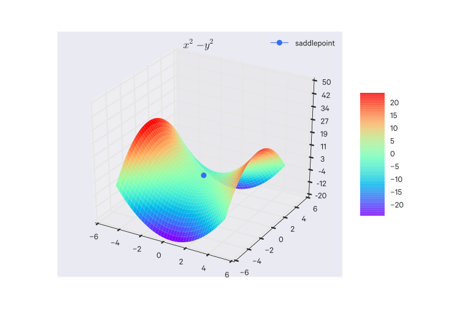

### Cost functions

So we have our training set $\{ (x^{(1)}, y^{(1)}), (x^{(2)}, y^{(2)}), \dots, (x^{(m)}, y^{(m)}) \}$ where $y \in \{0, 1\}$ and with the hypothesis function from before.

Here is the cost function for _linear_ regression:

$$ J(\theta) = \frac{1}{m} \sum^m_{i=1} \frac{1}{2} (h_{\theta}(x^{(i)}) - y^{(i)})^2 $$

Note that the $\frac{1}{2}$ is introduced for convenience, so that the square exponent cancels out when we differentiate. Introducing an extra constant doesn't affect the result.

Note that now the $\frac{1}{2m}$ has been split into $\frac{1}{m}$ and $\frac{1}{2}$.

We can extract $\frac{1}{2} (h_{\theta}(x^{(i)}) - y^{(i)})^2$ and call it $\text{Cost}(h_{\theta}(x), y)$.

The cost function for logistic regression is different than that used for linear regression because the hypothesis function of logistic regression causes $J(\theta)$ to be _non-convex_, that is, look something like the following with many local optima, making it hard to converge on the global minimum.

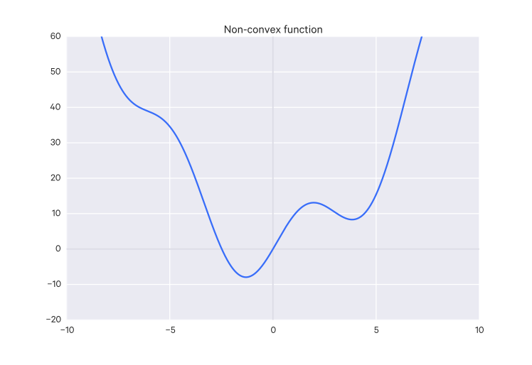

So we want to find a way to define $\text{Cost}(h_{\theta}(x), y)$ such that it gives us a convex $J(\theta)$. We will use:

$$
\text{Cost}(h_{\theta}(x), y) =
\begin{cases}
-log(h_{\theta}(x)) & \text{if $y$ = 1} \\
-log(1 - h_{\theta}(x)) & \text{if $y$ = 0}
\end{cases}
$$

Some properties of this function is that if $y = h_{\theta}(x)$ then $\text{Cost} = 0$, and as $h_{\theta}(x) \to 0$, $\text{Cost} \to \infty$.

We can rewrite $\text{cost}$ in a form more conducive to gradient descent:

$$
\text{Cost}(h_{\theta}(x), y) = -y log(h_{\theta}(x)) - (1-y)log(1-h_{\theta}(x))
$$

So our entire cost function is:

$$
J(\theta) = -\frac{1}{m} [\sum^m_{i=1}y^{(i)}log(h_{\theta}(x^{(i)})) + (1-y^{(i)})log(1-h_{\theta}(x^{(i)}))]
$$

You could use other cost functions for logistic regression, but this one is derived from the principle of maximum likelihood estimation and has the nice property of being convex, so this is the one that basically everyone uses for logistic regression.

Then we can calculate $min_{\theta}J(\theta)$ with gradient descent by repeating and simultaneously updating:

$$
\begin{aligned}
\theta_j &:= \theta_j - \alpha \sum^m_{i=1}(h_{\theta}(x^{(i)}) - y^{(i)}) \cdot x_j^{(i)}
\end{aligned}
$$

This looks exactly the same as the linear regression gradient descent algorithm, but it is different because $h_{\theta}(x)$ is now the nonlinear $h_{\theta}(x) = \frac{1}{1+e^{\theta^Tx}}$. Still, the previous methods for gradient descent (feature scaling and learning rate adjustment) apply here.

### Gradient Descent

_Gradient descent_ is an optimization algorithm for finding parameter values which minimize a cost function.

Gradient descent perhaps the most common optimization algorithm in machine learning.

So we have some cost function $J(\theta_0, \theta_1, \dots, \theta_n)$ and we want to minimize it.

The general approach is:

- Start with some $\theta_0, \theta_1, \dots, \theta_n$.
- Changing $\theta_0, \theta_1, \dots, \theta_n$ in some increment/step to reduce $J(\theta_0, \theta_1, \dots, \theta_n)$ as much as possible.
- Repeat the previous step until convergence on a minimum (hopefully)

#### Gradient descent algorithm

Repeat the following until convergence:
(Note that := is the assignment operator.)

$$ \theta_j := \theta_j - \alpha\frac{\partial}{\partial\theta_j}J(\theta_0, \theta_1, \dots, \theta_n) $$

For each $j$ in $n$.

Every $\theta_j$ is updated _simultaneously_. So technically, you'd calculate this value for each $j$ in $n$ and only after they are all updated would you actually update each $\theta_j$.

For example, if the right-hand side of that equation was a function `func(j, t0, t1)`, you would implement it like so (example is $n=2$):

    temp_0 = func(0, theta_0, theta_1)
    temp_1 = func(1, theta_0, theta_1)
    theta_0 = temp_0
    theta_1 = temp_1

$\alpha$ is the _learning rate_ and tells how large a step/increment to change the parameters by.

Learning rates which are too small cause the gradient descent to go slowly. Learning rates which are too large can cause the gradient descent to overshoot the minimum, and in those cases it can fail to converge or even diverge.

The partial derivative on the right is just the rate of change from the current value.

### Normal Equation

The normal equation is an approach which allows for the direct determination of an optimal $\theta$ without the need for an iterative approach like gradient descent.

With calculus, you find the optimum of a function by calculating where its derivatives equal 0 (the intuition is that derivatives are rates of change, when the rate of change is zero, the function is "turning around" and is at a peak or valley).

So we can take the same cost function we've been using for linear regression and take the partial derivatives of the cost function $J$ with respect to every parameter of $\theta$ and then set each of these partial derivatives to 0:

$$ J(\theta_0, \theta_1, \dots, \theta_m) = \frac{1}{2m} \sum^m_{i=1} (h_{\theta}(x^{(i)}) - y^{(i)})^2 $$

And for each $j$

$$ \frac{\partial}{\partial \theta_j} J(\theta) = \dots = 0 $$

Then solve for $\theta_0, \theta_1, \dots, \theta_m$.

The fast way to do this is to construct a matrix out of your features, including a column for $x_0 = 1$ (so it ends up being an $m \times (n+1)$ dimensional matrix) and then construct a vector out of your target variables $y$ (which is an $m$-dimensional vector):

If you have $m$ examples, $(x^{(1)}, y^{(1)}), \dots, (x^{(m)}, y^{(m)})$, and $n$ features and then include $x_0 = 1$, you have the following feature vectors:

$$
x^{(i)} =
\begin{bmatrix}
x^{(i)}_0 \\
x^{(i)}_1 \\
x^{(i)}_2 \\
\vdots \\
x^{(i)}_n
\end{bmatrix}
\in \mathbb R^{n+1}
$$

From which we can construct $\mathbf X$, known as the _design matrix_:

$$
\mathbf X =
\begin{bmatrix}
(x^{(1)})^T \\
(x^{(2)})^T \\
\vdots \\
(x^{(m)})^T
\end{bmatrix}
$$

That is, the design matrix is composed of the transposes of the feature vectors for all the training examples. Thus a column in the design matrix corresponds to a feature, and each row corresponds to an example.

Typically, all examples have the same length, but this may not necessarily be the case. You may have, for instance, images of different dimensions you wish to classify. This kind of data is _heterogeneous_.

And then the vector $y$ is the just all of the labels from your training data:

$$
y =
\begin{bmatrix}
y^{(1)} \\
y^{(2)} \\
\vdots \\
y^{(m)}
\end{bmatrix}
$$

Then you can calculate the $\theta$ vector which minimizes your cost function like so:

$$ \theta = (X^T X)^{-1} X^T y $$

With this method, feature scaling isn't necessary.

Note that it's possible that $X^TX$ is not invertible (that is, it is _singular_, also called _degenerate_), but this is usually due to redundant features (e.g. having a feature in feet and in meters; they communicate the same information) or having too many features (e.g. $m \leq n$), in which case you should delete some features or use _regularization_.

Programs which calculate the inverse of a matrix often have a method which allows it to calculate the optimal $\theta$ vector even if $X^T X$ is not invertible.

### Deciding between Gradient Descent and the Normal Equation

- Gradient Descent
    - requires that you choose $\alpha$
    - needs many iterations
    - works well when $n$ is large
- Normal Equation
    - don't need to choose $\alpha$
    - don't need to iterate
    - slow if $n$ is very large (computing $(X^TX)^{-1}$ has a complexity of $O(n^3)$), but is usually ok up until around $n = 10000$

Also note that for some learning algorithms, the normal equation is not applicable, whereas gradient descent still works.

### Advanced optimization algorithms

There are other advanced optimization algorithms, such as:

- Conjugate gradient
- BFGS
- L-BFGS

These shouldn't be implemented on your own since they require an advanced understanding of numerical computing, even just to understand what they're doing.

They are more complex, but (in the context of machine learning) there's no need to manually pick a learning rate $\alpha$ and they are often faster than gradient descent. So you can take advantage of them via some library which has them implemented (though some implementations are better than others).

## Preprocessing

Prior to applying a machine learning algorithm, data almost always must be _preprocessed_, i.e. prepared in a way that helps the algorithm perform well (or in a way necessary for the algorithm to work at all).

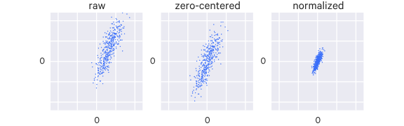

### Feature selection

Good features:

- lead to data compression
- retain relevant information
- are based on expert domain knowledge

Common mistakes:

- trying to automate feature selection
- not paying attention to data-specific quirks
- throwing away information unnecessarily

The model where you include all available features is called the __full model__. But sometimes including all features can hurt prediction accuracy.

There are a few feature selection strategies that can be used.

One class of selection strategies is called __stepwise__ selection because they iteratively remove or add one feature at a time, measuring the goodness of fit for each. The two approaches here are the __backward-elimination__ strategy which begins with the full model and removes one feature at a time, and the __forward-selection__ strategy which is the reverse of backward-elimination, starting with one feature and adding the rest one at a time. These two strategies don't necessarily lead to the same model.

### Feature engineering

Your data may have features explicitly present, e.g. a column in a database. But you can also design or _engineer_ new features by combining these explicit features or through observing patterns on your own in the data that haven't yet been explicitly encoded. We're doing a form of this in polynomial regression above by encoding the polynomials as new features.

#### Representation

A very important choice in machine learning is how you represent the data. What are its salient features, and in what form is it best presented? Each field in the data (e.g. column in the table) is a __feature__ and a great deal of time is spent getting this representation right. The best machine learning algorithms can't do much if the data isn't represented in a way suited to the task at hand.

Sometimes it's not clear how to represent data. For instance, in identifying an image of a car, you may want to use a wheel as a feature. But how do you define a wheel in terms of pixel values?

__Representation learning__ is a kind of machine learning in which representations themselves can be learned.

An example representation learning algorithm is the __autoencoder__. It's a combination of an _encoder_ function that converts input data into a different representation and a _decoder_ function which converts the new representation back into its original format.

Successful representations separate the _factors of variations_ (that is, the contributors to variability) in the observed data. These may not be explicit in the data, "they may exist either as unobserved objects or forces in the physical world that affect the observable quantities, or they are constructs in the human mind that provide useful simplifying explanations or inferred causes of the observed data." ([_Deep Learning_](http://www.iro.umontreal.ca/~bengioy/dlbook)).

#### Deep Learning

Deep learning builds upon representation learning. It involves having the program learn some hierarchy of concepts, such that simpler concepts are used to construct more complicated ones. This hierarchy of concepts forms a deep (many-layered) graph, hence "deep learning".

With deep learning we can have simpler representations aggregate into more complex abstractions.

A basic example of a deep learning model is the multilayer perceptron (MLP), which is essentially a function composed of simpler functions (layers); each function (i.e. layer) can be thought of as taking the input and outputting a new representation of it.

For example, if we trained a MLP for image recognition, the first layer may end up learning representations of edges, the next may see corners and contours, the next may identify higher level features like faces, etc.

### Scaling (normalization)

If you design your features such that they are on a similar scale, gradient descent can converge more quickly.

For example, say you are developing a model for predicting the price of a house. Your first feature may be the area, ranging from 0-2000 sqft, and your second feature may be the number of bedrooms, ranging from 1-5.

These two ranges are very disparate, causing the contours of the cost function to be such that the gradient descent algorithm jumps around a lot trying to find an optimum.

If you _scale_ these features such that they share the same (or at least a similar) range, you avoid this problem.

More formally, with feature scaling you want to get every feature into approximately a $-1 \leq x_i \leq 1$ range (it doesn't necessarily have to be between -1 and 1, just so long as there is a consistent range across your features).

With feature scaling, you could also apply _mean normalization_, where you replace $x_i$ with $x_i - \mu_i$ (that is, replace the value of the $i$th feature with its value minus the mean value for that feature) such that the mean of that feature is shifted to be about zero (note that you wouldn't apply this to $x_0 = 1$).

### Mean subtraction

Mean subtraction centers the data around the origin (i.e. it "zero-centers" it), simply by subtracting each feature's mean from itself.

### Dimensionality Reduction

Sometimes some of your features may be redundant. You can combine these features in such a way that you project your higher dimension representation into a lower dimension representation while minimizing information loss. With the reduction in dimensionality, your algorithms will run faster.

The most common technique for dimensionality reduction is _principal component analysis_ (PCA), although other techniques, such as non-negative matrix factorization (NMF) can be used.

#### Principal Component Analysis (PCA)

Say you have some data. This data has two dimensions, but you could more or less capture it in one dimension:

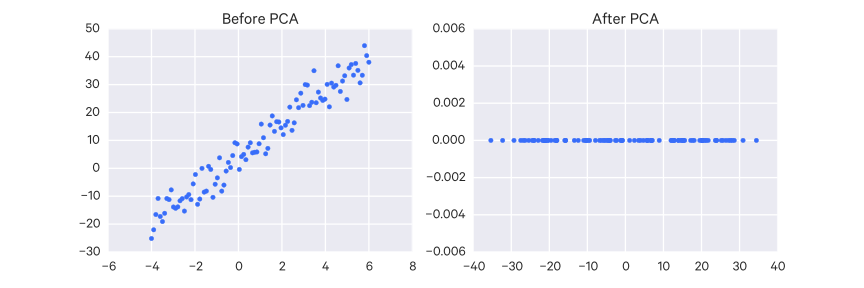

Most of the variability of the data happens along that axis.

This is basically what PCA does.

PCA is the most commonly used algorithm for dimensionality reduction. PCA tries to identify a lower-dimensional surface to project the data onto such that the square _projection error_ is minimized.

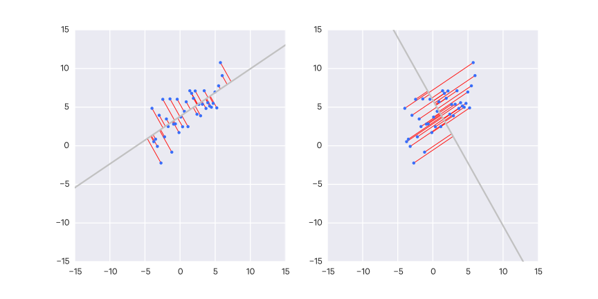

PCA might project the data points onto the green line on the left. The projection error are the blue lines. Compare to the line on the right - PCA would not project the data onto that line since the projection error is much larger for that line.

This example is going from 2D to 1D, but you can use PCA to project from any $n$-dimension to a lower $k$-dimension. Using PCA, we find some $k$ vectors and project our data onto the linear subspace spanned by this set of $k$ vectors.

Note that this is different than linear regression, though the example might look otherwise. In PCA, the projection error is orthogonal to the line in question. In linear regression, it is vertical to the line. Linear regression also favors the target variable $y$ whereas PCA makes no such distinction.

Prior to PCA you should perform mean normalization (i.e. ensure every feature has zero mean) on your features and scale them.

First you compute the _covariance matrix_, which is denoted $\Sigma$ (same as summation, unfortunately):

$$
\Sigma = \frac{1}{m} \sum^n_{i=1}(x^{(i)})(x^{(i)})^T
$$

Then, you compute the _eigenvectors_ of the matrix $\Sigma$ using _singular value decomposition_:

$$
[U, S, V] = \text{svd}(\Sigma)
$$

The resulting $U$ matrix will be an $n \times n$ orthogonal matrix which provides the projected vectors you're looking for, so take the first $k$ column vectors of $U$. This $n \times k$ matrix can be called $U_{\text{reduce}}$, which you then transpose to get these vectors as rows, resulting in a $k \times n$ matrix which you then multiply by your feature matrix.

So how do you choose $k$, the number of principal components?

One way to choose $k$ is so that most of the variance is retained.

If the average squared projection error (which is what PCA tries to minimize) is:

$$
\frac{1}{m}\sum^m_{i=1} ||x^{(i)} - x^{(i)}_\text{approx}||^2
$$

And the total variation in the data is given by:

$$
\frac{1}{m} \sum^m_{i=1} ||x^{(i)}||^2
$$

Then you would choose the smallest value of $k$ such that:

$$
\frac{\frac{1}{m}\sum^m_{i=1} ||x^{(i)} - x^{(i)}_\text{approx}||^2}{\frac{1}{m} \sum^m_{i=1} ||x^{(i)}||^2} \leq 0.01
$$

That is, so that 99% of variance is retained.

This procedure for selecting $k$ is made much simpler if you use the $S$ matrix from the $\text{svd}(\Sigma)$ function.

The $S$ matrix's only non-zero values are along its diagonal, $S_{11}, S_{22}, \dots, S_{nn}$. Using this you can instead just calculate:

$$
1 - \frac{\sum^k_{i=1} S_{ii}}{\sum^n_{i=1} S_{ii}} \leq 0.01
$$

Or, to put it another way:

$$
\frac{\sum^k_{i=1} S_{ii}}{\sum^n_{i=1} S_{ii}} \geq 0.99
$$

In practice, you can reduce the dimensionality quite drastically, such as by 5 or 10 times, such as from 10,000 features to 1,000, and retain variance.

But you should not use PCA prematurely - first try an approach without it, then later you can see if it helps.

The process of using principal component analysis (PCA) to reduce dimensionality of data is called _factor analysis_.

In factor analysis, the retained principal components are called _common factors_ and their correlations with the input variables are called _factor loadings_.

PCA becomes more reliable the more data you have. The number of examples must be larger than the number of variables in the input matrix. The assumptions of linear correlation must hold as well (i.e. that the variables must be linearly related).

#### PCA Whitening

You can go a step further with the resulting $U$ matrix (with only the $k$ chosen components) with _PCA whitening_, which can improve the training process.

PCA whitening is used to decorrelate features and equalize the variance of the features.

Thus the first step is to decorrelate the original data $X$, which is accomplished by rotating it:

$$
X_{\text{rotated}} = U \cdot X
$$

Then the data is normalized to have a variance of 1 for all of its components. To do so we just divide each component by the square root of its eigenvalue. An epsilon value is included to prevent division by zero:

$$
X_{\text{whitened}} = \frac{X_{\text{rotated}}}{\sqrt(S + \epsilon)}
$$

### Bagging ("Bootstrap aggregating")

Basic idea: Generate more data from your existing data by resampling

> Bagging (stands for Bootstrap Aggregation) is the way decrease the variance of your prediction by generating additional data for training from your original dataset using combinations with repetitions to produce multisets of the same cardinality/size as your original data. By increasing the size of your training set you can't improve the model predictive force, but just decrease the variance, narrowly tuning the prediction to expected outcome. - <http://stats.stackexchange.com/a/19053/55910>

## Linear Regression

### Univariate (simple) Linear Regression

_Univariate linear regression_ or _simple linear regression_ (SLR) is linear regression with a single variable.

In univariate linear regression, we have one input variable $x$.

The hypothesis takes the form:

$$ h_{\theta}(x) = \theta_0 + \theta_1 x $$

Where the $\theta_i$s are the _parameters_ that the learning algorithm learns.

This should look familiar: it's just a line.

### How are the parameters determined?

The general idea is that you want to choose your parameters so that $h_{\theta}(x)$ is close to $y$ for your training examples $(x,y)$. This can be written:

$$ \sum^m_{i=1} (h_{\theta}(x^{(i)}) - y^{(i)})^2 $$

To the math easier, you multiply everything by $\frac{1}{2m}$ (this won't affect the resulting parameters):

$$ \frac{1}{2m} \sum^m_{i=1} (h_{\theta}(x^{(i)}) - y^{(i)})^2 $$

This is the _cost function_ (or _objective function_). In this case, we call it $J$, which looks like:

$$ J(\theta_0, \theta_1) = \frac{1}{2m} \sum^m_{i=1} (h_{\theta}(x^{(i)}) - y^{(i)})^2 $$

Here it is the _squared error function_ - it is probably the most commonly used cost function for regression problems.

The squared error loss function is not the only loss function available. There are a variety you can use, and you can even come up with your own if needed. Perhaps, for instance, you want to weigh positive errors more than negative errors.

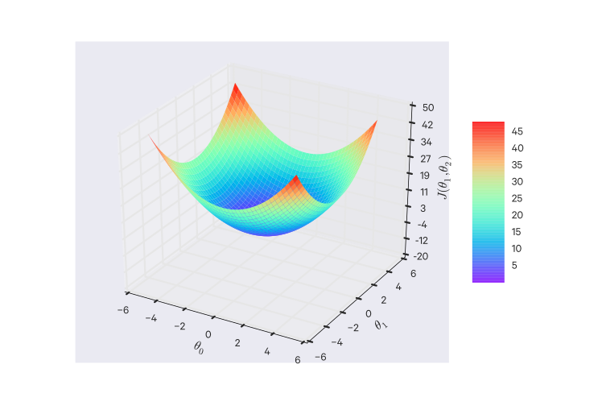

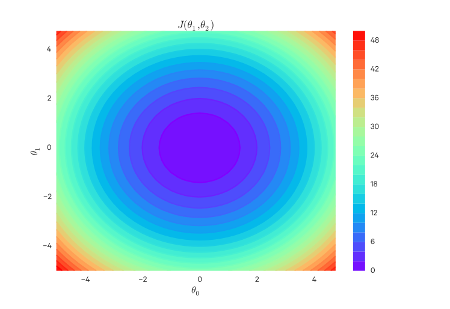

We want to find $(\theta_0, \theta_1)$ to _minimize_ $J(\theta_0, \theta_1)$.

#### Gradient Descent for Univariate Linear Regression

For univariate linear regression, the derivatives are:

$$
\begin{aligned}
\frac{\partial}{\partial\theta_0}J(\theta_0, \theta_1) &= \frac{1}{m}\sum^m_{i=1}(h_{\theta}(x^{(i)}) - y^{(i)}) \\
\frac{\partial}{\partial\theta_1}J(\theta_0, \theta_1) &= \frac{1}{m}\sum^m_{i=1}(h_{\theta}(x^{(i)}) - y^{(i)}) \cdot x^{(i)}
\end{aligned}
$$

so overall, the algorithm involves repeatedly updating:

$$
\begin{aligned}
\theta_0 &:= \theta_0 - \alpha \frac{1}{m}\sum^m_{i=1}(h_{\theta}(x^{(i)}) - y^{(i)}) \\
\theta_1 &:= \theta_1 - \alpha \frac{1}{m}\sum^m_{i=1}(h_{\theta}(x^{(i)}) - y^{(i)}) \cdot x^{(i)}
\end{aligned}
$$

Remember that the $\theta$ parameters are updated _simultaneously_.

Note that because we are summing over _all_ training examples for each step, this particular type of gradient descent is known as _batch gradient descent_. There are other approaches which only sum over a subset of the training examples for each step.

Univariate linear regression's cost function is always convex ("bowl-shaped"), which has only one optimum, so gradient descent int his case will always find the global optimum.

### Multivariate linear regression

_Multivariate_ linear regression is simply linear regression with multiple variables. This technique is for using multiple features with linear regression.

Say we have:

- $n$ = number of features
- $x^{(i)}$ = the input features of the $i$th training example
- $x_j^{(i)}$ = the value of feature $j$ in the $i$th training example

Instead of the simple linear regression model we can use a __generalized linear model__ (GLM). That is, the hypothesis $h$ will take the form of:

$$ h_{\theta}(x) = \theta_0 + \theta_1 x_1 + \theta_2 x_2 + \dots + \theta_n x_n $$

For convenience of notation, you can define $x_0 = 1$ and notate your features and parameters as zero-indexed $n + 1$-dimensional vectors:

$$
x =
\begin{bmatrix}
x_0 \\ x_1 \\ x_2 \\ \vdots \\ x_n
\end{bmatrix}
,
\theta =
\begin{bmatrix}
\theta_0 \\ \theta_1 \\ \theta_2 \\ \vdots \\ \theta_n
\end{bmatrix}
$$

And the hypothesis can be re-written as:

$$ h_{\theta}x = \theta^Tx $$

Sometimes in multiple regression you may have predictor variables which are correlated with one another; we say that these predictors are __collinear__.

#### Gradient descent with Multivariate Linear Regression

The previous gradient descent algorithm for univariate linear regression is just generalized (this is still repeated and simultaneously updated):

$$
\begin{aligned}
\theta_j &:= \theta_j - \alpha \frac{1}{m}\sum^m_{i=1}(h_{\theta}(x^{(i)}) - y^{(i)}) \cdot x_j^{(i)}
\end{aligned}
$$

### Example implementation of linear regression with gradient descent

    """
    - X = feature vectors
    - y = labels/target variable
    - theta = parameters
    - hyp = hypothesis (actually, the vector computed from the hypothesis function)
    """
    import numpy as np

    def cost_function(X, y, theta):
        """
        This isn't used, but shown for clarity
        """
        m = y.size
        hyp = np.dot(X, theta)
        sq_err = sum(pow(hyp - y, 2))
        return (0.5/m) * sq_err

    def gradient_descent(X, y, theta, alpha=0.01, iterations=10000):
        m = y.size
        for i in range(iterations):
            hyp = np.dot(X, theta)
            for i, p in enumerate(theta):
                temp = X[:,i]
                err = (hyp - y) * temp
                cost_function_derivative = (1.0/m) * err.sum()
                theta[i] = theta[i] - alpha * cost_function_derivative
        return theta

    if __name__ == '__main__':
        def true_function(X):
            # Create random parameters for X's dimensions, plus one for x0.
            true_theta = np.random.rand(X.shape[1] + 1)
            return true_theta[0] + np.dot(true_theta[1:], X.T), true_theta

        # Create some random data
        n_samples = 20
        n_dimensions = 5
        X = np.random.rand(n_samples, n_dimensions)
        y, true_theta = true_function(X)

        # Add a column of 1s for x0
        ones = np.ones((n_samples, 1))
        X = np.hstack([ones, X])

        # Initialize parameters
        theta = np.zeros((n_dimensions+1))

        # Split data
        X_train, y_train = X[:-1], y[:-1]
        X_test, y_test = X[-1:], y[-1:]

        # Estimate parameters
        theta = gradient_descent(X_train, y_train, theta, alpha=0.01, iterations=10000)

        # Predict
        print('true', y_test)
        print('pred', np.dot(X_test, theta))

        print('true theta', true_theta)
        print('pred theta', theta)

### Outliers

Outliers can pose a problem for fitting a regression line. Outliers that fall horizontally away from the rest of the data points can influence the line more, so they are called points with __high leverage__. Any such point that actually does influence the line's slope is called an __influential point__. You can examine this effect by removing the point and then fitting the line again and seeing how it changes.

Outliers should only be removed with good reason - they can still be useful and informative and a good model will be able to capture them in some way.

### Polynomial Regression

Your data may not fit a straight line and might be better described by a polynomial function, e.g. $\theta_0 + \theta_1 x + \theta_2 x^2$ or $\theta_0 + \theta_1 x + \theta_2 x^2 + \theta_3 x^3$.

A trick to this is that you can write this in the form of plain old multivariate linear regression. You would, for example, just treat $x$ as a feature $x_1$, $x^2$ as another feature $x_2$, $x^3$ as another feature $x_3$, and so on:

$$ \theta_0 + \theta_1 x_1 + \theta_2 x_2 + \theta_3 x_3 + \dots + \theta_n x_n $$

Note that in situations like this, feature scaling is very important because these features' ranges differ by a lot due to the exponents.

## Logistic Regression

Logistic regression is a common approach to classification. The name "regression" may be a bit confusing - it is a classification algorithm, though it returns a continuous value. In particular, it returns the probability of the positive class; if that probability is $\geq 0.5$, then the positive label is returned.

Logistic regression outputs a value between zero and one (that is, $0 \leq h_{\theta}(x) \leq 1$).

Say we have our hypothesis function

$$ h_{\theta}(x) = \theta^T x $$

With logistic regression, we apply an additional function $g$ :

$$ h_{\theta}(x) = g(\theta^T x) $$

where

$$ g(z) = \frac{1}{1+e^{-z}} $$

This function is known as the _sigmoid_ function, also known as the _logistic_ function, with the form:

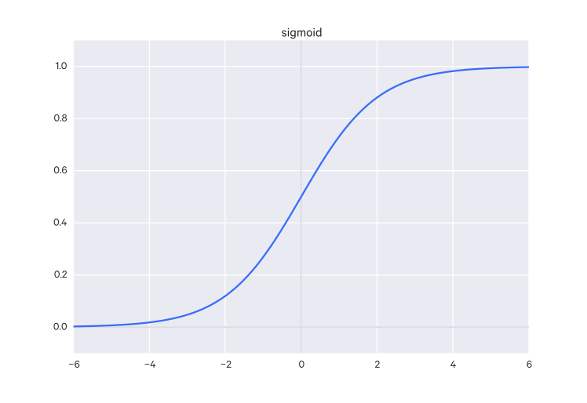

So in logistic regression, the hypothesis ends up being:

$$ h_{\theta}(x) = \frac{1}{1+e^{\theta^Tx}} $$

The output of the hypothesis is interpreted as the probability of the given input belonging to the positive class. that is:

$$ h_{\theta}(x) = P(y=1 | x; \theta) $$

Which is read: "the probability that $y=1$ given $x$ as parameterized by $\theta$".

Since we are classifying input, we want to output a label, not a continuous value. So we might say $y = 1$ if $h_{\theta}(x) \geq 0.5$ and $y = 0$ if $h_{\theta}(x) < 0.5$. The line that forms this divide is an example of a _decision boundary_. Note that decision boundaries can be non-linear as well (e.g. they could be a circle or something).

#### more on Logistic Regression

Logistic regression is also a GLM - you're fitting a line which models the probability of being in the positive class. We can use the Bernoulli distribution since it models events with two possible outcomes and is parameterized by only the probability of the positive outcome, $p$. Thus our line would look something like:

$$
p_i = \beta_0 + \beta_1 x_1 + \dots + \beta_n x_n + \epsilon
$$

But to represent a probability, $y$ values must be bound to $[0, 1]$. Currently, our model can be linear or polynomial and thus can output any continuous value. So we have to apply a transformation to constrain $y$; we do so by applying a __logit transformation__:

$$
logit(p) = \log(\frac{p}{1-p}) = x
$$

The $\frac{p}{1-p}$ term constraints the output to be positive.
The $\log$ operation constrains the values to $[0, 1]$.

The inverse of the logit transformation is:

$$
p = \frac{1}{1+\exp(-x)}
$$

So the model is now:

$$
logit(p) = \beta_0 + \beta_1 x_1 + \dots + \beta_n x_n \epsilon
$$

So the likelihood here is:

$$
L(y|p) = \prod^n_{i=1} p_i^{y_i}(1-p_i)^{1-y_i}
$$

And the log likelihood then is:

$$
l(y|p) = \sum^n_{i=1} y_i \log(p_i) + (1-y_i) \log(1-p_i)
$$

#### even more on Logistic Regression

Linear regression is good for explaining continuous dependent variables. But for discrete variables, linear regression gives ambiguous results - what does a fractional result mean? It can't be interpreted as a probability because linear regression models are not bound to $[0, 1]$ as probability functions must be.

When dealing with boolean/binary dependent variables you can use __logistic regression__. When dealing with non-binary discrete dependent variables, you can use __Poisson regression__ (which is a GLM that uses the log link function).

So we expect the logistic regression function to output a probability. In linear regression, the model can output any value, not bound to $[0, 1]$. So for logistic regression we apply a transformation, most commonly the __logit transformation__, so that our resulting values can be interpreted as probability:

$$
\begin{aligned}
\text{transformation}(p) &= \beta_0 + \beta_1 x_1 + \dots + \beta_n x_n \\
\text{logit}(p) &= \log_e (\frac{p}{1 - p})
\end{aligned}
$$

So if we solve the original regression equation for $p$, we end up with:

$$
p = \frac{e^{\beta_0 + \beta_1 x_1 + \dots + \beta_n x_n}}{1 + e^{\beta_0 + \beta_1 x_1 + \dots + \beta_n x_n}}
$$

Logistic regression does not have a closed form solution - that is, it can't be solved in a finite number of operations, so we must estimate its parameters using other methods, more specifically, we use iterative methods. Generally the goal is to find the __maximum likelihood estimate__ (MLE), which is the set of parameters that maximizes the likelihood of the data. So we might start with random guesses for the parameters, the compute the likelihood of our data (that is, we can compute the probability of each data point; the likelihood of the data is the product of these individual probabilities) based on these parameters. We iterate until we find the parameters which maximize this likelihood.

### One-vs-All

The technique of _one-vs-all_ (or _one-vs-rest_) involves dividing your training set into multiple binary classification problems, rather than as a single multiclass classification problem.

For example, say you have three classes 1,2,3. Your first binary classifier will distinguish between class 1 and classes 2 and 3,, your second binary classifier will distinguish between class 2 and classes 1 and 3, and your final binary classifier will distinguish between class 3 and classes 1 and 2.

Then to make the prediction, you pick the class $i$ which maximizes $max_i h_{\theta}^{(i)}(x)$.

## Softmax regression

Softmax regression generalizes logistic regression to beyond binary classification (i.e. multinomial classification; that is, there are more than just two possible classes). Logistic regression is the reduced form of softmax regression where $k=2$ (thus logistic regression is sometimes caled a "binary Softmax classifier"). As is with logistic regression, softmax regression outputs probabilities for each class. As a generalization of logistic regression, softmax regression can also be expressed as a generalized linear model. It generally uses a cross-entropy loss function.

### Hierarchical Softmax

In the case of many, many classes, the _hierarchical_ variant of softmax may be preferred. In hierarchical softmax, the labels are structured as a hierarchy (a tree). A Softmax classifier is trained for each node of the tree, to distinguish the left and right branches.

## Generalized linear models (GLMs)

There is a class of machine learning models known as _generalized linear models_ (GLMs) because they are expressed as a linear combination of parameters, i.e.

$$
\hat y = \theta_0 + \theta_1 x_1 + \dots + \theta_n x_n
$$

We can use linear models for non-regression situations, as we do with logistic regression - that is, when the output variable is not an unbounded continuous value directly computed from the inputs (that is, the output variable is not a linear function of the inputs), such as with binary or other kinds of classification. In such cases, the linear models we used are called _generalized linear models_. Like any linear function, we get some value from our inputs, but we then also apply a _link function_ which transforms the resulting value into something we can use. Another way of putting it is that these link functions allow us to _generalize_ linear models to other situations.

Linear regression also assumes _homoscedasticity_; that is, that the variance of the error is uniform along the line. GLMs do not need to make this assumption; the link function transforms the data to satisfy this assumption.

For example, say you want to predict whether or not someone will buy something - this is a binary classification and we want either a 0 or a 1. We might come up with some linear function based on income and number of items purchased in the last month, but this won't give us a 0/no or a 1/yes, it will give us some continuous value. So then we apply some link function of our choosing which turns the resulting value to give us the probability of a 1/yes.

Linear regression is also a GLM, where the link function is the identity function.

Logistic regression uses the logit link function.

Logistic regression is a type of models called __generalized linear models__ (GLM), which involves two steps:

1. Model the response variable with a probability distribution.
2. Model the distribution's parameters using the predictor variables and a special form of multiple regression.

This probability distribution is taken from the exponential family of probability distributions, which includes the normal, Bernoulli, beta, gamma, Dirichlet, and Poisson distributions (among others). A distribution is in the exponential family if it can be written in the form:

$$
P(y|n) = b(y) \exp(\eta^T T(y) - a(\eta))
$$

$\eta$ is known as the __natural parameter__ or the __canonical parameter__ of the distribution, $T(y)$ is the __sufficient statistics__, which is often just $T(y) = y$. $a(\eta)$ is the __log partition function__.

We can set $T, a, b$ to define a family of distributions; this family is parameterized by $\eta$, with different values giving different distributions within the family.

For instance, the Bernoulli distribution is in the exponential family, where

$$
\begin{aligned}
\eta &= \log(\frac{p}(1-p)) \\
T(y) &= y \\
a(\eta) &= -\log(1-p) \\
b(y) &= 1
\end{aligned}
$$

Same goes for the Gaussian distribution, where

$$
\begin{aligned}
\eta &= \mu \\
T(y) &= y \\
a(\eta) &= \frac{\mu^2}{2} \\
b(y) &= \frac{1}{\sqrt(2\pi)}\exp(\frac{-y^2}{2})
\end{aligned}
$$

Note that with linear models, you should avoid __extrapolation__, that is, estimating values which are outside the original data's range. For example, if you have data in some range $[x_1, x_n]$, you have no guarantee that your model behaves correctly at $x < x_1$ and $x > x_n$.

### Linear Mixed Models (Mixed Models/Hierarchical Linear Models)

In a linear model there may be _mixed effects_, which includes _fixed_ and _random_ effects. Fixed effects are variables in your model where their coefficients are fixed (non-random). Random effects are variables in your model where their coefficients are random.

For example, say you want to create a model for crop yields given a farm and amount of rainfall. We have data from several years and the same farms are represented multiple times throughout. We could consider that some farms may be better at producing greater crop yields given the same amount of rainfall as another farm. So we expect that samples from different farms will have different variances - e.g. if we look at just farm A's crop yields, that sample would have different variance than if we just looked at farm B's crop yields. In this regard, we might expect that models for farm A and farm B will be somewhat different.

The naive approach would be to just ignore differences between farms and consider only rainfall as a fixed effect (i.e. with a fixed/constant coefficient). This is sometimes called "pooling" because we've lumped everything (in our case, all the farms) together.

We could create individual models for each farm ("no pooling") but perhaps for some farms we only have one or two samples. For those farms, we'd be building very dubious models since their sample sizes are so small. The information from the other farms are still useful for giving us more data to work with in these cases, so no pooling isn't necessarily a good approach either.

We can use a mixed model ("partial pooling") to capture this and make it so that the rainfall coefficient random, varying by farm.

#### more...from another source

We may run into situations like the following:

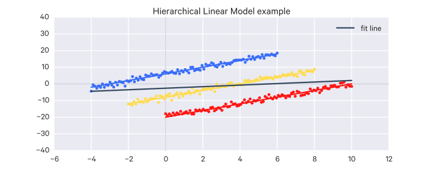

Where our data seems to encompass multiple models (the red, green, blue, and black ones going up from left to right), but if we try to model them all simultaneously, we get a complete incorrectly model (the dark grey line going down from left to right).

Each of the true lines (red, green, blue, black) may come from distinct _units_, i.e. each could represent a different part of the day or a different US state, etc. When there are different effects for each unit, we say that there is _unit heterogeneity_ in the data.

In the example above, each line has a different intercept. But the slopes could be different, or both the intercepts and slopes could be different:

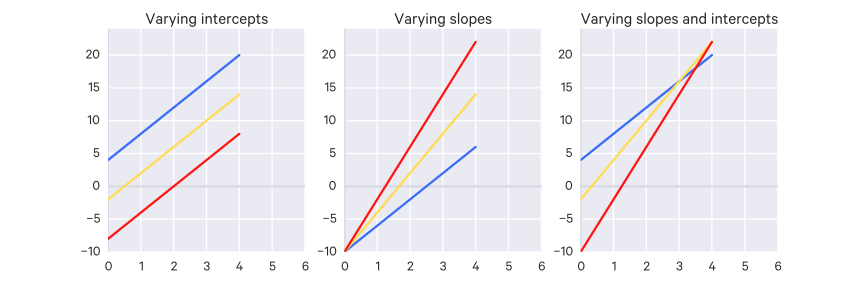

In this case, we use a random-effects model because some of the coefficients are random.

For instance, in the first example above, the intercepts varied, in which case the intercept coefficient would be replaced with a random variable $\alpha^i$ drawn from the normal distribution:

$$
y = \alpha^i + \beta^i x + \epsilon
$$

Or in the case of the slopes varying, we'd say that $\beta^i$ is a random variable drawn from the normal distribution. In each case, $\alpha$ is the mean intercept and $\beta$ is the mean slope.

When both slope and intercept vary, we draw them together from a multivariate normal distribution since they may have some relation, i.e.

$$
\begin{bmatrix}
\alpha_i \\
\beta_i
\end{bmatrix}
\sim \Phi(\begin{bmatrix} \alpha \\ \beta \end{bmatrix}, \Sigma)
$$

Now consider when there are multiple levels of these effects that we want to model. For instance, perhaps there are differences across US states but also differences across US regions.

In this case, we will have a hierarchy of effects. Let's say only the intercept is affected - if we wanted to model the effects of US regions and US states on separate levels, then the $\alpha_i$ will be drawn from a distribution according to the US region, $\alpha_i \sim \Phi(\mu_{\text{region}}, \sigma^2_\alpha)$, and then the regional mean which parameterizes $\alpha_i$'s distribution is drawn from a distribution of regional means, $\mu_{\text{region}} \sim \Phi(\mu, \sigma_r^2)$.

## Support Vector Machines

SVMs can be powerful for learning non-linear functions and are widely-used.

With SVMs, the optimization objective is:

$$
min_{\theta} \sum^m_{i=1} [y^{(i)}\text{cost}_1(\theta^T x^{(i)}) + (1-y^{(i)}) \text{cost}_0(\theta^T x^{(i)})] + \frac{\lambda}{2} \sum^n_{j=1} \theta_j^2
$$

Where the term at the end is the regularization term. Note that this is quite similar to the objective function for logistic regression; we have just removed the $\frac{1}{m}$ term (removing it does not make a difference to our result because it is a constant) and substituted the log hypothesis terms for two new cost functions.

If we break up the logistic regression objective function into terms (that is, the first sum and the regularization term), we might write it as $A + \lambda B$.

The SVM objective is often instead notated by convention as $CA + B$. You can think of $C$ as $\frac{1}{\lambda}$. That is, where increasing $\lambda$ brings your parameters closer to zero, the regularization parameter $C$ has the opposite effect - as it grows, so do your parameters, and vice versa.

With that representation in mind, we can rewrite the objective by replacing the $\lambda$ with $C$ on the first term:

$$
min_{\theta} C \sum^m_{i=1} [y^{(i)}\text{cost}_1(\theta^T x^{(i)}) + (1-y^{(i)}) \text{cost}_0(\theta^T x^{(i)})] + \frac{1}{2} \sum^n_{j=1} \theta_j^2
$$

The SVM hypothesis is:

$$
h_{\theta}(x) =
\begin{cases}
1 & \text{if $\theta^T x \geq 0$} \\
0 & \text{otherwise}
\end{cases}
$$

SVMs are sometimes called _large margin_ classifiers.

Take the following data:

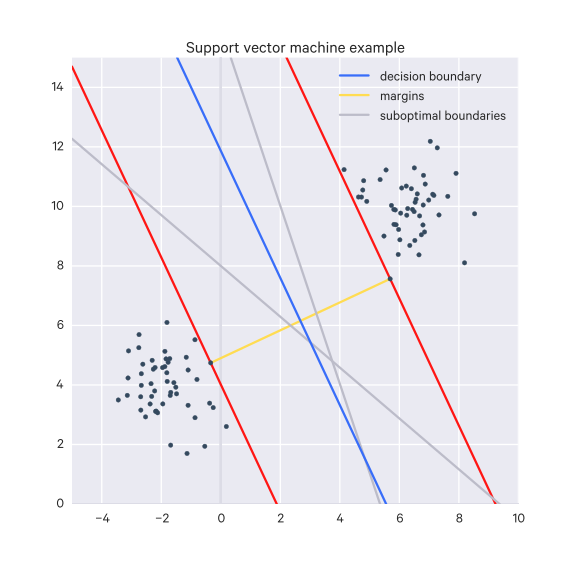

On the left, a few different lines separating the data are drawn. The optimal one found by SVM is the one in orange. It is the optimal one because it has the largest margins, illustrated by the red lines on the right (technically, the margin is orthogonal from the decision boundary _to_ those red lines). When $C$ is very large, SVM tries to maximize these margins.

However, outliers can throw SVM off if your regularization parameter $C$ is too large, so in those cases, you may want to try a smaller value for $C$.

### Kernels

_Kernels_ are the main technique for adapting SVMs to do complex non-linear classification.

A note on notation. Say your hypothesis looks something like:

$$
\theta_0 + \theta_1 x_1 + \theta_2 x_2 + \theta_3 x_1 x_2 + \theta_4 x_1^2 + \dots
$$

We can instead notate each non-parameter term as a feature $f$, like so:

$$
\theta_0 + \theta_1 f_1 + \theta_2 f_2 + \theta_3 f_3 + \theta_4 f_4 + \dots
$$

For SVMs, how do we choose these features?

What we can do is compute features based on $x$'s proximity to landmarks $l^{(1)}, l^{(2)}, l^{(3)}, \dots$. For each landmark, we get a feature:

$$
f_i = \text{similarity}(x, l^{(i)}) = exp(-\frac{||x-l^{(i)}||^2}{2 \sigma^2})
$$

Here, the $\text{similarity}(x, l^{(i)})$ function is the _kernel_, sometimes just notated $k(x, l^{(i)})$.

We have a choice in what kernel function we use; here we are using _Gaussian kernels_. In the Gaussian kernel we have a parameter $\sigma$.

If $x$ is close to $l^{(i)}$, then we expect $f_i \approx 1$. Conversely, if $x$ is far from $l^{(i)}$, then we expect $f_i \approx 0$.

With this approach, classification becomes based on distances to the landmarks - points that are far away from certain landmarks will be classified 0, points that are close to certain landmarks will be classified 1. And thus we can get some complex decision boundaries like so:

So how do you choose the landmarks?

You can take each training example and place a landmark there. So if you have $m$ training examples, you will have $m$ landmarks.

So given $(x^{(1)}, y^{(1)}), (x^{(2)}, y^{(2)}), \dots, (x^{(m)}, y^{(m)})$, choose $l^{(1)} = x^{(1)}, l^{(2)} = x^{(2)}, \dots, l^{(m)} = x^{(m)}$.

Then given a training example $(x^{(i)}, y^{(i)})$, we can compute a feature vector $f$, where $f_0 = 1$, like so:

$$
f =
\begin{bmatrix}
f_0 = 1 \\
f_1^{(i)} = sim(x^{(i)}, l^{(1)}) \\
f_2^{(i)} = sim(x^{(i)}, l^{(2)}) \\
\vdots \\
f_i^{(i)} = sim(x^{(i)}, l^{(i)}) \\
\vdots \\
f_m^{(i)} = sim(x^{(i)}, l^{(m)})
\end{bmatrix}
$$

Then instead of $x$ we use our feature vector $f$. So our objective function becomes:

$$
min_{\theta} C \sum^m_{i=1} [y^{(i)}\text{cost}_1(\theta^T f^{(i)}) + (1-y^{(i)}) \text{cost}_0(\theta^T f^{(i)})] + \frac{1}{2} \sum^n_{j=1} \theta_j^2
$$

Note that here $n = m$ because we have a feature for each of our $m$ training examples.

Of course, using a landmark for each of your training examples makes SVM difficult on large datasets. There are some implementation tricks to make it more efficient, though.

When choosing the regularization parameter $C$, note that:

- A large $C$ means lower bias, high variance
- A small $C$ means higher bias, low variance

For the Gaussian kernel, we also have to choose the parameter $\sigma^2$.

- A large $\sigma^2$ means that features $f_i$ vary more smoothly. Higher bias, lower variance.
- A small $\sigma^2$ means that features $f_i$ vary less smoothly. Lower bias, higher variance.

When using SVM, you also need to choose a kernel, which could be the Gaussian kernel, or it could be no kernel (i.e. a linear kernel), or it could be one of many others. The Gaussian and linear kernels are by far the most commonly used.

You may want to use a linear kernel if $n$ is very large, but you don't have many training examples ($m$ is small). Something more complicated may overfit if you only have a little data.

The Gaussian kernel is appropriate if $n$ is small and/or $m$ is large. Note that you should perform feature scaling before using the Gaussian kernel.

Not all similarity functions make valid kernels - they must satisfy a condition called Mercer's Theorem which allows the optimizations that most SVM implementations provide and also so they don't diverge.

Other off-the-shelf kernels include:

- Polynomial kernel: $k(x,l) = (x^T l)^2$, or $k(x,l) = (X^T l)^3$, or $k(x,l + 1)^3$, etc (there are many variations), the general form is $(x^Tl + \text{constant})^{\text{degree}}$. It usually performs worse than the Gaussian kernel.
- More esoteric ones: String kernel, chi-square kernel, histogram intersection kernel, ...

But these are seldom, if ever, used.

Some SVM packages have a built-in multi-class classification functionality. Otherwise, you can use the one-vs-all method. That is, train $K$ SVMs, one to distinguish $y=i$ from the rest, for $i=1,2,\dots,K$, then get $\theta^{(1)}, \theta^{(2)}, \dots, \theta^{(K)}$, and pick classs $i$ with the largest $(\theta^{(i)})^Tx$.

If $n$ is large relative to $m$, e.g. $n=10000, m \in [10, 1000]$, then it may be better to use logistic regression, or SVM without a kernel (linear kernel).

If $n$ is small (1-1000) and $m$ is intermediate (10-50000), then you can try SVM with the Gaussian kernel.

If $n$ is small (1-1000) but $m$ is large (50000+), then you can create more features and then use logistic regression or SVM without a kernel, since otherwise SVMs struggle at large training sizes.

SVM without a kernel works out to be similar to logistic regression for the most part.

Neural networks are likely to work well for most of these situations, but may be slower to train.

The SVM's optimization problem turns out to be convex, so good SVM packages will find global minimum or something close to it (so no need to worry about local optima).

Other rules of thumb:

- Use linear kernel when number of features is larger than number of observations.
- Use gaussian kernel when number of observations is larger than number of features.
- If number of observations is larger than 50,000 speed could be an issue when using gaussian kernel; hence, one might want to use linear kernel.
[Source](http://stats.stackexchange.com/a/73116/55910)

Also:

> Usually, the decision is whether to use linear or an RBF (aka Gaussian) kernel. There are two main factors to consider:
>
> > Solving the optimisation problem for a linear kernel is much faster, see e.g. LIBLINEAR.
> > Typically, the best possible predictive performance is better for a nonlinear kernel (or at least as good as the linear one).
>
> It's been shown that the linear kernel is a degenerate version of RBF, hence the linear kernel is never more accurate than a properly tuned RBF kernel. Quoting the abstract from the paper I linked:
>
> > The analysis also indicates that if complete model selection using the Gaussian kernel has been conducted, there is no need to consider linear SVM.
>
> A basic rule of thumb is briefly covered in NTU's practical guide to support vector classification (Appendix C).
>
> > If the number of features is large, one may not need to map data to a higher dimensional space. That is, the nonlinear mapping does not improve the performance. Using the linear kernel is good enough, and one only searches for the parameter C.
>
> Your conclusion is more or less right but you have the argument backwards. In practice, the linear kernel tends to perform very well when the number of features is large (e.g. there is no need to map to an even higher dimensional feature space). A typical example of this is document classification, with thousands of dimensions in input space.
>
> In those cases, nonlinear kernels are not necessarily significantly more accurate than the linear one. This basically means nonlinear kernels lose their appeal: they require way more resources to train with little to no gain in predictive performance, so why bother.
>
> **TL;DR**
>
> Always try linear first since it is way faster to train (AND test). If the accuracy suffices, pat yourself on the back for a job well done and move on to the next problem. If not, try a nonlinear kernel.
[Source](http://stats.stackexchange.com/a/73156/55910)

### more on support vector machines

_Support vector machines_ is another way of coming up with decision boundaries to divide a space.

Here the decision boundary is positioned so that its _margins_ are as wide as possible.

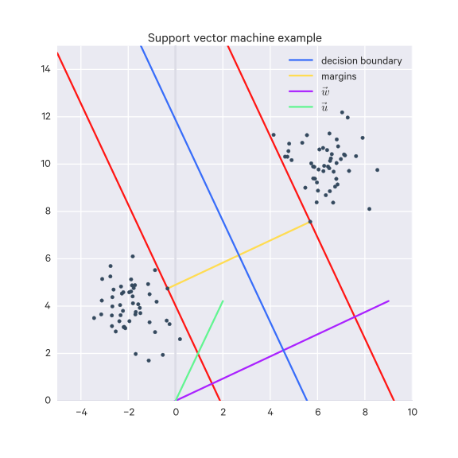

We can consider some vector $\vec w$ which is perpendicular to the decision boundary and has an unknown length.

Then we can consider an unknown vector $\vec u$ that we want to classify.

We can compute their dot product, $\vec w \cdot \vec u$, and see if it is greater than or equal to some constant $c$.

To make things easier to work with mathematically, we set $b = -c$ and rewrite this as:

$$
\vec w \cdot \vec u + b \geq 0
$$

This is our decision rule: if this inequality is true, we have a positive example.

Now we will define a few things about this system:

$$
\begin{aligned}
\vec w \cdot \vec x_+ + b &\geq 1 \\
\vec w \cdot \vec x_- + b &\leq -1
\end{aligned}
$$

Where $\vec x_+$ is a positive training example and $\vec x_-$ is a negative training example. So we will insist that these inequalities hold.

For mathematical convenience, we will define another variable $y_i$ like so:

$$
y_i =
\begin{cases}
y_i = +1 & \text{if positive example} \\
y_i = -1 & \text{if negative example}
\end{cases}
$$

So we can rewrite our constraints as:

$$
\begin{aligned}
y_i(\vec w \cdot \vec x_+ + b) &\geq 1 \\
y_i(\vec w \cdot \vec x_- + b) &\geq 1
\end{aligned}
$$

Which ends up just collapsing into:

$$
y_i(\vec w \cdot \vec x + b) \geq 1
$$

Or:

$$
y_i(\vec w \cdot \vec x + b) - 1 \geq 0
$$

We then add an additional constraint for an $x_i$ in the gutter (that is, within the margin of the decision boundary):

$$
y_i(\vec w \cdot \vec x + b) - 1 = 0
$$

So how do you compute the total width of the margins?

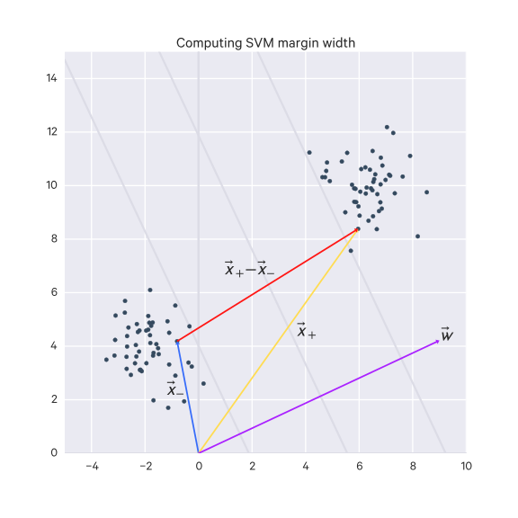

You can take a negative example $\vec x_-$ and a positive example $\vec x_+$ and compute their difference $\vec x_+ - \vec x_-$. This resulting vector is not orthogonal to the decision boundary, so we can project it onto the unit vector $\hat w$ (the unit vector of the $\vec w$, which is orthogonal to the decision boundary):

$$
\text{width} = (\vec x_+ - \vec x_-) \cdot \frac{\vec w}{||\vec w||}
$$

Using our previous constraints we get $\vec x_+ = 1 - b$ and $- \vec x_- = 1 + b$, so the end result is:

$$
\text{width} = \frac{2}{||\vec w||}
$$

We want to maximize the margins, that is, we want to maximize the width, and we can divide by $\frac{1}{2}$ because we still have a meaningful maximum, and that in turn can be interpreted as the minimum of the length of $\vec w$, which we can rewrite in a more mathematically convenient form (and still have the same meaningful minimum):

$$
max(\frac{2}{||\vec w||}) \to max(\frac{1}{||\vec w||}) \to min(||\vec w||) \to min(\frac{1}{2}||\vec w||^2)
$$

Let's turn this into something we can maximize, incorporating our constraints. We have to use Lagrange multipliers which provide us with this new function we can maximize without needing to think about our constraints anymore:

$$
L = \frac{1}{2} ||\vec w||^2 - \sum_i \alpha_i [y_i (\vec w \cdot \vec x_i + b) - 1]
$$

(Note that the Lagrangian is an objective function which includes equality constraints).

Where $L$ is the function we want to maximize, and the sum is the sum of the constraints, each with a multiplier $\alpha_i$.

So then to get the maximum, we just compute the partial derivatives and look for zeros:

$$
\begin{aligned}
\frac{\partial L}{\partial {\vec w}} &= \vec w - \sum_i \alpha_i y_i \vec x_i = 0 \to \vec w = \sum_i \alpha_i y_i \vec x_i \\
\frac{\partial L}{\partial b} &= -\sum_i \alpha_i y_i = 0 \to \sum_i \alpha_i y_i = 0
\end{aligned}
$$

Let's take these partial derivatives and re-use them in the original Lagrangian:

$$
L = \frac{1}{2}(\sum_i \alpha_i y_i \vec x_i) \cdot (\sum_j \alpha_j y_j \vec x_j) - \sum_i \alpha_i y_i \vec x_i \cdot (\sum_j \alpha_j y_j \vec x_j) - \sum \alpha_i y_i b + \sum \alpha_i
$$

Which simplifies to:

$$
L = \sum \alpha_i - \frac{1}{2} \sum_i \sum_j \alpha_i \alpha_j y_i y_j \vec x_i \cdot \vec x_j
$$

We see that this depends on $\vec x_i \cdot \vec x_j$.

Similarly, we can rewrite our decision rule, substituting for $\vec w$.

$$
\begin{aligned}
\vec w &= \sum_i \alpha_i y_i \vec x_i \\
\vec w \cdot \vec u + b &\geq 0 \\
\sum_i \alpha_i y_i \vec x_i \cdot \vec u + b &\geq 0
\end{aligned}
$$

And similarly we see that this depends on $\vec x_i \cdot \vec u$.

The nice thing here is that this works in a convex space (proof not shown) which means that it cannot get stuck on a local maximum.

Sometimes you may have some training data $\vec x$ which is not linearly separable. What you need is a transformation, $\phi(\vec x)$ to take the data from its current space to a space where it _is_ linearly separable.

Since the maximization and the decision rule depend only on the dot products of vectors, we can just substitute the transformation, so that:

- we want to maximize $\phi(\vec x_i) \cdot \phi(\vec x_j)$
- for the decision rule, we have $\phi(\vec x_i) \cdot \phi(\vec u)$

Since these are just dot products between the transformed vectors, we really only need a function which gives us that dot product:

$$
K(\vec x_i, \vec x_j) = \phi(\vec x_i) \cdot \phi(\vec x_j)
$$

This function $K$ is called the _kernel_ function.

So if you have the kernel function, you don't even need to know the specific transformation - you just need the kernel function.

Some popular kernels:

- linear kernel: $K(\vec u, \vec v) = (\vec u \cdot \vec v + 1)^n$
- radial basis kernel: $e^{-\frac{||\vec x_i - \vec x_j||}{\sigma}}$

#### More on kernels: The Kernel Trick

Many machine learning algorithms can be written in the form:

$$
w^T x + b = b + \sum_{i=1}^m \alpha_i x^T x^{(i)}
$$

Where $\alpha$ is a vector of coefficients.

We can substitute $x$ with the output of a feature function $\phi(x)$ and the dot product $x^T x^{(i)}$ with a function $k(x, x^{(i)}) = \phi(x)^T \phi(x^{(i})$. This function $k$ is called a __kernel__.

Thus we are left with:

$$
f(x) = b + \sum_{i=1}^m \alpha_i k(x, x^{(i)})
$$

$\phi$ maps $x$ to a linear space, so this final function $f$ is linear; as such, $x$ can be non-linear.

Machine learning algorithms which use this trick are called __kernel methods__ or __kernel machines__.

## Decision Trees

Basic algorithm:

1. Start with data all in one group
2. Find some criteria which best splits the outcomes
3. Divide the data into two groups (which become the leaves) on that split (which becomes a node)
4. Within each split, repeat
5. Repeat until the groups are too small or are sufficiently "pure" (homogeneous)

Classification trees are non-linear models:

- They use interactions b/w variables
- Data transformations may be less important (monotone transformations probably won't affect how data is split)
- Trees can be used for regression problems (continuous outcome)

### Measures of impurity

$$
\hat p_{mk} = \frac{1}{N_m} \sum_{x_i \in \text{Leaf}_m} \mathbb 1(y_i = k)
$$

That is, within the $m$ leaf you have $N_m$ objects to consider and you count the number of a particular class $k$ in that set of objects and divide it by $N_m$ to get the probability $\hat p_{mk}$.

- __misclassification error__: $1 - \hat p_{mk(m)} ; k(m) = \text{most; common; k}$
    - 0 = perfect purity
    - 0.5 = no purity
- __Gini index__: $\sum_{k \neq k'} \hat p_{mk} \times \hat p_{mk'} = \sum_{k=1}^K \hat p_{mk} (1 - \hat p_{mk}) = 1 - \sum_{k=1}^K p^2_{mk}$
    - 0 = perfect purity
    - 0.5 = no purity
- __Deviance/information gain__: $- \sum^K_{k=1} \hat p_{mk} \log_2 \hat p_{mk}$
    - 0 = perfect purity
    - 1 = no purity

### Random forests

Random forests are the ensemble model version of decision trees.

Basic idea:

1. Bootstrap samples (i.e. resample)
2. At each split in the tree, bootstrap the variables (i.e. only a subset of the variables is considered at each split)
3. Grow multiple trees
4. Each tree votes on a classification

This can be very accurate but slow, prone to overfitting (cross-validation helps though), and not easy to interpret. However, they generally perform very well.

### Classification loss functions

#### Hinge Loss (aka Max-Margin Loss)

The hinge loss function takes the form $\ell(y) = \max(0, 1-t \cdot y)$ and is typically used for SVMs (sometimes squared hinge loss is used, which is just the previous equation squared).

#### Cross-entropy loss

$$
L(y, \hat y) = -\frac{1}{N} \sum_{n \in N} \sum_{i \in C} y_{n,i} \log \hat y_{n,i}
$$

where

- $N$ = number of samples
- $C$ = number of classes

Typically used for Softmax classifiers.

$$
L_i = -\log\left(\frac{e^{f_{y_i}}}{ \sum_j e^{f_j} }\right)
$$

## Ensemble models

### Boosting

Basically, taking many models and combining their outputs as a weighted average.

Basic idea:

1. Take lots of (possibly) weak predictors $h_1, \dots, h_k$, e.g. a bunch of different trees or regression models or different cutoffs.
2. Weight them and combine them by creating a classifier which combine the predictors: $f(x) = \text{sign}(\sum^T_{t=1} \alpha_t h_t(x))$
    - Goal is to minimize error on training set
    - Iteratively select a classifier $h$ at each step
    - Calculate weights based on errors
    - Increase the weight of missed classifications and select the next classifier
    - The sign of the result tells you the class

_Adaboost_ is a popular boosting algorithm.

One class of boosting is _gradient boosting_.

Boosting typically does very well.

#### more on boosting

Here we focus on binary classification.

Say we have a classifier $h$ which produces $+1$ or $-1$.

We have some error rate, which ranges from 0 to 1. A weak classifier is one where the error is just less than 0.5 (that is, it works slightly better than chance). A stronger classifier has an error rate closer to 0.

Let's say we have several weak classifiers, $h_1, \dots, h_n$.

We can combine them into a bigger classifier, $H(x)$, where $x$ is some input, which is the sum of the individual weak classifiers, and take the sign of the result. In this sense, the weak classifiers _vote_ on the classification:

$$
H(x) = \text{sign}(\sum_i h_i(x))
$$

How do we generate these weak classifiers?

- We can create one by taking the data, training classifiers on it, and selecting with the smallest error rate (this will be classifier $h_1$.)
- We can create another by taking the data and giving it some exaggeration of $h_1$'s errors (e.g. pay more attention to the samples that $h_1$ has trouble one). Training a new classifier on this gives us $h_2$.
- We can create another by taking the data and giving it some exaggeration to the samples where the results of $h_1 \neq h_2$. Training a new classifier on this gives us $h_3$.

This process can be recursive. That is, $h_1$ could be made up of three individual classifiers as well, and so could $h_2$ and $h_3$.

For our classifiers we could use _decision tree stumps_, which is just a single test to divide the data into groups (i.e. just a part of a fuller decision tree). Note that boosting doesn't have to use decision tree (stumps), it can be used with any classifier.

We can assign a weight to each training example, $w_i$, where to start, all weights are uniform. These weights can be adjusted to exaggerate certain examples. For convenience, we keep it so that all weights sum to 1, $\sum w_i = 1$, thus enforcing a distribution.

We can compute the error $\epsilon$ of a given classifier as the sum of the weights of the examples it got wrong.

For our aggregate classifier, we may want to weight the classifiers with the weights $\alpha_1, \dots, \alpha_n$.

$$
H(x) = \text{sign}(\sum_i \alpha_i h_i(x))
$$

The general algorithm is:

- We can set the starting weights $w^t_i$ for our training examples to be $\frac{1}{N}$ where $N$ is the number of examples and $t=1$, representing the time (or the iteration).
- Then we pick a classifier $h^t$ which minimizes the error rate.
- Then we can pick $\alpha^t$.
- And we can calculate $w^{t+1}$.
- Then repeat.

Now suppose $w^{t+1}_i = \frac{w^t_i}{Z}e^{-\alpha^t h^t(x) y(x)}$, where $y(x)$ gives you the right classification (the right sign) for a given Training example. So if $h^t(x)$ correctly classifies a sample, then it and $y(x)$ will be the same sign, so it will be a positive exponent. Otherwise, if $h^t(x)$ gives the incorrect sign, it will be a negative exponent. $Z$ is some normalizing value so that we get a distribution.

We want to minimize the error bound for $H(x)$ if $\alpha^t = \frac{1}{2}ln\frac{1 - \epsilon^t}{\epsilon^t}$.

### Stacking

Stacking is similar to boosting, except that you also learn the weights for the weighted average by wrapping the ensemble of models into another model.

## Overfitting

_Overfitting_ is a problem where your hypothesis describes the training data _too_ well, to the point where it cannot generalize to new examples. It is a _high variance_ problem. In contrast, _underfitting_ is a _high bias_ problem.

To clarify, if your model has no bias, it means that it makes no errors on your training data (i.e. it does not underfit). If your model has no variance, it means your model generalizes well on your test data (i.e. it does not overfit). It is possible to have bias and variance problems simultaneously.

Another way to think of this is that:

- variance = how much does the model vary if the training data changes? I.e. what space of possible models does this cover? High variance implies that the model is too sensitive to the particular training examples it looked at, and thus will not adapt well to other examples.
- bias = is the average model close to the "true" solution/model? High bias means that the model is systematically incorrect.

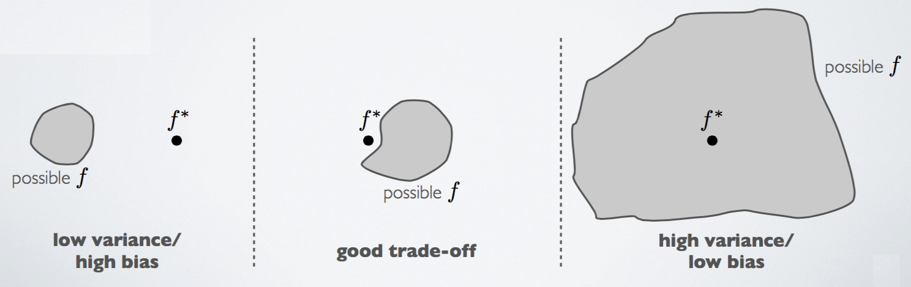

There is a _bias-variance trade-off_, in which improvement of one is typically at the detriment of the other.

You can think of generalization error as the sum of bias and variance. You want to keep both low, if possible.

Overfitting can happen if your hypothesis is too complex, which can happen if you have too many features. So you will want to through a _feature selection_ phase and pick out features which seem to provide the most value.

Alternatively, you can use the technique of _regularization_, in which you keep all your features, but reduce the magnitudes/values of parameters $\theta_j$. This is a good option all of your features are informative and you don't want to get rid of any.

## Regularization

__Regularization__ can be defined as any method which aims to reduce the generalization error of a model though it may not have the same effect on the training error. Since good generalization error is the main goal of machine learning, regularization is essential to success.

Perhaps the most common form of regularization aims to favor smaller parameters. The intuition is that, if you have small values for your parameters $\theta_0, \theta_1, \dots, \theta_n$, then you have a "simpler" hypothesis which is less prone to overfitting.

In practice, there may be many combination of parameters which fit your data well. However, some may overfit/not generalize well. We want to introduce some means of valuing these simpler hypotheses over more complex ones (i.e. with larger parameters). We can do so with regularization.

So generally regularization is about shrinking your parameters to make them smaller; for this reason it is sometimes called _weight decay_. For linear regression, you accomplish this by modifying the cost function to include the term $\lambda \sum^n_{i=1} \theta_j^2$ at the end:

$$
J(\theta) = \frac{1}{2m} \sum^m_{i=1} (h_{\theta}(x^{(i)}) - y^{(i)})^2 + \lambda \sum^n_{i=1} \theta_j^2
$$

Note that we are not shrinking $\theta_0$. In practice, it does not make much of a difference if you include it or not; standard practice is to leave it out.

$\lambda$ here is called the _regularization parameter_. It tunes the balance between fitting the data and keeping the parameters small (i.e. each half of the cost function). If you make $\lambda$ _too_ large for your problem, you may make your parameters too close to 0 for them to be meaningful - large values of lambda can lead to underfitting problems (since the parameters get close to 0).

The additional $\lambda \sum^n_{i=1} \theta_j^2$ term is called the _regularization loss_, and the rest of the loss function is called the _data loss_.

### Ridge regression

A regularization method used in linear regression; the L2 norm of the parameters is constrained so that it less than or equal to some specified value (that is, this is L2 regularization):

$$
\hat \beta = \argmin_{\beta} (\sum_{i=1}^N(y_i - \beta_0 - \sum_{j=1}^p x_{ij} \beta_j)^2 + \lambda \sum_{j=1}^p \beta^2_j)
$$

Where:

- $\lambda \geq 0$ is a hyperparameter controlling the amount of shrinkage.
- $N$ is the number of data points
- $p$ is the number of dimensions

### LASSO

__LASSO__ (Least Absolute Shrinkage and Selection Operator) is a regularization method which constrains the L1 norm of the parameters such that it is less than or equal to some specified value:

$$
\hat \beta = \argmin_{\beta} (\frac{1}{2} \sum_{i=1}^N(y_i - \beta_0 - \sum_{j=1}^p x_{ij} \beta_j)^2 + \lambda \sum_{j=1}^p |\beta_j|)
$$

(These two regularization methods are sometimes called _shrinkage_ methods)

### Regularized Linear Regression

We can update gradient descent to work with our regularization term:

$$
\begin{aligned}
\theta_0 &:= \theta_0 - \alpha \frac{1}{m}\sum^m_{i=1}(h_{\theta}(x^{(i)}) - y^{(i)}) \cdot x_0^{(i)} \\
\theta_j &:= \theta_j - \alpha \frac{1}{m}\sum^m_{i=1}(h_{\theta}(x^{(i)}) - y^{(i)}) \cdot x_j^{(i)} + \frac{\lambda}{m}\theta_j \\
j &= (1,2,3, \dots, n)
\end{aligned}
$$

The $\theta_j$ part can be re-written as:

$$
\theta_j := \theta_j(1 - \alpha \frac{\lambda}{m}) - \alpha \frac{1}{m} \sum^m_{i=1} (h_{\theta}(x^{(i)}) - y^{(i)}) \cdot x_j^{(i)}
$$

If we are using the normal equation, we can update it to a regularized form as well:

$$
\theta = (X^T X + \lambda M)^{-1} X^T y
$$

Where $M$ is an $n+1 \times n+1$ matrix, where the diagonal is all ones, except for the element at $(0,0)$ which is 0, and every other element is also 0.

### Regularized Logistic Regression

We can also update the logistic regression cost function with the regularization term:

$$
J(\theta) = -\frac{1}{m} [\sum^m_{i=1}y^{(i)}log(h_{\theta}(x^{(i)})) + (1-y^{(i)})log(1-h_{\theta}(x^{(i)}))] + \frac{\lambda}{2m} \sum^n_{i=1} \theta_j^2
$$

Then we can update gradient descent with the new derivative of this cost function for the parameters $\theta_j$ where $j \neq 0$

$$
\begin{aligned}
\theta_0 &:= \theta_0 - \alpha \frac{1}{m}\sum^m_{i=1}(h_{\theta}(x^{(i)}) - y^{(i)}) \cdot x_0^{(i)} \\
\theta_j &:= \theta_j - \alpha \frac{1}{m}\sum^m_{i=1}(h_{\theta}(x^{(i)}) - y^{(i)}) \cdot x_j^{(i)} + \frac{\lambda}{m}\theta_j \\
j &= (1,2,3, \dots, n)
\end{aligned}
$$

It looks the same as the one for linear regression, but again, the actual hypothesis function $h_{\theta}$ is different.

## Probabilistic modeling

Fundamentally, machine learning is all about data:

- Stochastic, chaotic, and/or complex generative processes
- Noisily observed
- Partially observed

So there is a lot of uncertainty - we can use probability theory to express this uncertainty in the form of _probabilistic models_. Generally, learning probabilistic models is known as _probablistic machine learning_; here we are primarily concerned with non-Bayesian machine learning.

We have some data $x_1, x_2, \dots, x_n$ and some latent variables $y_1, y_2, \dots, y_n$ we want to uncover, which correspond to each of our data points.

We have a parameter $\theta$.

A probabilistic model is just a parameterized joint distribution over all the variables:

$$
P(x_1, \dots, x_n, y_1, \dots, y_n | \theta)
$$

We usually interpret such models as a _generative_ model - how was our observed data _generated_ by the world?

So the problem of inference is about learning about our latent variables given the observed data, which we can get via the posterior distribution:

$$
P(y_1, \dots, y_n | x_1, \dots, x_n, \theta) = \frac{P(x_1, \dots, x_n, y_1, \dots, y_n | \theta)}{P(x_1, \dots, x_n|\theta)}
$$

Learning is typically posed as a _maximum likelihood_ problem; that is, we try to find $\theta$ which maximizes the probability of our observed data:

$$
\theta^{ML} = \argmax_{\theta} P(x_1, \dots, x_n | \theta)
$$

Then, to make a prediction we want to compute the conditional distribution of some future data:

$$
P(x_{n+1}, y_{n+1}|x_1, \dots, x_n, \theta)
$$

Or, for classification, if we some classes, each parameterizing a joint distribution, we want to pick the class which maximizes the probability of the observed data:

$$
\argmax_{c}P(x_{n+1}|\theta^c)
$$

### Discriminative vs Generative learning algorithms

_Discriminative_ learning algorithms include algorithms like logistic regression, decision trees, kNN, and SVM. Discriminative approaches try to find some way of separating data (_discriminating_ them), such as in logistic regression which tries to find a dividing line and then sees where new data lies in relation to that line. They are unconcerned with _how_ the data was generated.

Say our input features are $x$ and $y$ is the class.

Discriminative learning algorithms learn $P(y|x)$ directly, that is it tries to learn the probability of $y$ directly as a function of $x$. To put it another way, what is the probability this new data is of class $y$ given the features $x$?

_Generative_ learning algorithms instead tries to develop a model for each class and sees which model new data conforms to.

Generative learning algorithms learn $P(x|y)$ and $P(y)$ instead (that is, it models the joint distribution $P(x,y)$). So instead they ask, if this were class $y$, what is the probability of seeing these new features $x$? You're basically trying to figure out what class is most likely to have _generated_ the given features $x$.

$P(y)$ is the class prior/the prior probability of seeing the class $y$, that is the probability of class $y$ if you don't have any other information.

It is easier to estimate the conditional distribution $P(y|x)$ than it is the joint distribution $P(x,y)$, though generative models can be much stronger. With $P(x,y)$, it is easy to calculate the same conditional ($P(y|x) = \frac{P(x,y)}{P(x)}$).

For both discriminative and generative approaches, you will have parameters and latent variables $\theta$ which govern these distributions. We treat $\theta$ as a random variable.

### Maximum Likelihood Estimation (MLE)

Say we have some observed values $x_1, x_2, \dots, x_n$, generated by some latent model parameterized by $\theta$, i.e. $f(x_1, x_2, \dots, x_n ; \theta)$, where $\theta$ represents a single unknown parameter or a vector of unknown parameters.
If we flip this we get the __likelihood__ of $\theta$, $L(\theta; x_1, x_2, \dots, x_n)$, which is the probability of $\theta$, given the observed data.

_Likelihood_ is just the name for the probability of observed data as a function of the parameters.

The __maximum likelihood estimation__ is the $\theta$ (parameter) which maximizes this likelihood. That is, the value of $\theta$ which generates the observed values with the highest probability. MLE can be done by computing the derivative of the likelihood and solving for zero. It is a very common way of estimating parameters.

(The Expectation-Maximization (EM) algorithm is a way of computing a maximum likelihood estimate for situations where some variables may be hidden.)

If the random variables associated with the values, i.e. $X_1, X_2, \dots, X_n$, are iid, then the likelihood is just:

$$
L(\theta; x_1, x_2, \dots, x_n) = \prod_{i=1}^n f(x_i|\theta)
$$

Sometimes this is just notated $L(\theta)$.

So we are looking to estimate the $\theta$ which maximizes this likelihood (this estimate is often notated $\hat \theta$, the hat typically indicates an estimator):

$$
\hat \theta = \argmax_{\theta} L(\theta;x_1, x_2, \dots, x_n)
$$

Logarithms are used, however, for convenience (i.e. dealing with sums rather than products), so instead we are often maximizing the __log likelihood__ (which has its maximum at the same value (i.e. the same argmax) as the regular likelihood, though the actual maximum value may be different):

$$
\ell(\theta) = \sum_{i=1}^n \log(f(x_i|\theta))
$$

Another way of explaining MLE:

We have some data $X = \{x^{(1)}, x^{(2)}, \dots, x^{(m)} \}$ and a parametric probability distribution $p(x;\theta)$. The maximum likelihood estimate for $\theta$ is:

$$
\begin{aligned}
\theta_{\text{ML}} &= \argmax_{\theta} p(X;\theta) \\
&= \argmax_{\theta} \prod_{i=1}^m p(x^{(i)};\theta)
\end{aligned}
$$

(Notation note: $p(X;\theta)$ is read "the probability density of $X$ as parameterized by $\theta$")

Though the logarithm version mentioned above is typically preferred to avoid underflow.

Typically, we are more interested in the conditional probability $P(y|x;\theta)$ (i.e. the probability of $y$ given $x$, parameterized by $\theta$), in which case, given all our inputs $X$ and all our targets $Y$, we have the conditional maximum likelihood estimator:

$$
\theta_{\text{ML}} = \argmax_{\theta} P(Y|X;\theta)
$$

Assuming the examples are iid, this is:

$$
\theta_{\text{ML}} = \argmax_{\theta} \sum_{i=1}^m \log P(y^{(i)}|x^{(i)};\theta)
$$

#### Example

Say we have a coin which may be unfair. We flip it ten times and get `HHHHTTTTTT` (we'll call this observed data $X$). We are interested in the probability of heads, $\pi$, for this coin, so we can determine if it's unfair or not.

Here we just have a binomial distribution so the parameters here are $n$ and $p$ (or $\pi$ as we are referring to it here). We know $n$ as it is the sample size, so that parameter is easy to "estimate" (i.e. we already know it). All that's left is the parameter $p$ to estimate. So we can just use MLE to make this estimation; for binomial distributions it is rather trivial Because $p$ is the probability of a successful trial, and it's intuitive that the most likely $p$ just reflects the number of observed successes over the total number of observed trials:

$$
\begin{aligned}
\tilde \pi_{MLE} &= \argmax_{\pi} P(X|\pi) \\
P(y|X) &\approx P(y|\tilde \pi_{MLE})
\end{aligned}
$$

Where $y$ is the outcome of the next coin flip.

For this case our MLE would be $\tilde \pi_{MLE} = 0.4$ because that is most likely to have generated our observed data (we saw $\frac{4}{10}$ heads).

Also formulated as:

$$
\hat \theta = \argmax_{\theta} p(x^{(1)}, \dots, x^{(n)})
$$

For a Gaussian distribution, the sample mean is the MLE.

### Expectation Maximization

The __expectation maximization__ (EM) algorithm is a two-staged iterative algorithm.

Say you have a dataset which is missing some values. How can you complete your data?

The EM algorithm allows you to do so.

The two stages work as such:

1. Begin with initial parameters $\hat \theta^{(t)}, t=0$.
2. The "E-step"
    1. Using the current parameters $\hat \theta^{(t)}$, compute probabilities for each possible completion of the missing data.
    2. Use these probabilities to create a weighted training set of these possible completions.
3. The "M-step"
    1. Use a modified version of MLE (one which can deal with weighted samples) to derive new parameter estimates, $\hat \theta^{(t+1)}$.
5. Repeat the E and M steps until convergence.

Intuitively, what EM does is tries to find the parameters $\hat \theta$ which maximizes the log probability $\log P(x|\theta)$ of the observed data $x$, much like MLE, except does so under the conditions of incomplete data. EM will converge on a local optimum (maximum) for this log probability.

#### Example

Say we have two coins $A,B$, which may not be fair coins.

We conduct 5 experiments in which we randomly choose one of the coins (with equal probability) and flip it 10 times.

We have the following results:

    1. HTTTHHTHTH
    2. HHHHTHHHHH
    3. HTHHHHHTHH
    4. HTHTTTHHTT
    5. THHHTHHHTH

We are still interested in learning a parameter for each coin, $\hat \theta_A, \hat \theta_B$, describing the probability of heads for each.

If we knew which coin we flipped during each experiment, this would be a simple MLE problem. Say we did know which coin was picked for each experiment:

    1. B: HTTTHHTHTH
    2. A: HHHHTHHHHH
    3. A: HTHHHHHTHH
    4. B: HTHTTTHHTT
    5. A: THHHTHHHTH

Then we just use MLE and get:

$$
\begin{aligned}
\hat \theta_A &= \frac{24}{24+6} = 0.8 \\
\hat \theta_B &= \frac{9}{9+11} = 0.45
\end{aligned}
$$

That is, for each coin we just compute $\frac{\text{num heads}}{\text{total trials}}$.

But, alas, we are missing the data of which coin we picked for each experiment. We can instead apply the EM algorithm.

Say we initially guess that $\hat \theta_A^{(0)} = 0.60, \hat \theta_B^{(0)} = 0.50$. For each experiment, we'll compute the probability that coin $A$ produced those results and the same probability for coin $B$. Here we'll just show the computation for the first experiment.

We're dealing with a binomial distribution here, so we are using:

$$
P(x) = {n \choose x}p(1-p)^{n-x}, \, p = \hat \theta
$$

The binomial coefficient is the same for both coins (the ${n \choose x}$ term) and cancels out in normalization, so we only care about the remaining factors. So we will instead just use:

$$
P(x) = p(1-p)^{n-x}, \, p = \hat \theta
$$

For the first experiment we have 5 heads (and $n=10$). Using our current estimates for $\hat \theta_A, \hat \theta_B$, we compute:

$$
\begin{aligned}
\theta_A^5 (1-\theta_A)^{10-5} &\approx 0.0008 \\
\theta_B^5 (1-\theta_B)^{10-5} &\approx 0.0010 \\
\frac{0.0008}{0.0008+0.0010} &\approx 0.44 \\
\frac{0.0010}{0.0008+0.0010} &\approx 0.56
\end{aligned}
$$

So for this first iteration and for the first experiment, we estimate that the chance of the picked coin being coin $A$ is about $0.44$, and about $0.56$ for coin $B$.

Then we generate the weighted set of these possible completions by computing how much each of these coins, as weighted by the probabilities we just computed, contributed to the results for this experiment ($(5H, 5T)$):

$$
\begin{aligned}
0.44(5H, 5T) &= (2.2H, 2.2T), \, \text{(coin A)} \\
0.56(5H, 5T) &= (2.8H, 2.8T), \, \text{(coin B)}
\end{aligned}
$$

Then we repeat this for the rest of the experiments, getting the following weighted values for each coin for each experiment:

$$
\begin{array}{l|l}
\text{coin A} & \text{coin B} \\
\hline
2.2H, 2.2T & 2.8H, 2.8T \\
7.2H, 0.8T & 1.8H, 0.2T \\
5.9H, 1.5T & 2.1H, 0.5T \\
1.4H, 2.1T & 2.6H, 3.9T \\
4.5H, 1.9T & 2.5H, 1.1T
\end{array}
$$

and sum up the weighted values for each coin:

$$
\begin{array}{l|l}
\text{coin A} & \text{coin B} \\
\hline
21.3H, 8.6T & 11.7H, 8.4T
\end{array}
$$

Then we use these weighted values and MLE to update $\hat \theta_A, \hat \theta_B$, i.e.:

$$
\begin{aligned}
\hat \theta_A^{(1)} &\approx \frac{21.3}{21.3+8.6} \approx 0.71 \\
\hat \theta_B^{(1)} &\approx \frac{11.7}{117.+8.4} \approx 0.58
\end{aligned}
$$

And repeat until convergence.

#### Expectation Maximization as a Generalization of K-Means

In K-Means we make hard assignments of datapoints to clusters (that is, they belong to only one cluster at a time, and that assignment is binary).

EM is similar to K-Means, but we use soft assignments instead - datapoints can belong to multiple clusters in varying strengths (the "strengths" are probabilities of assignment to each cluster). When the centroids are updated, they are updated against _all_ points, weighted by assignment strength (whereas in K-Means, centroids are updated only against their members).

EM converges to approximately the same clusters as K-Means, except datapoints still have some membership to other clusters (though they may be very weak memberships).

In EM, we consider that each datapoint is generated from a mixture of classes.

For each $K$ classes, we have the prior probability of that class $P(C=i)$ and the probability of the datapoint given that class $P(x|C=i)$.

$$
P(x) = \sum^K_{i=1} P(C=i) P(x|C=i)
$$

These terms may be notated:

$$
\begin{aligned}
\pi &= P(C=i) \\
\mu_i \sum_i &= P(x|C=i)
\end{aligned}
$$

What this is modeling here is that each centroid is the center of a Gaussian distribution, and we try to fit these centroids and their distributions to the data.

## References

- Review of fundamentals, IFT725. Hugo Larochelle. 2012.
- [Exploratory Data Analysis Course Notes](https://sux13.github.io/DataScienceSpCourseNotes/4_EXDATA/Exploratory_Data_Analysis_Course_Notes.pdf). Xing Su.
- [Mining Massive Datasets](https://www.coursera.org/course/mmds) (Coursera & Stanford, 2014). Jure Leskovec, Anand Rajaraman, Jeff Ullman.
- [Machine Learning](https://www.coursera.org/learn/machine-learning). 2014. Andrew Ng. Stanford University/Coursera.
- [CS188: Artificial Intelligence](https://www.edx.org/course/artificial-intelligence-uc-berkeleyx-cs188-1x). Dan Klein, Pieter Abbeel. University of California, Berkeley (edX).
- _Evaluating Machine Learning Models_. Alice Zheng. 2015.
- [Computational Statistics II](https://www.youtube.com/watch?v=heFaYLKVZY4) ([code](https://github.com/fonnesbeck/scipy2015_tutorial)). Chris Fonnesbeck. SciPy 2015.
- [Intro to Artificial Intelligence](https://www.udacity.com/course/intro-to-artificial-intelligence--cs271). CS271. Peter Norvig, Sebastian Thrun. Udacity.
- [MIT 6.034 (Fall 2010): Artificial Intelligence](http://ocw.mit.edu/courses/electrical-engineering-and-computer-science/6-034-artificial-intelligence-fall-2010/). Patrick H. Winston. MIT.
- [Deep Learning](http://www-labs.iro.umontreal.ca/~bengioy/dlbook/). Yoshua Bengio, Ian Goodfellow, Aaron Courville.
- [CS231n Convolutional Neural Networks for Visual Recognition, Module 1: Neural Networks Part 2: Setting up the Data and the Loss](https://cs231n.github.io/neural-networks-1/). Andrej Karpathy.
- [POLS 509: Hierarchical Linear Models](https://www.youtube.com/watch?v=g_4z6o7XZbQ). Justin Esarey.
- [Bayesian Inference with Tears](http://www.isi.edu/natural-language/people/bayes-with-tears.pdf). Kevin Knight, September 2009.
- [Learning to learn, or the advent of augmented data scientists](https://chronicles.mfglabs.com/learning-to-learn-or-the-advent-of-augmented-data-scientists-20873282e181). Simon Benhamou.
- [Practical Bayesian Optimization of Machine Learning Algorithms](http://arxiv.org/abs/1206.2944). Jasper Snoek, Hugo Larochelle, Ryan P. Adams.
- [What is the expectation maximization algorithm?](http://www.nature.com/nbt/journal/v26/n8/full/nbt1406.html). Chuong B Do & Serafim Batzoglou.
- [Gibbs Sampling for the Uninitiated](https://www.umiacs.umd.edu/~resnik/pubs/LAMP-TR-153.pdf). Philip Resnik, Eric Hardisty. June 2010.
- [Maximum Likelihood Estimation](https://onlinecourses.science.psu.edu/stat414/node/191). Penn State Eberly College of Science.
- [Data Science Specialization](https://www.coursera.org/specializations/jhu-data-science). Johns Hopkins (Coursera). 2015.
- [Practical Machine Learning](https://www.coursera.org/learn/practical-machine-learning). Johns Hopkins (Coursera). 2015.
- [Elements of Statistical Learning](http://statweb.stanford.edu/~tibs/ElemStatLearn/). 10th Edition. Trevor Hastie, Robert Tibshirani, Jerome Friedman.
- [CS231n Convolutional Neural Networks for Visual Recognition, Linear Classification](https://cs231n.github.io/linear-classify/). Andrej Karpathy.
- [How does expectation maximization work?](https://math.stackexchange.com/questions/25111/how-does-expectation-maximization-work). joriki.
- [How does expectation maximization work in coin flipping problem](https://math.stackexchange.com/questions/81004/how-does-expectation-maximization-work-in-coin-flipping-problem>). joriki.
- [Deep Learning Tutorial - PCA and Whitening](https://chrisjmccormick.wordpress.com/2014/06/03/deep-learning-tutorial-pca-and-whitening/). Chris McCormick.
