# Neural Nets

When it comes down to it, a neural net is just a very sophisticated way of fitting a curve.

Neural networks with at least one hidden layer are __universal approximators__, which means that they can approximate _any_ (continuous) function. This approximation can be improved by increasing the number of hidden neurons in the network (but increases the risk of overfitting).

A key advantage to neural networks is that they are capable of learning features independently - without much human involvement.

Neural networks can also learn __distributed representations__. Say we have animals of some type and color. We could learn representations for each of them, e.g. with a neuron for a red cat, one for a blue dog, one for a blue cat, etc. But this would mean learning many, many representations (for instance, with three types and three colors, we learn nine representations). With distributed representations, we instead have neurons that learn the different colors and other neurons which learn the different types (for instance, with three types and three colors, we have six neurons). Thus the representation of a given case, such as a blue dog, is distributed across the neurons, and ultimately much more compact.

One challenge with neural networks is that it is often hard to understand _what_ a neural network has learned - they may be black boxes which do what we want, but we can't peer in and clearly see how it's doing it.


## Biological basis

Artificial neural networks (ANNs) are (conceptually) based off of biological neural networks such as the human brain.
Neural networks are composed of _neurons_ which send signals to each other in response to certain inputs.

A single neuron takes in one or more inputs (via dendrites), processes it, and fires one output (via its axon).

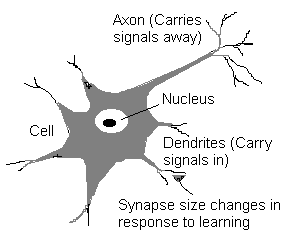

Note that the term "unit" is often used instead of "neuron" when discussing artificial neural networks to dissociate these from the biological version - while there is some basis in biological neural networks, there are vast differences, so it is a deceit to present them as analogous.


## Perceptrons

A _perceptron_, first described by Frank Rosenblatt in 1957, is an artificial neuron (a computational model of a biological neuron, first introduced in 1943 by Warren McCulloch and Walter Pitts).

Like a biological neuron, it has multiple inputs, processes them, and returns one output.

Each input has a weight associated with it.

In the simplest artificial neuron, a "binary" or "classic spin" neuron, the neuron "fires" an output of "1" if the weighted sum of these inputs is above some _threshold_, or "-1" if otherwise.

A single-layer perceptron can't learn XOR:

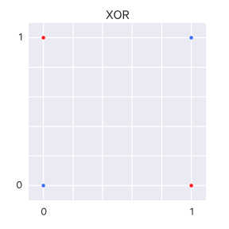

A line can't be drawn to separate the $A$s from the $B$s; that is, this is not a linearly separable problem. Single-layer perceptrons cannot represent linearly inseparable functions.

## Sigmoid (logistic) neurons

A sigmoid neuron is another artificial neuron, similar to a perceptron. However, while the perceptron has a binary output, the sigmoid neuron has a continuous output, $\sigma(w \cdot x+b)$, defined by a special activation function known as the _sigmoid function_ $\sigma$ (also known as the _logistic function_):

$$
\begin{aligned}
  \sigma(z) \equiv \frac{1}{1+e^{-z}}.
\end{aligned}
$$

which can also be written:

$$
\begin{aligned}
  \frac{1}{1+\exp(-\sum_j w_j x_j-b)}.
\end{aligned}
$$

Note that if $z = w \cdot x+b$ is a large positive number, then $e^{-z} \approx 0$ and thus $\sigma(z) \approx 1$. If $z$ is a large negative number, then $e^{-z} \rightarrow \infty$ and thus $\sigma(z) \approx 0$. So at these extremes, the sigmoid neuron behaves like a perceptron.

Here is the sigmoid function visualized:


Which is a smoothed out step function (which is how a perceptron operates):

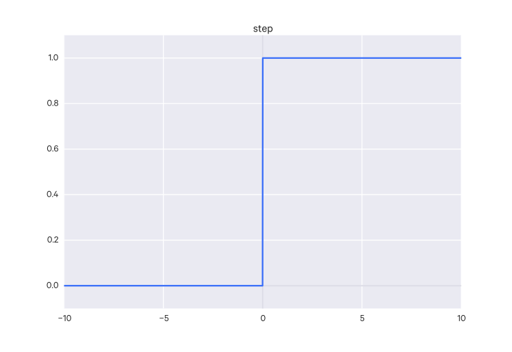


Sigmoid neurons are useful because small changes in weights and biases will only produce small changes in output from a given neuron (rather than switching between binary output values as is the case with the step function, which is typically too drastic).

## Activation functions

The function that determines the output of a neuron is known as the _activation function_. In the binary/classic spin case, it might look like:

    weights = [...]
    inputs  = [...]
    sum_w = sum([weights[i] * inputs[i] for i in range(len(inputs))])

    def activate(sum_w, threshold):
        return 1 if sum_w > threshold else -1

Or:

$$
\begin{aligned}
  \mbox{output} & = & \left\{ \begin{array}{ll}
      -1 & \mbox{if } \sum_j w_j x_j \leq \mbox{ threshold} \\
      1 & \mbox{if } \sum_j w_j x_j > \mbox{ threshold}
      \end{array} \right.
\end{aligned}
$$

Note that $w \cdot x = \sum_j w_j x_j$, so it can be notated as a dot product where the weights and inputs are vectors.

In some interpretations, the "binary" neuron returns "0" or "1" instead of "-1" or "1".

An activation function can generally be described as some function:

$$\text{output} = f(w \cdot x + b)$$

where $b$ is the bias (see below).

### Common activation functions


A common activation function is the _sigmoid_ function, which takes input and squashes it to be in $[0,1]$, it has the form:

$$
\sigma(x) = \frac{1}{1 + e^{-x}}
$$

However, the sigmoid activation function has some problems. If the activation yields values at the tails of 0 or 1, the gradient ends up being almost 0. In backpropagation, this local gradient is multiplied with the gradient of the node's output against the total error - if this local gradient is near 0, it "kills" the gradient preventing any signal from going further backwards in the network. For this reason, when using the sigmoid activation function you must be careful of how you initialize the weights - if they are too large, you will "saturate" the network and kill the gradient in this way.

Furthermore, sigmoid outputs are not zero-centered:

> This is undesirable since neurons in later layers of processing in a Neural Network (more on this soon) would be receiving data that is not zero-centered. This has implications on the dynamics during gradient descent, because if the data coming into a neuron is always positive (e.g. x>0 elementwise in f=wTx+b)), then the gradient on the weights w will during backpropagation become either all be positive, or all negative (depending on the gradient of the whole expression f). This could introduce undesirable zig-zagging dynamics in the gradient updates for the weights. However, notice that once these gradients are added up across a batch of data the final update for the weights can have variable signs, somewhat mitigating this issue. Therefore, this is an inconvenience but it has less severe consequences compared to the saturated activation problem above. ([CS231n Convolutional Neural Networks for Visual Recognition, Module 1: Modeling one neuron](https://cs231n.github.io/neural-networks-1/), Andrej Karpathy)

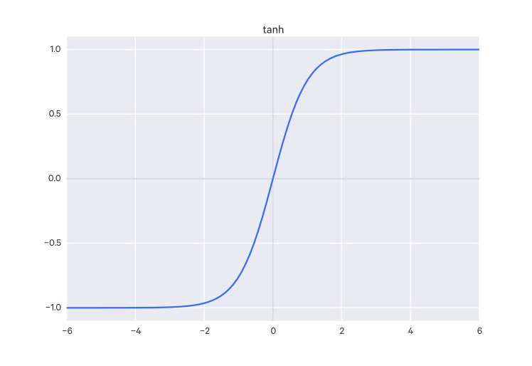

The _tanh_ activation function is another option; it squishes values to be in $[-1, 1]$. However, while its output is zero-centered, it suffers from the same activation saturation issue that the sigmoid does.

$$
\tanh(x)  \frac{e^z - e^{-z}}{e^z + e^{-z}}
$$

Note that $\tanh$ is really just a rescaled sigmoid function:

$$
\sigma(x) = \frac{1 + \tanh(\frac{x}{2})}{2}
$$


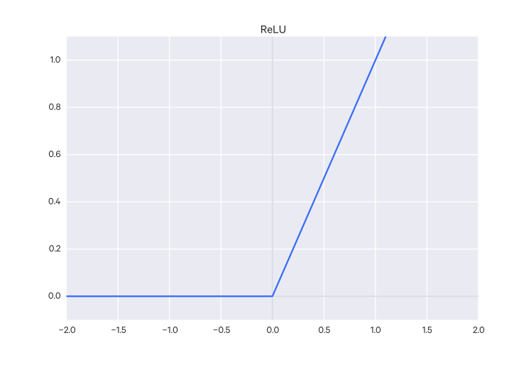

The Rectified Linear Unit (ReLU) is $f(x) = \max(0,x)$, that is, it just thresholds at 0. Compared to the sigmoid/tanh functions, it converges with stochastic gradient descent quickly. Though there is not the same saturation issue as with the sigmoid/tanh functions, ReLUs can still "die" in a different sense - their weights can be updated such that the neuron never activates again, which causes the gradient through that neuron to be zero from then on, thus resulting in the same "killing" of the gradient as with sigmoid/tanh. In practice, lowering the learning rate can avoid this.

_Leaky ReLUs_ are an attempt to fix this problem. Rather than outputting 0 when $x < 0$, there will instead be a small negative slope ($\sim 0.01$) when $x < 0$. That is, $y_i = \alpha_i x$ when $x_i < 0$, and $\alpha_i$ is some fixed value. However, it does not always work well.

Note that $\alpha_i$ in this case can also be a parameter to learn instead of a fixed value. These are called _parametric ReLUs_.

Another alternative is a _randomized leaky ReLU_, where $\alpha_i$ is a random variable during training and fixed afterwards.

There are also some units which defy the conventional activation form of $\text{output} = f(w \cdot x + b)$. One is the _Maxout_ neuron. It's function is $\max(w_1^Tx+b_1, w_2^Tx + b_2)$, which is a generalization of the ReLU and the leaky ReLU (both are special forms of Maxout). It has the benefits of ReLU but does not suffer the dying ReLU problem, but it's main drawback is that it doubles the number of parameters for each neuron (since there are two weight vectors and two bias units).

Karpathy suggests:

> Use the ReLU non-linearity, be careful with your learning rates and possibly monitor the fraction of "dead" units in a network. If this concerns you, give Leaky ReLU or Maxout a try. Never use sigmoid. Try tanh, but expect it to work worse than ReLU/Maxout. [source](https://cs231n.github.io/neural-networks-1/)


| Activation Function | Propagation                   | Backpropagation                                                                                           |
|---------------------|-------------------------------|-----------------------------------------------------------------------------------------------------------|
| Sigmoid             | $y_s = \frac{1}{1+e^{-x_2}}$  | $[\frac{\partial E}{\partial x}]_s = [\frac{\partial E}{\partial y}]_s \frac{1}{(1+e^{x_2})(1+e^{-x_2})}$ |
| Tanh                | $y_s = \tanh(x_s)$            | $[\frac{\partial E}{\partial x}]_s = [\frac{\partial E}{\partial y}]_s \frac{1}{\cosh^2 x_s}$             |
| ReLu                | $y_s = \max(0, x_s)$          | $[\frac{\partial E}{\partial x}]_s = [\frac{\partial E}{\partial y}]_s \mathbb I \{x_s > 0\}$             |
| Ramp                | $y_s = \min(-1, \max(1,x_s))$ | $[\frac{\partial E}{\partial x}]_s = [\frac{\partial E}{\partial y}]_s \mathbb I \{1- < x_s < 1\}$        |

There is also the __hard-tanh__ activation function, which is an approximation of $\tanh$ that is faster to compute and take derivatives of:

$$
\text{hardtanh}(x) =
\begin{cases}
-1 & x < -1 \\
1 & x > 1 \\
x & \text{otherwise}
\end{cases}
$$

### Softmax function

The __softmax function__ (called such because it is like a "softened" maximum function) may be used as the output layer's activation function. It takes the form:

$$
f^N_i(\text{NET}^N_i) = \frac{e^{\text{NET}^N_i}}{\sum_j^k e^{\text{NET}^N_j}}
$$

To clarify, we are summing over all the output neurons in the denominator.

This function has the properties that it sums to 1 and that all of its outputs are positive, which are useful for modeling probability distributions.

The cost function to use with softmax is the (categorical) cross-entropy loss function. It has the nice property of having a very big gradient when the target value is 1 and the output is almost 0.

The categorical cross-entropy loss:

$$
L_i = -\sum_j t_{i,j} \log(p_{i,j})
$$


### Radial basis functions

You can base your activation function off of _radial basis functions_ (RBFs):

$$
f(X) = \sum_{i=1}^N a_i p(||b_i X - c_i||)
$$

where

- $X$ = input vector of attributes
- $p$ = the RBF
- $c$ = vector center (peak) of the RBF
- $a$ = the vector coefficient/weight for each RBF
- $b$ = the vector coefficient/weight for each input attribute

A radial basis function (RBF) is a function which is:

- symmetric about its center, which is its peak (with a value of 1)
- can be in $n$ dimensions, but always returns a single scalar value $r$, the distance (usually Euclidean) b/w the input vector and the RBF's peak:

    $$r = ||x - x_i||$$

$\phi$ is used to denote a RBF.

A neural network that uses RBFs as its activation functions is known as _radial basis function neural network_.

The 1D Gaussian RBF is an example:

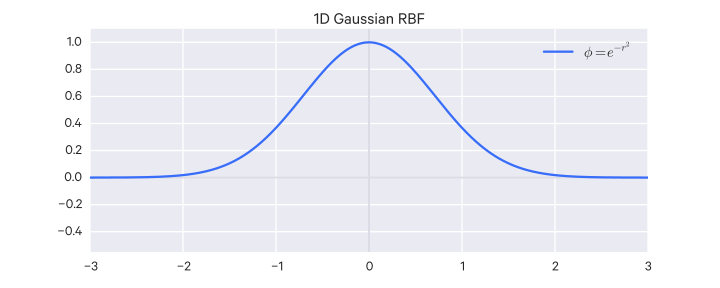

Defined as:

$$
\phi(r) = e^{-r^2}
$$

The Ricker Wavelet is another example:

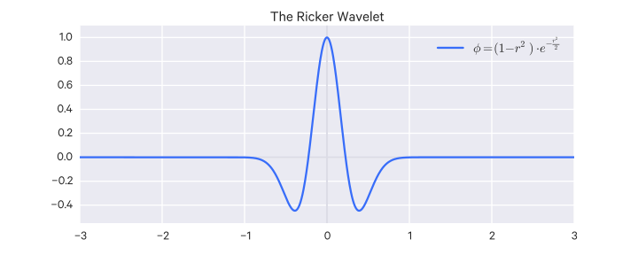

Defined as:

$$
\phi(r) = (1-r^2) \cdot e^{-\frac{r^2}{2}}
$$

## Feed-forward neural networks

A _feed-forward_ neural network is a simple neural network with an input layer, and output layer, and one or more intermediate layers of neurons.

These layers are _fully-connected_ in that every neuron of the previous layer is connected to every neuron in the following layer. Such layers are also called _affine_ or _dense_ layers.

When we describe the network in terms of layers as a "$N$-layer" neural network, we leave out the input layer (i.e. a 1-layer neural network has an input and an output layer, a 2-layer one has an input, a hidden, and an output layer.). ANNs may also be described by its number of nodes (units), or, more commonly, by the number of parameters in the entire network. (CS231n Convolutional Neural Networks for Visual Recognition, Module 1: Neural Networks Part 1: Setting up the Architecture. Andrej Karpathy. <https://cs231n.github.io/neural-networks-1/>)

This model is often called "feed-forward" because values go into the input layer and are fed into subsequent layers.

Different _learning algorithms_ can train such a network so that its weights are adjusted appropriately for a given task. It's worth emphasizing that the _structure_ of the network is distinct from the _learning algorithm_ which tunes its weights and biases. The most popular learning algorithm for neural networks is _backpropagation_.

## Training neural networks

### Backpropagation

The most common algorithm for adjusting a neural network's weights and biases is _backpropagation_.

Backpropagation is just the calculation of partial derivatives (the gradient) by moving backwards through the network (from output to input), accumulating them by applying the chain rule. In particular, it computes the gradient of the loss function with respect to the weights in the network (i.e. the derivatives of the loss function with respect to each weight in the network) in order to update the weights.

We compute the total error for the network on the training data and then want to know how a change in an individual weight within the network affects this total error (i.e. the result of our cost function), e.g. $\frac{\partial E_{\text{total}}}{\partial w_i}$.

"Backpropagation" is almost just a special term for the chain rule in the context of training neural networks. This is because a neural network can be thought of as a composition of functions, in which case to compute the derivative of the overall function, you just apply the chain rule for computing derivatives.

To elaborate on thinking of neural network as a "composition of functions": each layer represents a function taking in the inputs of the previous layer's output, e.g. if the previous layer is a function that outputs a vector, $g(x)$, then the next layer, if we call it a function $f$, is $f(g(x))$.

The general procedure for training a neural network with backpropagation is:

- Initialize the neural network's weights and biases.
- Training data is input into the NN to the output neurons, in feed-forward style.
- The error of the output is then propagated backwards (from the output layer back to the input layer).
- As the error is propagated, weights and biases are adjusted (according to a _learning rate_, detailed below) to minimize the remaining error between the actual and desired outputs.

Consider the following simple neural net:

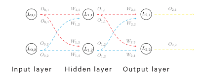

Here's a single neuron expanded:

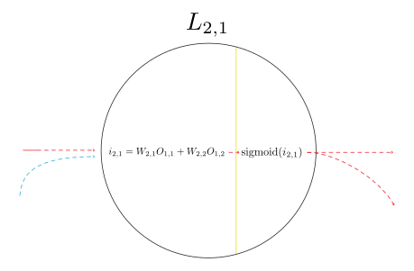

Remember that a neuron processes its inputs by computing the dot product of its weights and inputs (i.e. the sum of its weight-input products) and then passes this resulting _net input_ into its activation function (in this case, it is the sigmoid function).

Say we have passed some training data through the network and computed the total error as $E_\text{total}$. To update the weight $w_{2,1}$, for example, we are looking for the partial derivative $\frac{\partial E_{\text{total}}}{\partial w_{2,1}}$, which by the chain rule is equal to:

$$
\frac{\partial E_{\text{total}}}{\partial w_{2,1}} = \frac{\partial E_\text{total}}{\partial o_{2,1}} \times \frac{\partial o_{2,1}}{\partial i_{2,1}} \times \frac{\partial i_{2,1}}{\partial w_{2,1}}
$$

Then we take this value and subtract it, multiplied by a learning rate $\eta$ (sometimes notated $\alpha$), from the current weight $w_{2,1}$ to get $w_{2,1}$'s updated weight, though updates are only actually applied after these update values have been computed for all of the network's weights.

If we wanted to calculate the update value for $w_{1,1}$, we do something similar:

$$
\frac{\partial E_{\text{total}}}{\partial w_{1,1}} = \frac{\partial E_\text{total}}{\partial o_{1,1}} \times \frac{\partial o_{1,1}}{\partial i_{1,1}} \times \frac{\partial i_{1,1}}{\partial w_{1,1}}
$$

Any activation function can be used with backprop, it just must be differentiable anywhere.

#### The chain rule of derivatives (refresher)

(adapted from the CS231n notes cited below)

Refresher on derivatives: say you have a function $f(x,y,z)$. The derivative of $f$ with respect to $x$ is called a _partial derivative_, since it is only with respect to one of the variables, is notated $\frac{\partial f}{\partial x}$ and is just a function that tells you how much $f$ changes due to $x$ at any point. The gradient is just a vector of these partial derivatives, so that there is a partial derivative for each variable (i.e. here it would be a vector of the partial derivative of $f$ wrt $x$, and then wrt $y$, and then wrt $z$).

As a simple example, consider the function $f(x,y) = xy$. The derivatives here are just $\frac{\partial f}{\partial x} = y, \frac{\partial f}{\partial y} = x$ What does this mean? Well, take $\frac{\partial f}{\partial x} = y$. This means that, at any given point, increasing $x$ by a infinitesimal amount will change the output of the function by $y$ times the amount that $x$ changed. So if $y = -3$, then any small change in $x$ will decrease $f$ by that amount times $-3$.

Now consider the function $f(x,y,z) = (x+y)z$. We can derive this by declaring $q = x+y$ and then re-writing $f$ to be $f=qz$. We can compute the gradient of $f$ in this form (note that it is the same as $f(x,y) = xy$ from before): $\frac{\partial f}{\partial q} = z, \frac{\partial f}{\partial z} = q$. The gradient of $q$ is also simple: $\frac{\partial q}{\partial x} = 1, \frac{\partial q}{\partial y} = 1$. We can combine these gradients to get the gradient of $f$ wrt to $x,y,z$ instead of wrt to $q,z$ as we have now. We can get the missing partial derivatives wrt to $x$ and $y$ by using the chain rule, which just requires that we multiply the appropriate partials:

$$
\frac{\partial f}{\partial x} = \frac{\partial f}{\partial q} \frac{\partial q}{\partial x}, \frac{\partial f}{\partial y} = \frac{\partial f}{\partial q} \frac{\partial q}{\partial y}
$$

In code (adapted from the CS231 notes cited below)

    # set some inputs
    x = -2; y = 5; z = -4

    # perform the forward pass
    q = x + y # q becomes 3
    f = q * z # f becomes -12

    # perform the backward pass (backpropagation) in reverse order:
    # first backprop through f = q * z
    dfdz = q # df/dz = q, so gradient on z becomes 3
    dfdq = z # df/dq = z, so gradient on q becomes -4
    dqdx = 1.
    dqdy = 1.
    # now backprop through q = x + y
    dfdx = dqdx * dfdq # dq/dx = 1. And the multiplication here is the chain rule!
    dfdy = dqdy * dfdq # dq/dy = 1

So essentially you can decompose any function into smaller, simpler functions, compute the gradients for those, then use the chain rule to aggregate them into the original function's gradient.

#### The details

Consider the neural network:

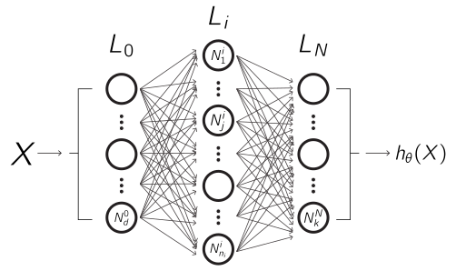

Where:

- $L_i$ is layer $i$
- $N^i_j$ is the $j$th node in layer $i$
- $N$ is the number of layers
- $k$ is the number of outputs, e.g. classes, or $k=1$ for regression
- $n_i$ is the number of nodes in layer $i$

Given training data:

$$
\begin{aligned}
(X^{(1)}&, Y^{(1)}) \\
(X^{(2)}&, Y^{(2)}) \\
&\vdots \\
(X^{(m)}&, Y^{(m)})
\end{aligned}
$$

Where $X^{(i)} \in \mathbb R^{1 \times d}$ and

- $d$ is the dimensionality of the input
- $m$ is the number of training examples

Thus $X$ is the input matrix, $X \in \mathbb R^{m \times d}$.

For a node $N^i_j$:

- $b^i_j$ is the bias for the node (scalar), i.e. $b^i_j \in \mathbb R$
- $w^i_j$ is the weights for the node, $w^i_j \in \mathbb R^{1 \times n_{i-1}}$
- $f^i_j$ is the activation function for the node
- $\text{NET}^i_j$ is the net input for the node, $\text{NET}^i_j = W^i_j \cdot \text{OUT}^{i-1} + b^i_j$, $\text{NET}^i_j \in \mathbb R$
- $\text{OUT}^i_j$ is the output for the node, $\text{OUT}^i_j = f^i_j(\text{NET}^i_j)$, $\text{OUT}^i_j \in \mathbb R$

For a layer $L^i$:

- $b^i$ is the bias vector for the layer, $b^i \in \mathbb R^{n_i \times 1}$, i.e.

$$
b^i = \begin{bmatrix} b^i_1 \\ b^i_2 \\ \vdots \\ b^i_{n_i} \end{bmatrix}
$$

- $W^i$ is the weight matrix for the layer, $W^i \in \mathbb R^{n_i \times n_{i-1}}$, i.e.

$$
W^i = \begin{bmatrix} W^i_1 \\ W^i_2 \\ \vdots \\ W^i_{n_i} \end{bmatrix}
$$

- $f^i$ is the activation function for the layer, since generally $f^i = f^i_1 = f^i_2 = \dots = f^i_{n_i}$
- $\text{NET}^i$ is the net input for the layer:

$$
\text{NET}^i = W^i \cdot \text{OUT}^{i-1} + b^i, \text{NET}^i \in \mathbb R^{n_i \times 1}
$$

- $\text{OUT}^i$ is the output for the layer:

$$
\text{OUT}^i = f^i(\text{NET}^i), \text{OUT}^i \in \mathbb R^{n_i \times 1}
$$

Note that $\text{OUT}^N = h_{\theta}(X)$.

The feed-forward step is a straightforward algorithm:

```
OUT^0 = X
for i in 1...N
    OUT^i = f^i(W^i \cdot OUT^{i-1}+b^i)
```

With backpropagation, we are interested in the gradient $\nabla J$ for each iteration. $\nabla J$ includes the components $\frac{\partial J}{\partial W^i_j}$ and $\frac{\partial J}{\partial b^i_j}$ (that is, how the cost function changes with respect to the weights and biases in the network).

The main advantage of backpropagation is that it allows us to compute this gradient _efficiently_. There are other ways we could do it. For instance, we could manually calculate the partial derivatives of the cost function with respect to each individual weight, which, if we had $w$ weights, would require computing the cost function $w$ times, which requires $w$ forward passes. Naturally, given a complex network with many, many weights, this becomes extremely costly to compute. The beauty of backpropagation is that we can compute these partial derivatives (that is, the gradient), with just a single forward pass.

Some notation:

- $J$ is the cost function for the network (what it is depends on the use case)
- $\delta^i$ is the error for layer $i$
- $\odot$ is the elementwise product ("Hadamard" or "Schur" product)

The error for a layer $i$ is how much the cost function changes wrt to that layer's net input, i.e. $\delta^i = \frac{\partial J}{\partial \text{NET}^i}$.

For the output layer, this is straightforward (by applying the chain rule):

$$
\delta^N = \frac{\partial J}{\partial \text{NET}^N} = \frac{\partial J}{\partial \text{OUT}^N} \frac{\partial \text{OUT}^N}{\partial \text{NET}^N}
$$

Since $\text{OUT}^N = f^N(\text{NET}^N)$, then $\frac{\partial \text{OUT}^N}{\partial \text{NET}^N} = (f^N)'(\text{NET}^N)$.

Thus we have:

$$
\delta^N = \frac{\partial J}{\partial \text{OUT}^N} (f^N)'(\text{NET}^N)
$$

Note that for $\frac{\partial J}{\partial \text{OUT}^N}$, we are computing the derivative of the cost function $J$ with respect to each training example's corresponding output, and then we average them (in some situations, such as when the total number of training examples is not fixed, their sum is used). It is costly to do this across all training examples if you have a large training set, in which case, the minibatch stochastic variant of gradient descent may be more appropriate. (TODO this may need clarification/revision)

For the hidden layer prior to the output, $L^{N-1}$, we would need to connect that layer's net input, $\text{NET}^{N-1}$, to the cost function $J$:

$$
\delta^{N-1} = \frac{\partial J}{\partial \text{NET}^{N-1}} = \frac{\partial J}{\partial \text{OUT}^N} \frac{\partial \text{OUT}^N}{\partial \text{NET}^N} \frac{\partial \text{NET}^N}{\partial \text{OUT}^{N-1}} \frac{\partial \text{OUT}^{N-1}}{\partial \text{NET}^{N-1}}
$$

We have already calculated the term $\frac{\partial J}{\partial \text{OUT}^N} \frac{\partial \text{OUT}^N}{\partial \text{NET}^N}$ as $\delta^N$, so this can be restated:

$$
\delta^{N-1} = \delta^N \frac{\partial \text{NET}^N}{\partial \text{OUT}^{N-1}} \frac{\partial \text{OUT}^{N-1}}{\partial \text{NET}^{N-1}}
$$

Since $\text{OUT}^{N-1} = f^{N-1}(\text{NET}^{N-1})$, then $\frac{\partial \text{OUT}^{N-1}}{\partial \text{NET}^{N-1}} = (f^{N-1})'(\text{NET}^{N-1})'$.

Similarly, since $\text{NET}^N = W^N \cdot OUT^{N-1} + b^N$, then $\frac{\partial \text{NET}^N}{\partial \text{OUT}^{N-1}} = W^N$.

Thus:

$$
\delta^{N-1} = W^N \delta^N \odot (f^{N-1})'(\text{NET}^{N-1})
$$

This is how we compute $\delta^i$ for all $i \neq N$, i.e. we push back (backpropagate) the next ("next" in the forward sense) layer's error, $\delta^{i+1}$, to $L^i$ to get $\delta^i$. So we can generalize the previous equation:

$$
\delta^i = W^{i+1} \delta^{i+1} \odot (f^i)'(\text{NET}^i), i \neq N
$$

We are most interested in updating weights and biases, rather than knowing the errors themselves. That is, we are most interested in the quantities:

$$
\frac{\partial J}{\partial W^i}, \frac{\partial J}{\partial b^i}
$$

For any layer $L_i$.

These are relatively easy to derive.

We want to update the weights such that the error is lowered with the new weights. Thus we compute the gradient of the error with respect to the weights and biases to learn in which way the error is increasing and by how much. Then we move in the opposite direction by that amount (typically weighted by a learning rate).

$$
\begin{aligned}
\frac{\partial J}{\partial b^i} &= \frac{\partial J}{\partial \text{NET}^i} \frac{\partial \text{NET}^i}{\partial b^i} \\
\frac{\partial J}{\partial W^i} &= \frac{\partial J}{\partial \text{NET}^i} \frac{\partial \text{NET}^i}{\partial W^i}
\end{aligned}
$$

We previously showed that $\delta^i = \frac{\partial J}{\partial \text{NET}^i}$, so here we have:

$$
\begin{aligned}
\frac{\partial J}{\partial b^i} &= \delta^i \frac{\partial \text{NET}^i}{\partial b^i} \\
\frac{\partial J}{\partial W^i} &= \delta^i \frac{\partial \text{NET}^i}{\partial W^i}
\end{aligned}
$$

Then, knowing that $\text{NET}^i = W^i \cdot \text{OUT}^{i-1} + b^i$, we get:

$$
\begin{aligned}
\frac{\partial \text{NET}^i}{\partial b^i} &= 1 \\
\frac{\partial \text{NET}^i}{\partial W^i} &= \text{OUT}^{i-1}
\end{aligned}
$$

Thus:

$$
\begin{aligned}
\frac{\partial J}{\partial b^i} &= \delta^i \\
\frac{\partial J}{\partial W^i} &= \delta^i \text{OUT}^{i-1}
\end{aligned}
$$

Then we can use these for gradient descent.

A quick bit of notation: $\delta^{j,i}$ refers to layer $i$'s error for the $j$th training example; similarly, $\text{OUT}^{j,i}$ refers to layer $i$'s output for the $j$th training example.

$$
\begin{aligned}
W^i &\to W^i - \frac{\eta}{m} \sum_j \delta^{j,i} (\text{OUT}^{j, i-1})^T \\
b^i &\to b^i - \frac{\eta}{m} \sum_j \delta^{j,i}
\end{aligned}
$$

So, to clarify, we are computing $\frac{\partial J}{\partial b^i} = \delta^i, \frac{\partial J}{\partial W^i} = \delta^i \text{OUT}^{i-1}$ for each training example and computing their average. As mentioned before, in some cases you may only take their sum, which just involves the removal of the $\frac{1}{m}$ term, so you are effectively just scaling the change.

#### Considerations

Backpropagation is _not_ a guarantee of training at all nor of quick training.

Possible issues include:

- _network paralysis_: if the weights become very large, the neurons' $\text{OUT}$s may become very large, where the derivative of the activation function is very small, so weights are not really updated and get "stuck" at large values.
- _local minima_: statistical training methods can be used (such as simulated annealing), to avoid local minima but increase training time
- _step size_: if it is too small, training is too slow, if it is too large, paralysis or instability (no convergence) are possible
- _stability_: that the network does not mess up its learning of something else to learn another thing. For instance, say it learns good weights for one input, but to learn good weights for another input, it "overwrites" or "forgets" what it learned about the prior input.

Note that in high dimensions, local minima are usually not a problem.

More typically, there are saddle points, which slow down training but can be escaped in time. This is because with many dimensions, it is unlikely that a point is a minimum is _all_ dimensions (if we consider that a point is a minimum in one dimensions with probability $p$, then it has probability $p^n$ to be a minimum in all $n$ dimensions); it is, however, likely that it is a local minimum in some of the dimensions.

As training nears the global minimum, $p$ increases, so if you do end up at a local minimum, it will likely be close enough to the global minimum.

### Statistical (stochastic) training

Statistical (or "stochastic") training methods, contrasted with deterministic training methods (such as backpropagation as described abov), involve some randomness to avoid local minima. They generally work by randomly leaving local minima to possibly find the global minimum. The severity of this randomness decreases over time so that a solution is "settled" upon (this gradual "cooling" of the randomness is the key part of _simulated annealing_).

Simulated annealing applied as a training method to a neural network is called _Boltzmann training_ (neural networks trained in this way are called _Boltzmann machines_):

1. set $T$ (the artificial temperature) to a large value
2. apply inputs, calculate outputs and objective function
3. make random weight changes, recalculate network output and change in objective function
4a. if objective function improves, keep weight changes
4b. if the objective function worsens, accept the change according to the probability drawn from Boltzmann distribution, $P(c)$, select a random variable $r$ from a uniform distribution in $[0, 1]$; if $P(c) > r$, keep the change, otherwise, don't.

$$
P(c) = exp(\frac{-c}{kT})
$$

Where:

- $c$ the change in the objective function
- $k$ a constant analogous to the Boltzmann's constant in simulated annealing, specific for the current problem
- $T$ the artificial temperature
- $P(c)$ the probability of the change $c$ in the objective function

Steps 3 and 4 are repeated for each of the weights in the network as $T$ is gradually decreased.

The random weight change can be selected in a few ways, but one is just choosing it from a Gaussian distribution, $P(w) = exp(\frac{-w^2}{T^2})$, where $P(w)$ is the probability of a weight change of size $w$ and $T$ is the artificial temperature. Then you can use Monte Carlo simulation to generate the actual weight change, $\Delta w$.

Boltzmann training uses the following cooling rate, which is necessary for convergence to a global minimum:

$$
T(t) = \frac{T_0}{log(1+t)}
$$

Where $T_0$ is the initial temperature, and $t$ is the artificial time.

The problem with Boltzmann training is that it can be very slow (the cooling rate as computed above is very low).

This can be resolved by using the Cauchy distribution instead of the Boltzmann distribution; the former has fatter tails so has a higher probability of selecting large step sizes. Thus the cooling rate can be much quicker:

$$
T(t) = \frac{T_0}{1+t}
$$

The Cauchy distribution is:

$$
P(x) = \frac{T(t)}{T(t)^2 + x^2}
$$

where $P(x)$ is the probability of a step of size $x$.

This can be integrated, which makes selecting random weights much easier:

$$
x_c = \rho T(t) \tan(P(x))
$$

Where $\rho$ is the learning rate coefficient and $x_c$ is the weight change.

Here we can just select a random number from a uniform distribution in $(-\frac{\pi}{2}, \frac{\pi}{2})$, then substitute this for $P(x)$ and solve for $x$ in the above, using the current temperature.

Cauchy training still may be slow so we can also use a method based on _artificial specific heat_ (in annealing, there are discrete energy levels where phase changes occur, at which abrupt changes in the "specific heat" occur). In the context of artificial neural networks, we define the (pseudo)specific heat to be the average rate of change of temperature with the objective function. The idea is that there are parts where the objective function is sensitive to small changes in temperature, where the average value of the objective function makes an abrupt change, so the temperature must be changed slowly here so as not to get stuck in a local minima. Where the average value of the objective function changes little with temperature, large changes in temperature can be used to quicken things.

Still, Cauchy training may be much slower than backprop, and can have issues of network paralysis (because it is possible to have very large random weight changes), esp. if a nonlinearity is used as the activation function (see the bit on network paralysis and the sigmoid function above).

Cauchy training may be combined with backprop to get the best of both worlds - it simply involves computing both the backprop and Cauchy weight updates and applying their weighted sum as the update. Then, the objective function's change is computed, and like with Cauchy training, if there is an improvement, the weight change is kept, otherwise, it is kept with a probability determined by the Boltzmann distribution.

The weighted sum of the individual weight updates is controlled by a coefficient $\eta$, such that the sum is $\eta [\alpha \Delta W_{t-1} + (1-\alpha)\delta \text{OUT}] + (1 - \eta) x_c$, so that if $\eta=0$, the training is purely Cauchy, and if $\eta=1$, it becomes purely backprop.

There is still the issue of the possibility of retaining a massive weight change due to the Cauchy distribution's infinite variance, which creates the possibility of network paralysis. The recommended approach here is to detect saturated neurons by looking at their $\text{OUT}$ values - if it is approaching the saturation point (positive or negative), apply some squashing function to its weights (note that this squashing function is not restricted to the range $[-1, 1]$ and in fact may work better with a larger range). This potently reduces large weights while only attenuating smaller ones, and maintains symmetry across weights.


### Learning rates

The amount weights and biases are adjusted is determined by a _learning rate_ $\eta$ (sometimes called a _delta rule_ or _delta function_). This often involves some constant which manages the _momentum_ of learning $\mu$ (see below for more on momentum). This learning constant can help "jiggle" the network out of local optima, but you want to take care that it isn't set so high that the network will also jiggle out of the global optima. As a simple example:

        # LEARNING_CONSTANT is defined elsewhere
        def adjust_weight(weight, error, input):
            return weight + error * input * LEARNING_CONSTANT

In some cases, a _simulated annealing_ approach is used, where the learning constant may be tempered (made smaller, less drastic) as the network evolves, to avoid jittering the network out of the global optima.

#### Adaptive learning rates

Over the course of training, it is often better to gradually decrease the learning rate as you approach an optima so that you don't "overshoot" it.

##### Separate adaptive learning rates

The appropriate learning rate can vary across parameters, so it can help to have different adaptive learning rates for each parameter.

For example, the magnitudes of gradients are often very different across layers (starting small early on, growing larger further on).

The fan-in of a neuron (number of inputs) also has an effect, determining the size of "overshoot" effects (the more inputs there are, the more weights are changed simultaneously, all to adjust the same error, which is what can cause the overshooting).

So what you can do is manually set a global learning rate, then for each weight multiply this global learning rate by a local gain, determined empirically per weight.

One way to determine these learning rates is as follows:

- start with a local gain $g_{ij} = 1$ for each weight $w_{ij}$
- increase the local gain if the gradient for that weight does not change sign
- use small additive increases and multiplicative decreases:

$$
g_{ij}(t) =
\begin{cases}
g_{ij}(t-1) + 0.05 & \text{if} (\frac{\partial E}{\partial w_{ij}} (t) \frac{\partial E}{\partial w_{ij}}(t-1)) > 0 \\
0.95 g_{ij}(t-1) & \text{otherwise}
\end{cases}
$$

This ensures that big gains decay rapidly when oscillations start.

Another tip: limit the gains to line in some reasonable range, e.g. $[0.1, 10]$ or $[0.01, 100]$

Note that these adaptive learning rates are meant for full batch learning or for very big mini-batches. Otherwise, you may encounter gradient sign changes that are just due to sampling error of a mini-batch.

These adaptive learning rates can also be combined with momentum by using agreement in sign between the current gradient for a weight and the velocity for that weight.

Note that adaptive learning rates deal only with axis-aligned effects.


### Training algorithms

There are a variety of gradient descent algorithms used for training neural networks. Some of the more popular ones include the following.

#### Momentum

__Momentum__ is a technique that can be combined with gradient descent to improve its performance.

Conceptually, it applies the idea of velocity and friction to the error surface (imagine a ball rolling around the error surface to find a minimum).

We incorporate a matrix of velocity values $V$, with the same shape as the matrix of weights and biases for the network (for simplicity, we will roll the weights and matrices together into a matrix $W$).

To do so, we break our gradient descent update rule ($W \to W' = W - \eta \nabla J$) into two separate update rules; one for updating the velocity matrix, and another for updating the weights and biases:

$$
\begin{aligned}
V \to V' &= \mu V - \eta \nabla J \\
W \to W' &= W + V'
\end{aligned}
$$

Another hyperparameter, $\mu \in [0, 1]$, is also introduced - this controls the "friction" of the system ($\mu = 1$ is no friction). It is known as the __momentum coefficient__, and it is tuned to prevent "overshooting" the minimum.

You can see that if $\mu$ is set to 0, we get the regular gradient descent update rule.

#### Nesterov momentum

A variation on regular momentum is __Nesterov momentum__:

$$
\begin{aligned}
V \to V' &= \mu V - \eta \nabla J(\theta + \mu V) \\
W \to W' &= W + V'
\end{aligned}
$$

Here we add the velocity to the parameters before computing the gradient.

Using gradient descent with this momentum is also called the _Nesterov accelerated gradient_.

#### Adagrad

__Adagrad__ is an enhancement of Nesterov momentum that keeps track of squared gradients over time. This allows it to identify frequently updated parameters and infrequently updated parameters - as a result, learning rates can be adapted _per parameter_ over time (e.g. higher learning rates are assigned to infrequently updated parameters). This makes it quite useful for sparse data, and also means that the learning rate does not need to be manually tuned.

More formally, for each parameter $\theta_i$ we have $g_{t,i} = \nabla J(\theta_i)$, so we re-write the update for a parameter $\theta_i$ at time $t$ to be:

$$
\theta_{t+1, i} = \theta_{t, i} - \eta \cdot g_{t, i}
$$

The learning rate $\eta$ is then modified at each time step $t$ by a diagonal matrix $G_t \in \mathbb R^{d \times d}$. Each diagonal element $i,i$ in $G_t$ is the sum of squared gradients of parameter $\theta_i$ up to time $t$. In particular, we divide $\eta$ by the square root of this matrix (empirically, the square root improves performance):

$$
\theta_{t+1, i} = \theta_{t, i} - \frac{\eta}{\sqrt{G_{t, ii} + \epsilon}} \cdot g_{t, i}
$$

An additional smoothing term $\epsilon$ is included to prevent division by zero (e.g. `1e-8`).

As vector operations, this is written:

$$
\theta_{t+1} = \theta_{t} - \frac{\eta}{\sqrt{G_{t} + \epsilon}} \odot g_{t}
$$

Note that as training progresses, the denominator term $G_t$ will grow very large (the sum of squared gradients accumulate), such that the learning rate eventually becomes very small and learning virtually ceases.

#### Adadelta

__Adadelta__ is an improvement on Adagrad designed to deal with its halting learning rate. Whereas Adagrad takes the sum of _all_ past squared gradients for a parameter, Adadelta takes only the past $w$ past squared gradients.

This is implemented as follows. We keep a running average $E[g^2]_t$ ($\gamma$ is like a momentum term, usually around 0.9):

$$
E[g^2]_t = \gamma E[g^2]_{t-1} + (1 - \gamma) g^2_t
$$

And then update the Adagrad equation to replace the matrix $G_t$ with this running (exponentially decaying) average:

$$
\Delta \theta_t = - \frac{\eta}{\sqrt{E[g^2]_t + \epsilon}} g_{t}
$$

Note that this running average is the same as the root mean squared (RMS) error criterion of the gradient, so this can be re-written:

$$
\Delta \theta_t = - \frac{\eta}{RMS[g]_{t}}
$$

There is one more enhancement that is part of Adadelta. The learning rate $\eta$'s units (as in "units of measurement", not as in "hidden units") do not match the parameters' units; this is true for all training methods shown up until now. This is resolved by defining another exponentially decaying average, this one of squared parameter updates:

$$
E[\Delta \theta^2]_t = \gamma E[\Delta \theta^2]_{t-1} + (1 - \gamma) \Delta \theta^2_t
$$

The RMS error of this term is also taken:

$$
RMS[\Delta \theta]_{t} = \sqrt{E[\Delta \theta^2]_t + \epsilon}
$$

Thus the Adadelta update is:

$$
\Delta \theta_t = - \frac{RMS[\Delta \theta]_{t}}{RMS[g]_{t}} g_{t}
$$

Note that Adadelta without the numerator RMS term, that is:

$$
\Delta \theta_t = - \frac{\eta}{RMS[g]_{t}}
$$

is known as __RMSprop__; for RMSprop typical values are $\gamma=0.9, \eta=0.001$.

#### Adam

__Adam__, short for "Adaptive Moment Estimation", is, like Adagrad, Adadelta, and RMSprop, an adaptive learning rate algorithm. Like Adadelta and RMSprop, Adam keeps track of an exponentially decaying average of past squared gradients (here, it is $v_t$), but it also keeps track of an exponentially decaying average of past (non-squared) gradients $m_t$, similar to momentum:

$$
\begin{aligned}
m_t &= \beta_1 m_{t-1} + (1 - \beta_1) g_t \\
v_t &= \beta_2 v_{t-1} + (1 - \beta_2) g_t^2
\end{aligned}
$$

$m_t$ and $v_t$ are estimates of the first moment (the mean) and second moment (the uncentered variance) of the gradients, respectively.

Note that the $\beta$ terms are decay rates (typically $\beta_1=0.9, \beta_2=0.999$) and that $m_t, v_t$ are initialized to zero vectors. As such, $m_t, v_t$ tend to be a biased towards zero, so bias-corrected versions of each are computed:

$$
\begin{aligned}
\hat{m}_t &= \frac{m_t}{1 - \beta^t_1} \\
\hat{v}_t &= \frac{v_t}{1 - \beta^t_2}
\end{aligned}
$$

Then the Adam update rule is simply:

$$
\theta_{t+1} = \theta_{t} - \frac{\eta}{\sqrt{\hat{v}_t + \epsilon}} \hat{m}_t
$$


### Batch Normalization

__Batch normalization__ is a normalization method for mini-batch training, which can improve training time (it allows for higher learning rates), act as a regularizer, and reduce the importance of proper parameter initialization. It is applied to _intermediate_ representations in the network.

For a mini-batch $x$ (of size $m$), the sample mean and variance for each feature $k$ is computed:

$$
\begin{aligned}
\bar x_k &= \frac{1}{m} \sum_{i=1}^m x_{i,k} \\
\sigma_k^2 &= \frac{1}{m} \sum_{i=1}^m (x_{i,k} - \bar x_k)^2
\end{aligned}
$$

Each feature $k$ is then standardized as follows:

$$
\hat x_k = \frac{x_k - \bar x_k}{\sqrt{\sigma_k^2 + \epsilon}}
$$

where $\epsilon$ is a small positive constant to improve numerical stability.

Standardizing intermediate representations in this way can weaken the representational power of the layer, so two additional learnable parameters $\gamma$ and $\beta$ are introduced to scale and/or shift the data. Altogether, the batch normalization function is as follows:

$$
\text{BN}_{x_k} = \gamma_k \hat x_k + \beta_k
$$

When $\gamma_k = \sigma_k$ and $\beta_k = \bar x_k$, we recover the original representation.

Given a layer with some activation function $\phi$, which would typically be defined as $\phi(Wx+b)$, we can redefine it with batch normalization:

$$
\phi(\text{BN}(Wx))
$$

The bias is dropped because its effect is cancelled by the standardization.

During test time, we must use $\hat x_k$ and $\sigma_k^2$ as computed over the training data; the final values are usually achieved by keeping a running average of these statistics over the mini-batches during training.

Refer to [Batch Normalized Recurrent Neural Networks](http://arxiv.org/pdf/1510.01378v1.pdf) (César Laurent, Gabriel Pereyra, Philémon Brakel, Ying Zhang, Yoshua Bengio) for more details.

### Cost (loss/objective/error) functions

We have some cost function, which is a function of our parameters, typically notated $J(\theta)$.

For regression, this is often the mean squared error (MSE), also known as the quadratic cost:

$$
J(\theta) = \frac{1}{m} \sum^m (y^{(i)} - h_{\theta}(X^{(i)}))^2
$$

Note that $h_{\theta}$ represents the output of the entire network.

So for a single example, the cost function is:

$$
(y^{(i)} - h_{\theta}(X^{(i)}))^2
$$

For deriving convenience, we'll include a $\frac{1}{2}$ term. Including this term just scales the cost function, which doesn't impact the outcome, and for clarity, we'll substitute $f^N(\text{NET}^N)$ for $h_{\theta}(X^{(i)})$, since they are equivalent.

$$
\frac{(y^{(i)} - f^N(\text{NET}^N))^2}{2}
$$

Deriving with respect to $W^N$ and $b^N$ gives us the following for individual examples:

$$
\begin{aligned}
\frac{\partial J}{\partial W^N} &= (f^N(\text{NET}^N) - y) (f^N)'(\text{NET}^N)X^{(i)} \\
\frac{\partial J}{\partial b^N} &= (f^N(\text{NET}^N) - y) (f^N)'(\text{NET}^N)
\end{aligned}
$$

Note that these are dependent on the derivative of the output layer's activation function, $(f^N)'(NET^N)$. This can cause training to become slow in the case of activation functions like the sigmoid function. This is because the derivative near the sigmoid's tails (i.e. where it outputs values close to 0 or 1) is very low (the sigmoid flattens out at its tails). Thus, when the output layer's function has this property, and outputs values near 0 and 1 (in the case of sigmoid), this reduces the entire partial derivative, leading to small updates, which has the effect of slow learning. When slow learning of this sort occurs (that is, the kind caused by the activation functions outputting at their minimum or maximum), it is called _saturation_, and it is a common problem with neural networks.

For binary classification, a common cost function is the cross-entropy cost, also known as "log loss" or "logistic loss":

$$
J(\theta) = -\frac{1}{m} \sum_i^m \sum_j^k [y^{(i)} \ln h_{\theta}(X^{(i)}) + (1 - y^{(i)}) \ln(1 - h_{\theta}(X^{(i)}))]
$$

where $m$ is the total number of training examples and $k$ is the number of output neurons.

The partial derivatives of the cross-entropy cost with respect to $W^N$ and $b^N$ are (for brevity, we'll notate $f^N(\text{NET}^N)$ as simply $f(n)$):

$$
\begin{aligned}
\frac{\partial J}{\partial W^N} &= \sum_j^k \frac{(y-f(n))}{f(n)(1-f(n))} f'(n) X \\
\frac{\partial J}{\partial b^N} &= \sum_j^k \frac{(y-f(n))}{f(n)(1-f(n))} f'(n)
\end{aligned}
$$

This has the advantage that for some activation functions $f$, such as the sigmoid function, the activation function's derivative $f'$ cancels out, thus avoiding the training slowdown that can occur with the MSE.

However, as mentioned before, this saturation occurs with only some activation functions (like the sigmoid function). This isn't a problem, for instance, with linear activation functions, in which case quadratic cost is appropriate (though neural nets with linear activation functions are limited in what they can learn).

Thus we have:

$$
\delta^N = \frac{\partial J}{\partial \text{OUT}^N} (f^N)'(\text{NET}^N)
$$

#### Log-likelihood cost function

The __log-likelihood cost function__ is defined as, for a single training example:

$$
-\ln f^N_y(\text{NET}^N_y)
$$

That is, given an example that belongs to class $y$, we take the natural log of the value outputted by the output node corresponding to the class $y$ (typically this is the $y$th node, since you'd have an output node for each class). If $f^N_y(\text{NET}^N_y)$ is close to 1, then the resulting cost is low; the further it is from 1, the larger the value is.

This is assuming that the output node's activation function outputs probability-like values (such as is the case with the softmax function).

This cost function's partial derivatives with respect to $W^N$ and $b^N$ work out to be:

$$
\begin{aligned}
\frac{\partial J}{\partial W^N} &= f^{N-1}(n) (f^N(n) - y) \\
\frac{\partial J}{\partial b^N} &= f^N(n) - y
\end{aligned}
$$

For brevity, we've notated $f^N(\text{NET}^N)$ as simply $f^N(n)$, and the same for $f^{N-1}(n)$; for the latter $n=\text{NET}^{N-1}$. (TODO clean this notation up)

Note that for softmax activation functions, we avoid the saturation problem with this cost function. Thus softmax output activations and the log-likelihood cost functions are a good pairing for problems requiring probability-like outputs (such as with classification problems).


#### Common loss functions

| Loss Function             | Propagation                                 | Backpropagation                                                                                                       |
|---------------------------|---------------------------------------------|-----------------------------------------------------------------------------------------------------------------------|
| Square                    | $y = \frac{1}{2}(x-d)^2$                    | $\frac{\partial E}{\partial x} = (x-d)^T \frac{\partial E}{\partial y}$                                               |
| Log, $c = \pm 1$          | $y = \log(1 + e^{-cx})$                     | $\frac{\partial E}{\partial x} = \frac{-c}{1+e^{cx}} \frac{\partial E}{\partial y}$                                   |
| Hinge, $c = \pm 1$        | $y = \max(0, m-cx)$                         | $\frac{\partial E}{\partial x} = -c \mathbb I \{cx < m \} \frac{\partial E}{\partial y}$                              |
| LogSoftMax, $c=1 \dots k$ | $y = \log(\sum_k e^{x_k}) - x_c$            | $[\frac{\partial E}{\partial x}]_s = (\frac{e^{x_s}}{\sum_k} e^{x_k} - \delta_{sc})\frac{\partial E}{\partial y}$     |
| MaxMargin, $c=1 \dots k$  | $y = [\max_{k \neq c} \{x_k + m\} - x_c]_+$ | $[\frac{\partial E}{\partial x}]_s = (\delta_{sk^*} - \delta_{sc}) \mathbb I \{E > 0\} \frac{\partial E}{\partial y}$ |

### Weight initialization

What are the best values to initialize weights and biases to?

Given normalized data, we could reasonably estimate that roughly half the weights will be negative and roughly half will be positive.

As a result, it may seem intuitive to initialize all weights to zero. But you should not - this causes every neuron to have the same output, which causes them to have the same gradients during backpropagation, which causes them to all have the same parameter updates. Thus none of the neurons will differentiate.

Alternatively, we could set each neuron's initial weights to be a random vector from a standard multidimensional normal distribution (mean of 0, standard deviation of 1), scaled by some value, e.g. `0.001` so that they are kept very small, but still non-zero. This process is known as _symmetry breaking_. The random initializations allow the neurons to differentiate themselves during training.

However, this can become problematic.

Consider that the net input to a neuron is:

$$
\text{NET} = W \cdot X + b
$$

The following extends to the general case, but for simplicity, consider an input $X$ that is all ones, with dimension $d$.

Then $\text{NET}$ is a sum of $d+1$ (plus one for the bias) standard normally distributed independent random variables.

The sum of $n$ normally distributed independent random variables is:

$$
N(\sum_i^n \mu_i, \sum_i^n \sigma^2_i)
$$

That is, it is also a normal distribution.

Thus $\text{NET}$ will still have a mean of 0, but it's standard deviation will be $\sqrt{d+1}$.

If for example, $d=100$, this leaves us with a standard deviation of $\sim 10$. This is quite large, and implies that $\text{NET}$ may take on large values due to how we initialized our weights. If $\text{NET}$ takes on large values, we may run into saturation problems given an activation function such as sigmoid, which then leads to slow training. Thus, poor weight initialization can lead to slow training.

This is most problematic for deep networks, since they may reduce the gradient signal that flows backwards by too much (in a weaker version of the gradient "killing" effect).

As the number of inputs to a neuron grows, so too will its output's variance. This can be controlled for (calibrated) by scaling its weight vector by the square root of its "fan-in" (its number of inputs), so you should divide the standard multidimensional distribution sampled random vector by $\sqrt{n}$, where $n$ is the number of the neuron's inputs. For ReLUs, it is recommended you instead divide by $\sqrt{2/n}$. ([Karpathy's CS231n notes](https://cs231n.github.io/neural-networks-2/) provides more detail on why this is.)

An alternative to this fan-in scaling for the uncalibrated variances problem is _sparse initialization_, which is to set all weights to 0, and then break symmetry by randomly connecting every neuron to some fixed number (e.g. 10) of neurons below it by setting those weights to ones randomly sampled from the standard normal distribution like mentioned previously.

Biases are commonly initialized to be zero, though if using ReLUs, then you can set them to a small value like 0.01 so all the ReLUs fire at the start and are included in the gradient backpropagation update.

Elsewhere it is recommended that ReLU weights should be sampled from zero-mean Gaussian distribution with standard deviation of $\sqrt{\frac{2}{d_\text{in}}}$.

Elsewhere it is recommended that you sample your weights uniformly from $[-b, b]$, where:

$$
b = \sqrt{\frac{6}{H_k + H_{k+1}}}
$$

where $H_k$ and $H_{k+1}$ are the sizes of the hidden layers before and after the weight matrix.

### Shuffling & curriculum learning

Generally you should shuffle your data every training epoch so the network does not become biased towards a particular ordering.

However, there are cases in which your network may benefit from a meaningful ordering of input data; this approach is called __curriculum learning__.

### Gradient noise

Adding noise from a Gaussian distribution to each update, i.e.

$$
g_{t, i} = g_{t, i} + N(0, \sigma^2_t)
$$

with variance annealed with the following schedule:

$$
\sigma^2_t = \frac{\eta}{(1 + t)^\gamma}
$$

has [been shown](http://arxiv.org/abs/1511.06807) to make "networks more robust to poor initialization and helps training particularly deep and complex networks. They suspect that the added noise gives the model more chances to escape and find new local minima, which are more frequent for deeper models." ([An overview of gradient descent optimization algorithms, Sebastian Ruder](http://sebastianruder.com/optimizing-gradient-descent/index.html))

### Adversarial examples

Adding noise to input, such as in the accompanying figure, can throw off a classifier. Few strategies are robust against these tricks, but one approach is to generate these adversarial examples and include them as part of the training set.

](assets/adversarial.png)

### Gradient Checking

When you write code to compute the gradient, it can be very difficult to debug. Thus it is often useful to _check the gradient_ by numerically approximating the gradient and comparing it to the computed gradient.

Say our implemented gradient function is $g(\theta)$. We want to check that $g(\theta) = \frac{\partial J(\theta)}{\partial \theta}$.

We choose some $\epsilon$, e.g. $\epsilon = 0.0001$. It should be a small value, but not so small that we run into floating point precision errors.

Then we can numerically approximate the gradient at some scalar value $\theta$:

$$
\frac{J(\theta + \epsilon) - J(\theta - \epsilon)}{2 \epsilon}
$$

When $\theta$ is a vector, as is more often the case, we instead compute:

$$
\frac{J(\theta^{(i+)} - J(\theta^{(i-)})}{2 \epsilon}
$$

Where:

- $\theta^{(i+)} = \theta + (\epsilon \times e_i)$
- $\theta^{(i-)} = \theta - (\epsilon \times e_i)$
- $e_i$ is the $i$th is the basis vector (i.e. it is 0 everywhere except at the $i$th element, where it is 1)


### Training tips

Start training with small, unequal weights to avoid _saturating_ the network w/ large weights. If all the weights start equal, the network won't learn anything.

- Normalize real-valued data (subtract mean, divide by standard deviation (see part on data preprocessing))
- Decrease the learning rate during training
- Use minibatches for a more stable gradient (e.g. use stochastic gradient descent)
- Use momentum to get through plateaus

### Transfer Learning

The practice of transfer learning involves taking a neural net trained for another task and applying it to a different task. For instance, if using an image classification net trained for one classification task, you can use that same network for another, truncating the output layer, that is, take the vectors from the second-to-last layer and use those as feature vectors for other tasks.

## Network architectures

The _architecture_ of a neural network describes how its layers are structured - e.g. how many layers there are, how many neurons in each, and how they are connected.

Neural networks are distinguished by their architecture.

The general structure of a neural network is `input layer -> 0 or more hidden layers -> output layer`.

Neural networks always have one input layer, and the size of that input layer is equal to the input dimensions (i.e. one node per feature), though sometimes you may have an additional bias node.

Neural networks always have one output layer, and the size of that output layer depends on what you're doing. For instance, if your neural network will be a regressor (i.e. for a regression problem), then you'd have a single output node (unless you're doing multivariate regression). Same for binary classification. However with softmax (more than just two classes) you have one output node per class label, with each node outputting the probability the input is of the class associated with the node.

If your data is linearly separable, then you don't need any hidden layers (and you probably don't need a neural network either and a linear or generalized linear model may be plenty).

Neural networks with additional hidden layers become difficult to train; networks with multiple hidden layers are the subject of _deep learning_ (detailed below). For many problems, one hidden layer suffices, and you may not see any performance improvement from adding additional hidden layers.

A rule of thumb for deciding the size of the hidden layer is that the size should be between the size between the input size and output size (for example, the mean of their sizes).

## Overfitting

Because neural networks can have so many parameters, it can be quite easy for them to overfit. Thus it is something to always keep an eye out for. This is especially a problem for large neural networks, which have huge amounts of parameters.

As the network grows in number of layers and size, the network _capacity_ increases, which is to say it is capable of representing more complex functions.

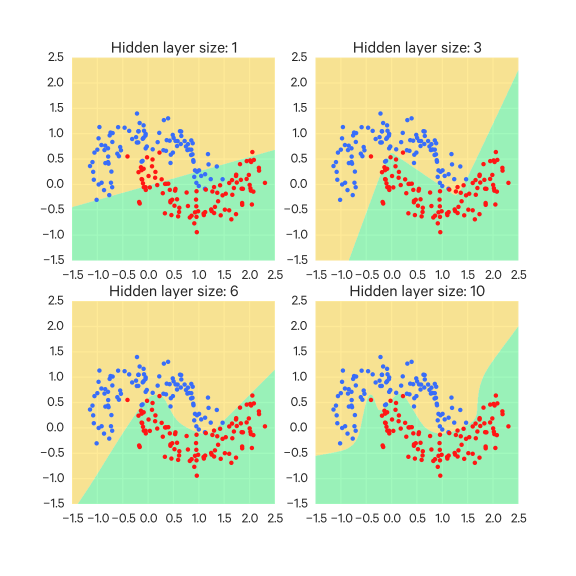

Simpler networks have fewer local minima, but they are easier to converge to and tend to perform worse (they have higher loss). There is a great deal of variance across these local minima, so the outcome is quite sensitive to the random initialization - some times you land in a good local minima, sometimes not. More complex networks have more local minima, but they tend to perform better, and there is less variance across how these local minima perform.

Higher-capacity networks run a greater risk of overfitting, but this overfitting can be (preferably) mitigated by other methods such as L2 regularization, dropout, and input noise. So don't let overfitting be the sole reason for going with a simpler network if a larger one seems appropriate.

Here are regularization examples for the same data from the previous image, with the neural net for 20 hidden neurons:

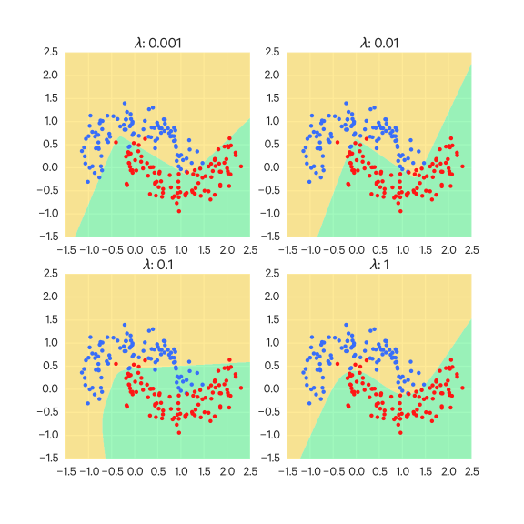

As you can see, regularization is effective at counteracting overfitting.

Another simple, but possibly expensive way of reducing overfitting is by increasing the amount of training data - it's unlikely to overfit many, many examples. However, this is seldom a practical option.

Generally, the methods for preventing overfitting include:

- Get more data, if possible
- Limit your model's capacity so that it can't fit the idiosyncrasies of the data you have. With neural networks, this can be accomplished by:
  - limiting the number of hidden layers and/or number of units per layer
  - start with small weights and stop learning early (so the weights can't get too large)
  - weight decay: penalize large weights using penalties on their squared values (L2) or absolute values (L1)
  - adding Gaussian noise (i.e. $x_i |+ N(0, \sigma_i^2$) to inputs
- Average many different models
  - Use different models with different forms, or
  - Train model on different subsets of the training data ("bagging")
- Use a single neural network architecture, but learn different sets of weights, and average the predictions across these different sets of weights

### Regularization

Regularization techniques are used to prevent neural networks from overfitting.

#### L2 Regularization

L2 regularization is the most common form of regularization. We penalize the squared magnitude of all parameters (weights) as part of the objective function, i.e. we add $\sum \lambda w^2$ to the objective function (this additional term is called the __regularization term__, and $\lambda$ is an additional hyperparameter, the __regularization parameter__). It is common to include $\frac{1}{2}$, i.e. use $\frac{1}{2} \sum \lambda w^2$, so the gradient of this term wrt to $w$ is just $\lambda w$ instead of $2 \lambda w$$. This avoids the network relying heavily on a few weights and encourages it to use all weights a little.

L2 regularization is sometimes called __weight decay__ since the added regularization term penalizes large weights, favoring smaller weights.

So a regularized cost function $J$, from the original unregularized cost function $J_0$, is simply:

$$
J = J_0 + \frac{\lambda}{2m} \sum_w w^2
$$

This affects the partial derivative of the cost function with respect to weights in a simple way (again, biases are not included, so it does not change that partial derivative):

$$
\frac{\partial J}{\partial w} = \frac{\partial J_0}{\partial w} + \frac{\lambda}{m} w
$$

So your update rule would be:

$$
w \to w' = \frac{\eta \lambda}{m} - \frac{\eta}{m} \sum_i^m \frac{\partial J_i}{\partial w}
$$

Note that biases are typically not included by convention; regularizing them usually does not have an impact on the network's generalizability.


#### L1 Regularization

Similar to L2 regularization, except that the regularization term added to the objective function is $\sum \lambda |w|$; that is, the sum of the absolute values of the weights with a regularization parameter $\lambda$.

The main difference between L1 and L2 regularization is that L1 regularization shrinks weights by a constant amount, whereas L2 regularization shrinks weights by an amount proportional to the weights themselves. This is made clearer by considering the derived update rules from gradient descent.

L1 regularization has the effect of causing weight vectors to become sparse, such that neurons only use a few of their inputs and ignore the rest as "noise". Generally L2 regularization is preferred to L1.

For L1, this partial derivative of the cost function wrt the weights is:

$$
\frac{\partial J}{\partial W^N} = \frac{\partial J_0}{\partial W^N} + \frac{\lambda}{m} \text{sign}(W^N)
$$

This ends up leading to the following update rule:

$$
w \to w' = w - \frac{\eta \lambda}{m}\text{sign}(w) - \frac{\eta}{m} \sum_i^m \frac{\partial J_i}{\partial w}
$$

Note that we say that $\text{sign}(0) = 0$.

Compare this with the update rule for L2 regularization:

$$
w \to w' = w - \frac{\eta \lambda}{m}w - \frac{\eta}{m} \sum_i^m \frac{\partial J_i}{\partial w}
$$

In L2 regularization, we subtract a term weighted by $w$, whereas in L1 regularization, the subtracted term is affected only by the sign of $w$.


#### Elastic net regularization

This is just the combination of L1 and L2 regularization, such that the term introduced to the objective function is $\sum \lambda_1 |w| + \lambda_2 w^2$.

#### Max norm constraints

This involves setting an absolute upper bound on the magnitude of the weight vectors; that is, after updating the parameters/weights, clamp every weight vector so that it satisfies $||w||_2 < c$, where $c$ is some constant (the maximum magnitude).

#### Dropout

Dropout is a regularization method which works well with the others mentioned so far (L1, L2, maxnorm). It does not involve modifying cost functions. Rather, the network itself is modified.

During training, we specify a probability $p$. At the start of each training epoch, we only keep a neuron active with that probability $p$, otherwise we set its output to zero. If the neuron's output is set to 0, that has the effect of temporarily "removing" that neuron for that training iteration. At the end of the epoch, all neurons are restored.

This dropout is applied only at training time and applied per-layer (that is, it is applied after each layer, see the code example below). This prevents the network from relying too much on certain neurons.

One way to think about this is that, for each training step, a sub-network is sampled from the full network, and only those parameters are updated. Then on the next step, a different sub-sample is taken and updated, and so on.

To put it another way, dropping out neurons in this way has the effect of training multiple neural networks simultaneously. If we have multiple networks overfit to different training data, they are unlikely to all overfit in the same way. So their average should provide better results.

This has the additional advantage that neurons must learn to operate in the absence of other neurons, which can have the effect of the network learning more robust features. That is, the neurons of the network should be more resilient to the absence of some information.

](assets/dropout.jpeg)

At test time, all neurons are active (i.e. we don't use dropout at test time). There will be twice as many hidden neurons active as there were in training, so all weights are halved to compensate.

We must scale the activation functions by $p$ to maintain the same expected output for each neuron. Say $x$ is the output of a neuron without dropout. With dropout, the neuron's output has a chance $p$ of being set to 0, so its expected output becomes $px$ (more verbosely, it has $1-p$ chance of becoming 0, so its output is $px + (1-p)0$, which simplifies to $px$). Thus we must scale the outputs (i.e. the activation functions) by $p$ to keep the expected output consistent.

This scaling can be applied at training time, which is more efficient - this technique is called _inverted dropout_.

For comparison, here is an implementation of regular dropout and an implementation of inverted dropout (source from: <https://cs231n.github.io/neural-networks-2/>)

    # Dropout
    p = 0.5 # probability of keeping a unit active. higher = less dropout

    def train_step(X):
      """ X contains the data """

      # forward pass for example 3-layer neural network
      H1 = np.maximum(0, np.dot(W1, X) + b1)
      U1 = np.random.rand(*H1.shape) < p # first dropout mask
      H1 *= U1 # drop!
      H2 = np.maximum(0, np.dot(W2, H1) + b2)
      U2 = np.random.rand(*H2.shape) < p # second dropout mask
      H2 *= U2 # drop!
      out = np.dot(W3, H2) + b3

      # backward pass: compute gradients... (not shown)
      # perform parameter update... (not shown)

    def predict(X):
      # ensembled forward pass
      H1 = np.maximum(0, np.dot(W1, X) + b1) * p # NOTE: scale the activations
      H2 = np.maximum(0, np.dot(W2, H1) + b2) * p # NOTE: scale the activations
      out = np.dot(W3, H2) + b3

    # Inverted dropout
    p = 0.5 # probability of keeping a unit active. higher = less dropout

    def train_step(X):
      # forward pass for example 3-layer neural network
      H1 = np.maximum(0, np.dot(W1, X) + b1)
      U1 = (np.random.rand(*H1.shape) < p) / p # first dropout mask. Notice /p!
      H1 *= U1 # drop!
      H2 = np.maximum(0, np.dot(W2, H1) + b2)
      U2 = (np.random.rand(*H2.shape) < p) / p # second dropout mask. Notice /p!
      H2 *= U2 # drop!
      out = np.dot(W3, H2) + b3

      # backward pass: compute gradients... (not shown)
      # perform parameter update... (not shown)

    def predict(X):
      # ensembled forward pass
      H1 = np.maximum(0, np.dot(W1, X) + b1) # no scaling necessary
      H2 = np.maximum(0, np.dot(W2, H1) + b2)
      out = np.dot(W3, H2) + b3


#### Regularization recommendations

> It is most common to use a single, global L2 regularization strength that is cross-validated. It is also common to combine this with dropout applied after all layers. The value of $p=0.5$ is a reasonable default, but this can be tuned on validation data. <https://cs231n.github.io/neural-networks-2/>


### Artificially expanding the training set

In addition to regularization, training on more data can help prevent overfitting. This, unfortunately, is typically not a practical option. However, the training set can be artificially expanded by taking existing training data and modifying it in a way we'd expect to see in the real world.

For instance, if we were training a network to recognize handwritten digits, we may take our examples and rotate them slightly, since this could plausibly happen naturally.

A related technique is training on adversarial examples (detailed elsewhere), in which training examples are modified to be deliberately hard for the network to classify, so that it can be trained on more ambiguous/difficult examples.

The most common approach to dealing with overfitting is to apply some kind of regularization.

## Hyperparameters

There are many hyperparameters to set with neural networks, such as:

- architecture decisions
    - number of layers
    - number of units per layer
    - type of unit
    - etc
- weight penalty
- learning rate
- momentum
- whether or not to use dropout
- etc

### Choosing hyperparameters

TODO See: <https://cs231n.github.io/neural-networks-3/#anneal>

Not only are there many hyperparameters for neural networks; it can also be very difficult to choose good ones.

You could do a naive grid search and just try all possible combinations of hyperparameters, which is infeasible because it blows up in size.

You could randomly sample combinations as well, but this still has the problem of repeatedly trying hyperparameter values which may have no effect.

Instead, we can apply machine learning to this problem and try and learn what hyperparameters may perform well based on the attempts thus far. In particular, we can try and predict regions in the hyperparameter space that might do well. We'd want to also be able to be explicit about the uncertainty in our prediction.

We can use Gaussian process models to do so. The basic assumption of these models is that similar inputs give similar outputs.

However, what does "similar" mean? Is 200 hidden units "similar" to 300 hidden units or not? Fortunately, such models can also learn this scale of similarity for each hyperparameter.

These models predict a Gaussian distribution of values for each hyperparameter (hence the name).

A method for applying this:

- keep track of the best hyperparameter combination so far
- pick a new combination of hyperparameters such that the expected improvement of the best combination is big

So we might try a new combination, and it might not do that well, but we won't have replaced our current best.

This method for selecting hyperparameters is called _Bayesian (hyperparameter) optimization_, and is a better approach than by picking hyperparameters by hand (less prone to human error).


### Tweaking hyperparameters

A big challenge in designing a neural network is calibrating its hyperparameters. From the start, it may be difficult to intuit what hyperparameters need tuning. There are so many to choose from: network architecture, number of epochs, cost function, weight initialization, learning rate, etc.

There are a few heuristics which may help.

When the learning rate $\eta$ is set too high, you typically see constant oscillation in the error rate as the network trains. This is because with too large a learning rate, you may miss the minimum in the error surface by "jumping" too far. Thus once you see this occurring, it's a hint to try a lower learning rate.

Learning rates which are too low tend to have a slow decrease in error over training. You can try higher learning rates if this seems to be the case.

The learning rate does not need to be fixed. When starting out training, you may want a high learning rate to quickly get close to a minimum. But once you get closer, you may want to decrease the learning rate to carefully identify the best minimum.

The specification of how the learning rate decreases is called the __learning rate schedule__.

Some places recommend using a learning rate in the form:

$$
\eta_t = \eta_0 (1 + \eta_0 \lambda t)^{-1}
$$

Where $\eta_0$ is the initial learning rate, $\eta_t$ is the learning rate for the $t$th example, and $\lambda$ is another hyperparameter.

For the number of epochs, we can use a strategy called "early stopping", where we top once some performance metric (e.g. classification accuracy) appears to stop improving. More precisely, "stop improving" can mean when the performance metric doesn't improve for some $n$ epochs.

However, neural networks sometimes plateau for a little bit and then keep on improving. In which case, adopting an early stopping strategy can be harmful. You can be somewhat conservative and set $n$ to a higher value to play it safe.

## Deep neural networks

A _deep neural network_ is simply a neural network with more than one hidden layer. _Deep learning_ is the field related to deep neural networks. These deep networks can perform much better than shallow networks (networks with just one hidden layer) because they can embody a complex hierarchy of concepts.

Many problems can be broken down into subproblems, each of which can be addressed by a separate neural network.

Say for example we want to know whether or not a face is in an image. We could break that down (_decompose_ it) into subproblems like:

- is there an eye?
- is there an ear?
- is there a nose?
- etc.

We could train a neural network on each of these subproblems. We could even break these subproblems further (e.g. "Is there an eyelash?", "Is there an iris?", etc) and train neural networks for those, and so on.

Then if we want to identify a face, we can aggregate these networks into a larger network.

This kind of multi-layered neural net is a _deep neural network_.

Multilayer nns must have nonlinear activation functions, otherwise they are equivalent to a single layer network aggregating its weights.

That is, a 2 layer network has weight vectors $W_1$ and $W_2$ and input X. The network computes $(XW_1)W_2$, which is equivalent to $X(W_1W_2)$, so the network is equivalent to a single layer network with weight vectors $W_1W_2$

Training deep neural networks (that is, neural networks with more than one hidden layer) is not as straightforward as it is with a single hidden layer - a simple stochastic gradient descent + backpropagation approach is not as effective or quick.

This is because of __unstable gradients__. This has two ways of showing up:

- __Vanishing gradients__, in which the gradient gets smaller moving backwards through the hidden layers, such that earlier layers learn very slowly (and may not learn at all).
- __Exploding gradients__, in which the gradient gets much larger moving backwards through the hidden layers, such that earlier layers cannot find good parameters.

These unstable gradients occur because gradients in earlier layers are the products of the later layers (refer to backpropagation for details, but remember that the $\delta^i$ for layer $i$ is computed from $\delta^{i+1}$). Thus if these later terms are mostly $< 1$, we will have a vanishing gradient. If these later terms are $> 1$, they can get very large and lead to an exploding gradient.

### Unstable gradients

Certain neural networks, such as RNNs, can have __unstable gradients__, in which gradients may grow exponentially (an __exploding gradient__) or shrink exponentially until it reaches zero (a __vanishing gradient__).

With exploding gradients, the minimum is not found because, with such a large gradient, the steps don't effectively search the space.

With vanishing gradients, the minimum is not found because a gradient of zero means the space isn't searched at all.

Unstable gradients can occur as a result of drastic changes in the cost surface, as illustrated in the accompanying figure (from [Pascanu et al](http://www.jmlr.org/proceedings/papers/v28/pascanu13.pdf) via <http://peterroelants.github.io/posts/rnn_implementation_part01/>).


In the figure, the large jump in cost leads to a large gradient which causes the optimizer to make an exaggerated step.

There are methods for dealing with unstable gradients, including:

- Gradient clipping (e.g. limiting $g$ to $g = \frac{t}{||g||_2}$ if $||g||_2 > t$, where $t$ is some clipping threshold)
- Hessian-Free Optimization
- Momentum
- Resilient backpropagation (Rprop)

#### Resilient backpropgation (Rprop)

Normally, weights are updated by the size of the gradient (typically scaled by some learning rate). However, as demonstrated above, this can lead to an unstable gradient.

Resilient backpropagation ignores the size of the gradient and only considers its sign and then uses two hyperparameters, $\eta^-, \eta^+$ ($\eta^+ > 1$) to determine the size of the update. $\eta^-$.

If the sign of the gradient changes in an iteration, the weight update $\Delta$ is multiplied by $\eta^-$, i.e. $\Delta = \Delta \eta^-$. If the gradient's sign doesn't change, the weight update $\Delta$ is multiplied by $\eta^+$, i.e. $\Delta = \Delta \eta^+$.

If the gradient's sign changes, this usually indicates that we have passed through a local minima.

Then the weight is updated by this computed value in the opposite direction of its gradient:

$$
W \to W' = W - \text{sign}(\frac{\partial J}{\partial W}) \Delta
$$

Typically, $\eta^+ = 1.2, \eta^- = 0.5$.

This is essentially separate adaptive learning rates but ignoring the size of the gradient and only look at the sign. That is, we increase weights multiplicatively by $\eta^+$ if the last two gradient signs agree, otherwise, we decrease the step size multiplicatively by $\eta^-$. As with separate adaptive learning rates, we generally want to limit the range of step sizes so that it can't be too small or too large.

Rprop is meant for full batch learning or for very large mini-batches. To use this technique with mini-batches, see Rmsprop.

### Rmsprop

__Rmsprop__ is the mini-batch version of Rprop. It computes a moving average, $\text{MA}$, of the squared gradient for each parameter:

$$
\text{MA} = \lambda \text{MA} + (1 - \lambda)(\frac{\partial J}{\partial W})^2
$$

Then normalizes the gradient by dividing by the square root of this moving average:

$$
\frac{\partial J}{\partial W} \frac{1}{\sqrt{\text{MA}}}
$$

Rmsprop can be used with momentum as well (i.e. update the velocity with this modified gradient).

> The basic idea behind rmsprop is to adjust the learning rate per-parameter according to the (smoothed) sum of the previous gradients. Intuitively this means that frequently occurring features get a smaller learning rate (because the sum of their gradients is larger), and rare features get a larger learning rate. <http://www.wildml.com/2015/10/recurrent-neural-network-tutorial-part-4-implementing-a-grulstm-rnn-with-python-and-theano/>

## Convolutional Neural Networks (CNNs)

In a regular neural network, the relationship between a pixel and one that is next to it is the same as its relationship with a pixel far away - the structural information of the image is totally lost. Convolutional nets are capable of encoding this structural information about the image; as a result, they are especially effective with image-based tasks.

Convolutional nets are based on three ideas:

- local receptive fields
- shared weights
- pooling

### Local receptive fields

A regular neural network is _fully-connected_ in that every node from a layer $i$ is connected to each node in the layer $i+1$.

This is not the case with convolutional nets.

Typically we think of a layer as a line of neurons. With convolutional nets, it is more useful to think of the neurons arranged in a grid.

(Note: the following images are from <http://neuralnetworksanddeeplearning.com/chap6.html> TODO replace the graphics)

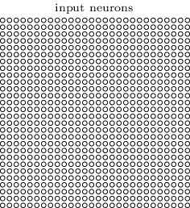

We do _not_ fully connect this input layer to the hidden layer (which we'll call a __convolutional layer__). Rather, we connect regions of neurons to neurons in the hidden layer. These regions are __local receptive fields__, local to the neuron at their center (they may more simply be called _windows_).

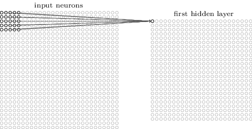

We can move across local receptive fields one neuron at a time, or in greater movements. These movements are called the __stride length__.

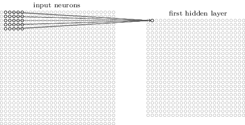

These windows end up learning to detect salient features, but are less sensitive to where exactly they occur. For instance, for recognizing a human face, it may be important that we see an eye in one region, but it doesn't have to be in a particular exact position. A __filter__ (also called a __kernel__) function is applied to each window to transform it into another vector (which is then passed to a pooling layer, see below).

One architectural decision with CNNs is the use of __wide convolution__ or __narrow convolution__. When you reach the edges of your input (say, the edges of an image), do you stop there or do you pad the input with zeros (or some other value) so we can fit another window? Padding the input is wide convolution, not padding is narrow convolution. Note that, as depicted above, narrow convolution will yield a smaller feature map of size: input shape - filter shape + 1.

Note that this hyperparameter is sometimes called "border mode". A border mode of "valid" is equivalent to a narrow convolution.

There are a few different ways of handling padding for a wide convolution. Border modes of "half" (also called "same") and "full" correspond to different padding strategies.

Say we have a filter of size $r \times c$ (where $r$ is rows and $c$ is columns). For a border mode of "half"/"same", we pad the input with a symmetric border of $r//2$ rows and $c//2$ columns (where $//$ indicates integer division). When $r$ and $c$ are both odd, the feature map has the same shape as the input.

There is also a "full" border mode which pads the input with a symmetric border of $r-1$ rows and $c-1$ columns. This is equivalent to applying the filter anywhere it overlaps with a pixel and yields a feature map of size: input shape + filter shape - 1.

For example, say we have the following image:

```
xxx
xxx
xxx
```

Say we have a 3x3 filter.

For a border mode of "half"/"same", we the padded image would look like (padding is indicated with `o`):

```
ooooo
oxxxo
oxxxo
oxxxo
ooooo
```

For a border mode of "full", the padded image would instead be:

```
ooooooo
ooooooo
ooxxxoo
ooxxxoo
ooxxxoo
ooooooo
ooooooo
```

### Shared weights

Another change here is that the hidden layer has one set of weights and a bias that is shared across the entire layer (these weights and biases are accordingly referred to as _shared weights_ and the _shared bias_, and together, they define a __filter__ or a __kernel__).

As a result, if we have receptive fields of $m \times m$ size, the output of the $i,j$th neuron in the hidden layer looks like:

$$
f(b + \sum^{m-1}_{k=0} \sum^{m-1}_{l=0} W_{k,l} \text{OUT}^0_{i+k,j+l})
$$

Where $W \in \mathbb R^{m \times m}$ is the array of shared weights and $\text{OUT}^0_{x,y}$ is the output of the input neuron at position $x,y$.

Another way of writing the above is:

$$
f(b + W * \text{OUT}^0)
$$

Where $*$ is the _convolution operator_, which is like a blurring/mixing of functions. In this context, it is basically a weighted sum.

The consequence of this sharing of weights and biases is that this layer detects the same feature across different receptive fields. For example, this layer could detect vertical edges anywhere in the image. If an edge shows up in the upper-right part of the image, the corresponding input neuron for that receptive field will fire. If an edge shows up in the lower-left part of the image, the corresponding input neuron for that receptive field will also fire, due to the fact that they all share weights and a bias.

As a result of this property, this mapping between layers is often called a __feature map__. Technically, the kernel/filter _output_ a feature map, which is to say they are not the same thing, but in practice the terms "kernel" and "filter" are often used interchangeably with "feature map".

For example, say we have a 3x3 filter:

$$
\begin{bmatrix}
0, 0, 0 \\
0, 0, 0 \\
0, 0, 0
\end{bmatrix}
$$

Each position in the filter is a weight to be learned; here we have initialized them to 0 (not necessarily the best choice, but this is just an example).

Each position in the filter lines up with a pixel as the filter slides across the image (as depicted above)

Let's say that the weights learned by the filter end up being the following:

$$
\begin{bmatrix}
-1, -1, -1 \\
-1, 10, -1 \\
-1, -1, -1
\end{bmatrix}
$$

Then say we place the filter over the following patch of pixels:

$$
\begin{bmatrix}
0, 0, 0 \\
0, 255, 0 \\
0, 0, 0
\end{bmatrix}
$$

We want to combine (i.e. mix) the filter and the pixel values to produce a single pixel value (which will be a single pixel in the resulting feature map). We do so by convolving them as the sum of the element-wise product:

$$
(-1 \times 0) + (-1 \times 0) + (-1 \times 0) +
(-1 \times 0) + (10 \times 255) + (-1 \times 0) +
(-1 \times 0) + (-1 \times 0) + (-1 \times 0)
$$

Pixel-by-pixel the feature map is produced in this way.

We may include multiple feature maps/filters, i.e. have the input connect to many hidden layers of this kind (this is typically how it's done in practice). Each layer would learn to detect a different feature.

Another benefit to sharing weights and biases across the layer is that it introduces some resilience to overfitting - the sharing of weights means that the layer cannot favor peculiarities in particular parts of the training data; it must take the whole example into account. As a result, regularization methods are seldom necessary for these layers.

### Pooling layers

In addition to convolutional layers there are also __pooling layers__, which often accompany convolutional layers (often one per convolutional layer) and follow after them. Pooling layers produced a condensed version of the feature map they are given (for this reason, this process is also known as _subsampling_, so pooling layers are sometimes called _subsampling layers_). For example, a $2 \times 2$ neuron region of the feature map may be represented with only one neuron in the pooling layer.

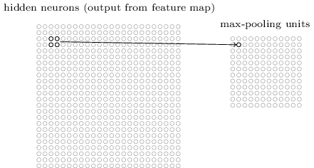

There are a few different strategies for how this compression works. A common one is __max-pooling__, in which the pooling neuron just outputs the maximum value of its inputs. In some sense, max-pooling asks its region: was your feature present? And activates if it was. It isn't concerned with where in that region the feature was, since in practice, its precise location doesn't matter so much as its relative positioning to other features (especially with images).

Another pooling technique is __L2 pooling__. Say a pooling neuron has an $m \times m$ input region of neurons coming from the layer $i$. Then it's output is:

$$
\sqrt{\sum^{m-1}_{j=0} \sum^{m-1}_{k=0} (\text{OUT}^i_{j,k})^2}
$$

Another pooling technique is __average-pooling__ in which the average value of the input is output.

There is also the __$k$-max pooling__ method, which takes the top $k$ values in each dimension, instead of just the top value as is with max-pooling. The result is a matrix rather than a vector.


### Network architecture

Generally, we have many feature maps (convolutional layers) and pooling layer pairs grouped together; conceptually it is often easier to think of these groups themselves as layers (called "convolutional-pooling layers").

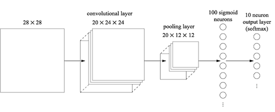

The output layer is fully-connected (i.e. every neuron from the convolutional-pooling layer are connected to every neuron in the output layer).

Often it helps to include another (or more) fully-connected layer just prior to the output layer. This can be thought of as aggregating and considering all the features coming from the convolutional-pooling layer.

It is also possible to insert additional convolutional-pooling layers (this practice is called __hierarchical pooling__). Conceptually, these take the features output by the previous convolutional-pooling layer and extract higher-level features. The way these convolutional-pooling layers connect to each other is a little different. Each of this new layer's input neurons (that is, the neurons in its first set of convolutional layers) takes as its input _all_ of the outputs (within its local receptive field) from the preceding convolutional-pooling layer.

For example, if the preceding convolutional-pooling layer has 20 layers in it, and we have receptive fields of size $5 \times 5$, then each of the input neurons for the new convolutional-pooling layer would have $20 \times 5 \times 5$ inputs.

### Training CNNs

Backpropagation is slightly different for a convolutional net because the typical backpropagation assumes fully-connected layers.

TODO add this

### Convolution kernels

CNNs learn a _convolution kernel_ and (for images) apply it to every pixel across the image:

](assets/kernel_convolution.jpg)

## Recurrent Neural Networks (RNNs)

A _recurrent neural network_ is a _feedback_ neural network, that is, it is a neural net where the outputs of neurons are fed back into their inputs. They have properties which give them advantages over feed-forward NNs for certain problems. In particular, RNNs are well-suited for handling _sequences_ as input.

With machine learning, data is typically represented in vector form. This works for certain kinds of data, such as numerical data, but not necessarily for other kinds of data, like text. We usually end up coercing text into some vector representation (e.g. TF-IDF) and end up losing much of its structure (such as the order of words). This is ok for some tasks (such as topic detection), but for many others we are throwing out important information. We could use bigrams or trigrams or so on to preserve some structure but this becomes unmanageably large (we end up with very high-dimension vectors).

Recurrent neural networks are able to take _sequences_ as input, i.e. iterate over a sequence, instead of fixed-size vectors, and as such can preserve the sequential structure of things like text and have a stronger concept of "context".

Basically, an RNN takes in each item in the sequence and updates a hidden representation (its state) based on that item and the hidden representation from the previous time step. If there is no previous hidden representation (i.e. we are looking at the first item in the sequence), we can initialize it as either all zeros or treat the initial hidden representation as another parameter to be learned.

Another way of putting this is that the core difference of an RNN from a regular feedforward network is that the output of a neuron is a function of its inputs _and_ of its past state, e.g.

$$
\text{OUT}_t = f(\text{OUT}_{t-1} W_r + X_t W_x)
$$

Where $W_r$ are the __recursive weights__.

### Network architecture

In the most basic RNN, the hidden layer have two inputs: the input from the previous layer, and the layer's own output from the previous time step (so it loops back onto itself):

](assets/rnn_1.png)

This simple network can be visualized over time as well:

](assets/rnn_2.png)

Say we have a hidden layer $L_1$ of size 3 and another hidden layer $L_2$ of size 2. In a regular NN, the input to $L_2$ is of size 3 (because that's the output size of $L_1$). In an RNN, $L_2$ would have 3+2 inputs, 3 from $L_1$, and 2 from its own previous output.

This simple feedback mechanism offers a kind of short-term memory - the network "remembers" the output from the previous time step.

It also allows for variable-sized inputs and outputs - the inputs can be fed in one at a time and combined by this feedback mechanism.

### RNN inputs

The input item can be represented with _one-hot encoding_, i.e. each term is to a vector of all zeroes and one 1. For example, if we had the vocabulary $\\{\text{the}, \text{mad}, \text{cat} \\}$, the terms might be respectively represented as $[1,0,0], [0,1,0], [0,0,1]$.

Another way to represent these terms is with an _embedding matrix_, in which each term is mapped to some index of the matrix which points to some $n$-dimensional vector representation. So the RNN learns vector representations for each term.

 Convolutional neural networks, and feed-forward neural networks in general, treat an input the same no matter when they are given it. For RNNs, the hidden representation is like (short-term) "memory" for the network, so context is taken into account for inputs; that is, an input will be treated differently depending on what the previous input(s) was/were.

### Training RNNs

(Note that RNNs train very slowly on CPUs; they train significantly faster on GPUs.)

RNNs are trained using a variant of backpropagation called __backpropagation through time__, which just involves unfolding the RNN a certain number of time steps, which results in what is essentially a regular feedforward network, and then applying backpropagation:

$$
\frac{\partial E}{\partial \text{OUT}_{t-1}} = \frac{\partial E}{\partial \text{OUT}_t} \frac{\partial \text{OUT}_t}{\partial \text{OUT}_{t-1}} = \frac{\partial E}{\partial \text{OUT}_t}W_r
$$

which starts with:

$$
\frac{\partial E}{\partial y} = \frac{\partial E}{\partial \text{OUT}_n}
$$

Where $\text{OUT}_n$ is the output of the last layer.

The gradients of the cost function wrt to the weights is computed by summing the weight gradients in each layer:

$$
\begin{aligned}
\frac{\partial E}{\partial W_x} &= \sum^n_{k=0} \frac{\partial E}{\partial \text{OUT}_t} X_t \\
\frac{\partial E}{\partial W_r} &= \sum^n_{k=1} \frac{\partial E}{\partial \text{OUT}_t} \text{OUT}_{t-1}
\end{aligned}
$$

This summing of the weight gradients at each time step is the main difference from regular feedforward networks, aside from that BPTT is basically just backpropagation on an RNN unrolled up to some time step $t$.

However, if working with long sequences, this is effectively like training a deep network with many hidden layers (i.e. this is equivalent to an unrolled RNN), which can be difficult (due to vanishing or exploding gradients). In practice, it's common to truncate the backpropagation by running it for only to a few time steps back.

The vanishing gradient problem in RNNs means long-term dependencies won't be learned - the effect of earlier steps "vanish" over time steps (this is the same problem of vanishing gradients in deep feedforward networks, given that an RNN is basically a deep neural net).

Exploding gradients are more easily dealt with - it's obvious when they occur (you'll see `NaN`s, for instance), and you can clip them at some maximum value, which can be quite effective (refer to [this paper](http://www.jmlr.org/proceedings/papers/v28/pascanu13.pdf))

Some strategies for dealing with vanishing gradients:

- vanishing gradients are sensitive to weight initialization, so proper weight initialization can help avoid them
- ReLUs can work better as the nonlinear activation functions since they are not bounded by 1 as the sigmoid and $\tanh$ nonlinearities are

Generally, however, Long Short-Term Memory (LSTM) and Gated Recurrent Unit (GRU) architectures are used instead of vanilla RNNs, which were designed for mitigating vanishing gradients (for the purpose of better learning long-range dependencies).

### LSTMs

This short-term memory of (vanilla) RNNs may be _too_ short. RNNs may incorporate _long short-term memory_ (LSTM) units instead, which just computes hidden states in a different way.

With an LSTM unit, we have memory stored and passed through a more involved series of steps. This memory is modified in each step, with something being added and something being removed at each step. The result is a neural network that can handle longer-term context.

These LSTM units have a three gates (in contrast to the single activation function vanilla RNNs have):

- _write_ (_input_) - controls the amount of current input to be remembered
- _read_ (_output_) - controls the amount of memory given as output to the next stage
- _erase_ (_forget_) - controls what part of the memory is erased or kept in the current time step

](assets/lstm_unit.png)

TODO include Chris Olah's LSTM diagrams: <http://colah.github.io/posts/2015-08-Understanding-LSTMs/>

These gates are sigmoid functions combined with a pointwise multiplication operation. They are called gates because they tune how much of their input is passed on (i.e. sigmoids give a value in $[0,1]$, which can be thought as the percent of input to pass on). The parameters for these gates are learned.

The input gate determines how much of the input is let through, the forget gate determines how much of the previous state is let through. We compute a new "memory" (i.e. the LSTM unit's internal state) from the outputs of these gates. The output gate determines how much of this new memory to output as the hidden state.

In more detail:

The forget gate controls what is removed ("forgotten") from the cell state. The input to the forget gate is the concatenation of the cell's output from the previous step, $\text{OUT}_{t-1}$ and the current input to the cell, $X_t$. The gate computes a value in $[0,1]$ (with the sigmoid function) for _each_ value in the previous cell state $C_{t-1}$; the resulting value determines how much of that value to keep (1 means keep it all, 0 means forget all of it). So we are left with a vector of values in $[0,1]$, which we then pointwise multiply with the existing cell state to get the updated cell state.

The output of a forget gate $f$ at step $t$ is:

$$
f_t = \text{sigmoid}(W_f \dot [\text{OUT}_{t-1}, X_t] + b_f)
$$

Then our intermediate value of $C_t$ is $C_t' = f_t C_{t-1}$.

Where $W_f, b_f$ are the forget gate's weight vector and bias, respectively.

The input gate controls what information gets stored in the cell state. This gate also takes as input the concatenation of $\text{OUT}_{t-1}$ and $X_t$. We will denote its output at step $t$ as $i_t$. Like the forget gate, this is a vector of values in $[0, 1]$ which determine how much information gets through - 0 means none, 1 means all of it.

A $\tanh$ function takes the same input and outputs a vector of candidate values, $\tilde C_t$.

We pointwise multiple this candidate value vector with the input gate's output vector to get the vector that is passed to the cell state. This resulting vector is pointwise added to the updated cell state.

$$
\begin{aligned}
i_t &= \text{sigmoid}(W_i \dot [\text{OUT}_{t-1}, X_t] + b_i) \\
\tilde C_t &= \tanh(W_C \dot [\text{OUT}_{t-1}, X_t] + b_C)
\end{aligned}
$$

Thus our final updated value of $C_t$ is $C_t = C_t' + i_t \tilde C_t$.

We don't output this cell state $C_t$ directly. Rather, we have yet another gate, the _output gate_ (sometimes called a _read gate_) that outputs another vector with values in $[0, 1]$, $o_t$, which determines how much of the cell state is outputted. This gate again takes in as input the concatenation of $\text{OUT}_{t-1}$ and $X_t$.

So the output of the output gate is just:

$$
o_t = \text{sigmoid}(W_o [\text{OUT}_{t-1}, X_t] + b_o)
$$

To get the final output of the cell, we pass the cell state $C_t$ through $\tanh$ and then pointwise multiply that with the output of the output gate:

$$
\text{OUT}_t = o_t \tanh(C_t)
$$

An RNN is can be thought of as an LSTM in which all input and output gates are 1 and all forget gates are 0, with an additional activation function (e.g. $\tanh$) afterwards (LSTMs do not have this additional activation function).

There are many variations of LSTMs (see [this paper](http://arxiv.org/pdf/1503.04069.pdf) for empirical comparisons between some of them), the most common of which is the Gated Recurrent Unit (GRU).

#### GRUs

A __gated recurrent unit__ (GRU) is a simpler LSTM unit; it includes only two gates (also both sigmoid functions) - the reset gate $r$ and the update gate $z$. The reset gate determines how to mix the current input and the previous state and the update gate determines how much of the previous state to retain. A vanilla RNN is a GRU architecture in which all reset gates are 1 and all update gates are 0 (with an additional activation function; like LSTMs don't have this additional nonlinearity). GRUs don't have internal states like LSTM units do; there is no output gate so there is no need for an internal state. The cell state and its output are also merged as its hidden state, $h_t$:

$$
\begin{aligned}
h_{t-1} &= \text{OUT}_{t-1} \\
z_t &= \text{sigmoid}(W_z \dot [h_{t-1}, X_t]) \\
r_t &= \text{sigmoid}(W_r \dot [h_{t-1}, X_t]) \\
\tilde h_t &= \tanh(W \dot [r_t h_{t-1}, X_t]) \\
h_t &= (1 - z_t) h_{t-1} + z_t \tilde h_t \\
\text{OUT}_t &= h_t \\
\end{aligned}
$$

#### Peephole connections

This LSTM variant just passes on the previous cell state, $C_{t-1}$, to the forget and input gates, and the new cell state, $C_t$, to the output gate, that is, all that is changed is that:

$$
\begin{aligned}
f_t &= \text{sigmoid}(W_f \dot [C_{t-1}, \text{OUT}_{t-1}, X_t] + b_f) \\
i_t &= \text{sigmoid}(W_i \dot [C_{t-1}, \text{OUT}_{t-1}, X_t] + b_i) \\
o_t &= \text{sigmoid}(W_o \dot [C_{t-1}, \text{OUT}_{t-1}, X_t] + b_o)
\end{aligned}
$$

#### Update gates

In this LSTM variant, the forget and input gates are combined into a single _update gate_. The value $f_t$ is computed the same, but $i_t$ is instead just:

$$
i_t = 1 - f_t
$$

Essentially, we just update enough information to replace what was forgotten.

### BI-RNNs

__Bidirectional RNNs__ (BI-RNNs) are a variation on RNNs in which the RNN can not only look into the past, but it can also look into the "future". The BI-RNN has two states, $s_i^f$ (the forward state) and $s_i^b$ (the backward state). The forward state $s_i^f$ is based on $x_1, x_2, \dots, x_i$, whereas the backward state $s_i^b$ is based on $x_n, x_{n-1}, \dots, x_i$. These states are managed by two different RNNs, one which is given the sequence $x_{1:n}$ and the other is fed $x_{n:1}$ (that is, the input in reverse).

The output at position $i$ is the concatenation of these RNNs' output vectors, i.e. $y_i = [y_i^f; y_i^b]$.

### Attention mechanisms

In people, "attention" is a mechanism by which we focus on one particular element of our environment, such that our perception of the focused element is in high-fidelity/resolution, whereas surrounding elements are at a lower resolution.

Attention mechanisms in recurrent neural networks emulate this behavior. This amounts to a weighted sum across input states (typically weights are normalized to sum to 1); higher weights indicate more "focus" or attention.

For instance, consider neural machine translation models. Their basic form consists of two RNNs, one which takes an input sentence (the encoder) and one which produces the translated output sentence (the decoder). The encoder takes the input sentence, produces a sentence embedding (i.e. a single vector meant to encapsulate the sentence's meaning), then the decoder takes that embedding and outputs the translated sentence.

Representing a sentence as a single embedding is challenging, especially since earlier parts of the sentence may be forgotten. There are some architectures such as the bidirectional variant that help with this, but attention mechanisms can help so that the decoder has access to the full spread of inputs and can "focus" more on translating individual parts when appropriate.

This means that instead of taking a single sentence embedding, each output word is produced through this weighted combination of all input states.

Note that these attention weights are stored for each step since each step the model distributes its attention differently. This can add up quickly.

Attention mechanisms can be thought of as an addressing system for selecting locations in memory (e.g. an array) in a weighted fashion.

## Unsupervised neural networks

>  The most basic one is probably the autoencoder, which is a feed-forward neural net which tries to predict its own input. While this isn’t exactly the world’s hardest prediction task, one makes it hard by somehow constraining the network. Often, this is done by introducing a bottleneck, where one or more of the hidden layers has much lower dimensionality than the inputs. Alternatively, one can constrain the hidden layer activations to be sparse (i.e. each unit activates only rarely), or feed the network corrupted versions of its inputs and make it reconstruct the clean ones (this is known as a denoising autoencoder). [https://www.metacademy.org/roadmaps/rgrosse/deep_learning]

### Autoencoders

__Autoencoders__ are a feedforward neural network used for unsupervised learning. Autoencoders extract meaningful features by trying to output a reproduction of its input. That is, the output layer is the same size as its input layer, and it tries to reconstruct its input at the output layer.

Generally the output of an autoencoder is notated $\hat x$.

The first half (i.e. from the input layer up to the hidden layer) of the autoencoder architecture is called the _encoder_, and the latter half (i.e. from the hidden layer to the output layer) is called the _decoder_.

Often the weights of the decoder, $W*$, are just the transpose of the weights of the encoder $W$, i.e. $W* = W^T$. We refer to such weights as _tied_ weights.

Essentially what happens is the hidden layer learns a compressed representation of the input (given that it is a smaller size than the input/output layers, this is called an _undercomplete_ hidden layer, the learned representation is called an _undercomplete_ representation), since it needs to be reconstructed by the decoder back to its original form. That is, the network needs to find some way of representing the input with less information. In some sense, we do this already with language, where we may represent a photo with a word (or a thousand words with a photo).

Undercomplete hidden layers do a good job compressing data similar to its training set, but bad for other inputs.

On the other hand, the hidden layer may be larger than the input/output layers, in which case it is called an _overcomplete_ hidden layer and the learned representation of the input is an _overcomplete_ representation. There's no compression as a result, and there's not guarantee that anything meaningful will be learned (since it can essentially just copy the input).

However, overcomplete representation as a concept is appealing because if we are using this autoencoder to learn features for us, we may want to learn many features. So how can we learn useful overcomplete representations?

#### Sparse autoencoders

Using a hidden layer size smaller than your input is tricky - encoding a lot of information into fewer bits is quite challenging.

Rather counterintuitively, a larger hidden layer helps, where some hidden units are randomly turned off during a training iteration - that way, the output isn't a mere copy of the input, and learning is easier since there is more "room" to represent the input. Such an autoencoder is called a __sparse autoencoder__.

In effect, what an autoencoder is learning is some higher-level representation of its input. In the case of an image, it may go from pixels to edges.

We can stack these sparse autoencoders on top of each other, so that higher and higher-level representations are learned. The sparse autoencoder that goes from pixels to edges can go into another one that learns how to go from edges to shapes, for example.

#### Denoising autoencoders

A _denoising_ autoencoder is a way of learning useful overcomplete representations. The general idea is that we want the encoder to be robust to noise (that is, to be able to reconstruct the original input even in the presence of noise). So instead of inputting $x$, we input $\tilde x$, which is just $x$ with noise added (sometimes called a _corrupted_ input), and the network tries to reconstruct the noiseless $x$ as its output.

There are many ways this noise can be added, but two popular approaches:

- for each component in an input, set it to 0 with probability $v$
- adding Gaussian noise (mean 0, and some variance; this variance is a hyperparameter)
#### Loss functions for autoencoders

Say our neural network is $f(x) = \hat x$.

For binary inputs, we can use cross-entropy (more precisely, the sum of Bernoulli cross-entropies):

$$
l(f(x)) = - \sum_k (x_k \log(\hat x_k)) + (1 - x_k)(\log(1-\hat x_k))
$$

For real-valued inputs, we can use the sum of squared differences (i.e. the squared euclidean distance):

$$
l(f(x)) = \frac{1}{2} \sum_k (\hat x_k - x_k)^2
$$

And we use a linear activation function at the output.

#### Loss function gradient in autoencoders

Note that if you are using tied weights, the gradient $\nabla_W l(f(x^{(t)}))$ is the sum of two gradients; that is, it is sum of the gradients for $W*$ and $W^T$.

#### Contractive autoencoders

A _contractive_ autoencoder is another way of learning useful overcomplete representations. We do so by adding an explicit term in the loss that penalizes uninteresting solutions (i.e. that penalizes just copying the input).

Thus we have a new loss function, extended from an existing loss function:

$$
l(f(x^{(t)})) + \lambda ||\nabla_{x^{(t)}} h(x^{(t)})||_F^2
$$

Where $\lambda$ is a hyperparameter and $\nabla_{x^{(t)}} h(x^{(t)})$ is the Jacobian of the encoder, represented as $h(x^{(t)})$, and $||A||_F$ is the Frobenius norm:

$$
||A||_F = \sqrt{\sum_{i=1}^m \sum_{j=1}^n |a_{ij}|^2}
$$

Where $A$ is a $m \times n$ matrix. To put it another way, the Frobenius norm is the square root of the sum of the absolute squares of a matrix's elements; in this case, the matrix is the Jacobian of the encoder.

Intuitively, the term we're adding to the loss (the squared Frobenius norm of the Jacobian) increases the loss if we have non-zero partial derivatives with the encoder $h(x^{(t)})$ with respect to the input; this essentially means we want to encourage the encoder to throw away information (i.e. we don't want the encoder's output to change with changes to the input; i.e. we want the encoder to be invariant to the input).

We balance this out with the original loss function which, as usual, encourages the encoder to keep good information (information that is useful for reconstructing the original input).

By combining these two conflicting priorities, the result is that the encoder keeps only the good information (the latter term encourages it to throw all information away, the former term encourages it to keep only the good stuff). The $\lambda$ hyperparameter lets us tweak which of these terms to prioritize.


#### Contractive vs denoising autoencoders

Both perform well and each has their own advantages.

Denoising autoencoders are simpler to implement in that they are a simple extension of regular autoencoders and do not require computing the Jacobian of the hidden layer.

Contractive autoencoders have a deterministic gradient (since no sampling is involved; i.e. no random noise), which means second-order optimizers can be used (conjugate gradient, LBFGs, etc), and can be more stable than denoising autoencoders.

#### Deep autoencoders

Autoencoders can have more than one hidden layer but they can be quite difficult to train (e.g. with small initial weights, the gradient dies).

They can be trained with unsupervised layer-by-layer pre-training (stacking RBMs), or care can be taken in weight initialization.

#### Shallow autoencoders for pre-training

A shallow autoencoder is just an autoencoder with one hidden layer.

In particular, we can create a deep autoencoder by stacking (shallow) denoising autoencoders.

This typically works better than pre-training with RBMs.

Alternatively, (shallow) contractive autoencoders can be stacked, and they also work very well for pre-training.

### Sparse Coding

The sparse coding model is another unsupervised neural network.

The general problem is that for each input $x^{(t)}$, we want to find a latent representation $h^{(t)}$ such that:

- $h^{(t)}$ is sparse (has many zeros)
- we can reconstruct the original input $x^{(t)}$ as well as possible

Formally:

$$
\min_D \frac{1}{T} \sum_{t=1}^T \min_{h^{(t)}} \frac{1}{2} || x^{(t)} - D h^{(t)} ||_2^2 + \lambda || h^{(t)} ||_1
$$

Note that $D h^{(t)}$ is the reconstruction $\hat x^{(t)}$, so the term $|| x^{(t)} - D h^{(t)} ||_2^2$ is the reconstruction error. $D$ is the matrix of weights; in the context of sparse coding it is called a _dictionary_ matrix, and it is equivalent to an autoencoder's output weight matrix.

The term $|| h^{(t)} ||_1$ is a sparsity penalty, to encourage $h^{(t)}$ to be sparse, by penalizing its L1 norm.

We constraint the columns of $D$ to be of norm 1 because otherwise $D$ could just grow large, allowing $h^{(t)}$ to become small (i.e. sparse). Sometimes the columns of $D$ are constrained to be no greater than norm 1 instead of being exactly 1.


### Restricted Boltzmann machines

Restricted Boltzmann machines (RBMs) are a type of neural network used for unsupervised learning; it tries to extract meaningful features.

Such methods are useful for when we have a small supervised training set, but perhaps abundant unlabeled data. We can train an RBM (or another unsupervised learning method) on the unlabeled data to learn useful features to use with the supervised training set - this approach is called _semi-supervised_ learning.

### Deep Belief Nets

__Deep belief networks__ are a _generative_ neural network. Given some feature values, a deep belief net can be run "backwards" and generate plausible inputs. For example, if you train a DBN on handwritten digits, it can be used to generate new images of handwritten digits.

Deep belief nets are also capable of unsupervised and semi-supervised learning. In an unsupervised setting, DBNs can still learn useful features.

## Other neural networks

### Modular Neural Networks

So say we have trained a neural net which has learned our function $W$, and given a word input, it outputs us the word's high-dimensional vector representation.

We can re-use this network in a modular fashion so that we construct a larger neural net which can take a fixed-size set of words as input. For example, the following network takes in five words, from which we get their representations, which are then passed into another network $R$ to yield some output $s$.

)](assets/Bottou-WordSetup.png)

### Recursive Neural Networks

Using modular neural networks like above is limiting in the fact that we can only accept a fixed number of inputs.

We can get around this by adding an association module $A$, which takes two representations and merges them.

)](assets/Bottou-Afold.png)

As you can see, it can take either a reputation from a word (via a $W$ module) or from a phrase (via another $A$ module).

We probably don't want to merge words linearly though. Instead we might want to group words in some way:

)](assets/Bottou-Atree.png)

This kind of model is a "recursive neural network" (sometimes "tree-structured neural network") because it has modules feeding into modules of the same type.


### Nonlinear neural nets

In typical NNs, the architecture of the network is specified before hand and is static - neurons don't change connections. In a nonlinear neural net, however, the connections between neurons becomes dynamic, so that new connections may form and old connections may break. This is more like how the human brain operates. But so far at least, these are very complex and difficult to train.

### Neural Turing Machines

A Neural Turing Machine is a neural network enhanced with external addressable memory (and a means of interfacing with it). Like a Turing machine, it can simulate any arbitrary procedure - in fact, given an input sequence and a target output sequence, it can learn a procedure to map between the two on its own, trainable via gradient descent (as the entire thing is differentiable).

The basic architecture of NTMs is that there is a controller (which is a neural network, typically an RNN, e.g. LSTM, or a standard feedforward network), read/write heads (the write "head" actually consists of two heads, an erase and an add head, but referred to as a single head), and a memory matrix $M_t \in \mathcal R^{N \times M}$.

Each row (of which there are $N$, each of size $M$) in the memory matrix is referred to as a memory "location".

Unlike a normal Turing machine, the read and write operations are "blurry" in that they interact in some way with all elements in memory (normal Turing machines address one element at a time). There is an attentional "focus" mechanism that constrains the memory interaction to a smaller portion - each head outputs a weighting vector which determines how much it interacts (i.e. reads or writes) with each location.

At time $t$, the read head emits a (normalized) weighting vector over the $N$ locations, $w_t$.

From this we get the $M$ length read vector $r_t$:

$$
r_t = \sum_i w_t(i) M_t(i)
$$

At time $t$, the write head emits a weighting vector $w_t$ (note that the write and read heads _each_ emit their own $w_t$ that is used in the context of that head) and an erase vector $e_t$ that have $M$ elements which line in the range (0,1)$.

Using these vectors, the memory vectors $M_{t-1}(i)$ (i.e. locations) from the previous time-step are updated:

$$
\tilde M_t(i) = M_{t-1}[\mathbb 1-w_t(i)e_t]
$$

Where $\mathbb 1$ is a row vector of all ones and the multiplication against the memory location is point-wise.

Thus a memory location is erased (all elements set to zero) if $w_t$ and $e_t$ are all ones, and if either is all zeros, then the memory is unchanged.

The write head also produces an $M$ length add vector $a_t$, which is added to the memory after the erase step:

$$
M_t(i) = \tilde M_t(i) + w_t(i) a_t
$$

So, how are these weight vectors $w_t$ produced for each head?

For each head, two addressing mechanisms are combined to produce its weighting vectors:

- _content-based addressing_: focus attention on locations similar to the controller's outputted values
- _location-based addressing_: conventional lookup by location

#### Content-based addressing

Each head produces a length $M$ key vector $k_t$.

$k_t$ functions as a lookup key; we want to find an entry in $M_t$ most similar to $k_t$. A similarity function $K$ (e.g. cosine similarity) is applied to $k_t$ against all entries in $M_t$. The similarity value is multiplied by a "key strength" $\beta_t > 0$, which can attenuate the focus of attention. Then the resulting vector of similarities is normalized by applying softmax. The resulting weighting vector is $w_t^c$:

$$
w_t^c(i) = \frac{\exp(\beta_t K(k_t, M_t(i)))}{\sum_j \exp (\beta_t K(k_t, M_t(j)))}
$$

#### Location-based addressing

The location-based addressing mechanism is used to move across memory locations iteratively (i.e. given a current location, move to this next location; this is called a _rotational shift_) and for random-access jumps.

Each head outputs a scalar _interpolation gate_ $g_t$ in the range $(0,1)$. This is used to blend the old weighting outputted by the head, $w_{t-1}$, with the new weighting from the content-based addressing system, $w_t^c$. The result is the _gated weighting_ $w_t^g$:

$$
w_t^g = g_t w_t^c + (1-g_t)w_{t-1}
$$

If the gate is zero, the content weighting is ignored and only the previous weighting is used.

(TODO not totally clear on this part) Next, the head also emits a _shift weighting_ $s_t$ which specifies a normalized distribution over the allowed integer shifts. For example, if shifts between -1 and 1 are allowed, $s_t$ has three elements describing how much the shifts of -1, 0, and 1 are performed. One way of doing this is by adding a softmax layer of the appropriate size to the controller.

Then we apply the rotation specified by $s_t$ to $w_t^g$:

$$
\tilde w_t(i) = \sum_{j=0}^{N-1} w_t^g(j) s_t(i-j)
$$

Over time, the shift weighting, if it isn't "sharp", can cause weightings to disperse over time. For example, with permitted shifts of -1, 0, 1 and $s_t = [0.1, 0.8, 0.1]$, the single point gets slightly blurred across the three points  To counter this, each head also emits a scalar $\gamma_t \geq 1$ that is used to (re)sharpen the final weighting:

$$
w_t(i) = \frac{\tilde w_t(i)^{\gamma_t}}{\sum_j \tilde w_t(j)^{\gamma_t}}
$$

Refer to the paper for example uses.

## Neuroevolution

_Neuroevolution_ is the process of applying evolutionary algorithms to neural networks to learn their parameters (weights) and/or architecture (topology).

Neuroevolution is flexible in its application; it may be used for supervised, unsupervised, and reinforcement learning tasks. An example application is state or action value evaluation, e.g. for game playing.

With neuroevolution, an important choice is the genetic representation (genotype) of the neural network. For instance, if the architecture is fixed by the user, the weights can just be genetically represented as a vector of real numbers. Then the standard genetic algorithm (i.e. fitness, mutation, crossover, etc) can be applied.

This simple representation of weights as a vector is called _conventional neuroevolution_ (CNE).

However, because the performance of a neural net is so dependent on topology, evolving the topology in addition to the weights can lead to better performance. One such method is _NeuroEvolution of Augmenting Topologies_ (NEAT), of which there are many variations (e.g. RBF-NEAT, Cascade-NEAT).

_Direct encoding_ the parameters are mapped one-to-one onto the vector; that is each weight is mapped to one number in the vector. However, there may be advantage to using _indirect encodings_, in which information in one part of the vector may be linked to another part. This compacts the genetic representation in that not every value must be represented (some are shared, mapping to multiple connections).

A _Compositional Pattern Producing Network_ (CPPN) is a neural network which functions as a pattern-generator. CPPNs typically include different activation functions (such as sine, for repeating patterns, or Gaussian, to create symmetric patterns). Although they were originally designed to produce two-dimensional patterns (e.g. images), CPPNs may be used to evolved indirectly encoded neural networks - they "exploit geometric domain properties to compactly describe the connectivity pattern of a large-scale ANN" ([Riesi & Togelius](http://arxiv.org/pdf/1410.7326v3.pdf)). The CPPN itself may be evolved using NEAT - this approach is called _HyperNEAT_.

A form of indirect encodings are _developmental approaches_ in which the network develops new connections as the game is being played.

In non-deterministic games, the fitness function may be noisy (since the same action can lead to different scores). One way around this is to average the performance over many independent plays.

For complex problems, it sometimes is too difficult to evolve the network directly to that problem. Instead, _staging_ (also called _incremental evolution_) may be preferred, where the network is evolved on simpler problems that gradually increase towards the original complex task. Similarly, transfer learning may be useful here as well.

A challenge in evolving competitive AI is that there may not be a good enough opponent to play against and learn from. A method called _competitive coevolution_ can be used, in which the fitness of one AI player depends on how it performs against another AI player drawn from the same or from another population.

A similar method called _cooperative coevolution_, where fitness is instead based on its performance in collaboration with other players, may make more sense in other contexts. It may be adapted more generally by applying it at the individual neuron level - that is, each neuron's fitness depends on how well it works with the other neurons in the network. The CoSyNE neuroevolution algorithm is based on this.

In many cases, there is no single performance metric that can be used; rather, performance is evaluated based on many different dimensions. The simplest way around this is to combine these various metrics in some way - e.g. as a linear combination - but another way is _cascading elitism_, where "each generation contains separate selection events for each fitness function, ensuring equal selection pressure" ([Riesi & Togelius](http://arxiv.org/pdf/1410.7326v3.pdf)).

There is another class of algorithms called _multiobjective evoluationary algorithm_ (MOEA) where multiple fitness functions are specified. These algorithms try to satisfy all their given objectives (fitness functions) and can also manage conflicts between objectives by identifying (mapping) them and deciding on tradeoffs. When a solution is found where no objective can be further improved without worsening another, the solution is said to be on the _Pareto Front_. One such MOEA is NSGA-II (Non-dominated Sorting Genetic Algorithm).

There exist _interactive evolution_ approaches in which a human can set or modify objectives during evolution, or even act as the fitness function themselves. Other ways humans can intervene include _shaping_, where the human can shape the environment to influence training, and _demonstration_, in which the human takes direct control and the network learns from that example.

## Generative Adversarial Networks

Generative models are typically trained with maximum-likelihood estimation which can become intractable (due to the normalization/partition term).

_Generative adversarial networks_ (GAN) are a method for training generative models with neural networks, trained with stochastic gradient descent instead of MLE.

Sampling from the model is achieved by inputting noise; the outputs of the networks are the samples.

A conditional generative adversarial network (cGAN) is an extension which allows the model to condition on external information.

Note that denoising autoencoders have been used to achieve something similar. Denoising autoencoders learn to reconstruct empirical data $X$ from noised inputs $\tilde X$ and can be sampled from by using a Markov chain, alternating between sampling reconstructed values $P(X | \tilde X)$ and noise $C(\tilde X | X)$, which eventually reaches a stationary distribution which matches the empirical density model established by the training data. (this method under the category of _generative stochastic networks_). GANs in contrast, have a much simpler sampling project (they don't require a Markov chain), they require only noise input.

A GAN has two components:

- the _generator_ $G$, which attempts to generate fraudulent, but convincing, samples
- the _discriminator_ $D$, which tries to distinguish fraudulent samples from genuine ones

These two are pitted against each other in an adversarial game. As such, the objective function here is a minimax value function:

$$
\min_G \max_D (E_{x \sim p_{\text{data}}(x)} [\log D(x)] + E_{z \sim p_z(z)} [\log(1-D(G(z)))])
$$

Breaking this down:

1. Train the discriminator to maximize the probability of the training data
2. Train the discriminator to minimize the probability of the data sampled from the generator. At the same time, train the generator on the opposite objective (maximize the probability that the discriminator assigns to its own samples).

They are trained in alternation using stochastic gradient descent.

This paper incorporates _conditioning_ into this general GAN framework. Some condition $y$ is established for generation; this restricts the generator in its output and the discriminator in its expected input.

- $Z$ is the _noise space_ used to seed the generative model. $Z = \mathbb R^{d_z}$ where $d_z$ is a hyperparameter. Values $z \ in Z$ are sampled from a noise distribution $p_z(z)$ (it can be, for example, a simple Gaussian noise model).
- $Y$ is an _embedding space_ used to _condition_ the generative model on some external information, drawn from the training data. $Y = \mathbb R^{d_Y}$ where $d_Y$ is a hyperparameter. Using condition information provided in the training data, we can define a density model $p_y(y)$.
- $X$ is the _data space_ which represents an image output from the generator or input to the discriminator. Each input is associated with some conditional data $y$, so we have a density model $p_{\text{data}}(x, y)$.

We have two functions:

- $G: (Z \times Y) \to X$ is the generative model/generator which takes noise data $z \ in Z$ along with an embedding $y \in Y$ and produces an output $x \in X$.
- $D: (X \times Y) \to [0, 1]$ is the discriminative model/discriminator which takes an input $x$ and condition $y$ and predicts the probability under condition $y$ that $x$ came from the empirical data distribution rather than from the generative model.

The generator $G$ implicitly defines a conditional density model $p_g(x | y)$. We combine this density model with the existing conditional density $p_y(y)$ to yield the joint model $p_g(x, y)$. The task is to parameterize $G$ so that it replicates the empirical density model $p_{\text{data}}(x,y)$.

The conditional GAN objective function becomes:

$$
\min_G \max_D (E_{x,y \sim p_{\text{data}}(x,y)} [\log D(x,y)] + E_{y \sim p_y, z \sim p_z(z)} [\log(1-D(G(z,y), y))])
$$

The conditional data $y$ is sampled from either the training data or an independent distribution.

In terms of cost functions: we have a batch of training data $\{(x_i, y_i)\}_{i=1}^n$ and $z_i$ drawn from the noise prior.

The cost equation for the discriminator $D$ is a simple logistic cost expression (to give a positive label to input truly from the data distribution and a negative label to counterfeit examples):

$$
J_D = -\frac{1}{2n} (\sum_{i=1}^n \log D(x_i, y_i) + \sum_{i=1}^n \log (1-D(G(z_i, y_i), y_i)))
$$

The cost equation for $G$ is (to maximize the probability the discriminator assigns to samples from $G$, i.e. to trick the discriminator):

$$
J_G = -\frac{1}{n} \sum_{i=1}^n \log D(G(z_i, y_i))
$$

Note that a "maximally confused" discriminator would output 0.5 for both true and counterfeit examples.

Note that we have to be careful how we draw the conditional data $y$. We can't just use conditional samples from the data itself because the generator may just learn to reproduce true input based on the conditional input.

Instead, we build a kernel density estimate $p_y(y)$ (called a _Parzen window estimate_) using the conditional values in the training data. We use a Gaussian kernel and cross-validate the kernel width $\sigma$ using a held-out validation set. Then we draw samples from this density model to use as conditional inputs.

### Training generative adversarial networks

We have:

- $x$ = the data
- $p_z(z)$ a prior for drawing noise samples
- $p_g$ which is the generator's distribution that we learn
- $G(z;\theta_g)$, the generator function (i.e. the generator neural network), which takes as input a noise sample $z$, parametrized by $\theta_g$, mapping to the space of $x$ (that is, it outputs a fraudulent sample from $x$)
- $D(x;\theta_d)$, the discriminator function (i.e. the discriminator neural network), which take as input the output from $G$, and outputs a scalar which is the estimated probability that the input came from $x$ rather than from $p_g$.

Together, $D$ and $G$ play a two-player minimax game with the value function $V(G,D)$:

$$
\min_G \max_D (E_{x \sim p_{\text{data}}(x)} [\log D(x)] + E_{z \sim p_z(z)} [\log(1-D(G(z)))])
$$

We simultaneously train $D$ to maximize the probability of assigning the correct labels and train $G$ to minimize $\log(1-D(G(z)))$. In particular, we want to train $D$ more quickly to be a more discerning discriminator, which causes $G$ to be a better counterfeiter.

However, we don't want to train $D$ to completion first because it would result in overfitting (and is computationally prohibitive). Rather, we train $D$ for $k$ steps ($k$ is a hyperparameter), then train $G$ for one step, and repeat.

Another problem is that early on $G$ is bad at creating counterfeits, and $D$ can recognize them as such easily - this causes $\log(1-D(G(z)))$ to saturate. So instead of training $G$ to minimize $\log(1-D(G(z)))$, we can train it to maximize $\log(D(G(z))$.

The basic algorithm is:

```python
m = minibatch_size
pz = noise_prior
px = data distribution
for i in range(epochs):
    for j in range(k):
        # sample m noise samples from the noise prior
        z = sample_minibatch(m, pz)

        # sample m examples from the data
        x = sample_minibatch(m, px)

        # update the discriminator by ascending its stochastic gradient
        update_discriminator(m, z, x)

    # sample m noise samples from the noise prior
    z = sample_minibatch(m, pz)

    # update the generator by descending its stochastic gradient
    update_generator(m, z)
```

Where `update_discriminator` has the gradient:

$$
\nabla_{\theta_d} \frac{1}{m} \sum_{i=1}^m [\log D(x^{(i)}) + \log (1-D(G(z^{(i)})))]
$$

and `update_generator` has the gradient:

$$
\nabla_{\theta_g} \frac{1}{m} \sum_{i=1}^m \log(1-D(G(z^{(i)})))
$$

[The paper](http://arxiv.org/pdf/1406.2661v1.pdf) used momentum for the gradient updates.


## References

- _Neural Computing: Theory and Practice_ (1989). Philip D. Wasserman.
- [MIT 6.034 (Fall 2010): Artificial Intelligence](http://ocw.mit.edu/courses/electrical-engineering-and-computer-science/6-034-artificial-intelligence-fall-2010/). Patrick H. Winston. MIT.
- [CS231n Convolutional Neural Networks for Visual Recognition, Module 1: Neural Networks Part 2: Setting up the Data and the Loss](https://cs231n.github.io/neural-networks-1/). Andrej Karpathy.
- [Understanding LSTM Networks](http://colah.github.io/posts/2015-08-Understanding-LSTMs/). Chris Olah. August 27, 2015.
- [Crash Introduction to Artificial Neural Networks](http://ulcar.uml.edu/~iag/CS/Intro-to-ANN.html). Ivan Galkin.
- [Deep Learning](http://www-labs.iro.umontreal.ca/~bengioy/dlbook/). Yoshua Bengio, Ian Goodfellow, Aaron Courville.
- [The Nature of Code](http://natureofcode.com/book/chapter-10-neural-networks). Daniel Shiffman.
- [Neural Networks and Deep Learning](http://neuralnetworksanddeeplearning.com), Michael A Nielsen. Determination Press, 2015.
- [Neural Networks](http://www.doc.ic.ac.uk/~nd/surprise_96/journal/vol4/cs11/report.html). Christos Stergiou & Dimitrios Siganos.
- [A Step by Step Backpropagation Example](http://mattmazur.com/2015/03/17/a-step-by-step-backpropagation-example/). Matt Mazur. March 17, 2015.
- [Gradient Descent with Backpropagation](http://outlace.com/Beginner-Tutorial-Backpropagation/). July 31, 2015. Brandon B.
- [A Primer on Neural Network Models for Natural Language Processing](http://arxiv.org/abs/1510.00726). Yoav Goldberg. October 5, 2015.
- [Neural Networks for Machine Learning](https://www.coursera.org/course/neuralnets). Geoff Hinton. 2012. University of Toronto (Coursera).
- [CS231n Convolutional Neural Networks for Visual Recognition, Module 1: Neural Networks Part 1: Setting up the Architecture](https://cs231n.github.io/neural-networks-1/). Andrej Karpathy.
- [CS231n Convolutional Neural Networks for Visual Recognition, Module 1: Backpropagation, Intuitions](https://cs231n.github.io/optimization-2/). Andrej Karpathy.
- [Neural Turing Machines](http://arxiv.org/abs/1410.5401). Alex Graves, Greg Wayne, Ivo Danihelka. 2014.
- [Composing Music with Recurrent Neural Networks](http://www.hexahedria.com/2015/08/03/composing-music-with-recurrent-neural-networks/). Daniel Johnson. August 3, 2015.
- [Neural Networks](https://www.youtube.com/playlist?list=PL6Xpj9I5qXYEcOhn7TqghAJ6NAPrNmUBH). Hugo Larochelle. 2013. Université de Sherbrooke.
- [General Sequence Learning using Recurrent Neural Networks](https://www.youtube.com/watch?v=VINCQghQRuM). Alec Radford.
- [Recurrent Neural Networks Tutorial, Part 3 – Backpropagation Through Time and Vanishing Gradients](http://www.wildml.com/2015/10/recurrent-neural-networks-tutorial-part-3-backpropagation-through-time-and-vanishing-gradients/). Denny Britz. October 8, 2015.
- [Recurrent Neural Network Tutorial, Part 4 – Implementing a GRU/LSTM RNN with Python and Theano](http://www.wildml.com/2015/10/recurrent-neural-network-tutorial-part-4-implementing-a-grulstm-rnn-with-python-and-theano/). Denny Britz. October 27, 2015.
- [How to implement a recurrent neural network Part 1](http://peterroelants.github.io/posts/rnn_implementation_part01/). Peter Roelants.
- [Debugging: Gradient Checking](http://ufldl.stanford.edu/tutorial/supervised/DebuggingGradientChecking/). Stanford UFLDL.
- [A Basic Introduction to Neural Networks](http://pages.cs.wisc.edu/~bolo/shipyard/neural/local.html). ai-junkie.
- [Neural Networks in Plain English](http://www.ai-junkie.com/ann/evolved/nnt1.html).
- [Understanding Natural Language with Deep Neural Networks Using Torch](http://devblogs.nvidia.com/parallelforall/understanding-natural-language-deep-neural-networks-using-torch/). Soumith Chintala.
- [26 Things I Learned in the Deep Learning Summer School](http://www.marekrei.com/blog/26-things-i-learned-in-the-deep-learning-summer-school/). Marek Rei.
- [Conv Nets: A Modular Perspective](https://colah.github.io/posts/2014-07-Conv-Nets-Modular/). Chris Olah.
- [Understanding Convolutions](https://colah.github.io/posts/2014-07-Understanding-Convolutions/). Chris Olah.
- [Deep Learning, NLP, and Representations](https://colah.github.io/posts/2014-07-NLP-RNNs-Representations/). Chris Olah.
- [How to choose the number of hidden layers and nodes in feedforward neural network](https://stats.stackexchange.com/questions/181/how-to-choose-the-number-of-hidden-layers-and-nodes-in-a-feedforward-neural-netw). gung, doug.
- [comp.ai.neural-nets FAQ](http://www.faqs.org/faqs/ai-faq/neural-nets/part1/preamble.html). Warren S. Sarle.
- _Fundamentals of Deep Learning_. Nikhil Buduma. 2015.
- [CS231n Convolutional Neural Networks for Visual Recognition, Module 1: Setting up the data and the model](https://cs231n.github.io/neural-networks-2/). Andrej Karpathy.
- [CS231n Convolutional Neural Networks for Visual Recognition, Module 1: Modeling one neuron](https://cs231n.github.io/neural-networks-1/). Andrej Karpathy.
- [Deep Learning Glossary](http://www.wildml.com/deep-learning-glossary/). WildML (Denny Britz).
- [Batch Normalized Recurrent Neural Networks](http://arxiv.org/pdf/1510.01378v1.pdf). César Laurent, Gabriel Pereyra, Philémon Brakel, Ying Zhang, Yoshua Bengio.
- [An overview of gradient descent optimization algorithms](http://sebastianruder.com/optimizing-gradient-descent/). Sebastian Rudr.
- [Neuroevolution in Games: State of the Art and Open Challenges](http://arxiv.org/pdf/1410.7326v3.pdf). Sebastian Risi, Julian Togelius. November 3, 2015.
- [Neuroevolution: from architectures to learning](https://pdfs.semanticscholar.org/45b7/d3881dd92c8c73b99fa3497e5d28a2106c24.pdf). Dario Floreano, Peter Dürr, Claudio Mattiussi.
- [Conditional generative adversarial nets for convolutional face generation](http://www.foldl.me/uploads/2015/conditional-gans-face-generation/paper.pdf). Jon Gauthier.
- [Generative Adversarial Nets](http://arxiv.org/pdf/1406.2661v1.pdf). Ian J. Goodfellow, Jean Pouget-Abadie, Mehdi Mirza, Bing Xu, David Warde-Farley, Sherjil Ozair, Aaron Courville, Youshua Bengio.
- [Must Know Tips/Tricks in Deep Neural Networks](http://lamda.nju.edu.cn/weixs/project/CNNTricks/CNNTricks.html). Xiu-Shen Wei.
- [Understanding Convolution in Deep Learning](http://timdettmers.com/2015/03/26/convolution-deep-learning/). Tim Dettmers.
- [theano conv documentation](http://deeplearning.net/software/theano/library/tensor/nnet/conv.html)
- [Attention and Memory in Deep Learning and NLP](http://www.wildml.com/2016/01/attention-and-memory-in-deep-learning-and-nlp/). Denny Britz.
- Chris Olah & Shan Carter, "[Attention and Augmented Recurrent Neural Networks](http://distill.pub/2016/augmented-rnns/)", Distill, 2016.
