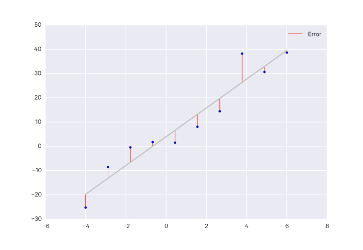
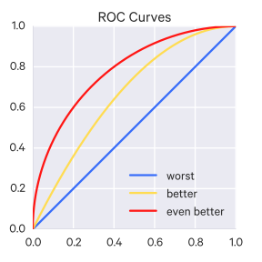
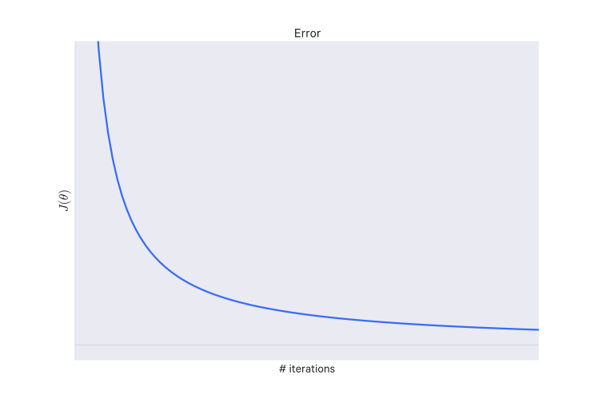

# Model Selection

_Model selection_ is the process of choosing between different machine learning approaches - e.g. SVM, logistic regression, etc - or choosing between different hyperparameters or sets of features for the same machine learning approach - e.g. deciding between the polynomial degrees/complexities for linear regression.

The choice of the actual machine learning algorithm (e.g. SVM or logistic regression) is less important than you'd think - there may be a "best" algorithm for a particular problem, but often its performance is not much better than other well-performing approaches for that problem.

There may be certain qualities you look for in an model:

- Interpretable - can we see or understand why the model is making the decisions it makes?
- Simple - easy to explain and understand
- Accurate
- Fast (to train and test)
- Scalable (it can be applied to a large dataset)

Though there are generally trade-offs amongst these qualities.

## Model evaluation

In order to select amongst models, we need some way of evaluating their performance.

You can't evaluate a model's hypothesis function with the cost function because minimizing the error can lead to overfitting.

A good approach is to take your data and split it randomly into a training set and a test set (e.g. a 70%/30% split). Then you train your model on the training set and see how it performs on the test set.

For linear regression, you might do things this way:

- Learn parameter $\theta$ from training data by minimizing training error $J(\theta)$.
- Compute test set error (using the squared error) ($m_{\text{test}}$ is the test set size):

    $$
    J_{\text{test}}(\theta) = \frac{1}{2m_{\text{test}}} \sum^{m_{\text{test}}}_{i=1} (h_{\theta}(x^{(i)}_{\text{test}}) - y^{(i)}_{\text{test}})
    $$

For logistic regression, you might do things this way:

- Learn parameter $\theta$ from training data by minimizing training error $J(\theta)$.
- Compute test set error ($m_{\text{test}}$ is the test set size):

    $$
    J_{\text{test}}(\theta) = -\frac{1}{m_{\text{test}}} \sum^{m_{\text{test}}}_{i=1} y^{(i)}_{\text{test}} \log h_{\theta} (x^{(i)}_{\text{test}}) + (1 - y^{(i)}_{\text{test}}) \log h_{\theta} (x^{(i)}_{\text{test}})
    $$

- Alternatively, you can use the misclassification error ("0/1 misclassification error", read "zero-one"), which is just the fraction of examples that your hypothesis has mislabeled:

    $$
    \begin{aligned}
    err(h_{\theta}(x), y) &=
    \begin{cases}
    1,  & \text{if $h_{\theta}(x) \geq 0.5, y=0$ or if $h_{\theta}(x) < 0.5, y=1$} \\[2ex]
    0,  & \text{otherwise}
    \end{cases} \\
    \text{test error} &= \frac{1}{m_{\text{test}}} \sum^{m_{\text{test}}}_{i=1} err(h_{\theta}(x^{(i)}_{\text{test}}), y^{(i)}_{\text{test}})
    \end{aligned}
    $$

A better way of splitting the data is to not split it only into training and testing sets, but to also include a _validation_ set. A typical ratio is 60% training, 20% validation, 20% testing.

So instead of just measuring the test error, you would also measure the validation error.

Validation is used mainly to tune hyperparameters - you don't want to tune them on the training set because that can result in overfitting, nor do you want to tune them on your test set because that results in an overly optimistic estimation of generalization. Thus we keep a separate set of data for the purpose of validation, that is, for tuning the hyperparameters - the __validation set__.

You can use these errors to identify what kind of problem you have if your model isn't performing well:

- If your training error is large and your validation/test set error is large, then you have a high bias (underfitting) problem.
- If your training error is small and your validation/test set error is large, then you have a high variance (overfitting) problem.

Because the test set is used to estimate the generalization error, it should not be used for "training" in any sense - this includes tuning hyperparameters. You should not evaluate on the test set and then go back and tweak things - this will give an overly optimistic estimation of generalization error.

Some ways of evaluating a model's performance on (some of) your known data are:

- hold out (just set aside some portion of the data for validation; this is less reliable if the amount of data is small such that the held out portion is very small)
- k-fold cross-validation (better than hold out for small datasets)
    - the training set is divided into $k$ folds
    - iteratively take $k-1$ folds for training and validate on the remaining fold
    - average the results
    - there is also "leave-one-out" cross-validation which is k-fold cross-validation where $k=n$ ($n$ is the number of datapoints)
- bootstrapping
    - new datasets are generated by sampling with replacement (uniformly at random) from the original dataset
    - then train on the bootstrapped dataset and validate on the unselected data
- jackknife resampling
    - essentially to leave-one-out cross-validation, since leave-one-out is basically sampling without replacement

### Validation vs Testing

_Validation_ refers to the phase where you are tuning your model and its hyperparameters. Once you do that, you want to _test_ this model on a new set of data it has not seen yet (i.e. data which has not been used in cross-validation or bootstrapping or whatever method you used). This is to simulate the model's performance on completely new data and see how it does, which is the most important quality of a model.

## Evaluating regression models

The main techniques for evaluating regression models are:

- mean absolute error
- median absolute error
- (root) mean squared error
- coefficient of determination ($R^2$)

### Residuals

A __residual__ $e_i$ is the difference between the observed and predicted outcome, i.e.:

$$
e_i = y_i - \hat y_i
$$

This can also be thought of as the vertical distance between an observed data point and the regression line.

Fitting a line by __least squares__ minimizes $\sum_{i=1}^n e_i^2$; that is, it minimizes the __mean squared error__ (MSE) between the line and the data. But there always remain some error from the fit line; this remaining error is the residual.

Alternatively, the __mean absolute error__ or __median absolute error__ can be used instead of the mean squared error.

$e_i$ can be interpreted as estimates of the regression error $\epsilon_i$, since we can only compute the true error if we know the true model parameters.

We can measure the quality of a linear model, which is called __goodness of fit__. One approach is to look at the variation of the residuals. You can also use the coefficient of determination ($R^2$), explained previously, which measures the variance explained by the least squares line.

#### Residual (error) variation

Residual variation measures how well a regression line fits the data points.

The average squared residual (the estimated residual variance) is the same as the mean squared error, i.e. $\sigma^2 = \frac{1}{n} \sum_{i=1}^n e_i^2$.

However, to make this estimator unbiased, you're more likely to see:

$$
\hat \sigma^2 = \frac{1}{n-2} \sum_{i=1}^n e_i^2
$$

That is, with the degrees of freedom taken into account (here for intercept and slope, which both have to be estimated).

The square root of this estimated variance, $\sigma$, is the root mean squared error (RMSE).

#### Coefficient of determination

The __total variation__ is equal to the residual variation (variation after removing the predictor) plus the systematic/regression variation (the variation explained by the regression model):

$$
\sum_{i=1}^n (Y_i - \bar Y)^2 = \sum_{i=1}^n (Y_i - \hat Y_i)^2 + \sum_{i=1}^n (\hat Y_i - \bar Y)^2
$$

$R^2$ ($0 \leq R^2 \leq 1$) is the percent of total variability that is explained by the regression model, that is:

$$
R^2 = \frac{\text{regression variation}}{\text{total variation}} = \frac{\sum_{i=1}^n (\hat Y_i - \bar Y)^2}{\sum_{i=1}^n (Y_i - \bar Y)^2} = 1 - \frac{\text{residual variation}}{\text{total variation}} = 1 - \frac{\sum_{i=1}^n (Y_i - \hat Y_i)^2}{\sum_{i=1}^n (Y_i - \bar Y)^2}
$$

$R^2$ can be a misleading summary of model fit since deleting data or adding terms will inflate it.

TODO combine the below

### Coefficient of determination

For a line $y = mx+b$, the error of a point $(x_n, x_y)$ against that line is:

$$ y_n - (mx_n + b) $$

Intuitively, this is the vertical difference between the point on the line at $x_n$
and the actual point at $x_n$.

The __squared error of the line__ is the sum of the squares of all of these errors:

$$ \SE_{\text{line}} = \sum_{i=0}^n (y_i - (mx_i + b))^2 $$

To get a best fit line, you want to minimize this squared error. That is, you want to
find $m$ and $b$ which minimizes $SE_{\text{line}}$. This works out as ^[Reminder: a bar over a variable ($\bar x$) means the mean of those values. So $\bar{x^2} = \frac{x_1^2 + x_2^2 + \dots + x_n^2}{n}$]:

$$ m = \frac{\bar{x}\bar{y} - \bar{xy}}{\bar{x}^2 - \bar{x^2}} $$
$$ b = \bar{y} - m\bar{x} $$

Note that you can alternatively calculate the regression line slope $m$ as with the covariance and variance:

$$ m = \frac{\Cov(x,y)}{\Var(x)} $$

The line that these values yields is the __regression line__.

We can calculate the total variation in $y$, $\SE_{\bar{y}}$, as:

$$ \SE_{\bar{y}} = \sum_{i=0}^n (y_i - \bar{y})^2 $$

And then we can calculate the percentage of total variation in $y$ described by the
regression line:

$$ 1 - \frac{\SE_{\text{line}}}{\SE_{\bar{y}}} $$

This is known as the __coefficient of determination__ or __R-squared__.

The closer R-squared is to 1, the better a fit the line is.

## Evaluating classification models

Important quantities:

- Sensitivity: $\frac{TP}{TP+FN}$
- Specificity: $\frac{TN}{TN+FP}$
- Positive predictive value: $\frac{TP}{TP+FP}$
- Negative predictive value: $\frac{TN}{TN+FN}$
- Accuracy: $\frac{TP+TN}{TP+FP+TN+FN}$

### Area under the curve (AUC)

This method is for binary classification and multilabel classification. In binary classification you may choose some cutoff above which you assign a sample to one class, and below which you assign a sample to the other class.

Depending on your cutoff, you will get different results - there is a trade off between the true and false positive rates.

You can plot a Receiver Operating Characteristic (ROC) curve, which has for its y-axis $P(TP)$ and for its x-axis $P(FP)$. Every point on the curve corresponds to a cutoff value. That is, the ROC curve visualizes a sweep through all the cutoff thresholds so you can see the performance of your classifier across _all_ cutoff thresholds, whereas other metrics (such as the F-score and so on) only tell you the performance for one particular cutoff. By looking at all thresholds at once, you get a more complete and honest picture of how your classifier is performing, in particular, how well it is separating the classes. It is insensitive to the bias of the data's classes - that is, if there are way more or way less of the positive class than there are of the negative class (other metrics may be deceptively favorable or punishing in such unbalanced circumstances).

The _area under the curve_ (AUC) is used to quantify how good the classification algorithm is. In general, an AUC of above 0.8 is considered "good". An AUC of 0.5 (a straight line) is equivalent to random guessing.

So ROC curves (and the associated AUC metric) are very useful for evaluating binary classification.

Note that ROC curves can be extended to classification of three or more classes by using the one-vs-all approach (see section on classification).

TODO incorporate the explanation below as well:

AUC is a metric for binary classification and is especially useful when dealing with _high-bias_ data, that is, where one class is much more common than the other. Using accuracy as a metric falls apart in high-bias datasets: for example, say you have 100 training examples, one of which is is positive, the rest of which are negative. You could develop a model which just labels every thing negative, and it would have 99% accuracy. So accuracy doesn't really tell you enough here.

Many binary classifies output some continuous value (0-1), rather than class labels; there is some threshold (usually 0.5) above which one label is assigned, and below which the other label is assigned. Some models may work best with a different threshold. Changing this threshold leads to a trade off between true positives and false positives - for example, decreasing the threshold will yield more true positives, but also more false positives.

AUC runs over all thresholds and plots the the true vs false positive rates. This curve is called a _receiver operating characteristic_ curve, or _ROC_ curve. A random classifier would give you equal false and true positives, which leads to a AUC of 0.5; the curve in this case would be a straight line. The better the classifier is, the more area under the curve there is (so the AUC approaches 1).

### Confusion Matrices

This method is suitable for binary or multiclass classification.

For classification, evaluation often comes in the form of a __confusion matrix__.

The core values are:

- __True positives__ (TP): samples classified as positive which were labeled positive
- __True negatives__ (TN): samples classified as negative which were labeled negative
- __False positives__ (FP): samples classified as positive which were labeled negative
- __False negatives__ (FN): samples classified as negative which were labeled positive

A few other metrics are computed from these values:

- __Accuracy__: How often is the classifier correct? ($\frac{\text{TP} + \text{TN}}{\text{total}}$)
- __Misclassification rate__ (or "__error rate__"): How often is the classifier wrong? ($\frac{\text{FP} + \text{FN}}{\text{total}} = 1 - \text{accuracy}$)
- __Recall__ (or "__sensitivity__" or "__true positive rate__"): How often are positive-labeled samples predicted as positive? ($\frac{\text{TP}}{\text{num positive-labeled examples}}$)
- __False positive rate__: How often are negative-labeled samples predicted as positive? ($\frac{\text{FP}}{\text{num negative-labeled examples}}$)
- __Specificity__ (or "__true negative rate__"): How often are negative-labeled samples predicted as negative? ($\frac{\text{TN}}{\text{num negative-labeled examples}}$)
- __Precision__: How many of the predicted positive samples are correctly predicted? ($\frac{\text{TP}}{\text{TP} + \text{FP}}$)
- __Prevalence__: How many labeled-positive samples are there in the data? ($\frac{\text{num positive-labeled examples}}{\text{num examples}}$)

Some other values:

- __Positive predictive value__ (PPV): precision but takes prevalence into account. With a perfectly balanced dataset (i.e. equal positive and negative examples, that is prevalence is 0.5), the PPV equals the precision.
- __Null error rate__: how often you would be wrong if you just predicted positive for every example. This is a good starting baseline metric to compare your classifier against.
- __F-score__: The weighted average of recall and precision
- __Cohen's Kappa__: a measure of how well the classifier performs compared against if it had just guessed randomly, that is a high Kappa score happens when there is a big difference between the accuracy and the null error rate.
- __ROC Curve__: (see the section on this)

### Log-loss

This method is suitable for binary, multiclass, and multilabel classification.

__Log-loss__ is an accuracy metric that can be used when the classifier output is not a class but a probability, as is the case with logistic regression. It penalizes the classifier based on how far off it is, e.g. if it predicts 1 with probability of 0.51 but the correct class is 0, it is less "wrong" than if it had predicted class 1 with probability 0.95.

For a binary classifier, log-loss is computed:

$$
-\frac{1}{n} \sum_i^N y_i \log(\hat y_i) + (1-y_i) \log(1 - \hat y_i)
$$

Log-loss is the cross-entropy b/w the distribution of the true labels and the predictions. It is related to relative entropy (that is, Kullback-Leilber divergence).

Intuitively, the way this works is the $y_i$ terms "turn on" the appropriate parts, e.g. when $y_i = 1$ then the term $y_i \log(\hat y_i)$ is activated and the other is 0. The reverse is true when $y_i = 0$.

Because $\log(1) = 0$, we get the best loss (0) when the term within the $\log$ operation is 1; i.e. when $y_i = 1$ we want $\hat y_i$ to equal 1, so the loss comes down to $\log(\hat y_i)$, but when $y_i = 0$, we want $\hat y_i = 0$, so the loss in that case comes down to $\log(1 - \hat y_i)$.

### F1 score

The __F1 score__, also called the __balanced F-score__ or __F-measure__, is the weighted average of precision and recall:

$$
F_1 = 2 \frac{\text{precision} \times \text{recall}}{\text{precision} + \text{recall}}
$$

The best score is 1 and the worst is 0.

It can be used for binary, multiclass, and multilabel classification (for the latter two, use the weighted average of the F1 score for each class).

## Metric selection

When it comes to __skewed classes__ (or _high bias data_), metric selection is more nuanced.

For instance, say you have a dataset where only 0.5% of the data is in category 1 and the rest is in category 0. You run your model and find that it categorized 99.5% of the data correctly! But because of the skew in that data, your model could just be: classify each example in category 0, and it would achieve that accuracy.

Note that the convention is to set the rare class to 1 and the other class to 0. That is, we try to predict the rare class.

Instead, you may want to use _precision/recall_ as your evaluation metric.

|    |      1T        |       0T       |
|----|----------------|----------------|
| 1P | True positive  | False positive |
| 0P | False negative | True negative  |

Where 1T/0T indicates the actual class and 1P/0P indicates the predicted class.

__Precision__ is the number of true positives over the total number predicted as positive. That is, what fraction of the examples labeled as positive actually are positive?

$$
\frac{\text{true positives}}{\text{true positives} + \text{false positives}}
$$

__Recall__ is the number of true positives over the number of actual positives. That is, what fraction of the positive examples in the data were identified?

$$
\frac{\text{true positives}}{\text{true positives} + \text{false negatives}}
$$

So in the previous example, our simple classifier would have a recall of 0.

There is a trade-off between precision and recall.

Say you are using a logistic regression model for this classification task. Normally, the category threshold in logistic regression is 0.5, that is, predict class 1 if $h_{\theta}(x) \geq 0.5$ and predict class 0 if $h_{\theta}(x) < 0.5$.

But you may want to only classify an example as 1 if you're very confidence. So you may change the threshold to 0.9 to be stricter about your classifications. In this case, you would increase precision, but lower recall since the model may not be confident enough about some of the more ambiguous positive examples.

Conversely, you may want to lower the threshold to avoid false negatives, in which case recall increases, but precision decreases.

So how do you compare precision/recall values across algorithms to determine which is best? You can condense precision and recall into a single metric: the $F_1$ score (also just called the __F-score__, which is the harmonic mean of the precision and recall):

$$
F_1 \text{score} = 2 \frac{PR}{P+R}
$$

Although more data doesn't always help, it generally does. Many algorithms perform significantly better as they get more and more data. Even relatively simple algorithms can outperform more sophisticated ones, solely on the basis of having more training data.

If your algorithm doesn't perform well, here are some things to try:

- Get more training examples (can help with high variance problems)
- Try smaller sets of features (can help with high variance problems)
- Try additional features (can help with high bias problems)
- Try adding polynomial features ($x_1^2, x_2^2, x_1 x_2$, etc) (can help with high bias problems)
- Try decreasing the regularization parameter $\lambda$ (can help with high bias problems)
- Try increasing the regularization parameter $\lambda$ (can help with high variance problems)

## Hyperparameter selection

Another part of model selection is _hyperparameter selection_.

Hyperparameter tuning is often treated as an art, i.e. without a reliable and practical systematic process for optimizing them. However, there are some automated methods that can be useful, including:

- grid search
- random search
- evolutionary algorithms
- Bayesian optimization

Random search and grid search don't perform particularly well but are worth being familiar with.

### Grid search

Just searching through combinations of different hyperparameters and seeing which combination performs the best. Generally hyperparameters are searched over specific intervals or scales, depending on the particular hyperparameter. It may be 10, 20, 30, etc or 1e-5, 1e-4, 1e-3, etc. It is easy to parallelize but quite brute-force.

### Random search

Surprisingly, randomly sampling from the full grid often works just as well as a complete grid search, but in much less time.

Intuitively: if we want the hyperparameter combination leading to the top 5% of performance, then any random hyperparameter combination from the grid has a 5% chance of leading to that result. If we want to successfully find such a combination 95% of the time, how many random combinations do we need to run through?

If we take $n$ hyperparameter combinations, the probability that all $n$ are outside of this 5% of top combinations is $(1 - 0.05)^n$, so the probability that at least one is in the 5% is just $1 - (1-0.05)^n$. If we want to find one of these combinations 95% of the time, that is, we want the probability that at least one of them to be what we're looking for to be 95%, then we just set $1 - (1-0.05)^n = 0.95$, and thus $n \geq 60$, so we need to try only 60 random hyperparamter combinations at minimum to have a 95% chance of finding at least one hyperparameter combination that yields top 5% performance for the model.

### Bayesian Hyperparameter Optimization

We can use Bayesian optimization to select good hyperparameters for us. We can sample hyperparameters from a Gaussian process (the prior) and use the result as observations to compute a posterior distribution. Then we select the next hyperparameters to try by optimizing the expected improvement over the current best result or the Gaussian process upper confidence bound (UCB). In particular, we choose an _acquisition function_ to construct a utility function from the model posterior - this is what we use to decide what next set of hyperparameters to try.

Basic idea: Model the generalization performance of an algorithm as a smooth function of its hyperparameters and then try to find the maxima.

It has two parts:

- Exploration: evaluate this function on sets of hyperparameters where the outcome is most uncertain
- Exploitation: evaluate this function on sets of hyperparameters which seem likely to output high values

Which repeat until convergence.

This is faster than grid search by making "educated" guesses as to where the optimal set of hyperparameters might be, as opposed to brute-force searching through the entire space.

One problem is that computing the results of a hyperparameter sample can be very expensive (for instance, if you are training a large neural network).

We use a Gaussian process because its properties allow us to compute marginals and conditionals in closed form.

Some notation for the following:

- $f(x)$ is the function drawn from the Gaussian process prior, where $x$ is the set of hyperparameters
- observations are in the form $\{x_n, y_n\}_{n=1}^{N}$, where $y_n \sim \mathcal N (f(x_n), v)$ and $v$ is the variance of noise introduced into the function observations
- the acquisition function is $a : \mathcal X \to \mathbb R^+$, where $\mathcal X$ is the hyperparameter space
- the next set of hyperparameters to try is $x_{\text{next}} = \argmax_x a(x)$
- the current best set of hyperparameters is $x_{\text{best}}$
- $\Phi()$ denotes the cumulative distribution function of the standard normal

A few popular choices of acquisition functions include:

- _probability of improvement_: with a Gaussian process, this can be computed analytically as:

$$
\begin{aligned}
a_{\text{PI}}(x ; \{x_n, y_n\} \theta) &= \Phi(\gamma(x)) \\
\gamma(x) &= \frac{f(x_{\text{best}} - \mu(x; \{x_n, y_n\}, \theta)}{\sigma(x; \{x_n, y_n\}, \theta)}
\end{aligned}
$$

- _expected improvement_: under a Gaussian process, this also has a closed form:

$$
a_{\text{EI}} (x; \{x_n, y_n\}, \theta) = \sigma(x; \{x_n, y_n\}, \theta) (\gamma(x)\Phi(\gamma(x)) + \mathcal N (\gamma(x); 0, 1))
$$

- _Gaussian process upper confidence bound_: use upper confidence bounds (when maximizing, otherwise, lower confidence bounds) to construct acquisition functions that minimize regret over the course of their optimization:

$$
a_{\text{LCB}} (x; \{x_n, y_n\}, \theta) = \mu(x; \{x_n, y_n\}, \theta) - \kappa \sigma(x; \{x_n, y_n\}, \theta)
$$

Where $\kappa$ is tunable to balance exploitation against exploration.

Some difficulties with Bayesian optimization of hyperparameters include:

- often unclear what the appropriate choice for the covariance function and its associated hyperparameters (these hyperparameters are distinct from the ones the method is optimizing; i.e. these are in some sense "hyper-hyperparameters")
- the function evaluation can be a time-consuming optimization procedure. One method is to optimize expected improvement _per second_, thereby taking wall clock time into account. That way, we prefer to evaluate points that are not only likely to be good, but can also be evaluated quickly. However, we don't know the _duration function_ $c(x) : \mathcal X \to \mathbb R^+$, but we can use this same Gaussian process approach to model $c(x)$ alongside $f(x)$.

Furthermore, we can parallelize these Bayesian optimization procedures (refer to paper)

### Choosing the Learning Rate $\alpha$

You can plot out a graph with the number of gradient descent iterations on the x-axis and the values of $\min_{\theta} J(\theta)$ on the y-axis and visualize how the latter changes with the number of iterations. At some point, that curve will flatten out; that's about the number of iterations it took for gradient descent to converge on your particular problem.

You could use an _automatic convergence test_ which just declares convergence if $J(\theta)$ decreases by less than some threshold value in an iteration, but in practice that threshold value may be difficult to determine.

You would expect this curve to be similar to the one above. $min_{\theta} J(\theta)$ should decrease with the number of iterations, if gradient descent is working correctly. If not, then you should probably be using a smaller learning rate ($\alpha$). But again, don't make it too small or convergence will be slow.

## CASH

The particular problem is called the _CASH_ problem (_Combined Algorithm Selection and Hyperparameter optimization_ problem).

It can be formalized as such:

- $\mathcal A = \{A^{(1)}, \dots, A^{(R)}\}$ is a set of algorithms
    - the algorithm $A^{(j)}$'s hyperparameters has the domain $\Lambda^{(j)}$
- $D_{\text{train}} = \{(x_1, y_1), \dots, (x_n, y_n)\}$ be a training set
    - it is split into $K$ cross-validation folds ${D_{\text{valid}}^{(1)}, \dots, D_{\text{valid}}^{(K)}}$ and ${D_{\text{train}}^{(1)}, \dots, D_{\text{train}}^{(K)}}$
- the loss $L(A_{\lambda}^{(j)}, D_{\text{train}}^{(i)}, D_{\text{valid}}^{(i)})$ is the loss an algorithm $A^{(j)}$ achieves on $D_{\text{valid}}^{(i)}$ when trained on $D_{\text{train}}^{(i)}$ with hyperparameters $\lambda$

we want to find the joint algorithm and hyperparameter settings that minimizes this loss:

$$
A^*, \lambda_* \in \argmin_{A^{(j)} \in \mathcal A, \lambda \in \Lambda^{(j)}} \frac{1}{K} \sum_{i=1}^K L(A_{\lambda}^{(j)}, D_{\text{train}}^{(i)}, D_{\text{valid}}^{(i)})
$$

Approaches to this problem include the aforementioned Bayesian optimization methods.

_Meta-learning_ is another approach, in which machine learning is applied machine learning itself, that is, to algorithm and hyperparameter selection (and additionally feature preprocessing). The input data are different machine learning tasks and datasets, the output is a well-performing algorithm and hyperparameter combination. In meta-learning we learn "meta-features" to identify similar problems for which a algorithm and hyperparameter combination is good for.

These meta-features can include things like the number of datapoints, features, and classes, the data skewness, the entropy of the targets, etc.

Meta-learning can be combined with Bayesian optimization - it can be used to roughly identify good algorithm and hyperparameter choices, and Bayesian optimization can be used to fine-tune these choices. This approach of using meta-learning to support Bayesian optimization is called "warmstarting".

As Bayesian optimization searches for hyperparameters it may come across many well-performing hyperparameters that it discards because they are not the best. However, they can be saved to construct an (weighted) ensemble model, which usually outperforms individual models. The ensemble selection method seems to work best for constructing the ensemble:

- start with an empty ensemble
- iteratively, up to a specified ensemble size
    - add a model that maximizes ensemble validation performance

Models are unweighted, but models can be added multiple time so the end result is a weighted ensemble.

## References

- Review of fundamentals, IFT725. Hugo Larochelle. 2012.
- [Exploratory Data Analysis Course Notes](https://sux13.github.io/DataScienceSpCourseNotes/4_EXDATA/Exploratory_Data_Analysis_Course_Notes.pdf). Xing Su.
- [Mining Massive Datasets](https://www.coursera.org/course/mmds) (Coursera & Stanford, 2014). Jure Leskovec, Anand Rajaraman, Jeff Ullman.
- [Machine Learning](https://www.coursera.org/learn/machine-learning). 2014. Andrew Ng. Stanford University/Coursera.
- [CS188: Artificial Intelligence](https://www.edx.org/course/artificial-intelligence-uc-berkeleyx-cs188-1x). Dan Klein, Pieter Abbeel. University of California, Berkeley (edX).
- _Evaluating Machine Learning Models_. Alice Zheng. 2015.
- [Computational Statistics II](https://www.youtube.com/watch?v=heFaYLKVZY4) ([code](https://github.com/fonnesbeck/scipy2015_tutorial)). Chris Fonnesbeck. SciPy 2015.
- [Intro to Artificial Intelligence](https://www.udacity.com/course/intro-to-artificial-intelligence--cs271). CS271. Peter Norvig, Sebastian Thrun. Udacity.
- [MIT 6.034 (Fall 2010): Artificial Intelligence](http://ocw.mit.edu/courses/electrical-engineering-and-computer-science/6-034-artificial-intelligence-fall-2010/). Patrick H. Winston. MIT.
- [Deep Learning](http://www-labs.iro.umontreal.ca/~bengioy/dlbook/). Yoshua Bengio, Ian Goodfellow, Aaron Courville.
- [CS231n Convolutional Neural Networks for Visual Recognition, Module 1: Neural Networks Part 2: Setting up the Data and the Loss](https://cs231n.github.io/neural-networks-1/). Andrej Karpathy.
- [POLS 509: Hierarchical Linear Models](https://www.youtube.com/watch?v=g_4z6o7XZbQ). Justin Esarey.
- [Bayesian Inference with Tears](http://www.isi.edu/natural-language/people/bayes-with-tears.pdf). Kevin Knight, September 2009.
- [Learning to learn, or the advent of augmented data scientists](https://chronicles.mfglabs.com/learning-to-learn-or-the-advent-of-augmented-data-scientists-20873282e181). Simon Benhamou.
- [Practical Bayesian Optimization of Machine Learning Algorithms](http://arxiv.org/abs/1206.2944). Jasper Snoek, Hugo Larochelle, Ryan P. Adams.
- [What is the expectation maximization algorithm?](http://www.nature.com/nbt/journal/v26/n8/full/nbt1406.html). Chuong B Do & Serafim Batzoglou.
- [Gibbs Sampling for the Uninitiated](https://www.umiacs.umd.edu/~resnik/pubs/LAMP-TR-153.pdf). Philip Resnik, Eric Hardisty. June 2010.
- [Maximum Likelihood Estimation](https://onlinecourses.science.psu.edu/stat414/node/191). Penn State Eberly College of Science.
- [Data Science Specialization](https://www.coursera.org/specializations/jhu-data-science). Johns Hopkins (Coursera). 2015.
- [Practical Machine Learning](https://www.coursera.org/learn/practical-machine-learning). Johns Hopkins (Coursera). 2015.
- [Elements of Statistical Learning](http://statweb.stanford.edu/~tibs/ElemStatLearn/). 10th Edition. Trevor Hastie, Robert Tibshirani, Jerome Friedman.
- [Model evaluation: quantifying the quality of predictions](http://scikit-learn.org/stable/modules/model_evaluation.html). scikit-learn.
- [Efficient and Robust Automated Machine Learning](https://papers.nips.cc/paper/5872-efficient-and-robust-automated-machine-learning.pdf). Matthias Feurer, Aaron Klein, Katharina Eggensperger, Jost Tobias Springenberg, Manuel Blum, Frank Hutter.
