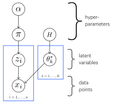
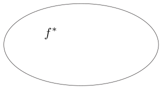
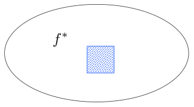
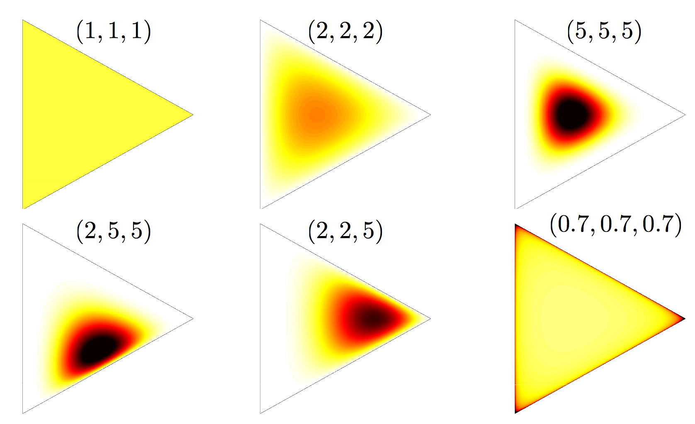

---
prerequisites:
- bayes nets
---

$$
\def\argmax{\operatorname*{argmax}}
\def\argmin{\operatorname*{argmin}}
$$

# Bayesian Learning

_Bayesian machine learning_ is a particular set of approaches to probabilistic machine learning (for other probabilistic models, see Supervised Learning).

Bayesian learning treats model parameters as random variables - in Bayesian learning, parameter estimation amounts to computing posterior distributions for these random variables based on the observed data.

Bayesian learning typically involves generative models - one notable exception is __Bayesian linear regression__, which is a discriminative model.

## Bayesian models

Bayesian modeling treats those two problems as one.

We first have a prior distribution over our parameters (i.e. what are the likely parameters?) $P(\theta)$.

From this we compute a posterior distribution which combines both inference and learning:

$$
P(y_1, \dots, y_n, \theta | x_1, \dots, x_n) = \frac{P(x_1, \dots, x_n, y_1, \dots, y_n | \theta)P(\theta)}{P(x_1, \dots, x_n)}
$$

Then prediction is to compute the conditional distribution of the new data point given our observed data, which is the marginal of the latent variables and the parameters:

$$
P(x_{n+1}|x_1, \dots, x_n) = \int P(x_{n+1}|\theta)P(\theta|x_1, \dots, x_n) d\theta
$$

Classification then is to predict the distributions of the new datapoint given data from other classes, then finding the class which maximizes it:

$$
P(x_{n+1}|x_1^c, \dots, x_n^c) = \int P(x_{n+1}|\theta^c)P(\theta^c|x_1^c, \dots, x_n^c) d\theta^c
$$

### Hidden Markov Models

HMMs can be thought of as clustering over time; that is, each state is a "cluster".

The data points and latent variables are sequences, and $\pi_k$ becomes the transition probability given the state (cluster) $k$. $\theta^*_k$ becomes the emission distribution for $x$ given state $k$.

### Model-based clustering

- model data from heterogeneous unknown sources
- $K$ unknown sources (clusters)
- each cluster/source is modeled using a parametric model (e.g. a Gaussian distribution)

For a given data point $i$, we have:

$$
z_i | \pi \sim \text{Discrete}(\pi)
$$

Where $z_i$ is the cluster label for which data point $i$ belongs to. This is the latent variable we want to discover.

$\pi$ is the _mixing proportions_ which is the vector of probabilities for each class $k$, that is:

$$
\pi = (\pi_i, \dots, \pi_K) | \alpha \sim \text{Dirichlet}(\frac{\alpha}{K}, \dots, \frac{\alpha}{K})
$$

That is, $\pi_k = P(z_i = k)$.

We also model each data point $x_i$ as being drawn from a source (cluster) like so, where $F$ is however we are modeling the cluster (e.g. a Gaussian), parameterized by $\theta^*_{z_i}$, that is some parameters for the $z_i$-labeled cluster:

$$
x_i | z_i, \theta^*_k \sim F(\theta^*_{z_i})
$$

(Note that the star, as in $\theta^*$, is used to denote the optimal solution for $\theta$.)

For this approach we have two priors over parameters of the model:

- For the mixing proportions, we typically use a Dirichlet prior (above) because it has the nice property of being a conjugate prior with multinomial distributions.
- For each cluster $k$ we use some prior $H$, that is $\theta^*_k | H \sim H$.

Graphically, this is:

### Naive Bayes

The main assumption of Naive Bayes is that all features are independent effects of the label. This is a really strong simplifying assumption but nevertheless in many cases Naive Bayes performs well.

Naive Bayes is also _statistically efficient_ which means that it doesn't need a whole lot of data to learn what it needs to learn.

If we were to draw it out as a Bayes' net:

$$
\begin{aligned}
Y &\to F_1 \\
Y &\to F_2 \\
&\dots \\
Y &\to F_n
\end{aligned}
$$

Where $Y$ is the label and $F_1, F_2, \dots, F_n$ are the features.

The model is simply:

$$
P(Y|F_1, \dots, F_n) \varpropto P(Y) \prod_i P(F_i|Y)
$$

This just comes from the Bayes' net described above.

The Naive Bayes learns $P(Y, f_1, f_2, \dots, f_n)$ which we can normalize (divide by $P(f_1, \dots, f_n)$) to get the conditional probability $P(Y|f_1, \dots, f_n)$:

$$
P(Y, f_1, \dots, f_n) =
\begin{matrix}
P(y_1, f_1, \dots, f_n) \\
P(y_2, f_1, \dots, f_n) \\
\vdots \\
P(y_k, f_1, \dots, f_n)
\end{matrix} =
\begin{matrix}
P(y_1) \prod_i P(f_i|y_1) \\
P(y_2) \prod_i P(f_i|y_2) \\
\vdots \\
P(y_k) \prod_i P(f_i|y_k)
\end{matrix}
$$

So the parameters of Naive Bayes are $P(Y)$ and $P(F_i|Y)$ for each feature.

## Inference in Bayesian models

### Maximum a posteriori (MAP) estimation

A Bayesian alternative to MLE, we can estimate probabilities using _maximum a posteriori estimation_, where we instead choose a probability (a point estimate) that is most likely given the observed data:

$$
\begin{aligned}
\tilde \pi_{MAP} &= \argmax_{\pi}P(\pi|X) \\
&= \argmax_{\pi} \frac{P(X|\pi)P(\pi)}{P(X)} \\
&= \argmax_{\pi} P(X|\pi)P(\pi) \\
P(y|X) &\approx P(y|\tilde \pi_{MAP})
\end{aligned}
$$

So unlike MLE, MAP estimation uses Bayes' Rule so the estimate can use prior knowledge ($P(\pi)$) about what we expect $\pi$ to be.

Again, this may be done with log-likelihoods:

$$
\theta_{\text{MAP}} = \argmax_{\theta} p(\theta|x) = \argmax_{\theta} \log p(x|\theta) + \log p(\theta)
$$

## Maximum A Posteriori (MAP)

Likelihood function $L(\theta)$ is the probability of the data $D$ as a function of the parameters $\theta$.

This often has very small values so typically we work with the log-likelihood function instead:

$$
\ell (\theta) = \log L(\theta)
$$

The _maximum likelihood criterion_ simply involves choosing the parameter $\theta$ to maximize $\ell (\theta)$. This can (sometimes) be done analytically by computing the derivative and setting it to zero and yields the _maximum likelihood estimate_.

MLE's weakness is that if you have only a little training data, it can overfit. This problem is known as _data sparsity_. For example, you flip a coin twice and it happens to land on heads both times. Your maximum likelihood estimate for $\theta$ (probability that the coin lands on heads) would be 1! We can then try to generalize this estimate to another dataset and test it by measuring the log-likelihood on the test set. If a tails shows up at all in the test set, we will have a test log-likelihood of $-\infty$.

We can instead use Bayesian techniques for parameter estimation. In Bayesian parameter estimation, we treat the parameters $\theta$ as a random variable as well, so we learn a joint distribution $p(\theta, D)$.

We first require a prior distribution $p(\theta)$ and the likelihood $p(D|\theta)$ (as with maximum likelihood).

We want to compute $p(\theta|D)$, which is accomplished using Bayes' rule:

$$
p(\theta|D) = \frac{p(\theta)p(D|\theta)}{\int p(\theta') p(D|\theta')d\theta'}
$$

Though we work with only the numerator for as long as possible (i.e. we delay normalization until it's necessary):

$$
p(\theta|D) \varpropto p(\theta)p(D|\theta)
$$

The more data we observe, the less uncertainty there is around the parameter, and the likelihood term comes to dominate the prior - we say that the _data overwhelm the prior_.

We also have the _posterior predictive distribution_ $p(D'|D)$, which is the distribution over future observables given past observations. This is computed by computing the posterior over $\theta$ and then marginalizing out $\theta$:

$$
p(D'|D) = \int p(\theta|D) p(D'|\theta) d\theta
$$

The normalization step is often the most difficult, since we must compute an integral over potentially many, many parameters.

We can instead formulate Bayesian learning as an optimization problem, allowing us to avoid this integral. In particular, we can use _maximum a-posteriori_ (MAP) approximation.

Whereas with the previous Bayesian approach (the "full Bayesian" approach) we learn a distribution over $\theta$, with MAP approximation we simply get a point estimate (that is, a single value rather than a full distribution). In particular, we get the parameters that are most likely under the posterior:

$$
\begin{aligned}
\hat \theta_{\text{MAP}} &= \argmax_{\theta} p(\theta|D) \\
&= \argmax_{\theta} p(\theta,D) \\
&= \argmax_{\theta} p(\theta)p(D|\theta) \\
&= \argmax_{\theta} \log p(\theta) + \log p(D|\theta)
\end{aligned}
$$

Maximizing $\log p(D|\theta)$ is equivalent to MLE, but now we have an additional prior term $\log p(\theta)$. This prior term functions somewhat like a regularizer. In fact, if $p(\theta)$ is a Gaussian distribution centered at 0, we have L2 regularization.

### Markov Chain Monte Carlo (MCMC)

#### Motivation

With MLE and MAP estimation we get only a single value for $\pi$, and this collapsing into a single value loses information - what if we instead considered the entire distribution of values for $\pi$, i.e. $P(\pi|X)$?

As it stands, with MLE and MAP we only get an approximation of $P(y|X)$. But with the distribution $P(\pi|X)$ we could directly compute its expected value:

$$
E[P(y|X)] = \int P(y|\pi)P(\pi|X)d\pi
$$

And with Bayes' Rule we have:

$$
P(\pi|X) = \frac{P(X|\pi)P(\pi)}{P(X)} = \frac{P(X|\pi)P(\pi)}{\int_{\pi}P(X|\pi)P(\pi)d\pi}
$$

So we have two integrals here, and unfortunately integrals can be hard (sometimes impossible) to compute.

With MCMC we can get the values we need without needing to calculating the integrals.

#### Monte Carlo methods

Monte Carlo methods are algorithms which perform probabilistic simulations to give you some value.

For example:

> Say you have a square and a circle inscribed within it, so that they are co-centric and the circle's diameter is equal to the length of a side of the square. You take some rice and uniformly scatter it in the shapes at random. You can count the total number of grains of rice in the circle ($C$) and do the same for rice in the square ($S$). The ratio $\frac{C}{S}$ approximates the ratio of the area of the circle to the area of the square. The area of the circle and for the square can be thought of as integrals (adding an infinite number of infinitesimally small points), so what you have effectively done is approximate the value of integrals.

#### MCMC

In the example the samples were uniformly distributed, but in practice they can be drawn from other distributions. If we collect enough samples from the distribution we can compute pretty much anything we would want to know about the distribution - mean, standard deviation, etc.

For example, we can compute the expected value:

$$
E[f(z)] = \lim_{N \to \infty} \frac{1}{N} \sum^N_{t=1}f(z^{(t)})
$$

Since we don't sample infinite points, we sample as many as we can for an approximation:

$$
E[f(z)] \approx \frac{1}{T} \sum^T_{t=1}f(z^{(t)})
$$

How exactly then is the sampling of $z^{(0)}, \dots, z^{(T)}$ according to a given distribution accomplished?

We treat the sampling process as a walk around a sample space and the walk proceeds as a Markov chain; that is, the choice of the next sample depends on only the current state, based on a transition probability $P_{\text{trans}}(z^{(t+1)}|z^{(t)})$.

So the general walking algorithm is:

- Randomly initialize $z^{(0)}$
- for $t=1$ to $T$ do:
    - $z^{(t+1)} := g(z^{(t)})$

Where $g$ is just a function which returns the next sample based on $P_{\text{trans}}$ and the current sample.

#### Gibbs Sampling

_Gibbs sampling_ is an MCMC algorithm, where $z$ is a point/vector $[z_1, \dots, z_k]$ and $k > 1$. So here the samples are vectors of at least two terms. You don't select an entire sample at once, what you do is make a separate probabilistic choice for each dimension, where the choice is dependent on the other $k-1$ dimensions, using the _newest_ values for each.

For example, say $k=3$ so you have vectors in the form $[z_1, z_2, z_3]$.

- First you pick a new value $z_1^{(t+1)}$ based on $z_2^{(t)}$ and $z_3^{(t)}$.
- Then you pick a new value $z_2^{(t+1)}$ based on $z_1^{(t+1)}$ and $z_3^{(t)}$.
- Then you pick a new value $z_3^{(t+1)}$ based on $z_1^{(t+1)}$ and $z_2^{(t+1)}$.

##### Gibbs Sampling (more)

Now that we have the generative model, we can use it to calculate the probability of some set of group assignments for our data points. But how do we learn what a good set of group assignments is?

We can use Gibbs Sampling, that is:

- Take the set of data points, and randomly initialize group assignments.
- Pick a point. Fix the group assignments of all the other points, and assign the chosen point a new group (which can be either an existing cluster or a new cluster) with a CRP-ish probability (as described in the models above) that depends on the group assignments and values of all the other points.
- We will eventually converge on a good set of group assignments, so repeat the previous step until happy.

## Nonparametric models

First: a parametric model is one in which the capacity is fixed and does not increase with the amount of training data. For example, a linear classifier, a neural network with fixed number of hidden units, etc. The amount of parameters is finite, and the particular amount is determined before any data is observed (e.g. with linear regression, _we_ decide the number of parameters that will be used, rather than learning it from the data).

Another way of thinking of it is: a parametric model tries to come up with some function from the data, then the data is thrown out. You use that learned function in place of the data for future predictions.

A nonparametric model doesn't throw out the data, it keeps it around for later predictions; as a result, as more data becomes available, you don't need to create an updated model like you would with the parametric approach.

### What is a nonparametric model?

- counterintuitively, it does not mean a model without parameters. Rather, it means a model with a very large number of parameters (e.g. infinite). Here, "nonparametric" refers more to "not a parametric model", _not_ "without parameters".
- could also be defined as a parametric model where the number of parameters increases with the data, instead of fixing the number of parameters (that is, the number of things we can learn) as is the case with parametric models. I.e. the capacity of the model increases with the amount of training data.
- can also be defined as a family of distributions that is dense in some large space relevant to the problem at hand.
    - For example, with a regression problem, the space of possible solutions may be all continuous functions, which is infinite-dimensional (if you have infinite cardinality). A nonparametric model can span this infinite space.

To expand and visualize the last point, consider the regression problem example.

This is the space of continuous functions, where $f^*$ is the function we are looking for.

With a parametric model, we have a finite number of parameters, so we can only cover a fraction of this space (the square).

However, with a nonparametric model, we can have infinite parameters and cover the entire space. We apply some assumptions, e.g. favoring simpler functions over complex ones, so we can apply a prior to the space which assigns more mass to simpler functions (the darker parts in the accompanying figure). But every part of the space still has some mass.

It is possible to create a nonparametric model by nesting a parametric learning algorithm inside another parametric learning algorithm. The outer learning algorithm learns the number of parameters, whereas the inner learning algorithm performs as it normally would (learning the parameters themselves).

### An example

An example of a nonparametric model is __nearest neighbor regression__, in which we simply store the training set, then, for a given new point, identify the closest point and return its associated target value.

That is:

$$
\begin{aligned}
\hat y &= y_i \\
i &= \argmin ||X_i-x||^2_2
\end{aligned}
$$

Another example is wrapping a parametric algorithm instead another parametric algorithm - where the number of parameters of the inner algorithm is a parameter that the outer parametric algorithm learns.

### Parametric models vs nonparametric models

Parametric models are relatively rigid; once you choose a model, there are some limitations to what forms that model can take (i.e. how it can fit to the data), and the only real flexibility is in the parameters which can be adjusted. For instance, with linear regression, the model must take the form of $y = \beta_0 + \beta_1 x_1 + \dots + \beta_n x_n$; you can only adjust the $\beta_i$ values. If the "true" model does not take this form, we probably won't be able to estimate it well because the model we chose fundamentally does not conform to it.

Parametric models, on the other hand, offer greater freedom of fit.

As an example, a histogram can be considered a nonparametric representation of a probability density - it "let's the data speak for itself", so to speak (you may hear nonparametric models described in this way). The density that forms in the histogram is determined directly by the data. You don't make any assumptions about what the distribution is beforehand - e.g. you don't have to say, "I think this might be a normal distribution", and then try to force the normal probability density function onto the data.

Nonparametric models don't actually mean there are no parameters, but it is perhaps better described as not having a fixed set of parameters.

### Why use a Bayesian nonparametric approach?

1. Model selection
    - e.g. clustering - you have to specify the number of clusters. Too many and you overfit, too few and you underfit.
    - with a Bayesian approach you are not doing any optimizing (such as finding a maximum likelihood), you are just computing a posterior distribution. So there is no "fitting" happening, so you cannot overfit.
    - If you have a large model or one which grows with the amount of data, you can avoid underfitting too.
- (of course, you can still specify an incorrect model and get poor performance)

2. Useful properties of Bayesian nonparametric models
    - _Exchangeability_ - you can permute your data without affecting learning (i.e. order of your data doesn't matter)
    - Can model Zipf, Heap, and other power laws
    - Flexible ways of building complex models from simpler parts

Nonparametric models still make modeling assumptions, they are just less constrained than most parametric models.

There are also _semiparametric_ models in which they are nonparametric in some ways and parametric in others.

## The Dirichlet Process

The Dirichlet process is "the cornerstone of Bayesian nonparametrics".

It is a stochastic process - a model over an infinite collection of random variables.

There are a few ways to think about Dirichlet processes:

- the infinite limit of a Gibbs sampler for finite mixture models
- the Chinese Restaurant Process
- The stick-breaking construction

### Dirichlet Distribution

The Dirichlet distribution is a probability distribution over all possible multinomial distributions.

For example, say we have some data which we want to classify into three classes $A, B, C$. Maybe the data has 0.25 probability of being in class $A$, 0.5 probability of being in $B$, and 0.25 of being in $C$. Or maybe it has 0.1 probability of being in class $A$, then 0.6 and 0.3 for $B$ and $C$ respectively. Or it could be another distribution - we don't know. The Dirichlet distribution is the probability distribution representing these possible multinomial distributions across our classes.

The Dirichlet distribution is formalized as:

$$
P(p|a) = \frac{\Gamma(\sum^{K-1}_{k=0}\alpha_k)}{\prod^{K-1}_{k=0}\Gamma(\alpha_k)}\prod^{K-1}_{k=0}p_k^{a_k-1}
$$

where:

- $p$ = a multinomial distribution
- $\alpha$ = the parameters of the dirichlet (a $K$-dimensional vector)
- $K$ = the number of categories

Note that this term:

$$
\frac{\Gamma(\sum^{K-1}_{k=0}\alpha_k)}{\prod^{K-1}_{k=0}\Gamma(\alpha_k)}
$$

Is just a normalizing constant so that we get a distribution. So if you're just comparing ratios of these distributions you can ignore it.

You begin with some prior which can be derived from other data or from domain knowledge or intuition.

As more data comes in, we update the dirichlet (i.e. with Bayesian updates):

$$
P(p|\text{data}) = \frac{P(\text{data}|p)P(p|\alpha)}{P(p)}
$$

This can be done simply as updating the column in $\alpha$ which corresponds to a new data point, e.g. if we have three classes and $\alpha = [2,4,1]$ and we encounter a new data point which belongs to the class $\alpha_1$, we just add one to that column in $\alpha$, so it becomes $[2,5,1]$.

#### Entropy

Also known as _information content_, _energy_, _log likelihood_, or $-\ln(p)$

It can be thought of as the amount of "surprise" for an event.

If an event is totally certain, it has zero entropy.

A coin flip as some entropy since there are only two equally-probable possibilities.

If you have a pair of dice, there is some entropy for rolling a 6 (because there are multiple combinations which can lead to 6) but much higher entropy for rolling a 12 (because there is only one combination which leads to a 12).

We can look at the entropy of the Dirichlet function:

$$
\begin{aligned}
E(p|\alpha) &= -\ln(\prod^{K-1}_{k_0} p_k^{\alpha_k - 1}) \\
&= \sum^{K-1}_{k_0}(\alpha_k - 1)(-\ln(p_k))
\end{aligned}
$$

We'll break out the entropy of a given multinomial distribution $p$ into its own term:

$$
e_k = -\ln(p_k)
$$

#### Interpreting $\alpha$

We can take the $\alpha$ vector and normalize it. The normalized $\alpha$ vector is the expected value of the dirichlet, that is, it is its mean.

The sum of the unnormalized $\alpha$ vector is the weight of the distribution, which can be thought of as its precision. In a normal distribution, the precision is $\frac{1}{\text{variance}}$; a higher precision means a narrower normal distribution which means that values are likely to be near the mean. A lower precision means a wider distribution in which points are less likely to be near the mean.

So a dirichlet with a higher weight means that the multinomial distribution is more likely to be close to the expected value.

Dirichlet distributions can be thought of as a _simplex_, which is a generalization of a triangle in some arbitrary dimensions (e.g. in 2D it is 2-simplex, a triangle, in 3D it is 3-simplex, a pyramid, etc.). Some examples are blow with their corresponding $\alpha$ vectors:

### Finite Mixture Models

This is a continuation of the model-based clustering approach mentioned earlier.

We want to learn, via inference, values for $\pi$, $z_i$, and $\theta^*_k$.

We can use a form of MCMC sampling - Gibbs sampling.

(to do: this is incomplete)

### Chinese Restaurant Process

#### Partitions

Given a set $S$, a partition $\varrho$ is a disjoint family of non-empty subsets (clusters) of $S$ whose union is $S$. So a partition is some configuration of clusters which encompasses the members of $S$.

E.g.

$$
\begin{aligned}
S &= \{A,B,C,D,E,F\} \\
\varrho &= \{\{A,D\}, \{B,C,E\}, \{F\}\}
\end{aligned}
$$

The set of all partitions of $S$ is denoted $\mathcal P_S$.

_Random partitions_ are random variables taking value in $\mathcal P_S$.

#### The Chinese Restaurant Process (CRP)

The CRP is an example of random partitions and involves a sequence of customers coming into a restaurant. Each customer decides whether or not to sit at a new (empty) table or join a table with other customers. The customers are sociable so prefer to join tables with more customers, but there is still some probability that they will sit at a new table:

$$
\begin{aligned}
P(\text{sit at new table}) &= \frac{\alpha}{\alpha + \sum_{c \in \varrho} n_c} \\
P(\text{sit at table $c$}) &= \frac{n_c}{\alpha + \sum_{c \in \varrho} n_c}
\end{aligned}
$$

Where $n_c$ is the number of customers at a table $c$ and $\alpha$ is a parameter.

Here the customers correspond to members of the set $S$, and tables are the clusters in a partition $\varrho$ of $S$.

This process has a _rich-get-richer_ property, in that large clusters are more likely to attract more customers, thus growing larger, and so on.

If you multiply all the conditional probabilities together, the overall probability of the partition $\varrho$, called the _exchangeable partition probability function_ (EPPF), is:

$$
P(\varrho|\alpha) = \frac{\alpha^{|\varrho|}\Gamma(\alpha)}{\Gamma(n + \alpha)} \prod_{c \in \varrho} \Gamma(|c|)
$$

This probability ends up not depending on the sequence in which customers arrive - so this is an _exchangeable random partition_.

The $\alpha$ parameter affects the number of clusters in the partition - the larger the $\alpha$, the more clusters we expect to see.

#### Model-based Clustering with the Chinese Restaurant Process

Given a dataset $S$, we want to partition it into clusters of similar items.

Each cluster $c \in \varrho$ is described by a model $F(\theta^*_c)$, for example a Gaussian, parameterized by $\theta^*_c$.

We model each item in each cluster as drawn from that cluster's model.

We are going to use a Bayesian approach, so we introduce a prior over $\varrho$ and $\theta^*_c$ and the compute posteriors over both. We use a CRP mixture model; that is we use a Chinese Restaurant Process for the prior over $\varrho$ and an independent and identically distributed (iid) prior $H$ over the cluster parameters $\theta^*_c$.

So the CRP mixture model in more detail:

- $\varrho \sim CRP(\alpha)$
- $\theta^*_c | \varrho \sim H \text{ for } c \in \varrho$
- $x_i|\theta^*_c,\varrho \sim F(\theta^*_c) \text{ for } c \in \varrho \text{ with } i \in c$

## Infinite Mixture Models and the Dirichlet Process

(this is basically a paraphrasing of [this post by Edwin Chen](http://blog.echen.me/2012/03/20/infinite-mixture-models-with-nonparametric-bayes-and-the-dirichlet-process/).)

Many clustering methods require the specification of a fixed number of clusters. However, in real-world problems there may be an infinite number of possible clusters - in the case of food there may be Italian or Chinese or fast-food or vegetarian food and so on. Nonparametric Bayesian methods allow parameters to change with the data; e.g. as we get more data we can let the number of clusters grow.

Say we have some data, where each data point is some vector.

We can view our data from a generative perspective: we can assume that the true clusters in the data are each defined by some model with some parameters, such as Gaussians with $\mu_i$ and $\sigma_i$ parameters. We further assume that these parameters themselves come from a distribution $G_0$ Then we assume the data is generated by selecting a cluster, then taking a sample from that cluster.

Ok, how then do we assign the data points to groups?

### Chinese Restaurant Process

(see explanation above)

(As a side note, the Indian Buffet Process is an extension of the CRP in which customers can sample food from multiple tables, that is, they can belong to multiple clusters.)

More formally:

- Generate table assignments $g_1, \dots, g_2 \sim CRP(\alpha)$, that is, according to a Chinese Restaurant Process. $g_i$ is the table assigned to datapoint $i$.
- We generate table parameters $\phi_1, \dots, \phi_m \sim G_0$ according to the base distribution $G_0$, where $\phi_k$ is the parameter for the $k$th distinct group.
- Given the table assignments and table parameters, generate each datapoint $p_i \sim F(\phi_{g_i})$ from a distribution $F$ with the specified table parameters. For example, $F$ could be a Gaussian and $phi_i$ might be a vector specifying the mean and standard deviation.

### Polya Urn Model

Basically the same as the Chinese Restaurant Process, except that while the CRP specifies a distribution over partitions (see above), the Polya Urn model does that and also assigns parameters to each group.

Say we have an urn containing $\alpha G_0(x)$ balls of some color $x$ for each possible value of $x$. $G_0$ is our base distribution and $G_0(x)$ is the probability of sampling $x$ from $G_0$.

Then we iteratively pick a ball at random from the urn, place it back and also place an additional new ball of the same color of the one we drew.

As $\alpha$ increases (that is, we draw more new ball colors from the base distribution, which is the same as placing more weight on our prior), the colors in the urn tend towards the base distribution.

More formally:

- Generate colors $\phi_1, \dots, \phi_n \sim Polya(G_0, \alpha)$, that is, according to a Polya Urn Model. $\phi_i$ is the color of the $i$th ball.
- Given the ball colors, generate each datapoint $p_i \sim F(\phi_i)$ (where we are using $F$ is a way like in the Chinese Restaurant Process above).

### Stick-Breaking Process

The stick-breaking process is also very similar to the CRP and the Polya Urn model.

We start with a "stick" of length one, then generate a random variable $\beta_1 \sim Beta(1, \alpha)$. Since we're drawing from the Beta distribution, $\beta_1$ will be a real number between 0 and 1 with the expected value $\frac{1}{1 + \alpha}$.

Then break off the stick at $\beta_1$. We define $w_1$ to be the length of the left stick.

Then we take the right piece (the one we broke off) and generate $\beta_1 \sim Beta(1, \alpha)$.

Then break off the stick at $\beta_2$, set $w_2$ to be the length of the stick to the right, and so on.

Here $\alpha$ again functions as a dispersion parameter; when it is low there are few, denser clusters, when it is high, there are more clusters.

More formally:

- Generate group probabilities (stick lengths) $w_1, \dots, w_{\infty} \sim Stick(\alpha)$, that is, according to a Stick-Breaking process.
- Generate group parameters $\phi_1, \dots, \phi_{\infty} \sim G_0$, where $\phi_k$ is the parameter for the $k$th distinct group.
- Generate group assignments $g_1, \dots, g_n \sim Multinomial(w_1, \dots, w_{\infty})$ for each datapoint.
- Given group assignments and group parameters, generate each datapoint $p_i \sim F(\phi_{g_i})$ (where we are using $F$ is a way like in the Chinese Restaurant Process above).

### Dirichlet Process

The CRP, Polya Urn Model, and Stick-Breaking Process are all connected to the Dirichlet Process.

Suppose we have a Dirichlet process $DP(G_0, \alpha)$ where $G_0$ is the base distribution and $\alpha$ is the dispersion parameter. Say we want to sample $x_i \sim G$, where $G$ is a distribution sampled from our Dirichlet Process, $G \sim DP(G_0, \alpha)$.

We could generate these $x_i$ values by taking a Polya Urn Model with color distribution $G_0$ and dispersion $\alpha$ - then $x_i$ could be the color of the $i$th ball in the urn.

Or we could generate these $x_i$ by assigning customers to tables via a CRP with dispersion $\alpha$. Then all the customers for a table is given the same value (e.g. color) sampled from $G_0$. $x_i$ is the value/color given to the $i$th customer; here $x_i$ can be thought of as the parameters for table $i$.

Or we could generate weights $w_k$ via a Stick-Breaking Process with dispersion $\alpha$. Then we give each weight $w_k$ a value/color $v_k$ sampled from $G_0$. We assign $x_i$ to $v_k$ with probability $w_k$.

More formally:

- Generate a distribution $G \sim DP(G_0, \alpha)$ from a Dirichlet process with base distribution $G_0$ and a dispersion parameter $\alpha$.
- Generate group-level parameters $x_i \sim G$ where $x_i$ is the group parameter for the $i$th datapoint. Note that $x_i$ is not the same as $\phi_i$; $x_i$ is the parameter associated to the group that the $i$th data point belongs to whereas $\phi_k$ is the parameter of the $k$th distinct group.
- Given group-level parameters $x_i$, generate each datapoint $p_i \sim F(x_i)$ (where we are using $F$ is a way like in the Chinese Restaurant Process above).

## Model selection

### Model fitting vs Model selection

_Model fitting_ is just about fitting a particular model to data, e.g. minimizing error against it. Say we use high-degree polynomial as our model (i.e. use more than one predictor variable). The resulting fit model might not actually be appropriate for the data - it may overfit it, for instance, or be overly complex.

Now way we fit a straight line (i.e. use just one predictor variable). We might find that the straight line is a better model for the data. The process of choosing a between these models is called _model selection_.

So we need some way of quantifying the quality of models in order to compare them.

A naive approach is to use the likelihood (the product of the probabilities of each datapoint), or more commonly, the log-likelihood (the sum of the log probabilities of each datapoint) and then select the model with the greatest likelihood (this is the maximum likelihood approach). This method is problematic, however, because more complicated (higher-degree) polynomial models will always have a higher likelihood, though they are not necessarily better in the sense that we mean (they overfit the data).

](assets/degree_likelihood.png)

### Model fitting

Say you have datapoints $x_1, \dots, x_n$ and errors for those datapoints $e_1, \dots, e_n$. Say there is some true value for $x$, we'll call it $x_\text{true}$, that we want to learn.

A frequentist approach assumes this true value is fixed and that the data is random. So in this case, we consider the distribution $P(x_i, e_i|x_\text{true})$ and want to identify a point estimate - that is, a single value - for $x_\text{true}$. This distribution tells us the probability of a point $x_i$ with its error $e_i$.

For instance, if we assume that $x$ is normally distributed:

$$
P(x_i, e_i|x_\text{true}) = \frac{1}{\sqrt{2\pi e_i^2}}\exp(\frac{-(x_i - x_\text{true})^2}{2 e_i^2})
$$

Then we can consider the likelihood of the data overall by taking the product of the probabilities of each individual datapoint:

$$
\mathcal{L}(X, E) = \prod^n_{i=1}P(x_i, e_i|x_\text{true})
$$

Though typically we work with the log likelihood to avoid underflow errors:

$$
\log \mathcal{L}(X, E) = \frac{1}{2} \sum^n_{i=1} (\log(2 \pi e_i^2) + \frac{(x_i - x_\text{true})^2}{e_i^2})
$$

A common frequentist approach to fitting a model is to use maximum likelihood. That is, find an estimate for $x_\text{true}$ which maximizes this log likelihood:

$$
\argmax_{x_\text{true}} \log \mathcal{L}
$$

Equivalently, we could minimize the loss (e.g. the squared error).

For simple cases, we can compute the maximum likelihood estimate analytically, by solving $\frac{d \log \mathcal{L}}{d x_\text{true}} = 0$

When all the errors $e_i$ are equal, this ends up reducing to:

$$
x_\text{true} = \frac{1}{n} \sum^n_{i=1} x_i
$$

That is, the mean of the datapoints.

For more complex situations, we instead use numerical optimization (i.e. we approximate the estimate).

The Bayesian approach instead involves looking at $P(x_\text{true}|x_i, e_i)$, that is, we look at a probability distribution for the unknown value based on fixed data. We aren't looking for a point estimate (a single value) any more, but rather describe $x_\text{true}$ as a probability distribution. If we do want a point estimate (often you have to have a concrete value to work with), we can take the expected value from the distribution.

$P(x_\text{true}|x_i, e_i)$ is computed:

$$
P(x_\text{true}|x_i, e_i) = \frac{P(x_i, e_i|x_\text{true})P(x_\text{true})}{P(x_i, e_i)}
$$

Which is to say, it is the posterior distribution. For simple cases, the posterior can be computed analytically, but more often you will need Markov Chain Monte Carlo to approximate it.

### Model Selection

Just as model fitting differs between frequentist and Bayesian approaches, so does model selection.

Frequentists compare _model likelihood_, e.g., for two models $M_1, M_2$, they would compare $P(D|M_1), P(D|M_2)$.

Bayesians compare the _model posterior_, e.g. $P(M_1|D), P(M_2|D)$.

The parameters are left out in both cases here since we aren't concerned with how good the fit of the model is, but rather, how appropriate the model itself is as a "type" of model.

We can use Bayes theorem to turn the posterior into something we can compute:

$$
P(M~|~D) = P(D~|~M)\frac{P(M)}{P(D)}
$$

Using conditional probability, we know that $P(D~|~M)$ can be computed as the integral over the parameter space of the likelihood:

$$
P(D~|~M) = \int_\Omega P(D~|~\theta, M) P(\theta~|~M) d\theta
$$

Computing $P(D)$ - the probability of seeing your data _at all_ - is really hard, impossible even. But we can avoid dealing with it by comparing $P(M_1~|~D)$ and $P(M_2~|~D)$ as an odds ratio:

$$
O_{21} \equiv \frac{P(M_2~|~D)}{P(M_1~|~D)} = \frac{P(D~|~M_2)}{P(D~|~M_1)}\frac{P(M_2)}{P(M_1)}
$$

We still have to deal with $\frac{P(M_2)}{P(M_1)}$, which is known as the _prior odds ratio_ (because $P(M_1), P(M_2)$ are priors). This ratio is assumed to equal 1 if there's no reason to believe or no prior evidence that one model will do better than the other.

The remaining ratio $\frac{P(D~|~M_2)}{P(D~|~M_1)}$ is known as the _Bayes factor_ and is the most important part here. The integrals needed to compute the Bayes factor can be approximated using MCMC.

### Model averaging

We aren't required to choose just one model - rather, with __Bayesian model averaging__ we can combine as many as we'd like.

The basic approach is to define a prior over our models, compute a posterior over the models given the data, and then combine the outputs of the models as a weighted average, using models' posterior probabilities as weights.

## References

- Review of fundamentals, IFT725. Hugo Larochelle. 2012.
- [Gibbs Sampling for the Uninitiated](https://www.umiacs.umd.edu/~resnik/pubs/LAMP-TR-153.pdf). Philip Resnik, Eric Hardisty. June 2010.
- [CS188: Artificial Intelligence](https://www.edx.org/course/artificial-intelligence-uc-berkeleyx-cs188-1x). Dan Klein, Pieter Abbeel. University of California, Berkeley (edX).
- [Bayesian Machine Learning](https://www.metacademy.org/roadmaps/rgrosse/bayesian_machine_learning). Roger Grosse.
- [Kernel Density Estimation and Kernel Regression](https://www.youtube.com/watch?v=QSNN0no4dSI). Justin Esarey.
- [Deep Learning](http://www-labs.iro.umontreal.ca/~bengioy/dlbook/). Yoshua Bengio, Ian Goodfellow, Aaron Courville.
- [Frequentism and Bayesianism V: Model Selection](https://jakevdp.github.io/blog/2015/08/07/frequentism-and-bayesianism-5-model-selection/). Jake Vanderplas.
- [Bayesian Nonparameterics 1](https://www.youtube.com/watch?v=dNeW5zoNJ7g). Machine Learning Summer School 2013. Max Planck Institute for Intelligent Systems, Tübingen. Yee Whye Teh.
- [Lecture 15: Learning probabilistic models](http://www.cs.toronto.edu/~rgrosse/csc321/probabilistic_models.pdf). Roger Grosse, Nitish Srivastava.
- [Infinite Mixture Models with Nonparametric Bayes and the Dirichlet Process](http://blog.echen.me/2012/03/20/infinite-mixture-models-with-nonparametric-bayes-and-the-dirichlet-process/). Edwin Chen.
