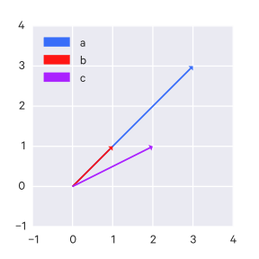

$$
\def\argmax{\operatorname*{argmax}}
\def\argmin{\operatorname*{argmin}}
$$

# NLP


## Problems

Some (higher-level) problems that fall under NLP include:

- machine translation
- (structured) information extraction
- summarization
- natural language interfaces
- speech recognition

At a lower-level, these include the following problems:

- part-of-speech tagging
- parsing
- word-sense disambiguation
- named entity recognition
- etc

## Challenges

__Ambiguity__ is one of the greatest challenges to NLP:

For example:

> Fed raises interest rates, where "raises" is the verb, and "Fed" is the noun phrase
> Fed raises interest rates, where "interest" is the verb, and "Fed raises" is the noun phrase

This ambiguity occurs at many levels:

- the _acoustic_ level: e.g. mixing up similar-sounding words
- the _syntactic_ level: e.g. multiple plausible grammatical parsings of a sentence
- the _semantic_ level: e.g. some words can mean multiple things ("bank" as in a river or a financial institution); this is called _word sense ambiguity_
- the _discourse_ (multi-clause) level: e.g. unclear what a pronoun is referring to

Other challenges include:

- _non-standard english_: for instance, text shorthand, phrases such as "SOOO PROUD" as opposed to "so proud", or hashtags, etc
- _segmentation issues_: [the] [New] [York-New] [Haven] [Railroad] vs. [the] [New York]-[New Haven] [Railroad]
- _idioms_ (e.g. "get cold feet", doesn't literally mean what it says)
- _neologisms_ (e.g. "unfriend", "retweet", "bromance")
- _world knowledge_ (e.g. "Mary and Sue are sisters" vs "Mary and Sue are mothers.")
- _tricky entity names_: "Where is _A Bug's Life_ playing", or "a mutation on the _for_ gene"

The typical approach is to codify knowledge about language & knowledge about the world and find some way to combine them to build probabilistic models.

## Terminology

- __synset__: a synset is a set of synonyms that represent a single sense of a word.
- __wordform__: the full inflected surface form: e.g. "cat" and "cats" are different wordforms.
- __lemma__: the same stem, part of speech, rough word sense; e.g. "cat" and "cats" are the same lemma.
    - One lemma can have many meanings. For example:

> a _bank_ can hold investments...
> agriculture on the east _bank_...

- __sense__: a discrete representation of an aspect of a word's meaning. The usages of _bank_ in the previous example have a different sense.
- __homonyms__: words that share form but have unrelated, distinct meanings (such as "bank").
    - _Homographs_: bank/bank, bat/bat
    - _Homophones_: write/right, piece/peace
- __polysemy__:
    - A _polysemous_ word has _related_ meanings, for example:
        - "the _bank_ was built in 1875 ("bank" = a building belonging to a financial institution)"
        - "I withdrew money from the _bank_ ("bank" = a financial institution)"
    - _Systematic polysemy_, or _metonymy_, is when the meanings have a _systematic_ relationship.
    - For example, "school", "university", "hospital" - all can mean the institution or the building, so the systematic relationship here is `building <=> organization`.
    - Another example is `author <=> works of author`, e.g. "Jane Austen wrote Emma" and "I love Jane Austen".
- __synonyms__: different words that have the same _propositional_ meaning in some or all contexts. However, there may be no examples of _perfect synonymy_ since even if propositional meaning is identical, they may vary in notions of politeness or other usages and so on.
    - For example, "water" and "H2O" - each are more appropriate in different contexts.
    - As another example, "big" and "large" - sometimes they can be swapped, sometimes they cannot:

> That's a big plane. How large is that plane? (Acceptable)
> Miss Nelson became kind of a big sister to Benjamin. Miss Nelson became kind of a large sister to Benjamin (Not as acceptable)

The latter works less because "big" has multiple senses, one of which does not correspond to "large".

- __antonyms__: -senses which are opposite with respect to one feature of meaning, but otherwise are similar, such as dark/light, short/fast, etc.
- __hyponym__: one sense is a hyponym of another if the first sense is more specific (i.e. denotes a subclass of the other).
    - _car_ is a hyponym of _vehicle_
    - _mango_ is a hyponym of _fruit_
- __hypernym/superordinate__:
    - _vehical_ is a hypernym of _car_
    - _fruit_ is a hypernym of _mango_
- __token__: an instance of that type in running text; $N$ = number of tokens, i.e. counting every word in the sentence, regardless of uniqueness.
- __type__: an element of the vocabulary; $V$ = vocabulary = set of types ($|V|$ = the size of the vocabulary), i.e. counting every unique word in the sentence.

## Data preparation

### Sentence segmentation

"!", "?" are pretty reliable indicators that we've reached the end of a sentence. Periods can mean the end of the sentence _or_ an abbreviation (e.g. Inc. or Dr.) or numbers (e.g. 4.3).

### Tokenization

__Tokenization__ is the process of breaking up text into discrete units for analysis - this is typically into words or phrases.

The best approach for tokenization varies widely depending on the particular problem and language. German, for example, has many long compound words which you may want to split up. Chinese has no spaces (no easy way for _word segmentation_), Japanese has no spaces and multiple alphabets.

### Normalization

Once you have your tokens you need to determine how to normalize them. For example, "USA" and "U.S.A." could be collapsed into a single token. But about "Windows", "window", and "windows"?

Some common approaches include:

- _case folding_ - reducing all letters to lower case (but sometimes case may be informative)
- _lemmatization_ - reduce inflections or variant forms to base form.
- _stemming_ = reducing terms of their stems; a crude chopping of affixes; a simplified version of lemmatization. The Porter stemmer is the most common English stemmer.

### Term Frequency-Inverse Document Frequency (tf-idf) Weighting

Using straight word counts may not be the best approach in many cases.

Rare terms are typically more informative than frequent terms, so we want to bias our numerical representations of tokens to give rarer words higher weights. We do this via __inverse document frequency weighting__ (idf):

$$ idf_t = \log(\frac{N}{df_t}) $$

For a term $t$ which appears in $df$ documents ($df_t$ = document frequency for $t$).

$\log$ is used here to "dampen" the effect of idf.

This can be combined with $t$'s term frequency $tf_d$ for a particular document $d$ to produce tf-idf weighting, which is the best known weighting scheme for text information retrieval:

$$ w_{t,d} = (1 + \log tf_{t,d}) \times \log(\frac{n}{df_t}) $$

### The Vector Space Model (VSM)

This representation of text data - that is, some kind of numerical feature for each word, such as the tf-idf weight and frequency, defines a $|V|$-dimensional vector space (where $V$ is the vocabulary size).

- _terms_ are the axes of space
- _documents_ are points (vectors) in this space
- this space is _very high-dimensional_ when dealing with large vocabularies
- these vectors are very _sparse_ - most entries are zero

### Normalizing vectors

This is a different kind of normalization than the previously mentioned one, which was about normalizing the language. Here, we are normalizing vectors in a more mathematical sense.

Vectors can be length-normalized by dividing each of its components by its length. We can use the L2 norm, which makes it a _unit vector_ ("unit" means it is of length 1):

$$ ||\vec{x}||_2 = \sqrt{\sum_i x_i^2} $$

This means that if we have, for example, a document and copy of that document with every word doubled, length normalization causes each to have identical vectors (without normalization, the copy would have been twice as long).

## Measuring similarity between text

### Minimum edit distance

The __minimum edit distance__ between two strings is the minimum number of editing operations (insertion/deletion/substitution) needed to transform one into the other. Each editing operation has a cost of 1, although in _Levenshtein minimum edit distance_ substitutions cost 2 because they are composed of a deletion and an insertion.

### Jaccard coefficient

The __Jaccard coefficient__ is a commonly-used measure of overlap for two sets $A$ and $B$.

$$ jaccard(A,B) = \frac{|A \cap B|}{|A \cup B|} $$

A set has a Jaccard coefficient of 1 against itself: $jaccard(A,A) = 1$.

If $A$ and $B$ have no overlapping elements, $jaccard(A,B) = 0$.

The Jaccard coefficient does _not_ consider term frequency, just set membership.

### Euclidean Distance

Using the vector space model above, the similarity between two documents can be measured by the euclidean distance between their two vectors.

However, euclidean distance can be problematic since longer vectors have greater distance.

For instance, there could be one document vector, $a$, and another document vector $b$ which is just a scalar multiple of the first document. Intuitively they may be more similar since they lie along the same line. But by euclidean distance, $c$ is closer to $a$.



### Cosine similarity

In cases like the euclidean distance example above, using _angles_ between vectors can be a better metric for similarity.

For length-normalized vectors, cosine similarity is just their dot product:

$$ cos(\vec{q}, \vec{d}) = \vec{q} \cdot \vec{d} = \sum_{i=1}^{|V|} q_i d_i $$

Where $q$ and $d$ are length-normalized vectors and $q_i$ is the tf-idf weight of term $i$ in document $q$ and $d_i$ is the tf-idf weight of term $i$ in document $d$.

## (Probabilistic) Language Models

The approach of probabilistic language models involves generating some probabilistic understanding of language - what is likely or unlikely. For example, given sentence A and sentence B, we want to be able to say whether or not sentence A is more probable sentence than sentence B.

We have some finite vocabulary $V$. There is an infinite set of strings ("sentences") that can be produced from $V$, notated $V^{\dagger}$ (these strings have zero or more words from $V$, ending with the `STOP` symbol). These sentences may make sense, or they may not (e.g. they might be grammatically incorrect).

Say we have a training sample of $N$ example sentences in English. We want to learn a probability distribution $p$ over the possible set of sentences $V^{\dagger}$; that is, $p$ is a function that satisfies:

$$
\sum_{x \in V^{\dagger}} p(x) = 1, p(x) \geq 0 \text{for all} x \in V^{\dagger}
$$

The goal is for likely English sentences (i.e. "correct" sentences) to be more probable than nonsensical sentences.

These probabilistic models have applications in many areas:

- Machine translation:
    $P(\text{high winds tonight}) > P(\text{large winds tonight})$.
- Spelling correction:
    $P(\text{about fifteen minutes from}) > P(\text{about fifteen minuets from})$.
- Speech recognition:
    $P(\text{I saw a van}) > P(\text{eyes awe of an})$.

So generally you are asking: what is the probability of this given sequence of words?

### A naive method

For any sentence $x_1, \dots, x_n$, we notate the count of that sentence in the training corpus as $c(x_1, \dots, x_n)$.

Then we might simply say that:

$$
p(x_1, \dots, x_n) = \frac{c(x_1, \dots, x_n)}{N}
$$

However, this method assigns 0 probability to sentences that are not in the training corpus, thus leaving many plausible sentences unaccounted for.

### A less naive method

You could use the _chain rule_ here:

$$
\begin{aligned}
P(\text{the water is so transparent}) = \\
P(\text{the}) \times P(\text{water}|\text{the}) \times P(\text{is}|\text{the water}) \\
\times P(\text{so}|\text{the water is}) \times P(\text{transparent}|\text{the water is so})
\end{aligned}
$$

Formally, the above would be expressed:

$$ P(w_1 w_2 \dots w_n) = \prod_i P(w_i|w_1 w_2 \dots w_{i-1}) $$

Note that probabilities are usually done in _log space_ to avoid _underflow_, which occurs if you're multiplying many small probabilities together, and because then you can just add the probabilities, which is faster than multiplying:

$$ p_1 \times p_2 \times p_3 = \log p_1 + \log p_2 + \log p_3 $$

To make estimating these probabilities manageable, we use the _Markov assumption_ and assume that a given word's conditional probability only depends on the immediately preceding $k$ words, _not_ the entire preceding sequence (that is, that any random variable depends only on the previous random variable, and is conditionally independent of all the random variables before that):

$$
P(X_1=x_1) \prod_{i=2}^n P(X_i=x_i|X_1=x_1,\dots,X_{i-1}=x_{i-1}) = P(X_1=x_1) \prod_{i=2}^n P(X_i=x_i|X_{i-1}=x_{i-1})
$$

That is, for any $i \in {2 \dots n}$, for any $x_1, \dots, x_i$:

$$
P(X_i=x_i|X_1=x_1,\dots,X_{i-1}=x_{i-1}) = P(X_i=x_i|X_{i-1}=x_{i-1})
$$

In particular, this is the _first-order Markov assumption_; if it seems appropriate, we could instead use the _second-order Markov assumption_, where we instead assume that any random variable depends only on the previous _two_ random variables:

$$
P(X_1=x_1,X_2=x_2,\dots,X_n=x_n) = P(X_1=x_1)P(X_2=x_2|X_1=x_1)\prod_{i=3}^n P(X_i=x_i|X_{i-2}=x_{i-2},X_{i-1}=x_{i-1})
$$

Though this is usually condensed to:

$$
\prod_{i=1}^n P(X_i=x_i|X_{i-2}=x_{i-2},X_{i-1}=x_{i-1})
$$

This can be extended to the third-order Markov assumption and so on.

In the context of language models, we define $x_{-1}, x_0$ as the special "start" symbol, $*$, indicating the start of a sentence.

We also remove the assumption that $n$ is fixed and instead consider it as a random variable. We can just define $X_n=\text{STOP}$, where $\text{STOP}$ is a special symbol, $\text{STOP} \notin V$.

### n-gram Models

The _unigram_ model treats each word as if they have an independent probability:

$$ P(w_1 w_2 \dots w_n) \approx \prod_i P(w_i) $$

The _bigram_ model conditions on the previous word:

$$ P(w_1 w_2 \dots w_{i-1}) \approx \prod_i P(w_i | w_{i-1}) $$

We estimate bigram probabilities using the _maximum likelihood estimate_ (MLE):

$$ P_{MLE}(w_i | w_{i-1}) = \frac{count(w_{i-1}, w_i)}{count(w_{i-1})} $$

Which is just the count of word $i$ occuring after word $i-1$ over all of the occurences of word $i-1$.

This can be extended to trigrams, 4-grams, 5-grams, etc.

Though language has __long-distance dependencies__, i.e. the probability of a word can depend on another word much earlier in the sentence, n-grams work well in practice.

#### Trigram Models

With a trigram model, we have a parameter $q(w|u,v)$ for each trigram (sequence of three words) $u,v,w$ such that $w \in V \cup \{\text{STOP}\}$ and $u,v \in V \cup \{*\}$.

For any sentence $x_1, \dots, x_n$, where $x_i \in V$ for $i=1 \dots (n-1)$ and $x_n = \text{STOP}$, the probability of the sentence under the trigram language model is:

$$
p(x_1, \dots, x_n) = \prod{i=1}^n q(x_i|x_{i-2},x_{i-1})
$$

With $x_{-1}, x_0$ as the special "start" symbol, $*$.

(This is just a second-order Markov process)

So then, how do we estimate the $q(w_i|w_{i-2},w_{i-1})$ parameters?

We could use the maximum likelihood estimate:

$$
q_{\text{ML}}(w_i|w_{i-2},w_{i-1}) = \frac{\text{Count}(w_{i-2},w_{i-1},w_i)}{\text{Count}(w_{i-2},w_{i-1})}
$$

However, this still has the problem of assigning 0 probability to trigrams that were not encountered in the training corpus.

There are also still many, many parameters to learn: if we have a vocabulary size $N=|V|$, then we have $N^3$ parameters in the model.

#### Dealing with zeros

Zeroes occur if some n-gram occurs in the testing data which didn't occur in the training set.

Say we had the following training set:

> ... denied the reports
> ... denied the claims
> ... denied the request

And the following test set:

> ... denied the offer

Here $P(\text{offer} | \text{denied the}) = 0$ since the model has not encountered that term.

We can get around this using __Laplace smoothing__, also known as __add-one smoothing__): simply pretend that we saw each word once more than we actually did (i.e. add one to all counts).

With add-one smoothing, our MLE becomes:

$$ P_{Add-1}(w_i | w_{i-1}) = \frac{count(w_{i-1}, w_i) + 1}{count(w_{i-1}) + V} $$

Note that this smoothing can be very blunt and may drastically change your counts.

#### Interpolation

Above we defined the trigram maximum-likelihood estimate. We can do the same for bigram and unigram estimates:

$$
\begin{aligned}
q_{\text{ML}}(w_i|w_{i-1}) &= \frac{\text{Count}(w_{i-1}, w_i)}{\text{Count}(w_{i-1})} \\
q_{\text{ML}}(w_i) &= \frac{\text{Count}(w_i)}{\text{Count}()}
\end{aligned}
$$

These various estimates demonstrate the bias-variance trade-off - the trigram maximum-likelihood converges to a better estimate but requires a lot more data to do so; the unigram maximum-likelihood estimate converges to a worse estimate but does so with a lot less data.

With linear interpolation, we try to combine the strengths and weaknesses of each of these estimates:

$$
q(w_i|w_{i-2}, w_{i-1}) = \lambda_1 q_{\text{ML}}(w_i|w_{i-2},w_{i-1}) + \lambda_2 q_{\text{ML}}(w_i|w_{i-1}) + \lambda_3 q_{\text{ML}}(w_i)
$$

Where $\lambda_1 + \lambda_2 + \lambda_3 = 1, \lambda_i \geq 0 \forall i$.

That is, we compute a weighted average of the estimates.

For a vocabulary $V' = V \cup \{\text{STOP}\}$, $\sum_{w \in V'} q(w|u,v)$ defines a distribution, since it sums to 1.

How do we estimate the $\lambda$ values?

We can take out some our training data as validation data (say ~5%). We train the maximum-likelihood estimates on the training data, then we define $c'(w_1, w_2, w_3)$ as the count of a trigram in the validation set.

Then we define:

$$
L(\lambda_1, \lambda_2, \lambda_3) = \sum_{w_1, w_2, w_3} c'(w_1, w_2, w_3) \log q(w_3|w_1,w_2)
$$

And choose $\lambda_1, \lambda_2, \lambda_3$ to maximize $L$ (this ends up being the same as choosing $\lambda_1, \lambda_2, \lambda_3$ to minimize the perplexity).

In practice, however, the $\lambda$ values are allowed to vary.

We define a function $\Pi$ that partitions histories, e.g.

$$
\Pi(w_{i-2},w_{i-1}) =
\begin{cases}
1 & \text{if Count$(w_{i-1},w_{i-2}) = 0$} \\
2 & \text{if $1 \leq$ Count$(w_{i-1},w_{i-2}) \leq 2$} \\
3 & \text{if $3 \leq$ Count$(w_{i-1},w_{i-2}) \leq 5$} \\
4 & \text{otherwise}
\end{cases}
$$

These partitions are usually chosen by hand.

Then we vary the $\lambda$ values based on the partition:

$$
q(w_i|w_{i-2}, w_{i-1}) = \lambda_1^{\Pi(w_{i-2},w_{i-1})} q_{\text{ML}}(w_i|w_{i-2},w_{i-1}) + \lambda_2^{\Pi(w_{i-2},w_{i-1})} q_{\text{ML}}(w_i|w_{i-1}) + \lambda_3^{\Pi(w_{i-2},w_{i-1})} q_{\text{ML}}(w_i)
$$

Where $lambda_1^{\Pi(w_{i-2},w_{i-1})} + lambda_2^{\Pi(w_{i-2},w_{i-1})} + lambda^3{\Pi(w_{i-2},w_{i-1})} = 1$ and each are $\geq 0$.

#### Discounting methods

Generally, these maximum likelihood estimates can be high, so we can define "discounted" counts, e.g. $\text{Count}*(x) = \text{Count}(x) - 0.5$ (the value to discount by can be determined on a validation set, like the $\lambda$ values from before). As a result of these discounted counts, we will have some probability mass left over, which is defined as:

$$
\alpha(w_{i-1}) = 1 - \sum_w \frac{\text{Count}*(w_{i-1}, w)}{\text{Count}(w_{i-1})}
$$

We can assign this leftover probability mass to words we have not yet seen.

We can use a __Katz Back-Off model__. First we will consider the bigram model.

We define two sets:

$$
\begin{aligned}
A(w_{i-1}) &= \{w : \text{Count}(w_{i-1},w) > 0\} \\
B(w_{i-1}) &= \{w : \text{Count}(w_{i-1},w) = 0\}
\end{aligned}
$$

Then the bigram model:

$$
q_{\text{BO}}(w_i|w_{i-1}) =
\begin{cases}
\frac{\text{Count}*(w_{i-1},w_i)}{\text{Count}(w_{i-1})} & \text{if $w_i \in A(w_{i-1})$} \\
\alpha(w_{i-1}) \frac{q_{\text{ML}}(w_i)}{\sum_{w \in B(w_{i-1})} q_{\text{ML}}(w)} & \text{if $w_i \in B(w_{i-1})$}
\end{cases}
$$

Where

$$
\alpha(w_{i-1}) = 1 - \sum_{w \in A(w_{i-1})} \frac{\text{Count}*(w_{i-1}, w)}{\text{Count}(w_{i-1})}
$$

Basically, this assigns the leftover probability mass to bigrams that were not previously encountered.

The Katz Back-Off model can be extended to trigrams as well:

$$
\begin{aligned}
A(w_{i-2},w_{i-1}) &= \{w : \text{Count}(w_{i-2},w_{i-1},w) > 0\} \\
B(w_{i-2},w_{i-1}) &= \{w : \text{Count}(w_{i-2},w_{i-1},w) = 0\} \\
q_{\text{BO}}(w_i|w_{i-2},w_{i-1}) &=
\begin{cases}
\frac{\text{Count}*(w_{i-2},w_{i-1},w_i)}{\text{Count}(w_{i-2},w_{i-1})} & \text{if $w_i \in A(w_{i-2},w_{i-1})$} \\
\alpha(w_{i-2},w_{i-1}) \frac{q_{\text{BO}}(w_i|w_{i-1})}{\sum_{w \in B(w_{i-2},w_{i-1})} q_{\text{BO}}(w|w_{i-1})} & \text{if $w_i \in B(w_{i-2},w_{i-1})$}
\end{cases} \\
\alpha(w_{i-2},w_{i-1}) &= 1 - \sum_{w \in A(w_{i-2},w_{i-1})} \frac{\text{Count}*(w_{i-2},w_{i-1}, w)}{\text{Count}(w_{i-2},w_{i-1})}
\end{aligned}
$$


### Log-Linear Models

When it comes to language models, the trigram model may be insufficient. There may be more information than just the previous two words that we want to take into account - for instance, the author of a paper, whether or not a particular word occurs in an earlier context, the part of speech of the preceding word, etc.

We may want to do something similar when it comes to tagging, e.g. condition on that a previous word is a particular word, or that it has a particular ending ("ing", "e", etc), and so on.

We can use __log-linear models__ to capture this extra information (encoded as numerical features, e.g. 1 if the preceding word is "foo", and 0 otherwise.).

With log-linear models, we frame the problem as such: We have some input domain $X$ and a finite label set $Y$. We want to produce a conditional probability $p(y|x)$ for any $x,y$ where $x \in X, y \in Y$.

For example, in language modeling, $x$ would be a "history" of words, i.e. $w_1, w_2, \dots, w_{i-1}$ and $y$ is an "outcome" $w_i$ (i.e. the predicted following word).

We represent our features as vectors (applying indicator functions and so on where necessary). We'll denote a feature vector for an input/output pair $(x,y)$ as $f(x,y)$.

We also have a parameter vector equal in length to our feature vectors (e.g. if we have $m$ features, then the parameter vector $v \in \mathbb R^m$).

We can compute a "score" for a pair $(x,y)$ as just the dot product of these two: $v \cdot f(x,y)$ which we can turn into the desired conditional probability $p(x|y)$:

$$
p(y|x;v) = \frac{e^{v \cdot f(x,y)}}{\sum_{y' \in Y} e^{v \cdot f(x,y')}}
$$

Read as "the probability of $y$ given $x$ under the parameters $v$".

This can be re-written as:

$$
\log p(y|x;v) = v \cdot f(x,y) - \log \sum_{y' \in Y} e^{v \cdot f(x,y')}
$$

This is why such models are called "log-linear": the $v \cdot f(x,y)$ term is the linear term and we calculate a log probability (and then there is the normalization term $\log \sum_{y' \in Y} e^{v \cdot f(x,y')}$).

So how do we estimate the parameters $v$?

We assume we have training examples $(x^{(i)}, y^{(i)})$ for $i=1, \dots, n$ and that each $(x^{(i)}, y^{(i)}) \in X \times Y$. We can use maximum-likelihood estimates to estimate $v$, i.e.

$$
\begin{aligned}
v_{\text{ML}} &= \argmax_{v \in \mathbb R^m} L(v) \\
L(v) &= \sum_{i=1}^n \log p(y^{(i)}|x^{(i)}; v) = \sum_{i=1}^n v \cdot f(x^{(i)}, y^{(i)}) - \sum_{i=1}^n \log \sum_{y' \in Y} e^{v \cdot f(x^{(i)}, y')}
\end{aligned}
$$

i.e. $L(v)$ is the log-likelihood of the data under the parameters $v$, and it is concave so we can optimize it fairly easily with gradient ascent.

We can add regularization to improve generalization.

### History-based models

The models that have been presented so far are called __history-based models__, in the following sense:

- We break structures down into a _derivation_ (a sequence of decisions)
- Each decision has an associated conditional probability
- The probability of a structure is just the product of the decision probabilities that created it
- The parameter values are estimated using some variant of maximum-likelihood estimation
- When choose $y$s such that they maximize either a joint probability $p(x,y;\theta)$ (e.g. in the case of HMMs or PCFGs) or a conditional probability $p(y|x;\theta)$ (in the case of log-linear models).


### Global Linear Models

GLMs extend log-linear models though they are different than history-based models (there are no "derivations" or probabilities for "decisions").

In GLMs, we have feature vectors for _entire structures_, i.e. "global features". This allows us to incorporate features that are difficult to include in history-based models.

GLMs have three components:

- $f(x,y) \in \mathbb R^d$ which maps a structure $(x,y)$ (e.g. a sentence and a parse tree) to a feature vector$ to a feature vector$ to a feature vector$ to a feature vector
- $\text{GEN}$ which is a function that maps an input $x$ to a set of _candidates_ $\text{GEN}(x)$. For example, it could return the set of all possible English translations for a French sentence $x$.
- $v \in \mathbb R^d$ is a parameter vector; it is learned from training data

So the final output is a function $F: X \to Y$, which ends up being:

$$
F(x) = \argmax_{y \in \text{GEN}(x)} f(x,y) \cdot v
$$


### Evaluating language models: perplexity

__Perplexity__ is a measure of the quality of a language model.

Assume we have a set of $m$ test sentences, $s_1, s_2, \dots, s_m$.

We can compute the probability of these sentences under our learned model $p$:

$$
\prod_{i=1}^m p(s_i)
$$

Though typically we look at log probability instead:

$$
\sum^m_{i=1} \log p(s_i)
$$

The perplexity is computed:

$$
\begin{aligned}
\text{perplexity} &= 2^{-l} \\
l &= \frac{1}{M} \sum_{i=1}^m \log p(s_i)
\end{aligned}
$$

Where $M$ is the total number of words in the test data. Note that $\log$ is $\log_2$.

Lower perplexity is better (because a high log probability is better, which causes perplexity to be low).


## Parsing

The parsing problem takes some input sentence and outputs a __parse tree__ which describes the syntactic structure of the sentence.

The leaf nodes of the tree are the words themselves, which are each tagged with a part-of-speech. Then these are grouped into phrases, such as noun phrases (NP) and verb phrases (VP), up to sentences (S) (these are sometimes called __constituents__).

These parse trees can describe grammatical relationships such as subject-verb, verb-object, and so on.

]

We can treat it as a supervised learning problem by using sentences annotated with parse trees (such data is usually called a "treebank").

### Context-free grammars (CFGs)

A formalism for the parsing problem.

A context-free grammar is a four-tuple $G=(N, \Sigma, R, S)$ where:

- $N$ is a set of non-terminal symbols
- $\Sigma$ is a set of terminal symbols
- $R$ is a set of rules of the form $X \to Y_1 Y_2 \dots Y_n$ for $n \geq 0, X \in N, Y_i \in (N \cup \Sigma)$
- $S \in N$ is a distinguished start symbol

An example CFG:

- $N = \{\text{S}, \text{NP}, \text{VP}, \text{PP}, \text{DT}, \text{Vi}, \text{Vt}, \text{NN}, \text{IN}\}$
- $S = \text{S}$
- $\Sigma = \{\text{sleeps}, \text{saw}, \text{woman}, \text{telescope}, \text{the}, \text{with}, \text{in}\}$
- $R$ is the following set of rules:
    - $\text{S} \to \text{NP VP}$
    - $\text{VP} \to \text{Vi}$
    - $\text{VP} \to \text{Vt NP}$
    - $\text{VP} \to \text{VP PP}$
    - $\text{NP} \to \text{DT NN}$
    - $\text{NP} \to \text{NP PP}$
    - $\text{PP} \to \text{IN NP}$
    - $\text{Vi} \to \text{sleeps}$
    - $\text{Vt} \to \text{saw}$
    - $\text{NN} \to \text{man}$
    - $\text{NN} \to \text{woman}$
    - $\text{NN} \to \text{telescope}$
    - $\text{DT} \to \text{the}$
    - $\text{IN} \to \text{with}$
    - $\text{IN} \to \text{in}$

Note:
- S = sentence
- VP = verb phrase
- NP = noun phrase
- PP = prepositional phrase
- DT = determiner
- Vi = intransitive verb
- Vt = transitive verb
- NN = noun
- IN = preposition

We can _derive_ sentences from this grammar.

A __left-most derivation__  is a sequence of strings $s_1, \dots, s_n$ where:

- $s_1 = S$, the start symbol
- $s_n \in \Sigma^*$; that is, $s_n$ consists only of terminal symbols
- each $s_i$ for $i=2, \dots, n$ is derived from $s_{i-1}$ by picking the left-most non-terminal $X$ in $s_{i-1}$ and replacing it with some $\beta$ where $X \to \beta$ is a rule in $R$.

Using the example grammar, we could do:

1. "S"
2. expand "S" to "NP VP"
3. expand "NP" (since it is the left-most symbol) to "D N", yielding "D N VP"
4. expand "D" (again, it is left-most) to "the", yielding "the N VP"
5. expand "N" (since the left-most symbol "the" is a terminal symbol) to "man", yielding "the man VP"
6. expand "VP" to "Vi" (since it is the last non-terminal symbol), yielding "the man Vi"
7. expand "Vi" to "sleeps", yielding "the man sleeps"
8. the sentence consists only of terminal symbols, so we are done.

Thus a CFG defines a set of possible derivations, which can be infinite.

We say that a string $s \in \Sigma^*$ is in the _language_ defined by the CFG if we can derive it from the CFG.

A string in a CFG may have multiple derivations - this property is called "ambiguity".

For instance, "fruit flies like a banana" is ambiguous in that "fruit flies" may be a noun phrase or it may be a noun and a verb.

### Probabilistic Context-Free Grammars (PCFGs)

PCFGs are CFGs in which each rule is assigned a probability, which helps with the ambiguity problem. We can compute the probability of a particular derivation as the product of the probability of its rules.

We notate the probability of a rule as $q(\alpha \to \beta)$. Note that we have individual probability distributions for the left-side of each rule, e.g. $\sum q(\text{VP} \to \beta) = 1, \sum q(\text{NP} \to \beta = 1$, and so on. Another way of saying this is these distributions are conditioned on the left-side of the rule.

These probabilities can be learned from data as well, simply by counting all the rules in a treebank and using maximum likelihood estimates:

$$
q_\text{ML}(\alpha \to \beta) = \frac{\text{Count}(\alpha \to \beta)}{\text{Count}(\alpha)}
$$

Given a PCFG, a sentence $s$, and a set of trees which yield $s$ as $\Tau(s)$, we want to compute $\argmax_{t \in \Tau(s)} p(t)$. That is, given a sentence, what is the most likely parse tree to have produced this sentence?

A challenge here is that $|\Tau(s)|$ may be very large, so brute-force search is not an option. We can use the __CKY algorithm__ instead.

First we will assume the CFG is in Chomsky normal form. A CFG is in _Chomsky normal form_ if the rules in $R$ take one of two forms:

- $X \to Y_1 Y_2$ for $X, Y_1, Y_2 \in N$
- $X \to Y$ for $X \in N, Y \in \Sigma$

In practice, any PCFG can be converted to an equivalent PCFG in Chomsky normal form by combining multiple symbols into single symbols (e.g. you can convert $\text{VP} \to \text{Vt NP PP}$ by defining a new symbol $\text{Vt-NP} \to \text{Vt NP}$ and then redefining $\text{VP} \to \text{Vt-NP PP}$).

First, let's consider the problem $\max_{t \in \Tau(s)} p(t)$.

Notation:

- $n$ = number of words in the sentence
- $w_i$ = the $i$th word in the sentence

We define a dynamic programming table $\pi[i,j,X]$ which is the maximum probability of a constituent with non-terminal $X$ spanning the words $i, \dots, j$ inclusive. We set $i, j \in 1, \dots, n$ and $i \leq j$.

We want to calculate $\max_{t \in \Tau(s) p(t)} = \pi[1,n,S]$, i.e. the max probability for a parse tree spanning the first through the last word of the sentence with the $S$ symbol.

We will use a recursive definition of $\pi$.

The base case is: for all $i = 1, \dots, n$ for $X \in N$, $\pi[i,i,X] = q(X \to w_i)$. If $X \to w_i$ is not in the grammar, then $q(X \to w_i) = 0$.

The recursive definition is: for all $i = 1, \dots, (n-1)$ and $j = (i+1), \dots, n$ and $X \in N$:

$$
\pi(i,j,X) = \max_{X \to YZ \in R, s \in \{i,\dots,(j-1)\}} q(X \to YZ)\pi(i,s,Y)\pi(s+1,j,Z)
$$

$s$ is called the "split point" because it determines where the word sequence from $i$ to $j$ (inclusive) is split.

The full CKY algorithm:

Initialization: For all $i \in \{i, \dots, n\}$, for all $X \in N$:

$$
\pi(i,i,X) =
\begin{cases}
q(X \to x_i) & \text{if} X \to x_i \in R\\
0 & \text{otherwise}
\end{cases}
$$

Then:

- For $l = 1, \dots, (n-1)$
    - For $i = 1, \dots, (n-l)$
        - Set $j = i+1$
        - For all $X \in N$, calculate:

$$
\begin{aligned}
\pi(i,j,X) &= \max_{X \to YZ \in R, s \in \{i,\dots,(j-1)\}} q(X \to YZ)\pi(i,s,Y)\pi(s+1,j,Z) \\
bp(i,j,X) &= \argmax_{X \to YZ \in R, s \in \{i,\dots,(j-1)\}} q(X \to YZ)\pi(i,s,Y)\pi(s+1,j,Z) \\
\end{aligned}
$$

This has the runtime $O(n^3 |N|^3)$ because the $l$ and $i$ loops $n$ times each, giving us $n^2$, then at the inner-most loop (for all $X \in N$) loops $|N|$ times, then $X \to YZ \in R$ has $|N|^2$ values to search through because these are $|N|$ choices for $Y$ and $|N|$ choices for $Z$. Then there are also $n$ choices to search through for $s$.

#### Weaknesses of PCFGs

PCFGs (as described above) don't perform very well; they have two main shortcomings:

- Lack of sensitivity to lexical information
    - that is, attachment is completely independent of the words themselves
- Lack of sensitivity to structural frequencies
    - for example, with the phrase "president of a company in Africa", "in Africa" can be attached to either "president" or "company". If we were to parse this phrase, we might come up with two trees described by exactly the same rule sets, the only difference is where the PP "in Africa" is attached to. Since they are exactly the same rule sets, they have the same probability, so the PCFG can't distinguish the two. However, statistically, the "close attachment" structure (i.e. generally the PP would attach to the closer object, in this case, "company") is more frequent, so it should be preferred.

#### Lexicalized PCFGs

Lexicalized PCFGs deal with the above weaknesses.

For a non-terminal rule, we specify one its children as the "head" of the rule, which is essentially the most "important" part of the rule (e.g. for the rule $\text{VP} \to \text{Vt} \text{NP}$, the verb $\text{Vt}$ is the most important semantic part and thus the head).

We define another set of rules which identifies the heads of our grammar's rules, e.g. "If the rule contains NN, NNS, or NNP, choose the rightmost NN, NNS, or NNP as the head".

Now when we construct the tree, we annotate each node with its headword (that is, the word that is in the place of the head of a rule).

For instance, say we have the following tree:

```
VP
├── Vt
│   └── questioned
└── NP
    ├── DT
    │   └── the
    └── NN
        └── witness
```

We annotate each node with its headword:

```
VP(questioned)
├── Vt(questioned)
│   └── questioned
└── NP(witness)
    ├── DT(the)
    │   └── the
    └── NN(witness)
        └── witness
```

We can revise our Chomsky Normal Form for lexicalized PCFGs by defining the rules in $R$ to have one of the following three forms:

- $X(h) \to_1 Y_1(h) Y_2(w)$ for $X, Y_1, Y_2 \in N$ and $h,w \in \Sigma$
- $X(h) \to_2 Y_1(w) Y_2(h)$ for $X, Y_1, Y_2 \in N$ and $h,w \in \Sigma$
- $X(h) \to h$ for $X \in N, h \in \Sigma$

Note the subscripts on $\to_1, \to_2$ which indicate which of the children is the head.

##### Parsing lexicalized PCFGs

That is, we consider rules with words, e.g. $\text{NN}(dog)$ is a different rule than $\text{NN}(cat)$. By doing so, we increase the number of possible rules to $O(|\Sigma|^2 |N|^3)$, which is a lot.

However, given a sentence $w_1, w_2, \dots, w_n$, at most $O(n^2 |N|^3)$ rules are applicable because we can disregard any rule that does not contain one of $w_1, w_2, \dots, w_n$; this makes parsing lexicalized PCFGs a bit easier (it can be done in $O(N^5 |N|^3)$ time rather than $O(n^3|\Sigma|^2 |N|^3)$ time, which is the runtime if we consider all possible rules).

##### Parameter estimatino in lexicalized PCFGs

In a lexicalized PCFGs, our parameters take the form:

$$
q(\text{S}(\text{saw}) \to_2 \text{NP}(\text{man}) \text{VP}(\text{saw}))
$$

We decompose this parameter into a product of two parameters:

$$
q(\text{S} \to_2 \text{NP VP}|\text{S},\text{saw})q(\text{man}|\text{S} \to_2 \text{NP VP}, \text{saw})
$$

The first term describes: given $\text{S}(\text{saw})$, what is the probability that it expands $\to_2 \text{NP VP}$?

The second term describes: given the rule $\text{S} \to_2 \text{NP VP}$ and the headword $\text{saw}$, what is the probability that $\text{man}$ is the headword of $\text{NP}$?

Then we used smoothed estimation for the two parameter estimates (we're using linear interpolation):

$$
q(\text{S} \to_2 \text{NP VP}|\text{S},\text{saw}) = \lambda_1 q_{\text{ML}}(\text{S} \to_2 \text{NP VP}|\text{S, saw}) + \lambda_2 q_{\text{ML}}(\text{S} \to_2 \text{NP VP}|\text{S})
$$

Again, $\lambda_1, \lambda_2 \geq 0, \lambda_1 + \lambda_2 = 1$.

To clarify:

$$
\begin{aligned}
q_{\text{ML}}(\text{S} \to_2 \text{NP VP}|\text{S, saw}) &= \frac{\text{Count}(\text{S(saw)} \to_2 \text{NP VP})}{\text{Count}(\text{S(saw)})} \\
q_{\text{ML}}(\text{S} \to_2 \text{NP VP}|\text{S}) &= \frac{\text{Count}(\text{S} \to_2 \text{NP VP})}{\text{Count}(\text{S})}
\end{aligned}
$$

Here is the linear interpolation for the second parameter:

$$
q(\text{man}|\text{S} \to_2 \text{NP VP},\text{saw}) = \lambda_3 q_{\text{ML}}(\text{man}|\text{S} \to_2 \text{NP VP},\text{saw}) + \lambda_4 q_{\text{ML}}(\text{man}|\text{S} \to_2 \text{NP VP}) + \lambda_5 q_{\text{ML}}(\text{man}|\text{NP})
$$

Again, $\lambda_3, \lambda_4, \lambda_5 \geq 0, \lambda_3 + \lambda_4 + \lambda_5 = 1$.

To clarify, $q_{\text{ML}}(\text{man}|\text{NP})$ describes: given $\text{NP}$, what is the probability that its headword is $\text{man}$?

This presentation of PCFGs do not deal with the close attachment issue as described earlier, though there are modified forms which do.


## Text Classification

The general text classification problem is given an input document $d$ and a fixed set of classes $C = \{c_1, c_2, \dots, c_j\}$ output a predicted class $c \in C$.

### Naive Bayes

This supervised approach to classification is based on Bayes' rule. It relies on a very simple representation of the document called "bag of words", which is ignorant of the sequence or order of word occurrence (and other things), and only pays attention to their counts/frequency.

So you can represent the problem with Bayes' rule:

$$
P(c|d) = \frac{P(d|c)P(c)}{P(d)}
$$

And the particular problem at hand is finding the class which maximizes $P(c|d)$, that is:

$$
\begin{aligned}
C_{MAP} &= \text{argmax}_{c \in C} P(c|d)
&= \text{argmax}_{c \in C} P(d|c)P(c)
\end{aligned}
$$

Where $C_{MAP}$ is the maximum a posteriori class.

Using our bag of words assumption, we represent a document as features $x_1, \dots x_n$ without concern for their order:

$$ C_{MAP} = \text{argmax}_{c \in C} P(x_1, x_2, \dots, x_n | c)P(c) $$

We additionally assume _conditional independence_, i.e. that the presence of one word doesn't have any impact on the probability of any other word's occurrence:

$$ P(x_1, x_2, \dots, x_n | c) = P(x_1 | c) \cdot P(x_2 | c) \cdot \dots \cdot P(x_n | c) $$

And thus we have the _multinomial naive bayes classifier_:

$$ C_{NB} = \text{argmax}_{c \in C} P(c_j) \prod_{x \in X} P(x | c) $$

To calculate the prior probabilities, we use the _maximum likelihood estimates_ approach:

$$ P(c_j) =  \frac{\text{doccount}(C = c_j)}{N_{doc}} $$

That is, the prior probability for a given class is the count of documents in that class over the total number of documents.

Then, for words:

$$ P(w_i | c_j) = \frac{count(w_i, c_j)}{\sum_{w \in V}count(w, c_j)} $$

That is, the count of a word in documents of a given class, over the total count of words in that class.

To get around the problem of zero probabilities (for words encountered in test input but not in training, which would cause a probability of a class to be zero since the probability of a class is the joint probability of the words encountered), you can use Laplace smoothing (see above):

$$ P(w_i | c_j) = \frac{count(w_i, c_j) + 1}{(\sum_{w \in V}count(w, c_j)) + |V|} $$

Note that to avoid underflow (from multiplying lots of small probabilities), you may want to work with log probabilities (see above).

In practice, even with all these assumptions, Naive Bayes can be quite good:

- Very fast, low storage requirements
- Robust to irrelevant features (they tend to cancel each other out)
- Very good in domains with many equally important features
- Optimal if independence assumptions hold
- A good, dependable baseline for text classification

### Evaluating text classification

The possible outcomes are:

- true positive: correctly identifying something as true
- false positive: incorrectly identifying something as true
- true negative: correctly identifying something as false
- false negative: incorrectly identifying something as false

The _accuracy_ of classification is calculated as:

$$ \text{accuracy} = \frac{tp + tn}{tp + fp + fn + fn} $$

Though as a metric it isn't very useful if you are dealing with situations where the correct class is sparse and most words you encounter are not in the correct class:

> Say you're looking for a word that only occurs 0.01% of the time. you have a classifier you run on 100,000 docs and the word appears in 10 docs (so 10 docs are correct, 99,990 are not correct). but you can have that classifier classify all docs as not correct and get an amazing accuracy of 99,990/100,000 = 99.99% but the classifier didn't actually do anything!

So other metrics are needed.

_Precision_ measures the percent of selected items that are correct:

$$ \text{precision} = \frac{tp}{tp + fp} $$

_Recall_ measures the percent of correct items that are selected:

$$ \text{recall} = \frac{tp}{tp = fn} $$

Typically, there is a trade off between recall and precision - the improvement of one comes at the sacrifice of the other.

The _F measure_ combines both precision and recall into a single metric:

$$ F = \frac{1}{\alpha \frac{1}{P} + (1-\alpha) \frac{1}{R}} = \frac{(\beta^2 + 1)PR}{\beta^2 P + R} $$

Where $\alpha$ is a weighting value so you can assign more importance to either precision or recall.

People usually use the _balanced F1 measure_, where $\beta = 1$ (that is, $\alpha = 1/2$):

$$ F = \frac{2PR}{P+R} $$

## Tagging

A class of NLP problems in which we want to assign a tag to each word in an input sentence.

- __Part-of-speech tagging__: Given an input sentence, output a POS tag for each word. Like in many NLP problems, ambiguity makes this a difficult task.
- __Named entity recognition__: Given an input sentence, identify the _named entities_ in the sentence (e.g. a company, or location, or person, etc) and what type the entity is (other words are tagged as non-entities). Entities can span multiple words, so there will often be "start" and "continue" tags (e.g. for "Wall Street", "Wall" is tagged as "start company", and "Street" is tagged as "continue company").

There are two types of constraints in tagging problems:

- _local_: words with multiple meanings can have a bias (a "local preference") towards one meaning (i.e. one meaning is more likely than the others)
- _contextual_: certain meanings of a word are more likely in certain contexts

These constraints can sometimes conflict.

### Generative models

One approach to tagging problems (and supervised learning in general) is to use a _conditional model_ (often called a _discriminative model_), i.e. to learn the distribution $p(y|x)$ and select $\argmax_y p(y|x)$ as the label.

Alternatively, we can use a _generative model_ which instead learns the distribution $p(x,y)$. We often have $p(x,y) = p(y)p(x|y)$, where $p(y)$ is the _prior_ and $p(x|y)$ is the _conditional generative model_.

This is generative because we can use this to generate new sentences by sampling the distribution given the words we have so far.

We can apply Bayes' Rule as well to derive the conditional distribution as well:

$$
p(y|x) = \frac{p(y)p(x|y)}{p(x)}
$$

Where $p(x) = \sum_y p(y)p(x|y)$.

Again, we can select $\argmax_y p(y|x)$ as the label, but we can apply Bayes' Rule to equivalently get $\argmax_y \frac{p(y)p(x|y)}{p(x)}$. But note that $p(x)$ does not vary with $y$ (i.e. it is constant), so it does not affect the $\argmax$, and we can just drop it to get $\argmax_y p(x)p(x|y)$.

### Hidden Markov Models (HMM)

An example of a generative model.

We have an input sentence $x = x_1, x_2, \dots, x_n$ where $x_i$ is the $i$th word in the sentence.

We also have a tag sequence $y = y_1, y_2, \dots, y_n$ where $y_i$ is the tag for the $i$th word in the sentence.

We can use a HMM to define the joint distribution $p(x_1, x_2, \dots, x_n, y_1, y_2, \dots, y_n)$.

Then the most likely tag sequence for $x$ is $\argmax_{y_1,\dots,y_n} p(x_1, x_2, \dots, x_n, y_1, y_2, \dots, y_n)$.

#### Trigram HMMs

For any sentence $x_1, \dots, x_n$ where $x_i \in V$ for $i = 1, \dots, n$ and any tag sequence $y_1, \dots, y_{n+1}$ where $y_i \in S$ for $i = 1, \dots, n$ and $y_{n+1} = \text{STOP}$ (where $S$ is the set of possible tags, e.g. DT, NN, VB, P, ADV, etc), the joint probability of the sentence and tag sequence is:

$$
p(x_1, \dots, x_n, y_1, \dots, y_{n+1}) = \prod_{i=1}^{n+1} q(y_i|y_{i-2}, y_{i-1}) \prod_{i=1}^n e(x_i|y_i)
$$

Again we assume that $x_0 = x_{-1} = *$.

The parameters for this model are:

- $q(s|u,v)$ for any $s \in S \cup \{\text{STOP}\}, u, v \in S \cup \{*\}$
- $e(x|s)$ for any $s \in S, x \in V$, sometimes called "emission parameters"

The first product is the (second-order) Markov chain, quite similar to the trigram Markov chain used before for language modeling, and the $e(x_i|y_i)$ terms of the second product are what we have observed. Combined, these produce a hidden Markov model (the Markov chain is "hidden", since we don't observe the tag sequences, we only observe the $x_i$s).

#### Parameter estimation in HMMs

For the $q(y_i|y_{i-2},y_{i-1})$ parameters, we can again use a linear interpolation with maximum likelihood estimates approach as before with the trigram language model.

For the emission parameters, we can also use a maximum likelihood estimate:

$$
e(x|y) = \frac{\text{Count}(y, x)}{\text{Count}(y)}
$$

However, we again have the issue that $e(x|y) = 0$ for all $y$ if we have never seen $x$ in the training data. This will cause the entire joint probability $p(x_1, \dots, x_n, y_1, \dots, y_{n+1})$ to become 0.

How do we deal with low-frequency words then?

We can split the vocabulary into two sets:

- frequent words: occurring $\geq t$ times in the training data, where $t$ is some threshold (e.g. $t=5$)
- low-frequency words: all other words, including those not seen in the training data

Then map low-frequency words into a small, finite set depending on textual features, such as prefixes, suffixes, etc. For example, we may map all all-caps words (e.g. IBM, MTA, etc) to a word class "allCaps", and we may map all four-digit numbers (e.g. 1988, 2010, etc) to a word class "fourDigitNum", or all first words of sentences to a word class "firstWord", and so on.

### The Viterbi algorithm

We want to compute $\argmax_{y_1,\dots,y_n} p(x_1, x_2, \dots, x_n, y_1, y_2, \dots, y_n)$, but we don't want to do so via brute-force search. The search space is far too large, growing exponentially with $n$ (the search space's size is $|S|^n$).

A more efficient way of computing this is to use the __Viterbi algorithm__:

Define $S_k$ for $k=-1, \dots, n$ to be the set of possible tags at position $k$:

$$
\begin{aligned}
S_{-1} &= S_0 = \{*\} \\
S_k &= S \forall k \in \{1, \dots, n\}
\end{aligned}
$$

Then we define:

$$
r(y_{-1}, y_0, y_1, \dots, y_k) = \prod_{i=1}^k q(y_i|y_{i-2}, y_{i-1}) \prod_{i=1}^k e(x_i|y_i)
$$

This computes the probability from our HMM for a given sequence of tags, $y_{-1}, y_0, y_1, \dots, y_k$, but only up to the $k$th position.

We define a dynamic programming table: $\pi(k,u,v)$ as the maximum probability of a tag sequence ending in tags $u, v$ at position $k$, i.e:

$$
\pi(k,u,v) = \max_{(y_{-1}, y_0, y_1, \dots, y_k):y_{k-1}=u,y_k=v} r(y_{-1}, y_0, y_1, \dots, y_k)
$$

To clarify: $k \in \{1, \dots, n\}, u \in S_{k-1}, v \in S_k$.

For example: say we have the sentence "The man saw the dog with the telescope", which we re-write as "START START The Man saw the dog with the telescope". We'll set $S_k=\{D,N,V,P\}$ for $k \geq 1$ and $S_{-1}=S_0=\{*\}$.

If we want to compute $\pi(7,P,D)$, then $k=7$ so then fix the 7th term with the $D$ tag and the $k-1$ term with the $P$ tag. Then we consider all possible tag sequences (ending with $P, D$) up to the 7th term (e.g. $*, D, N, V, P, P, P, D$ and so on) and get the probability of the most likely sequence.

We can re-define the above recursively.

The base case is $\pi(0, *, *) = 1$ since we always have the two START tokens tagged as $*$ at the beginning.

Then, for any $k \in \{1, \dots, n\}$ for any $u \in S_{k-1}$ and $v \in S_k$:

$$
\pi(k, u, v) = \max_{w \in S_{k-2}} (\pi(k-1, w, u)q(v|w,u)e(x_k|v))
$$

The __Viterbi algorithm__ is just the application of this recursive definition while keeping backpointers to the tag sequences with max probability:

- For $k=1, \dots, n$
    - For $u \in S_{k-1}, v \in S_k$
        - $\pi(k, u, v) = \max_{w \in S_{k-2}} (\pi(k-1, w, u)q(v|w,u)e(x_k|v))$
        - $bp(k, u, v) = \argmax_{w \in S_{k-2}} (\pi(k-1, w, u)q(v|w,u)e(x_k|v))$
- Set $(y_{n-1}, y_n) = \argmax_{(u,v)} (\pi(n,u,v)q(\text{STOP}|u,v))$
- For $k=(n-2), \dots, 1, y_k = bp(k+2, y_{k_1}, y_{k+2})$
- Return the tag sequence $y_1, \dots, y_n$

It has the runtime $O(n|S|^3)$ because of the loop over $k$ value (for $k=1, \dots, n$, so this happens $n$ times), then its inner loops over $S$ twice (for $u \in S_{k-1}$ and for $v \in S_k$), with each loop searching over $|S|$.

## Named Entity Recognition (NER)

Named entity recognition is the extraction of _entities_ - people, places, organizations, etc - from a text.

Many systems use a combination of statistical techniques, linguistic parsing, and gazetteers to maximize detection recall & precision.  Distant supervision and unsupervised techniques can also help with training, limiting the amount of gold-standard data necessary to build a statistical model.

_Boundary errors_ are common in NER:

> First _Bank of Chicago_ announced earnings...

Here, the extractor extracted "Bank of Chicago" when the correct entity is the "First Bank of Chicago".

A general NER approach is to use supervised learning:

1. Collect a set of training documents
2. Label each entity with its entity type or `O` for "other".
3. Design feature extractors
4. Train a sequence classifier to predict the labels from the data.

## Relation Extraction

> International Business Machines Corporation (IBM or the company) was incorporate in the State of New York on June 16, 1911, as the Computing-Tabulating-Recording Co. (C-T-R)...

From such a text you could extract the following _relation triples_:

    Founder-year(IBM,1911)
    Founding-location(IBM,New York)

These relations may be represented as _resource description framework (RDF) triples_ in the form of `subject predicate object`.

> Golden Gate Park location San Francisco

### Ontological Relations

- `IS-A` describes a subsumption between classes, called a _hypernum_:

    > Giraffe IS-A ruminant IS-A ungulate IS-A mammal IS-A vertebrate IS-A animal...

- `instance-of` relation between individual and class

    > San Francisco instance-of city

There may be many domain-specific ontological relations as well, such as `founded` (between a `PERSON` and an `ORGANIZATION`), `cures` (between a `DRUG` and a `DISEASE`), etc.

### Methods

Relation extractors can be built using:

- handwritten patterns
- supervised machine learning
- semi-supervised and unsupervised
    - bootstrapping (using seeds)
    - distance supervision
    - unsupervised learning from the web

#### Handwritten patterns

- Advantages:
    - can take advantage of domain expertise
    - human patterns tend to be high-precision
- Disadvantages:
    - human patterns are often low-recall
    - hard to capture all possible patterns

#### Supervised

- Advantages:
    - can get high accuracy if...
        - there's enough hand-labeled training data
        - if the test is similar enough to training
- Disadvantages:
    - labeling a large training set is expensive
    - don't generalize well

You could use classifiers: find all pairs of named entities, then use a classifier to determine if the two are related or not.

#### Unsupervised

If you have no training set and either only a few seed tuples or a few high-precision patterns, you can _bootstrap_ and use the seeds to accumulate more data.

The general approach is:

1. Gather a set of seed pairs that have a relation $R$
2. Iterate:
    1. Find sentences with these pairs
    2. Look at the context between or around the pair
    3. Generalize the context to create patterns
    4. Use these patterns to find more pairs

For example, say we have the seed tuple $<\text{Mark Twain, Elmira}>$. We could use Google or some other set of documents to search based on this tuple. We might find:

- "Mark Twain is buried in Elmira, NY"
- "The grave of Mark Twain is in Elmira"
- "Elmira is Mark Twain's final resting place"

which gives us the patterns:

- "X is buried in Y"
- "The grave of X is in Y"
- "Y is X's final resting place"

Then we can use these patterns to search and find more tuples, then use those tuples to find more patterns, etc.

Two algorithms for this bootstrapping is the Dipre algorithm and the Snowball algorithm, which is a version of Dipre which requires the strings be named entities rather than any string.

Another semi-supervised algorithm is _distance supervision_, which mixes bootstrapping and supervised learning. Instead of a few seeds, you use a large database to extract a large number of seed examples and go from there:

1. For each relation $R$
2. For each tuple in a big database
3. Find sentences in a large corpus with both entities of the tuple
4. Extract frequent contextual features/patterns
5. Train a supervised classifier using the extracted patterns

## Sentiment Analysis

In general, sentiment analysis involves trying to figure out if a sentence/doc/etc is positive/favorable or negative/unfavorable; i.e. detecting _attitudes_ in a text.

The attitude may be

- a simple weighted polarity (positive, negative, neutral), which is more common
- from a set of types (like, love, hate, value, desire, etc)

When using multinomial Naive Bayes for sentiment analysis, it's often better to use _binarized_ multinomial Naive Bayes under the assumption that word occurrence matters more than word frequency: seeing "fantastic" five times may not tell us much more than seeing it once. So in this version, you would cap word frequencies at one.

An alternate approach is to use $\log(freq(w))$ instead of 1 for the count.

However, sometimes raw word counts don't work well either. In the case of IMDB ratings, the word "bad" appears in more 10-star reviews than it does in 2-star reviews!

Instead, you'd calculate the _likelihood_ of that word occurring in an $n$-star review:

$$
P(w|c) = \frac{f(w,c)}{\sum_{w \in C} f(w,c)}
$$

And then you'd used the _scaled likelihood_ to make these likelihoods comparable between words:

$$
\frac{P(w|c)}{P(w)}
$$

### Sentiment Lexicons

Certain words have specific sentiment; there are a variety of sentiment lexicons which specify those relationships.

### Challenges

#### Negation

"I _didn't_ like this movie" vs "I _really_ like this movie."

One way to handle negation is to prefix every word following a negation word with `NOT_`, e.g. "I didn't NOT_like NOT_this NOT_movie".

#### "Thwarted Expectations" problem

For example, a film review which talks about how great a film _should_ be, but fails to live up to those expectations:

> This film should be _brilliant_. It sounds like a _great_ plot, the actors are _first grade_, and the supporting cast is _good_ as well, and Stallone is attempting to deliver a good performance. However, it _can't hold up_.

## Summarization

Generally, sumamrization is about producing an abridged version of a text without or with minimal loss of important information.

There are a few ways to categorize summarization problems.

- Single-document vs multi-document summarization: summarizing a single document, yielding an abstract or outline or headline, or producing a gist of the content of multiple documents?
- Generic vs query-focused summarization: give a general summary of the document, or a summary tailored to a particular user query?
- Extractive vs abstractive: create a summary from sentences pulled from the document, or generate new text for the summary?

Here, extractive summarization will be the focus (abstractive summarization is really hard).

The _baseline_ used in summarization, which often works surprisingly well, is just to take the first sentence of a document.

### The general approach

Summarization usually uses this process:

1. Content Selection: choose what sentences to use from the document.
    - You may weight salient words based on tf-idf, its presence in the query (if there is one), or based on topic signature.
        - For the latter, you can use _log-likelihood ratio_ (LLR):

            $$ weight(w_i) = \begin{cases} 1 & \text{if} -2\log\lambda(w_i)>10 \\ 0 & \text{otherwise} \end{cases} $$

    - Weight a sentence (or a part of a sentence, i.e. a _window_) by the weights of its words:

        $$ weight(s) = \frac{1}{|S|} \sum_{w \in S} weight(w) $$

    - You can combine LLR with _maximal marginal relevance_ (MMR), which is a greedy algorithm which selects sentences by their similarity to the query and by their dissimilarity (novelty) to already-selected sentences to avoid redundancy.

2. Information Ordering: choose the order for the sentences in the summary.
    - If you are summarizing documents with some chronological order to them, such as the news, then it makes sense to order sentences chronologically (if you are, for example, summarizing a set of news articles).
    - You can also use _topical ordering_, and order sentences by the order of topics in the source documents.
    - You can also use _coherence_:
        - Choose orderings that make neighboring sentences (cosine) similar.
        - Choose orderings in which neighboring sentences discuss the same entity.

3. Sentence Realization: clean up the sentences so that the summary is coherent or remove unnecessary content. You could remove:
    - _appositives_: "Rajam[, an artist living in Philadelphia], found inspiration in the back of city magazines."
    - _attribution clauses_: "Sources said Wednesday"
    - _initial adverbials_: "For example", "At this point"

## Machine Translation

### Challenges in machine translation

- __lexical ambiguity__ (e.g. "bank" as financial institution, or as in a "river bank")
- differing __word orders__ (e.g. English is subject-verb-object and Japanese is subject-object-verb)
- __syntactic structure__ can vary across languages (e.g. "The bottle floated into the cave" when translated into Spanish has the literal meaning "the bottle entered the cave floating"; the verb "floated" becomes an adverb "floating" modifying "entered")
- __syntactic ambiguity__ (e.g. "John hit the dog with the stick" can have two different translations depending on whether "with the stick" attaches to "John" or to "hit the dog")
- __pronoun resolution__ (e.g. "The computer outputs the data; it is stored in ASCII" - what is "it" referring to?)

### Classical machine translation methods

Early machine translation methods used _direct_ machine translation, which involved translating word-by-word by using a set of rules for translating particular words. Once the words are translated, reordering rules are applied.

But such rule-based systems quickly become unwieldy and fail to encompass the variety of ways words can be used in languages.

There are also _transfer-based_ approaches, which have three phases:

1. Analysis: analyze the source language sentence (e.g. a syntactic analysis to generate a parse tree)
2. Transfer: convert the source-language parse tree to a target-language parse tree based on a set of rules
3. Generation: convert the target-language parse tree to an output sentence

Another approach is _interlingua-based_ translation, which involves two phases:

1. Analysis: analyze the source language sentence into a language-independent representation of its meaning
2. Generation: convert the meaning representation into an output sentence


### Statistical machine translation methods

If we have parallel corpora (parallel meaning that they "line up") for the source and target languages, we can use these as training sets for translation (that is, used a supervised learning approach rather than a rule-based one).

#### The Noisy Channel Model

The noisy channel model has two components:

- $p(e)$, the language model (trained from just the target corpus, could be, for example, a trigram model)
- $p(f|e)$, the translation model

Where $e$ is a target language sentence (e.g. English) and $f$ is a source language sentence (e.g. French).

We want to generate a model $p(e|f)$ which estimates the conditional probability of a target sentence $e$ given the source sentence $f$.

So we have the following, using Bayes' Rule:

$$
\begin{aligned}
p(e|f) &= \frac{p(e,f)}{p(f)} = \frac{p(e)p(f|e)}{\sum_e p(e)p(f|e)} \\
\argmax_e p(e|f) &= \argmax_e p(e)p(f|e)
\end{aligned}
$$

#### IBM translation models

##### IBM Model 1

We want to model $p(f|e)$, where $e$ is the source language sentence with $l$ words, and $f$ is the target language sentence with $m$ words.

We say that an _alignment_ $a$ identifies which source word each target word originated from; that is, $a = \{a_1, \dots, a_m \}$ where each $a_j \in \{0, \dots, l\}$, and if $a_j=0$ then it does not align to any word.

There are $(l+1)^m$ possible alignments.

Then we define models for $p(a|e,m)$ (the distribution of possible alignments) and $p(f|a,e,m)$, giving:

$$
\begin{aligned}
p(f,a|e,m) &= p(a|e,m) p(f|a,e,m) \\
p(f|e,m) &= \sum_{a \in A} p(a|e,m)p(f|a,e,m)
\end{aligned}
$$

Where $A$ is the set of all possible alignments.

We can also use the model $p(f,a|e,m)$ to get the distribution of alignments given two sentences:

$$
p(a|f,e,m) = \frac{p(f,a|e,m)}{\sum_{a \in A}p(f,a|e,m)}
$$

Which we can then use to compute the most likely alignment for a sentence pair $f, e$:

$$
a^* = \argmax_a p(a|f,e,m)
$$

When we start, we assume that all alignments $a$ are equally likely:

$$
p(a|e,m) = \frac{1}{(l+1)^m}
$$

Which is a big simplification but provides a starting point.

We want to estimate $p(f|a,e,m)$, which is:

$$
p(f|a,e,m) = \prod_{j=1}^m t(f_j|e_{a_j})
$$

Where $t(f_j|e_{a_j})$ is the probability of the source word $e_{a_j}$ being aligned with $f_j$. These are the parameters we are interested in learning.

So the general generative process is as follows:

1. Pick an alignment $a$ with probability $\frac{1}{(l+1)^m}$
2. Pick the target language words with probability:

$$
p(f|a,e,m) = \prod_{j=1}^m t(f_j|e_{a_j})
$$

Then we get our final model:

$$
p(f,a|e,m) = p(a|e,m) p(f|a,e,m) = \frac{1}{(l+1)^m} \prod_{j=1}^m t(f_j|e_{a_j})
$$

##### IBM Model 2

An extension of IBM Model 1; it introduces alignment (also called _distortion_) parameters $q(i|j,l,m)$, which is the probability that the $j$th target word is connected to the $i$th source word. That is, we no longer assume alignments have uniform probability.

We define:

$$
p(a|e,m) = \prod_{j=1}^m q(a_j|j,l,m)
$$

where $a = \{a_1, \dots, a_m\}$.

This now gives us the following as our final model:

$$
p(f,a|e,m) = \prod_{i=1}^m q(a_j|j,l,m) t(f_j|e_{a_j})
$$

In overview, the generative process for IBM model 2 is:

1. Pick an alignment $a = \{a_1, a_2, \dots, a_m \}$ with probability:

$$
\prod_{j=1}^m q(a_j | j,l,m)
$$

2. Pick the target language words with probability:

$$
p(f,a|e,m) = \prod_{j=1}^m t(f_j|e_{a_j})
$$

Which is equivalent to the final model described above.

Then we can use this model to get the most likely alignment for any sentence pair:

Given a sentence pair $e_1, e_2, \dots, e_l$ and $f_1, f_2, \dots, f_m$:

$$
a_j = \argmax_{a \in \{0, \dots, l\}} q(a|j,l,m) t(f_j|e_a)
$$

For $j = 1, \dots, m$.

##### Estimating the $q$ and $t$ parameters

We need to estimate our $q(i|j,l,m)$ and $t(f|e)$ parameters. We have a parallel corpus of sentence pairs, a single example of which is notated $(e^{(k)}, f^{(k)})$ for $k = 1, \dots, n$.

Our training examples _do not_ have alignments annotated (if we did, we could just use maximum likelihood estimates, e.g. $t_{\text{ML}}(f|e) = \frac{\text{Count}(e,f)}{\text{Count}(e)}$ and $q_{\text{ML}}(j|i,l,m) = \frac{\text{Count}(j|i,l,m)}{\text{Count}(i,l,m)}$).

We can use the Expectation Maximization algorithm to estimate these parameters.

We initialize our $q$ and $t$ parameters to random values. Then we iteratively do the following until convergence:

1. Compute "counts" (called _expected counts_) based on the data and our current parameter estimates
2. Re-estimate the parameters with these counts

The amount we increment counts by is:

$$
\delta (k,i,j) = \frac{q(j|i,l_k,m_k)t(f_i^{(k)}|e_j^{(k)})}{\sum_{j=0}^{l_k} q(j|i,l_k,m_k)t(f_i^{(k)}|e_j^{(k)})}
$$

The algorithm for updating counts $c$ is:

- For $k = 1, \dots, n$
  - For $i=1, \dots, m_k$, for $j=0, \dots, l_k$
    - $c(e_j^{(k)}, f_i^{(k)}) += \delta(k,i,j)$
    - $c(e_j^{(k)}) += \delta(k,i,j)$
    - $c(j|i,l,m) += \delta(k,i,j)$
    - $c(i,l,m) += \delta(k,i,j)$

Then recalculate the parameters:

$$
\begin{aligned}
t(f|e) &= \frac{c(e,f)}{c(e)} \\
q(j|i,l,m) &= \frac{c(j|i,l,m)}{c(i,l,m)}
\end{aligned}
$$

How does this method work?

First we define the log-likelihood function as a function of our $t$ and $q$ parameters:

$$
L(t, q) = \sum_{k=1}^n \log p(f^{(k)}|e^{(k)}) = \sum_{k=1}^n \log \sum_a p(f^{(k)} a| e^{(k)})
$$

Which quantifies how well our current parameter estimates fit the data.

So the maximum likelihood estimates are just:

$$
\argmax_{t,q} L(t,q)
$$

Though the EM algorithm will converge only to a local maximum of the log-likelihood function.


### Phrase-Based Translation

Phrase-based models must extract a _phrase-based (PB) lexicon_, which consists of pairs of matching phrases (consisting of one or more words), one from the source language, from the target language.

This phrase lexicon can be learned from alignments.

However, alignments are many-to-one; that is, multiple words in the target language can map to a single word in the source language, but the reverse cannot happen. A workaround is to learn alignments in both ways (i.e. from source to target and from target to source), then look at the intersections of these alignments as (a starting point) the phrase lexicon.

This phrase lexicon can be expanded ("grown") through some heuristics (not covered here).

This phrase lexicon can be noisy, so we want to apply some heuristics to clean it up. In particular, we want phrase pairs that are _consistent_. A phrase pair $(e,f)$ is consistent if:

1. There is at least one word in $e$ aligned to a word in $f$
2. There are no words in $f$ aligned to words outside $e$
3. There are no words in $e$ aligned to words outside $f$

We discard any phrase pairs that are not consistent.

We can use these phrases to estimate the parameter $t(f|e)$ easily:

$$
t(f|e) = \frac{\text{Count}(f,e)}{\text{Count}(e)}
$$

We give each phrase pair $(f,e)$ a score $g(f,e)$. For example:

$$
g(f,e) = \log(\frac{\text{Count}(f,e)}{\text{Count}(e)})
$$

A phrase-based model consists of:

- a phrase-based lexicon, with a way of computing a score for each phrase pair
- a trigram language model with parameters $q(w|u,v)$
- a _distortion parameter_ $\eta$, which is typically negative


Given an input (source language) sentence $x_1, \dots, x_n$, a phrase is a tuple $(s,t,e)$ which indicates that the subsequence $x_s, \dots, x_t$ can be translated to the string $e$ in the target language using a phrase pair in the lexicon.

We denote $P$ as the set of all phrases for a sentence.

For any phrase $p$, $s(p), t(p), e(p)$ correspond to its components in the tuple. $g(p)$ is the score for the phrase.

A _derivation_ $y$ is a finite sequence of phrases $p_1, p_2, \dots, p_L$ where each phrase is in $P$. The underlying translation defined by $y$ is denoted $e(y)$ (that is, $e(y)$ just represents the combined string of $y$'s phrases).

For an input sentence $x = x_1, \dots, x_n$, we refer to the set of _valid derivations_ for $x$ as $Y(x)$. It is a set of all finite length sequences of phrases $p_1, p_2, \dots, p_L$ such that:

- Each phrase $p_k, k \in \{1, \dots, L\}$ is a member of the set of phrases $P$
- Each word in $x$ is translated exactly once
- For all $k \in \{1, \dots, (L-1)\}, |t(p_k) + 1 - s(p_{k+1})| \leq d$ where $d \geq 0$ is a parameter of the model. We must also have $|1 - s(p_1) \leq d$. $d$ is the _distortion limit_ which constrains how far phrases can move (a typical value is $d=4$). Empirically, this results in better translations, and it also reduces the search space of possible translations.

$Y(x)$ is exponential in size (it grows exponentially with sentence length), so it gets quite large.

Now we want to score these derivations and select the highest-scoring one as the translation, i.e.

$$
\argmax_{y \in Y(x)} f(y)
$$

Where $f(y)$ is the scoring function. It typically involves a product of a language model and a translation model.

In particular, we have the scoring function:

$$
f(y) = h(e(y)) + \sum_{k=1}^L g(p_k) + \sum_{k=0}^{L-1} \eta |t(p_k) + 1 - s(p_{k+1})
$$

Where $e(y)$ is the sequence of words in the translation, $h(e(y))$ is the score of the sequence of words under the language model (e.g. a trigram language model), $g(p_k)$ is the score for the phrase $p_k$, and the last summation is the _distortion score_, which penalizes distortions (so that we favor smaller distortions).

We also define $t(p_0) = 0$.

Because $Y(x)$ is exponential in size, we want to avoid a brute-force method for identifying the highest-scoring derivation. In fact, it is an NP-Hard problem, so we must apply a heuristic method - in particular, using beam search.

For this algorithm, called the _Decoding Algorithm_, we keep a state as a tuple $(e_1, e_2, b, r, \alpha)$ where $e_1, e_2$ are target words, $b$ is a bit-string of length $n$ (that is, the same length of the input sentence) which indicates which words in the source sentence have been translated, $r$ is the integer specifying the endpoint of the last phrase in the state, and $\alpha$ is a score for the state.

The initial state is $q_0 = (*,*,0^n,0,0)$, where $0^n$ is a bit-string of length $n$ with all zeros.

We can represent the state of possible translations as a graph of these states, e.g. the source sentence has many initial possible translation states, which each also lead to many other possible states, etc. As mentioned earlier, this graph becomes far too large to brute-force search through.

We define $ph(q)$ as a function which returns the set of phrases that can follow state $q$.

For a phrase $p$ to be a member of $ph(q)$, it must satisfy the following:

- $p$ must not overlap with the bit-string $b$, i.e. $b_i = 0$ for $i \in \{s(p), \dots, t(p)\}$. This formalizes the fact that we don't want to translate the same word twice.
- The distortion limit must not be violated (i.e. $|r + 1 - s(p)| \leq d$)

We also define $\text{next}(q,p)$ to be the state formed by combining the state $q$ with the phrase $p$ (i.e. it is a transition function for the state graph).

Formally, we have a state $q = (e_1, e_2, b, r, \alpha)$ and a phrase $p = (s,t,\epsilon_1, \dots, \epsilon_M)$ where $\epsilon_i$ is a word in the phrase. The transition function $\text{next}(q,p)$ yields the state $q' = (e_1', e_2', b', r', alpha'), defined as follows:

- Define $\epsilon_{-1} = e_1, \epsilon_0 = e_2$
- Define $e_1' = \epsilon_{M-1}, e_2' = \epsilon_M$
- Define $b_i' = 1$ for $i \in \{s, \dots, t\}$. Define $b_i' = b_i$ for $i \notin \{s, \dots, t\}$.
- Define $r' = t$
- Define:

$$
\alpha' = \alpha + g(p) + \sum_{i=1}^M \log q(\epsilon_i|\epsilon_{i-2}, \epsilon_{i-1}) + \eta |r+1-s|
$$

We also define a simple equality function, $eq(q, q')$ which returns true or false if the two states are equal, ignoring scores (that is, if all their components are equal, without requiring that their scores are equal).

The final decoding algorithm:

- Inputs:
  - a sentence $x_1, \dots, x_n$
  - a phrase-based model $(L, h, d, \eta)$, where $L$ is the lexicon, $h$ is the language model, $d$ is the distortion limit, and $\eta$ is the distortion parameter. This model defines the functions $ph(q)$ and $\text{next}(q,p)$.
- Initialization: set $Q_0 = \{q_0\}, Q_i = \emptyset$ for $i = 1, \dots, n$, where $q_0$ is the initial state as defined earlier. Each $Q_i$ contains possible states in which $i$ words are translated.
- For $i = 0, \dots, n-1$
  - For each state $q \in \text{beam}(Q_i)$, for each phrase $p \in ph(q)$:
    - $q' = \text{next}(q,p)$
    - Add $\text{Add}(Q_i, q', q, p)$ where $i = \text{len}(q')$
- Return: highest scoring state in $Q_n$. Backpointers can be used to find the underlying sequence of phrases.

$\text{Add}(Q, q', q, p)$ is defined:

- If there is some $q'' \in Q$ such that $eq(q'', q)$ is true:
  - if $\alpha(q') > \alpha(q'')$
    - $Q = \{q'\} \cup Q \ \{q''\}$ (remove the lower scoring state, add the higher scoring one)
    - set $bp(q') = (q,p)$
  - else return
- Else
  - $Q = Q \cup \{q'\}$
  - set $bp(q') = (q,p)$

That is, if we already have an equivalent state, keep the higher scoring of the two, and we keep a backpointer of how we got there.

$\text{beam}(Q)$ is defined:

First define $\alpha* = \argmax_{q \in Q} \alpha(q)$. We define $\beta \geq 0$ to be the _beam-width_ parameter. Then $\text{beam}(Q) = \{q \in Q : \alpha(q) \geq \alpha* - \beta \}$

## Word Clustering

The __Brown clustering algorithm__ is an unsupervised method which take as input some large quantity of sentences, and from that, learns useful representations of words, outputting a hierarchical word clustering (e.g. weekdays and weekends might be clustered together, months may be clustered together, family relations may be clustered, etc).

The general intuition is that similar words appear in similar contexts - that is, they have similar distributions of words to their immediate left and right.

We have a set of all words seen in the corpus $V = \{w_1, w_2, \dots, w_T \}$. Say $C : V \to \{1,2,\dots,k\}$ is a partition of the vocabulary into $k$ classes (that is, $C$ maps each word to a class label).

The model is as follows, where $C(w_0)$ is a special start state:

$$
p(w_1, w_2, \dots, w_T) = \prod_{i=1}^n e(w_i|C(w_i))q(C(w_i)|C(w_{i-1}))
$$

Which can be restated:
$$
\log p(w_1, w_2, \dots, w_T) = \sum_{i=1}^n \log e(w_i|C(w_i))q(C(w_i)|C(w_{i-1}))
$$

So we want to learn the parameters $e(v|c)$ for every $v \in V, c \in \{1, \dots, k \}$ and $q(c'|c)$ for every $c', c \in \{1, \dots, k\}$.

We first need to measure the quality of a partition $C$:

$$
\begin{aligned}
\text{Quality}(C) &= \sum_{i=1}^n \log e(w_i|C(w_i))q(C(w_i)|C(w_{i-1})) \\
&= \sum_{c=1}^k \sum_{c'=1}^k p(c,c') \log \frac{p(c,c')}{p(c)p(c')} + G
\end{aligned}
$$

Where $G$ is some constant. This basically computes the likelihood of this corpus under $C$.

Here:

$$
p(c,c') = \frac{n(c,c')}{\sum_{c,c'} n(c,c')}, p(c) = \frac{n(c)}{\sum_c n(c)}
$$

Where $n(c)$ is the number of times class $c$ occurs in the corpus, $n(c,c')$ is the number of times $c'$ is seen following $c$, under the function $C$.

The basic algorithm for Brown clustering is as follows:

- Start with $|V|$ clusters (each word gets its own cluster, but by the end we will find $k$ clusters)
- We run $|V|-k$ merge steps:
  - At each merge step, we pick two clusters $c_i, c_j$ and merge them into a single cluster
  - We greedily pick merges such that $\text{Quality}(C)$ for the clustering $C$ after the merge step is maximized at each stage

This approach is inefficient: $O(|V|^5)$ though it can be improved to $O(|V|^3)$, which is still quite slow.

There is a better way based on this approach:

- We specify a parameter $m$, e.g. $m=1000$
- We take the top $m$ most frequent words and puts each into its own cluster, $c_1, c_2, \dots, c_m$.
- For $i = (m+1) \dots |V|$
  - Create a new cluster $c_{m+1}$ for the $i$th most frequent word. We now have $m+1$ clusters
  - Choose two clusters from $c_1, \dots, c_{m+1}$ to be merged, picking the merge that gives a max value for $\text{Quality}(C)$ (now we just have $m$ clusters again)
- Carry out $(m-1)$ final merges to create a full hierarchy.

This has the run time of $O(|V|m^2+n)$, where $n$ is the corpus length.


## Neural Networks and NLP

Typically when words are represented as vectors, it is as a one-hot representation, that is, a vector of length $|V|$ where $V$ is the vocabulary, with all elements 0 except for the one corresponding to the particular word being represented (that is, it is a sparse representation).

This can be quite unwieldy as it has dimensionality of $|V|$, which is typically quite large.

We can instead use neural networks to learn dense representations of words ("word embeddings") of a fixed dimension (the particular dimensionality is specified as a hyperparameter, there is not as of this time a theoretical understanding of how to choose this value) and can capture other properties of words (such as analogies).

Representing a sentence can be accomplished by concatenating the embeddings of its words, but this can be problematic in that typically fixed-size vectors are required, and sentences are variable in their word length.

A way around this is to use the _continuous bag of words_ (CBOW) representation, in which, like the traditional bag-of-words representation, we throw out word order information and combine the embeddings by summing or averaging them, e.g. given a set of word embeddings $v_1, \dots, v_k$:

$$
\text{CBOW}(v_1, \dots, v_k) = \frac{1}{k} \sum_{i=1}^k v_i
$$

An extension of this method is the weighted CBOW (WCBOW) which is just a weighted average of the embeddings.

How are these word embeddings learned? Typically, it is by training a neural network (specifically for learning the embeddings) on an auxiliary task. For instance, context prediction is a common embedding training task, in which we try to predict a word given its surrounding context (under the assumption that words which appear in similar contexts are similar in other important ways).

### Word Embeddings

A word embedding $W : \text{words} \to \mathbb R^n$ is a parameterized function that maps words to high-dimensional vectors (typically 200-500 dimensions).

This function is typically a lookup table parameterized by a matrix $\theta$, where each row represents a word. That is, the function is often $W_{\theta}(w_n) = \theta_n$. $\theta$ is initialized with random vectors for each word.

So given a task involving words, we want to learn $W$ so that we have good representations for each word.

You can visualize a word embedding space using t-SNE (a technique for visualizing high-dimensional data):

)](assets/Turian-WordTSNE.png)

As you can see, words that are similar in meaning tend to be closer together. Intuitively this makes sense - if words have similar meaning, they are somewhat interchangeable, so we expect that their vectors be similar too.

We'll also see the vectors capture notions of analogy, for example "Paris" is to "France" as "Tokyo" is to "Japan". These kinds of analogies can be represented as vector addition: "Paris" - "France" + "Japan" = "Tokyo".

The best part is the neural network is not explicitly told to learn representations with these properties - it is just a side effect. This is one of the remarkable properties of neural networks - they learn good ways of representing the data more or less on their own.

And these representations can be portable. That is, maybe you learn $W$ for one natural language task, but you may be able to re-use $W$ for another natural language task (provided it's using a similar vocabulary). This practice is sometimes called "pretraining" or "transfer learning" or "multi-task learning".

You can also map multiple words to a single representation, e.g. if you are doing a multilingual task. For example, the English and French words for "dog" could map to the same representation since they mean the same thing (in which case we could call this a "bilingual word embedding").

Here's an example visualization of a Chinese and English bilingual word embedding:

)](assets/Socher-BillingualTSNE.png)

You can even go a step further and learn image and word representations together, so that vectors representing images of horses are close to the vector for the word "horse".

Two main techniques for learning word embeddings are:

- CBOW: predicting the probability of context words given a word
- Skip-gram: predicting the probability of a word given context words


### CNNs for NLP

CBOW representations lose word-ordering information, which can be important for some tasks (e.g. sentiment analysis).

CNNs are useful in such situations because they avoid the need of going to, for instance, bigram methods. They can automatically learn important local structures (much as they do with image recognition).


### References

- [A Primer on Neural Network Models for Natural Language Processing](http://arxiv.org/abs/1510.00726). Yoav Goldberg. October 5, 2015.
- [Natural Language Processing](https://www.coursera.org/course/nlp). Dan Jurafsky, Christopher Manning, Stanford (Coursera).
- [Natural Language Processing](https://www.coursera.org/course/nlangp). Michael Collins. Columbia University (Coursera).
