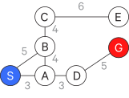
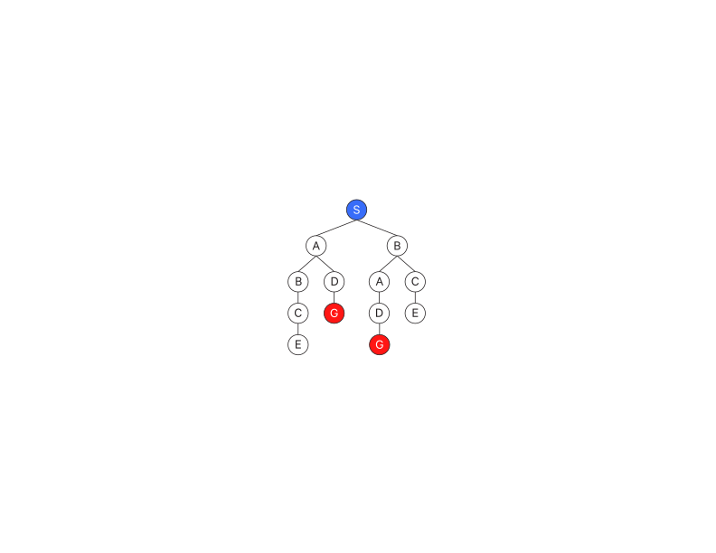
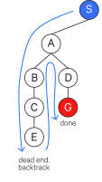
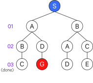
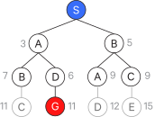
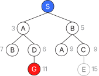
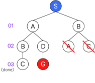
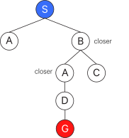
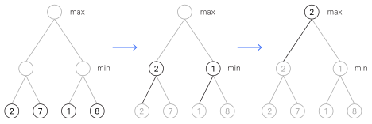
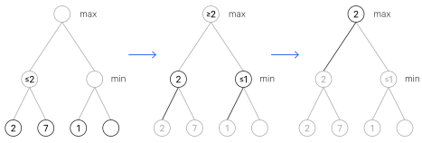

# Search

## State-space and situation-space representations

In artificial intelligence, problems are often represented using the __state-space__ representation (sometimes called a __state-transition system__), in which the possible states of the problem and the operations that move between them are represented as a graph or a tree:

- Nodes are (abstracted) world configurations (states)
- Arcs represent successors (action results)
- A goal test is a set of goal nodes (which may just include a single goal)
- Each state occurs only once as a node

More formally, we consider a problem to have a set of possible starting states $S$, a set of operators $F$ which can be applied to the states, and a set of goal states $G$. A solution to a problem formalized in this way, called a _procedure_, consists of a starting state $s \in S$ and a sequence of operators that define a path from $s$ to a state in $G$. Typically a problem is represented as a tuple of these values, $(S,F,G)$.

The distinction between state-space and __situation-space__ is as follows: if the relevant parts of the problem are __fully-specified__ (fully-known), then we work with _states_ and _operators_, and have a state-space problem. If there is missing information (i.e., the problem is __partially-specified__), then we work with _situations_ and _actions_ (note that operators are often referred to actions in state-space as well), and we have a situation-space problem. Most of what is said for state-space problems is applicable to situation-space problems.

For now we will focus on state-space problems.

This state-space model can be applied to itself, in such that a given problem can be decomposed into subproblems (also known as _subgoals_); the relationships between the problem and its subproblems (and their subproblems' subproblems, etc) are also represented as a graph. Successor relationships can be grouped by AND or OR arcs which group edges together. A problem node with subproblems linked by AND edges must have all of the grouped subproblems resolved; a problem with subproblems linked by OR edges must have only one of the subproblems resolved. Using this graph, you can identify a path of subproblems which can be used to solve the primary problem. This process is known as _problem reduction_.

We take this state-space representation as the basis for a search problem.

### Search problems (planning)

A search problem consists of:

- an __initial state__
- a set of possible _actions_/applicability conditions
  - a __successor function__: from a state to a set of (action, state)
  - the successor function plus the initial state is the _state space_ (which is a directed graph as described before)
  - a __path__ (i.e. a solution)
- a __goal__ (a goal state or a goal test function)
- a __path cost__ function (for optimality, generally it is the sum of the step costs)

To clarify some terminology:

- if node A leads to node B, then node A is a _parent_ of B and B is a __successor__ or _child_ of A
    - if the edge connecting A to B is due to an operator $q$, we say that "B is a successor to A under the operator $q$".
- if a node has no successors, it is a __terminal__
- if there is a path between node A and node C such that node A is a parent of a parent ... of a parent of C, then A is an _ancestor_ of C and C is a _descendant_ of A.
    - if the graph is cyclical, e.g. there is a path from A through C back to A, then A is both an ancestor and a descendant of C.

Practically, we may use a data structure for nodes that encapsulate the following information for the node:

- _state_ - a state in the state space
- _parent node_ - the immediate predecessor in the search tree (only the root node has no parent)
- _action_ - the action that, when performed in the parent node's state, leads to this node's state
- _path cost_ - the path cost leading to this node
- _depth_ - the depth of this node in the search tree

In the context of artificial intelligence, a path through state-space is called a _plan_ - search is fundamental to planning (other aspects of planning are covered in more detail later).

### Problem formulation

_Problem formulation_ can itself be a problem, as it typically is with real-world problems. We have to consider how granular/abstract we want to be and what actions and states to include. To make this a bit easier, we typically make the following assumptions about the environment:

- finite and discrete
- fully observable
- deterministic
- static (no events)

And other assumptions are typically included as well:

- restricted goals
- sequential plans (no parallel activity in plans)
- implicit time (activities do not have a duration)
- offline planning (the state transition system is not changing while we plan)

### Trees

In practice, we rarely build the full state-space graph in memory (because it is often way too big). Rather, we work with __trees__.

Trees have a few constraints:

- only one node does not have a parent: the __root node__.
- every other node in the tree is a descendant of the root node
- every other node has only one parent

An additional term relevant to trees is __depth__, which is the number of ancestors a node has.

The root node is the current state and branches out into possible future states (i.e. the children are successors).

Given a tree with branching factor $b$ and maximum depth $m$, there are $O(b^m)$ nodes in the tree. These trees can get quite big, so often we can't build the full tree either (it would be infinite if there are circular paths in the state space graph). Thus we only build sections that we are immediately concerned with.

To build out parts of the tree we are interested in, we take a node and apply a __successor function__ (sometimes called a __generator function__) to __expand__ the node, which gives us all of that node's successors (children).

There is also often a lot of repetition in search trees, which some search algorithm enhancements take advantage of.

## Search algorithms

We apply algorithms to this tree representation in order to identify paths (ideally the optimal path) from the root node (start state) to a goal node (a goal state, of which there may be many).

Most search algorithms share some common components:

- a __fringe__ (sometimes called a __frontier__) of unexplored nodes is maintained
- some process for deciding which nodes to expand

The __general tree search__ algorithm is as follows:

- initialize the fringe with a search node for the initial state
- iteratively:
  - if the fringe is empty, return a failure
  - otherwise, select a node from the fringe based on the current search strategy
  - if this node's state passes the goal test (or is the goal state), return the path to this node
  - otherwise, expand the fringe with this node's children (successors)

Most search algorithms are based on this general structure, varying in how they choose which node to expand from the fringe.

When considering search algorithms, we care about:

- _completeness_ - is it guaranteed to find a solution if one exists?
- _optimal_ - is it guaranteed to find the optimal solution, if one exists?
- _size complexity_ - how much space does the algorithm need? Basically, how big can the fringe get?
- _time complexity_ - how does runtime change with input size? Basically, how many nodes get expanded?

These search algorithms discussed here are _unidirectional_, since they only expand in one direction (from the start state down, or, in some cases, from the terminal nodes up). However, there are also _bidirectional_ search procedures which start from both the start state and from the goal state. They can be difficult to use, however.

## Uninformed search

__Uninformed__ search algorithms, sometimes called __blind__ search algorithms, vary in how they decide which node to expand.

Consider the following search space, where $S$ is our starting point and $G$ is our goal:

### Exhaustive ("British Museum") search

Exhaustively search all paths (without revisiting any previously visited points) - it doesn't really matter how you decide which node to expand because they will all be expanded.

### Depth-First Search (DFS)

- time complexity: expands $O(b^m)$ nodes (if $m$ is finite)
- size complexity: the fringe takes $O(bm)$ space
- complete if $m$ is not infinite (i.e. if there are no cycles)
- optimal: no, it finds the "leftmost" solution

Go down the left branch of the tree (by convention) until you can't go any further.

If that is not your target, then __backtrack__ - go up to the closest branching node and take the other leftmost path. _Backtracking_ is a technique that appears in almost every search algorithm, where we try extending a path, and if the extension fails or is otherwise unsatisfactory, we take a step back and try a different successor.

Repeat until you reach your target.

It stops just on the first complete path, which may not be the optimal path.

Another way to think about depth-first search is with a queue (LIFO) which holds your candidate paths as you construct them.

Your starting "path" includes just the starting point:

$$
[(S)]
$$

Then on each iteration, you take the left-most path (which is always the first in the queue) and check if it reaches your goal.

If it does not, you extend it to build new paths, and replace it with those new paths.

$$
[(SA),(SB)]
$$

On this next iteration, you again take the left-most path. It still does not reach your goal, so you extend it. And so on:

$$
\begin{aligned}
[(SAB),(SAD),(SB)] \\
[(SABC),(SAD),(SB)] \\
[(SABCE),(SAD),(SB)]
\end{aligned}
$$

You can no longer extend the left-most path, so just remove it from the queue.

$$
[(SAD),(SB)]
$$

Then keep going.

### Breadth-First Search (BFS)

- time complexity: expands $O(b^s)$ nodes, where $s$ is the depth of the shallowest solution
- size complexity: the fringe takes $O(b^s)$ space
- complete: yes
- optimal: yes, if all costs are 1, otherwise, a deeper path could have a cheaper cost

Build out the tree level-by-level until you reach your target.

In the queue representation, the only thing that is different from depth-first is that instead of placing new paths at the front of the queue, you place them at the back. Another way of putting this is that instead of a LIFO data structure for its fringe (as is used with DFS), BFS uses a FIFO data structure for its fringe.

### Uniform Cost Search

We can make breadth-first search sensitive to path cost with __uniform cost search__ (also known as _Dijkstra's algorithm_), in which we simply prioritize paths by their cost $g(n)$ (that is, the distance from the root node to $n$) rather than by their depth.

- time complexity: If we say the solution costs $C*$ and arcs cost at least $\epsilon$, then the "effective depth" is roughly $\frac{C*}{/epsilon}$, so the time complexity is $O(b^{C*/\epsilon})$
- size complexity: the fringe takes $O(b^{C*/\epsilon})$ space
- complete: yes if the best solution has finite cost and minimum arc cost is positive
- optimal: yes

### Branch & Bound

On each iteration, extend the shortest cumulative path. Once you reach your goal, extend every other extendible path to check that its length ends up being longer than your current path to the goal.

The fringe is kept sorted so that the shortest path is first.

This approach can be quite exhaustive, but it can be improved by using extended list filtering.

### Iterative deepening DFS

The general idea is to combine depth-first search's space advantage with breadth-first search's time/shallow-solution advantages.

- Run depth-first search with depth limit 1
- If no solution:
  - Run depth-first search with depth limit 2
  - If no solution:
    - Run depth-first search with depth limit 3

(etc)

## Search enhancements

### Extended list filtering

__Extended list filtering__ involves maintaining a list of visited nodes and only expanding nodes in the fringe if they have not already been expanded - it would be redundant to search again from that node.

For example, branch and bound search can be combined with extended list filtering to make it less exhaustive.

## Informed (heuristic) search

Informed search algorithms improve on uninformed search by incorporating __heuristics__ which tell us whether or not we're getting closer to the goal. With heuristics, we can search less of the search space.

In particular, we want __admissible__ heuristics, which is simply a heuristic that never overestimates the distance to the goal.

Formally, we can define the admissible heuristic as:

$$
H(x, G) \leq D(x, G)
$$

That is, a node is admissible if the estimated distance $H(x, G)$ between and node $x$ and the goal $G$ is less than or equal to the actual distance $D(x, G)$ between the node and the goal.

Note that sometimes inadmissible heuristics (i.e. those that sometimes overestimate the distance to the goal) can still be useful.

The specific heuristic function is chosen depending on the particular problem (i.e. we estimate the distance to the goal state differently in different problems, for instance, with a travel route, we might estimate the cost with linear distance to the target city).

The typical trade-off with heuristics is between simplicity/efficiency and accuracy.

The question of finding good heuristics, and doing so automatically, has been a big topic in AI planning recently.

### Greedy best-first search

__Best-first__ search algorithms are those that select the next node from the fringe by $\argmin_n f(n)$, where $f(n)$ is some evaluation function.

With __greedy best-first search__, the fringe is kept sorted by heuristic distance to the goal; that is, $f(n) = h(n)$.

This often ends up with a suboptimal path, however.

### Beam Search

Beam search is essentially breadth-first search, but we set a _beam width_ $w$ which is the limit to the number of paths you will consider at any level. This is typically a low number like 2, but can be iteratively expanded (similar to iterative deepening) if necessary.

The fringe is the same as in breadth-first search, but we keep only the $w$ best paths as determined by the heuristic distance.

Beam search is _not_ complete, unless the iterative approach is used.

### A\* Search

A\* is an extension of branch & bound search which includes (admissible) heuristic distances in its sorting.

We define $g(n)$ as the known distance from the root to the node $n$ (this is what we sort the fringe by in branch & bound search). We additionally define $h(n)$ as the admissible heuristic distance from the node $n$ to a goal node.

With A\* search, we simply sort the fringe by $g(n) + h(n)$. That is, A\* search is a best-first search algorithm where $f(n) = g(n) + h(n)$.

A\* search is optimal if $h(n)$ is _admissible_; that is, it never overestimates the distance to the goal. It is complete as well; i.e. if a solution exists, A\* will find it.

A\* is also _optimally efficient_ (with respect to the number of expanded nodes) for a given heuristic function. That is, no other optimal algorithm is guaranteed to expand fewer nodes than A\*.

Uniform cost search is a special case of A\* where $h(n) = 0$, i.e. $f(n) = g(n)$.

The downside of A\* vs greedy best-first search is that it can be slower since it explores the space more thoroughly - it has worst case time and space complexity of $O(B^l)$, where $b$ is the branching factor (the number of successors per node on average) and $l$ is the length of the path we're looking for.

Typically we are dealing with the worst case; the fringe usually grows exponentially. Sometimes the time complexity is permissible, but the space complexity is problematic because there may simply not be enough memory for some problems.

There is a variation of A\* called __iterative deepening A\*__ (IDA\*) which uses significantly less memory.

### Iterative Deepening A\* (IDA\*)

Iterative deepening A\* is an extension of A\* which uses an iterative approach, searching up to a distance $g(x)$ and increasing that distance until a solution is found.

## Local search

Local search algorithms do not maintain a fringe; that is, we don't keep track of unexplored alternatives. Rather, we continuously try to improve a single option until we can't improve it anymore.

Instead of extending a plan, the successor function in local search takes an existing plan and just modifies a part of it.

Local search is generally much faster and more memory efficient, but because it does not keep track of unexplored alternatives, it is incomplete and suboptimal.

### Hill-Climbing

A basic method in local search is __hill climbing__ - we choose a starting point, move to the best neighboring state (i.e. closest as determined by the heuristic), and repeat until there are no better positions to move to - we've reached the top of hill. As mentioned, this is incomplete and suboptimal, as it can end up in local maxima.

The difference between hill climbing and greedy search is that with greedy search, the entire fringe is sorted by heuristic distance to the goal. With hill climbing, we only sort the children of the currently expanded node, choosing the one closest to the goal.

### Other local search algorithms

You can also use _simulated annealing_ (detailed elsewhere) to try to escape local maxima - and this helps, and has a theoretical guarantee that it will converge to the optimal state given infinite time, but of course, this is not a practical guarantee for real-world applications. So simulated annealing in practice can do better but still can end up in local optima.

You can also use _genetic algorithms_ (detailed elsewhere).

## Graph search

Up until now we have considered search algorithms in the context of trees.

With search trees, we often end up with states repeated throughout the tree, which will have redundant subtrees, and thus end up doing (potentially a lot of) redundant computation.

Instead, we can consider the search space as a graph.

Graph search algorithms are typically just slight modifications of tree search algorithms. One main modification is the introduction of a list of __explored__ (or __expanded__) nodes, so that we only expand states which have not already expanded.

Completeness is not affected by graph search, but it is not optimal. We may close off a branch because we have already expanded that state elsewhere, but it's possible that the shortest path still goes through that state. Graph search algorithms (such as the graph search version of A\*) can be made optimal through an additional constraint to admissible heuristics: _consistency_.

### Consistent heuristics

The main idea of __consistency__ is that the estimated heuristic costs should be less than or equal to the actual costs for each arc between _any_ two nodes, not just between any node and the goal state:

$$
|H(x, G) - H(y, G)| \leq D(x,y)
$$

That is, the absolute value of the difference between the estimated distance between a node $x$ and the goal and the estimated distance between a node $y$ and the goal is less than or equal to the distance between the nodes $x$ and $y$.

Consistency enforces this for any two nodes, which includes the goal node, so consistency implies admissibility.

## Adversarial search (games)

__Adversarial search__ is essentially search for games involving two or more players.

There are many kinds of games - here we primarily consider games that are:

- deterministic (sometimes called "non-chance")
- two-player
- turn-based
- zero-sum: agents have opposite utilities (one's gain is another's loss), also known as a "pure competition" or "strictly competitive" game.
- perfect information: every player has full knowledge of what state the game is in and what actions are possible

Note that while we are only considering zero-sum games, in _general_ games agents have independent utilities, so there is opportunity for cooperation, indifference, competition, and so on.

One way of formulating of games (there are many) is as a tree:

- states $S$, starting with $s_0$
- players $P=\{1, \dots, n\}$, usually taking turns
- actions $A$ (may depend on player/state)
- transition function (analogous to a successor function), $S \times A \to S$
- terminal test (analogous to a goal test): $S \to \{t, f\}$
- terminal utility function (computes how much an end/terminal state is worth to each player): $S \times P \to R$. For example, we may assign a utility of 100 for terminal states where we win, and -100 for terminal states where we lose.

We want our adversarial search algorithm to return a __strategy__ (a __policy__) which is essentially a function which returns an action given a state. That is, a policy tells us what action take in a state - this is constrasted to a plan, which details a step-by-step procedure from start to finish. This is because we can't plan on opponents acting in a particular way, so we need a strategy to respond to their actions.

The solution then, for an adversarial search algorithm for a player is a policy $S \to A$.

### Minimax

In __minimax__, we start at the bottom of the tree (where we have utilities computed terminal nodes), moving upwards. We propagate the terminal utilities through the graph up to the root node, propagating the utility at each depth that satisfies a particular criteria.

For nodes at depths that correspond to the opponent's turns, we assume that the opponent chooses their best move (that is, we assume they are a perfect adversary), which means we propagate the _minimum_ utility for us.

For nodes at depths that correspond to our turn, we want to choose our best move; that is, we propagate the _maximum_ utility for us.

The propagated utility is known as the __backed-up evaluation__.

At the end, this gives us a utility for the root node, which gives us a value for the current state.

Minimax is just like exhaustive depth-first search, so its time complexity is $O(b^m)$ and space complexity is $O(bm)$.

Minimax is optimal against a perfect adversarial player (that is, an opponent that always takes their best action), but it is not otherwise.

#### Depth-limited minimax

Most interesting games have game trees far too deep to expand all the way to the terminal nodes.

Instead, we can use depth-limited search to only go down a few levels. However, since we don't reach the terminal nodes, their values never propagate up the tree. How will we compute the utility of any given move?

We can introduce an __evaluation function__ which computes a utility for non-terminal positions, i.e. it estimates the value of an action. For instance, with chess, you could just take the different of the number of your units vs the number of the opponent's units. Generally moves that lower your opponent's units is better, but not always.

#### Iterative deepening minimax

Often in games there are some time constraints - for instance, the computer opponent should respond within a reasonable amount of time.

Iterative deepening can be applied to minimax, running for a set amount of time, and return the best policy found thus far.

This type of algorithm is called an __anytime algorithm__ because it has an answer ready at anytime.

#### Generalizing minimax

If the game is not zero-sum or has multiple players, we can generalize minimax as such:

- terminal nodes have utility _tuples_
- node values are also utility tuples
- each player maximizes their own component

This can model cooperation and competition dynamically.

### Alpha-Beta

We can further improve minimax by _pruning_ the game tree; i.e. removing branches we know won't be worthwhile. This variation is known as __alpha-beta__ search.

Here we can look at branching and figure out a bound for describing its score.

First we look at the left-most branch and see the value 2 in its left-most terminal node. Since we are looking for the min here, we know that the score for this branch node will be at most 2. If we then look at the other terminal node, we see that it is 7 and we know the branch node's score is 2.

At this point we can apply a similar logic to the next node up (where we are looking for the max). We know that it will be at least 2.

So then we look at the next branch node and see that it will be at most 1. We don't have to look at the very last terminal node because now we know that the max node can only be 2. So we have saved ourselves a little trouble.

In larger trees this approach becomes very valuable, since you are effectively discounting entire branches and saving a lot of unnecessary computation. This allows you to compute deeper trees.

Note that with alpha-beta, the minimax value computed for the root is always correct, but the values of intermediate nodes may be wrong, and as such, (naive) alpha-beta is not great for action selection. Good ordering of child nodes improves upon this. With a "perfect ordering", time complexity drops to $O(b^{m/2})$.

#### Ordering

Generally you want to generate game trees so that successors to each node are ordered left-to-right in descending order of their eventual backed-up evaluations (such an ordering is called the "correct" ordering). Naturally, it is quite difficult to generate this ordering before these evaluations have been computed.

Thus a _plausible_ ordering must suffice. These are a few techniques for generating plausible orderings of nodes:

- __Generators__ first produce the most immediately desirable choices (though without regard to possible consequences further on)
- __Shallow search__ first generates some of the tree and then uses some static evaluation function and compute backed-up evaluations upwards to order the results.
- __Dynamic generation__, in which alpha-beta is applied to identify plausible branches of the game tree, then branch is evaluated which can cause the ordering to change.

## Non-deterministic search

In many situations the outcomes of actions are uncertain. Another way of phrasing is that actions may be _noisy_.

Like adversarial search, non-deterministic search solutions take the form of policies.

### Expectimax search

We can model uncertainty as a "dumb" adversary in a game.

Whereas in minimax we assume a "smart" adversary, and thus consider worst-case outcomes (i.e. that the opponent plays their best move), with non-deterministic search, we instead consider average-case outcomes (i.e. expected utilities). This is called __expectimax__ search.

So instead of minimax's min nodes, we have "chance" nodes, though we still keep max nodes. For a chance node, we compute its expected utility as the weighted (by probability) average of its children.

Because we take the weighted average of children for a chance node's utility, we cannot use alpha-beta pruning as we could with minimax. There could conceivably be an unexplored child which increases the expected utility enough to make that move ideal, so we have to explore all child nodes to be sure.

#### Expectiminimax

We can have games that involve adversaries _and_ chance, in which case we would have both minimax layers and expectimax layers. This approach is called __expectiminimax__.

### Monte Carlo Tree Search

Say you are at some arbitrary position in your search tree (it could be the start or somewhere further along). You can treat the problem of what node to move to next as a multi-armed bandit problem and apply the __Monte Carlo search__ technique.

#### Multi-armed bandit

Say you have multiple options with uncertain payouts. You want to maximize your overall payout, and it seems the most prudent strategy would be to identify the one option which consistently yields better payouts than the other options.

However - how do you identify the best option, and do so quickly?

This problem is known as the __multi-armed bandit__ problem, and a common strategy is based on upper confidence bounds (UCB).

To start, you randomly try the options and compute confidence intervals for each options' payout:

$$
\bar x_i \pm \sqrt{\frac{2\ln(n)}{n_i}}
$$

where:

- $\bar x_i$ is the mean payout for option $i$
- $n_i$ is the number of times option $i$ was chosen
- $n$ is the total number of trials

You take the upper bound of these confidence intervals and continue to choose the option with the highest upper bound. As you use this option more, it's confidence interval will narrow (since you have collected more data on it), and eventually another option's confidence interval upper bound will be higher, at which point you switch to that option.

#### Monte Carlo Tree Search

At first, you have no statistical information about the child nodes to compute confidence intervals. So you randomly choose a child and run Monte Carlo simulations down that branch to see the outcomes.

For each simulation run, you go along each node in the branch that was walked and increment its play count (i.e. number of trials) by 1, and if the outcome is a win, you increment its win count by 1 as well (this explanation assumes a game, but is generalizes to other cases).

You repeat this until you have enough statistics for the direct child nodes of your current position to make a UCB choice as to where to move next.

You will need to run less simulations over time because you accumulate these statistics for the search tree.

##### First-Play Urgency (FPU)

A variation of MCTS where fixed scores are assigned to unvisited nodes.

### Markov Decision Processes (MDPs)

MDPs are another way of modeling non-deterministic search.

MDPs are essentially Markov models, but there's a choice of action.

In MDPs, there may be two types of rewards (which can be positive or negative):

- terminal rewards (i.e. those that come at the end, these aren't always present)
- "living" rewards, which are given for each step (these are always present)

For instance, you could imagine a maze arranged on a grid. The desired end of the maze has a positive terminal reward and a dead end of the maze has a negative terminal reward. Every non-terminal position in the maze also has a reward ("living" rewards) associated with it. Often these living rewards are negative so that each step is penalized, thus encouraging the agent to find the desired end in as few steps as possible.

The agent doesn't have complete knowledge of the maze so every action has an uncertain outcome. It can try to move north - sometimes it will successfully do so, but sometimes it will hit a wall and remain in its current position. Sometimes our agent may even move in the wrong direction (e.g. maybe a wheel gets messed up or something).

This kind of scenario can be modeled as a Markov Decision Process, which includes:

- a set of states $s \in S$
- a set of actions $a \in A$
- a transition function $T(s,a,s')$, sometimes called a __state transition matrix__
  - gives the probability that $a$ from $s$ leads to $s'$, i.e. $P(s'|s,a)$
  - also called the "model" or the "dynamics"
- a reward function $R(s,a,s')$ (sometimes just $R(s)$ or $R(s')$), sometimes called a _utility function_, which associates a reward (or penalty) with each state
- a discount $\gamma$
- a start state
- maybe a terminal state

MDPs, as non-deterministic search problems, can be solved with expectimax search.

MDPs are so named because we make the assumption that action outcomes depend only on the current state (i.e. the Markov assumption).

The solution of an MDP is an optimal _policy_ $\pi* : S \to A$:

- gives us an action to take for each state
- an optimal policy maximizes expected utility if followed
- an explicit policy defines a reflex agent

In contrast, expectimax does not give us entire policies. Rather, it gives us an action for a single state only. It's similar to a policy, but requires re-computing at each step. Sometimes this is fine because a problem may be too complicated to compute an entire policy anyways.

The objective MDP is to maximize the expected sum of all future rewards, i.e.

$$
\max(E[\sum_{t=0}^{\infty} R_t])
$$

Sometimes a __discount factor__ $\gamma \in [0,1]$ is included, e.g. $\gamma=0.9$, which decays future reward:

$$
\max(E[\sum_{t=0}^{\infty} \gamma^t R_t])
$$

Using this, we can define a __value function__ $V(s)$ for each state:

$$
V^{\pi}(s) = E[\sum_{t=0} \gamma^t R_t | s_0 = s]
$$

That is, it is the expected sum of future discounted reward provided we start in state $s$ with policy $\pi$.

This can be computed empirically via simulations. In particular, we can use the __value iteration__ algorithm.

With value iteration, we recursively calculate the value function, starting from the goal states, to get the optimal value function, from which we can derive the optimal policy.

More formally - we want to recursively estimate the value $V(s)$ of a state $s$. We do this by estimating the value of possible successor states $s'$, discounting by $\gamma$, and incorporating the reward/cost of the state $R(s')$, across possible actions from $s$. We take the maximum of these estimates.

$$
V(s) = \max_a [\gamma \sum_{s'} P(s'|s,a) V(s')] + R(s)
$$

This method is called _back-up_.

In terminal states, we just set $V(s) = R(s)$.

We estimate these values over all our states - these estimates eventually converge.

This function essentially defines the optimal policy - that is:

$$
\pi(s) = \argmax_a \sum_{s'} P(s' | s,a) V(s')
$$

(since it's maximization we can drop $\gamma$ and $R(s)$)

#### Example: Grid World

Note that the X square is a wall. Every movement has an uncertain outcome, e.g. if the agent moves to the east, it may only successfully do so with an 80% chance.

For $R(s) = -0.01$:

|   | A | B | C | D  |
|---|---|---|---|----|
| 0 | → | → | → | +1 |
| 1 | ↑ | X | ← | -1 |
| 2 | ↑ | ← | ← | ↓  |

At C1 the agent plays very conservatively and moves in the opposite direction of the negative terminal position because it can afford doing so many times until it accidentally randomly moves to another position.

Similar reasoning is behind the policy at D2.

For $R(s) = -0.03$:

|   | A | B | C | D  |
|---|---|---|---|----|
| 0 | → | → | → | +1 |
| 1 | ↑ | X | ↑ | -1 |
| 2 | ↑ | ← | ← | ←  |

With a stronger step penalty, the agent finds it better to take a risk and move upwards at C1, since it's too expensive to play conservatively.

Similar reasoning is behind the change in policy at D2.

For $R(s) = -2$:

|   | A | B | C | D  |
|---|---|---|---|----|
| 0 | → | → | → | +1 |
| 1 | ↑ | X | → | -1 |
| 2 | → | → | → | ↑  |

With such a large movement penalty, the agent decides it's better to "commit suicide" by diving into the negative terminal node and end the game as soon as possible.

#### q-states

Each MDP state projects an expectimax-like search tree; that is, we build a search tree from the current state detailing what actions can be taken and the possible outcomes for each action.

We can describe actions and states together as a __q-state__ $(s,a)$. When you're in a state $s$ and you take an action $a$, you end up in this _q-state_ (i.e. you are committed to action $a$ in state $s$) and the resolution of this q-state is described by the _transition_ $(s,a,s')$, described by the probability which is given by transition function $T(s,a,s')$. There is also a reward associated with a transition, $R(s,a,s')$, which may be positive or negative.

#### Utility sequences

How should we encode preferences for _sequences_ of utilities? For example, should the agent prefer the reward sequence $[0,0,1]$ or $[1,0,0]$? It's reasonable to prefer rewards closer in time, e.g. to prefer $[1,0,0]$ over $[0,0,1]$.

We can model this by _discounting_, that is, _decaying_ reward value exponentially. If a reward is worth 1 now, it is worth $\gamma$ one step later, and worth $\gamma^2$ two steps later ($\gamma$ is called the "discount" or "decay rate").

__Stationary preferences__ are those which are invariant to the inclusion of another reward which delays the others in time, i.e.:

$$
[a_1, a_2, \dots] \succ [b_1, b_2, \dots] \Leftrightarrow [r, a_1, a_2, \dots] \succ [r, b_1, b_2, \dots]
$$

Nonstationary preferences are possible, e.g. if the delay of a reward changes its value relative to other rewards (maybe it takes a greater penalty for some reason).

With stationary preferences, there are only two ways to define utilities:

- Additive utility: $U([r_0, r_1, r_2, \dots]) = r_0 + r_1 + r_2 + \dots$
- Discounted utility: $U([r_0, r_1, r_2, \dots]) = r_0 + \gamma r_1 + \gamma^2 r_2 + \dots$

Note that additive utility is just discounted utility where $\gamma = 1$.

For now we will assume stationary preferences.

If a game lasts forever, do we have infinite rewards? Infinite rewards makes it difficult to come up with a good policy.

We can specify a finite horizon (like depth-limited search) and just consider only up to some fixed number of steps. This gives us nonstationary policies, since $\pi$ depends on the time left.

Alternatively, we can just use discounting, where $0 < \gamma < 1$:

$$
U([r_0, \dots, r_{\infty}]) = \sum_{t=0}^{\infty} \gamma^t r_t \leq \frac{R_{\max}}{1 - \gamma}
$$

A smaller $\gamma$ means a shorter-term focus (a smaller _horizon_).

Another way is to use an __absorbing state__. That is, we guarantee that for every policy, a terminal state will eventually be reached.

Usually we use discounting.

#### Solving MDPs

We say that the value (utility) of a state $s$ is $V^*(s)$, which is the expected utility of starting in $s$ and acting optimally. This is equivalent to running expectimax from $s$.

While a reward is for a state in a single time step, a value is the expected utility over all paths from that state.

The value (utility) of a q-state $(s,a)$ is $Q^*(s,a)$, called a __Q-value__, which is the expected utility starting out taking action $a$ from state $s$ and subsequently acting optimally. This is equivalent to running expectimax from the chance node that follows from $s$ when taking action $a$.

The optimal policy $\pi*(s)$ gives us the optimal action from a state $s$.

So the main objective is to compute (expectimax) values for the states, since this gives us the expected utility (i.e. average sum of discounted rewards) under optimal action.

More concretely, we can define value recursively:

$$
\begin{aligned}
V^*(s) &= \max_a Q^*(s,a) \\
Q^*(s,a) &= \sum_{s'} T(s,a,s') [R(s,a,s') + \gamma V^*(s')]
\end{aligned}
$$

These are the __Bellman equations__.

They can be more compactly written as:

$$
V^*(s) = \max_a \sum_{s'} T(s,a,s') [R(s,a,s') + \gamma V^*(s')]
$$

Again, because these trees can go on infinitely (or may just be very deep), we want to limit how far we search (that is, how far we do this recursive computation). We can specify _time-limited values_, i.e. define $V_k(s)$ to be the optimal value of $s$ if the game ends in $k$ more time steps. This is equivalent to depth-$k$ expectimax from $s$.

To clarify, $k=0$ is the _bottom_ of the tree, that is, $k=0$ is the _last_ time step (since there are 0 more steps to the end).

We can use this with the _value iteration_ algorithm to efficiently compute these $V_k(s)$ values in our tree:

- start with $V_0(s) = 0$ (i.e. with no time steps left, we have an expected reward sum of zero). Note that this is a zero vector over all states.
- given a vector of $V_k(s)$ values, do one ply of expectimax from each state:

$$
V_{k+1}(s) = \max_a \sum_{s'} T(s,a,s') [R(s,a,s') + \gamma V_k(s')]
$$

Note that since we are starting at the last time step $k=0$ and moving up, when we compute $V_{k+1}(s)$ we have already computed $V_k(s')$, so this saves us extra computation.

Then we simply repeat until convergence. This converges if the discount is less than 1.

With the value iteration algorithm, each iteration has complexity $O(S^2 A)$. There's no penalty for depth here, but the more states you have, the slower this gets.

The approximations get refined towards optimal values the deeper you go into the tree. However, the policy may converge long before the values do - so while you may not have a close approximation of values, the policy/strategy they convey early on may already be optimal.

#### Partially-Observable MDPs (POMDPs)

__Partially-observed MDPs__ are MDPs in which the states are not (fully) observed. They include _observations_ $O$ and an __observation function__ $P(o|s)$ (sometimes notated $O(s,o)$; it gives a probability for an observation given a state).

When we take an action, we get an observation which puts us in a new _belief_ state (a distribution of possible states).

Partially-observable environments may require information-gathering actions in addition to goal-oriented actions. Such information-gathering actions may require detours from goals but may be worth it in the long run. See the section on reinforcement learning for more.

With POMDPs the state space becomes very large because there are many (infinite) probability distributions over a set of states.

As a result, you can't really run value iteration on POMDPs, but you can use approximate Q-learning (see the section on reinforcement learning) or a truncated (limited lookahead) expectimax approach to approximate the value of actions.

In general, however, POMDPs are very hard/expensive to solve.

### Decision Networks

Decision networks are a generalization of Bayes' networks. Some nodes are random variables (these are essentially embedded Bayes' networks), some nodes are __action variables__, in which a decision is made, and some nodes are utility functions, which computes a utility for its parent nodes.

For instance, an action node could be "bring (or don't bring) an umbrella", and a random variable node could be "it is/isn't raining". These nodes may feed into a utility node which computes a utility based on the values of these nodes. For instance, if it is raining and we don't bring an umbrella, we will have a very low utility, compared to when it isn't raining and we don't bring an umbrella, for which we will have a high utility.

We want to choose actions that maximize the expected utility given observed evidence.

The general process for action selection is:

- instantiate all evidence
- set action node(s) each possible way
- calculate the posterior for all parents of the utility node, given the evidence
- calculated the expected utility for each action
- choose the maximizing action (it will vary depending on the observed evidence)

This is quite similar to expectimax/MDPs, except now we can incorporate evidence we observe.

](assets/decision_network.png)

#### Value of information

More evidence helps, but typically there is a cost to acquiring it. We can quantify the value of acquiring evidence as the _value of information_ to determine whether or not it is more evidence is worth the cost. We can compute this with a decision network.

The value of information is simply the expected gain in the maximum expected utility given the new evidence.

For example, say someone hides 100 dollars behind one of two doors, and if we can correctly guess which door it is behind, we get the money.

There is a 0.5 chance that the money is behind either door.

In this scenario, we can use the following decision network:

$$
\begin{aligned}
\text{choose door} \to U \\
\text{money door} \to U
\end{aligned}
$$

Where $\text{choose door}$ is the action variable, $\text{money door}$ is the random variable, and $U$ is the utility node.

The utility function at $U$ is as follows:

| choose door | money door | utility |
|-------------|------------|---------|
| a           | a          | 100     |
| a           | b          | 0       |
| b           | a          | 0       |
| b           | b          | 100     |

In this current scenario, our maximum expected utility is 50. That is, choosing either door $a$ or $b$ gives us $100 \times 0.5 = 50$ expected utility.

How valuable is knowing which door the money is behind?

We can consider that if we know which door the money is behind, our maximum expected utility becomes 100, so we can quantify the value of that information as $100-50=50$, which is what we'd be willing to pay for that information.

In this scenario, we get _perfect information_, because we observe the evidence "perfectly" (that is, our friend tells us the truth and there's no chance that we misheard them).

More formally, the value of perfect information of evidence $E'$, given existing evidence $e$ (of which there might be none), is:

$$
\text{VPI}(E'|e) = (\sum_{e'} P(e'|e) \text{MEU}(e, e')) - \text{MEU}(e)
$$

Properties of VPI:

- nonnegative: $\forall E', e: \text{VPI}(E'|e) \geq 0$, i.e. is not possible for $\text{VPI}$ to be negative (proof not shown)
- nonadditive: $\text{VPI}(E_j, E_k|e) \neq \text{VPI}(E_j|e) + \text{VPI}(E_k|e)$ (e.g. consider observing the same evidence twice - no more information is added)
- order-independent: $\text{VPI}(E_j,E_k|e) = \text{VPI}(E_j|e) + \text{VPI}(E_k|e,E_j) = \text{VPI}(E_k|e) + \text{VPI}(E_j|e,E_k)$

Also: generally, if the parents of the utility node is conditionally independent of another node $Z$ given the current evidence $e$, then $\text{VPI}(Z | e) = 0$. Evidence has to affect the utility node's parents to actually affect the utility.

What's the value of _imperfect_ information? Well, we just say that "imperfect" information is perfect information of a noisy version of the variable in question.

For example, say we have a "light level" random variable that we observe through a sensor. Sensors always have some noise, so we add an additional random variable to the decision network (connected to the light level random variable) which corresponds to the sensor's light level measurement. Thus the sensor's observations are "perfect" in the context of the sensor random variable, because they are exactly what the sensor observed, though technically they are noisy in the context of the light level random variable.

## Policies

### Policy evaluation

How do we evaluate policies?

We can compute the values under a fixed policy. That is, we construct a tree based on the policy (it is a much simpler tree because for any given state, we only have one action - the action the policy says to take from that state), and then compute values from that tree.

More specifically, we compute the value of applying a policy $\pi$ from a state $s$:

$$
V^{\pi}(s) = \sum_{s'} T(s, \pi(s), s') [R(s, \pi(s), s') + \gamma V^{\pi}(s')]
$$

Again, since we only have one action to choose from, the $\max_a$ term has been removed.

We can use an approach similar to value iteration to compute these values, i.e.

$$
\begin{aligned}
V_0^{\pi}(s) &= 0 \\
V_{k+1}^{\pi}(s) &= \sum_{s'} T(s, \pi(s), s') [R(s, \pi(s), s') + \gamma V_k^{\pi}(s')]
\end{aligned}
$$

This approach is sometimes called _simple value iteration_ since we've dropped $\max_a$.

This has complexity $O(S^2)$ per iteration.

### Policy extraction

__Policy extraction__ is the problem opposite to policy evaluation - that is, given values, how do we extract the policy which yields these values?

Say we have optimal values $V^*(s)$. We can extract the optimal policy $\pi^*(s)$ like so:

$$
\pi^*(s) = \argmax_a \sum_{s'} T(s,a,s') [R(s,a,s') + \gamma V^*(s')]
$$

That is, we do one step of expectimax.

What if we have optimal Q-values instead?

With Q-values, it is trivial to extract the policy, since the hard work is already capture by the Q-value:

$$
\pi^*(s) = \argmax_a Q^*(s,a)
$$

### Policy iteration

Value iteration is quite slow - $O(S^2 A)$ per iteration. However, you may notice that the maximum value calculated for each state rarely changes. The result of this is that the policy often converges long before the values.

__Policy iteration__ is another way of solving MDPs (an alternative to value iteration) in which we start with a given policy and improve on it iteratively:

- First, we evaluate the policy (calculate utilities for the given policy until the utilities converge).
- Then we update the policy using one-step look-ahead (one-step expectimax) with the resulting converged utilities as the future (given) values (i.e. policy extraction).
- Repeat until the policy converges.

Policy iteration is optimal and, under some conditions, can converge must faster.

More formally:

Evaluation: iterate values until convergence:

$$
V_{k+1}^{\pi_i}(s) = \sum_{s'} T(s, \pi_k(s), s') [R(s, \pi_k(s), s') + \gamma V_k^{\pi_i}(s')]
$$

Improvement: compute the new policy with one-step lookahead:

$$
\pi_{i+1}(s) = \argmax_a \sum_{s'} T(s,a,s') [R(s,a,s') + \gamma V^{\pi_i} (s')]
$$

Policy iteration and value iteration are two ways of solving MDPs, and they are quite similar - they are just variations of Bellman updates that use one-step lookahead expectimax.

## Constraint satisfaction problems (CSPs)

Search as presented thusfar has been concerned with producing a plan or a policy describing how to act to achieve some goal state. However, there are search problems in which the aim is to identify the goal states themselves - such problems are called __identification problems__.

In __constraint satisfaction problems__, we want to identify states which statisfy a set of constraints.

We have a set of variables $X_i$, with values from a domain $D$ (sometimes the domain varies according to $i$, e.g. $X_1$ may have a different domain than $X_2$). We __assign__ each variable $X_i$ with a value from its corresponding domain, each unique assignment of these variables (which may be partial, i.e. some may be unassigned) is a state.

We want to satisfy a set of __constraints__ on what combinations of values are allowed on different subsets of variables. So we want to identify states which satisfy these constraints; that is, we want to identify variable assignments that satisfy the constraints.

Constraints can be specified using a formal language, e.g. code that $A \neq B$ or something like that.

We can represent constraints as a graph.

In a binary CSP, each constraint relates at most two variables. We can construct a binary constraint graph in which the nodes are variables, and arcs show constraints. We don't need to specify what the constraints are.

If we have constraints that are more than binary (that is, they relate more than just two variables), we can represent the constraints as square nodes in the graph and link them to the variables they relate (as opposed to representing constraints as the arcs themselves).

General-purpose CSP algorithms use this graph structure for faster search.

### Varieties of CSPs

Variables may be:

- discrete, and come from
  - finite domains
  - infinite domains (integers, strings, etc)
- continuous

Constraints may be:

- unary (involve a single variable, this is essentially reducing a domain, e.g. $A \neq \text{green}$)
- binary (involve a pair of variables)
- higher-order (involve three or more variables)

We may also have _preferences_, i.e. soft constraints. We can represent these as costs for each variable assignment. This gives us a _constraint optimization problem_.

### Search formulation

We can formulate CSPs as search problems using search trees or search graphs (in the context of CSPs, they are called __constraint graphs__).

States are defined by the values assigned so far (partial assignments).

The initial state is the empty assignment, $\{\}$.

Successor functions assign a value to an unassigned variable (one at a time).

The goal test is to check if the current assignment is complete (all variables have values) and satisfies all constraints.

Breadth-first search does not work well here because all the solutions will be at the bottom of the search tree (all variables must have values assigned, and that happens only at the bottom).

Depth-first search does a little better, but it is very naive - it can make a mistake early on in its path, but not realize it until reaching the end of a branch.

The main shortcoming with these approaches is that we aren't checking constraints until it's far too late.

### Backtracking search

Backtracking search is the basic uninformed search algorithm for solving CSPs. It is a simple augmentation of depth-first search.

Rather than checking the constraint satisfaction at the very end of a branch, we check constraints as we go, i.e. we only try values that do not conflict with previous assignments. This is called an __incremental goal test__.

Furthermore, we only consider one variable at a time in some order. Variable assignments are commutative (i.e. the order in which we assign them doesn't matter, e.g. $A=1$ and then $B=2$ leads to the same variable assignment as $B=2$ then $A=1$). So at one level, we consider assignments for $A$, at the next, for $B$, and so on.

The moment we violate a constraint, we backtrack and try different a variable assignment.

Simple backtracking can be improved in a few ways:

- ordering
  - we can be smarter about in what order we assign variables
  - we can be smarter about what we try for the next value for a variable
- filtering: we can detect failure earlier
- structure: we can exploit the problem structure

Backtracking pseudocode:

    def backtracking(csp):
        def backtracing_recursive(assignment):
            if is_complete(assignment):
                return assignment
            var = select_unassigned_variable(csp.variables, assignment)
            for val in csp.order_domain_values(var, assignment):
                if is_consistent_with_constraints(val, assignment, csp.constraints):
                    assignment[var] = val
                    result = backtracking_recursive(assignment)
                    if result is not None: # if not a failure
                        return result
                    else: # otherwise, remove the assignment
                        del assignment[var]
            return None # failure

#### Filtering

Filtering looks ahead to eliminate incompatible variable assignments early on.

With __forward checking__, when we assign a new variable, we look ahead and eliminate values for other variables that we know will be incompatible with this new assignment. So when we reach that variable, we only have to check values we know will not violate a constraint (that is, we only have to consider a subset of the variable's domain).

If we reach an empty domain for a variable, we know to backup.

With __constraint propagation__ methods, we can check for failure ahead of time.

One constraint propagation method is __arc consistency__ (AC3).

First, we must consider the _consistency_ of an arc (here, in the context of binary constraints, but this can be extended to higher-order constraints). In the context of filtering, an arc $X \to Y$ is _consistent_ if and only if for _every_ $x$ in the tail there is _some_ $y$ in the head which could be assigned without violating a constraint.

An inconsistent arc can be made consistent by deleting values from its tail; that is, by deleting tail values which lead to constraint-violating head values.

Note that since arcs are directional, a consistency relationship (edge) must be checked in both directions.

We can re-frame forward checking as just enforcing consistency of arcs pointing to each new assignment.

A simple form of constraint propagation is to ensure all arcs in the CSP graph are consistent. Basically, we visit each arc, check if its consistent, if not, delete values from its tail until it is consistent. If we encounter an empty domain (that is, we've deleted all values from its tail), then we know we have failed.

Note that if a value is deleted from a tail of a node, its incoming arcs must be-rechecked.

We combine this with backtracking search by applying this filtering after each new variable assignment. It's extra work at each step, but it should save us backtracking.

Arc consistency (AC3) pseudocode:

    function AC3(csp):
        queue = csp.all_arcs()
        while queue:
            from_node, to_node = queue.pop()
            if remove_inconsistent_values(from_node, to_node):
                for node in neighbors(from_node):
                    queue.append((node, from_node))
        return csp

    function remove_inconsistent_values(from_node, to_node):
        removed = False
        for x in domain[from_node]:
            if no value y in domain[to_node] allows (x,y) to satisfy the constraint from_node <-> to_node:
                domain[from_node].remove(x)
                removed = True
        return removed

Arc consistency can be generalized to $k$-consistency:

- 1-consistency is _node consistency_, i.e. each node's domain has a value which satisfies its own unary constraints.
- 2-consistency is arc consistency: for each pair of nodes, any consistent assignment to one can be extended to the other ("extended" meaning from the tail to the head).
- $k$-consistency: for each $k$ nodes, any consistent assignment to $k-1$ can be extended to the $k$th node.
  - 3-consistency is called _path consistency_

Naturally, a higher $k$ consistency is more expensive to compute.

We can extend this further with _strong_ $k$-consistency which means that all lower orders of consistency (i.e. $k-1$ consistency, $k-2$ consistency, etc) are also satisfied. With strong $k$-consistency, no backtracking is necessary - but in practice, it's never practical to compute.

#### Ordering

One method for selecting the next variable to assign to is called __minimum remaining values__ (MRV), in which we choose the variable with the fewest legal values left in its domain (hence this is sometimes called _most constrained variable_). We know this number if we are running forward checking. Essentially we decide to try the hardest variables first so if we fail, we fail early on and thus have to do less backtracking (for this reason, this is sometimes called _fail-fast ordering_).

For choosing the next value to try, a common method is __least constraining value__. That is, we try the value that gives us the most options later on. We may have to re-run filtering to determine what the least constraining value is.

#### Problem Structure

Sometimes there are features of the problem structure that we can use to our advantage.

For example, we may have independent subproblems (that is, we may have multiple connected components; i.e. isolated subgraphs), in which case we can divide-and-conquer.

In practice, however, you almost never see independent subproblems.

##### Tree-Structured CSPs

Some CSPs have a tree structure (i.e. have no loops). Tree-structured CSPs can be solved in $O(nd^2)$ time, much better than the $O(d^n)$ for general CSPs.

The algorithm for solving tree-structured CSPs is as follows:

1. For order in a tree-structured CSP, we first choose a root variable, then order variables such that parents precede children.
2. Backward pass: starting from the end moving backwards, we visit each arc once (the arc pointing from parent to child) and make it consistent.
3. Forward assignment: starting from the root and moving forward, we assign each variable so that it is consistent with its parent.

This method has some nice properties:

- after the backward pass, all root-to-leaf arcs are consistent
- if root-to-leaf arcs are consistent, the forward assignment will not backtrack

Unfortunately, in practice you don't typically encounter tree-structured CSPs.

Rather, we can improve an existing CSPs structure so that it is _nearly_ tree-structured.

Sometimes there are just a few variables which prevent the CSP from having a tree structure.

With __cutset conditioning__, we assign values to these variables such that the rest of the graph is a tree.

This, for example, turns binary constraints into unary constraints, e.g. if we have a constraint $A \neq B$ and we fix $B = \text{green}$, then we can rewrite that constraint as simply $A \neq \text{green}$.

Cutset conditioning with a cutset size $c$ gives runtime $O(d^c (n-c) d^2)$, so it is fast for a small $c$.

More specifically, the cutset conditioning algorithm:

1. choose a cutset (the variables to set values for)
2. instantiate the cutset in all possible ways (e.g. produce a graph for each possible combination of values for the cutset)
3. for each instantiation, compute the _residual_ (tree-structured) CSP by removing the cutset constraints and replacing them with simpler constraints (e.g. replace binary constraints with unary constraints as demonstrated above)
4. solve the residual CSPs

Unfortunately, finding the smallest cutset is an NP-hard problem.

There are other methods for improving the CSP structure, such as _tree decomposition_.

Tree decomposition involves creating "mega-variables" which represent subproblems of the original problem, such that the graph of these mega-variables has a tree structure. For each of these mega-variables we consider valid combinations of assignments to its variables.

These subproblems must overlap in the right way (the _running intersection property_) in order to ensure consistent solutions.

### Iterative improvement algorithms for CSPs

Rather than building solutions step-by-step, iterative algorithms start with an incorrect solution and try to fix it.

Such algorithms are _local search_ methods in that they work with "complete" states (that is, all variables are assigned, though constraints may be violated/unsatisfied), and there is no fringe.

Then we have operators which reassign variable values.

A very simple iterative algorithm:

- while not solved
  - randomly select any conflicted variable
  - select a value which violates the fewest constraints (the _min-conflicts_ heuristic), i.e. hill climb with $h(n) = \text{num. of violated constraints}$

In practice, this min-conflicts approach tends to perform quickly for randomly-generated CSPs; that is, there are some particular CSPs which are very hard for it, but for the most part, it can perform in almost constant time for arbitrarily difficult randomly-generated CSPs.

Though, again, unfortunately many real-world CSPs fall in this difficult domain.

## Online Evolution

Multi-action adversarial games (assuming turn-based) are tricky because they have enormous branching factors. The problem is no longer what the best single action is for a turn - now we need to find the best _sequence_ of actions to take. An evolutionary algorithm can be applied to select these actions in a method called _online evolution_ because the agent doesn't not learn in advance (offline learning), rather, it learns the best moves while it plays.

Online evolution evolves the actions in a single turn and uses an estimation of the state at the end of the turn as a fitness function. This is essentially a single iteration of _rolling horizon evolution_, a method that evolves a sequence of actions and evolves new action sequences as those actions are executed. In its application here, we have a horizon of just one turn.

An individual (to be evolved) in this context is a candidate sequence of actions for the turn. A basic genetic algorithm can be applied. The fitness function can include rollouts, e.g. to a depth of one extra turn, to incorporate how an opponent might counter move, but it may not help performance.

## References

- [Introduction to Monte Carlo Tree Search](http://jeffbradberry.com/posts/2015/09/intro-to-monte-carlo-tree-search/). Jeff Bradberry.
- [MIT 6.034 (Fall 2010): Artificial Intelligence](http://ocw.mit.edu/courses/electrical-engineering-and-computer-science/6-034-artificial-intelligence-fall-2010/). Patrick H. Winston. MIT.
- Introduction to Artificial Intelligence (2nd ed). Philip C. Jackson, Jr. 1985.
- [Integrating Learning in a Multi-Scale Agent](http://alumni.soe.ucsc.edu/~bweber/bweber-dissertation.pdf). Ben G. Weber. 2012.
- [Planning Algorithms](http://planning.cs.uiuc.edu/booka4.pdf). Steven M. LaValle. 2006.
- [Artificial Intelligence Planning](https://www.coursera.org/course/aiplan). Dr. Gerhard Wickler, Prof. Austin Tate. The University of Edinburgh (Coursera). 2015.
- [Intro to Artificial Intelligence](https://www.udacity.com/course/intro-to-artificial-intelligence--cs271). CS271. Peter Norvig, Sebastian Thrun. Udacity.
- Logical Foundations of Artificial Intelligence (1987) (Chapter 12: Planning)
- [CS188: Artificial Intelligence](https://www.edx.org/course/artificial-intelligence-uc-berkeleyx-cs188-1x). Dan Klein, Pieter Abbeel. University of California, Berkeley (edX).
- [Artificial Intelligence: Foundations of Computational Agents](http://artint.info/index.html). David Poole, Alan Mackworth.
- _Algorithmic Puzzles_. Anany Levitin, Maria Levitin. 2011.
- [A way to deal with enormous branching factors](http://togelius.blogspot.com/2016/03/a-way-to-deal-with-enormous-branching.html?m=1). Julian Togelius. March 25, 2016.
- [Online Evolution for Multi-Action Adversarial Games](http://julian.togelius.com/Justesen2016Online.pdf). Niels Justesen, Tobias Mahlmann, Julian Togelius.
