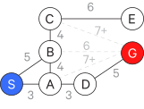
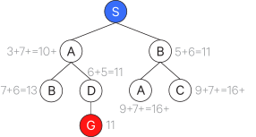
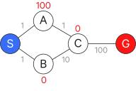
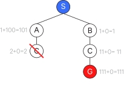

# Search

## Depth-First, Hill Climbing, Beam

Consider the following search space, where $S$ is our starting point and $G$ is our goal:

You can illustrate paths in your search problem using a tree.

### "British Museum" search

Exhaustively search all paths (without revisiting any previously visited points).

### Depth-First Search

Go down the left branch of the tree (by convention) until you can't go any further.

If that is not your target, then _backtrack_ - go up to the closest branching node and take the other leftmost path.

Repeat until you reach your target.

It stops just on the first complete path, which may not be the optimal path.

Another way to think about depth-first search is with a _queue_ which holds your candidate paths as you construct them.

Your starting "path" includes just the starting point:

$$
[(S)]
$$

Then on each iteration, you take the left-most path (which is always the first in the queue) and check if it reaches your goal.

If it does not, you extend it to build new paths, and replace it with those new paths.

$$
[(SA),(SB)]
$$

On this next iteration, you again take the left-most path. It still does not reach your goal, so you extend it. And so on:

$$
\begin{aligned}
[(SAB),(SAD),(SB)] \\
[(SABC),(SAD),(SB)] \\
[(SABCE),(SAD),(SB)]
\end{aligned}
$$

You can no longer extend the left-most path, so just remove it from the queue.

$$
[(SAD),(SB)]
$$

Then keep going.

### Breadth-First Search

Build out the tree level-by-level until you reach your target.

In the queue representation, the only thing that is different from depth-first is that instead of placing new paths at the front of the queue, you place them at the back.

#### Breadth-first with extended list filtering

We can modify the queue algorithm to only extend the first path on the queue if its final node has not yet been extended. That is, if we are extending a node, and its final node has already been extended in some other path, we ignore the rest of that path - it would be redundant to re-build a path from that node. This is called using an _extended list_.

You can apply this same filtering technique to depth-first search as well.

### Hill-Climbing Search

Hill-climbing is similar to depth-first search, but rather than just sticking to the left-most path, at any branching point you select the node which is closest to your goal.

In this case of the example this isn't the optimal path (that is, hill-climbing can get stuck in local maxima), but it is possible for hill-climbing to find the optimal path. There isn't any backtracking in hill-climbing.

The queue representation is the same as depth-first search, but you sort your queue by distance to the goal.

Note that _distance_ here is the _heuristic distance_, also called _airline distance_, which is the straight and direct distance between two points ("as the crow flies").

### Beam Search

Beam search is similar to breadth-first search. You set a _beam width_ $w$ which is the limit to the number of paths you will consider at any level. This is typically a low number like 2.

Then you proceed like a beam search and look at which $w$ nodes in the new level get you closest (in terms of heuristic distance) to your goal.

The queue representation is the same as breadth-first search, but you only keep the $w$ best paths.

## Optimal, Branch, and Bound

### Branch & Bound Search and the A\* algorithm

On each iteration, extend the shortest cumulative path. Once you reach your goal, extend every other extendible path to check that its length ends up being longer than your current path to the goal.

In the queue representation, you would test the first path to see if it reaches the goal, if not, then extend the first path and sort by its path length, shortest at the front.

This approach can be quite exhaustive, but it can be improved.

We can augment branch & bound by using an extended list, in which we extend the first path and sort by path length only if its last node has not already been extended elsewhere. This prevents redundant traversing of already-traversed paths.

We can use airline distances in combination with the cumulative distance thus far in order to calculate the lower bound for the complete path (if one exists). That is because the airline distance is the straight line from the current node to the goal; that is, it is the shortest possible distance to the goal. However, it is not certain if there exists a path from the current node to the goal. This technique is called the _admissible heuristic_.

When we combine the extended list and the admissible heuristic with branch and bound, we get the _A* algorithm_.

The algorithm is slightly different:

- Initialize the queue
- Test the shortest path (rather than the first path, as we did previously)
- Extend the shortest path

Thus far we have been working with maps. But search is not restricted to maps. The admissible heuristic falls apart in certain problems. Consider the following non-euclidean graph:

The airline distances from a node to the goal are marked in red.

Here if we use the admissible heuristic, we end up taking the path $SBCG$. When we do our checking phase to try the path starting with $SA$, we end up at $C$ and stop there because we have already checked $C$. Thus we miss out on the optimal path.

Formally, we can define the admissible heuristic as:

$$
H(x, G) \leq D(x, G)
$$

That is, a node is admissible if the estimated distance $H(x, G)$ between and node $x$ and the goal $G$ is less than or equal to the actual distance $D(x, G)$ between the node and the goal.

We can set a stronger condition for the previous non-euclidean example. This condition is called _consistency_:

$$
|H(x, G) - H(y, G)| \leq D(x,y)
$$

That is, the absolute value of the difference between the estimated distance between a node $x$ and the goal and the estimated distance between a node $y$ and the goal is less than or equal to the distance between the nodes $x$ and $y$.

## Games, Minimax, and Alpha-Beta

Games (like chess) are useful for modeling some aspects of intelligence.

There are a few ways you could design a chess-playing program.

You could use if-then rules but these are limited for games as complex as chess.

You could take the _look ahead_ approach look at the next possible board states. You'd take various features of the chessboard, $f_1, f_2, \dots, f_n$ and pass them into a _static function_, $s = g(f_1, f_2, \dots, f_n)$, typically a linear polynomial (e.g. $c_1f_1, c_2f_2, \dots, c_nf_n$), so called "static" because it only considers a static state of the board. It is also called a _linear scoring polynomial_ because it is used to assign some value to some board state. Then at a given step you can pick the move which leads to the highest-scoring board state.

You could evaluate a tree of all possible outcomes from the current state. The number of possibilities considered at each level is called the _branching factor_ $b$, the number of levels considered is the _depth_ $d$. The total number of terminal nodes (possible outcomes) is just $b^d$. For chess there typically is a branching factor of 10 and a depth of 120 to consider, which is a very large number ($10^120$), far too large to compute.

You could instead just do look ahead but go a few steps further, computing the scores for the leaf nodes using a static function, then selecting a branch path using the _minimax_ approach.

In the minimax approach you start at the bottom of the tree (where you have your scored leaf nodes). You compute the scores of the (branch) nodes the next level up by selecting the _minimum_ of each of their children. Then you compute the scores for the nodes the next level up by selecting the _maximum_ of each of their children. You continue alternating in this way up the tree.

Ideally there would be a way to apply minimax without having to exhaustively consider all branches or compute all static values at the leaf nodes. And there is - it is the _alpha-beta_ algorithm, which is an augmentation of minimax.

Here we can look at branching and figure out a bound for describing its score.

First we look at the left-most branch and see the value 2 in its left-most leaf node. Since we are looking for the min here, we know that the score for this branch node will be at most 2. If we then look at the other leaf node, we see that it is 7 and we know the branch node's score is 2.

At this point we can apply a similar logic to the next node up (where we are looking for the max). We know that it will be at least 2.

So then we look at the next branch node and see that it will be at most 1. We don't have to look at the very last leaf node because now we know that the max node can only be 2. So we have saved ourselves a little trouble.

In larger trees this approach becomes very valuable, since you are effectively discounting entire branches and saving a lot of unnecessary computation. This allows you to compute deeper trees.

You may want an "insurance policy" for time-sensitive minimax searches. Say you want to compute down to depth $d$ but don't have enough time - well you could just fall back to the result calculated from the depth $d-1$ (or whatever depth that has been reached by the time an answer is needed).  This is called _progressive deepening_ (or _iterative deepening_). This type of algorithm is called an _anytime algorithm_ because it has an answer ready at anytime.

In these examples, the trees have been developed _evenly_, that is, each branch goes down to the same depth. But it doesn't have to be that way - there may be situations in games where you want to expand a certain branch to a further depth - this is called _uneven tree development_ and was an additional feature of Deep Blue.

As effective this strategy is at playing chess, this is not how human chess players play chess - they develop pattern recognition repertoires in which they can recognize game board states and decide how to move based on that.

## Constraints: Search, Domain Reduction

_Constraint propagation_ is a method in which constraints eliminate possible choices, thus reducing a search space. For example, the possible values for $x$ are $\\{1,2,3,4\\}$ but I know the constraint $x > 2$. Thus I have reduced my search space to $\\{3,4\\}$.

Some vocabulary:

- a variable $v$ is something that can have assignment
- a value $x$ is something that can be assigned (e.g. is a label)
- a domain $D$ is a bad of values
- a constraint $C$ is a limit on variable values

The general algorithm is as follows:

- For each depth-first search assignment
    - For each variable $v_i$ considered\*
        - For each $x_i$ in $D_i$
            - For each constraint $C(x_i, x_j)$ where $x_j \in D_j$
            - If $\nexists x_j \mid C(x_i, x_j)$ is satisfied, remove $x_i$ from $D_i$
            - If $D_i$ empty, backup

\* There are a number of ways to define which variables are considered:

1. consider nothing (which defeats the point of the constraints, since you aren't checking that they are satisfied)
2. consider only the assigned variable
3. consider neighbors
4. propagate checking through variables whose domains have shrunk to a single value (that is, check neighbors if the variable's domain has been reduced to a single value, and repeat as necessary, that is, if those neighbors' domains have all been reduced to a single value, keep going, etc) (works well)
5. propagate checking through variables whose domains have been reduced by any amount
6. consider all variables (too much work)

You can also change the order in which you consider variables - if you consider the most constrained variables first, ordinary depth-first search will work, but you might as well combine these approaches.

## Monte Carlo Tree Search

An alternative to minimax is __Monte Carlo Tree Search__, which does not require exhaustively considering all branches.

### Multi-armed bandit

Say you have multiple options with uncertain payouts. You want to maximize your overall payout, and it seems the most prudent strategy would be to identify the one option which consistently yields better payouts than the other options.

However - how do you identify the best option, and do so quickly?

This problem is known as the _multi-armed bandit_ problem, and a common strategy is based on upper confidence bounds (UCB).

To start, you randomly try the options and compute confidence intervals for each options' payout:

$$
\bar x_i \pm \sqrt{\frac{2\ln(n)}{n_i}}
$$

where:

- $\bar x_i$ is the mean payout for option $i$
- $n_i$ is the number of times option $i$ was chosen
- $n$ is the total number of trials

You take the upper bound of these confidence intervals and continue to choose the option with the highest upper bound. As you use this option more, it's confidence interval will narrow (since you have collected more data on it), and eventually another option's confidence interval upper bound will be higher, at which point you switch to that option.

### Monte Carlo

Say you are at some arbitrary position in your search tree (it could be the start or somewhere further along). You can treat the problem of what node to move to next as a multi-armed bandit problem.

At first, you have no statistical information about the child nodes to compute confidence intervals. So you randomly choose a child and run Monte Carlo simulations down that branch to see the outcomes.

For each simulation run, you go along each node in the branch that was walked and increment its play count (i.e. number of trials) by 1, and if the outcome is a win, you increment its win count by 1 as well

You repeat this until you have enough statistics for the direct child nodes of your current position to make a UCB choice as to where to move next.

You will need to run less simulations over time because you accumulate these statistics for the search tree.

## References

- MIT 6.034 (Fall 2010): Artificial Intelligence. Patrick H. Winston.
- <http://jeffbradberry.com/posts/2015/09/intro-to-monte-carlo-tree-search/?utm_campaign=Data%2BElixir&utm_medium=email&utm_source=Data_Elixir_53>
