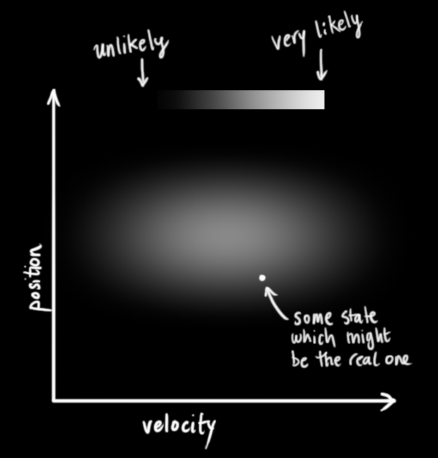
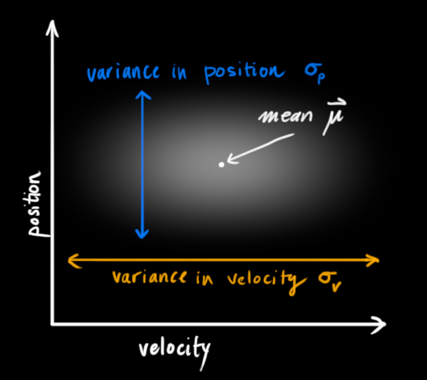
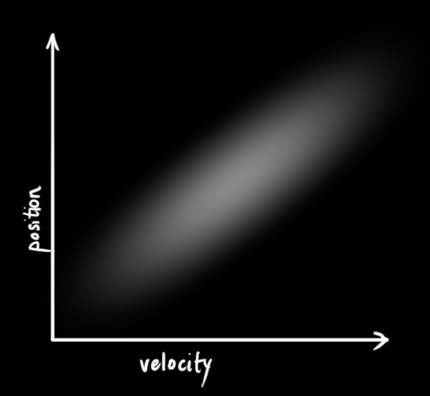
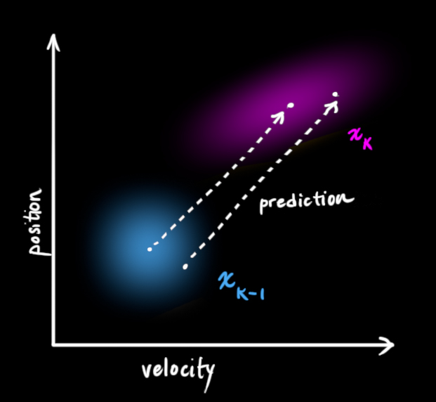
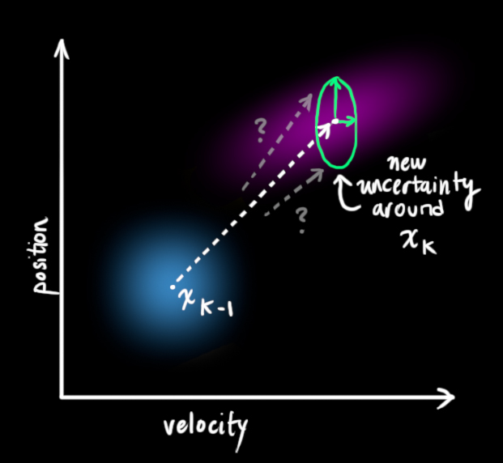
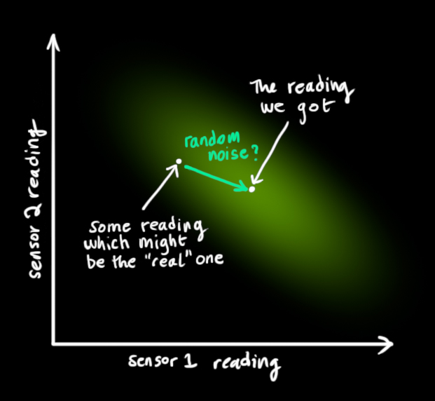
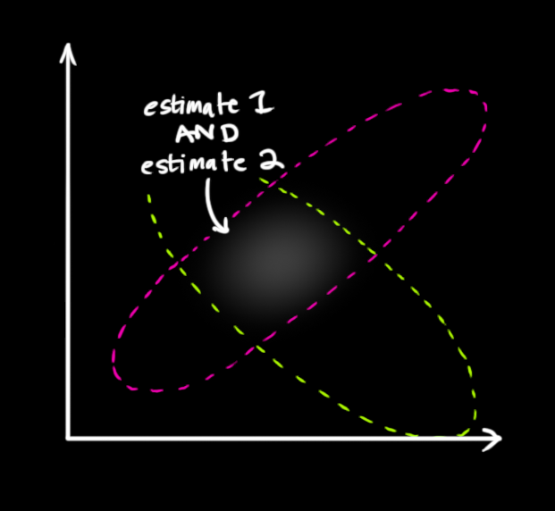
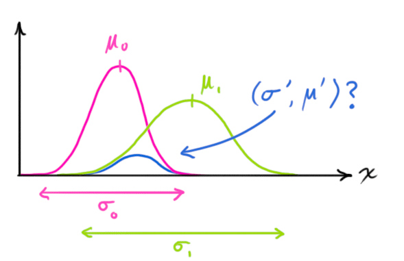

# Uncertainty

## Kalman Filters

_Kalman filters_ can provide an estimate for the current state of a system and from that, provide an estimate about the next state of the system.

We have some random variables about the current state (in the example below, they are position $p$ and velocity $v$); we can generalize this as a random variable vector $S$. We are uncertain about the current state but they can be expressed as Gaussian distributions, parameterized by a mean value and a variance (which reflects the uncertainty).

These random variables may be uncorrelated, as they are above (knowing the state of one tells us nothing about the other), or they may be correlated like below.

This correlation is described by a covariance matrix, $\mathbf{\Sigma}$, where the element $\sigma_{ij}$ describes the correlation between the $i$th and $j$th random variables. Covariance matrices are symmetric.

We say the current state is at time $t-1$, so the random variables describing it is notated $S_{t-1}$, and the next state (which we want to predict) is time $t$, so the random variables we predict then are notated $S_t$

The Kalman filter basically takes the random variable distributions for the current state and gives us new random variable distributions for the next state:

In essence it moves each possible point for the current state to a new predicted point.

We then have to come up with some function for making the prediction. In the example of position $p$ and velocity $v$, we can just use $p_t = p_{t-1} + \Delta t v_{t-1}$ to update the position and assume the velocity is kept constant, i.e. $v_t = v_{t-1}$.

We can represent these functions collectively as a matrix applied to the state vector:

$$
\begin{aligned}
S_t &= \begin{bmatrix}
1 & \Delta t \\
0 & 1
\end{bmatrix} S_{t-1} \\
&= F_t S_{t-1}
\end{aligned}
$$

We call this matrix $F_t$ our _prediction matrix_. With this, we can transform the means of each random variable (we notate the vector of these means at $\hat S_{t-1}$ since these means are our best estimates) to the predict means in the next state, $\hat S_{t}$.

We can similarly apply the prediction matrix to determine the covariance at time $t$, using the property $Cov(Ax) = A \Sigma A^T$, so that:

$$
\Sigma_t = F_t \Sigma_{t-1} F_t^T
$$

It's possible we also want to model external influences on the system. In the position and velocity example, perhaps some acceleration is being applied. We can capture these external influences in a vector $u_t$, which is called the _control vector_.

For the position and velocity example, this control vector would just have acceleration $a$, i.e. $u_t = [a]$. We then need to update your prediction functions for each random variable in $S$ to incorporate it, i.e. $p_t = p_{t-1} + \Delta t v_{t-1} + \frac{1}{2} \Delta t^2 a$ and $v_t = v_{t-1} + a \Delta t$.

Again, we can pull out the coefficients for the control vector terms into a matrix. For this example, it would be:

$$
U_t = \begin{bmatrix} \frac{\Delta t^2}{2} \\ \Delta t \end{bmatrix}
$$

This matrix is called the _control matrix_, which we'll notate as $U_t$.

We can then update our prediction function:

$$
S_t = F_t S_{t-1} + U_t u_t
$$

These control terms capture external influences we are certain about, but we also want to model external influences we are uncertain about. To model this, instead of moving each point from the distributions of $S_{t-1}$ _exactly_ to where the prediction function says it should go, we also describe these new predicted points as Gaussian distributions with covariance matrices $Q_t$.

We can incorporate the uncertainty modeled by $Q_t$ by including it when we update the predicted covariance at time $t$:

$$
\Sigma_t = F_t \Sigma_{t-1} F_t^T + Q_t
$$

Now consider that we have sensors which measure the current state for us, though there is some measurement error (noise). We can model these sensors with the matrix $H_t$ (which would include measured values for each of our state random variables) and incorporate them:

$$
\begin{aligned}
\mu_{\text{expected}} &= \mathbf{H}_t \mathbf{\hat{S}}_t \\
\mathbf{\Sigma}_{\text{expected}} &= \mathbf{H}_t \mathbf{P}_t \mathbf{H}_t^T
\end{aligned}
$$

This gives us the final equation for our predicted state values.

Now say we've come to the next state and we get in new sensor values. This allows us to observe the new state (with some noise/uncertainty) and combine it to our predicted state values to get a more accurate estimate of the new current state.

The readings we get for our state random variables (e.g. position and velocity) are represented by a vector $z_t$, and the uncertainty/noise (covariance) in these measurements is described by the covariance matrix $R_t$. Basically, these sensors are also described as Gaussian distributions, where the values the sensor gave us, $z_t$, is considered the vector of the means for each random variable.

We are left with two Gaussians - one describing the sensor readings and their uncertainty, and another describing the predicted values and their uncertainty. We can multiply the distributions to get their overlap, which describes the space of values likely for both distributions.

The resulting overlap is, yet again, also a Gaussian distribution with its own mean and covariance matrix.

We can compute this new mean and covariance from the two distributions that formed it.

First, consider the product of two 1D Gaussian distributions:

$$
\mathcal{N}(x, \mu_0, \sigma_0) \cdot \mathcal{N}(x, \mu_1, \sigma_1) \stackrel{?}{=} \mathcal{N}(x, \mu’, \sigma’)
$$

As a reminder, the Gaussian distribution is formalized as:

$$
\mathcal{N}(x, \mu,\sigma) = \frac{1}{ \sigma \sqrt{ 2\pi } } e^{ -\frac{ (x – \mu)^2 }{ 2\sigma^2 } }
$$

We can solve for both $\mu’$ and $\sigma’^2$ to get:

$$
\begin{aligned}
\mu’ &= \mu_0 + \frac{\sigma_0^2 (\mu_1 – \mu_0)} {\sigma_0^2 + \sigma_1^2} \\
\sigma’^2 &= \sigma_0^2 – \frac{\sigma_0^4} {\sigma_0^2 + \sigma_1^2}
\end{aligned}
$$

To make this more readable, we can factor out $k$, such that:

$$
\begin{aligned}
k &= \frac{\sigma_0^2}{\sigma_0^2 + \sigma_1^2} \\
\mu’ &= \mu_0 + k(\mu_1 - \mu_0) \\
\sigma’^2 &= \sigma_0^2 - k \sigma_0^2
\end{aligned}
$$

In dimensions higher than 1, we can re-write the above with matrices ($\mu$ are now vectors here):

$$
\begin{aligned}
K &= \frac{\Sigma_0^2}{\Sigma_0^2 + \Sigma_1^2} \\
\mu’ &= \mu_0 + K(\mu_1 - \mu_0) \\
\Sigma’^2 &= \Sigma_0^2 - K \Sigma_0^2
\end{aligned}
$$

This matrix $K$ is the _Kalman gain_.

So we have the two following distributions:

- The predicted state: $\mu_0, \Sigma_0 = (H_t S_t, H_t \Sigma_t H_t^T)$
- The observed state: $\mu_1, \Sigma_1 = (z_t, R_t)$

And using the above, we compute their overlap to get a new best estimate:

$$
\begin{aligned}
H_t \hat S_t’ &= H_t \hat S_t + K(z_t - H_t \hat S_t) \\
H_t \Sigma’_t H_t^T &= H_t \Sigma_t H_t^T - K H_t \Sigma_t H_t^T \\
K &= \frac{H_t \Sigma_t H_t^T}{H_t \Sigma_t H_t^T + R_t}
\end{aligned}
$$

Simplifying a bit, we get:

$$
\begin{aligned}
\hat S_t’ &= \hat S_t + K’(z_t - H_t \hat S_t) \\
\Sigma’_t &= \Sigma_t - K’ H_t \Sigma_t \\
K &= \frac{\Sigma_t H_t^T}{H_t \Sigma_t H_t^T + R_t}
\end{aligned}
$$

Which are the equations for the update step, which gives us the new best estimate $\hat \Sigma’$.

Kalman filters work for modeling linear systems; for nonlinear systems you instead need to use the extended Kalman filter.

## References

- How a Kalman filter works, in pictures. August 11, 2015. <http://www.bzarg.com/p/how-a-kalman-filter-works-in-pictures/> (all images above sourced from here)
