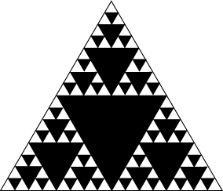
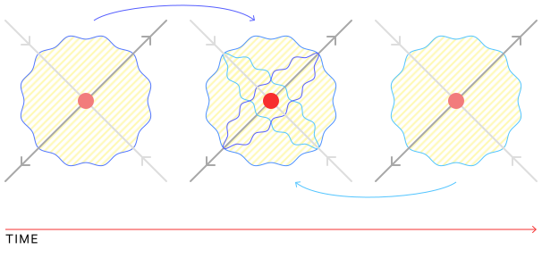

# Nonlinear Dynamics

Two approaches to science:

- mathematical, defined by equations, using proofs ("classical" models).
  - typically deterministic
  - generally involve many simplifying assumptions
  - uses linear approximations to model non-linear systems
- computational-based, typically defined by simple rules, using simulations ("complex" models)
  - often stochastic
  - often also involve simplifying assumptions, but less
  - deals better with non-linear systems

(Chapter 1 of [_Think Complexity_](http://www.greenteapress.com/compmod/) provides a good overview of these two approaches).

Some systems may be very hard to accurately model, even though they may be deterministic.

Complex behavior arises from deterministic nonlinear dynamic systems and exhibit two special properties:

- sensitive dependence on initial conditions
- characteristic structure

Most nonlinear dynamic systems are chaotic, and nonlinear dynamic systems constitute most of the dynamic systems we encounter. In general, systems involving flows (heat, fluid, etc) demonstrate nonlinear dynamics, but they also show up in classical mechanics (e.g. the three-body problem, the double-jointed pendulum).

The equations that describe chaotic systems can't be solved analytically - they are solved with computers instead.

## Maps

__Maps__ describe systems that operate in discrete time intervals.

In particular, a map is a mathematical operator that advances the system one time step (i.e. the next step). We describe them using a __difference equation__ (not to be confused with differential equations, which come up later):

$$
x_{n+1} = f(x_n)
$$

Where $f$ is the map and $x_i$ is the state of the system at time step $i$.

The states (i.e. each of $x_0, x_1, \dots$, also called _iterates_) of a map may converge to a __fixed point__ where they no longer change as the map is further applied (i.e. it is invariant to the dynamics of the system), which is notated as $x^*$.

There are different kinds of fixed points:

- __attracting__ fixed points, which the system tends towards when perturbed (stable)
- __unstable__ fixed points, in which the dynamics are stationary, but the system is not "naturally drawn" to (they are __repelling__). If they are perturbed from this point, they do not settle back into it.

For example, if you drop the double pendulum, eventually it settles to a stationary position:

```
_____
  |
  |
  0
```

This is an attracting fixed point.

There are other fixed points in this system. For example:

```
  0
  |
  |
__|__
```

That is, the pendulum could be balanced on top, in which it would remain stationary, but easily disturbed, and this is not one that the system would settle into.

The time steps leading to a fixed point is called the __transient__.

The sequence of iterates is called an __orbit__ or a __trajectory__ of the dynamical system.

The first state $x_0$ is the __initial condition__.

A common map is the __logistic map__, $L(x_n)$ (often used to model populations):

$$
x_{n+1} = r x_n (1-x_n)
$$

It includes a parameter $r \in (0,4)$ and $x \in (0,1)$.

__Attractors__ are the states that remain after the transient dies out (i.e. after the system "settles"). Attracting fixed points are one kind of attractor, but there are also periodic (oscillating) and chaotic (strange) attractors.

A __basin of attraction__ is the set of initial conditions which eventually converge on the same attractor.

One attractor is the (fixed) __periodic orbit__ (also called a __limit cycle__) which is just a sequence of iterates that repeats indefinitely. A particular cycle may be referred to as an $n$-cycle, where $n$ refers to the period of the cycle, i.e. the number of time steps that the cycle repeats over.

### Bifurcations

A __bifurcation__ refers to a qualitative change in the topology of an attractor. For example, in the logistic map, one value of $r$ may give a fixed point attractor, but changing it to another value may change it to a (fixed) periodic orbit attractor (here $r$ would be called a __bifurcation parameter__). Note that "qualitative" change means it changes the _kind_ of attractor, i.e. if changing $r$ just shifts the fixed point, that is _not_ a bifurcation.

For example, with the logistic map: when $r=3.6$, we have a chaotic attractor (also known as a __strange attractor__), when $r=3.1$ we have a periodic attractor, and when $r=2$ we have a fixed point attractor.

### Return maps

Often (1D/scalar) maps are plotted as a __time domain plot__, in which the horizontal axis is time $n$ and the vertical axis is the state value $x_n$.

Another way of plotting them is using the (first) __return map__, also known as a __correlation plot__ or a __cobweb diagram__, in which the horizontal axis is $x_n$ and the vertical axis is $x_{n+1}$. This is known as the _first_ return map because we correlate $x_n$ with $x_{n+1}$. A _second_ return map, for example, would correlate $x_n$ with $x_{n+2}$.

On a return map, we also often include the line $x_{n+1} = x_n$, which is the line on which any fixed points must lie (by definition).

](assets/cobwebplot.png)

### Bifurcation diagrams

A __bifurcation diagram__ has as its horizontal axis $r$ (i.e. from the logistic map) and has $x_n$ as its vertical axis. We also remove the transient from the front of the trajectory (knowing how remove the transient, i.e. how many points to throw away, takes a bit of trial-and-error). That way we only see the points the system settles on for any given value of $r$ (if indeed it settles).

So for each value of $r$ that leads to a fixed point attractor, there is only one value of $x_n$ For each value of $r$ that leads to periodic attractors, we may have two or a few of $x_n$. For each value of $r$ that leads to chaotic attractors, we will have many, many values of $x_n$.

](assets/bifurcation.png)

When looking at a bifurcation diagram, you may notice some interesting structures. In particular, you may notice that some periodic attractors bifurcate into period attractors of double the cycle (e.g. a 2-cycle period that turns into a 4-cycle period at some value of $r$). This is called a __period-doubling cascade__.

You may also notice "dark veils" (they can look like thin lines cutting through) in the chaotic parts of the bifurcation diagram - they are the result of __unstable periodic orbits__.

The bifurcation diagram can also be a __fractal__ object in that it can contain copies of itself within itself. For example, you can "zoom in" on the diagram and find its own structure repeated at smaller levels.

Note that many, but not all, chaotic systems have a fractal state-space structure.

### Feigenbaum number

If you look at the parts between bifurcations (the "pitchforks") in a bifurcation diagram, you may notice that their widths and heights decrease at a constant ratio.

](assets/feigenbaum.png)

If we take $\Delta_i$ to be the width of a bifurcation $i$, we can frame this as (for widths) $\frac{\Delta_2}{\Delta_1} = \frac{\Delta_3}{\Delta_2}$. We can look at the limit of this as $n \to \infty$ to figure out this ratio. For the logistic map:

$$
\lim_{n \to \infty} \frac{\Delta_n}{\Delta_{n+1}} = 4.66
$$

This value is called the __Feigenbaum number__, and it holds (as 4.66) for any 1D map with a quadratic maximum (i.e. it looks like a parabola near its maximum).

For the heights of these pitchforks there's a different value that's computed in a similar way.

### Sensitive to initial conditions

One way of describing maps' property of sensitivity to initial conditions is that they bring far points close together and cause close together points to be pushed far away from each other.

One analogy is the kneading of dough. As you knead dough, parts that were close together end up far apart, and parts that were far apart end up close together (although if we consider the kneading as a continuous process, technically, this is a flow, but we can imagine it as discrete time steps).

## Flows

__Flows__ describe systems that operate in continuous time (e.g. the double-jointed pendulum). They are modeled using __differential equations__ rather than difference equations.

All the concepts that apply to maps also apply to flows.

In the double-jointed pendulum, the state has four components: the angle of the top joint $\theta_1$, the angle of the lower joint $\theta_2$, the angular velocity of the top joint $\omega_1$, and the angular velocity of the lower joint $\omega_2$.

A system without any friction (more generally, friction is known as __dissipation__) is called a __conservative system__ or a __Hamiltonian system__ or a __non-dissipative system__. These systems do not have attracting fixed points because there is nothing to cause the transient to die out. They do, however, still have fixed points - just not attracting ones - and they still have chaos - just not chaotic attractors.

Conversely, __dissipative__ systems are those that have attractors.

### Ordinary differential equations

An ODE expresses relationships between derivatives of an unknown function.

For example:

$$
\frac{d}{dt} x(t) = 1
$$

The unknown function here is $x(t)$ and the derivative is wrt to time $t$.

To solve this, we know that the derivative of $x(t)$ is equal to 1, so we ask - what $x(t)$ - that is, what set of functions - would make this true? Here, $x(t)$ can be any function of time that has a slope of 1, i.e. $x(t) = t + C$.

Another example: say we have the ODE $x''(t) = -x(t)$ and the _initial conditions_ $x(t=0) = 1$. This is asking: what function is the negative of its own second derivative? This could be $\sin$ or $\cos$. The initial condition restricts this to $\cos$ because only $\cos(0) = 1$.

This is an analytic solution (closed-form, i.e. can be written out finitely). In most case, we will not be solving ODEs analytically, but numerically. This is because ODEs that can be solved analytically are, by definition, not chaotic.

ODEs may be _linear_, which have the form of a sum of "constant times variable" terms, e.g. $y = ax + b$, where $a,b$ are constants and $y,x$ are variables. or ODEs may be _nonlinear_, which involve powers of the variables, products of variables, or transcendental functions involving the variables.

Note that nonlinearity is a necessary condition for chaos. If the ODE is nonlinear, it's possible there may not be an analytic solution - this property is known as _nonintegrability_, and it is a necessary and sufficient condition for chaos. They must be solved numerically.

Technically, "nonintegrability" only applies to Hamiltonian systems, but here we will use it as a shorthand for "has no analytic solution" more generally.

With flows we can think of fixed points in terms of a "dynamics landscape", i.e. the topography of the system. We can think of stable fixed points as some kind of "bowl" that values "roll down". In contrast, an unstable fixed point could be either an upside-down bowl or a saddle.

Sidebar on some linear algebra: matrices can be applied to transform space, i.e. for rotations, scaling, translations, etc. A matrix of eigenvectors allows us to express the fundamental features of a landscape. A point that starts on an eigenvector stays on that eigenvector ("eigen" means "same"). An eigenvalue tells you how fast a state travels along an eigenvector and in what direction - specifically, the movement is exponential: $e^{st}$, where $s$ is the eigenvalue. Each eigenvalue is associated with an eigenvector.

Say we have two crossing eigenvectors, one of which is associated with eigenvalue $s_1$ and one associated with eigenvalue $s_2$. Both $s_1, s_2$ are negative, which means that $e^{st}$ shrinks, meaning that both eigenvectors "point" inwards (note that the fixed point is marked with `*`):

         s_1
         |
         v
         |
    --->-*-<---s_2
         |
         ^
         |

That is, we have a bowl shape.

If instead both eigenvalues were positive, we'd have an upside-down bowl.

If one were positive and one were negative, we'd have a saddle.

Of course in practice, the forms (bowl, upside-down bowl, saddle) are rarely this neat and tidy, but often we use these as (linear) approximations when looking locally (i.e. "zoomed in" on a particular region). When looking at a larger scale, we instead must resort to nonlinear mathematics - the eigenvectors typically aren't "straight" at larger scales; they may become curvy.

When a fixed point's unstable eigenvector (that is, the one moving away from the fixed point) connects to the stable eigenvector of another fixed point (that is, the eigenvector moving into the other fixed point), that is called a __heteroclinic orbit__. For example (the relevant part has double-arrows, the weird hump is meant to be a curve to show that these eigenvectors are linear only locally around each fixed point):

         |                   |
         v      -->>--       v
         |     /      \      |
    ---<-*->>-/        \-->>-*-<--
         |                   |
         ^                   ^
         |                   |

On the other hand, if a fixed point's unstable eigenvector, in the large scale, loops back and connects to its stable eigenvector, that is called a __homoclinic orbit__.

         /-<<--\
         |      |
         |      |
         |      ^
         v      |
         |      /
    ---<-*->>--/
         |
         ^
         |

We call these larger structures (i.e. when looking beyond just the local eigenvectors, but rather the full curves that connect them) the _stable_ or _unstable_ _manifolds_ of a fixed point. They are like nonlinear generalizations of eigenvectors in that they are _invariant_ manifolds; that is, a state that starts on one of these manifolds stays on the manifold. They start out tangent to the eigenvectors (which is why we just use eigenvectors locally), but as mentioned before, they "curve" out depending on the dynamics landscape.

Growth/movement along these manifolds is also exponential, like it is for eigenvectors.

If all manifolds are stable, you have a fixed point (some kind of bowl, roughly speaking, but nonlinear). If all manifolds are unstable, you have a fixed point (some kind of upside-down bowl, roughly speaking).

Also note: a nonlinear system can have _any_ number of attractors, of all types (fixed points, limit cycles/periodic orbits, quasiperiodic orbits [not discussed in this class], chaotic attractors) scattered throughout its state space, but there is no way of knowing _a priori_ where they are and what type they are (or even how many there are).

Every point in the state space is in the basin of attraction of _some_ attractor. The basins of attraction and the basin boundaries _partition_ the state space.

### More on ODEs

An $n$th-order ODE can be broken up into $n$ 1st-order ODEs.

For example, take the ODE for a simple harmonic oscillator (a mass on a spring):

$$
mx'' + \beta x' + kx - mg = 0
$$

This is a 2nd-order ODE. We can break it down into 1st-order ODEs like so:

1. Isolate the highest-order term:

$$
x'' = \frac{mg - \beta x' - kx}{m}
$$

2. Then define a helper variable:

$$
x' = v
$$

3. Rewrite the whole equation using the helper variable:

$$
v' = g - \frac{\beta}{m}v - \frac{k}{m}x
$$

We have actually defined two first-order ODEs (that is, it is a 2D ODE system), which we can represent as a vector:

$$
\begin{bmatrix}
x' \\ v'
\end{bmatrix}
=
\begin{bmatrix}
v \\ g - \frac{\beta}{m}v - \frac{k}{m}x
\end{bmatrix}
$$

There are no derivatives on the right-hand side, which is how we want things to be. The derivatives are isolated and the right-hand side just captures the dynamics of the system. The vector on the left-hand side is called a _state vector_.

Here we started with a 2nd-order ODE so we only required one helper variable. More generally, for an $n$th-order ODE, you require $n-1$ helper variables.

Note that at least 3 dimensions is necessary for a chaotic system.

The general form for an $n$th-order ODE system is as follows:

$$
\begin{aligned}
\dot x_1 &= f_1(x_1, \dots, x_n) \\
\dot x_2 &= f_2(x_1, \dots, x_n) \\
&\vdots \\
\dot x_n &= f_n(x_1, \dots, x_n)
\end{aligned}
$$

(As a reminder, $\dot x$ is another notation for the derivative of $x$.)

The state variables can be represented as a state vector:

$$
\vec x =
\begin{bmatrix}
x_1 \\ x_2 \\ \vdots \\ x_n
\end{bmatrix}
$$

This system defines a _vector field_. For every value of $\vec x$, we can compute $\dot {\vec x} = \vec f (\vec x)$, which tells us the slope at that point (i.e. which way is downhill, and how steep it is).

For linear systems, matrices can describe how a "ball rolls in a landscape" (e.g. bowls, saddles, etc). The description is only good locally for nonlinear systems, as mentioned earlier.

For example, consider the following 2D linear system expressed with ODEs:

$$
\begin{aligned}
\dot x_1 &= a x_1 + b x_2 \\
\dot x_2 &= c x_1 + d x_2
\end{aligned}
$$

This can be re-written as:

$$
\begin{aligned}
\dot {\vec x} &= A \vec x \\
\vec x &= \begin{bmatrix}
x_1 \\ x_2
\end{bmatrix} \\
A &= \begin{bmatrix}
a & b \\ c & d
\end{bmatrix}
\end{aligned}
$$

So the matrix $A$ describes the dynamics of the system.

But with a nonlinear system, we cannot write down such a matrix $A$ and have only numbers in it.

### Reminder on distinction b/w difference and differential equations

A differential equation $\vec f$ takes a state vector $\vec x$ and gives us $\dot {\vec x}$, that is, the derivative of $\vec x$.

A difference equation $\vec f$ takes a state vector $\vec x_n$ and gives us the state vector at the next (discrete) time step, $\vec x_{n+1}$.

### ODE Solvers

An ODE solver takes as input:

- an ODE
- initial conditions, $\vec x (t=t_0)$
- a time difference $\Delta t$

And gives as output an estimate of $\vec x (t_0 + \Delta t)$.

There are different methods of doing this, but a common one is __Forward Euler__, sometimes just called __Euler's method__ or "_follow the slope_" - as it says, you just follow the slope to the next point. But how far do you follow the slope? There may be a lot of "bumps" in the landscape in which case following the slope at one point may become inaccurate after some distance (e.g. it may "overstep"). Shorter steps are computationally more expensive, since you must re-calculate the slope more frequently, but gives greater accuracy. For an ODE solver, this step size is controlled via the $\Delta t$ input. These two factors - the shape of the landscape and the time step - are main contributors to error here.

For Forward Euler, the estimate of $\vec x(t_0 + \Delta t)$ is computed as follows:

$$
\vec x(t_0 + \Delta t) = \vec x (t_0) + \Delta t \cdot \vec x' (t)
$$

A related method is __Backward Euler__:

$$
\vec x(t_0 + \Delta t) = \vec x (t_0) + \Delta t \cdot \vec x_{FE}' (t_0 + \Delta t)
$$

Where $\vec x_{FE}(t_0 + \Delta t)'$ is not the derivative at the original point, but rather the derivative of the point reached after one time step of Forward Euler.

Intuitively, this is like taking a "test step", computing the derivative there, moving back to the start, and then and moving based on the derivative computed from the test step.

Note that Forward Euler and Backward Euler have __numerical damping__ effects. For Backward Euler, it is positive damping, so it acts sort of like friction; for Forward Euler it is negative. The results of these computational precision errors, however, are indistinguishable from natural effects, which makes them difficult to deal with.

Note that Forward Euler is equivalent to the first part of a Taylor series, which is also used to approximate a point locally:

$$
f(x_0 + \Delta x) = f(x_0) + \Delta x (f'(x_0)) + \frac{1}{2}(\Delta x)^2(f''(x_0)) + \dots \frac{1}{n!}(\Delta x^n)f^n(x_0)
$$

There are also other errors such as floating point errors - e.g. truncation or roundoff errors, depending on how the are handled. This is common with sensors. These errors propagate/snowball as they are used as starting points for the next computation and so on.

Another numerical approximation method is the __trapezoidal method__ which essentially takes the average of Forward Euler and Backward Euler, and it does better than both.

__Adaptive time-step__ ODE solvers change their time step as they go in an attempt to minimize error. In very flat parts of the landscape, for instance, large time steps are fine, but in very rugged parts, smaller time steps are better. A challenge here is that we don't know what the landscape looks like in the first place, which is why we are using an ODE solver to begin with. However, there are some methods that try to work around this.

One way of doing this is to take a step of $h$ length and also, starting from the same point, take two steps of $h/2$ length, then see if those movements each land you in a similar point. If the distance between the points is less than some user-specified tolerance, then that $h$ is doubled and the procedure repeats. Otherwise, $h$ is halved and the procedure is repeated. A possible problem here is that $h$ may get reduced to small enough that you run into floating point errors, if your tolerance is too small.

The method that is most used in nonlinear dynamics is __Runge-Kutta__. It is similar to Backward Euler in that it takes test steps to get a sense of the landscape ahead. The "order" of Runge-Kutta is the number of test steps it uses, e.g. RK2 uses two test steps.

Collectively, Forward Euler, Backward Euler, trapezoidal, and the Runge-Kutta "clan" are known as __single-step__ ODE solvers. Technically, Forward Euler is the same as RK1 and trapezoidal is RK2. Backward Euler is an _implicit_ version of RK1, meaning that it looks ahead.

There are also __multi-step__ ODE solvers, which essentially fit a curve to the last $n$ points and extrapolate from that curve (whereas single-step methods look only at a single point).

In a way similar to adaptive time-step approaches, we can use different Runge-Kutta orders where appropriate throughout the landscape - in flatter/smoother regions, we may use RK2, whereas in more rugged regions we may instead opt for RK4.

There are also special solvers for conservative systems (Hamiltonian) such as planets in the solar system. These are called __symplectic__ ODE solvers. And there are other families of ODE solvers beyond these.

The fact that ODE solvers typically make mistakes, even very small ones, should lead you to question - if chaotic systems are sensitively dependent on initial conditions, what good are these solvers for chaotic systems?

The __shadowing__ lemma gives us the following assurance (for chaotic attractors): Every noise-added trajectory on a chaotic attractor is __shadowed__ by a true trajectory. Note that this is for _state_ noise, not parameter noise. Another caveat is that this is not true if the noise bumps the trajectory out of the basin.

Another way of saying this is that noise can bump you onto a trajectory you would have ended up on anyways, either backwards in time or forwards in time. Thus this still messes up your position in time, but a good solver with a small step size causes these time-shift effects to be fairly small in scale.

### More on stable and unstable manifolds

Remember that stable manifolds are those which "flow" towards a fixed point, and unstable manifolds are those that flow away from a fixed point.

You can think of the unstable and stable manifolds as manipulating the state space itself. For example, say you look at many initial points simultaneously in the state space and track how they move over time. What you are essentially observing is how the dynamics of the system transform the state space itself (since the state space is composed of these points).

We can use this to formally define dissipation: dissipation happens when the state space shrinks. Similarly, for attractors to exist, the state space action has to be a contraction (i.e. the points are being pulled into a fixed point).

### Lyapunov exponents

__Lyapunov exponents__ parameterize the "spreading" action of dynamics, i.e. the unstable manifolds. They are notated as $\lambda$. An $n$-dimensional system has $n$ Lyaponux exponents $\lambda_i$.

A negative $\lambda_i$ compresses state space along stable manifolds and a positive $\lambda_i$ stretches state space along unstable manifolds.

To get an attractor, shrinking has to be the dominant action of the Lyapunov exponents. That is, $\sum \lambda_i < 0$ for dissipative systems.

To get a chaotic attractor, there must be _some_ stretching so the system doesn't collapse on a fixed point - that is, there must be at least one positive Lyapunov exponent for a chaotic attractor. Note that this however is not a necessary and sufficient condition for chaos.

Note that we are interested in long-term dynamics of the system, so we typically define Lyapunov exponents as long-term averages where $t \to \infty$. This means that they are properties of attractors; i.e. they are the same for all initial conditions in an attractor's basin. In particular, the largest Lyapunov exponent, notated $\lambda_1$, dominates as $t \to \infty$ (so the $i$ in $\lambda_i$ corresponds to the relative size of the exponent, with the largest being $i=1$ and the smallest at $i=n$). Consider for example:

$$
\lim_{t \to \infty} [e^{0.1t} + e^{10t} + e^{-5t} + e^{\frac{1}{5}t}]
$$

As $t \to infty$, the negative exponents grow smaller and become less significant, and the larger exponent $e^{10t}$ comes to dominate the smaller positive exponent $e^{0.1t}$.

If you have the equations, you can calculate Lyapunov exponents using the eigenvalues of the __variational matrix__ (not covered here).

If you only have data, there are various algorithms that can be used to compute them.

### Sections

A __section__ is a cross-section of a space, thus reducing its dimensionality. In the context of nonlinear dynamics, they are often called __Poincare sections__. The slicing surface is referred to as a __plane of section__, often notated $\Sigma$.

### Unstable periodic orbits

Consider a landscape with a circular trench in it. This is equivalent to a stable periodic orbit - a ball would tend to fall into that trench and loop around in an orbit.

In contrast, consider a thin circular ridge, like the rim of a volcano. If a ball were placed on it and pushed in just the right way, it would circle the rim in a periodic orbit. However, it is unstable - a slight tap will send the ball off the rim.

Embedded within any chaotic attractor are an infinite number of unstable periodic orbits (UPOs).

## Nonlinear Time Series Analysis

So far we have been assuming that we know and can measure all the state variables, but that is seldom actually the case. Furthermore, measurements are seldom exact (they are almost always noisy), and even when they are, that measurement is just a projection of the full state space. For instance, the state space may be three-dimensional but we measure only a single scalar value.

This is problematic because trajectories that don't cross in the full state space are made to seem as if they are crossing in the projected space, which misrepresents the topology of the object and also violates the assumptions for the systems we are studying here.

So then, is it possible to get the original topology from the projection?

There are other issues as well:

- the act of measuring may alter the system's dynamics
- we often have no idea how many dimensions the system has

### Delay-Coordinate Embedding

A technique called __delay-coordinate embedding__ (DCE) allows us to "undo" a projection, giving us a _qualitatively identical_ copy of the original system.

The basic idea is to plot the data against delayed versions of itself.

The space in which we reconstruct the original system from a projection is called the __reconstruction space__, which has many dimensions $m$, called the __embedding dimension__, as we want. We build points in this space by making vectors of delayed coordinates.

Thus each axis plots our projected data delayed by some time step $\tau$. So the first axis would simply be $x(t)$, the second would be $x(t-\tau)$, the third would be $x(t-2\tau)$, etc.

For example, say we have the following data:

| $x$ | $t$ |
|-----|-----|
| 1.3 | 0.1 |
| 1.2 | 0.2 |
| 1.0 | 0.3 |
| 0.8 | 0.4 |
| 1.1 | 0.5 |
| 1.4 | 0.6 |
| 1.6 | 0.7 |

Which we want to plot in a three-dimensional ($m=3$) reconstruction space. We choose $\tau=0.2$.

Our first point would simply be (1.3, 1.0, 1.1). The next point would be (1.2, 0.8, 1.4), then the next would be (1.0, 1.1, 1.6), etc.

__Takens theorem__ states that:

> For the right $\tau$ and enough dimensions, the embedded dynamics are __diffeomorphic__ to (i.e. has the same topology as) the original state-space dynamics.

So we must choose appropriate values of $\tau$ and $m$ for DCE to be successful. The main constraint is that $\tau > 0$. If you think about it, if $\tau = 0$, then the "reinflated" trajectory will just be a diagonal through the reconstruction space (and thus still crossing). So $\tau$ must be positive to "spread out" the trajectory so that it is no longer crossing.

In practice, $\tau$ may have to be larger than that because the trajectory must be spread out enough so that they are far enough apart that they are not crossing/touching from the perspective of a computer (which has a finite resolution for numbers).

Note that two systems with the same topology may still look very different to a person. But many dynamical invariants are invariant under transformations that preserve topology - which is to say, preserving the topology preserves many properties we care about (such as Lyaponuv exponents).

However, an additional constraint of _enough dimensions_ is also asserted by Takens theorem. Generally, $m$ must be at least twice as large as the number of dimensions in the original system $(m > 2d)$. However, as mentioned earlier, we don't know how many dimensions there are in the original system.

Elsewhere the constraint is reduced to $m > 2d_{\text{cap}}$, where $d_{\text{cap}}$ is the __capacity dimension__ of the original space. But there is a chicken-and-egg problem here: we have to embed the data before we can calculate the capacity dimension.

Note that these constraints for $m$ are sufficient, but not necessary, but it's possible that lower values of $m$ will work well too.

A final requirement is that the measured quantity (our data) must be a smooth, generic function on the state space and must be uniformly sampled in time.

#### Aside: Topology

Topology is the study of shape, without concern for measurement (size does not matter). Only the number of pieces and holes matters.

(Geometry, on the other hand, _is_ concerned with size and measurement, hence the _metry_ in its name.)

If you can take a shape and transform it into another shape without breaking it into pieces, combining pieces, or adding/removing holes, they have the same topology. The mathematical transformation that accomplishes this is called a __diffeomorphism__.

#### Estimating $\tau$

$\tau$ is generally chosen by identifying coordinates which share a minimal amount of mutual information - this allows the data to be "spread out" best. Another way of saying this is that we want to choose $\tau$ so that the coordinates are maximally independent. In some sense, this allows the data to spread out farther apart because the directions it moves in are more independent, i.e. "more" orthogonal (this is a bit imprecise but hopefully gets the intuition across).

The procedure for this is:

- plot out $\tau$ vs $I[x(t); x(t-\tau)]$ (mutual information)
- pick the first minimum of this curve

Some suggest choosing the second minimum of the curve to allow enough lag to fully unfold/expand the dynamics.

This is the main heuristic (no theoretical guarantees) for choosing $\tau$, but there are many others, and it is not always appropriate.

#### Estimating $m$

The standard technique for estimating $m$ is the method of __false nearest neighbors__.

The basic idea is: if $m$ is too low, there will be crossings in the dynamics. So increase $m$ until there are no crossings (or only a few crossings).

In more detail: when two points are close together at some dimension $m$ but then are far apart at a dimension $m+1$, we call them false neighbors. When we increment $m$, we calculate the ratio of false neighbors to true neighbors. When the ratio drops below some satisfactory threshold (usually 10-30%), then we take that $m$ to be sufficient.

This is also just a heuristic (there are others) with no theoretical guarantees. We also can't use the value of $m$ given by this method to estimate $d$, the true dimensionality of the original system.

We can't brute-force the $m$ estimation by choosing a very large value of $m$ because large values of $m$ magnify the effects of noise. If we have $m$ dimensions, a datapoint of noise will be used in coordinates $m$ times, so it will affect our results $m$ times.

#### DCE in practice

As amazing as DCE is, there are still many challenges when applying it:

- noise in data
- finite amount of data
- only sampling at discrete time intervals, which are seldom sampled exactly evenly in time
- __nonstationarity__ - the dynamics may be changing as you measure

So in practice, the conditions for Takens theorem can seldom be fully satisfied.

Noise can interfere with the false nearest neighbors method for estimating $m$ because it can nudge points to have different neighbors than they would have without noise. This would the ratio of false neighbors to true neighbors to plateau at some point as you increase $m$ - if you see that, you should suspect noise as the cause.

Generally you need on the order of $k^d$ data to effectively use DCE, where $k$ is some small integer (e.g. 3-10) and $d$ is the dimensionality of the system.

To deal with nonstationarity, you can repeat the analysis on chunks of your data to see if that affects the results.

### Fractal dimensions

General dimensions are presented as integers - e.g 1-dimension, 2-dimension, 3-dimension, etc.

But __fractional dimensions__, also called __fractal dimensions__, are possible as well.

First, consider a line, a square, and a cube. Consider what happens when you scale each side of each object by some value $k$. You end up an object which is the size of $k$ copies of the original.

For example, when you scale a line by $k$, you end up with a line which is equivalent in length to $k$ original lines.

When you scale a square's sides by $k$, you end up with a square with area equal to the area of $k^2$ original squares.

When you scale a cube's sides by $k$, you end up with a cube with volume equal to the volume of $k^3$ original cubes.

A pattern starts to emerge - the exponent is the dimensions of the object:

| Object | # Copies |
|--------|----------|
| Line   | $k^1$    |
| Square | $k^2$    |
| Cube   | $k^3$    |

Now consider a fractal such as the __Sierpinski triangle__:



When you scale the sides of the Sierpinski triangle by $k$, how many copies do you get? With $k=2$, for example, you get three copies. Which means for a Sierpinski triangle, $3 = 2^d$. If you solve for $d$ (the number of dimensions), then you get a fraction.

There are two ways of defining fractal dimension: capacity dimension and correlation dimension.

#### Capacity dimension

The __capacity dimension__, also known as the __box dimension__, __box-counting dimension__, or __Minkowski-Bouligand dimension__, for an object is defined as:

$$
d_{\text{cap}} = \lim_{\epsilon \to 0^+} \frac{\log(N(\epsilon))}{\log(1/\epsilon)}
$$

The intuition is that the capacity dimension describes how many balls of size $\epsilon$ (or boxes of side-length $\epsilon$) it takes to cover your object (this is the $N(\epsilon)$ term) for each value of $\epsilon$.

This is similar to the procedure outlined above.

How can we estimate the capacity dimension of an object?

The definition capacity dimension can be rearranged to (dropping the limit):

$$
\log(N(\epsilon)) = d_{\text{cap}} \log(1/\epsilon)
$$

We can estimate the capacity dimension by changing $\epsilon$ and counting the number of boxes required to cover the object at that $\epsilon$, giving us $N(\epsilon)$. Then we can use the above relationship and plot $\log(1/\epsilon)$ (x-axis) against $\log(N(\epsilon))$ (y-axis). The slope of this line gives us an estimate for $d_{\text{cap}}$.

There may be artifacts in this plot - for smaller epsilon values, $\log(N(\epsilon))$ won't change much because the boxes will be small enough such that every point in the object is covered by one box. After some large threshold, epsilon value will be so large that the entire object is covered by a single box. The interesting part is between these two regions - this region is called a __scaling region__; here it is described by the power law relation $N(\epsilon) \varpropto \epsilon^{-d_{\text{cap}}}$. The slope here gives us the capacity dimension estimate.

#### Correlation dimension

The __correlation dimension__ avoids to more computationally-intensive approach for estimating capacity dimension.

This method is called the __Grassberger-Proccacia algorithm__.

We start by defining the __pointwise dimension__. We pick a point $x$ in our data, draw a ball of radius $\epsilon$ centered on that point, then we count the number of points in that ball to give us $N_x(\epsilon)$. This provides a measure of how often a trajectory typically visits an $\epsilon$ neighborhood of $x$. Then we vary $\epsilon$ which gives us $N_x(\epsilon) \varpropto \epsilon^{d_p}$, where $d_p$ is the pointwise dimension.

$d_p$ will vary according to which point $x$ we chose. So we average $N_x(\epsilon)$ over many points $x$. This gives us $C(\epsilon)$, which scales similarity with $\epsilon$: $C(\epsilon) \varpropto \epsilon^{d_\text{corr}}$, where $d_\text{corr}$ is the correlation dimension.

We can tune the amount of computation we want to do (at the expense of accuracy) by deciding what number of points to average over.

Note that $d_\text{corr} \leq d_\text{cap}$ because at best the correlation dimension captures every point.

Formally, we define $C(\epsilon)$ with the __correlation sum__, which is the standard:

$$
C(\epsilon) = \frac{1}{N(N-1)} \sum^N_{i=1} \sum^N_{j=i+1} \Theta (\epsilon - || x_i - x_j ||)
$$

Where $x_i, x_j$ are two points in the data.

$\Theta$ is the __Heaviside step function__:

$$
\Theta(x) = \begin{cases}
1 & x > 0 \\
0 & x \leq 0
\end{cases}
$$

## Estimating Lyaponuv exponents

Almost all methods for estimating Lyaponuv exponents assume the system is __autonomous__; that is, the direction that is dynamically downhill at a given point is always the same regardless of when or how the point got there.

### Wolf's algorithm

A point is chosen on the trajectory of the system, then looks at that point's nearest neighbor, tracks the movement of both points and watches how the distance between them grows with time. The initial distance between the two is $L_i$. When that distance grows beyond some threshold, the final distance is noted as $L_i'$ and a _renormalization_ occurs: the nearest neighbor of the endpoint is then taken and the process is repeated.

Then this formula is used to compute $\lambda_1$ (the biggest positive Lyapunov exponent):

$$
\lambda_1 = \frac{1}{N \Delta t} \sum^{M-1}_1 \log_2 \frac{L_i'}{L_i}
$$

### The Kantz algorithm

In practice, Wolf's algorithm is not used because of its sensitivity to noise (as mentioned earlier, noise will easily mess with what points are nearest neighbors).

This sensitivity can be mitigated by choosing multiple points and multiple neighbors instead of just one of each, and tracking them in parallel.

First, we pick a starting point on the trajectory, then draw a ball of radius $\epsilon$ around it. Then we find all the points within that ball and measure the distance to the central point. Then we average those distances.

Then we figure out where each of these points moves next. Then we repeat the average distance measurement with these one time-step forward points (i.e. from the center point one time-step forward to the other points one time-step forward).

The ratio of the first average distance to the second average distance is called the __stretching factor__ $\Delta s$, which is exactly what the Lyaponuv exponent tries to capture.

We repeat this for many different initial points and many different time-step sizes. Then we plot the results on a curve of $t$ (x-axis) vs $\ln \Delta s$ (y-axis).

Like with capacity dimension estimation, there is a scaling region in this graph that is the region of interest. When time is small, points don't have enough time to stretch out, and when time is very large, the points spread out everywhere as far as they can. So somewhere in the middle is the scaling region.

If we call the slope of the scaling region $a$, we can describe the scaling region as $\ln(\Delta s) = at$. If we raise $e$ to each side, i.e. $e^{\ln(\Delta s)} = e^{at}$, then we can solve for $\Delta s = e^{at}$. This means that $a$ is the Lyaponuv exponent, i.e. $a = \lambda$.

You have to be careful in applying this algorithm though - you should not imagine an appropriate scaling region when there isn't one, or if the curve is unstable when you tweak the algorithm settings (e.g. the $\epsilon$ size of the ball).

## Noise filtering

Noise reduction for nonlinear systems can be quite tricky, but one approach you can use is from Farmer & Sidorowich.

The general idea is that we can imagine that noise as a blob around a "true" point. The true point is in the center of the blob but noise means the observed point may show up anywhere else in that blob.

If we know something about the dynamics of the system, we can look at a point backwards in a time (the point and noise blob on the left) and a point forwards in time (the point and noise blob on the right) and see how the dynamics of that system (in particular, transverse stable and unstable manifolds) squish that noise blob (shown in the middle). All three version of the data should be identical at the center time, so we can average them - graphically, this is the overlap region, which provides us a smaller noisy area, i.e. it reduces noise.

This works best if the manifolds are perpendicular, but it is only required that they are transverse.



There are other methods as well, some of which involve using the topology of the attractor.

## Prediction

Generally the first step with prediction of nonlinear dynamics is, as a preprocessing step, to first embed the data using DCE so that whatever approach you do use can more fully take advantage of temporal patterns.

There are many ways to try and make predictions about nonlinear systems, but a simple and remarkably successful one is essentially $k$-nearest neighbors.

The first technique is called __Lorenz's method of analogues__ (LMA). Say you have a point $x$ and you want to predict where it will be in the next time step. This method involves simply taking the nearest neighbor to $x$ and taking its next position as your predicted position for $x$. Of course, like other nearest neighbor methods we have seen, it is not very robust to noise.

A simple but very effective enhancement is similar to those we have seen before - just to take multiple nearest neighbors, look where they all go, and average those next positions. This method is called $k$LMA.

## References

- [Nonlinear Dynamics: Mathematical and Computational Approaches](http://www.complexityexplorer.org/online-courses/29-nonlinear-dynamics-mathematical-and-computational-approaches-fall-2015/segments/3878?summary). Liz Bradley. 2015. From Complexity Explorer (Santa Fe Institute).
- [Think Complexity](http://www.greenteapress.com/compmod/). Version 1.2.3. Allen B. Downey. 2012.
- [Fractal Dimension](http://math.rice.edu/~lanius/fractals/dim.html). Cynthia Lanius.
