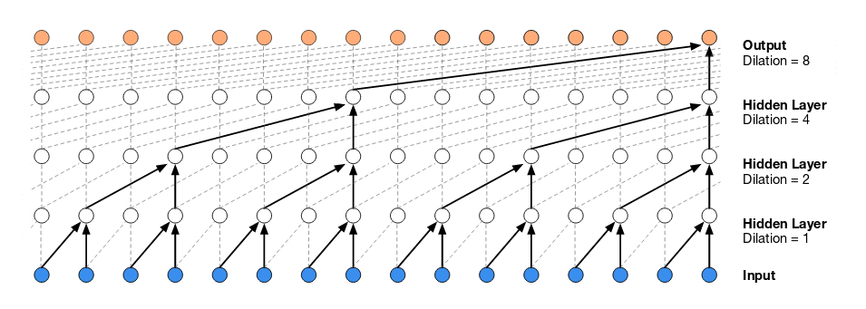
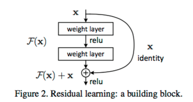

# Neural Machine Translation in Linear Time. Nal Kalchbrenner, Lasse Espeholt, Karen Simonyan, Aaron van den Oord, Alex Graves, Koray Kavukcuoglu.

<https://arxiv.org/pdf/1610.10099v1.pdf>

"ByteNet" architecture for neural machine translation which translates in linear time and can handle dependencies over large distances. It consists of two networks, a source (encoder) and a target (decoder).

The source network is formed of one-dimensional convolutional layers that use dilation.

The target network (the "ByteNet Decoder") is formed of one-dimensional convolutional layers that user dilation and are masked. It is "stacked" on the source network and generates variable-length outputs via "dynamic unfolding".

## Dynamic unfolding

The representation generated by the source network has the same length as the source sequence.

At each step, the target network takes the corresponding column from the source representation and generates an output. This continues until an end-of-sequence (EOS) symbol is produced by the target network. The source representation is automatically zero-padded as the steps go beyond its length and the output is conditioned on the source and target representations accumulated thus far.

---

## Dilated convolutions

_Dilated convolutions_ (also called _à trous_, "with holes") are a way of integrating knowledge of a larger area (i.e. the global context of an image) while only linearly increasing the number of parameters.

For a dilation size $d$, the kernel is subsampled every $d+1$ pixels, so a smaller kernel is "stretched" over a larger area. In this way the receptive field of units grow exponentially across layers, so you require less layers (and parameters) to account for larger contexts. The dilation size $d$ is doubled across layers (see the WaveNet graphic below).

It is like pooling or strided convolutions but results in an output with the same size as the input.

### References

- [Dilated Convolutions and Kronecker Factored Convolutions](http://www.inference.vc/dilated-convolutions-and-kronecker-factorisation/). Ferenc Huszár.
- <http://mathematica.stackexchange.com/questions/125971/can-someone-explain-how-the-dilation-in-the-convolutionallayer-works>
- [WaveNet: A Generative Model for Raw Audio](https://arxiv.org/pdf/1609.03499v2.pdf). Aaron van den Oord, Sander Dieleman, Heiga Zen, Karen Simonyan, Oriol Vinyals, Alex Graves, Nal Kalchbrenner, Andrew Senior, Koray Kavukcuoglu.

---

## Deep Residual Networks (ResNets)

A _deep residual network_ takes a convolutional neural network and adds shortcuts which take the input of an earlier layer and pass it directly to a later node (i.e. addition) of the network. The unit containing this shortcut is a "residual block". The result is that the other layer feeding into the addition node (in the example below, it is the second convolution layer) just adds a "residual" to the repeated input.

This can help with the vanishing gradient problem that occurs in deep networks.

Another example of a residual block, from [Deep Residual Learning for Image Recognition](http://arxiv.org/abs/1512.03385):

### References

- [Training and investigating Residual Nets](http://torch.ch/blog/2016/02/04/resnets.html). Sam Gross and Michael Wilber.