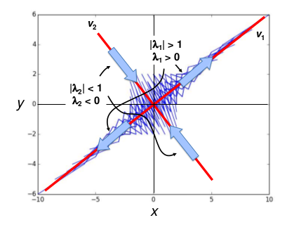
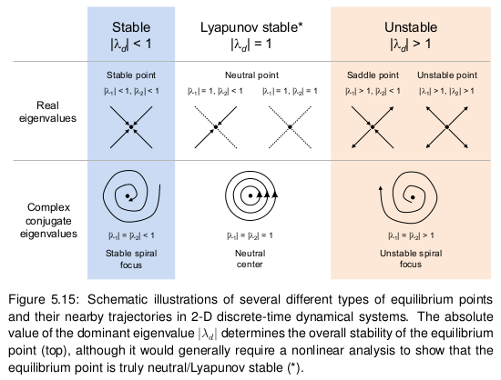
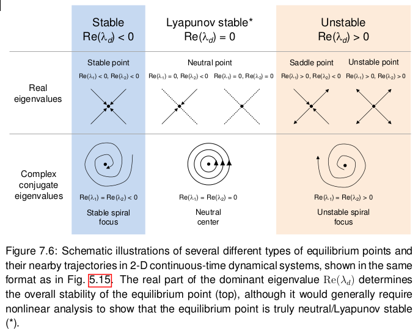

Notes for _Introduction to the Modeling and Analysis of Complex Systems_ (Hiroki Sayama).

_Emergence_ describes properties that are not present in the components of a system but occur at the level (scale) of the system as a result of the interaction between components.("the whole is greater than the sum of its parts"). You can't examine an individual component and see the emergent property there, and they can't be explained purely in terms of the component's properties - their interactions and relationships must be taken into account.

_Scale_ plays an important part in that the phenomena/emergent properties at each scale can be very different.

_Self-organization_ can also occur where coherent macroscopic structures and/or behaviors form over time.

Complex systems exhibit emergence (across scales) as a result of nonlinear interaction amongst their components and exhibit self-organization (across time).

"Nonlinear" refers to that the outputs (e.g. the next state of the system) cannot be expressed as a linear combination of inputs (e.g. the current state of the system). Note that linear equations are analytically solvable, whereas nonlinear equations generally are not.

An _analytical solution_ is a solution written in the form $x_t = f(t)$ without using state variables on the right-hand side, also called a _closed-form_ solution because the right-hand side is "closed".

A _model_ is just some (simplified) representation of a system (any kind of representation).

When modeling a complex system, you should consider:

- what are your goals? what questions do you want to answer?
- what is the structure of the system?
- what are the possible states?
- what are the dynamics of the system?

We prefer models that are simple, valid against empirical evidence, and robust to minor changes in modeling assumptions or parameters. There is often a trade-off between simplicity and validity (i.e. a more complex model can better conform to real-world observations, which introduces an overfitting problem).

Discrete-time dynamical systems are expressed as a _difference equation_ (also called a _recurrency equation_):

$$
x_t = F(x_{t-1}, t)
$$

or equivalently: $x_{t+1} = F(x_t, t)$

If there is no $t$ on the right, this is called an _iterative map_.

These are called difference equations because they can be translated easily into "difference" form:

$$
\Delta x = x_t - x_{t-1} = F(x_{t-1}, t) - x_{t-1}
$$

Continuous-time dynamical systems are expressed as a _differential equation_:

$$
\frac{dx}{dt} = F(x,t)
$$

In each case, $F$ is a function that determines the rules by which the system changes its state over time.

A _phase space_ is a space in which each state of the system is mapped to a unique spatial location. The number of state variables needed to uniquely specify the system's state (i.e. the dimensions of the space) is the _degrees of freedom_ in the system.

We can use phase space to visualize trajectories of the system through its various states. We may encounter attractors, etc (see other notes on complex systems) in phase space.

A _first-order system_ is one that involves only state variables of the immediate past (at time $t-1$). Any other system is a _higher-order system_.

An _autonomous system_ is a dynamical equation whose rules don't explicitly include time $t$ or any other external variables. A _non-autonomous system_ is a dynamical equation whose rules _do_ include time $t$ or other external variables explicitly.

Non-autonomous, higher-order difference equations can be converted into autonomous, first-order forms by introducing additional state variables.

For instance, consider the Fibonacci sequence, which is second-order:

$$
x_t = x_{t-1} + x_{t-2}
$$

We can introduce a "memory" variable $y$ such that $y_t = x_{t-1}$. Then re-write it as a first-order difference equation:

$$
x_t = x_{t-1} + y_{t-1}
$$

We can do something similar for converting non-autonomous equations into autonomous equations:

$$
\begin{aligned}
x_t &= x_{t-1} + t \\
z_t &= z_{t-1} + 1, z_0 = 1 \\
x_t &= x_{t-1} + z_{t-1}
\end{aligned}
$$

Linear dynamical systems can only show the following behaviors:

- exponential growth/decay
- periodic oscillations
- stationary states
- or some combination of the above
- when their coefficient matrices are non-diagonalizable, they can also show behaviors that are polynomials (or products of polynomials and exponentials) of time

These behaviors are indicative of linear systems.

The _asymptotic behavior_ of a system is what happens when time is taken to infinity.

## Discrete time

### Linear dynamical systems

We can describe the dynamics of a discrete-time linear dynamical system as:

$$
x_t = Ax_{t-1}
$$

where $x$ is the state vector and $A$ is the coefficient matrix.

This has the closed-form solution:

$$
x_t = A^t x_0
$$

The asymptotic behavior of such a system is described by having $t \to \infty$. We can turn $A^t$ into a more workable form using eigenvalues and eigenvectors.

Remember that eigenvalues $\lambda_i$ and eigenvectors $v_i$ of a matrix A are the scalars and vectors that satisfy:

$$
A v_i = \lambda_i v_i
$$

We can apply this to $A^t$:

$$
A^t v_i = A^{t-1}\lambda_i v_i = A^{t-2}\lambda_i^2 v_i = \dots = \lambda_i^t v_i
$$

Then we need to represent the initial state $x_o$ by using $A$'s eigenvectors as the basis vectors:

$$
x_0 = b_1 v_1 + b_2 v_2 + \dots + b_n v_n
$$

Where $n$ is the dimension of the state space (i.e. $A$ is an $n \times n$ matrix). We can assume that $A$ is diagonalizable so that we have $n$ linearly independent eigenvectors, thus we can use them as the basis vectors for $x_0$.

Now we have:

$$
\begin{aligned}
x_t &= A^t (b_1 v_1 + b_2 v_2 + \dots + b_n v_n) \\
&= b_1 A^t v_1 + b_2 A^t v_2 + \dots + b_n A^t v_n) \\
&= b_1 \lambda_1^t v_1 + b_2 \lambda_2^t v_2 + \dots + b_n \lambda_n^t v_n)
\end{aligned}
$$

So the largest (by absolute value) eigenvalue (called the _dominant_ eigenvalue)  will come to dominate this equation as $t$ increases. Thus we can say that as $t \to \infty$, $x_t \approx \lambda_i^t b_i v_i$, where $i$ is the index of the dominant eigenvalue. The dominant eigenvalue's corresponding dominant eigenvector will determine the direction the system's state goes in asymptotically. This asymptotic behavior occurs regardless of the system's initial state!

For these discrete-time models, the absolute value of the eigenvalues can tell us a lot about the system:

- if $|\lambda_i| > 1$, the component $v_i$ is growing
- if $|\lambda_i| < 1$, the component $v_i$ is shrinking
- if $|\lambda_i| = 1$, the component $v_i$ is conserved

We learn more from the dominant eigenvalue $\lambda_d$ as well:

- if $|\lambda_d| > 1$, the system is unstable, diverging to infinity
- if $|\lambda_d| < 1$, the system is stable, converging to the origin
- if $|\lambda_d| = 1$, the system is stable, but may converge to a non-zero equilibrium point

(from the textbook, figure 5.13)

The dynamics of a linear system are _decomposable_ into multiple independent one-dimensional exponential dynamics, each along the direction given by an eigenvector.

If the eigenvalues of the coefficient matrix are complex conjugate rather than real (i.e. because the matrix is asymmetric), it means that there is rotation happening in the phase space. In this case, the eigenvalues are still informative:

- if $|\lambda_i| > 1$, the component $v_i$ is rotating with expanding amplitude (i.e. spiraling out)
- if $|\lambda_i| < 1$, the component $v_i$ is rotating with shrinking amplitude (i.e. spiraling in)
- if $|\lambda_i| = 1$, the component $v_i$ is rotating with sustained amplitude

Also note that the list of eigenvalues for a system is called the (eigenvalue) _spectrum_ of the system.

### Nonlinear dynamical systems

Unfortunately this methodology of eigenvalues and eigenvectors cannot be applied to the asymptotic analysis of nonlinear dynamical systems.

Eigenvalues and eigenvectors can, however, be used to conduct _linear stability analysis_ of nonlinear systems, which describes the stability of the system at or near its equilibrium point by approximating the dynamics around that point as linear.

The general idea behind this is that we take the equilibrium point and perturb it slightly (by an infinitesimally small amount).

Say we have the nonlinear difference equation:

$$
x_t = F(x_{t-1})
$$

At the equilibrium point $x_{eq}$, by definition:

$$
x_{eq} = F(x_{eq})
$$

Then we slightly perturb it:

$$
x_{eq} + \Delta x_t = F(x_{eq} + \Delta x_t)
$$

Assuming $x_t$ is scalar, we scan approximate the right-hand side with the Taylor expansion:

$$
\begin{aligned}
F(x_{eq} + \Delta x_t) &= F(x_{eq}) + F'(x_{eq}) \Delta x_{t-1} + \frac{F''(x_{eq})}{2!}\Delta x_{t-1}^2 + \dots \\
&\approx F(x_{eq}) + F'(x_{eq}) \Delta x_{t-1}
\end{aligned}
$$

This yields us the simple linear difference equation:

$$
\Delta x_t \approx F'(x_{eq}) \Delta x_{t-1}
$$

From this we can see that if $|F'(x_{eq})| > 1$, $\Delta x$ grows exponentially, so the equilibrium point is unstable. If $|F'(x_{eq})| < 1$, then $\Delta x$ shrinks exponentially, so the equilibrium point is stable.

If $x_t$ is not scalar, but is instead a vector, we instead get (refer to the original text, pp91-92 for details):

$$
x_{eq} + \Delta x_t \approx F(x_{eq}) J \Delta x_{t-1}
$$

where $J$ is the Jacobian matrix of $F$ with respect to $x$ at $x_{eq}$, so that we get:

$$
\Delta x_t \approx J \Delta x_{t-1}
$$

Then we take the eigenvalues of $J$, looking at the dominant eigenvalue as shown previously. Note that we may have unstable equilibrium points with some stable eigenvalues - this is indicative of a saddle point.

When around an equilibrium $\lambda_d = 1$, it may be _Lyaponuv stable_, which means that the system's state neither diverges away from nor converges to the equilibrium point. Note that this is not a conclusive indicator of it being Lyaponuv stable!

The points about complex conjugates from before also apply here.

## Continuous time

Continuous time models are expressed in differential equations. To get the trajectory of the system's state over time, we just integrate over the differential equation that describes the system. This is usually done via simulation (i.e. numerically, for which there are many different methods, such as the _Euler forward method_).

The linear/nonlinear and autonomous/non-autonomous distinctions still apply here, though the first-order/higher-order distinction is a little different. Here, a first-order system is a differential equation that involves first-order derivatives of state variables ($\frac{dx}{ty}$) only. A higher-order system involves higher-order derivatives of state variables.

The conversion of non-autonomous, higher order equations to autonomous, first-order forms also holds here.

A general formula for continuous-time linear dynamical systems is given by:

$$
\frac{dx}{dt} = Ax
$$

where $x$ is the state vector of the system and $A$ is the coefficient matrix.

The asymptotic behavior of this equation has a closed-form solution:

$$
x(t) = e^{At}x(0)
$$

Where $e^X$ is a _matrix exponential_ for a square matrix $X$, defined as:

$$
e^X = \sum_{k=0}^\infty \frac{X^k}{k!}
$$

where $X^0 = I$ This infinite series converges to a square matrix that has the same size as $X$.

The matrix exponential $e^X$ has the following properties:

- its eigenvalues are exponentials of $X$'s eigenvalues
- its eigenvectors are the same length as $X$'s eigenvectors, i.e. $Xv = \lambda v \Rightarrow e^v e^{\lambda}v$

We assume that $A$ is diagonalizable (and thus has as many linearly independent eigenvectors as there are dimensions of state space).

So we represent the initial state of the system as:

$$
x(0) = b_1 v_1 + b_2 v_2 + \dots + b_n v_n
$$

We apply this to the asymptotic behavior equation:

$$
\begin{aligned}
x(t) &= e^{At}x(0) \\
&= e^{At}(b_1 v_2 + b_2 v_2 + \dots + b_n v_n) \\
&= b_1 e^{At} v_1 + b_2 e^{At} v_2 + \dots + b_n e^{At} v_n \\
&= b_1 e^{\lambda_1 t} v_1 + b_2 e^{\lambda_2 t} v_2 + \dots + b_n e^{\lambda_n t} v_n
\end{aligned}
$$

This is similar to what we saw for discrete time models except that now the asymptotic behavior is given by the summation of $e^{\lambda_i}$ rather than just $\lambda_i$. So the dominant term is the largest absolute value of $e^{\lambda_i}$.

Note that $|e^{\lambda_i}| = e^{\text{Re}(\lambda_i)}$, where $\text{Re}(\lambda_i)$ is the real component of $\lambda_i$, so the eigenvalue that has the largest real part is the dominant eigenvalue. If we say $\lambda_1$ is the dominant eigenvalue, then:

$$
\lim_{t \to \infty} \approx e^{\lambda_1 t} b_1 v_1
$$

Like with discrete-time models, we get a lot of info from the eigenvalues (the real part):

- $\text{Re}(\lambda) > 0$ means the component is growing
- $\text{Re}(\lambda) < 0$ means the component is shrinking
- $\text{Re}(\lambda) = 0$ means the component is conserved

For the dominant eigenvalue $\lambda_d$:

- $\text{Re}(\lambda_d) > 0$ means the system is unstable, diverging to infinity
- $\text{Re}(\lambda_d) < 0$ means the system is stable, converging to the origin
- $\text{Re}(\lambda_d) = 0$ means the system is stable, but may converge to a non-zero equilibrium point

Like with discrete-time nonlinear dynamical systems, we can also conduct linear stability analysis for continuous-time nonlinear dynamical systems.

If we have the nonlinear differential equation:

$$
\frac{dx}{dt} = F(x)
$$

The equilibrium point $x_{eq}$ satisfies, by definition:

$$
0 = F(x_{eq})
$$

Similar to discrete-time models, we apply the following replacement:

$$
x(t) \Rightarrow x_{eq} + \Delta x(t)
$$

which gives us:

$$
\frac{d(x_{eq} + \Delta x){dt} = \frac{d \Delta x}{dt} = F(x_{eq} + \Delta x)
$$

As before, the nonlinear function $F$ can be approximated using the Jacobian matrix $J$ of $F$ as $x = x_{eq}$, so we approximate the previous equation:

$$
\frac{d \Delta x}{dt} \approx F(x_{eq}) + J \Delta x
$$

The rest of the process is similar to linear stability analysis for discrete-time nonlinear dynamical systems. The main difference is that you only look at the real parts of the eigenvalues, and you compare them with 0, not one.

## Cellular Automata

_Automata_ are "machines" that change their internal state based on inputs and their previous state. _Cellular automata_ (CA) arrange these automata in a spatial grid, such that each automaton is affected by the states of their neighbors. The particular way their state is affected is defined by a _state-transition function_. The automata are _synchronously_ updated (i.e. simultaneously updated). CA models are discrete in both time and space.

The state $s_{t+1}(x)$ of an automaton at time $t+1$, located at position $x$, with the state-transition function $F$, is given by:

$$
s_{t+1}(x) = F(s_t(x + x_0), s_t(x + x_1), \dots, x_t(x+x_{n-1}))
$$

Where $N = \{x_0, x_1, \dots, x_{n-1}\}$ is the _neighborhood_ around a given automaton.

If a state-transition function gives an identical state to rotated configurations of automaton, it is said that the CA model has _rotational symmetry_. If all states of the CA are orientation-free and the rotation of a situation doesn't involve any rotation of the states themselves, the rotational symmetry is _strong_, otherwise, it is _weak_.

If the state-transition function depends only on the sum of the states of cells within the neighbors, the CA is _totalistic_. By definition, these totalistic state-transition functions are rotationally symmetric.

The states of a CA may be either _quiescent_ (it remains the same if all of its neighbors are in the same quiescent state, e.g. the "blank" state) or _non-quiescent_ (also called _active_ states because they change dynamically and interact with nearby states).

The _spatial boundary conditions_ of a CA must be specified, which describes behavior at the borders of the CA world:

- no boundaries - the space is infinite, expanding in all directions, filled with the quiescent state
- periodic boundaries - the space "wraps around" at the edges
- cut-off boundaries - the space just ends at the edges
- fixed boundaries - sets the cells at the edge of the finite space to have fixed states that never change

Cellular automata may also be stochastic (i.e. the state-transition function is stochastic), they may include multiple layers (i.e. cell states can be vectors rather than scalars), and they may be asynchronous, e.g. via random updating (randomly choosing cells to update at each time step), or sequential updating (updating cells in a specified order), state-triggered updating (certain states trigger updating of nearby cells), etc.

## Agent-based modeling

Involves many discrete agents. Analysis of ABMs is conducted in a more conventional experimental way, e.g. running Monte Carlo simulations, observing outcome distributions, and then determining if there is a significant difference.

Agents may be stateful, they may interact with one another, they may interact with their environment, and they may have predefined rules or learned behaviors.

Cellular automata and network models, because they are also composed of discrete components, are special cases of ABMs.

