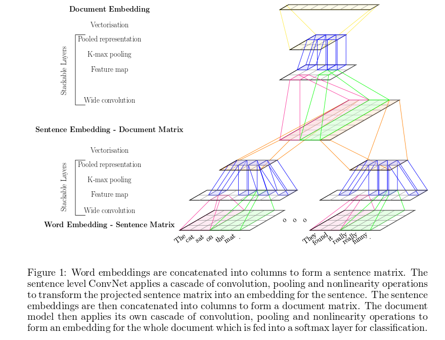

# Rush, A. M., Chopra, S., & Weston, J. (2015). A neural attention model for abstractive sentence summarization. arXiv preprint arXiv:1509.00685.

A factored scoring function $s$ which takes into account a fixed window of previous words:

$$
s(x,y) \approx \sum_{i=0}^{N-1} g(y_{i+1}, x, y_c)j
$$

where $y_c = y_{[i-C+1, \dots, i]}$ for a window of size $C$.

The conditional log probability of a summary given the input is:

$$
s(x,y) = \log p(y|x;\theta)
$$

which can be re-written as:

$$
\log p(y|x; \theta) \approx \sum_{i=0}^{N-1} \log p(y_{i+1}|x,y_c; \theta)
$$

- we make a Markov assumption on the length of the context as size $C$
- for $i < 1$, $y_i$ is a special start symbol

The focus is to model $p(y_{i+1}|x,y_c; \theta)$, which is modeled directly using a neural network with an encoder.

The model:

$$
\begin{aligned}
p(y_{i+1}|x,y_c; \theta) &\varpropto \exp(Vh + W \text{enc}(x, y_c)) \\
\bar y_c &= [E y_{i-C+1}, \dots, E y_i] \\
h &= \tanh(U \bar y_c)
\end{aligned}
$$

where:
- $E$ is the word embedding matrix
- $U, V, W$ are weight matrices
- $h$ is a hidden layer of size $H$

Various encoders were tried for $\text{enc}$:

1. $\text{enc}_1$: a bag-of-words encoder: embed the input sentence to size $H$, ignoring ordering

$$
\begin{aligned}
\text{enc}_1 &= p^T \bar x \\
p &= [1/M, \dots, 1/M] \\
\bar x &= [Fx_1, \dots, F x_M]
\end{aligned}
$$

where:

- $F$ is an embedding matrix
- $p$ is a uniform distribution over the $M$ input words

this encoder can capture relative importance of words but is limited in representing contiguous phrases.

2. $\text{enc}_2$: convolutional encoder: a time-delay neural network (TDNN) architecture, alternating b/w temporal convolution layers and max pooling layers (see paper for details)

3. $\text{enc}_3$: attention-based encoder: takes context $y_c$ into account:

$$
\begin{aligned}
\text{enc}_3 &= p^T \bar x \\
p &\varpropto \exp(\bar x P \bar{y_c'}) \\
\bar x &= [Fx_1, \dots, F x_M] \\
\bar{y_c'} &= [G y_{i-C+1}, \dots, G y_i] \\
\forall i \bar x_i &= \sum_{q=i-Q}^{i+Q} \frac{\bar x_i}{Q}
\end{aligned}
$$

where:

- $G$ is an embedding of the context
- $P$ is a new weight matrix parameter mapping between the context embedding and the input embedding
- $Q$ is a smoothing window

so the uniform distribution from the bag-of-words model is replaced with a learned soft alignment $P$ between the input and the summary

To train:

- mini-batch SGD
- minimize negative log-likelihood of summaries:

$$
-\sum_{j=1}^J \sum_{i=1}^{N-1} \log p(y_{i+1}^{(j)} | x^{(j)}, y_c; \theta)
$$

for $J$ input-summary pairs

To generate the summary, a beam-search decoder is used:

- input: parameters $\theta$, beam size $K$, input $x$
- output: approx. $K$-best summaries
- $\pi[0] \leftarrow \{\epsilon\}$
- $\mathcal S = \mathcal V$ if abstractive else $\{x_i | \forall i\}$
- for $i=0$ to $N-1$ do
    - generate hypotheses: $\mathcal N \leftarrow \{[y, y_{i+1}] | y \in \pi[i], y_{i+1} \in S\}$
    - hypothesis recombination: $\mathcal H \leftarrow \{ y \in \mathcal N | s(y,x) > s(y', x) \forall y' \in \mathcal N \text{ s.t. } y_c = y_c'\}$
    - filter $K$-max: $\pi[i+1] \leftarrow \text{K-argmax}_{y \in \mathcal H} g(y_{i+1}, y_c, x) + s(y,x)$
- return $\pi[N]$

---

# Denil, M., Demiraj, A., & de Freitas, N. (2014). Extraction of salient sentences from labelled documents. arXiv preprint arXiv:1412.6815.

- CNNs for both sentence and document levels
    - sentence level: transform word embeddings in each sentence into an embedding for the entire sentence
    - document level: transform sentence embeddings into an embedding for the entire document
- training: feed resulting document embeddings into a softmax classifier
- the convolution operations are one-dimensional
    - convolve along rows of the embedding matrices
    - at the sentence level this corresponds to convolving across words
    - at the document level this corresponds to convolving across sentences
    - wide ("full") convolutions are used
- outputs of feature maps are stacked to form a new matrix which is fed as input to the next layer
- the embedding matrices will have varying widths since sentences and documents have different lengths; this is an issue when using them as input to the softmax layer and between the sentence and document levels
    - k-max pooling is used to compensate, applied to each row of the embedding matrix separately (keep the $k$ largest values along that row and discard the rest)
- to actually _extract_ sentences:
    - a saliency map for the document is created by assigning an importance score to each sentence
    - this is accomplished by performing a forward pass through the network to generate a class prediction using the softmax layer
    - this class label is then inverted (a "pseudo-label") and this is fed to the loss function as the true label $\tilde y$
    - for input document $x$ and neural network $f(x)$ we approximate the loss as a linear function $L(\tilde y, f(x)) \approx w^T x + b$ where $w = \frac{\partial L}{\partial x}\Bigr|_{(\tilde y, f(x))}$
    - the vector $w$ has one entry for each word in the document
    - we can use $|w_i|$ as the measure of the salience of word $i$ (using the gradient magnitude tells us how important words are)
    - I do not understand what they propose for the rest of the extraction process but I think the basic idea is to use the gradient magnitude as saliency for each sentence as well, rank sentences that way and choose some top $m$ sentences

architecture:

---

# Chopra, S., Auli, M., Rush, A. M., & Harvard, S. E. A. S. Abstractive Sentence Summarization with Attentive Recurrent Neural Networks.

$$
P(y|x;\theta) = \prod_{t=1}^N p(y_t | \{y_1, \dots, y_{t-1}\}, x; \theta)
$$

recurrent decoder:

$$
P(y_t | \{y_1, \dots, y_{t-1}\}, x; \theta) = P_t = g_{\theta_1} (h_t, c_t)
$$

where $h_t$ is the hidden state of the RNN:

$$
h_t = g_{\theta_1} (y_{t-1}, h_{t-1}, c_t)
$$

where $c_t$ is the output of the encoder module; it is a context vector computed as a function of the current state $h_{t-1}$ and the input sequence $x$

more specifically, they experimented with two decoders: an Elman RNN and an LSTM

the Elman RNN:

$$
\begin{aligned}
h_t &= \sigma(W_1 y_{t-1} + W_2 h_{t-1} + W_3 c_t) \\
P_t &= \rho (W_4 h_t + W_5 c_t)
\end{aligned}
$$

where $\sigma$ is the sigmoid function, $\rho$ is the softmax, and $W_i$ are weight matrices.

The LSTM decoder:

$$
\begin{aligned}
i_t &= \sigma (W_1 y_{t-1} + W_2 h_{t-1} + W_3 c_t) \\
i_t' &= \tanh (W_4 y_{t-1} + W_5 h_{t-1} + W_6 c_t) \\
f_t &= \sigma (W_7 y_{t-1} + W_8 h_{t-1} + W_9 c_t) \\
o_t &= \sigma (W_{10} y_{t-1} + W_{11} h_{t-1} + W_{12} c_t) \\
m_t &= m_{t-1} \odot f_t + i_t \odot i_t' \\
h_t &= m_t \odot o_t \\
P_t &= \rho(W_{13} h_t + W_{14} c_t)
\end{aligned}
$$

The attentive encoder, which generates the context vector $c_t$:

- for an input sentence $x$, $x_i$ is the $d$-dimensional learnable embedding of the $i$-th word
- the position $i$ of the word $x_i$ is also associated with a learnable embedding $l_i$ of size $d$
- thus the full embedding for the $i$-th word in $x$ is given by $a_i = x_i + l_i$
- we also have a weight matrix used to convolve over the full embeddings of consecutive words, $B^k$; there are $d$ such matrices, i.e. $k \in \{1, \dots, d\}$. The convolution output is:

$$
z_{ik} = \sum_{h=-q/2}^{q/2} a_{i+h} b_{q/2+h}^k
$$

where $b_j^k$ is the $j$-th column of the matrix $B^k$.

so we have aggregate embedding vectors $z_i = [z_{i1}, \dots, z_{id}]$, one for each word $x_i$ in $x$. This essentially captures the word and its position and its surrounding context.

$q$ is the width of the convolution (set to 5 in the experiments).

the sequence is padded on both sides with dummy words for the words at the boundaries (start and end) of x.

the context vector $c_t$ (the encoder output) is computed:

$$
c_t = \sum_{j=1}^M a_{j,t-1} x_j
$$

the weights $\alpha_{j,t-1}$ are computed:

$$
a_{j,t-1} = \frac{\exp(z_j h_{t-1})}{\sum_{i=1}^M \exp(z_i h_{t-1})}
$$

training is accomplished with a dataset $\mathcal S$ of sentence-summary pairs. the model is trained with SGD to minimize the negative conditional log likelihood of the training data wrt $\theta$:

$$
\mathcal L = - \sum_{i=1}^S \sum_{t=1}^N \log P(y_t^i | \{y_1^i, \dots, y_{t-1}^i\}, x^i; \theta)
$$

then the beam-search procedure as described above is used to generate a summary for an input sentence $x$. The beam-search searches words such that $P(y|x)$ is maximized, i.e. $\argmax P(y_t|\{y_1, \dots, y_{t-1}\}, x)$, parameterized by the number of paths $k$ that are pursued at each time step

---

# Nallapati, R., Zhou, B., Gulçehre, Ç., & Xiang, B. Abstractive Text Summarization using Sequence-to-sequence RNNs and Beyond.

- the encoder consists of a bidirectional GRU-RNN and the decoder is a unidirectional GRU-RNN with the same hidden-state size as the encoder and an attention mechanism over the source-hidden states and a softmax layer over the target vocabulary to generate words (detailed more in Chung et al., 2014)
- the "large vocabulary trick" (LVT)
    - the decoder vocabulary of each mini-batch is restricted to the words in the source document of that batch
    - the most frequent words in the target dictionary are added until the vocab reaches a fixed size
    - to reduce computation at the softmax layer
- LVT limits vocab size for computational reasons but sacrifices the range of words available for a summary
    - this vocab can be re-expanded a bit by adding the 1-nearest-neighbors of each word in the source document (measured by cosine similarity in the word embeddings space)
- additionally generate embeddings mapping words to one-hot encodings of TF-IDF (discretized into bins) and POS tags, concatenated into a single vector. this replaces the word-based embeddings on the source side; on the target side the word-based embeddings are still used.
- because important keywords may be rare in the overall corpus (e.g. named entities) it may be difficult to learn enough about them
    - they propose a "switching decoder/pointer" architecture
    - can decide/switch between generating a word from the decoder or "pointing" back to a word position in the source text; that word is then just copied over to the output
    - an attention distribution over source word positions is used as the generative distribution for pointers
    - the switch is a sigmoid activation function over a linear layer based on the hidden state of the decoder, embedding vector from the previous emission and a context vector, i.e.:

$$
P(s_i) = \sigmoid(v^T(W_h h_i + W_e E[o{i-1}] + W_c c_i + b))
$$

where:

- $P(s_i)$ is the probability of the switch turning "on"
- $h_i$ is the hidden state at the $i$th time step of the decoder
- $E[o{i-1}]$ is the embedding vector of the emission from the previous time step
- $c_i$ is the attention-weighted context vector
- $W_h, W_e, W_c, b, v$ are model parameters

hierarchical encoder with hierarchical attention:
on the source side, there are two bi-directional RNNs: one at the word-level and one at the sentence-level. The word-level attention is re-weighted by the corresponding sentence-level attention and re-normalized as follows:

$$
a(i) = \frac{a_w(i) a_s(s(i))}{\sum_{k=1}^N a_w(k) a_s(s(k))}
$$

where $a_w(i)$ is the word-level attention weight at the $i$th position of the source and $s(i)$ is the id of the sentence at the $i$th word position, $a_s(j)$ is the sentence-level attention weight for the $j$th sentence in the source, $N$ is the number of words in the source document, and $a(i)$ is the re-scaled attention at the $i$th word position. This re-scale attention is then used to compute the attention-weighted context vector that goes as input to the hidden state of the decoder.

to generate the summary, beam search of size 5 was used.

---

# Lopyrev, K. (2015). Generating News Headlines with Recurrent Neural Networks. arXiv preprint arXiv:1512.01712.

Uses an encoder-decoder architecture; both the encoder and decoder are RNNs.

- encoder
    - the encoder receives the input text one word at a time
    - each word goes through an embedding layer to receive a word embedding
    - the embedding is combined using a NN with the hidden layers generated after feeding in the previous word (which is all 0's if it is the first word in the text)
- decoder
    - takes as input the hidden layers generated after feeding the last word of the input text
    - an end-of-sequence symbol is fed in as input (first passing it through the embedding layer)
    - using a softmax layer and attention mechanism, the decoder generates text, ending with an end-of-sequence symbol
    - after generating each word that same word is fed in as input when generating the next word

The log-loss function is used as the loss function:

$$
-\log p(y_1, \dots, y_{T'} | x_1, \dots, x_T) = - \sum{t=1}^{T'} \log p(y_t|y_1, \dots, y_{t-1}, x_1, \dots, x_T)
$$

where $y$ are the output words and $x$ are the input words

(refer to paper for more details)

---

# misc references

- <https://github.com/fchollet/keras/blob/master/examples/babi_memnn.py>
- <https://github.com/fchollet/keras/blob/master/examples/imdb_bidirectional_lstm.py>
- <https://github.com/udibr/headlines>
- <https://github.com/facebook/NAMAS>
- <https://github.com/carpedm20/neural-summary-tensorflow>
- <http://www.wildml.com/2016/01/attention-and-memory-in-deep-learning-and-nlp/>
- <http://benjaminbolte.com/blog/2016/keras-language-modeling.html>